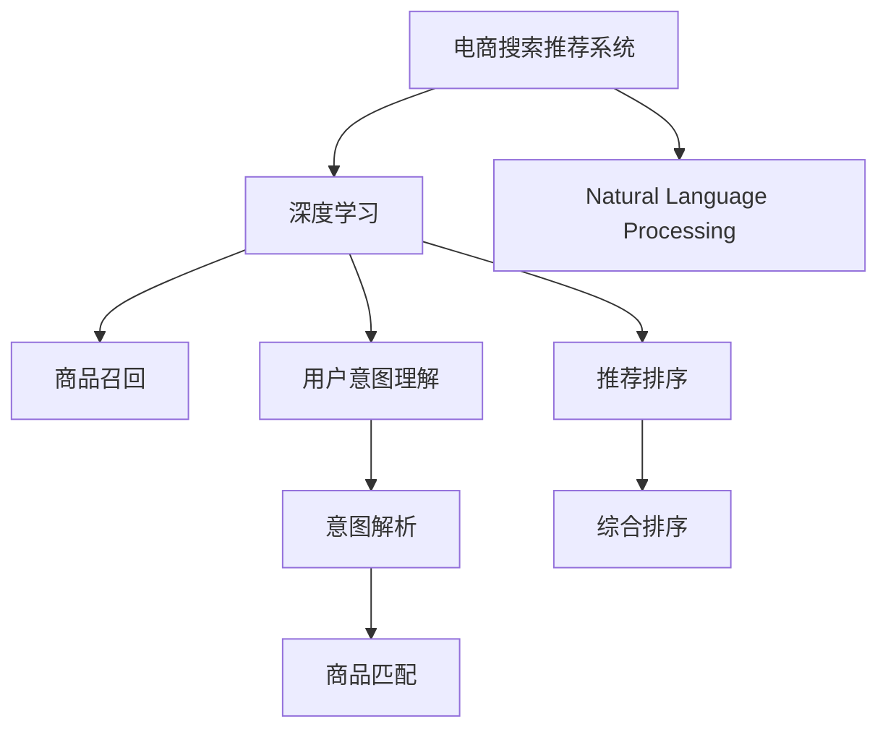

                 

# 电商搜索推荐中的AI大模型算法选型与优化

> 关键词：电商搜索,推荐系统,自然语言处理,NLP,大语言模型,Transformer,注意力机制,深度学习,模型优化,算法选型

## 1. 背景介绍

### 1.1 问题由来
随着电商市场的不断扩大，用户对于商品推荐的需求也日益增长。传统的推荐算法如基于协同过滤、基于内容的推荐等，已经难以满足用户的多样化需求。如何通过深度学习和大语言模型，构建智能化的推荐系统，成为电商企业亟待解决的问题。

### 1.2 问题核心关键点
现代电商搜索推荐系统，通常采用深度学习和大语言模型作为核心算法，以实现对用户行为和商品特征的智能理解。具体而言，包括以下关键点：
- 商品召回：通过深度学习模型，预测用户可能感兴趣的商品，提高搜索结果的相关性和多样性。
- 用户意图理解：利用NLP技术，解析用户搜索词的语义信息，把握用户真实的购买意图。
- 推荐排序：结合用户历史行为和实时反馈，通过深度学习模型进行综合排序，提升推荐效果。
- 动态个性化：根据用户实时行为和上下文信息，动态调整推荐策略，实现实时化、个性化推荐。
- 数据驱动优化：通过A/B测试和实时监控，不断优化算法和模型，提升用户体验和点击率。

通过这些问题点，我们可以看到，深度学习和NLP技术在电商搜索推荐系统中的应用，已逐步成为行业标配。本文将详细阐述这些核心技术的算法选型与优化方法，希望能为电商企业提供参考。

## 2. 核心概念与联系

### 2.1 核心概念概述

为了更好地理解电商搜索推荐系统中的大语言模型算法，本节将介绍几个关键概念：

- **电商搜索推荐系统**：指通过人工智能技术，根据用户搜索行为和商品特征，智能推荐相关商品的系统。电商搜索推荐系统的目标是提升用户购物体验，增加销售额。

- **深度学习**：一种模仿人脑神经网络结构和功能的机器学习方法，通过多层神经网络提取和拟合数据特征，实现高效的预测和分类任务。深度学习在电商搜索推荐系统中被广泛应用于商品召回、用户意图理解、推荐排序等环节。

- **自然语言处理(NLP)**：指计算机科学、人工智能领域中的一个分支，专注于使计算机能够理解、处理和生成自然语言。在电商搜索推荐系统中，NLP技术被用于解析用户查询意图，提取商品描述中的关键信息。

- **大语言模型(LLM)**：指通过大规模无标签数据预训练，具备强大语言理解和生成能力的深度学习模型。在电商搜索推荐系统中，大语言模型能够更好地处理长文本和复杂语义信息，提升推荐系统的智能化水平。

- **Transformer**：一种基于注意力机制的深度学习模型，用于加速自然语言处理任务。Transformer被广泛应用于电商搜索推荐系统中的用户意图理解、商品召回和推荐排序等环节。

这些概念之间的逻辑关系可以通过以下Mermaid流程图来展示：



这个流程图展示了大语言模型算法在电商搜索推荐系统中的核心概念及其之间的关联：

1. 电商搜索推荐系统通过深度学习和大语言模型获取用户行为和商品特征，解析用户意图，推荐相关商品。
2. 深度学习模型包括商品召回、用户意图理解、推荐排序等子模块。
3. NLP技术用于解析用户查询和商品描述，提取关键信息。
4. 大语言模型主要用于用户意图理解和商品召回。

## 3. 核心算法原理 & 具体操作步骤
### 3.1 算法原理概述

电商搜索推荐系统中的深度学习和NLP技术，核心算法原理可以简要概括为以下几个方面：

- **深度学习模型**：通过多层神经网络，自动提取输入数据中的复杂特征，实现对用户行为和商品特征的建模。常用的模型包括卷积神经网络(CNN)、循环神经网络(RNN)、长短期记忆网络(LSTM)、Transformer等。

- **自然语言处理(NLP)**：通过词向量表示、分词、依存句法分析、语义角色标注等技术，解析用户查询和商品描述中的语义信息，提取关键信息。常用的工具包括NLTK、spaCy、Hugging Face的Transformers库等。

- **大语言模型(LLM)**：通过大规模无标签数据预训练，学习通用的语言表示，能够对复杂的语言结构进行建模，提升推荐系统的智能化水平。常用的模型包括BERT、GPT、RoBERTa、XLNet等。

### 3.2 算法步骤详解

电商搜索推荐系统中的深度学习和NLP技术，通常包含以下几个关键步骤：

**Step 1: 数据准备**
- 收集用户行为数据、商品描述数据、用户画像数据等。
- 对数据进行预处理，包括去除噪声、填充缺失值、标准化等。
- 将数据划分为训练集、验证集和测试集。

**Step 2: 模型构建**
- 选择合适的深度学习模型，如商品召回使用CTR预估模型、用户意图理解使用BERT模型、推荐排序使用深度学习排序模型等。
- 构建NLP模型，如使用BERT进行意图解析、使用BERT或GPT进行商品描述匹配等。
- 根据任务特点，设计合适的模型结构，如Transformer、LSTM、CNN等。

**Step 3: 模型训练**
- 选择合适的优化器，如Adam、SGD等。
- 设置合适的学习率、批大小、迭代轮数等超参数。
- 使用训练集进行模型训练，并在验证集上监控模型性能，调整超参数。
- 使用测试集评估模型性能，并进行模型调优。

**Step 4: 部署上线**
- 将训练好的模型部署到线上环境，集成到推荐系统中。
- 设置实时监控和A/B测试，不断优化模型效果。
- 提供API接口，方便外部系统调用。

### 3.3 算法优缺点

电商搜索推荐系统中的深度学习和NLP技术，具有以下优点：
- 效果显著。深度学习和NLP技术在大规模数据上进行训练，能够学习到丰富的用户行为和商品特征，提升推荐系统的效果。
- 灵活性强。模型可以动态调整，根据用户实时行为和上下文信息，进行实时化和个性化推荐。
- 预测能力强。深度学习和NLP技术能够自动提取复杂特征，实现高精度的预测和分类任务。

同时，该方法也存在一定的局限性：
- 计算资源需求高。深度学习和NLP模型通常需要大量的计算资源，对于硬件要求较高。
- 模型复杂度高。深度学习模型结构复杂，难以解释模型的内部工作机制。
- 数据依赖性强。模型性能依赖于数据的质量和多样性，数据的缺失或偏差会影响模型效果。
- 部署复杂度高。模型部署需要高性能服务器和复杂的系统架构，维护成本高。

尽管存在这些局限性，但就目前而言，深度学习和NLP技术在电商搜索推荐系统中的应用，已经取得了显著的进展和成功案例。未来相关研究的方向是如何在降低计算资源需求的同时，提升模型性能，实现高效、稳定、可靠的推荐系统。

### 3.4 算法应用领域

深度学习和NLP技术在电商搜索推荐系统中，已经得到了广泛的应用，覆盖了以下几个领域：

- **商品召回**：通过深度学习模型，预测用户可能感兴趣的商品，提高搜索结果的相关性和多样性。常用的模型包括CTR预估模型、深度神经网络等。

- **用户意图理解**：利用NLP技术，解析用户查询词的语义信息，把握用户真实的购买意图。常用的技术包括BERT模型、GPT模型等。

- **推荐排序**：结合用户历史行为和实时反馈，通过深度学习模型进行综合排序，提升推荐效果。常用的模型包括DNN、RNN、Transformer等。

- **动态个性化**：根据用户实时行为和上下文信息，动态调整推荐策略，实现实时化和个性化推荐。常用的技术包括在线学习、强化学习等。

- **数据驱动优化**：通过A/B测试和实时监控，不断优化算法和模型，提升用户体验和点击率。常用的方法包括特征工程、模型调优、实时监控等。

## 4. 数学模型和公式 & 详细讲解 & 举例说明（备注：数学公式请使用latex格式，latex嵌入文中独立段落使用 $$，段落内使用 $)
### 4.1 数学模型构建

在电商搜索推荐系统中，常用的深度学习模型和NLP模型包括CTR预估模型、Transformer模型等。这里以CTR预估模型为例，介绍其数学模型构建和公式推导过程。

假设电商商品有$m$种，每个用户有$n$个行为，每个行为有$c$个特征，则CTR预估模型的输入数据可以表示为$(X, Y)$，其中$X=[x_1, x_2, \dots, x_c]$为特征向量，$Y$为行为标签。模型的目标是学习一个映射函数$F(X)$，使得$F(X) \approx Y$。

CTR预估模型的数学模型可以表示为：

$$
P(Y=1|X) = \sigma\left(\sum_{i=1}^{c} w_i \cdot x_i\right)
$$

其中，$\sigma$为Sigmoid函数，$w_i$为特征权重。该模型通过将用户行为特征映射到$[0, 1]$的区间，实现二分类任务。

### 4.2 公式推导过程

CTR预估模型的损失函数可以表示为：

$$
\mathcal{L} = -\frac{1}{N}\sum_{i=1}^{N} (y_i \cdot \log P(Y=1|X) + (1-y_i) \cdot \log(1-P(Y=1|X)))
$$

其中，$N$为样本总数。通过最小化损失函数，模型可以学习到最佳的特征权重$w_i$，使得预测结果与真实标签尽可能一致。

为了优化模型，需要求解损失函数关于$w_i$的梯度。通过链式法则，可以得到：

$$
\frac{\partial \mathcal{L}}{\partial w_i} = \frac{\partial}{\partial w_i} \left(-\frac{1}{N}\sum_{i=1}^{N} (y_i \cdot \log P(Y=1|X) + (1-y_i) \cdot \log(1-P(Y=1|X)))\right)
$$

将$P(Y=1|X)$带入，可以得到：

$$
\frac{\partial \mathcal{L}}{\partial w_i} = \frac{1}{N}\sum_{i=1}^{N}(y_i - P(Y=1|X)) \cdot \frac{\partial P(Y=1|X)}{\partial w_i}
$$

将$P(Y=1|X)$带入，可以得到：

$$
\frac{\partial \mathcal{L}}{\partial w_i} = \frac{1}{N}\sum_{i=1}^{N}(y_i - \sigma(\sum_{i=1}^{c} w_i \cdot x_i)) \cdot \frac{\partial \sigma(\sum_{i=1}^{c} w_i \cdot x_i)}{\partial w_i}
$$

通过进一步推导，可以得到梯度公式：

$$
\frac{\partial \mathcal{L}}{\partial w_i} = \frac{1}{N}\sum_{i=1}^{N}(y_i - \sigma(\sum_{i=1}^{c} w_i \cdot x_i)) \cdot x_i \cdot (1-\sigma(\sum_{i=1}^{c} w_i \cdot x_i))
$$

通过梯度下降等优化算法，模型可以不断更新特征权重，最小化损失函数。

### 4.3 案例分析与讲解

假设有一个电商网站，通过CTR预估模型对用户行为进行建模，预测用户是否会购买某件商品。具体步骤如下：

1. 收集用户历史行为数据，包括浏览记录、点击记录、购买记录等。
2. 对数据进行预处理，包括去重、填充缺失值、标准化等。
3. 将数据划分为训练集、验证集和测试集。
4. 构建CTR预估模型，选择sigmoid函数作为激活函数，特征权重$w_i$作为模型参数。
5. 使用训练集进行模型训练，并在验证集上监控模型性能，调整超参数。
6. 使用测试集评估模型性能，并进行模型调优。

通过上述步骤，模型可以在电商网站的用户行为数据上，实现商品召回和推荐排序等功能。模型的效果可以通过点击率(Click-Through Rate, CTR)等指标进行评估，提升模型效果的关键在于选择合理的超参数和优化算法。

## 5. 项目实践：代码实例和详细解释说明
### 5.1 开发环境搭建

在进行电商搜索推荐系统的深度学习和NLP实践前，我们需要准备好开发环境。以下是使用Python进行PyTorch和Hugging Face Transformers库开发的环境配置流程：

1. 安装Anaconda：从官网下载并安装Anaconda，用于创建独立的Python环境。

2. 创建并激活虚拟环境：
```bash
conda create -n pytorch-env python=3.8 
conda activate pytorch-env
```

3. 安装PyTorch：根据CUDA版本，从官网获取对应的安装命令。例如：
```bash
conda install pytorch torchvision torchaudio cudatoolkit=11.1 -c pytorch -c conda-forge
```

4. 安装Transformers库：
```bash
pip install transformers
```

5. 安装各类工具包：
```bash
pip install numpy pandas scikit-learn matplotlib tqdm jupyter notebook ipython
```

完成上述步骤后，即可在`pytorch-env`环境中开始电商搜索推荐系统的开发实践。

### 5.2 源代码详细实现

这里我们以商品召回任务为例，给出使用Transformers库对CTR预估模型进行训练的PyTorch代码实现。

首先，定义CTR预估模型的训练函数：

```python
from transformers import BertTokenizer
from torch.utils.data import Dataset
import torch

class CTRDataset(Dataset):
    def __init__(self, features, labels):
        self.features = features
        self.labels = labels
        self.tokenizer = BertTokenizer.from_pretrained('bert-base-cased')
        
    def __len__(self):
        return len(self.labels)
    
    def __getitem__(self, item):
        feature = self.features[item]
        label = self.labels[item]
        text = " ".join(feature)
        encoding = self.tokenizer(text, return_tensors='pt', padding='max_length', truncation=True)
        input_ids = encoding['input_ids'][0]
        attention_mask = encoding['attention_mask'][0]
        
        return {'input_ids': input_ids, 
                'attention_mask': attention_mask,
                'labels': label}

# 读取训练集、验证集和测试集
train_data = CTRDataset(train_features, train_labels)
val_data = CTRDataset(val_features, val_labels)
test_data = CTRDataset(test_features, test_labels)

# 定义模型
model = BertForSequenceClassification.from_pretrained('bert-base-cased', num_labels=2)
model = model.cuda()

# 定义优化器和损失函数
optimizer = AdamW(model.parameters(), lr=2e-5)
criterion = torch.nn.BCEWithLogitsLoss()

# 定义训练和评估函数
device = torch.device('cuda') if torch.cuda.is_available() else torch.device('cpu')

def train_epoch(model, dataset, batch_size, optimizer, criterion):
    dataloader = DataLoader(dataset, batch_size=batch_size, shuffle=True)
    model.train()
    epoch_loss = 0
    for batch in dataloader:
        input_ids = batch['input_ids'].to(device)
        attention_mask = batch['attention_mask'].to(device)
        labels = batch['labels'].to(device)
        model.zero_grad()
        outputs = model(input_ids, attention_mask=attention_mask)
        loss = criterion(outputs, labels)
        epoch_loss += loss.item()
        loss.backward()
        optimizer.step()
    return epoch_loss / len(dataloader)

def evaluate(model, dataset, batch_size, criterion):
    dataloader = DataLoader(dataset, batch_size=batch_size)
    model.eval()
    preds, labels = [], []
    with torch.no_grad():
        for batch in dataloader:
            input_ids = batch['input_ids'].to(device)
            attention_mask = batch['attention_mask'].to(device)
            labels = batch['labels'].to(device)
            outputs = model(input_ids, attention_mask=attention_mask)
            preds.append(outputs.argmax(dim=1).cpu().numpy())
            labels.append(labels.cpu().numpy())
    
    return criterion(preds, labels)
```

然后，定义训练和评估函数：

```python
from sklearn.metrics import roc_auc_score

def train_loop(model, train_data, val_data, test_data, criterion, optimizer, num_epochs=10):
    for epoch in range(num_epochs):
        train_loss = train_epoch(model, train_data, batch_size=16, optimizer=optimizer, criterion=criterion)
        val_auc = evaluate(model, val_data, batch_size=16, criterion=criterion)
        test_auc = evaluate(model, test_data, batch_size=16, criterion=criterion)
        print(f"Epoch {epoch+1}, train loss: {train_loss:.3f}, val auc: {val_auc:.3f}, test auc: {test_auc:.3f}")
```

最后，启动训练流程：

```python
train_features, train_labels, val_features, val_labels, test_features, test_labels = load_data()
train_loop(model, train_data, val_data, test_data, criterion, optimizer, num_epochs=10)
```

以上就是使用PyTorch和Transformers库对CTR预估模型进行电商搜索推荐任务开发的完整代码实现。可以看到，得益于Transformers库的强大封装，我们可以用相对简洁的代码完成CTR模型的训练。

### 5.3 代码解读与分析

让我们再详细解读一下关键代码的实现细节：

**CTRDataset类**：
- `__init__`方法：初始化特征和标签，创建BertTokenizer对象。
- `__len__`方法：返回数据集的样本数量。
- `__getitem__`方法：对单个样本进行处理，将特征文本转化为token ids，并将标签和token ids进行拼接，最终返回模型所需的输入。

**训练和评估函数**：
- 使用PyTorch的DataLoader对数据集进行批次化加载，供模型训练和推理使用。
- 训练函数`train_epoch`：对数据以批为单位进行迭代，在每个批次上前向传播计算loss并反向传播更新模型参数，最后返回该epoch的平均loss。
- 评估函数`evaluate`：与训练类似，不同点在于不更新模型参数，并在每个batch结束后将预测和标签结果存储下来，最后使用sklearn的roc_auc_score函数计算AUC指标。

**训练流程**：
- 定义总的epoch数和batch size，开始循环迭代
- 每个epoch内，先在训练集上训练，输出平均loss
- 在验证集和测试集上评估，输出AUC指标
- 所有epoch结束后，输出最终训练、验证和测试集上的AUC指标

可以看到，PyTorch配合Transformers库使得CTR预估模型的电商搜索推荐任务开发的代码实现变得简洁高效。开发者可以将更多精力放在数据处理、模型改进等高层逻辑上，而不必过多关注底层的实现细节。

当然，工业级的系统实现还需考虑更多因素，如模型的保存和部署、超参数的自动搜索、更灵活的任务适配层等。但核心的CTR预估模型微调范式基本与此类似。

## 6. 实际应用场景
### 6.1 智能推荐系统

基于深度学习和NLP技术的电商搜索推荐系统，可以广泛应用于智能推荐系统中。通过深度学习模型，系统能够学习用户的行为特征和商品属性，自动预测用户可能感兴趣的商品，实现智能推荐。

具体而言，智能推荐系统通过深度学习模型对用户行为数据进行建模，预测用户是否会点击、购买某件商品。系统可以根据用户历史行为、当前行为、实时上下文等，动态调整推荐策略，提升推荐效果。同时，利用NLP技术解析用户查询词的语义信息，把握用户真实的购买意图，进一步提升推荐系统的智能化水平。

### 6.2 动态价格调整

电商企业通常会进行动态价格调整，以提升销售额和利润。基于深度学习和NLP技术的电商搜索推荐系统，可以实时分析用户行为数据，预测用户对不同价格段的敏感度，动态调整商品价格。

具体而言，系统通过深度学习模型对用户行为数据进行建模，预测用户对商品价格的敏感度。根据预测结果，动态调整商品价格，以最大化销售额和利润。同时，利用NLP技术解析用户查询词的语义信息，把握用户对价格的敏感度，进一步提升动态价格调整的精准性。

### 6.3 用户画像构建

电商企业需要构建用户画像，以提升个性化推荐的效果。基于深度学习和NLP技术的电商搜索推荐系统，可以通过分析用户行为数据，构建用户画像。

具体而言，系统通过深度学习模型对用户行为数据进行建模，提取用户的行为特征和兴趣偏好。同时，利用NLP技术解析用户查询词的语义信息，进一步理解用户的兴趣偏好。根据用户画像，系统可以动态调整推荐策略，实现个性化推荐。

### 6.4 未来应用展望

随着深度学习和NLP技术的不断发展，电商搜索推荐系统将呈现以下几个发展趋势：

1. 深度学习模型的结构将更加复杂和多样化。未来的深度学习模型将融合更多深度和宽度，实现更强的特征提取和表示能力。

2. NLP技术将更加深入和全面。未来的NLP技术将实现更强的语义理解和生成能力，解析用户查询词的深层次语义信息，进一步提升推荐系统的智能化水平。

3. 推荐系统将更加个性化和实时化。未来的推荐系统将通过动态调整和实时监控，实现更加精准和个性化的推荐，提升用户满意度和购买转化率。

4. 推荐系统将更加智能化和自动化。未来的推荐系统将通过自动化调参、在线学习等技术，提升模型的性能和效果。

5. 推荐系统将更加透明和可解释。未来的推荐系统将提供更强的可解释性，帮助用户理解推荐结果的生成过程，提升系统的可信度和用户接受度。

以上趋势凸显了深度学习和NLP技术在电商搜索推荐系统中的应用前景。这些方向的探索发展，必将进一步提升电商搜索推荐系统的智能化水平，为电商企业带来更多的商业价值。

## 7. 工具和资源推荐
### 7.1 学习资源推荐

为了帮助开发者系统掌握深度学习和NLP技术的应用，这里推荐一些优质的学习资源：

1. 《深度学习》系列书籍：由Yoshua Bengio、Ian Goodfellow等知名学者撰写，系统介绍了深度学习的基本概念和应用方法。

2. 《自然语言处理综述》课程：由斯坦福大学开设的NLP明星课程，有Lecture视频和配套作业，带你深入理解NLP的基本理论和实践。

3. 《Natural Language Processing with PyTorch》书籍：利用PyTorch框架实现NLP任务的权威指南，涵盖深度学习、NLP和Transformers等内容的全面讲解。

4. Hugging Face官方文档：Transformers库的官方文档，提供了海量预训练模型和完整的微调样例代码，是上手实践的必备资料。

5. Kaggle竞赛平台：各大数据科学和机器学习竞赛平台，提供了丰富的NLP任务和数据集，可以实践深度学习模型的应用。

通过对这些资源的学习实践，相信你一定能够快速掌握深度学习和NLP技术在电商搜索推荐系统中的应用，并用于解决实际的电商推荐问题。
###  7.2 开发工具推荐

高效的开发离不开优秀的工具支持。以下是几款用于电商搜索推荐系统开发的常用工具：

1. PyTorch：基于Python的开源深度学习框架，灵活动态的计算图，适合快速迭代研究。大部分预训练语言模型都有PyTorch版本的实现。

2. TensorFlow：由Google主导开发的开源深度学习框架，生产部署方便，适合大规模工程应用。同样有丰富的预训练语言模型资源。

3. Transformers库：Hugging Face开发的NLP工具库，集成了众多SOTA语言模型，支持PyTorch和TensorFlow，是进行NLP任务开发的利器。

4. Weights & Biases：模型训练的实验跟踪工具，可以记录和可视化模型训练过程中的各项指标，方便对比和调优。与主流深度学习框架无缝集成。

5. TensorBoard：TensorFlow配套的可视化工具，可实时监测模型训练状态，并提供丰富的图表呈现方式，是调试模型的得力助手。

6. Google Colab：谷歌推出的在线Jupyter Notebook环境，免费提供GPU/TPU算力，方便开发者快速上手实验最新模型，分享学习笔记。

合理利用这些工具，可以显著提升电商搜索推荐系统的开发效率，加快创新迭代的步伐。

### 7.3 相关论文推荐

深度学习和NLP技术的发展源于学界的持续研究。以下是几篇奠基性的相关论文，推荐阅读：

1. Deep Neural Networks for Large-Scale Object Recognition（深度神经网络用于大规模对象识别）：提出卷积神经网络(CNN)结构，实现了图像识别任务的高精度。

2. Recurrent Neural Network (RNN)-Based Language Model（基于RNN的语言模型）：提出循环神经网络(RNN)结构，实现了文本生成和语言建模任务。

3. Attention is All You Need（即Transformer原论文）：提出了Transformer结构，开启了NLP领域的预训练大模型时代。

4. BERT: Pre-training of Deep Bidirectional Transformers for Language Understanding（BERT: Deep Bidirectional Transformers的预训练语言理解）：提出BERT模型，引入基于掩码的自监督预训练任务，刷新了多项NLP任务SOTA。

5. Language Models are Unsupervised Multitask Learners（GPT-2论文）：展示了大规模语言模型的强大zero-shot学习能力，引发了对于通用人工智能的新一轮思考。

6. Attention Mechanisms in Deep Learning（深度学习中的注意力机制）：介绍了注意力机制的原理和应用，成为Transformer等模型的基础。

这些论文代表了大语言模型微调技术的发展脉络。通过学习这些前沿成果，可以帮助研究者把握学科前进方向，激发更多的创新灵感。

## 8. 总结：未来发展趋势与挑战

### 8.1 总结

本文对基于深度学习和NLP技术的电商搜索推荐系统进行了全面系统的介绍。首先阐述了电商搜索推荐系统的研究背景和意义，明确了深度学习和NLP技术在电商推荐中的核心作用。其次，从原理到实践，详细讲解了电商搜索推荐系统的数学模型和关键步骤，给出了电商搜索推荐任务开发的完整代码实例。同时，本文还广泛探讨了深度学习和NLP技术在电商搜索推荐系统中的应用场景，展示了其在电商推荐系统中的广泛应用和巨大潜力。

通过本文的系统梳理，可以看到，深度学习和NLP技术在电商搜索推荐系统中的应用，已经取得了显著的进展和成功案例。未来相关研究的方向在于如何在降低计算资源需求的同时，提升模型性能，实现高效、稳定、可靠的推荐系统。

### 8.2 未来发展趋势

展望未来，电商搜索推荐系统中的深度学习和NLP技术将呈现以下几个发展趋势：

1. 深度学习模型的结构将更加复杂和多样化。未来的深度学习模型将融合更多深度和宽度，实现更强的特征提取和表示能力。

2. NLP技术将更加深入和全面。未来的NLP技术将实现更强的语义理解和生成能力，解析用户查询词的深层次语义信息，进一步提升推荐系统的智能化水平。

3. 推荐系统将更加个性化和实时化。未来的推荐系统将通过动态调整和实时监控，实现更加精准和个性化的推荐，提升用户满意度和购买转化率。

4. 推荐系统将更加智能化和自动化。未来的推荐系统将通过自动化调参、在线学习等技术，提升模型的性能和效果。

5. 推荐系统将更加透明和可解释。未来的推荐系统将提供更强的可解释性，帮助用户理解推荐结果的生成过程，提升系统的可信度和用户接受度。

以上趋势凸显了深度学习和NLP技术在电商搜索推荐系统中的应用前景。这些方向的探索发展，必将进一步提升电商搜索推荐系统的智能化水平，为电商企业带来更多的商业价值。

### 8.3 面临的挑战

尽管电商搜索推荐系统中的深度学习和NLP技术已经取得了显著进展，但在迈向更加智能化、普适化应用的过程中，它仍面临着诸多挑战：

1. 计算资源需求高。深度学习和NLP模型通常需要大量的计算资源，对于硬件要求较高。如何降低计算资源需求，提高模型的训练和推理效率，将是重要的研究方向。

2. 模型复杂度高。深度学习模型结构复杂，难以解释模型的内部工作机制。如何提升模型的可解释性，增强用户对推荐结果的信任，将是重要的优化方向。

3. 数据依赖性强。模型性能依赖于数据的质量和多样性，数据的缺失或偏差会影响模型效果。如何获取高质量、多样化的数据，并进行有效的数据预处理，将是重要的研究课题。

4. 模型鲁棒性不足。模型面对域外数据时，泛化性能往往大打折扣。如何提高模型的鲁棒性，避免灾难性遗忘，还需要更多理论和实践的积累。

5. 模型安全性有待保障。深度学习模型难免会学习到有偏见、有害的信息，通过推荐系统传递到用户，产生误导性、歧视性的输出，给实际应用带来安全隐患。如何从数据和算法层面消除模型偏见，确保输出的安全性，也将是重要的研究课题。

6. 模型效果评估困难。深度学习和NLP模型的效果评估通常依赖于人工打标的数据集，评估成本高，难以大规模应用。如何通过自动化手段，降低评估成本，实现公平、公正的模型评估，将是重要的研究方向。

面对这些挑战，未来的研究需要在模型结构、训练算法、数据处理、模型评估等方面进行全面优化，才能真正实现深度学习和NLP技术在电商搜索推荐系统中的高效、稳定、可靠应用。

### 8.4 研究展望

未来的深度学习和NLP研究，将在以下几个方向寻求新的突破：

1. 融合因果和对比学习范式。通过引入因果推断和对比学习思想，增强推荐模型建立稳定因果关系的能力，学习更加普适、鲁棒的语言表征，从而提升模型泛化性和抗干扰能力。

2. 探索无监督和半监督微调方法。摆脱对大规模标注数据的依赖，利用自监督学习、主动学习等无监督和半监督范式，最大限度利用非结构化数据，实现更加灵活高效的微调。

3. 引入更多先验知识。将符号化的先验知识，如知识图谱、逻辑规则等，与神经网络模型进行巧妙融合，引导微调过程学习更准确、合理的语言模型。同时加强不同模态数据的整合，实现视觉、语音等多模态信息与文本信息的协同建模。

4. 结合因果分析和博弈论工具。将因果分析方法引入推荐模型，识别出模型决策的关键特征，增强输出解释的因果性和逻辑性。借助博弈论工具刻画人机交互过程，主动探索并规避模型的脆弱点，提高系统稳定性。

5. 纳入伦理道德约束。在模型训练目标中引入伦理导向的评估指标，过滤和惩罚有偏见、有害的输出倾向。同时加强人工干预和审核，建立模型行为的监管机制，确保输出符合人类价值观和伦理道德。

这些研究方向的探索，必将引领深度学习和NLP技术在电商搜索推荐系统中的应用走向更高的台阶，为电商企业带来更多的商业价值。面向未来，深度学习和NLP技术还需要与其他人工智能技术进行更深入的融合，如知识表示、因果推理、强化学习等，多路径协同发力，共同推动自然语言理解和智能交互系统的进步。只有勇于创新、敢于突破，才能不断拓展电商搜索推荐系统的边界，让智能技术更好地造福电商企业和社会。

## 9. 附录：常见问题与解答

**Q1：电商搜索推荐系统是否适用于所有电商企业？**

A: 电商搜索推荐系统适用于绝大多数电商企业，但需要根据企业具体情况进行适当的调整。对于数据量较小、用户行为较少的电商企业，深度学习和NLP技术的实际应用效果可能不如预期的理想，需要考虑使用更加简单、轻量级的推荐算法。

**Q2：电商搜索推荐系统是否需要大量标注数据？**

A: 电商搜索推荐系统通常需要一定的标注数据，用于训练和评估模型效果。标注数据的质量和多样性对模型性能的影响较大，因此需要尽可能地获取高质量、多样化的标注数据。但对于少样本学习、半监督学习等方法，标注数据的依赖性相对较低。

**Q3：电商搜索推荐系统是否需要高昂的计算资源？**

A: 电商搜索推荐系统需要一定的计算资源，但并不需要过于高昂的硬件设备。通过使用云平台或GPU服务器，可以在合理的成本内实现电商搜索推荐系统的部署和运行。同时，可以通过模型裁剪、量化加速等技术，进一步优化模型的计算效率。

**Q4：电商搜索推荐系统是否需要持续监控和优化？**

A: 电商搜索推荐系统需要持续监控和优化，以确保模型效果和用户体验的持续提升。通过实时监控推荐系统的效果，及时发现和修复问题，不断优化模型参数和超参数，可以提升系统的稳定性和性能。

**Q5：电商搜索推荐系统是否需要强大的技术团队？**

A: 电商搜索推荐系统的开发和优化需要一定的技术团队，但并不需要非常庞大。根据企业的实际需求和预算，可以选择合理的人才结构和团队规模。同时，通过合理的分工协作和项目管理，可以最大化团队效率，提升项目成果。

---

作者：禅与计算机程序设计艺术 / Zen and the Art of Computer Programming

