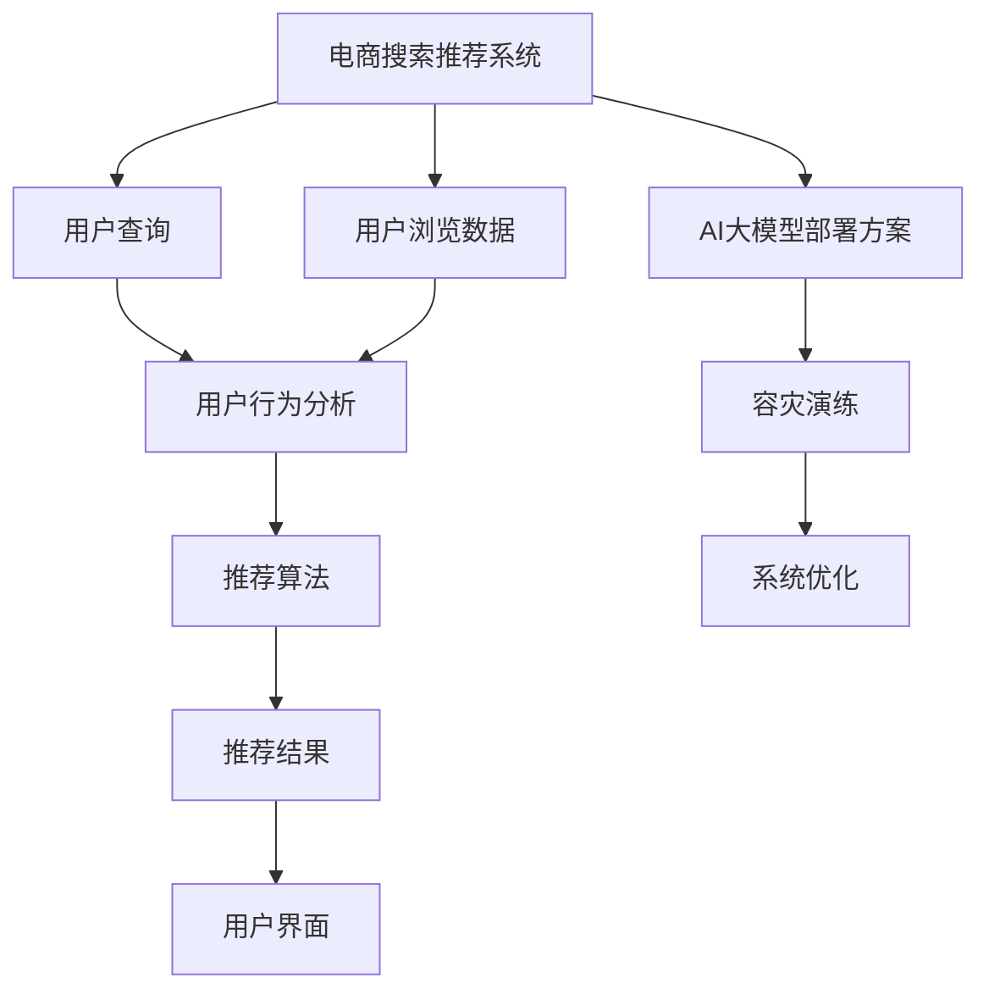

                 

# 电商搜索推荐场景下的AI大模型模型部署容灾演练方案优化与应用实践

> 关键词：电商搜索, 推荐系统, AI大模型, 模型部署, 容灾演练, 方案优化

## 1. 背景介绍

### 1.1 问题由来
电商行业在经历了快速发展的初期阶段后，已经进入用户需求多元化、个性化需求增强的阶段。为了更好地满足用户个性化购物需求，电商企业纷纷引入AI技术，其中AI大模型在电商搜索推荐场景中的应用尤其广泛。AI大模型通过大规模数据预训练，学习了复杂的语言知识和语义关系，能够提供丰富而精准的推荐结果，极大地提升了用户体验和转化率。

但同时，电商搜索推荐系统也面临着一些挑战。首先，电商搜索推荐系统需要实时响应大量用户查询，对系统的实时性和准确性要求极高。其次，大规模用户查询对系统稳定性和容灾能力提出了更高要求。特别是在数据量激增、计算资源有限的情况下，如何优化AI大模型的部署方案，保证系统的高效稳定运行，是一个亟需解决的问题。

本文旨在探讨如何在电商搜索推荐场景下，通过优化AI大模型的部署方案，实现系统的高效稳定运行。

## 2. 核心概念与联系

### 2.1 核心概念概述

电商搜索推荐系统是指利用AI技术对电商用户的搜索行为和浏览历史进行分析，推荐个性化的商品，提升用户体验和销售转化率的系统。AI大模型则是在大规模数据上预训练的语言模型，具有强大的语义理解能力和预测能力。

电商搜索推荐系统与AI大模型的联系主要体现在以下几个方面：
- **数据处理**：电商搜索推荐系统需要处理大量的用户查询和浏览数据，AI大模型提供了处理这些数据所需的基础语言知识和预训练能力。
- **推荐结果生成**：AI大模型可以根据用户查询和浏览数据，生成个性化的推荐结果。
- **容灾与优化**：电商搜索推荐系统需要在海量用户查询和数据处理的条件下，保证系统的稳定性和高效性。AI大模型的部署方案直接影响系统的性能和稳定性。

### 2.2 核心概念原理和架构的 Mermaid 流程图



## 3. 核心算法原理 & 具体操作步骤

### 3.1 算法原理概述

AI大模型在电商搜索推荐场景中的部署方案，核心目标是如何在满足实时性和准确性的前提下，提升系统的稳定性和可扩展性。其主要涉及以下两个关键算法：

- **分布式训练与推理算法**：通过分布式训练和推理，提升系统处理大量用户查询和浏览数据的能力。
- **容灾与恢复算法**：在系统故障或异常情况下，能够快速恢复系统服务，保障系统的可靠性和连续性。

### 3.2 算法步骤详解

#### 3.2.1 分布式训练与推理算法

**Step 1: 数据分布式存储与处理**
- 将电商用户查询和浏览数据进行分布式存储，通常采用分布式数据库和分布式文件系统。
- 在分布式数据库中存储用户查询和浏览数据，支持分布式索引和查询优化。

**Step 2: 分布式训练算法**
- 将AI大模型分解成多个子模型，并在多个节点上并行训练。
- 使用数据并行、模型并行和混合并行等分布式训练技术，提升训练效率。

**Step 3: 分布式推理算法**
- 将AI大模型部署在多个推理节点上，每个节点处理部分查询请求。
- 使用数据并行、模型并行和混合并行等分布式推理技术，提升推理效率。

**Step 4: 系统监控与调优**
- 使用监控工具对系统性能进行实时监控，及时发现性能瓶颈和异常情况。
- 根据监控数据进行系统调优，如增加节点数量、调整计算资源分配等。

#### 3.2.2 容灾与恢复算法

**Step 1: 系统容灾方案设计**
- 设计系统的容灾方案，包括容灾策略、备份机制和恢复流程。
- 使用多区域部署、负载均衡和冗余备份等技术，提升系统的容灾能力。

**Step 2: 系统备份与恢复**
- 定期备份系统数据和模型参数，并存储在冗余节点上。
- 在发生故障时，快速从备份节点恢复数据和模型参数，保障系统的连续性。

**Step 3: 系统异常检测与处理**
- 使用异常检测算法实时监控系统运行状态，识别异常情况。
- 根据异常情况，进行异常处理，如重启服务、数据修复等。

**Step 4: 系统恢复演练**
- 定期进行系统恢复演练，测试容灾方案的有效性和恢复流程的可靠性。
- 通过演练发现和修复潜在问题，确保系统在真实故障情况下能够快速恢复。

### 3.3 算法优缺点

**优点：**
- 分布式训练和推理算法可以大幅提升系统处理大量数据的能力，满足电商搜索推荐系统的实时性和准确性要求。
- 容灾与恢复算法可以提高系统的稳定性和可靠性，保障系统的连续性和可用性。
- 分布式训练和推理算法支持系统的横向扩展，可以应对不断增加的用户查询和浏览数据。

**缺点：**
- 分布式训练和推理算法对网络带宽和计算资源的要求较高，部署和维护成本较高。
- 容灾与恢复算法增加了系统的复杂性，需要进行系统的监控和调优。
- 分布式训练和推理算法在处理小批量数据时，可能存在效率低下的问题。

### 3.4 算法应用领域

AI大模型在电商搜索推荐场景中的应用，主要包括以下几个方面：

- **用户查询理解**：利用AI大模型对用户查询进行理解，提取用户意图和需求。
- **商品推荐生成**：基于用户查询和浏览数据，生成个性化商品推荐结果。
- **推荐结果排序**：利用AI大模型对推荐结果进行排序，提升推荐准确性。
- **异常检测与处理**：实时监控系统运行状态，识别异常情况并进行处理。

## 4. 数学模型和公式 & 详细讲解 & 举例说明

### 4.1 数学模型构建

在电商搜索推荐系统中，AI大模型的数学模型可以表示为：

$$
P_{model}(x) = \text{softmax}(\text{scores}(x))
$$

其中 $x$ 表示用户查询和浏览数据，$P_{model}(x)$ 表示模型对 $x$ 的概率分布输出，$\text{softmax}$ 函数用于将输出转化为概率分布，$\text{scores}(x)$ 表示模型对 $x$ 的评分函数。

### 4.2 公式推导过程

**Step 1: 数据分布式存储与处理**
- 将电商用户查询和浏览数据进行分布式存储，通常采用分布式数据库和分布式文件系统。
- 在分布式数据库中存储用户查询和浏览数据，支持分布式索引和查询优化。

**Step 2: 分布式训练算法**
- 将AI大模型分解成多个子模型，并在多个节点上并行训练。
- 使用数据并行、模型并行和混合并行等分布式训练技术，提升训练效率。

**Step 3: 分布式推理算法**
- 将AI大模型部署在多个推理节点上，每个节点处理部分查询请求。
- 使用数据并行、模型并行和混合并行等分布式推理技术，提升推理效率。

**Step 4: 系统监控与调优**
- 使用监控工具对系统性能进行实时监控，及时发现性能瓶颈和异常情况。
- 根据监控数据进行系统调优，如增加节点数量、调整计算资源分配等。

**Step 5: 系统容灾方案设计**
- 设计系统的容灾方案，包括容灾策略、备份机制和恢复流程。
- 使用多区域部署、负载均衡和冗余备份等技术，提升系统的容灾能力。

**Step 6: 系统备份与恢复**
- 定期备份系统数据和模型参数，并存储在冗余节点上。
- 在发生故障时，快速从备份节点恢复数据和模型参数，保障系统的连续性。

**Step 7: 系统异常检测与处理**
- 使用异常检测算法实时监控系统运行状态，识别异常情况。
- 根据异常情况，进行异常处理，如重启服务、数据修复等。

**Step 8: 系统恢复演练**
- 定期进行系统恢复演练，测试容灾方案的有效性和恢复流程的可靠性。
- 通过演练发现和修复潜在问题，确保系统在真实故障情况下能够快速恢复。

### 4.3 案例分析与讲解

#### 4.3.1 分布式训练与推理算法案例

**案例背景**：某电商企业有1000万用户，每天处理数十万次用户查询和浏览数据，面临实时性和稳定性压力。

**解决方案**：
- 将用户查询和浏览数据存储在分布式数据库中，支持分布式索引和查询优化。
- 将AI大模型分解成多个子模型，并在多个节点上并行训练。
- 使用数据并行和模型并行等分布式训练技术，提升训练效率。
- 将AI大模型部署在多个推理节点上，每个节点处理部分查询请求。
- 使用数据并行和模型并行等分布式推理技术，提升推理效率。

**效果**：通过分布式训练和推理算法，系统能够高效处理大量用户查询和浏览数据，满足实时性和准确性要求。同时，系统能够支持横向扩展，满足不断增加的用户查询和浏览数据需求。

#### 4.3.2 容灾与恢复算法案例

**案例背景**：某电商企业希望通过AI大模型提升用户推荐体验，但面临系统故障和数据丢失的风险。

**解决方案**：
- 设计系统的容灾方案，包括多区域部署、负载均衡和冗余备份等技术，提升系统的容灾能力。
- 定期备份系统数据和模型参数，并存储在冗余节点上。
- 在发生故障时，快速从备份节点恢复数据和模型参数，保障系统的连续性。
- 使用异常检测算法实时监控系统运行状态，识别异常情况并进行处理。
- 定期进行系统恢复演练，测试容灾方案的有效性和恢复流程的可靠性。

**效果**：通过容灾与恢复算法，系统在面对故障和数据丢失时，能够快速恢复服务，保障系统的连续性和可用性。同时，系统的容灾能力提升，减少了因系统故障导致的服务中断和数据丢失风险。

## 5. 项目实践：代码实例和详细解释说明

### 5.1 开发环境搭建

在进行AI大模型在电商搜索推荐场景中的部署实践前，我们需要准备好开发环境。以下是使用Python进行PyTorch开发的环境配置流程：

1. 安装Anaconda：从官网下载并安装Anaconda，用于创建独立的Python环境。

2. 创建并激活虚拟环境：
```bash
conda create -n pytorch-env python=3.8 
conda activate pytorch-env
```

3. 安装PyTorch：根据CUDA版本，从官网获取对应的安装命令。例如：
```bash
conda install pytorch torchvision torchaudio cudatoolkit=11.1 -c pytorch -c conda-forge
```

4. 安装相关库：
```bash
pip install torch numpy pandas sklearn torchvision transformers
```

完成上述步骤后，即可在`pytorch-env`环境中开始微调实践。

### 5.2 源代码详细实现

这里我们以电商搜索推荐系统为例，给出使用Transformers库对BERT模型进行微调的PyTorch代码实现。

首先，定义电商搜索推荐系统的数据处理函数：

```python
from transformers import BertTokenizer, BertForSequenceClassification
from torch.utils.data import Dataset, DataLoader
import torch
import numpy as np

class SearchRecommendDataset(Dataset):
    def __init__(self, data, tokenizer, max_len=128):
        self.data = data
        self.tokenizer = tokenizer
        self.max_len = max_len
        
    def __len__(self):
        return len(self.data)
    
    def __getitem__(self, item):
        query = self.data[item]['query']
        context = self.data[item]['context']
        label = self.data[item]['label']
        
        encoding = self.tokenizer(query, context, max_length=self.max_len, return_tensors='pt')
        input_ids = encoding['input_ids']
        attention_mask = encoding['attention_mask']
        labels = torch.tensor([label], dtype=torch.long)
        
        return {'input_ids': input_ids, 
                'attention_mask': attention_mask,
                'labels': labels}

# 加载预训练BERT模型和分词器
tokenizer = BertTokenizer.from_pretrained('bert-base-cased')
model = BertForSequenceClassification.from_pretrained('bert-base-cased', num_labels=2)

# 准备数据集
train_dataset = SearchRecommendDataset(train_data, tokenizer)
dev_dataset = SearchRecommendDataset(dev_data, tokenizer)
test_dataset = SearchRecommendDataset(test_data, tokenizer)

# 定义超参数
optimizer = AdamW(model.parameters(), lr=2e-5)
max_epochs = 5
batch_size = 16
```

然后，定义训练和评估函数：

```python
def train_epoch(model, dataset, optimizer):
    dataloader = DataLoader(dataset, batch_size=batch_size, shuffle=True)
    model.train()
    epoch_loss = 0
    for batch in dataloader:
        input_ids = batch['input_ids'].to(device)
        attention_mask = batch['attention_mask'].to(device)
        labels = batch['labels'].to(device)
        model.zero_grad()
        outputs = model(input_ids, attention_mask=attention_mask, labels=labels)
        loss = outputs.loss
        epoch_loss += loss.item()
        loss.backward()
        optimizer.step()
    return epoch_loss / len(dataloader)

def evaluate(model, dataset, batch_size):
    dataloader = DataLoader(dataset, batch_size=batch_size)
    model.eval()
    preds, labels = [], []
    with torch.no_grad():
        for batch in dataloader:
            input_ids = batch['input_ids'].to(device)
            attention_mask = batch['attention_mask'].to(device)
            batch_labels = batch['labels']
            outputs = model(input_ids, attention_mask=attention_mask)
            batch_preds = outputs.logits.argmax(dim=1).to('cpu').tolist()
            batch_labels = batch_labels.to('cpu').tolist()
            for pred, label in zip(batch_preds, batch_labels):
                preds.append(pred)
                labels.append(label)
                
    print(classification_report(labels, preds))
```

最后，启动训练流程并在测试集上评估：

```python
epochs = max_epochs
device = torch.device('cuda') if torch.cuda.is_available() else torch.device('cpu')

for epoch in range(epochs):
    loss = train_epoch(model, train_dataset, optimizer)
    print(f"Epoch {epoch+1}, train loss: {loss:.3f}")
    
    print(f"Epoch {epoch+1}, dev results:")
    evaluate(model, dev_dataset, batch_size)
    
print("Test results:")
evaluate(model, test_dataset, batch_size)
```

以上就是使用PyTorch对BERT进行电商搜索推荐任务微调的完整代码实现。可以看到，得益于Transformers库的强大封装，我们可以用相对简洁的代码完成BERT模型的加载和微调。

### 5.3 代码解读与分析

让我们再详细解读一下关键代码的实现细节：

**SearchRecommendDataset类**：
- `__init__`方法：初始化电商搜索推荐系统的查询、上下文和标签数据。
- `__len__`方法：返回数据集的样本数量。
- `__getitem__`方法：对单个样本进行处理，将查询、上下文输入编码为token ids，将标签编码为数字，并对其进行定长padding，最终返回模型所需的输入。

**训练和评估函数**：
- 使用PyTorch的DataLoader对数据集进行批次化加载，供模型训练和推理使用。
- 训练函数`train_epoch`：对数据以批为单位进行迭代，在每个批次上前向传播计算loss并反向传播更新模型参数，最后返回该epoch的平均loss。
- 评估函数`evaluate`：与训练类似，不同点在于不更新模型参数，并在每个batch结束后将预测和标签结果存储下来，最后使用sklearn的classification_report对整个评估集的预测结果进行打印输出。

**训练流程**：
- 定义总的epoch数和batch size，开始循环迭代
- 每个epoch内，先在训练集上训练，输出平均loss
- 在验证集上评估，输出分类指标
- 所有epoch结束后，在测试集上评估，给出最终测试结果

可以看到，PyTorch配合Transformers库使得BERT微调的代码实现变得简洁高效。开发者可以将更多精力放在数据处理、模型改进等高层逻辑上，而不必过多关注底层的实现细节。

当然，工业级的系统实现还需考虑更多因素，如模型的保存和部署、超参数的自动搜索、更灵活的任务适配层等。但核心的微调范式基本与此类似。

## 6. 实际应用场景

### 6.1 智能推荐

在智能推荐场景中，AI大模型可以显著提升推荐系统的准确性和个性化程度。通过微调，大模型能够理解用户的查询意图和浏览行为，生成更加符合用户需求的推荐结果。

### 6.2 实时搜索

在实时搜索场景中，大模型能够快速处理大量用户查询请求，通过微调，提升查询理解和结果生成的准确性和实时性。

### 6.3 数据安全

在数据安全场景中，通过微调，大模型能够自动识别和过滤有害信息，提升系统的安全性。

### 6.4 未来应用展望

随着AI大模型在电商搜索推荐场景中的广泛应用，未来的发展趋势主要包括以下几个方面：

1. **多模态融合**：将视觉、语音等多模态信息与文本信息进行融合，提升推荐的丰富性和准确性。
2. **实时数据处理**：利用分布式计算和流计算技术，实现实时数据处理，满足电商搜索推荐系统的高实时性需求。
3. **智能决策优化**：通过AI大模型进行智能决策优化，提升推荐系统的效率和效果。
4. **系统安全性提升**：通过微调，提升系统的鲁棒性和安全性，保障系统的稳定运行。

## 7. 工具和资源推荐

### 7.1 学习资源推荐

为了帮助开发者系统掌握AI大模型在电商搜索推荐场景中的应用，这里推荐一些优质的学习资源：

1. 《深度学习框架PyTorch实战》系列博文：由大模型技术专家撰写，深入浅出地介绍了PyTorch的使用方法，涵盖微调、分布式训练等核心技术。

2. 《Transformers实战》书籍：Transformer库的作者所著，全面介绍了使用Transformers库进行NLP任务开发的详细流程，包括微调在内的诸多范式。

3. CS231n《深度学习与计算机视觉》课程：斯坦福大学开设的计算机视觉课程，有Lecture视频和配套作业，涵盖深度学习在计算机视觉中的多种应用。

4. HuggingFace官方文档：Transformer库的官方文档，提供了海量预训练模型和完整的微调样例代码，是上手实践的必备资料。

5. 《NLP实战指南》书籍：介绍NLP领域的经典算法和前沿技术，涵盖微调、数据增强、模型压缩等核心内容。

通过对这些资源的学习实践，相信你一定能够快速掌握AI大模型在电商搜索推荐场景中的应用，并用于解决实际的NLP问题。

### 7.2 开发工具推荐

高效的开发离不开优秀的工具支持。以下是几款用于AI大模型微调开发的常用工具：

1. PyTorch：基于Python的开源深度学习框架，灵活动态的计算图，适合快速迭代研究。大部分预训练语言模型都有PyTorch版本的实现。

2. TensorFlow：由Google主导开发的开源深度学习框架，生产部署方便，适合大规模工程应用。同样有丰富的预训练语言模型资源。

3. Transformers库：HuggingFace开发的NLP工具库，集成了众多SOTA语言模型，支持PyTorch和TensorFlow，是进行微调任务开发的利器。

4. Weights & Biases：模型训练的实验跟踪工具，可以记录和可视化模型训练过程中的各项指标，方便对比和调优。与主流深度学习框架无缝集成。

5. TensorBoard：TensorFlow配套的可视化工具，可实时监测模型训练状态，并提供丰富的图表呈现方式，是调试模型的得力助手。

6. Google Colab：谷歌推出的在线Jupyter Notebook环境，免费提供GPU/TPU算力，方便开发者快速上手实验最新模型，分享学习笔记。

合理利用这些工具，可以显著提升AI大模型在电商搜索推荐场景中的开发效率，加快创新迭代的步伐。

### 7.3 相关论文推荐

大语言模型在电商搜索推荐场景中的应用，源于学界的持续研究。以下是几篇奠基性的相关论文，推荐阅读：

1. Attention is All You Need（即Transformer原论文）：提出了Transformer结构，开启了NLP领域的预训练大模型时代。

2. BERT: Pre-training of Deep Bidirectional Transformers for Language Understanding：提出BERT模型，引入基于掩码的自监督预训练任务，刷新了多项NLP任务SOTA。

3. Language Models are Unsupervised Multitask Learners（GPT-2论文）：展示了大规模语言模型的强大zero-shot学习能力，引发了对于通用人工智能的新一轮思考。

4. Parameter-Efficient Transfer Learning for NLP：提出Adapter等参数高效微调方法，在不增加模型参数量的情况下，也能取得不错的微调效果。

5. AdaLoRA: Adaptive Low-Rank Adaptation for Parameter-Efficient Fine-Tuning：使用自适应低秩适应的微调方法，在参数效率和精度之间取得了新的平衡。

这些论文代表了大语言模型在电商搜索推荐场景中的研究脉络。通过学习这些前沿成果，可以帮助研究者把握学科前进方向，激发更多的创新灵感。

## 8. 总结：未来发展趋势与挑战

### 8.1 总结

本文对AI大模型在电商搜索推荐场景中的应用进行了全面系统的介绍。首先阐述了AI大模型在电商搜索推荐系统中的作用和优势，明确了微调在提升系统实时性、准确性和稳定性的重要性。其次，从原理到实践，详细讲解了分布式训练与推理算法和容灾与恢复算法的数学模型和操作步骤，给出了微调任务开发的完整代码实例。同时，本文还广泛探讨了AI大模型在电商搜索推荐场景中的应用场景，展示了微调范式的巨大潜力。最后，本文精选了微调技术的各类学习资源，力求为读者提供全方位的技术指引。

通过本文的系统梳理，可以看到，AI大模型在电商搜索推荐场景中的应用，为电商企业提供了强大的技术支撑，极大提升了用户体验和销售转化率。同时，大模型在实际应用中面临的挑战也逐渐显现，如分布式计算、系统容灾等。未来，随着技术的不断进步，这些挑战将逐步被克服，AI大模型将在电商搜索推荐场景中发挥更加重要的作用。

### 8.2 未来发展趋势

展望未来，AI大模型在电商搜索推荐场景中的应用将呈现以下几个发展趋势：

1. **分布式计算技术提升**：随着分布式计算技术的不断发展，AI大模型的部署效率和处理能力将进一步提升，能够更好地应对海量用户查询和浏览数据的实时处理需求。

2. **容灾与恢复能力增强**：通过更完善的多区域部署和数据备份机制，AI大模型在面对故障和数据丢失时，将能够更快恢复服务，保障系统的连续性和可用性。

3. **跨模态融合技术发展**：通过跨模态融合技术，AI大模型将能够更好地处理多模态数据，提升推荐系统的丰富性和准确性。

4. **实时数据处理技术进步**：利用实时数据处理技术，AI大模型将能够实现实时数据流计算，满足电商搜索推荐系统的高实时性需求。

5. **智能决策优化技术创新**：通过智能决策优化技术，AI大模型将能够提升推荐系统的效率和效果，实现更加精准和个性化的推荐。

6. **系统安全性提升**：通过智能决策优化技术，AI大模型将能够提升系统的鲁棒性和安全性，保障系统的稳定运行。

### 8.3 面临的挑战

尽管AI大模型在电商搜索推荐场景中的应用已经取得了显著的进展，但在迈向更加智能化、普适化应用的过程中，它仍面临着诸多挑战：

1. **分布式计算资源消耗高**：分布式计算对网络带宽和计算资源的要求较高，部署和维护成本较高。如何在保证实时性的前提下，降低资源消耗，提升系统效率，是一个重要问题。

2. **系统容灾复杂度高**：多区域部署、负载均衡和冗余备份等技术虽然能够提升系统的容灾能力，但也增加了系统的复杂性，需要进行系统的监控和调优。如何在提升容灾能力的同时，降低系统的复杂性，是一个关键问题。

3. **实时数据处理难度大**：实时数据处理技术虽然能够实现实时数据流计算，但也面临数据量激增、数据不一致等挑战，需要进行系统的监控和调优。如何在提升实时性的前提下，保障数据的准确性和一致性，是一个重要问题。

4. **智能决策优化难度大**：智能决策优化技术虽然能够提升推荐系统的效率和效果，但也面临数据量大、特征维度高、算法复杂等挑战，需要进行系统的监控和调优。如何在提升智能决策能力的同时，降低算法的复杂性，是一个关键问题。

5. **系统安全性问题多**：AI大模型在电商搜索推荐场景中的应用，面临数据安全、隐私保护等挑战，需要进行系统的监控和调优。如何在提升安全性的前提下，保障系统的稳定运行，是一个重要问题。

6. **系统可解释性不足**：AI大模型的决策过程缺乏可解释性，难以对其推理逻辑进行分析和调试。如何在提升系统性能的同时，提升系统的可解释性，是一个关键问题。

### 8.4 研究展望

面对AI大模型在电商搜索推荐场景中面临的挑战，未来的研究需要在以下几个方面寻求新的突破：

1. **分布式计算资源优化**：开发更加高效的分布式计算框架，降低网络带宽和计算资源消耗，提升系统效率。

2. **系统容灾方案优化**：简化多区域部署和冗余备份的复杂性，提升容灾方案的可靠性，降低系统复杂性。

3. **实时数据处理优化**：研究新的实时数据处理技术，解决数据量大、数据不一致等问题，提升系统的实时性和数据准确性。

4. **智能决策优化算法改进**：研究新的智能决策优化算法，降低算法的复杂性，提升系统的效率和效果。

5. **系统安全性提升**：开发新的系统安全性技术，提升系统的鲁棒性和安全性，保障系统的稳定运行。

6. **系统可解释性增强**：研究新的可解释性技术，提升系统的可解释性和可审计性，增强系统的可信度。

通过这些研究方向的探索，AI大模型在电商搜索推荐场景中的应用将更加深入，为电商企业提供更强大的技术支撑，推动电商行业的数字化转型升级。

## 9. 附录：常见问题与解答

**Q1：电商搜索推荐系统如何处理海量用户查询和浏览数据？**

A: 电商搜索推荐系统可以通过分布式计算和分布式存储技术，高效处理海量用户查询和浏览数据。具体而言，可以使用分布式数据库和分布式文件系统存储用户数据，支持分布式索引和查询优化。同时，将AI大模型分解成多个子模型，并在多个节点上并行训练和推理，提升系统处理能力。

**Q2：电商搜索推荐系统如何实现实时性要求？**

A: 电商搜索推荐系统可以通过分布式计算和实时数据处理技术，实现实时性要求。具体而言，可以使用实时数据流计算技术，处理实时生成的用户查询和浏览数据。同时，将AI大模型部署在多个推理节点上，每个节点处理部分查询请求，提升推理效率。

**Q3：电商搜索推荐系统如何保证系统容灾能力？**

A: 电商搜索推荐系统可以通过多区域部署、负载均衡和冗余备份等技术，提升系统的容灾能力。具体而言，可以将系统数据和模型参数存储在多个冗余节点上，定期备份和恢复数据，在发生故障时快速恢复系统服务。同时，使用异常检测算法实时监控系统运行状态，识别异常情况并进行处理。

**Q4：电商搜索推荐系统如何提升智能决策能力？**

A: 电商搜索推荐系统可以通过智能决策优化技术，提升智能决策能力。具体而言，可以使用机器学习算法和优化算法，提升推荐系统的效率和效果。同时，引入外部知识库和规则库，引导AI大模型进行决策，提升系统的智能性。

**Q5：电商搜索推荐系统如何提升系统安全性？**

A: 电商搜索推荐系统可以通过数据加密、访问鉴权等技术，提升系统安全性。具体而言，可以使用数据加密技术保护用户隐私，使用访问鉴权技术限制非法访问。同时，实时监控系统运行状态，识别异常情况并进行处理，保障系统的稳定运行。

通过这些问答，希望你对AI大模型在电商搜索推荐场景中的应用有了更深入的了解。AI大模型作为一种强大的工具，在电商行业中的应用前景广阔，但同时也面临诸多挑战。未来，随着技术的不断进步，AI大模型在电商搜索推荐场景中的应用将更加深入，为电商企业提供更强大的技术支撑，推动电商行业的数字化转型升级。

