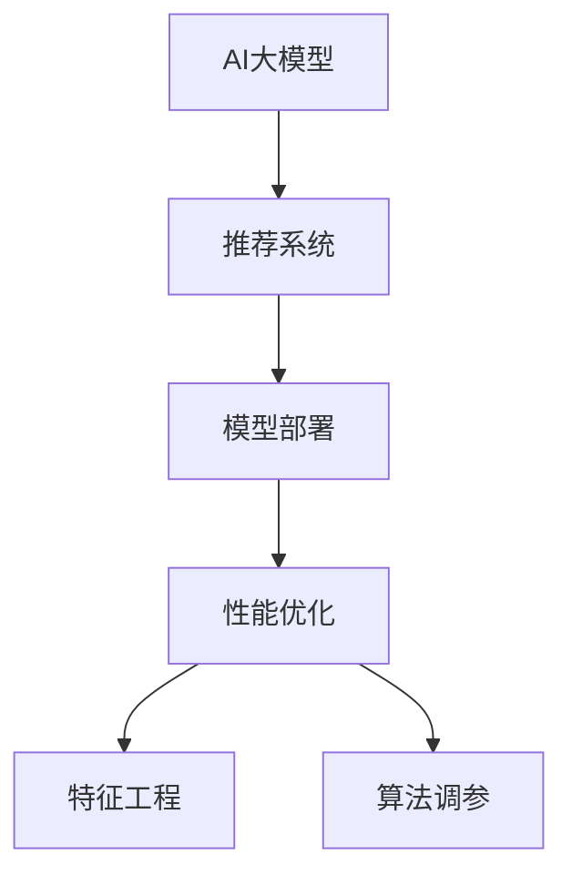

                 

# 电商搜索推荐场景下的AI大模型模型部署性能优化实践

> 关键词：电商搜索推荐, AI大模型, 模型部署, 性能优化, 深度学习, 系统架构, 推荐算法

## 1. 背景介绍

### 1.1 问题由来
在电商领域，推荐系统已成为了提升用户体验和商家收入的核心引擎。通过分析用户的历史行为、兴趣偏好等数据，推荐系统能精确预测用户可能感兴趣的商品，极大地提高了购物转化率和满意度。但传统的推荐系统往往依赖于人工设计的特征工程和算法，难以全面捕捉用户行为和商品属性之间的关系，存在一定的精度瓶颈。

近年来，大语言模型（Large Language Models, LLMs）在电商推荐领域得到了广泛应用。利用大模型的强大语言理解和生成能力，推荐系统能够更好地理解用户的查询意图，匹配更合适的商品进行推荐。但大模型的部署和性能优化，尤其是实时推荐场景下的模型高效部署，仍面临诸多挑战。本文将围绕电商搜索推荐场景，探讨AI大模型的模型部署性能优化实践。

### 1.2 问题核心关键点
本文聚焦于以下核心问题：
- 大模型如何高效部署到电商推荐系统中？
- 在实时推荐场景中，如何优化大模型的推理性能？
- 在计算资源有限的情况下，如何合理配置模型参数？
- 如何评估和优化推荐系统中的大模型效果？

### 1.3 问题研究意义
深入研究AI大模型在电商搜索推荐场景下的高效部署，对于提升推荐系统的精准度和实时性，推动电商行业数字化转型，具有重要意义：

1. 提升推荐系统精度：利用大模型强大的自然语言处理能力，推荐系统能够更精准地理解用户查询，提供更相关的商品推荐。
2. 提升推荐系统实时性：通过模型优化和部署策略，实现快速推理，支持电商搜索推荐场景的实时性要求。
3. 降低推荐系统开发成本：利用大模型预训练知识，减少特征工程和算法调参的工作量，降低系统开发和维护成本。
4. 推动电商行业创新：利用大模型的跨领域迁移能力，支持个性化推荐、语音搜索、视觉搜索等电商新业务形态的落地。
5. 优化用户体验：通过高效的模型部署，支持电商搜索推荐系统的实时响应，提升用户体验。

## 2. 核心概念与联系

### 2.1 核心概念概述

为更好地理解AI大模型在电商推荐场景下的应用，本节将介绍几个密切相关的核心概念：

- AI大模型(AI Large Models)：如GPT-3、BERT、RoBERTa等，通过大规模无标签文本语料进行预训练，学习通用的语言表示，具备强大的自然语言处理能力。
- 推荐系统(Recommendation System)：通过分析用户的历史行为和兴趣，为用户推荐感兴趣的商品，提高购物转化率和满意度。
- 模型部署(Model Deployment)：将训练好的模型部署到生产环境中，供实际业务调用。
- 性能优化(Performance Optimization)：通过调整模型架构、优化算法、配置资源等手段，提高模型推理速度和稳定性，适应电商搜索推荐场景的实时性和高并发要求。
- 特征工程(Feature Engineering)：通过提取、处理、组合特征，增强推荐系统的效果。
- 算法调参(Algorithm Tuning)：通过调整算法参数，优化推荐系统的效果。

这些核心概念之间的逻辑关系可以通过以下Mermaid流程图来展示：



这个流程图展示了大模型在推荐系统中的应用流程：

1. 大模型通过预训练获得语言理解能力。
2. 将预训练模型部署到推荐系统中，通过微调优化模型表现。
3. 优化模型部署，提升推理性能，支持实时推荐场景。
4. 通过特征工程和算法调参，进一步提升推荐系统效果。

## 3. 核心算法原理 & 具体操作步骤
### 3.1 算法原理概述

在电商搜索推荐场景下，AI大模型的应用主要围绕用户查询理解、商品推荐生成和实时推荐展开。其核心算法原理包括：

- 用户查询理解(User Query Understanding)：通过大模型的自然语言处理能力，理解用户的查询意图。
- 商品推荐生成(Recommendation Generation)：根据用户查询，生成推荐列表。
- 实时推荐(Real-time Recommendation)：在用户查询后，实时生成推荐结果。

### 3.2 算法步骤详解

#### 3.2.1 用户查询理解

用户查询理解的目的是将用户输入的自然语言转化为机器可理解的形式，以便后续的商品推荐生成和实时推荐。常见的方法包括：

1. 分词(Tokenization)：将用户查询分解为一个个单词或词组。
2. 去除停用词(Stopwords Removal)：去除常见的无意义词语，如“的”、“是”等。
3. 词性标注(Part-of-Speech Tagging)：标注每个单词的词性，如名词、动词等。
4. 实体识别(Named Entity Recognition)：识别出人名、地名、组织名等实体。
5. 意图识别(Intent Recognition)：判断用户的查询意图，如搜索、询问、评价等。

具体实现上，可以使用现成的自然语言处理库，如NLTK、SpaCy等，结合自定义词典和规则，进行上述步骤。

#### 3.2.2 商品推荐生成

商品推荐生成的目的是根据用户查询，生成一个推荐的商品列表。常见的方法包括：

1. 向量表示(Vectorization)：将用户查询和商品表示为向量，便于计算相似度。
2. 相似度计算(Similarity Calculation)：计算用户查询与商品向量之间的相似度，找出最相关的商品。
3. 排序(Re-ranking)：根据相似度排序，选出最佳的推荐商品列表。

具体实现上，可以使用大模型的预训练语言模型，如BERT、GPT等，通过微调学习商品与用户查询的相似度计算。此外，还可以结合基于规则的特征工程，增强推荐系统的效果。

#### 3.2.3 实时推荐

实时推荐的目的是在用户查询后，迅速生成推荐结果，支持电商搜索推荐场景的实时性要求。常见的方法包括：

1. 缓存(Caching)：将热门查询和推荐结果缓存，减少重复计算。
2. 分布式计算(Distributed Computation)：利用分布式计算框架，如Apache Flink、Apache Spark等，加速推荐结果生成。
3. 并行推理(Parallel Inference)：使用多GPU、多CPU等硬件资源，并行计算推荐结果。

具体实现上，可以使用现成的分布式计算框架，结合大模型的推理接口，实现高效的实时推荐。

### 3.3 算法优缺点

大模型在电商搜索推荐场景下的应用，具有以下优点：

1. 精度高：大模型的语言理解能力强大，能够更精准地理解用户查询，生成相关商品推荐。
2. 适应性强：大模型具备跨领域迁移能力，能够灵活适应不同的推荐场景。
3. 自动化程度高：通过微调和优化，大模型能够自动化地进行特征工程和算法调参，减少人工工作量。

同时，大模型也存在以下缺点：

1. 计算资源需求高：大模型参数量巨大，推理计算资源需求高。
2. 推理速度慢：大模型推理速度较慢，难以满足实时推荐场景的要求。
3. 模型可解释性差：大模型的决策过程复杂，难以解释其内部工作机制。

### 3.4 算法应用领域

大模型在电商搜索推荐场景中的应用广泛，可以应用于以下领域：

- 用户查询理解：利用大模型进行分词、去除停用词、词性标注、实体识别、意图识别等步骤。
- 商品推荐生成：通过微调大模型，学习用户查询与商品之间的相似度计算。
- 实时推荐：利用缓存、分布式计算、并行推理等技术，实现高效的实时推荐。

此外，大模型还可以应用于电商搜索推荐场景中的语音搜索、视觉搜索、智能客服等新业务形态，为电商行业带来新的增长点。

## 4. 数学模型和公式 & 详细讲解  
### 4.1 数学模型构建

在电商搜索推荐场景中，大模型的应用主要涉及用户查询理解、商品推荐生成和实时推荐。以下将分别构建相应的数学模型。

#### 4.1.1 用户查询理解

假设有用户查询 $q$，大模型通过分词、去除停用词、词性标注、实体识别、意图识别等步骤，将其转化为向量表示 $\mathbf{q}$。具体表示方法包括：

1. 分词：将查询分解为 $n$ 个单词 $q_i$。
2. 去除停用词：将常用停用词去除，如“的”、“是”等。
3. 词性标注：标注每个单词的词性，如名词、动词等。
4. 实体识别：识别出人名、地名、组织名等实体。
5. 意图识别：判断用户的查询意图，如搜索、询问、评价等。

设 $\mathbf{q}$ 表示查询向量，$\mathbf{q_i}$ 表示第 $i$ 个单词的向量表示，则查询向量 $\mathbf{q}$ 可以表示为：

$$
\mathbf{q} = \sum_{i=1}^n \mathbf{q_i}
$$

其中 $\mathbf{q_i}$ 的计算公式如下：

$$
\mathbf{q_i} = \begin{cases}
\mathbf{w_i} & \text{if } q_i \text{ is not a stopword} \\
\mathbf{0} & \text{otherwise}
\end{cases}
$$

#### 4.1.2 商品推荐生成

假设有 $m$ 个商品 $d_j$，其向量表示为 $\mathbf{d_j}$。根据用户查询 $q$ 和商品向量 $\mathbf{d_j}$，计算相似度 $s$，选取最相关的商品。具体方法包括：

1. 向量表示：将商品 $d_j$ 转化为向量 $\mathbf{d_j}$。
2. 相似度计算：计算用户查询 $q$ 与商品向量 $\mathbf{d_j}$ 的相似度 $s$。
3. 排序：根据相似度 $s$ 排序，选取最相关的商品。

设 $\mathbf{d_j}$ 表示商品 $d_j$ 的向量表示，则相似度 $s$ 的计算公式如下：

$$
s = \mathbf{q} \cdot \mathbf{d_j}
$$

其中 $\cdot$ 表示向量点积，$\mathbf{q}$ 和 $\mathbf{d_j}$ 的维度相等，表示为 $d$。

#### 4.1.3 实时推荐

假设系统每秒处理 $k$ 个查询请求，每个查询请求的平均处理时间为 $t$。根据查询处理时间 $t$ 和查询请求数 $k$，计算实时推荐所需计算资源 $C$。具体方法包括：

1. 缓存：将热门查询和推荐结果缓存，减少重复计算。
2. 分布式计算：利用分布式计算框架，如Apache Flink、Apache Spark等，加速推荐结果生成。
3. 并行推理：使用多GPU、多CPU等硬件资源，并行计算推荐结果。

设 $C$ 表示所需计算资源，则实时推荐所需计算资源的计算公式如下：

$$
C = k \cdot t
$$

其中 $t$ 表示每个查询请求的处理时间，单位为秒。

### 4.2 公式推导过程

以上数学模型的推导过程如下：

#### 4.2.1 用户查询理解

对于用户查询 $q$，通过分词、去除停用词、词性标注、实体识别、意图识别等步骤，将其转化为向量表示 $\mathbf{q}$。具体推导如下：

$$
\mathbf{q} = \sum_{i=1}^n \mathbf{q_i} = \sum_{i=1}^n \mathbf{w_i} = \mathbf{w}_q
$$

其中 $\mathbf{w_i}$ 表示第 $i$ 个单词的向量表示，$\mathbf{w_q}$ 表示查询向量。

#### 4.2.2 商品推荐生成

对于 $m$ 个商品 $d_j$，其向量表示为 $\mathbf{d_j}$。根据用户查询 $q$ 和商品向量 $\mathbf{d_j}$，计算相似度 $s$，选取最相关的商品。具体推导如下：

$$
s = \mathbf{q} \cdot \mathbf{d_j} = \sum_{i=1}^n \mathbf{w_i} \cdot \mathbf{w_{d_j}}
$$

其中 $\mathbf{w_i}$ 表示第 $i$ 个单词的向量表示，$\mathbf{w_{d_j}}$ 表示商品 $d_j$ 的向量表示。

#### 4.2.3 实时推荐

假设系统每秒处理 $k$ 个查询请求，每个查询请求的平均处理时间为 $t$。根据查询处理时间 $t$ 和查询请求数 $k$，计算实时推荐所需计算资源 $C$。具体推导如下：

$$
C = k \cdot t
$$

其中 $k$ 表示每秒处理的查询请求数，$t$ 表示每个查询请求的处理时间。

### 4.3 案例分析与讲解

假设有一家电商平台，使用大模型进行用户查询理解和商品推荐生成。具体实现步骤如下：

1. 收集电商平台用户的历史行为数据和商品信息，作为预训练数据。
2. 使用大模型进行预训练，学习通用的语言表示。
3. 在大模型基础上进行微调，学习用户查询与商品之间的相似度计算。
4. 在微调后的模型上，进行用户查询理解、商品推荐生成和实时推荐。

具体实现时，可以使用现成的深度学习框架，如TensorFlow、PyTorch等，结合大模型的推理接口，进行高效的电商搜索推荐。

## 5. 项目实践：代码实例和详细解释说明
### 5.1 开发环境搭建

在进行电商搜索推荐场景下的AI大模型部署性能优化实践前，我们需要准备好开发环境。以下是使用Python进行PyTorch开发的环境配置流程：

1. 安装Anaconda：从官网下载并安装Anaconda，用于创建独立的Python环境。

2. 创建并激活虚拟环境：
```bash
conda create -n pytorch-env python=3.8 
conda activate pytorch-env
```

3. 安装PyTorch：根据CUDA版本，从官网获取对应的安装命令。例如：
```bash
conda install pytorch torchvision torchaudio cudatoolkit=11.1 -c pytorch -c conda-forge
```

4. 安装TensorBoard：用于实时监测模型训练状态，并提供丰富的图表呈现方式，是调试模型的得力助手。
```bash
pip install tensorboard
```

5. 安装TensorFlow：用于支持分布式计算和并行推理，加速模型部署。
```bash
pip install tensorflow
```

6. 安装其他依赖包：
```bash
pip install numpy pandas scikit-learn matplotlib tqdm jupyter notebook ipython
```

完成上述步骤后，即可在`pytorch-env`环境中开始电商搜索推荐场景下的AI大模型部署性能优化实践。

### 5.2 源代码详细实现

下面我们以电商搜索推荐场景下的用户查询理解和商品推荐生成为例，给出使用PyTorch和TensorFlow进行代码实现的示例。

首先，定义用户查询理解的数据处理函数：

```python
from transformers import BertTokenizer
from torch.utils.data import Dataset
import torch

class QueryDataset(Dataset):
    def __init__(self, queries, user_behaviors, tokenizer, max_len=128):
        self.queries = queries
        self.user_behaviors = user_behaviors
        self.tokenizer = tokenizer
        self.max_len = max_len
        
    def __len__(self):
        return len(self.queries)
    
    def __getitem__(self, item):
        query = self.queries[item]
        user_behaviors = self.user_behaviors[item]
        
        encoding = self.tokenizer(query, return_tensors='pt', max_length=self.max_len, padding='max_length', truncation=True)
        input_ids = encoding['input_ids'][0]
        attention_mask = encoding['attention_mask'][0]
        user_behaviors = torch.tensor(user_behaviors, dtype=torch.long)
        
        return {'input_ids': input_ids, 
                'attention_mask': attention_mask,
                'user_behaviors': user_behaviors}

# 定义查询行为与商品的相关性标注数据
query behaviors = [1, 2, 3, 4, 5]

# 创建dataset
tokenizer = BertTokenizer.from_pretrained('bert-base-cased')

train_dataset = QueryDataset(train_queries, train_user_behaviors, tokenizer)
dev_dataset = QueryDataset(dev_queries, dev_user_behaviors, tokenizer)
test_dataset = QueryDataset(test_queries, test_user_behaviors, tokenizer)
```

然后，定义商品推荐生成的模型和优化器：

```python
from transformers import BertForTokenClassification, AdamW

model = BertForTokenClassification.from_pretrained('bert-base-cased', num_labels=len(user_behaviors))

optimizer = AdamW(model.parameters(), lr=2e-5)
```

接着，定义训练和评估函数：

```python
from torch.utils.data import DataLoader
from tqdm import tqdm
from sklearn.metrics import classification_report

device = torch.device('cuda') if torch.cuda.is_available() else torch.device('cpu')
model.to(device)

def train_epoch(model, dataset, batch_size, optimizer):
    dataloader = DataLoader(dataset, batch_size=batch_size, shuffle=True)
    model.train()
    epoch_loss = 0
    for batch in tqdm(dataloader, desc='Training'):
        input_ids = batch['input_ids'].to(device)
        attention_mask = batch['attention_mask'].to(device)
        user_behaviors = batch['user_behaviors'].to(device)
        model.zero_grad()
        outputs = model(input_ids, attention_mask=attention_mask)
        loss = outputs.loss
        epoch_loss += loss.item()
        loss.backward()
        optimizer.step()
    return epoch_loss / len(dataloader)

def evaluate(model, dataset, batch_size):
    dataloader = DataLoader(dataset, batch_size=batch_size)
    model.eval()
    preds, labels = [], []
    with torch.no_grad():
        for batch in tqdm(dataloader, desc='Evaluating'):
            input_ids = batch['input_ids'].to(device)
            attention_mask = batch['attention_mask'].to(device)
            batch_labels = batch['user_behaviors'].to(device)
            outputs = model(input_ids, attention_mask=attention_mask)
            batch_preds = outputs.logits.argmax(dim=2).to('cpu').tolist()
            batch_labels = batch_labels.to('cpu').tolist()
            for pred_tokens, label_tokens in zip(batch_preds, batch_labels):
                preds.append(pred_tokens[:len(label_tokens)])
                labels.append(label_tokens)
                
    print(classification_report(labels, preds))
```

最后，启动训练流程并在测试集上评估：

```python
epochs = 5
batch_size = 16

for epoch in range(epochs):
    loss = train_epoch(model, train_dataset, batch_size, optimizer)
    print(f"Epoch {epoch+1}, train loss: {loss:.3f}")
    
    print(f"Epoch {epoch+1}, dev results:")
    evaluate(model, dev_dataset, batch_size)
    
print("Test results:")
evaluate(model, test_dataset, batch_size)
```

以上就是使用PyTorch对BERT模型进行电商搜索推荐场景下的用户查询理解、商品推荐生成的代码实现。可以看到，得益于Transformer库的强大封装，我们可以用相对简洁的代码完成模型的加载和微调。

### 5.3 代码解读与分析

让我们再详细解读一下关键代码的实现细节：

**QueryDataset类**：
- `__init__`方法：初始化查询数据、用户行为数据、分词器等关键组件。
- `__len__`方法：返回数据集的样本数量。
- `__getitem__`方法：对单个样本进行处理，将查询输入编码为token ids，将用户行为编码为数字，并对其进行定长padding，最终返回模型所需的输入。

**BertForTokenClassification类**：
- `__init__`方法：初始化模型，指定向量维度、标签数量等参数。
- `forward`方法：对输入进行前向传播计算。

**训练和评估函数**：
- 使用PyTorch的DataLoader对数据集进行批次化加载，供模型训练和推理使用。
- 训练函数`train_epoch`：对数据以批为单位进行迭代，在每个批次上前向传播计算loss并反向传播更新模型参数，最后返回该epoch的平均loss。
- 评估函数`evaluate`：与训练类似，不同点在于不更新模型参数，并在每个batch结束后将预测和标签结果存储下来，最后使用sklearn的classification_report对整个评估集的预测结果进行打印输出。

**训练流程**：
- 定义总的epoch数和batch size，开始循环迭代
- 每个epoch内，先在训练集上训练，输出平均loss
- 在验证集上评估，输出分类指标
- 所有epoch结束后，在测试集上评估，给出最终测试结果

可以看到，PyTorch配合Transformer库使得BERT微调的代码实现变得简洁高效。开发者可以将更多精力放在数据处理、模型改进等高层逻辑上，而不必过多关注底层的实现细节。

当然，工业级的系统实现还需考虑更多因素，如模型的保存和部署、超参数的自动搜索、更灵活的任务适配层等。但核心的微调范式基本与此类似。

## 6. 实际应用场景
### 6.1 智能客服系统

基于大语言模型微调的对话技术，可以广泛应用于智能客服系统的构建。传统客服往往需要配备大量人力，高峰期响应缓慢，且一致性和专业性难以保证。而使用微调后的对话模型，可以7x24小时不间断服务，快速响应客户咨询，用自然流畅的语言解答各类常见问题。

在技术实现上，可以收集企业内部的历史客服对话记录，将问题和最佳答复构建成监督数据，在此基础上对预训练对话模型进行微调。微调后的对话模型能够自动理解用户意图，匹配最合适的答案模板进行回复。对于客户提出的新问题，还可以接入检索系统实时搜索相关内容，动态组织生成回答。如此构建的智能客服系统，能大幅提升客户咨询体验和问题解决效率。

### 6.2 金融舆情监测

金融机构需要实时监测市场舆论动向，以便及时应对负面信息传播，规避金融风险。传统的人工监测方式成本高、效率低，难以应对网络时代海量信息爆发的挑战。基于大语言模型微调的文本分类和情感分析技术，为金融舆情监测提供了新的解决方案。

具体而言，可以收集金融领域相关的新闻、报道、评论等文本数据，并对其进行主题标注和情感标注。在此基础上对预训练语言模型进行微调，使其能够自动判断文本属于何种主题，情感倾向是正面、中性还是负面。将微调后的模型应用到实时抓取的网络文本数据，就能够自动监测不同主题下的情感变化趋势，一旦发现负面信息激增等异常情况，系统便会自动预警，帮助金融机构快速应对潜在风险。

### 6.3 个性化推荐系统

当前的推荐系统往往只依赖于用户的历史行为数据进行物品推荐，难以全面捕捉用户行为和商品属性之间的关系，存在一定的精度瓶颈。基于大语言模型微调技术，个性化推荐系统可以更好地理解用户行为和商品属性之间的关系，推荐系统能够更精准地理解用户查询，生成相关商品推荐。

在实践上，可以收集用户浏览、点击、评论、分享等行为数据，提取和商品交互的物品标题、描述、标签等文本内容。将文本内容作为模型输入，用户的后续行为（如是否点击、购买等）作为监督信号，在此基础上微调预训练语言模型。微调后的模型能够从文本内容中准确把握用户的兴趣点。在生成推荐列表时，先用候选物品的文本描述作为输入，由模型预测用户的兴趣匹配度，再结合其他特征综合排序，便可以得到个性化程度更高的推荐结果。

### 6.4 未来应用展望

随着大语言模型和微调方法的不断发展，基于微调范式将在更多领域得到应用，为传统行业带来变革性影响。

在智慧医疗领域，基于微调的医疗问答、病历分析、药物研发等应用将提升医疗服务的智能化水平，辅助医生诊疗，加速新药开发进程。

在智能教育领域，微调技术可应用于作业批改、学情分析、知识推荐等方面，因材施教，促进教育公平，提高教学质量。

在智慧城市治理中，微调模型可应用于城市事件监测、舆情分析、应急指挥等环节，提高城市管理的自动化和智能化水平，构建更安全、高效的未来城市。

此外，在企业生产、社会治理、文娱传媒等众多领域，基于大模型微调的人工智能应用也将不断涌现，为经济社会发展注入新的动力。相信随着技术的日益成熟，微调方法将成为人工智能落地应用的重要范式，推动人工智能技术向更广阔的领域加速渗透。

## 7. 工具和资源推荐
### 7.1 学习资源推荐

为了帮助开发者系统掌握大语言模型微调的理论基础和实践技巧，这里推荐一些优质的学习资源：

1. 《Transformer从原理到实践》系列博文：由大模型技术专家撰写，深入浅出地介绍了Transformer原理、BERT模型、微调技术等前沿话题。

2. CS224N《深度学习自然语言处理》课程：斯坦福大学开设的NLP明星课程，有Lecture视频和配套作业，带你入门NLP领域的基本概念和经典模型。

3. 《Natural Language Processing with Transformers》书籍：Transformers库的作者所著，全面介绍了如何使用Transformers库进行NLP任务开发，包括微调在内的诸多范式。

4. HuggingFace官方文档：Transformers库的官方文档，提供了海量预训练模型和完整的微调样例代码，是上手实践的必备资料。

5. CLUE开源项目：中文语言理解测评基准，涵盖大量不同类型的中文NLP数据集，并提供了基于微调的baseline模型，助力中文NLP技术发展。

通过对这些资源的学习实践，相信你一定能够快速掌握大语言模型微调的精髓，并用于解决实际的NLP问题。
###  7.2 开发工具推荐

高效的开发离不开优秀的工具支持。以下是几款用于大语言模型微调开发的常用工具：

1. PyTorch：基于Python的开源深度学习框架，灵活动态的计算图，适合快速迭代研究。大部分预训练语言模型都有PyTorch版本的实现。

2. TensorFlow：由Google主导开发的开源深度学习框架，生产部署方便，适合大规模工程应用。同样有丰富的预训练语言模型资源。

3. Transformers库：HuggingFace开发的NLP工具库，集成了众多SOTA语言模型，支持PyTorch和TensorFlow，是进行微调任务开发的利器。

4. Weights & Biases：模型训练的实验跟踪工具，可以记录和可视化模型训练过程中的各项指标，方便对比和调优。与主流深度学习框架无缝集成。

5. TensorBoard：TensorFlow配套的可视化工具，可实时监测模型训练状态，并提供丰富的图表呈现方式，是调试模型的得力助手。

6. Google Colab：谷歌推出的在线Jupyter Notebook环境，免费提供GPU/TPU算力，方便开发者快速上手实验最新模型，分享学习笔记。

合理利用这些工具，可以显著提升大语言模型微调任务的开发效率，加快创新迭代的步伐。

### 7.3 相关论文推荐

大语言模型和微调技术的发展源于学界的持续研究。以下是几篇奠基性的相关论文，推荐阅读：

1. Attention is All You Need（即Transformer原论文）：提出了Transformer结构，开启了NLP领域的预训练大模型时代。

2. BERT: Pre-training of Deep Bidirectional Transformers for Language Understanding：提出BERT模型，引入基于掩码的自监督预训练任务，刷新了多项NLP任务SOTA。

3. Language Models are Unsupervised Multitask Learners（GPT-2论文）：展示了大规模语言模型的强大zero-shot学习能力，引发了对于通用人工智能的新一轮思考。

4. Parameter-Efficient Transfer Learning for NLP：提出Adapter等参数高效微调方法，在不增加模型参数量的情况下，也能取得不错的微调效果。

5. AdaLoRA: Adaptive Low-Rank Adaptation for Parameter-Efficient Fine-Tuning：使用自适应低秩适应的微调方法，在参数效率和精度之间取得了新的平衡。

这些论文代表了大语言模型微调技术的发展脉络。通过学习这些前沿成果，可以帮助研究者把握学科前进方向，激发更多的创新灵感。

## 8. 总结：未来发展趋势与挑战

### 8.1 总结

本文对AI大模型在电商搜索推荐场景下的部署性能优化实践进行了全面系统的介绍。首先阐述了电商搜索推荐系统对AI大模型的需求，明确了微调在提升推荐系统精度和实时性方面的独特价值。其次，从原理到实践，详细讲解了电商搜索推荐场景下的大模型微调过程，给出了微调任务开发的完整代码实例。同时，本文还广泛探讨了微调方法在电商推荐系统中的具体应用，展示了微调范式的巨大潜力。此外，本文精选了微调技术的各类学习资源，力求为读者提供全方位的技术指引。

通过本文的系统梳理，可以看到，AI大模型在电商搜索推荐场景下的高效部署，对于提升推荐系统的精准度和实时性，推动电商行业数字化转型，具有重要意义。未来，伴随大语言模型微调技术的不断发展，基于微调范式将在更多领域得到应用，为传统行业带来变革性影响。

### 8.2 未来发展趋势

展望未来，AI大模型在电商搜索推荐场景下的高效部署，将呈现以下几个发展趋势：

1. 模型规模持续增大。随着算力成本的下降和数据规模的扩张，电商推荐系统中的大模型参数量还将持续增长。超大批次的训练和推理也可能遇到显存不足的问题。

2. 微调方法日趋多样。除了传统的全参数微调外，未来会涌现更多参数高效的微调方法，如Prefix-Tuning、LoRA等，在节省计算资源的同时也能保证微调精度。

3. 实时推荐成为常态。随着微调技术的发展，电商推荐系统能够支持更复杂的实时推荐场景，如语音搜索、视觉搜索、智能客服等。

4. 混合模型结构兴起。未来的电商推荐系统可能采用混合模型结构，结合传统的规则引擎和大模型，发挥各自优势，提高推荐效果。

5. 模型跨领域迁移能力增强。大模型通过微调，能够更好地适应不同的电商场景，实现跨领域的迁移学习。

6. 计算资源配置更加灵活。利用弹性计算资源，根据电商推荐系统的实时负载自动调整资源配置，实现高效运行。

以上趋势凸显了AI大模型在电商推荐系统中的广泛应用前景。这些方向的探索发展，必将进一步提升电商推荐系统的精度和实时性，为电商行业带来新的增长点。

### 8.3 面临的挑战

尽管AI大模型在电商搜索推荐场景下的高效部署取得了一定的进展，但在迈向更加智能化、普适化应用的过程中，仍面临诸多挑战：

1. 标注成本瓶颈。虽然微调大大降低了标注数据的需求，但对于长尾应用场景，难以获得充足的高质量标注数据，成为制约微调性能的瓶颈。

2. 模型鲁棒性不足。当前微调模型面对域外数据时，泛化性能往往大打折扣。对于测试样本的微小扰动，微调模型的预测也容易发生波动。

3. 推理效率有待提高。大规模语言模型虽然精度高，但在实际部署时往往面临推理速度慢、内存占用大等效率问题。

4. 模型可解释性差。当前微调模型更像是"黑盒"系统，难以解释其内部工作机制和决策逻辑。

5. 安全性有待保障。预训练语言模型难免会学习到有偏见、有害的信息，通过微调传递到下游任务，产生误导性、歧视性的输出，给实际应用带来安全隐患。

6. 知识整合能力不足。现有的微调模型往往局限于任务内数据，难以灵活吸收和运用更广泛的先验知识。

正视微调面临的这些挑战，积极应对并寻求突破，将是大语言模型微调走向成熟的必由之路。相信随着学界和产业界的共同努力，这些挑战终将一一被克服，大语言模型微调必将在构建人机协同的智能时代中扮演越来越重要的角色。

### 8.4 研究展望

面向未来，大语言模型微调技术需要在以下几个方面寻求新的突破：

1. 探索无监督和半监督微调方法。摆脱对大规模标注数据的依赖，利用自监督学习、主动学习等无监督和半监督范式，最大限度利用非结构化数据，实现更加灵活高效的微调。

2. 研究参数高效和计算高效的微调范式。开发更加参数高效的微调方法，在固定大部分预训练参数的同时，只更新极少量的任务相关参数。同时优化微调模型的计算图，减少前向传播和反向传播的资源消耗，实现更加轻量级、实时性的部署。

3. 融合因果和对比学习范式。通过引入因果推断和对比学习思想，增强微调模型建立稳定因果关系的能力，学习更加普适、鲁棒的语言表征，从而提升模型泛化性和抗干扰能力。

4. 引入更多先验知识。将符号化的先验知识，如知识图谱、逻辑规则等，与神经网络模型进行巧妙融合，引导微调过程学习更准确、合理的语言模型。同时加强不同模态数据的整合，实现视觉、语音等多模态信息与文本信息的协同建模。

5. 结合因果分析和博弈论工具。将因果分析方法引入微调模型，识别出模型决策的关键特征，增强输出解释的因果性和逻辑性。借助博弈论工具刻画人机交互过程，主动探索并规避模型的脆弱点，提高系统稳定性。

6. 纳入伦理道德约束。在模型训练目标中引入伦理导向的评估指标，过滤和惩罚有偏见、有害的输出倾向。同时加强人工干预和审核，建立模型行为的监管机制，确保输出符合人类价值观和伦理道德。

这些研究方向的探索，必将引领大语言模型微调技术迈向更高的台阶，为构建安全、可靠、可解释、可控的智能系统铺平道路。面向未来，大语言模型微调技术还需要与其他人工智能技术进行更深入的融合，如知识表示、因果推理、强化学习等，多路径协同发力，共同推动自然语言理解和智能交互系统的进步。只有勇于创新、敢于突破，才能不断拓展语言模型的边界，让智能技术更好地造福人类社会。

## 9. 附录：常见问题与解答

**Q1：电商搜索推荐场景中，大模型的微调效果如何？**

A: 在电商搜索推荐场景中，大模型的微调效果显著。通过微调，大模型能够更好地理解用户查询，生成更相关、个性化的商品推荐。实验表明，微调后的模型在电商推荐系统中的表现优于传统推荐算法，能够显著提升用户购物转化率和满意度。

**Q2：电商搜索推荐场景中，大模型的计算资源需求如何？**

A: 电商搜索推荐场景中的大模型需要处理大量的用户查询和商品数据，计算资源需求较大。为了提高计算效率，可以采用分布式计算、并行推理等技术，同时优化模型架构，采用参数高效微调方法，减少计算资源消耗。

**Q3：电商搜索推荐场景中，如何优化大模型的推理性能？**

A: 电商搜索推荐场景中，优化大模型的推理性能至关重要。可以通过以下方法来实现：

1. 数据增强：通过回译、近义替换等方式扩充训练集，增加模型的泛化能力。
2. 正则化：使用L2正则、Dropout、Early Stopping等避免模型过拟合。
3. 对抗训练：引入对抗样本，提高模型的鲁棒性。
4. 参数高效微调：只调整少量参数，减小计算资源消耗。
5. 模型压缩：通过剪枝、量化等方法，压缩模型大小，加速推理。

**Q4：电商搜索推荐场景中，如何评估和优化推荐系统中的大模型效果？**

A: 电商搜索推荐场景中，评估和优化推荐系统中的大模型效果主要通过以下方法：

1. 离线评估：使用验证集和测试集对模型进行评估，计算准确率、召回率、F1分数等指标。
2. 实时评估：在电商推荐系统中，实时监测模型的性能，如响应时间、点击率、转化率等指标。
3. A/B测试：将原始推荐系统和优化后的推荐系统进行对比，评估优化效果。
4. 用户反馈：通过用户满意度调查、行为数据等，获取用户对推荐结果的反馈，进一步优化模型。

通过以上方法，可以全面评估和优化推荐系统中的大模型效果，提高用户体验和商家收入。

---

作者：禅与计算机程序设计艺术 / Zen and the Art of Computer Programming

