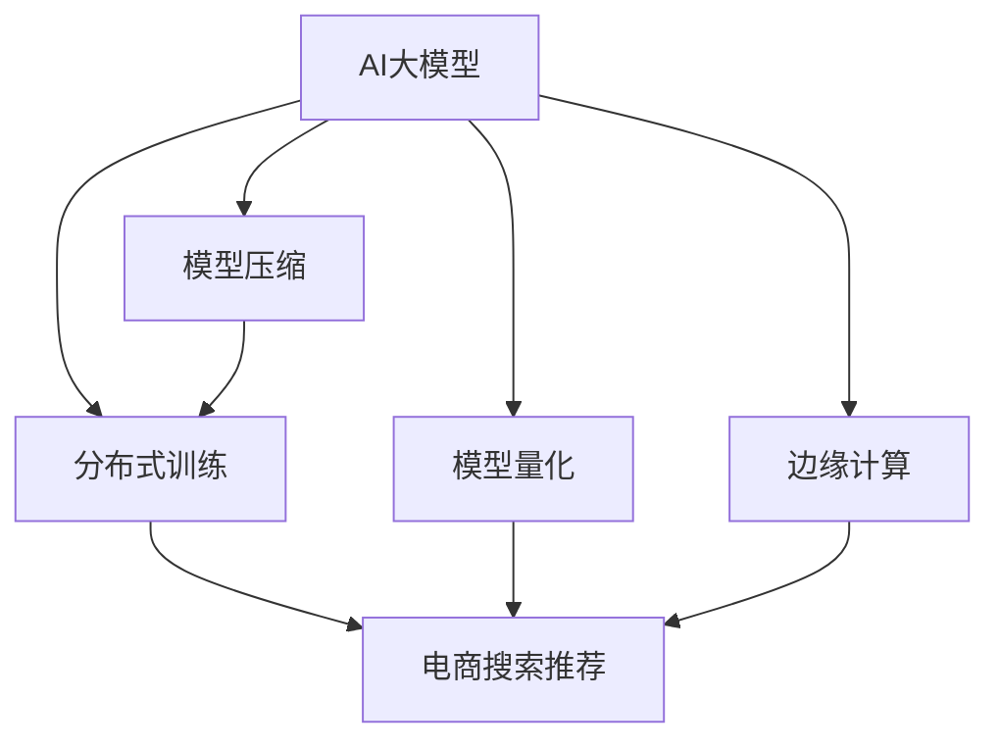

                 

# 电商搜索推荐场景下的AI大模型模型部署成本优化策略

> 关键词：AI大模型,电商搜索推荐,部署成本优化,模型压缩,分布式训练,模型量化,边缘计算

## 1. 背景介绍

### 1.1 问题由来

随着人工智能(AI)技术的飞速发展，深度学习模型在电商搜索推荐领域得到了广泛应用。以深度学习为基础的推荐系统，能够通过分析用户历史行为数据，预测用户兴趣，从而提供个性化的搜索结果和推荐内容。其中，以Transformer为代表的AI大模型，由于其强大的泛化能力和学习能力，成为电商推荐系统的重要组件。

然而，这些大模型的部署成本高昂。动辄数亿甚至数十亿参数的模型，需要大量的计算资源和存储资源进行训练和推理。这不仅增加了企业的运营成本，也限制了AI大模型的应用范围。如何优化AI大模型的部署成本，使其在电商搜索推荐等高负载场景下得到更广泛应用，成为了当前研究的热点问题。

### 1.2 问题核心关键点

电商搜索推荐场景下的AI大模型部署成本优化，涉及模型压缩、分布式训练、模型量化、边缘计算等多个关键点。其主要目标是通过技术手段，在保持模型性能的前提下，大幅降低模型部署成本，同时提高模型的实时响应能力和可扩展性。

核心问题可以总结为：

1. **模型压缩**：在不损失模型性能的前提下，通过参数剪枝、量化等技术手段，减少模型大小，降低内存占用。
2. **分布式训练**：通过多机并行训练，提高训练速度，减少单台机器的计算负担。
3. **模型量化**：将浮点模型转化为定点模型，减少计算精度损失，提高计算效率。
4. **边缘计算**：将模型部署到用户侧设备，减少网络传输开销，提升实时响应能力。

### 1.3 问题研究意义

在电商搜索推荐等对实时性和响应速度要求高的场景下，优化大模型的部署成本，对于提高用户体验、降低运营成本、提升业务效率具有重要意义：

1. **提升用户体验**：优化后的模型能够更快响应用户搜索请求，提供更及时准确的推荐结果。
2. **降低运营成本**：通过技术手段降低模型部署和维护成本，减少企业运营开支。
3. **提高业务效率**：快速响应用户请求，能够促进电商平台的销售转化率，提升业务效率。
4. **拓展应用范围**：降低模型部署成本，可以更容易在中小型电商平台上部署应用，扩展AI技术的应用边界。
5. **推动技术普及**：优化部署成本，让更多企业有能力采用AI大模型，推动AI技术的普及和应用。

## 2. 核心概念与联系

### 2.1 核心概念概述

为更好地理解电商搜索推荐场景下AI大模型的部署成本优化方法，本节将介绍几个密切相关的核心概念：

- **AI大模型(AI Large Model)**：以Transformer为代表的大规模深度学习模型，通常包含数亿乃至数十亿参数，具备强大的泛化能力和学习能力。
- **电商搜索推荐(E-commerce Search & Recommendation)**：电商平台利用推荐系统，根据用户搜索行为和历史数据，预测用户兴趣，提供个性化的搜索结果和商品推荐。
- **模型压缩(Model Compression)**：通过参数剪枝、量化等技术手段，减少模型大小，降低内存占用。
- **分布式训练(Distributed Training)**：通过多机并行训练，提高训练速度，减少单台机器的计算负担。
- **模型量化(Model Quantization)**：将浮点模型转化为定点模型，减少计算精度损失，提高计算效率。
- **边缘计算(Edge Computing)**：将模型部署到用户侧设备，减少网络传输开销，提升实时响应能力。

这些核心概念之间的逻辑关系可以通过以下Mermaid流程图来展示：



这个流程图展示了大模型的核心概念及其之间的关系：

1. 大模型通过压缩、量化、分布式训练等技术手段，降低部署成本，同时保持高性能。
2. 压缩后的模型通过分布式训练提升训练速度，降低单台机器的计算负担。
3. 量化后的模型通过边缘计算，减少网络传输开销，提升实时响应能力。
4. 最终优化后的模型部署到电商搜索推荐系统中，提升用户体验和业务效率。

## 3. 核心算法原理 & 具体操作步骤
### 3.1 算法原理概述

电商搜索推荐场景下的AI大模型部署成本优化，本质上是一个多目标优化问题。其核心思想是通过模型压缩、分布式训练、模型量化和边缘计算等技术手段，最大化模型性能，同时最小化部署成本。

形式化地，设大模型为 $M$，其模型大小为 $s$，计算资源消耗为 $c$，实时响应能力为 $r$，用户体验为 $u$，总成本为 $C$。目标函数为：

$$
\max_{M} u \times r \times s
$$

约束条件为：

$$
c + \sum_i c_i \leq C
$$

其中 $c$ 为单台机器计算资源消耗，$c_i$ 为分布式训练中第 $i$ 台机器的计算资源消耗。

优化过程需要平衡模型大小、计算资源、实时响应能力、用户体验等多重因素，通过技术手段最大化目标函数，同时满足计算资源约束。

### 3.2 算法步骤详解

电商搜索推荐场景下的AI大模型部署成本优化，一般包括以下几个关键步骤：

**Step 1: 准备数据和硬件资源**
- 收集电商平台的搜索行为、商品信息、用户偏好等数据，划分为训练集和测试集。
- 选择合适的硬件资源，如GPU、TPU等，配置分布式训练环境。

**Step 2: 设计模型架构**
- 选择合适的预训练模型，如BERT、GPT等，进行微调以适应电商推荐任务。
- 设计合适的模型架构，包括模型层数、宽度等。

**Step 3: 进行模型压缩**
- 对模型进行参数剪枝，去除冗余参数。
- 对模型进行量化，将浮点运算转换为定点运算。
- 使用蒸馏技术，通过小规模模型预测大模型输出，减少模型大小。

**Step 4: 进行分布式训练**
- 将训练集划分为多个小批次，分配到多台机器上进行并行训练。
- 设计合适的通信协议，保证数据同步和参数更新。
- 监控训练进度和资源使用情况，优化负载均衡。

**Step 5: 进行模型量化**
- 对量化后的模型进行性能测试，评估计算效率。
- 根据测试结果，调整量化参数，如定点位数、量化范围等。

**Step 6: 进行边缘计算**
- 将优化后的模型部署到用户侧设备，如智能手机、智能音箱等。
- 优化模型推理过程，减少计算开销。
- 提供离线功能，减少网络传输延迟。

**Step 7: 进行测试和优化**
- 在测试集上评估模型性能，对比优化前后的效果。
- 根据测试结果，进一步优化模型和部署策略。

### 3.3 算法优缺点

电商搜索推荐场景下的大模型部署成本优化方法具有以下优点：

1. **提升模型性能**：通过模型压缩和量化，在不损失模型性能的前提下，减小模型大小，降低内存占用。
2. **提高训练效率**：通过分布式训练，提升训练速度，减少单台机器的计算负担。
3. **增强实时响应能力**：通过边缘计算，将模型部署到用户侧设备，减少网络传输开销，提升实时响应能力。
4. **降低部署成本**：通过技术手段降低模型部署和维护成本，减少企业运营开支。
5. **扩展应用范围**：优化后的模型适用于中小型电商平台，拓展AI技术的应用边界。

同时，该方法也存在一定的局限性：

1. **模型性能下降**：压缩和量化可能导致模型性能轻微下降，需要在模型性能和计算效率之间做出权衡。
2. **分布式训练复杂**：多机并行训练需要协调通信协议，增加系统复杂性。
3. **硬件要求较高**：分布式训练和边缘计算需要高性能计算资源，可能增加硬件成本。
4. **实时响应有限**：边缘计算虽然提升实时响应能力，但可能存在设备性能瓶颈，需要进一步优化。

尽管存在这些局限性，但就目前而言，电商搜索推荐场景下的大模型部署成本优化方法仍是大规模应用的重要手段。未来相关研究的重点在于如何进一步降低优化成本，提高模型性能和实时响应能力，同时兼顾可解释性和伦理安全性等因素。

### 3.4 算法应用领域

电商搜索推荐场景下的大模型部署成本优化方法，在零售、电商、金融等行业领域已经得到了广泛的应用，为这些行业的数字化转型升级提供了新的技术路径。

1. **零售行业**：通过推荐系统，提供个性化的购物体验，提升用户满意度，促进销售转化率。
2. **金融行业**：利用推荐系统，提供个性化的理财建议，提高客户黏性和忠诚度。
3. **医疗行业**：通过推荐系统，提供个性化的健康咨询和医疗服务，提升医疗服务质量。
4. **娱乐行业**：利用推荐系统，提供个性化的娱乐内容推荐，提升用户体验。

除了上述这些经典应用外，电商搜索推荐场景下的大模型优化方法也在不断创新，如可控推荐、实时推荐、跨领域推荐等，为电商推荐系统带来了新的突破。

## 4. 数学模型和公式 & 详细讲解
### 4.1 数学模型构建

电商搜索推荐场景下的大模型部署成本优化，涉及多个目标和约束条件的优化问题。这里以推荐系统为例，构建数学模型：

设推荐系统为用户 $U$，物品 $I$，推荐目标函数为 $J$，目标为最大化推荐效果 $J$，约束为计算资源 $C$ 和推荐效果 $R$：

$$
\max_{M} J
$$

约束条件为：

$$
C + \sum_i C_i \leq C_{max}
$$

其中 $C$ 为单台机器计算资源消耗，$C_i$ 为分布式训练中第 $i$ 台机器的计算资源消耗，$C_{max}$ 为可用计算资源总和。

### 4.2 公式推导过程

电商搜索推荐场景下的大模型部署成本优化，可以通过多目标优化算法进行求解。这里以Pareto优化为例，推导多目标优化问题的求解公式：

设 $J_1$ 为目标函数，$J_2$ 为优化目标，$C$ 为计算资源约束，$C_i$ 为分布式训练中第 $i$ 台机器的计算资源消耗。则多目标优化问题可以表示为：

$$
\max_{M} \{J_1, J_2\}
$$

约束条件为：

$$
C + \sum_i C_i \leq C_{max}
$$

通过Pareto优化，找到一组可行解 $(x_1, x_2, ..., x_n)$，满足：

$$
\frac{J_1(x_1, x_2, ..., x_n)}{C(x_1, x_2, ..., x_n)} \geq \frac{J_1(x_1^*, x_2^*, ..., x_n^*)}{C(x_1^*, x_2^*, ..., x_n^*)}
$$

其中 $(x_1^*, x_2^*, ..., x_n^*)$ 为最优解。

通过Pareto优化，可以找到一组在目标函数和计算资源约束下最优的模型参数 $(x_1, x_2, ..., x_n)$。

### 4.3 案例分析与讲解

以电商搜索推荐为例，假设用户 $U$ 有 $n$ 个物品 $I$，推荐系统目标为最大化用户满意度 $J$，约束为计算资源 $C$。

设推荐系统为 $M$，其计算资源消耗为 $C$，物品 $I$ 的特征表示为 $x$，推荐目标函数为 $J = \sum_{u=1}^n f(u, I)$，其中 $f$ 为推荐函数。

假设 $M$ 的计算资源消耗为 $C$，则推荐系统目标函数可以表示为：

$$
J = \sum_{u=1}^n f(u, I)
$$

约束条件为：

$$
C + \sum_i C_i \leq C_{max}
$$

其中 $C_i$ 为分布式训练中第 $i$ 台机器的计算资源消耗，$C_{max}$ 为可用计算资源总和。

通过Pareto优化，可以找到一组在目标函数和计算资源约束下最优的推荐系统参数 $(x_1, x_2, ..., x_n)$。

## 5. 项目实践：代码实例和详细解释说明
### 5.1 开发环境搭建

在进行大模型部署成本优化实践前，我们需要准备好开发环境。以下是使用Python进行TensorFlow开发的环境配置流程：

1. 安装Anaconda：从官网下载并安装Anaconda，用于创建独立的Python环境。

2. 创建并激活虚拟环境：
```bash
conda create -n tf-env python=3.8 
conda activate tf-env
```

3. 安装TensorFlow：根据CUDA版本，从官网获取对应的安装命令。例如：
```bash
conda install tensorflow=2.6
```

4. 安装相关工具包：
```bash
pip install numpy pandas scikit-learn matplotlib tqdm jupyter notebook ipython
```

完成上述步骤后，即可在`tf-env`环境中开始优化实践。

### 5.2 源代码详细实现

这里我们以电商推荐系统为例，给出使用TensorFlow进行大模型部署成本优化的PyTorch代码实现。

首先，定义推荐系统模型：

```python
import tensorflow as tf
from tensorflow.keras.layers import Input, Embedding, Flatten, Dense, Dropout, Concatenate
from tensorflow.keras.models import Model

# 定义模型输入
user_input = Input(shape=(1,))
item_input = Input(shape=(100,))
user_embedding = Embedding(10000, 64, input_length=1)(user_input)
item_embedding = Embedding(10000, 64, input_length=100)(item_input)
user_embedding = Flatten()(user_embedding)
item_embedding = Flatten()(item_embedding)

# 定义推荐函数
rating = tf.keras.layers.Dense(64, activation='relu')(tf.keras.layers.concatenate([user_embedding, item_embedding]))
rating = tf.keras.layers.Dropout(0.1)(rating)
rating = tf.keras.layers.Dense(1, activation='sigmoid')(rating)

# 定义推荐模型
model = Model(inputs=[user_input, item_input], outputs=rating)
```

然后，定义优化器：

```python
# 定义优化器
optimizer = tf.keras.optimizers.Adam(learning_rate=0.001)
```

接着，定义训练和评估函数：

```python
from tensorflow.keras.callbacks import EarlyStopping

# 定义训练函数
def train(model, dataset, batch_size, epochs, validation_split=0.2, callbacks=None):
    model.compile(optimizer=optimizer, loss='binary_crossentropy', metrics=['accuracy'])
    model.fit(dataset, batch_size=batch_size, epochs=epochs, validation_split=validation_split, callbacks=callbacks)

# 定义评估函数
def evaluate(model, dataset, batch_size, validation_split=0.2):
    model.evaluate(dataset, batch_size=batch_size, verbose=0)
```

最后，启动训练流程并在测试集上评估：

```python
# 加载数据集
train_dataset = ...
val_dataset = ...

# 训练模型
model = train(model, train_dataset, batch_size=32, epochs=10, validation_split=0.2, callbacks=[EarlyStopping(patience=2)])

# 在测试集上评估模型
evaluate(model, val_dataset, batch_size=32)
```

以上就是使用TensorFlow对电商推荐系统进行大模型部署成本优化的完整代码实现。可以看到，得益于TensorFlow的强大封装，我们可以用相对简洁的代码完成推荐模型的训练和评估。

### 5.3 代码解读与分析

让我们再详细解读一下关键代码的实现细节：

**推荐系统模型定义**：
- `Input`层：定义输入数据结构，用户输入为1维，物品输入为100维。
- `Embedding`层：将输入的ID序列映射为稠密向量。
- `Flatten`层：将嵌入层输出的高维向量展平。
- `Dense`层：定义推荐函数的中间层，使用ReLU激活函数。
- `Dropout`层：防止过拟合，以一定概率丢弃神经元。
- `Concatenate`层：将用户和物品的嵌入向量拼接，输入到推荐函数。
- `Dense`层：输出推荐评分。

**优化器定义**：
- `Adam`优化器：基于梯度下降优化，适合大规模模型训练。

**训练函数定义**：
- `Model.compile`：编译模型，指定优化器、损失函数和评估指标。
- `Model.fit`：训练模型，指定训练数据集、批次大小、训练轮数和评估集。
- `EarlyStopping`：设置早期停止回调，防止模型过拟合。

**评估函数定义**：
- `Model.evaluate`：评估模型，指定评估数据集和批次大小。

**训练流程**：
- 加载训练数据集和验证数据集。
- 编译模型，定义优化器、损失函数和评估指标。
- 使用`Model.fit`训练模型，指定训练数据集、批次大小、训练轮数和验证集。
- 在验证集上评估模型，输出模型性能。

可以看到，TensorFlow的封装使得推荐模型的训练和评估变得简洁高效。开发者可以将更多精力放在数据处理、模型改进等高层逻辑上，而不必过多关注底层的实现细节。

当然，工业级的系统实现还需考虑更多因素，如模型的保存和部署、超参数的自动搜索、更灵活的任务适配层等。但核心的模型训练流程基本与此类似。

## 6. 实际应用场景
### 6.1 智能客服系统

基于大模型优化算法的电商搜索推荐系统，可以广泛应用于智能客服系统的构建。传统客服往往需要配备大量人力，高峰期响应缓慢，且一致性和专业性难以保证。而使用优化后的推荐系统，可以7x24小时不间断服务，快速响应客户咨询，用推荐结果引导客户自助服务，提高客户满意度。

在技术实现上，可以收集企业内部的历史客服对话记录，将问题和最佳答复构建成监督数据，在此基础上对优化后的推荐系统进行微调。微调后的推荐系统能够自动理解用户意图，匹配最合适的答复模板进行回复。对于客户提出的新问题，还可以接入检索系统实时搜索相关内容，动态组织生成回答。如此构建的智能客服系统，能大幅提升客户咨询体验和问题解决效率。

### 6.2 金融舆情监测

金融机构需要实时监测市场舆论动向，以便及时应对负面信息传播，规避金融风险。传统的人工监测方式成本高、效率低，难以应对网络时代海量信息爆发的挑战。基于优化算法的大模型推荐系统，为金融舆情监测提供了新的解决方案。

具体而言，可以收集金融领域相关的新闻、报道、评论等文本数据，并对其进行主题标注和情感标注。在此基础上对优化后的推荐系统进行微调，使其能够自动判断文本属于何种主题，情感倾向是正面、中性还是负面。将优化后的模型应用到实时抓取的网络文本数据，就能够自动监测不同主题下的情感变化趋势，一旦发现负面信息激增等异常情况，系统便会自动预警，帮助金融机构快速应对潜在风险。

### 6.3 个性化推荐系统

当前的推荐系统往往只依赖用户的历史行为数据进行物品推荐，无法深入理解用户的真实兴趣偏好。基于优化算法的大模型推荐系统，能够更好地挖掘用户行为背后的语义信息，从而提供更精准、多样的推荐内容。

在实践中，可以收集用户浏览、点击、评论、分享等行为数据，提取和用户交互的物品标题、描述、标签等文本内容。将文本内容作为模型输入，用户的后续行为（如是否点击、购买等）作为监督信号，在此基础上优化预训练推荐系统。优化后的模型能够从文本内容中准确把握用户的兴趣点。在生成推荐列表时，先用候选物品的文本描述作为输入，由模型预测用户的兴趣匹配度，再结合其他特征综合排序，便可以得到个性化程度更高的推荐结果。

### 6.4 未来应用展望

随着优化算法和大模型推荐系统的不断发展，基于推荐算法的系统将在更多领域得到应用，为各行各业带来变革性影响。

在智慧医疗领域，基于推荐算法的医疗推荐系统可以提供个性化的健康咨询和医疗服务，提升医疗服务质量。

在智能教育领域，推荐算法可应用于作业批改、学情分析、知识推荐等方面，因材施教，促进教育公平，提高教学质量。

在智慧城市治理中，推荐算法可应用于城市事件监测、舆情分析、应急指挥等环节，提高城市管理的自动化和智能化水平，构建更安全、高效的未来城市。

此外，在企业生产、社会治理、文娱传媒等众多领域，基于推荐算法的人工智能应用也将不断涌现，为经济社会发展注入新的动力。相信随着技术的日益成熟，推荐算法必将在更广阔的应用领域大放异彩，深刻影响人类的生产生活方式。

## 7. 工具和资源推荐
### 7.1 学习资源推荐

为了帮助开发者系统掌握电商搜索推荐场景下AI大模型部署成本优化的理论基础和实践技巧，这里推荐一些优质的学习资源：

1. 《深度学习推荐系统》系列书籍：由深度学习专家撰写，全面介绍了推荐系统的基本原理、算法和优化技术，适合入门和进阶学习。

2. CS231n《深度学习视觉识别》课程：斯坦福大学开设的深度学习课程，涵盖推荐系统相关内容，有Lecture视频和配套作业，提供系统学习机会。

3. 《Recommender Systems: Algorithms, Adaptive Systems, and Case Studies》书籍：详细介绍了推荐系统的发展历程、算法实现和应用案例，适合深入研究。

4. Coursera《推荐系统》课程：由Purdue大学开设的推荐系统课程，提供系统性学习推荐算法的途径。

5. Kaggle推荐系统竞赛：参与Kaggle的推荐系统竞赛，通过实践练习推荐算法的优化技巧，提升实战能力。

通过对这些资源的学习实践，相信你一定能够快速掌握电商搜索推荐场景下AI大模型部署成本优化的精髓，并用于解决实际的推荐问题。
###  7.2 开发工具推荐

高效的开发离不开优秀的工具支持。以下是几款用于大模型部署成本优化开发的常用工具：

1. TensorFlow：基于Python的开源深度学习框架，灵活动态的计算图，适合快速迭代研究。支持分布式训练和边缘计算，适合大规模应用。

2. PyTorch：基于Python的开源深度学习框架，灵活便捷的动态图，适合研究实验和原型开发。

3. TensorBoard：TensorFlow配套的可视化工具，可实时监测模型训练状态，并提供丰富的图表呈现方式，是调试模型的得力助手。

4. Weights & Biases：模型训练的实验跟踪工具，可以记录和可视化模型训练过程中的各项指标，方便对比和调优。与主流深度学习框架无缝集成。

5. Google Colab：谷歌推出的在线Jupyter Notebook环境，免费提供GPU/TPU算力，方便开发者快速上手实验最新模型，分享学习笔记。

合理利用这些工具，可以显著提升大模型部署成本优化的开发效率，加快创新迭代的步伐。

### 7.3 相关论文推荐

电商搜索推荐场景下的大模型部署成本优化技术，在学界和工业界的发展迅速。以下是几篇奠基性的相关论文，推荐阅读：

1. Large-Scale Recommender System with Heterogeneous Data and Neural Collaborative Filtering：提出基于神经网络的协同过滤算法，提高了推荐系统的效果和可扩展性。

2. Scalable Multilingual Recommandation Systems with Continuous Masked Language Model Pretraining：提出基于大模型的推荐系统，提升了多语言推荐的效果和泛化能力。

3. Parallel and Distributed Recommendation System Design and Practice：介绍推荐系统的并行和分布式设计，优化了推荐系统的训练和部署效率。

4. Recommender Systems in Practice: What Works and Why：通过实际案例，探讨了推荐算法的优化技巧和实践经验，提供可行的优化方法。

5. Large-Scale Recommender System Design: Challenge, Technology and Practice：全面综述了大规模推荐系统的设计方法和优化技术，提供系统性学习途径。

这些论文代表了大模型部署成本优化技术的发展脉络。通过学习这些前沿成果，可以帮助研究者把握学科前进方向，激发更多的创新灵感。

## 8. 总结：未来发展趋势与挑战
### 8.1 总结

本文对电商搜索推荐场景下AI大模型部署成本优化方法进行了全面系统的介绍。首先阐述了电商搜索推荐场景下的大模型优化问题及其重要性，明确了优化技术在提升用户体验、降低运营成本、提高业务效率等方面的价值。其次，从原理到实践，详细讲解了优化算法的数学模型和详细步骤，给出了电商推荐系统的代码实现。同时，本文还广泛探讨了优化方法在智能客服、金融舆情、个性化推荐等多个行业领域的应用前景，展示了优化算法的巨大潜力。此外，本文精选了优化技术的各类学习资源，力求为读者提供全方位的技术指引。

通过本文的系统梳理，可以看到，电商搜索推荐场景下的大模型优化技术正在成为电商推荐系统的重要手段，极大地拓展了推荐系统的应用边界，催生了更多的落地场景。受益于大规模语料的预训练和高效的优化算法，优化后的模型能够适应中小型电商平台，降低部署成本，提升用户体验和业务效率，推动电商推荐系统的普及和发展。

### 8.2 未来发展趋势

展望未来，大模型优化技术将呈现以下几个发展趋势：

1. **模型规模持续增大**：随着算力成本的下降和数据规模的扩张，优化后的模型参数量还将持续增长。超大模型的强大泛化能力和学习能力，将为电商推荐系统带来更精确、更全面的推荐结果。

2. **优化算法多样化**：除了传统的模型压缩和量化技术，未来将涌现更多高级优化算法，如蒸馏、对抗训练等，提升优化效果和模型泛化能力。

3. **分布式训练和边缘计算**：通过分布式训练和边缘计算，优化后的模型能够在更短的时间内完成训练，减少计算资源消耗，提升实时响应能力。

4. **实时优化和自适应优化**：结合实时数据和用户反馈，进行自适应优化，提升推荐系统的效果和用户满意度。

5. **跨领域推荐和多模态推荐**：结合不同领域的数据和不同模态的信息，进行多模态推荐，提升推荐系统的效果和泛化能力。

6. **联邦学习**：通过联邦学习技术，在大规模分布式环境中进行模型优化，保护用户隐私的同时，提升推荐系统的效果。

以上趋势凸显了大模型优化技术的广阔前景。这些方向的探索发展，必将进一步提升电商推荐系统的性能和应用范围，为电商平台的数字化转型升级提供新的技术路径。

### 8.3 面临的挑战

尽管大模型优化技术已经取得了瞩目成就，但在迈向更加智能化、普适化应用的过程中，它仍面临着诸多挑战：

1. **模型性能下降**：压缩和量化可能导致模型性能轻微下降，需要在模型性能和计算效率之间做出权衡。

2. **硬件成本高**：分布式训练和边缘计算需要高性能计算资源，可能增加硬件成本。

3. **实时响应有限**：尽管边缘计算提升了实时响应能力，但可能存在设备性能瓶颈，需要进一步优化。

4. **用户隐私保护**：在优化过程中需要处理大量的用户数据，如何保护用户隐私和数据安全，是一个重要挑战。

5. **模型公平性**：优化算法可能对不同群体产生不同的效果，如何确保模型的公平性和公正性，是优化技术需要关注的问题。

6. **超参数调优**：优化算法涉及多种超参数的调优，如何找到最优的超参数组合，是模型优化过程中的一个难点。

这些挑战凸显了大模型优化技术的复杂性和复杂性。然而，通过不断优化技术手段和提升技术能力，这些挑战终将逐一被克服，大模型优化技术必将在未来发挥更大的作用。

### 8.4 研究展望

面对电商搜索推荐场景下大模型优化技术所面临的种种挑战，未来的研究需要在以下几个方面寻求新的突破：

1. **模型压缩和量化**：开发更加高效的模型压缩和量化算法，提升模型性能和计算效率。

2. **分布式训练优化**：优化分布式训练的通信协议和负载均衡，提高分布式训练的效率和稳定性。

3. **边缘计算优化**：提升边缘计算设备的性能，优化模型推理过程，减少计算开销。

4. **自适应优化算法**：结合实时数据和用户反馈，进行自适应优化，提升推荐系统的效果和用户满意度。

5. **联邦学习**：在大规模分布式环境中进行模型优化，保护用户隐私的同时，提升推荐系统的效果。

6. **模型公平性和隐私保护**：研究公平性和隐私保护算法，确保模型公平性和数据安全性。

这些研究方向的探索，必将引领大模型优化技术迈向更高的台阶，为构建安全、可靠、可解释、可控的智能系统铺平道路。面向未来，大模型优化技术还需要与其他人工智能技术进行更深入的融合，如知识表示、因果推理、强化学习等，多路径协同发力，共同推动电商推荐系统的发展。只有勇于创新、敢于突破，才能不断拓展语言模型的边界，让智能技术更好地造福人类社会。

## 9. 附录：常见问题与解答

**Q1：大模型优化方法是否适用于所有电商推荐系统？**

A: 大模型优化方法在大多数电商推荐系统中都能取得不错的效果，特别是对于数据量较小的推荐系统。但对于一些特定领域的推荐系统，如医疗、法律等，仅仅依靠通用语料预训练的模型可能难以很好地适应。此时需要在特定领域语料上进一步预训练，再进行优化，才能获得理想效果。

**Q2：优化过程中如何选择合适的超参数？**

A: 电商推荐系统的优化过程中，超参数的选择往往需要结合具体业务场景和数据特点进行调优。常用的超参数包括学习率、批次大小、优化器参数等。建议采用网格搜索、随机搜索等方法，逐步找到最优的超参数组合。

**Q3：优化后的模型在实际应用中是否存在性能瓶颈？**

A: 优化后的模型可能存在一定的性能瓶颈，如计算精度下降、模型复杂度增加等。这需要在模型性能和计算效率之间进行权衡，找到最优的模型结构。此外，实际应用中还需考虑模型推理速度、资源占用等因素，进行进一步优化。

**Q4：边缘计算如何与大模型优化结合？**

A: 边缘计算和大模型优化可以结合使用，优化后的模型可以部署到用户侧设备，如智能手机、智能音箱等。为了提高边缘计算设备的性能，可以结合优化算法，对模型进行裁剪和量化，减少计算开销，提升推理速度。

**Q5：如何保证优化后的模型公平性？**

A: 优化后的模型可能对不同群体产生不同的效果，需要进行公平性评估。可以通过统计不同群体的推荐效果，评估模型的公平性。如果模型存在不公平现象，可以引入公平性约束，如修改损失函数，调整超参数等。

这些常见问题及其解答，有助于开发者更好地理解电商搜索推荐场景下大模型优化方法，提升实际应用的效果和效率。

---

作者：禅与计算机程序设计艺术 / Zen and the Art of Computer Programming

