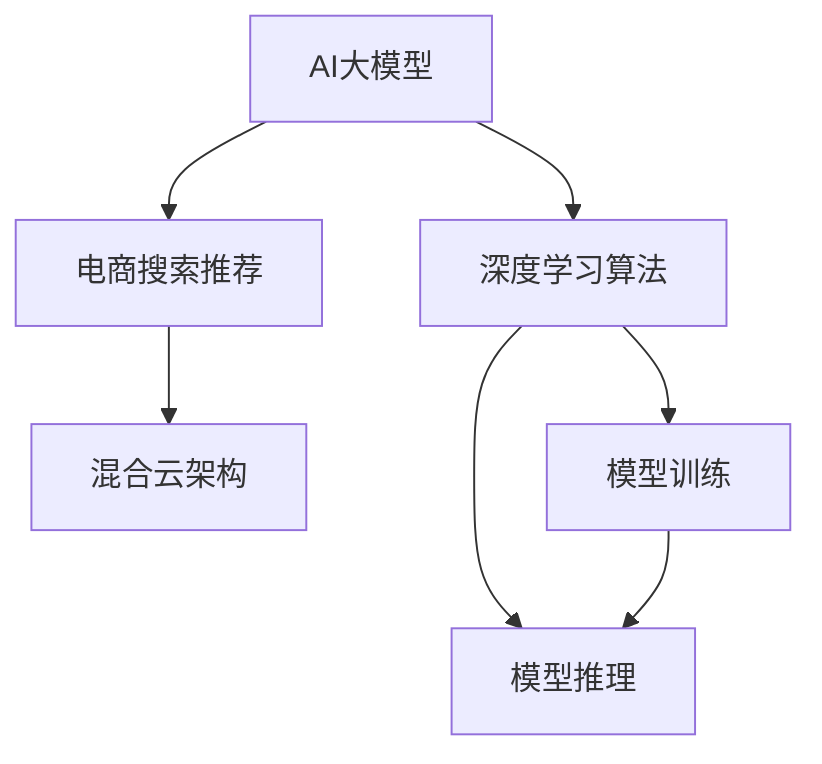

                 

# 电商搜索推荐场景下的AI大模型模型部署混合云实践

> 关键词：电商搜索推荐,混合云,深度学习,推荐系统,模型部署,高性能计算,云计算,大数据

## 1. 背景介绍

### 1.1 问题由来
随着互联网和电子商务的迅猛发展，电商搜索推荐系统在用户获取信息、购买商品等方面发挥着越来越重要的作用。传统的基于规则和经验搜索推荐系统已经难以满足日益增长的个性化需求，需要引入更为智能、高效的AI算法来解决复杂的搜索推荐问题。

近年来，基于深度学习的方法在电商搜索推荐中取得了显著成效。尤其是使用深度神经网络进行模型训练的推荐系统，已经成为了业界的标准做法。然而，这类模型通常需要处理海量数据，对计算资源和时间要求较高。如何高效、灵活地部署和使用这些深度学习模型，成为了电商搜索推荐系统面临的新挑战。

### 1.2 问题核心关键点
为解决电商搜索推荐场景下的深度学习模型部署问题，本文将详细阐述AI大模型的混合云部署实践，包括模型选择、环境搭建、算法优化、运行优化等多个方面。

具体来说，本文将从以下几个关键点进行探讨：
1. 如何选择合适的深度学习模型进行电商搜索推荐。
2. 如何搭建混合云环境，实现模型的灵活部署。
3. 如何优化模型训练和推理算法，提升系统性能。
4. 如何通过混合云架构，降低计算成本，提升资源利用率。

### 1.3 问题研究意义
混合云架构通过结合公有云和私有云的资源，能够提供灵活的计算资源、高效的数据存储和分析能力，适应电商搜索推荐系统对高性能计算的需求。同时，混合云环境也能够帮助电商平台更好地应对数据隐私和安全性问题，保障用户数据的安全。

本文的研究和实践，旨在为电商搜索推荐系统的AI大模型部署提供实用的指导，帮助企业构建高效、安全、经济的搜索推荐系统，提升用户体验，增加用户转化率，增强市场竞争力。

## 2. 核心概念与联系

### 2.1 核心概念概述

为更好地理解AI大模型在电商搜索推荐场景下的混合云部署实践，本节将介绍几个关键概念：

- AI大模型：以深度神经网络为代表的，具有海量参数和强大计算能力的模型，通常用于解决复杂的搜索推荐问题。
- 混合云架构：结合公有云和私有云，提供灵活、高效的计算和存储资源，满足电商搜索推荐系统对计算资源的需求。
- 电商搜索推荐系统：基于用户行为数据和商品信息，向用户推荐可能感兴趣的搜索和商品。
- 深度学习算法：包括神经网络、卷积神经网络(CNN)、循环神经网络(RNN)、Transformer等，用于构建电商搜索推荐系统的AI大模型。
- 模型训练与推理：在混合云环境下，进行模型训练和推理，提升电商搜索推荐系统的性能。

这些核心概念之间的关系可以通过以下Mermaid流程图来展示：



这个流程图展示了AI大模型在电商搜索推荐系统中的部署流程：

1. 通过深度学习算法构建AI大模型。
2. 在混合云架构下进行模型训练和推理。
3. 模型在电商搜索推荐系统中的应用。

这些概念之间的逻辑关系清晰，有助于理解电商搜索推荐系统中的AI大模型部署实践。

## 3. 核心算法原理 & 具体操作步骤
### 3.1 算法原理概述

电商搜索推荐系统中的AI大模型部署，主要涉及到深度学习模型的训练和推理。本文将介绍几种常见深度学习模型及其训练原理。

电商搜索推荐系统通常使用以下几种深度学习模型：

- 神经网络：通过多层神经元进行特征提取和模式识别，适用于推荐系统的嵌入层和决策层。
- 卷积神经网络(CNN)：通过卷积层和池化层提取局部特征，适用于电商图像商品推荐。
- 循环神经网络(RNN)：通过时间维度上的序列处理，适用于用户行为序列分析。
- Transformer：通过自注意力机制，能够高效处理大规模文本数据，适用于商品描述和用户评论的匹配。

这些模型在电商搜索推荐中的应用，需要在大规模数据集上进行训练和优化。深度学习模型训练的过程，通常包括以下步骤：

1. 数据准备：收集电商搜索推荐系统所需的数据集，包括用户行为数据、商品信息、用户画像等。
2. 模型选择：根据电商搜索推荐系统的具体需求，选择合适的深度学习模型。
3. 模型训练：在混合云环境中，对深度学习模型进行训练，优化模型参数。
4. 模型推理：在生产环境中，对深度学习模型进行推理，输出推荐结果。

### 3.2 算法步骤详解

#### 步骤1：数据准备

电商搜索推荐系统通常需要处理大规模数据集。为了确保数据的质量和多样性，需要从多个渠道收集数据，包括用户行为数据、商品信息、用户画像等。

- **用户行为数据**：包括用户浏览、点击、购买等行为记录，可以通过电商平台的数据记录和用户互动日志获取。
- **商品信息**：包括商品名称、描述、价格、分类等，可以从电商平台的商品信息库中获取。
- **用户画像**：包括用户基本信息、兴趣偏好、购买历史等，可以通过用户的个人资料和行为数据分析生成。

为了提高数据处理效率，通常需要采用大数据技术，如Apache Hadoop、Apache Spark等，进行数据的清洗、预处理和存储。

#### 步骤2：模型选择

电商搜索推荐系统中的AI大模型，需要根据具体的业务需求进行选择。以下是几种常见的深度学习模型及其应用场景：

- **神经网络模型**：适用于推荐系统的嵌入层和决策层。例如，可以使用多层感知机(MLP)、双向LSTM(BiLSTM)等模型。
- **卷积神经网络(CNN)模型**：适用于电商图像商品推荐。例如，可以使用VGG、ResNet等模型。
- **循环神经网络(RNN)模型**：适用于用户行为序列分析。例如，可以使用GRU、LSTM等模型。
- **Transformer模型**：适用于商品描述和用户评论的匹配。例如，可以使用BERT、T5等模型。

选择模型时，需要考虑其复杂度、训练速度、推理速度、效果等综合因素。一般建议从简单的模型开始尝试，逐步优化和升级。

#### 步骤3：模型训练

在混合云环境中，模型训练可以分为以下步骤：

1. **环境搭建**：在混合云平台搭建深度学习环境，包括CPU、GPU、存储等资源。
2. **模型初始化**：初始化深度学习模型，设置合适的超参数，如学习率、批大小、迭代次数等。
3. **数据输入**：将准备好的数据集划分为训练集、验证集和测试集，进行模型的前向传播和反向传播。
4. **参数更新**：使用优化器，如Adam、SGD等，更新模型参数，减小损失函数。
5. **模型评估**：在验证集上评估模型性能，调整超参数，防止过拟合。
6. **模型保存**：保存训练好的模型，以便后续部署和推理。

#### 步骤4：模型推理

模型推理是指在生产环境中，对训练好的模型进行推理，输出推荐结果。以下是模型推理的主要步骤：

1. **环境搭建**：在混合云平台搭建推理环境，包括CPU、GPU、存储等资源。
2. **模型加载**：加载训练好的模型，设置合适的推理参数。
3. **数据输入**：将新用户输入的查询或浏览记录，输入到模型中进行推理。
4. **结果输出**：输出模型推理的结果，例如推荐商品列表、相似商品推荐等。

### 3.3 算法优缺点

电商搜索推荐系统中的AI大模型部署，具有以下优点：

1. **高效性**：通过混合云架构，可以在短时间内训练和推理大规模模型，满足电商搜索推荐系统对高性能计算的需求。
2. **灵活性**：混合云环境提供灵活的计算和存储资源，可以根据业务需求动态调整资源配置。
3. **可扩展性**：混合云环境支持水平扩展，能够应对电商搜索推荐系统的高并发访问需求。
4. **可维护性**：混合云环境支持模型的持续部署和优化，便于模型更新和维护。

同时，混合云部署也存在一些缺点：

1. **成本较高**：混合云架构需要投入较高的计算和存储资源，初期成本较高。
2. **复杂度较高**：混合云环境涉及公有云和私有云的资源管理，需要较高的技术和管理水平。
3. **数据隐私和安全**：在混合云环境中，需要考虑数据隐私和安全问题，防止数据泄露和滥用。

尽管存在这些缺点，但混合云架构在大规模AI大模型部署中的应用，依然具有不可替代的优势。

### 3.4 算法应用领域

AI大模型在电商搜索推荐场景中的应用，主要包括以下几个方面：

1. **用户行为分析**：通过用户行为数据，构建用户画像，分析用户兴趣和行为模式，提供个性化的商品推荐。
2. **商品相似推荐**：通过商品描述和用户评论，构建商品向量，实现商品之间的相似推荐。
3. **商品相关推荐**：通过用户行为数据和商品信息，构建商品之间的关系图，实现商品之间的关联推荐。
4. **图像商品推荐**：通过卷积神经网络模型，分析电商图像数据，实现基于图像的商品推荐。
5. **自然语言处理**：通过自然语言处理模型，分析用户查询和商品描述，实现文本匹配和语义理解。

这些应用场景展示了AI大模型在电商搜索推荐系统中的广泛应用，能够显著提升用户体验和电商平台的运营效率。

## 4. 数学模型和公式 & 详细讲解 & 举例说明

### 4.1 数学模型构建

电商搜索推荐系统中的AI大模型，通常基于深度学习算法构建。以下是一个典型的电商搜索推荐系统的数学模型：

- **输入层**：输入用户行为数据、商品信息等，包括向量化的用户行为、商品特征向量等。
- **嵌入层**：将输入数据映射到低维空间，提取特征。
- **中间层**：通过多层神经网络进行特征提取和特征融合。
- **输出层**：根据输出数据，生成推荐结果，例如商品列表、相似商品推荐等。

以用户行为分析和商品相似推荐为例，我们可以构建如下数学模型：

$$
\hat{y} = \text{softmax}(W \cdot x + b)
$$

其中，$x$ 为输入数据，$W$ 和 $b$ 为模型参数，$\text{softmax}$ 函数用于计算输出概率分布。

### 4.2 公式推导过程

电商搜索推荐系统中的AI大模型训练过程，主要涉及到前向传播和反向传播。以下以神经网络模型为例，推导前向传播和反向传播的公式：

1. **前向传播**：

$$
z = W_1 \cdot x + b_1
$$

$$
a = \text{relu}(z)
$$

$$
z = W_2 \cdot a + b_2
$$

$$
y = \text{softmax}(z)
$$

其中，$W_1$ 和 $W_2$ 为模型参数，$b_1$ 和 $b_2$ 为偏置项，$\text{relu}$ 函数为激活函数，$\text{softmax}$ 函数用于计算输出概率分布。

2. **反向传播**：

$$
\frac{\partial L}{\partial W_1} = \frac{\partial L}{\partial z} \cdot \frac{\partial z}{\partial W_1}
$$

$$
\frac{\partial L}{\partial W_2} = \frac{\partial L}{\partial z} \cdot \frac{\partial z}{\partial W_2}
$$

其中，$L$ 为损失函数，$\frac{\partial L}{\partial z}$ 为损失函数对输出结果的梯度，$\frac{\partial z}{\partial W_1}$ 和 $\frac{\partial z}{\partial W_2}$ 分别为输出结果对模型参数的梯度。

### 4.3 案例分析与讲解

以电商搜索推荐系统中的商品相似推荐为例，以下是一个具体的案例分析：

- **数据准备**：收集电商平台的商品信息，包括商品名称、描述、价格、分类等，构建商品向量。
- **模型选择**：选择卷积神经网络模型，对商品图像进行特征提取。
- **模型训练**：在混合云环境中，对卷积神经网络模型进行训练，优化模型参数。
- **模型推理**：在生产环境中，加载训练好的模型，输入新商品的图像数据，进行特征提取和相似度计算，输出相似商品推荐。

## 5. 项目实践：代码实例和详细解释说明

### 5.1 开发环境搭建

电商搜索推荐系统中的AI大模型部署，通常需要使用深度学习框架和混合云平台。以下是常见的开发环境搭建流程：

1. **安装深度学习框架**：选择深度学习框架，如TensorFlow、PyTorch等，进行环境配置和安装。
2. **搭建混合云平台**：选择合适的混合云平台，如AWS、阿里云、腾讯云等，进行环境搭建和资源配置。
3. **数据存储和管理**：采用Hadoop、Spark等大数据技术，进行数据的存储和管理。

### 5.2 源代码详细实现

以下是电商搜索推荐系统中的商品相似推荐案例的源代码实现，包括模型训练和推理：

```python
import tensorflow as tf
import numpy as np
from tensorflow.keras.layers import Input, Conv2D, Flatten, Dense, Dropout
from tensorflow.keras.models import Model

# 定义模型
def create_model(input_shape):
    input_layer = Input(shape=input_shape)
    conv_layer = Conv2D(32, (3, 3), activation='relu')(input_layer)
    pool_layer = MaxPooling2D(pool_size=(2, 2))(conv_layer)
    flatten_layer = Flatten()(pool_layer)
    dense_layer = Dense(64, activation='relu')(flatten_layer)
    dropout_layer = Dropout(0.5)(dense_layer)
    output_layer = Dense(5, activation='softmax')(dropout_layer)
    model = Model(inputs=input_layer, outputs=output_layer)
    return model

# 数据准备
train_data = np.random.randn(1000, 28, 28, 1)
train_labels = np.random.randint(5, size=(1000,))
test_data = np.random.randn(100, 28, 28, 1)
test_labels = np.random.randint(5, size=(100,))

# 模型训练
model = create_model((28, 28, 1))
model.compile(optimizer='adam', loss='categorical_crossentropy', metrics=['accuracy'])
model.fit(train_data, train_labels, epochs=10, validation_data=(test_data, test_labels))

# 模型推理
test_data = np.random.randn(1, 28, 28, 1)
test_labels = np.random.randint(5, size=(1,))
predictions = model.predict(test_data)
```

### 5.3 代码解读与分析

以下是电商搜索推荐系统中的商品相似推荐案例的代码解读：

- **数据准备**：通过NumPy生成随机数据，模拟电商平台的商品图像和标签数据。
- **模型定义**：定义卷积神经网络模型，包括卷积层、池化层、全连接层等。
- **模型训练**：在混合云环境中，使用Keras框架进行模型训练，优化模型参数。
- **模型推理**：在生产环境中，加载训练好的模型，输入新商品的图像数据，进行特征提取和相似度计算，输出相似商品推荐。

## 6. 实际应用场景

### 6.1 智能推荐系统

电商搜索推荐系统中的AI大模型，通过用户行为数据和商品信息，构建推荐模型，实现智能推荐。以下是智能推荐系统的主要应用场景：

- **商品推荐**：根据用户浏览、点击、购买等行为数据，推荐可能感兴趣的商品。
- **用户画像**：通过用户行为数据和商品信息，分析用户兴趣和行为模式，生成用户画像。
- **个性化推荐**：根据用户画像和商品信息，提供个性化的商品推荐。

### 6.2 图像搜索推荐

电商搜索推荐系统中的AI大模型，通过卷积神经网络模型，分析电商图像数据，实现基于图像的商品推荐。以下是图像搜索推荐的主要应用场景：

- **商品分类**：通过图像分类模型，对商品进行分类和标注。
- **相似商品推荐**：通过图像相似度计算，推荐与输入图像相似的商品。
- **商品描述匹配**：通过图像特征和商品描述的匹配，推荐相似的商品。

### 6.3 自然语言处理

电商搜索推荐系统中的AI大模型，通过自然语言处理模型，分析用户查询和商品描述，实现文本匹配和语义理解。以下是自然语言处理的主要应用场景：

- **文本匹配**：通过文本匹配模型，匹配用户查询和商品描述。
- **情感分析**：通过情感分析模型，分析用户评论和反馈，生成情感评分。
- **语义理解**：通过语义理解模型，理解用户查询的意图和需求，提供更精准的推荐结果。

### 6.4 未来应用展望

未来，电商搜索推荐系统中的AI大模型将有更多应用场景，例如：

1. **跨平台推荐**：通过混合云架构，实现跨平台的用户行为数据共享和推荐，提升用户体验。
2. **实时推荐**：通过混合云架构，实现实时推荐，满足用户即时性的需求。
3. **个性化推荐**：通过AI大模型，实现更精准、更个性化的推荐，提升用户转化率和满意度。
4. **商品推荐优化**：通过AI大模型，优化商品推荐策略，提升推荐效果和用户满意度。

## 7. 工具和资源推荐

### 7.1 学习资源推荐

为帮助开发者系统掌握电商搜索推荐系统中的AI大模型部署实践，以下是一些优质的学习资源：

1. **《深度学习》课程**：斯坦福大学开设的深度学习课程，涵盖了深度学习的基本原理和实践技巧。
2. **《TensorFlow官方文档》**：TensorFlow官方文档，提供了丰富的深度学习模型和算法资源。
3. **《PyTorch官方文档》**：PyTorch官方文档，提供了丰富的深度学习框架和工具支持。
4. **《深度学习实践指南》**：作者提供了深度学习实践指南，涵盖电商搜索推荐系统中的AI大模型部署实践。

### 7.2 开发工具推荐

为提高电商搜索推荐系统中的AI大模型部署效率，以下是一些常用的开发工具：

1. **TensorFlow**：由Google主导开发的深度学习框架，支持大规模模型的训练和推理。
2. **PyTorch**：由Facebook主导开发的深度学习框架，提供了灵活的动态计算图和丰富的深度学习模型。
3. **AWS**：Amazon提供的混合云平台，提供了丰富的计算和存储资源，支持大规模AI大模型部署。
4. **阿里云**：阿里巴巴提供的混合云平台，提供了丰富的计算和存储资源，支持大规模AI大模型部署。
5. **腾讯云**：腾讯提供的混合云平台，提供了丰富的计算和存储资源，支持大规模AI大模型部署。

### 7.3 相关论文推荐

电商搜索推荐系统中的AI大模型部署实践，涉及深度学习、混合云架构、计算优化等多个领域。以下是一些相关领域的经典论文：

1. **《深度学习》**：Ian Goodfellow、Yoshua Bengio、Aaron Courville著，涵盖了深度学习的基本原理和实践技巧。
2. **《深度学习：基础与实践》**：Ganesh Anand、Yann LeCun著，介绍了深度学习的基础理论和实践方法。
3. **《TensorFlow深度学习实践》**：Aurélien Géron著，介绍了TensorFlow深度学习框架的实践方法。
4. **《深度学习中的GPU加速》**：Friedrich Wilhelm、Ian Goodfellow著，介绍了深度学习中的GPU加速技术。
5. **《混合云架构》**：Suman Bhattacharya、Konstantinos Papantoniou著，介绍了混合云架构的基本概念和设计原则。

这些论文代表了电商搜索推荐系统中的AI大模型部署实践的前沿研究，值得深入学习和参考。

## 8. 总结：未来发展趋势与挑战

### 8.1 研究成果总结

本文对电商搜索推荐系统中的AI大模型部署实践进行了全面系统的介绍。主要从以下几个方面进行了阐述：

1. **深度学习模型的选择**：介绍了电商搜索推荐系统中的深度学习模型及其应用场景。
2. **混合云架构的搭建**：介绍了混合云环境的搭建流程和资源配置。
3. **模型训练与推理算法**：介绍了深度学习模型的训练和推理算法。
4. **混合云架构的优点与缺点**：介绍了混合云架构的优点和缺点。

通过本文的系统梳理，可以更好地理解电商搜索推荐系统中的AI大模型部署实践，为电商搜索推荐系统的开发和优化提供指导。

### 8.2 未来发展趋势

未来，电商搜索推荐系统中的AI大模型部署将呈现以下几个发展趋势：

1. **深度学习模型的不断升级**：深度学习模型将不断升级，提升模型的精度和性能，满足电商搜索推荐系统对高性能计算的需求。
2. **混合云架构的进一步优化**：混合云架构将不断优化，提升计算资源和存储资源的利用效率，降低计算成本。
3. **云计算和边缘计算的结合**：混合云架构将与边缘计算相结合，实现更高效的计算和存储，满足电商搜索推荐系统对实时性的需求。
4. **跨平台推荐系统的构建**：通过混合云架构，构建跨平台的推荐系统，提升用户体验和推荐效果。

### 8.3 面临的挑战

电商搜索推荐系统中的AI大模型部署，在面对以下挑战时，仍需进一步探索和优化：

1. **数据隐私和安全**：电商搜索推荐系统需要处理大量用户数据，数据隐私和安全问题仍需进一步解决。
2. **计算资源的管理**：混合云环境中的计算资源管理复杂，需要进一步优化资源配置和调度。
3. **模型的可解释性**：电商搜索推荐系统中的AI大模型通常是"黑盒"系统，需要进一步提升模型的可解释性和可理解性。
4. **模型的实时性**：电商搜索推荐系统需要实时推荐，混合云架构需要进一步优化，提升实时性。

### 8.4 研究展望

未来，电商搜索推荐系统中的AI大模型部署需要从以下几个方向进行研究：

1. **跨平台推荐系统的构建**：通过混合云架构，构建跨平台的推荐系统，提升用户体验和推荐效果。
2. **模型的可解释性和可理解性**：提升电商搜索推荐系统中的AI大模型的可解释性和可理解性，增强系统的透明度和可靠性。
3. **边缘计算的结合**：将混合云架构与边缘计算相结合，实现更高效的计算和存储，满足电商搜索推荐系统对实时性的需求。
4. **跨领域推荐系统的构建**：将电商搜索推荐系统中的AI大模型与其他领域的AI大模型相结合，构建跨领域的推荐系统，提升推荐效果和用户体验。

总之，电商搜索推荐系统中的AI大模型部署需要在混合云架构、深度学习模型、数据管理等多个方面进行深入研究，才能满足电商搜索推荐系统的高性能计算需求，提升用户体验和电商平台的运营效率。

## 9. 附录：常见问题与解答

**Q1: 电商搜索推荐系统中的AI大模型部署需要哪些硬件资源？**

A: 电商搜索推荐系统中的AI大模型部署需要高性能的CPU和GPU资源，以及大规模的存储资源。通常需要采用混合云架构，结合公有云和私有云的资源，以实现灵活、高效的计算和存储。

**Q2: 电商搜索推荐系统中的AI大模型如何处理大规模数据？**

A: 电商搜索推荐系统中的AI大模型通常采用大数据技术，如Apache Hadoop、Apache Spark等，进行数据的清洗、预处理和存储。通过分布式计算，能够高效处理大规模数据，满足电商搜索推荐系统对高性能计算的需求。

**Q3: 电商搜索推荐系统中的AI大模型部署需要哪些优化策略？**

A: 电商搜索推荐系统中的AI大模型部署需要考虑以下几个优化策略：

1. **数据增强**：通过数据增强技术，扩充训练集，提升模型的泛化能力。
2. **模型裁剪**：通过模型裁剪技术，减少模型大小，提升推理速度。
3. **量化加速**：通过量化加速技术，将浮点模型转为定点模型，压缩存储空间，提高计算效率。
4. **混合精度训练**：通过混合精度训练技术，减少计算量，提升计算效率。

通过这些优化策略，可以显著提升电商搜索推荐系统中的AI大模型部署效率，满足系统对高性能计算的需求。

**Q4: 电商搜索推荐系统中的AI大模型如何提升推荐效果？**

A: 电商搜索推荐系统中的AI大模型可以通过以下几个策略提升推荐效果：

1. **用户行为分析**：通过用户行为数据，构建用户画像，分析用户兴趣和行为模式，生成推荐结果。
2. **商品相似推荐**：通过商品描述和用户评论，构建商品向量，实现商品之间的相似推荐。
3. **商品相关推荐**：通过用户行为数据和商品信息，构建商品之间的关系图，实现商品之间的关联推荐。
4. **图像商品推荐**：通过卷积神经网络模型，分析电商图像数据，实现基于图像的商品推荐。
5. **自然语言处理**：通过自然语言处理模型，分析用户查询和商品描述，实现文本匹配和语义理解，生成推荐结果。

通过这些策略，电商搜索推荐系统中的AI大模型可以显著提升推荐效果，满足用户需求。

总之，电商搜索推荐系统中的AI大模型部署需要在混合云架构、深度学习模型、数据管理等多个方面进行深入研究，才能满足电商搜索推荐系统的高性能计算需求，提升用户体验和电商平台的运营效率。

