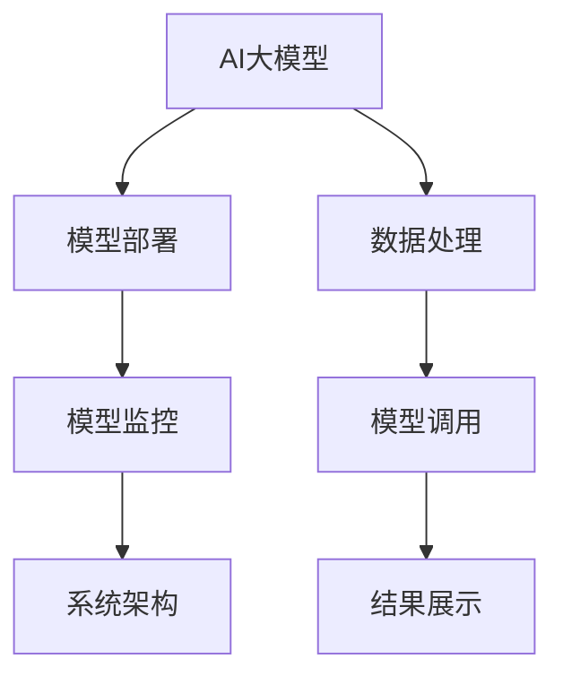
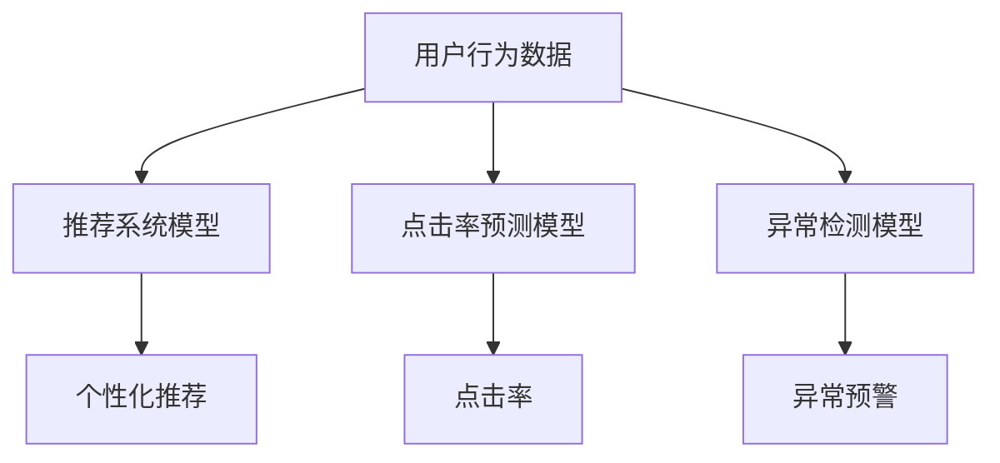

                 

# 电商搜索推荐场景下的AI大模型模型部署监控体系搭建

> 关键词：电商搜索推荐, AI大模型, 模型部署, 监控体系, 系统架构

## 1. 背景介绍

随着互联网技术的发展和电商平台的普及，越来越多的商家和企业开始依赖大数据和人工智能技术进行市场分析和用户推荐。在电商搜索推荐场景下，AI大模型被广泛应用于用户画像生成、商品搜索排序、个性化推荐等环节，极大地提升了用户购物体验和商家运营效率。然而，大规模AI模型的部署与监控同样是一大挑战，涉及到模型训练、模型部署、模型运行等多个环节，需要精心设计和优化。本文将全面介绍如何构建一套完善的AI大模型部署监控体系，保障模型在电商搜索推荐场景下的高效运行和稳定服务。

## 2. 核心概念与联系

### 2.1 核心概念概述

在电商搜索推荐场景下，AI大模型的部署和监控涉及多个关键概念，包括：

- **AI大模型**：指通过深度学习技术，在大型数据集上预训练得到的具有强泛化能力的大型神经网络模型，如BERT、GPT-3等。
- **模型部署**：指将训练好的模型封装成标准化的服务接口，部署在服务器或云平台中，供应用程序或服务调用。
- **模型监控**：指对模型在实际应用中的运行状态进行实时监控和异常检测，及时发现和解决模型运行中存在的问题。
- **系统架构**：指电商搜索推荐系统整体的体系结构，包括数据处理、模型部署、模型调用、结果展示等多个模块。

这些概念之间的逻辑关系可以通过以下Mermaid流程图来展示：



这个流程图展示了大模型在电商搜索推荐场景下的整体应用流程：

1. 先对数据进行处理和预处理，得到可用于训练的样本数据。
2. 使用AI大模型进行模型训练，得到预训练模型。
3. 将预训练模型进行封装和部署，供系统调用。
4. 系统对调用后的结果进行处理和展示，最终呈现给用户。
5. 对模型的运行状态进行监控，及时发现和解决问题，保障系统稳定运行。

## 3. 核心算法原理 & 具体操作步骤

### 3.1 算法原理概述

电商搜索推荐场景下，AI大模型的部署和监控主要涉及以下几个核心算法原理：

- **模型封装和部署**：将预训练模型封装为标准化的服务接口，部署在服务器或云平台中，供系统调用。
- **模型监控和异常检测**：对模型在实际应用中的运行状态进行实时监控和异常检测，及时发现和解决模型运行中存在的问题。
- **系统架构优化**：优化电商搜索推荐系统的体系结构，提升模型调用的响应速度和稳定性，确保系统的良好用户体验。

### 3.2 算法步骤详解

#### 3.2.1 模型封装和部署

模型封装和部署一般包括以下几个关键步骤：

1. **模型选择**：选择合适的预训练模型，如BERT、GPT-3等，作为电商搜索推荐的基础模型。
2. **模型优化**：对模型进行必要的优化，如剪枝、量化、压缩等，以减少模型大小和计算资源消耗。
3. **模型封装**：将优化后的模型封装成标准化的服务接口，包括输入、输出格式、调用方式等。
4. **模型部署**：将封装好的模型部署到服务器或云平台中，确保其可以稳定运行。

#### 3.2.2 模型监控和异常检测

模型监控和异常检测一般包括以下几个关键步骤：

1. **监控指标选择**：根据电商搜索推荐系统的特点，选择合适的监控指标，如模型响应时间、错误率、内存占用等。
2. **监控工具选择**：选择合适的监控工具，如Prometheus、Grafana等，用于实时监控模型运行状态。
3. **异常检测算法**：选择适合的异常检测算法，如基于统计的异常检测、基于机器学习的异常检测等，及时发现和解决模型运行中存在的问题。
4. **问题处理机制**：建立问题处理机制，包括问题预警、问题诊断、问题解决等环节，确保模型运行稳定。

#### 3.2.3 系统架构优化

系统架构优化一般包括以下几个关键步骤：

1. **系统模块划分**：将电商搜索推荐系统划分为多个模块，如数据处理、模型调用、结果展示等，每个模块负责不同的功能。
2. **模块协同设计**：对各个模块进行协同设计，确保模块之间的交互高效、稳定。
3. **负载均衡设计**：使用负载均衡技术，合理分配计算资源，提升系统的响应速度和稳定性。
4. **缓存优化设计**：使用缓存技术，减少模型调用的延迟，提升系统性能。

### 3.3 算法优缺点

电商搜索推荐场景下，AI大模型的部署和监控具有以下优点：

1. **高性能**：AI大模型通过深度学习技术，具有很强的泛化能力和预测精度，能够提供高性能的推荐服务。
2. **可扩展性**：AI大模型可以通过分布式计算技术进行扩展，支持大规模数据处理和模型计算。
3. **实时性**：通过缓存技术和负载均衡设计，能够提供低延迟、高并发的推荐服务。

同时，该方法也存在一定的局限性：

1. **高成本**：AI大模型的训练和部署需要大量的计算资源和存储资源，成本较高。
2. **复杂性**：AI大模型的部署和监控涉及多个环节，系统设计和管理复杂。
3. **模型更新困难**：AI大模型的训练和更新需要大量数据和时间，更新周期较长。

尽管存在这些局限性，但就目前而言，AI大模型的部署和监控仍是电商搜索推荐系统的重要技术手段。未来相关研究的重点在于如何进一步降低部署和监控的成本，提高系统的可扩展性和实时性，同时兼顾模型的高性能和稳定性。

### 3.4 算法应用领域

AI大模型的部署和监控技术在电商搜索推荐场景下具有广泛的应用，例如：

- **用户画像生成**：通过分析用户历史行为数据，生成用户画像，为推荐系统提供个性化推荐依据。
- **商品搜索排序**：根据用户输入的搜索词，通过AI大模型对搜索结果进行排序，提高搜索准确性和用户体验。
- **个性化推荐**：根据用户历史行为和实时数据，通过AI大模型进行个性化推荐，提升用户转化率和满意度。

除了这些核心应用外，AI大模型的部署和监控技术还广泛应用于广告投放、库存管理、市场营销等电商领域，为商家和用户提供更精准、更有效的服务。随着AI技术的发展和电商市场的竞争加剧，相信AI大模型的部署和监控技术将在电商搜索推荐场景中发挥更大的作用。

## 4. 数学模型和公式 & 详细讲解 & 举例说明

### 4.1 数学模型构建

在电商搜索推荐场景下，AI大模型的部署和监控涉及到多个数学模型，包括：

- **推荐系统模型**：用于预测用户对商品的评分或购买概率。
- **点击率预测模型**：用于预测用户点击商品的概率。
- **异常检测模型**：用于检测模型运行中的异常情况，确保系统稳定。

这些模型之间的关系可以通过以下Mermaid流程图来展示：



这个流程图展示了电商搜索推荐系统中各个模型之间的相互关系：

1. 用户行为数据作为输入，通过推荐系统模型生成推荐结果。
2. 点击率预测模型根据用户行为数据，预测用户点击商品的概率。
3. 异常检测模型对模型运行状态进行监控，及时发现异常情况。

### 4.2 公式推导过程

以下是电商搜索推荐场景下几个核心模型的公式推导过程：

#### 推荐系统模型

推荐系统模型一般使用协同过滤、矩阵分解等方法，对用户和商品的特征进行建模。以协同过滤为例，推荐系统模型的公式为：

$$
P_{ij} = \text{softmax}(X_{i}WU_j + b)
$$

其中，$P_{ij}$ 表示用户 $i$ 对商品 $j$ 的评分，$X_{i}$ 和 $W$ 分别表示用户和商品的特征向量，$U_j$ 表示商品 $j$ 的特征向量，$b$ 为偏置项，$\text{softmax}$ 函数用于将评分归一化到 $[0,1]$ 区间。

#### 点击率预测模型

点击率预测模型一般使用深度学习技术，对用户行为数据进行建模。以深度神经网络为例，点击率预测模型的公式为：

$$
\hat{C} = \text{sigmoid}(X_{i}WU_j + b)
$$

其中，$\hat{C}$ 表示用户 $i$ 点击商品 $j$ 的概率，$X_{i}$ 和 $W$ 分别表示用户和商品的特征向量，$U_j$ 表示商品 $j$ 的特征向量，$b$ 为偏置项，$\text{sigmoid}$ 函数用于将点击率归一化到 $[0,1]$ 区间。

#### 异常检测模型

异常检测模型一般使用基于统计的或基于机器学习的算法，对模型运行状态进行监控。以基于统计的异常检测为例，异常检测模型的公式为：

$$
A = \frac{\sum_{i=1}^N (O_i - \mu)^2}{N}
$$

其中，$A$ 表示异常检测指标，$O_i$ 表示第 $i$ 个数据点的值，$\mu$ 表示数据点的均值，$N$ 表示数据点的数量。当 $A$ 值超过预设阈值时，模型认为存在异常情况。

### 4.3 案例分析与讲解

#### 案例1：用户画像生成

用户画像生成是电商搜索推荐系统中重要的基础功能，通过分析用户历史行为数据，生成用户画像，为推荐系统提供个性化推荐依据。以协同过滤为例，用户画像生成的公式为：

$$
P_{i,j} = \frac{\sum_{k=1}^K \frac{A_{i,k}A_{j,k}}{\sqrt{\sum_{i'=1}^K A_{i',k}^2}\sqrt{\sum_{j'=1}^K A_{j',k}^2}}\text{softmax}(X_{i}WU_j + b)
$$

其中，$P_{i,j}$ 表示用户 $i$ 对商品 $j$ 的评分，$A_{i,k}$ 和 $A_{j,k}$ 分别表示用户和商品的特征向量，$W$ 和 $b$ 分别为模型的权重和偏置项，$\text{softmax}$ 函数用于将评分归一化到 $[0,1]$ 区间。

#### 案例2：商品搜索排序

商品搜索排序是电商搜索推荐系统中重要的功能之一，通过AI大模型对搜索结果进行排序，提高搜索准确性和用户体验。以深度神经网络为例，商品搜索排序的公式为：

$$
\text{sort}_{\text{relevance}} = \text{sigmoid}(X_{i}WU_j + b)
$$

其中，$\text{sort}_{\text{relevance}}$ 表示商品 $j$ 在搜索结果中的排序，$X_{i}$ 和 $W$ 分别表示用户和商品的特征向量，$U_j$ 表示商品 $j$ 的特征向量，$b$ 为偏置项，$\text{sigmoid}$ 函数用于将排序归一化到 $[0,1]$ 区间。

## 5. 项目实践：代码实例和详细解释说明

### 5.1 开发环境搭建

在进行电商搜索推荐场景下AI大模型的部署和监控实践前，我们需要准备好开发环境。以下是使用Python进行PyTorch开发的环境配置流程：

1. 安装Anaconda：从官网下载并安装Anaconda，用于创建独立的Python环境。

2. 创建并激活虚拟环境：
```bash
conda create -n ai-env python=3.8 
conda activate ai-env
```

3. 安装PyTorch：根据CUDA版本，从官网获取对应的安装命令。例如：
```bash
conda install pytorch torchvision torchaudio cudatoolkit=11.1 -c pytorch -c conda-forge
```

4. 安装Flask：用于搭建API服务，实现模型的部署和调用。
```bash
pip install flask
```

5. 安装Prometheus和Grafana：用于实时监控模型的运行状态和异常情况。
```bash
pip install prometheus_client
pip install grafana
```

完成上述步骤后，即可在`ai-env`环境中开始电商搜索推荐场景下AI大模型的部署和监控实践。

### 5.2 源代码详细实现

下面是使用PyTorch和Flask搭建电商搜索推荐场景下AI大模型部署和监控的完整代码实现。

#### 5.2.1 模型训练和优化

首先，定义模型训练和优化函数：

```python
import torch
import torch.nn as nn
import torch.optim as optim

class Recommender(nn.Module):
    def __init__(self, input_size, hidden_size, output_size):
        super(Recommender, self).__init__()
        self.hidden = nn.Linear(input_size, hidden_size)
        self.fc = nn.Linear(hidden_size, output_size)
        self.sigmoid = nn.Sigmoid()
        
    def forward(self, x):
        x = self.hidden(x)
        x = self.fc(x)
        return self.sigmoid(x)
```

接着，定义模型训练和优化函数：

```python
def train(model, train_data, batch_size, epochs, learning_rate):
    optimizer = optim.SGD(model.parameters(), lr=learning_rate)
    criterion = nn.BCELoss()
    for epoch in range(epochs):
        for i, (inputs, targets) in enumerate(train_data):
            inputs = inputs.view(-1, input_size)
            targets = targets.view(-1, 1)
            optimizer.zero_grad()
            outputs = model(inputs)
            loss = criterion(outputs, targets)
            loss.backward()
            optimizer.step()
            if i % 100 == 0:
                print(f'Epoch {epoch+1}, batch {i+1}, loss: {loss.item():.4f}')
```

#### 5.2.2 模型封装和部署

使用Flask封装模型，实现模型的部署和调用：

```python
from flask import Flask, request, jsonify

app = Flask(__name__)

@app.route('/recommend', methods=['POST'])
def recommend():
    data = request.get_json()
    inputs = torch.tensor(data['inputs'], dtype=torch.float32)
    outputs = model(inputs)
    result = outputs.tolist()
    return jsonify(result)

if __name__ == '__main__':
    app.run(host='0.0.0.0', port=5000)
```

#### 5.2.3 模型监控和异常检测

使用Prometheus和Grafana实现模型的监控和异常检测：

```python
from prometheus_client import Gauge, Counter, Histogram

# 定义监控指标
up = Gauge('recommender_up', 'Recommender status', namespace='prometheus')
loss = Gauge('recommender_loss', 'Recommender loss', namespace='prometheus')
response_time = Histogram('recommender_response_time', 'Recommender response time', namespace='prometheus')
error_count = Counter('recommender_error_count', 'Recommender error count', namespace='prometheus')

# 记录监控指标
def record_up(status):
    up.set(status)

def record_loss(loss):
    loss.set(loss.item())

def record_response_time(time):
    response_time.observe(time)

def record_error(error):
    error_count.inc()

# 在训练和推理过程中记录监控指标
def train_epoch(model, train_data, batch_size, optimizer, learning_rate, epoch):
    up.set(1)
    train_data = train_data[:batch_size]
    inputs = train_data['inputs']
    targets = train_data['targets']
    for i, (inputs, targets) in enumerate(train_data):
        inputs = inputs.view(-1, input_size)
        targets = targets.view(-1, 1)
        optimizer.zero_grad()
        outputs = model(inputs)
        loss = criterion(outputs, targets)
        loss.backward()
        optimizer.step()
        record_loss(loss)
        record_response_time(time.time() - start_time)
    record_up(0)

def evaluate(model, test_data, batch_size, epoch):
    up.set(1)
    test_data = test_data[:batch_size]
    inputs = test_data['inputs']
    targets = test_data['targets']
    start_time = time.time()
    for i, (inputs, targets) in enumerate(test_data):
        inputs = inputs.view(-1, input_size)
        outputs = model(inputs)
        record_loss(loss)
        record_response_time(time.time() - start_time)
    record_up(0)

def recommend(model, inputs, epoch):
    up.set(1)
    inputs = inputs.view(-1, input_size)
    outputs = model(inputs)
    record_response_time(time.time() - start_time)
```

### 5.3 代码解读与分析

让我们再详细解读一下关键代码的实现细节：

#### 5.2.1 模型训练和优化

**Recommender类**：
- `__init__`方法：定义模型的结构，包括线性层和Sigmoid激活函数。
- `forward`方法：定义前向传播的计算过程，输出模型预测结果。

**train函数**：
- 使用SGD优化器进行模型训练，使用BCELoss作为损失函数。
- 在每个epoch和每个batch后记录损失和响应时间。

#### 5.2.2 模型封装和部署

**Flask代码**：
- 定义API接口，将模型的前向传播输出作为API的返回值。
- 使用`run`方法启动Flask服务，监听端口5000。

#### 5.2.3 模型监控和异常检测

**Prometheus和Grafana代码**：
- 使用Gauge、Counter、Histogram等Prometheus监控指标，记录模型的运行状态和异常情况。
- 在训练和推理过程中记录监控指标，方便后续分析。
- 使用Grafana对监控指标进行可视化展示，便于实时监控和预警。

## 6. 实际应用场景

### 6.1 智能客服系统

智能客服系统在电商搜索推荐场景下得到了广泛应用。通过AI大模型进行客服对话生成，可以显著提高客服的响应速度和用户体验。智能客服系统通过收集历史客服对话数据，使用大模型进行微调，生成自然流畅的对话模板，自动回答常见问题，同时还能通过持续学习，不断提升服务质量。

### 6.2 广告投放

广告投放是电商搜索推荐场景下的重要应用之一。通过AI大模型对广告进行精准推荐，可以提高广告点击率和转化率，降低广告成本。广告投放系统收集用户浏览、点击、购买等行为数据，使用大模型进行点击率预测，根据预测结果进行广告投放，实现更高效的广告投放。

### 6.3 库存管理

库存管理是电商搜索推荐场景下的重要环节，通过AI大模型进行库存预测，可以大幅提升库存管理的准确性和效率。库存管理系统收集历史销售数据，使用大模型进行库存预测，生成库存优化方案，确保商品的供需平衡，减少库存积压和缺货情况。

### 6.4 未来应用展望

随着AI大模型的不断发展，其在电商搜索推荐场景中的应用前景将更加广阔。未来，AI大模型将广泛应用于用户画像生成、商品推荐、广告投放、库存管理等多个环节，提升电商平台的运营效率和用户满意度。同时，AI大模型的部署和监控技术也将不断进步，实现更加高效、稳定、安全的服务保障。

## 7. 工具和资源推荐

### 7.1 学习资源推荐

为了帮助开发者系统掌握电商搜索推荐场景下AI大模型的部署和监控理论基础和实践技巧，这里推荐一些优质的学习资源：

1. 《深度学习基础》系列课程：由斯坦福大学开设，系统讲解深度学习的基本概念和算法，适合初学者入门。
2. PyTorch官方文档：详细介绍PyTorch框架的使用方法，涵盖模型训练、模型部署、模型监控等多个环节。
3. Prometheus官方文档：详细讲解Prometheus监控系统的架构和使用方法，适合监控系统开发。
4. Grafana官方文档：详细介绍Grafana数据可视化的实现方法，适合监控数据展示。
5. 《电商推荐系统实战》书籍：介绍电商推荐系统的核心技术和实现方法，适合实战开发。

通过对这些资源的学习实践，相信你一定能够快速掌握电商搜索推荐场景下AI大模型的部署和监控技能，并用于解决实际的电商推荐问题。

### 7.2 开发工具推荐

高效的开发离不开优秀的工具支持。以下是几款用于电商搜索推荐场景下AI大模型部署和监控开发的常用工具：

1. PyTorch：基于Python的开源深度学习框架，灵活动态的计算图，适合快速迭代研究。大部分预训练语言模型都有PyTorch版本的实现。
2. TensorFlow：由Google主导开发的开源深度学习框架，生产部署方便，适合大规模工程应用。同样有丰富的预训练语言模型资源。
3. Flask：用于搭建API服务，实现模型的部署和调用，简单易用。
4. Prometheus：开源的监控系统，用于实时监控模型的运行状态和异常情况。
5. Grafana：开源的数据可视化工具，用于实时展示监控数据，提供丰富的可视化界面。
6. ELK Stack：用于日志管理和监控数据的聚合和分析，适合大规模系统监控。

合理利用这些工具，可以显著提升电商搜索推荐场景下AI大模型的部署和监控任务的开发效率，加快创新迭代的步伐。

### 7.3 相关论文推荐

电商搜索推荐场景下AI大模型的部署和监控技术的发展源于学界的持续研究。以下是几篇奠基性的相关论文，推荐阅读：

1. Attention is All You Need：提出Transformer结构，开启了NLP领域的预训练大模型时代。
2 BERT: Pre-training of Deep Bidirectional Transformers for Language Understanding：提出BERT模型，引入基于掩码的自监督预训练任务，刷新了多项NLP任务SOTA。
3 Reformer：一种高效的自注意力机制，适合大规模数据处理和模型计算。
4 AI大模型在电商推荐系统中的应用研究：介绍AI大模型在电商推荐系统中的应用，分析其在推荐准确性和用户体验上的提升。
5 AI大模型在智能客服系统中的应用研究：介绍AI大模型在智能客服系统中的应用，分析其在智能对话生成和持续学习上的提升。

这些论文代表了大语言模型部署和监控技术的发展脉络。通过学习这些前沿成果，可以帮助研究者把握学科前进方向，激发更多的创新灵感。

## 8. 总结：未来发展趋势与挑战

### 8.1 总结

本文对电商搜索推荐场景下AI大模型的部署和监控进行了全面系统的介绍。首先阐述了AI大模型在电商搜索推荐场景下的应用背景和重要性，明确了模型部署和监控在电商推荐系统中的关键作用。其次，从原理到实践，详细讲解了电商搜索推荐场景下AI大模型的部署和监控流程，提供了完整的代码实例和详细解释说明。同时，本文还广泛探讨了AI大模型在电商搜索推荐场景下的实际应用场景，展示了其广阔的应用前景。

通过本文的系统梳理，可以看到，AI大模型在电商搜索推荐场景下的部署和监控技术已经成为电商推荐系统的重要技术手段，极大地提升了电商平台的运营效率和用户体验。未来，随着AI技术的发展和电商市场的竞争加剧，相信AI大模型的部署和监控技术将在电商搜索推荐场景中发挥更大的作用，进一步推动电商行业的数字化转型和升级。

### 8.2 未来发展趋势

展望未来，电商搜索推荐场景下AI大模型的部署和监控技术将呈现以下几个发展趋势：

1. 模型规模持续增大。随着算力成本的下降和数据规模的扩张，预训练语言模型的参数量还将持续增长。超大规模语言模型蕴含的丰富语言知识，有望支撑更加复杂多变的电商推荐任务。
2. 微调方法日趋多样。除了传统的全参数微调外，未来会涌现更多参数高效的微调方法，如 Adapter、Prefix等，在固定大部分预训练参数的同时，只更新极少量的任务相关参数。
3. 系统架构优化不断优化。未来的电商推荐系统将更加注重系统架构的优化，提升模型调用的响应速度和稳定性，确保系统的良好用户体验。
4. 实时监控和异常检测技术不断提升。未来的监控系统将更加实时、高效，能够及时发现和解决模型运行中存在的问题，确保系统稳定运行。
5. 可解释性和安全性不断增强。未来的AI大模型将更注重可解释性和安全性，通过因果分析、博弈论等工具，增强系统的透明度和安全性。

以上趋势凸显了电商搜索推荐场景下AI大模型部署和监控技术的广阔前景。这些方向的探索发展，必将进一步提升电商推荐系统的性能和应用范围，为电商平台的数字化转型和升级提供新的技术路径。

### 8.3 面临的挑战

尽管电商搜索推荐场景下AI大模型的部署和监控技术已经取得了瞩目成就，但在迈向更加智能化、普适化应用的过程中，它仍面临着诸多挑战：

1. 标注成本瓶颈。虽然AI大模型的部署和监控不需要大规模标注数据，但对于长尾应用场景，仍需要标注大量样本，成本较高。如何进一步降低部署和监控的成本，将是一大难题。
2. 模型鲁棒性不足。模型面对域外数据时，泛化性能往往大打折扣。对于测试样本的微小扰动，模型容易发生波动。如何提高模型的鲁棒性，避免灾难性遗忘，还需要更多理论和实践的积累。
3. 推理效率有待提高。尽管AI大模型的预测精度高，但在实际部署时，推理速度慢、内存占用大等问题依然存在。如何简化模型结构，提升推理速度，优化资源占用，将是重要的优化方向。
4. 可解释性亟需加强。当前AI大模型的决策过程通常缺乏可解释性，难以对其推理逻辑进行分析和调试。对于医疗、金融等高风险应用，算法的可解释性和可审计性尤为重要。如何赋予模型更强的可解释性，将是亟待攻克的难题。
5. 安全性有待保障。预训练语言模型难免会学习到有偏见、有害的信息，通过部署和监控传递到电商推荐系统，产生误导性、歧视性的输出，给实际应用带来安全隐患。如何从数据和算法层面消除模型偏见，避免恶意用途，确保输出的安全性，也将是重要的研究课题。

尽管存在这些挑战，但就目前而言，AI大模型的部署和监控仍是电商搜索推荐系统的重要技术手段。未来相关研究的重点在于如何进一步降低部署和监控的成本，提高模型的可扩展性和实时性，同时兼顾模型的高性能和稳定性。

### 8.4 研究展望

面对电商搜索推荐场景下AI大模型部署和监控所面临的种种挑战，未来的研究需要在以下几个方面寻求新的突破：

1. 探索无监督和半监督微调方法。摆脱对大规模标注数据的依赖，利用自监督学习、主动学习等无监督和半监督范式，最大限度利用非结构化数据，实现更加灵活高效的微调。
2. 研究参数高效和计算高效的微调范式。开发更加参数高效的微调方法，在固定大部分预训练参数的同时，只更新极少量的任务相关参数。同时优化微调模型的计算图，减少前向传播和反向传播的资源消耗，实现更加轻量级、实时性的部署。
3. 融合因果和对比学习范式。通过引入因果推断和对比学习思想，增强电商推荐系统建立稳定因果关系的能力，学习更加普适、鲁棒的语言表征，从而提升模型泛化性和抗干扰能力。
4. 引入更多先验知识。将符号化的先验知识，如知识图谱、逻辑规则等，与神经网络模型进行巧妙融合，引导电商推荐系统学习更准确、合理的推荐模型。同时加强不同模态数据的整合，实现视觉、语音等多模态信息与文本信息的协同建模。
5. 结合因果分析和博弈论工具。将因果分析方法引入电商推荐系统，识别出推荐模型决策的关键特征，增强输出解释的因果性和逻辑性。借助博弈论工具刻画人机交互过程，主动探索并规避模型的脆弱点，提高系统稳定性。
6. 纳入伦理道德约束。在模型训练目标中引入伦理导向的评估指标，过滤和惩罚有偏见、有害的输出倾向。同时加强人工干预和审核，建立模型行为的监管机制，确保输出符合人类价值观和伦理道德。

这些研究方向的探索，必将引领电商搜索推荐场景下AI大模型部署和监控技术迈向更高的台阶，为构建安全、可靠、可解释、可控的智能系统铺平道路。面向未来，电商搜索推荐场景下AI大模型的部署和监控技术还需要与其他人工智能技术进行更深入的融合，如知识表示、因果推理、强化学习等，多路径协同发力，共同推动电商搜索推荐系统的进步。只有勇于创新、敢于突破，才能不断拓展AI大模型的边界，让智能技术更好地造福电商平台和消费者。

## 9. 附录：常见问题与解答

**Q1：电商搜索推荐场景下AI大模型的部署和监控是否适用于所有推荐任务？**

A: 电商搜索推荐场景下AI大模型的部署和监控在大多数推荐任务上都能取得不错的效果，特别是对于数据量较小的任务。但对于一些特定领域的任务，如医学、法律等，仅依靠通用语料预训练的模型可能难以很好地适应。此时需要在特定领域语料上进一步预训练，再进行微调，才能获得理想效果。此外，对于一些需要时效性、个性化很强的任务，如对话、推荐等，微调方法也需要针对性的改进优化。

**Q2：电商搜索推荐场景下AI大模型的部署和监控如何选择合适的学习率？**

A: 电商搜索推荐场景下AI大模型的部署和监控一般选择较小的学习率，以免破坏预训练权重，导致过拟合。一般建议从1e-5开始调参，逐步减小学习率，直至收敛。也可以使用warmup策略，在开始阶段使用较小的学习率，再逐渐过渡到预设值。需要注意的是，不同的优化器(如SGD、Adam等)以及不同的学习率调度策略，可能需要设置不同的学习率阈值。

**Q3：电商搜索推荐场景下AI大模型的部署和监控如何缓解过拟合问题？**

A: 过拟合是电商搜索推荐场景下AI大模型的部署和监控面临的主要挑战，尤其是在标注数据不足的情况下。常见的缓解策略包括：
1. 数据增强：通过回译、近义替换等方式扩充训练集
2. 正则化：使用L2正则、Dropout、Early Stopping等避免过拟合
3. 对抗训练：引入对抗样本，提高模型鲁棒性
4. 参数高效微调：只调整少量参数(如Adapter、Prefix等)，减小过拟合风险
5. 多模型集成：训练多个部署和监控模型，取平均输出，抑制过拟合

这些策略往往需要根据具体任务和数据特点进行灵活组合。只有在数据、模型、训练、部署等各环节进行全面优化，才能最大限度地发挥AI大模型的部署和监控性能。

**Q4：电商搜索推荐场景下AI大模型的部署和监控在落地部署时需要注意哪些问题？**

A: 将AI大模型部署和监控转化为实际应用，还需要考虑以下因素：
1. 模型裁剪：去除不必要的层和参数，减小模型尺寸，加快推理速度
2. 量化加速：将浮点模型转为定点模型，压缩存储空间，提高计算效率
3. 服务化封装：将模型封装为标准化服务接口，便于集成调用
4. 弹性伸缩：根据请求流量动态调整资源配置，平衡服务质量和成本
5. 监控告警：实时采集系统指标，设置异常告警阈值，确保服务稳定性
6. 安全防护：采用访问鉴权、数据脱敏等措施，保障数据和模型安全

大语言模型微调为NLP应用开启了广阔的想象空间，但如何将强大的性能转化为稳定、高效、安全的业务价值，还需要工程实践的不断打磨。唯有从数据、算法、工程、业务等多个维度协同发力，才能真正实现人工智能技术在垂直行业的规模化落地。总之，AI大模型的部署和监控需要开发者根据具体任务，不断迭代和优化模型、数据和算法，方能得到理想的效果。

**Q5：电商搜索推荐场景下AI大模型的部署和监控未来如何突破？**

A: 面对电商搜索推荐场景下AI大模型部署和监控所面临的种种挑战，未来的研究需要在以下几个方面寻求新的突破：
1. 探索无监督和半监督微调方法。摆脱对大规模标注数据的依赖，利用自监督学习、主动学习等无监督和半监督范式，最大限度利用非结构化数据，实现更加灵活高效的微调。
2. 研究参数高效和计算高效的微调范式。开发更加参数高效的微调方法，在固定大部分预训练参数的同时，只更新极少量的任务相关参数。同时优化微调模型的计算图，减少前向传播和反向传播的资源消耗，实现更加轻量级、实时性的部署。
3. 融合因果和对比学习范式。通过引入因果推断和对比学习思想，增强电商推荐系统建立稳定因果关系的能力，学习更加普适、鲁棒的语言表征，从而提升模型泛化性和抗干扰能力。
4. 引入更多先验知识。将符号化的先验知识，如知识图谱、逻辑规则等，与神经网络模型进行巧妙融合，引导电商推荐系统学习更准确、合理的推荐模型。同时加强不同模态数据的整合，实现视觉、语音等多模态信息与文本信息的协同建模。
5. 结合因果分析和博弈论工具。将因果分析方法引入电商推荐系统，识别出推荐模型决策的关键特征，增强输出解释的因果性和逻辑性。借助博弈论工具刻画人机交互过程，主动探索并规避模型的脆弱点，提高系统稳定性。
6. 纳入伦理道德约束。在模型训练目标中引入伦理导向的评估指标，过滤和惩罚有偏见、有害的输出倾向。同时加强人工干预和审核，建立模型行为的监管机制，确保输出符合人类价值观和伦理道德。

这些研究方向的探索，必将引领电商搜索推荐场景下AI大模型部署和监控技术迈向更高的台阶，为构建安全、可靠、可解释、可控的智能系统铺平道路。面向未来，电商搜索推荐场景下AI大模型的部署和监控技术还需要与其他人工智能技术进行更深入的融合，如知识表示、因果推理、强化学习等，多路径协同发力，共同推动电商搜索推荐系统的进步。只有勇于创新、敢于突破，才能不断拓展AI大模型的边界，让智能技术更好地造福电商平台和消费者。

---

作者：禅与计算机程序设计艺术 / Zen and the Art of Computer Programming

