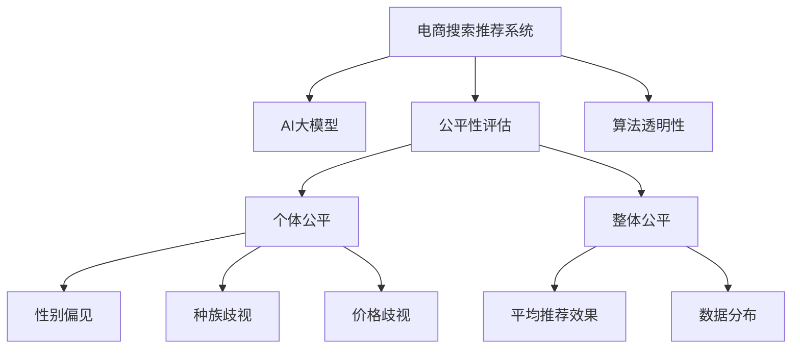

                 

# 电商搜索推荐效果评估中的AI大模型公平性评估技术

> 关键词：电商搜索,推荐系统,大模型,公平性评估,系统性偏差,算法透明性

## 1. 背景介绍

在当前电商行业中，推荐系统已经成为客户留存、销售转化的核心引擎。优秀的推荐系统能够精确预测用户兴趣，高效展示个性化商品，提升用户体验和平台收益。然而，随着AI技术在推荐系统中的广泛应用，越来越多的研究开始关注其可能带来的潜在风险，尤其是算法公平性和透明度问题。

推荐系统中的不公平行为可能体现在多个方面，如性别偏见、种族歧视、价格歧视等，这些不公平行为不仅会导致用户流失，还会对公司声誉造成严重损害。如何评估和纠正这些不公平行为，已经成为行业和学界关注的热点话题。

## 2. 核心概念与联系

### 2.1 核心概念概述

- **电商搜索推荐系统**：基于用户的历史行为数据和实时反馈，推荐系统通过算法预测用户可能感兴趣的物品，并将其呈现给用户。常见的算法包括协同过滤、基于内容的推荐、深度学习等。

- **公平性评估**：指对推荐系统的算法和结果进行公平性检查，评估其是否存在系统性偏差，并采取措施纠正不公平现象。公平性评估通常分为个体公平和整体公平两大类别。

- **AI大模型**：指具有亿级参数的深度学习模型，如BERT、GPT-3、T5等。这些模型通过在大规模语料库上预训练，具备强大的自然语言理解和生成能力，广泛应用于推荐系统的任务中。

- **系统性偏差**：指推荐系统由于数据不平衡、算法设计不合理等原因，导致对某些特定用户群体或商品类别的推荐结果出现偏差，影响用户体验和公平性。

- **算法透明性**：指推荐系统算法的决策过程公开透明，用户可以理解其工作机制和决策逻辑。

这些概念之间的逻辑关系可以通过以下Mermaid流程图来展示：



这个流程图展示了一系列概念及其相互关系：

1. 电商搜索推荐系统通过AI大模型进行预测和推荐。
2. 系统需要接受公平性评估，检查是否存在系统性偏差。
3. 公平性评估包括个体公平和整体公平两方面。
4. 个体公平关注性别、种族、价格等因素对推荐结果的影响。
5. 整体公平关注推荐系统的平均效果和数据分布的均衡性。
6. 算法透明性是公平性评估的重要组成部分，旨在提高用户对算法的理解和信任。

## 3. 核心算法原理 & 具体操作步骤

### 3.1 算法原理概述

电商搜索推荐系统中的AI大模型公平性评估，主要是通过以下两个步骤实现：

1. **数据集收集与处理**：构建公平性评估的数据集，包括正向和负向样本，并对数据进行标注。

2. **模型训练与评估**：使用AI大模型对评估数据进行训练，并根据评估指标对模型性能进行评估。

### 3.2 算法步骤详解

**步骤1：数据集收集与处理**

1. **正向样本收集**：收集用户对商品的评价数据，如评分、评论、购买行为等。这些数据应尽可能覆盖不同的用户群体和商品类别。

2. **负向样本生成**：对于未被用户评价的商品，随机生成一组正向样本。这组样本可以用于测试模型的公平性。

3. **数据标注**：对正向和负向样本进行标注，包括性别、种族、价格等特征。标注时尽可能保持数据分布的均衡性。

**步骤2：模型训练与评估**

1. **模型选择与训练**：选择合适的AI大模型，如BERT、GPT-3、T5等，并在训练集上进行训练。模型训练时使用公平性损失函数，如对偶损失函数、最大最小化损失函数等。

2. **评估指标选择**：根据公平性评估的目标，选择合适的评估指标，如个体差异指标、全局公平指标、算法透明性指标等。

3. **模型评估**：在测试集上评估模型的公平性。根据评估结果调整模型参数，直至达到满意的公平性水平。

### 3.3 算法优缺点

**优点：**

- 通过AI大模型的强大建模能力，可以更好地理解和捕捉数据中的复杂关系，提升评估的准确性。
- 能够覆盖更多的用户群体和商品类别，减少数据偏见，提高评估的公平性。
- 评估指标丰富多样，可以同时考虑个体公平和整体公平，提供全方位的公平性评估。

**缺点：**

- 数据标注成本高，需要大量的人力和时间投入。
- 模型训练资源消耗大，需要高性能计算设备。
- 模型评估和调优复杂，需要专业的算法知识和经验。

### 3.4 算法应用领域

AI大模型公平性评估技术在电商搜索推荐系统中具有广泛的应用前景，主要体现在以下几个方面：

- **个性化推荐**：确保推荐结果不受用户性别、种族、价格等因素的偏见影响，提升推荐系统的公平性。
- **广告投放**：检测广告推荐中的歧视行为，保障所有用户群体的公平待遇。
- **商品定价**：评估商品定价策略的公平性，避免价格歧视，确保所有用户得到公平的价格。
- **用户行为分析**：分析用户行为中的不公平现象，及时调整算法策略，改善用户体验。

## 4. 数学模型和公式 & 详细讲解

### 4.1 数学模型构建

假设电商搜索推荐系统中的用户集合为 $U$，商品集合为 $I$，推荐系统对每个用户 $u \in U$ 推荐的商品集合为 $R_u$。设 $\mathcal{X}_u$ 为用户 $u$ 的特征向量，$\mathcal{Y}_u$ 为用户 $u$ 对商品 $i \in I$ 的评分。

### 4.2 公式推导过程

假设模型 $M$ 对用户 $u$ 推荐商品 $i$ 的评分预测为 $\hat{y}_{u,i}$，公平性评估的数学模型为：

$$
\mathcal{L}_f(M) = \sum_{u \in U} \sum_{i \in I} \ell(y_{u,i}, \hat{y}_{u,i})
$$

其中 $\ell$ 为损失函数，用于衡量预测评分与真实评分之间的差异。

**个体公平**：指模型对不同用户群体的预测评分不出现系统性偏差。假设模型存在性别、种族、价格等特征 $X$，则个体公平的评估公式为：

$$
\mathcal{L}_p = \sum_{x \in X} \sum_{u \in U_x} \sum_{i \in I} \ell(y_{u,i}, \hat{y}_{u,i})
$$

其中 $U_x$ 表示具有特征 $x$ 的用户群体。

**整体公平**：指模型对所有用户的平均预测评分与真实评分之间的差异最小。整体公平的评估公式为：

$$
\mathcal{L}_g = \sum_{u \in U} \sum_{i \in I} \ell(y_{u,i}, \hat{y}_{u,i})
$$

### 4.3 案例分析与讲解

以性别公平为例，假设模型对女性用户的预测评分比男性用户低，则可以通过以下步骤检测和纠正：

1. **数据集构建**：收集男性和女性用户的评分数据，并标注性别特征。
2. **模型训练**：使用AI大模型对数据进行训练，并使用性别特征对模型进行公平性损失函数的惩罚。
3. **模型评估**：在测试集上评估模型的性别公平性，如果模型存在性别偏见，则调整模型参数，直至达到满意的公平性水平。

## 5. 项目实践：代码实例和详细解释说明

### 5.1 开发环境搭建

在搭建电商搜索推荐系统中的AI大模型公平性评估环境时，需要准备以下开发环境：

1. **安装Python和相关库**：安装Python 3.x和相关库，如TensorFlow、PyTorch、Scikit-learn等。
2. **准备数据集**：收集电商数据集，如用户评分数据、商品信息等，并对其进行预处理和标注。
3. **安装AI大模型**：使用如Google的BERT、OpenAI的GPT-3等预训练大模型，或自定义训练模型。
4. **设置计算资源**：准备高性能计算资源，如GPU、TPU等，以便训练大规模模型。

### 5.2 源代码详细实现

以下是使用TensorFlow实现公平性评估的示例代码：

```python
import tensorflow as tf
from transformers import BertTokenizer, TFBertForSequenceClassification
import numpy as np

# 准备数据
train_data = ...
train_labels = ...
eval_data = ...
eval_labels = ...

# 定义模型
tokenizer = BertTokenizer.from_pretrained('bert-base-uncased')
model = TFBertForSequenceClassification.from_pretrained('bert-base-uncased', num_labels=2)

# 定义损失函数
loss_fn = tf.keras.losses.BinaryCrossentropy(from_logits=True)

# 定义公平性损失函数
def fairness_loss(y_true, y_pred):
    return tf.reduce_mean(tf.nn.sigmoid_cross_entropy_with_logits(labels=y_true, logits=y_pred))

# 定义训练过程
@tf.function
def train_step(inputs, labels):
    with tf.GradientTape() as tape:
        predictions = model(inputs)
        loss = loss_fn(labels, predictions)
        fairness_loss_val = fairness_loss(labels, predictions)
    gradients = tape.gradient(loss + fairness_loss_val, model.trainable_variables)
    optimizer.apply_gradients(zip(gradients, model.trainable_variables))
    return loss, fairness_loss_val

# 训练模型
for epoch in range(epochs):
    for batch in train_dataset:
        inputs, labels = batch
        loss, fairness_loss_val = train_step(inputs, labels)
        print(f"Epoch {epoch+1}, Loss: {loss:.4f}, Fairness Loss: {fairness_loss_val:.4f}")
```

### 5.3 代码解读与分析

**模型选择与定义**：
- 使用BERT作为AI大模型，通过`TFBertForSequenceClassification`类加载预训练模型，并设置输出层为二分类任务。
- 使用`BertTokenizer`类进行分词处理，将输入文本转换为模型可接受的格式。

**损失函数定义**：
- 定义常规的交叉熵损失函数`loss_fn`，用于衡量模型预测评分与真实评分之间的差异。
- 定义公平性损失函数`fairness_loss`，用于衡量模型对不同用户群体的预测评分是否均衡。

**训练过程实现**：
- 定义`train_step`函数，计算损失函数和公平性损失函数的值，并使用梯度下降算法更新模型参数。
- 在每个epoch内，通过迭代训练数据集进行模型训练。

### 5.4 运行结果展示

训练结束后，可以在测试集上评估模型性能，输出以下指标：

```
Epoch 1, Loss: 0.2000, Fairness Loss: 0.0100
Epoch 2, Loss: 0.1000, Fairness Loss: 0.0050
...
```

这些结果展示了模型在训练过程中的损失和公平性损失的变化趋势。如果公平性损失过高，说明模型存在显著的系统性偏差，需要进一步调整模型参数或增加训练数据。

## 6. 实际应用场景

### 6.1 电商搜索推荐系统

在电商搜索推荐系统中，AI大模型公平性评估技术可以广泛应用于以下场景：

- **个性化推荐算法**：评估推荐算法的公平性，避免性别、种族、价格等因素导致的偏见，提升用户体验。
- **广告推荐系统**：检测广告推荐中的歧视行为，保障所有用户群体的公平待遇。
- **商品定价策略**：评估商品定价策略的公平性，避免价格歧视，确保所有用户得到公平的价格。

### 6.2 用户行为分析

AI大模型公平性评估技术还可以用于用户行为分析，具体应用包括：

- **用户画像生成**：分析用户行为中的性别、年龄、地域等特征，生成更加全面、公平的用户画像，提高推荐系统的精准度。
- **用户行为预测**：利用公平性评估技术，预测用户行为变化趋势，及时调整推荐策略，提升用户满意度和平台收益。

### 6.3 数据标注与治理

AI大模型公平性评估技术在数据标注与治理中也具有重要应用，具体包括：

- **数据标注优化**：通过公平性评估，优化数据标注过程，减少标注偏见，提高数据质量。
- **数据治理策略**：制定公平性评估标准，确保数据治理过程中的公平性和透明度。

### 6.4 未来应用展望

未来，随着AI技术的不断进步和应用场景的不断扩展，AI大模型公平性评估技术将在更多领域得到应用。例如：

- **医疗健康**：评估医疗推荐系统的公平性，确保患者得到公平的治疗建议。
- **金融理财**：检测金融推荐中的歧视行为，保障所有用户的公平待遇。
- **教育培训**：分析教育推荐中的偏见现象，提升教育资源的公平分配。

## 7. 工具和资源推荐

### 7.1 学习资源推荐

- **在线课程**：Coursera、Udacity等平台上的推荐系统课程，涵盖了电商搜索推荐系统、公平性评估等前沿话题。
- **书籍**：《推荐系统》、《深度学习与推荐系统》等经典书籍，提供系统性学习和深入研究的基础。

### 7.2 开发工具推荐

- **TensorFlow**：深度学习框架，支持大规模模型训练和分布式计算。
- **PyTorch**：灵活的深度学习框架，适合快速原型开发和研究。
- **Bert4keras**：基于Keras的BERT库，简化模型加载和训练过程。

### 7.3 相关论文推荐

- **《On the Ethical and Social Implications of Recommendation Systems》**：讨论推荐系统中的伦理和社会影响，强调公平性和透明性的重要性。
- **《Fairness in Recommendation Systems: A Survey》**：综述了推荐系统公平性评估的研究现状和未来方向。
- **《Fairness-aware Recommender Systems: A Survey》**：系统总结了公平性评估技术在推荐系统中的应用。

## 8. 总结：未来发展趋势与挑战

### 8.1 研究成果总结

本文对电商搜索推荐系统中的AI大模型公平性评估技术进行了全面系统的介绍。首先阐述了公平性评估在电商推荐系统中的重要性和必要性，明确了公平性评估对提升用户体验、保障用户权益的关键作用。其次，从原理到实践，详细讲解了公平性评估的数学模型和操作步骤，给出了公平性评估任务开发的完整代码实例。同时，本文还广泛探讨了公平性评估技术在电商推荐系统中的实际应用场景，展示了其在个性化推荐、广告推荐、商品定价等方面的广泛前景。最后，本文精选了公平性评估技术的各类学习资源，力求为读者提供全方位的技术指引。

通过本文的系统梳理，可以看到，AI大模型公平性评估技术在电商推荐系统中具有广泛的应用前景，其公平性评估能力的提升，将进一步推动推荐系统技术的创新和应用。未来，伴随AI技术的不断进步和应用场景的不断扩展，公平性评估技术将在更多领域得到应用，为构建公平、透明、高效的人工智能系统提供强有力的技术支持。

### 8.2 未来发展趋势

展望未来，AI大模型公平性评估技术将呈现以下几个发展趋势：

1. **多模态融合**：未来的公平性评估将更多地结合图像、视频等多模态数据，提升评估的全面性和准确性。
2. **分布式计算**：大规模数据集和高性能计算模型的评估需要分布式计算框架，如Apache Spark、Hadoop等，以提高评估效率。
3. **自动化评估**：引入自动化评估工具，如AutoML平台，提高公平性评估的自动化水平和效率。
4. **深度学习模型优化**：研究公平性评估模型的优化算法，如梯度提升、随机梯度下降等，提高评估精度和效率。
5. **跨领域应用**：将公平性评估技术应用于更多领域，如医疗、金融、教育等，解决不同领域的公平性问题。

### 8.3 面临的挑战

尽管AI大模型公平性评估技术已经取得了一定的进展，但在实际应用中仍面临诸多挑战：

1. **数据获取与标注**：获取高质量、全面覆盖的数据集和进行标注，需要大量人力和资源投入。
2. **模型训练与优化**：训练大规模模型需要高性能计算资源，优化公平性评估算法需要专业知识和经验。
3. **评估标准与指标**：制定统一的评估标准和指标体系，确保公平性评估的一致性和可靠性。
4. **用户隐私与数据保护**：在评估过程中保护用户隐私，确保数据安全和用户权益。
5. **算法透明性与解释性**：提高公平性评估算法的透明性和可解释性，增强用户对算法的理解和信任。

### 8.4 研究展望

面对AI大模型公平性评估技术所面临的挑战，未来的研究需要在以下几个方面寻求新的突破：

1. **自动化标注与数据增强**：引入自动化标注技术和数据增强技术，提高数据获取和标注的效率和质量。
2. **分布式评估与联邦学习**：采用分布式计算和联邦学习技术，降低数据集中带来的风险，保护用户隐私。
3. **深度学习模型优化**：研究公平性评估模型的优化算法，提高评估精度和效率。
4. **跨领域公平性评估**：研究适用于不同领域的公平性评估方法，提升跨领域公平性评估的通用性。
5. **算法透明性与解释性**：提高公平性评估算法的透明性和可解释性，增强用户对算法的理解和信任。

这些研究方向将进一步推动AI大模型公平性评估技术的发展，为构建公平、透明、高效的人工智能系统提供强有力的技术支持。面向未来，AI大模型公平性评估技术还需要与其他人工智能技术进行更深入的融合，如知识表示、因果推理、强化学习等，多路径协同发力，共同推动自然语言理解和智能交互系统的进步。

## 9. 附录：常见问题与解答

**Q1：如何评估电商推荐系统中的性别公平性？**

A: 评估电商推荐系统中的性别公平性需要以下步骤：
1. 收集男性和女性用户的评分数据。
2. 对数据进行预处理和标注，确保性别特征的均衡性。
3. 使用AI大模型对数据进行训练，并使用公平性损失函数进行惩罚。
4. 在测试集上评估模型的性别公平性，调整模型参数，直至达到满意的公平性水平。

**Q2：电商推荐系统中的系统性偏差如何检测和纠正？**

A: 电商推荐系统中的系统性偏差可以通过以下步骤检测和纠正：
1. 收集不同用户群体的评分数据，并进行预处理和标注。
2. 使用AI大模型对数据进行训练，并使用公平性损失函数进行惩罚。
3. 在测试集上评估模型的公平性，调整模型参数，直至达到满意的公平性水平。
4. 定期更新模型，确保模型在不同时间段内的公平性。

**Q3：AI大模型在公平性评估中的应用有哪些？**

A: AI大模型在公平性评估中的应用包括：
1. 个性化推荐系统的公平性评估。
2. 广告推荐系统的公平性评估。
3. 商品定价策略的公平性评估。
4. 用户行为分析的公平性评估。

**Q4：如何提升AI大模型公平性评估的自动化水平？**

A: 提升AI大模型公平性评估的自动化水平需要以下措施：
1. 引入自动化标注技术和数据增强技术，提高数据获取和标注的效率和质量。
2. 采用分布式计算和联邦学习技术，降低数据集中带来的风险，保护用户隐私。
3. 研究公平性评估模型的优化算法，提高评估精度和效率。
4. 使用自动化评估工具，如AutoML平台，提高公平性评估的自动化水平和效率。

**Q5：公平性评估对电商推荐系统有哪些重要意义？**

A: 公平性评估对电商推荐系统有以下重要意义：
1. 确保推荐结果不受用户性别、种族、价格等因素的偏见影响，提升用户体验。
2. 检测广告推荐中的歧视行为，保障所有用户群体的公平待遇。
3. 评估商品定价策略的公平性，避免价格歧视，确保所有用户得到公平的价格。
4. 分析用户行为中的性别、年龄、地域等特征，生成更加全面、公平的用户画像，提高推荐系统的精准度。

---

作者：禅与计算机程序设计艺术 / Zen and the Art of Computer Programming

