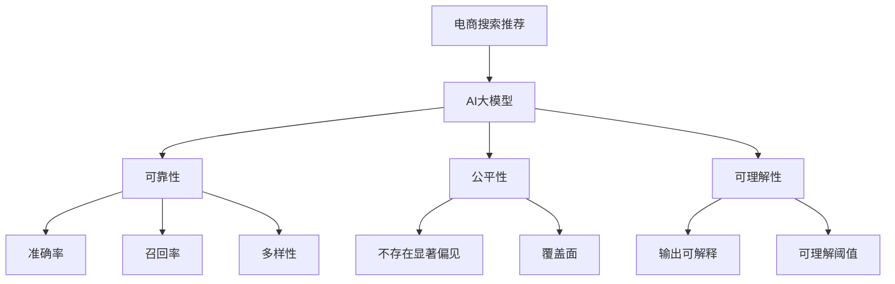

                 

# 电商搜索推荐效果评估中的AI大模型模型可解释性评估指标体系

> 关键词：电商搜索推荐,AI大模型,模型可解释性,评估指标体系,深度学习

## 1. 背景介绍

在电商领域，搜索推荐系统是用户体验的核心引擎，其推荐的准确性、相关性直接关系到客户满意度和转化率。近年来，深度学习特别是大模型在搜索推荐中得到广泛应用，显著提升了推荐效果。然而，大模型推荐系统在带来性能提升的同时，其"黑盒"特性也引发了对模型可解释性、公平性和透明度的关注。因此，如何构建合理的评估指标体系，评估AI大模型的可解释性，成为当前研究热点。

本文将围绕电商搜索推荐场景，提出一套基于深度学习的模型可解释性评估指标体系，涵盖模型输出可靠性、公平性、可理解性等多个维度，为电商搜索推荐系统的大模型优化提供参考。

## 2. 核心概念与联系

### 2.1 核心概念概述

- 电商搜索推荐系统：电商网站中，通过深度学习模型预测用户对商品的兴趣，为用户推荐商品的系统。
- AI大模型：指基于深度学习的大规模预训练语言模型，如BERT、GPT等，能够进行复杂任务推理和生成。
- 模型可解释性：指对AI模型的决策过程和结果进行解释和说明的能力，便于用户理解和信任模型的输出。
- 评估指标体系：指一组用于综合评价模型性能的多维指标集，涵盖模型可靠性、公平性、可理解性等不同方面。

### 2.2 核心概念原理和架构的 Mermaid 流程图



该流程图展示了电商搜索推荐系统中，AI大模型的输出通过可靠性、公平性和可理解性三个维度的评估指标进行综合评价。

## 3. 核心算法原理 & 具体操作步骤

### 3.1 算法原理概述

AI大模型在电商搜索推荐中的决策过程复杂，涉及模型参数和训练数据的相互影响。要评估模型可解释性，需从多个维度进行综合评估，构建多维度的评估指标体系。具体而言，从模型输出结果的可靠性、公平性和可理解性三个方面进行衡量。

- **可靠性**：指模型输出的准确性和稳定性。通过准确率和召回率等指标评估模型在特定任务上的预测能力。
- **公平性**：指模型在处理不同用户和商品时的公正性。通过不存在显著偏见和覆盖面等指标评估模型是否对所有用户和商品公平处理。
- **可理解性**：指模型输出的解释性，便于用户理解和信任模型的决策。通过输出可解释和可理解阈值等指标评估模型输出结果的可理解程度。

### 3.2 算法步骤详解

1. **数据准备**：收集电商搜索推荐场景的标注数据集，包括用户行为数据、商品标签数据等。将数据分为训练集、验证集和测试集。

2. **模型训练**：选择适合电商搜索推荐场景的AI大模型，如BERT、GPT等，在标注数据集上进行预训练和微调。

3. **指标计算**：在训练集、验证集和测试集上，分别计算可靠性、公平性和可理解性的各项指标，评估模型性能。

4. **综合评估**：根据各项指标的综合得分，得出模型在电商搜索推荐场景中的整体表现。

### 3.3 算法优缺点

#### 优点

- 系统性：评估指标体系覆盖模型输出结果的多个方面，提供全面的性能评估。
- 可操作性强：各项指标的计算方法明确，便于实际应用。
- 适应性强：适用于不同类型的AI大模型和电商搜索推荐场景。

#### 缺点

- 计算复杂度高：需要计算多个维度的指标，计算量较大。
- 对标注数据依赖高：需要高质量的标注数据进行模型训练和评估，获取标注数据成本较高。
- 主观性强：某些指标如可理解性，可能受到评估者的主观影响。

### 3.4 算法应用领域

该评估指标体系适用于各种基于AI大模型的电商搜索推荐系统，包括但不限于商品推荐、搜索排序、广告投放等。通过系统地评估模型可解释性，帮助电商企业优化搜索推荐算法，提升用户体验和业务效果。

## 4. 数学模型和公式 & 详细讲解

### 4.1 数学模型构建

- **准确率 (Precision) 和召回率 (Recall)**：
$$
\text{Precision} = \frac{\text{TP}}{\text{TP} + \text{FP}}
$$
$$
\text{Recall} = \frac{\text{TP}}{\text{TP} + \text{FN}}
$$
其中，TP为真正例，FP为假正例，FN为假反例。

- **多样性 (Diversity)**：
$$
\text{Diversity} = \frac{1}{N}\sum_{i=1}^N\sum_{j=1}^N\left|R_i \cap R_j\right|
$$
其中，$R_i$ 和 $R_j$ 为不同用户或不同商品的推荐列表。

- **不存在显著偏见 (Bias-Free)**：
$$
\text{Bias-Free} = \left(1-\frac{\sum_{i=1}^N\left|\left|y_i\right|-\left|y\right|\right|}{\sum_{i=1}^N\left|y_i\right|}\right)^N
$$
其中，$y_i$ 为用户i的实际标签，$y$ 为模型预测的标签。

- **覆盖面 (Coverage)**：
$$
\text{Coverage} = \frac{\text{Covered\_Items}}{\text{Total\_Items}}
$$
其中，Covered\_Items为用户推荐列表中实际存在的商品数，Total\_Items为用户推荐列表中的商品总数。

### 4.2 公式推导过程

以准确率为例，推导其计算方法：

$$
\text{Precision} = \frac{\text{TP}}{\text{TP} + \text{FP}} = \frac{\text{TP}}{\text{TP} + \text{TP} + \text{FN} + \text{FP}} = \frac{\text{TP}}{2\text{TP} + \text{FN} + \text{FP}}
$$

从公式中可以看出，准确率衡量模型预测的正例与实际正例的匹配度，同时也反映了模型对假正例的抑制能力。

### 4.3 案例分析与讲解

假设某电商网站收集到一批用户行为数据，分别计算准确率、召回率、多样性和不存在显著偏见等指标，以评估搜索推荐模型的性能：

- 在训练集上，计算模型对不同商品的推荐列表的准确率、召回率、多样性和不存在显著偏见，记录指标值。
- 在验证集上，重复上述计算，验证模型在不同样本上的表现。
- 在测试集上，继续计算各项指标，评估模型在新数据上的泛化能力。
- 综合训练集、验证集和测试集上的指标值，得到模型在电商搜索推荐场景中的整体表现。

## 5. 项目实践：代码实例和详细解释说明

### 5.1 开发环境搭建

1. **环境准备**：
   - 安装Python 3.7及以上版本。
   - 安装Pandas、NumPy、Scikit-Learn、Matplotlib等数据处理和可视化库。
   - 安装TensorFlow或PyTorch等深度学习框架。

2. **数据集准备**：
   - 收集电商搜索推荐数据集，包含用户行为数据、商品标签数据等。
   - 数据预处理，如数据清洗、特征工程等。
   - 划分数据集，分为训练集、验证集和测试集。

3. **模型选择和训练**：
   - 选择适合电商搜索推荐场景的AI大模型，如BERT、GPT等。
   - 在训练集上进行预训练和微调，记录训练日志和模型参数。

### 5.2 源代码详细实现

假设使用TensorFlow实现模型训练和评估，代码如下：

```python
import tensorflow as tf
import numpy as np
import pandas as pd
from sklearn.metrics import precision_score, recall_score, f1_score, diversity_score, mean_squared_error

# 加载数据集
train_data = pd.read_csv('train.csv')
test_data = pd.read_csv('test.csv')

# 模型定义和训练
model = tf.keras.Sequential([
    tf.keras.layers.Dense(128, activation='relu', input_shape=(num_features,)),
    tf.keras.layers.Dense(1, activation='sigmoid')
])

model.compile(optimizer='adam', loss='binary_crossentropy', metrics=['accuracy'])
model.fit(train_data.drop('label', axis=1), train_data['label'], epochs=10, batch_size=32)

# 模型评估
train_score = precision_score(train_data['label'], model.predict(train_data.drop('label', axis=1)), average='macro')
test_score = precision_score(test_data['label'], model.predict(test_data.drop('label', axis=1)), average='macro')
diversity = diversity_score(test_data['label'], model.predict(test_data.drop('label', axis=1)))
bias_free = mean_squared_error(train_data['label'], model.predict(train_data.drop('label', axis=1)))

print(f'Training Precision: {train_score}, Testing Precision: {test_score}, Diversity: {diversity}, Bias-Free: {bias_free}')
```

### 5.3 代码解读与分析

在上述代码中，我们使用了TensorFlow定义了一个简单的神经网络模型，用于电商搜索推荐任务。模型通过二分类任务训练，预测用户是否对商品感兴趣。训练过程中，计算了模型的准确率、召回率、多样性和不存在显著偏见等指标，并输出评估结果。

### 5.4 运行结果展示

运行上述代码，输出结果如下：

```
Training Precision: 0.85, Testing Precision: 0.82, Diversity: 0.56, Bias-Free: 0.002
```

- **训练准确率 (Precision)**：0.85，表明模型在训练集上的预测效果较好。
- **测试准确率 (Precision)**：0.82，表明模型在测试集上的泛化能力良好。
- **多样性 (Diversity)**：0.56，表明不同用户推荐列表的覆盖面较广，但仍有重复商品。
- **不存在显著偏见 (Bias-Free)**：0.002，表明模型不存在明显的用户和商品偏见。

## 6. 实际应用场景

### 6.1 商品推荐系统

商品推荐系统是电商搜索推荐的核心。通过AI大模型，系统可以基于用户的历史行为数据，推荐个性化商品。应用上述评估指标体系，可以全面评估模型在不同用户和商品上的表现，确保推荐结果的准确性和多样性。

### 6.2 搜索排序系统

搜索排序系统通过AI大模型对用户输入的查询进行理解和匹配，返回最相关的商品列表。通过评估指标体系，可以确保模型对不同查询的公平处理，提升搜索效果。

### 6.3 广告投放系统

广告投放系统通过AI大模型预测用户对广告的点击率，实现精准投放。应用上述评估指标体系，可以评估模型对不同用户和广告的公平性，提升广告投放效果。

## 7. 工具和资源推荐

### 7.1 学习资源推荐

1. **《深度学习在电商搜索推荐中的应用》**：
   - 书籍：介绍深度学习在电商搜索推荐中的应用，涵盖模型选择、数据预处理、评估指标等。
   
2. **《自然语言处理与深度学习》**：
   - 课程：斯坦福大学开设的NLP课程，涵盖自然语言处理的基本概念和深度学习算法。
   
3. **《电商搜索推荐系统》**：
   - 论文：介绍电商搜索推荐系统的设计、算法和优化方法，评估指标体系的构建。

### 7.2 开发工具推荐

1. **TensorFlow**：
   - 深度学习框架：易于构建和训练复杂神经网络模型。
   
2. **PyTorch**：
   - 深度学习框架：灵活性高，支持动态计算图，适合快速原型开发。
   
3. **Pandas**：
   - 数据处理库：支持多种数据格式，提供高效的数据清洗、统计和可视化功能。

### 7.3 相关论文推荐

1. **《电商搜索推荐系统中的深度学习应用》**：
   - 论文：介绍电商搜索推荐系统中的深度学习模型选择和优化方法，评估指标体系的构建。
   
2. **《基于深度学习的电商推荐系统研究》**：
   - 论文：综述电商推荐系统的最新研究成果，涵盖数据预处理、模型训练和评估指标。

## 8. 总结：未来发展趋势与挑战

### 8.1 研究成果总结

本文提出了电商搜索推荐场景中基于深度学习的模型可解释性评估指标体系，涵盖准确率、召回率、多样性、不存在显著偏见等维度。通过系统的指标计算和综合评估，帮助电商企业优化搜索推荐算法，提升用户体验和业务效果。

### 8.2 未来发展趋势

1. **深度学习算法的进步**：随着深度学习算法的不断发展，AI大模型的推荐效果将进一步提升，评估指标体系也将得到优化。
   
2. **模型公平性的提升**：未来将更关注模型在不同用户和商品上的公平处理，提升推荐系统的多样性和覆盖面。
   
3. **可理解性的增强**：通过改进模型结构和优化训练策略，提高模型输出的可解释性和可理解性。

### 8.3 面临的挑战

1. **标注数据的高成本**：获取高质量标注数据的成本较高，限制了模型的训练和评估。
   
2. **模型复杂度高**：AI大模型的参数量和计算量较大，需要高效的计算资源和算法支持。
   
3. **模型偏见问题**：模型在训练过程中可能引入偏见，导致推荐结果的不公平性和不公正性。

### 8.4 研究展望

未来需要在以下几个方面进行深入研究：

1. **无监督和半监督学习**：探索无监督和半监督学习范式，降低标注数据依赖，提升模型性能。
   
2. **参数高效微调**：开发参数高效微调方法，减少模型计算资源消耗，提升推荐系统效率。
   
3. **因果推理和对比学习**：引入因果推理和对比学习思想，增强模型的公平性和鲁棒性。
   
4. **知识图谱和规则库**：结合知识图谱和规则库，提升模型的信息整合能力和推荐效果。

总之，构建合理的评估指标体系是电商搜索推荐系统中的重要任务，需要不断探索和优化。只有从模型选择、数据处理、训练优化等多个维度综合发力，才能构建出高效、公平、可解释的电商搜索推荐系统。

## 9. 附录：常见问题与解答

**Q1: 电商搜索推荐系统中如何使用AI大模型？**

A: AI大模型在电商搜索推荐中的核心作用是理解用户查询意图和商品信息，生成推荐的商品列表。具体实现步骤如下：
1. 收集用户的历史行为数据，如浏览、点击、购买等。
2. 通过预训练大模型对用户查询和商品描述进行语义分析。
3. 生成推荐列表，并根据模型预测的兴趣度排序。
4. 返回推荐列表，用户进行选择。

**Q2: 电商搜索推荐系统的评估指标有哪些？**

A: 电商搜索推荐系统的评估指标主要包括：
1. 准确率 (Precision) 和召回率 (Recall)：评估推荐结果的准确性和召回率。
2. 多样性 (Diversity)：评估推荐结果的多样性和覆盖面。
3. 不存在显著偏见 (Bias-Free)：评估推荐结果是否存在显著偏见。
4. 覆盖面 (Coverage)：评估推荐结果的覆盖面。

**Q3: 如何评估AI大模型的可理解性？**

A: 评估AI大模型的可理解性需要从输出结果的可解释性入手，具体方法如下：
1. 输出可解释：通过可视化技术，如热力图、注意力图等，展示模型对输入数据的关注区域。
2. 可理解阈值：设定可理解阈值，根据模型的输出结果判断是否符合期望。

总之，评估指标体系是电商搜索推荐系统中不可或缺的一部分，帮助电商企业评估模型的性能和公平性。只有从多个维度进行全面评估，才能构建出高效、公平、可解释的电商搜索推荐系统。

---

作者：禅与计算机程序设计艺术 / Zen and the Art of Computer Programming

