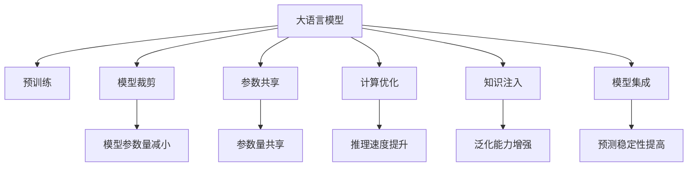

                 

# 电商搜索推荐系统的AI大模型优化策略

## 1. 背景介绍

### 1.1 问题由来

电商搜索推荐系统是电子商务的核心引擎，直接影响用户购物体验和商家业绩。传统推荐算法如协同过滤、基于内容的推荐等，难以捕捉用户的动态行为和需求变化，效果往往不尽人意。近年来，随着深度学习技术的进步，人工智能大模型被引入电商推荐系统，带来了显著的性能提升。

人工智能大模型如BERT、GPT-3等，通过在大规模语料库上进行自监督预训练，获得了强大的语义理解和生成能力。将其应用于电商搜索推荐，可以显著提升推荐系统的个性化程度和多样性。然而，由于大模型参数量庞大，计算资源消耗大，导致实际应用中难以大规模部署。

### 1.2 问题核心关键点

大模型优化策略的核心在于如何在保留大模型核心能力的同时，减小模型参数和计算复杂度，从而实现高效的电商搜索推荐。关键点包括：

1. **模型裁剪**：去除冗余层和参数，减小模型尺寸。
2. **参数共享**：在特定任务上共享部分参数，减小参数量。
3. **计算优化**：优化计算图和硬件配置，提高模型推理速度。
4. **知识注入**：将先验知识与大模型进行融合，增强模型的泛化能力和解释性。
5. **模型集成**：通过模型集成提高预测稳定性，减少单个模型的过拟合风险。

这些优化策略将使得大模型在电商搜索推荐中得到更广泛的应用，同时降低计算成本，提升系统性能。

### 1.3 问题研究意义

研究大模型的电商搜索推荐优化策略，具有以下重要意义：

1. **降低应用成本**：通过优化策略，可以显著减少大模型在电商推荐系统中的计算资源消耗，降低应用成本。
2. **提升推荐效果**：优化后的模型具有更高的精度和稳定性，能够更好地捕捉用户需求，提升推荐系统的个性化和多样性。
3. **加速系统开发**：优化策略可以提高模型训练和推理的速度，缩短系统开发周期，加速市场部署。
4. **增强用户信任**：优化的模型能够提供更准确、可解释的推荐结果，增强用户对推荐系统的信任感。
5. **支持业务扩展**：优化策略能够扩展到大模型在更多电商场景中的应用，如物流、客服等，形成更完整的电商生态系统。

## 2. 核心概念与联系

### 2.1 核心概念概述

为更好地理解电商搜索推荐系统中大模型优化策略的原理，本节将介绍几个关键概念：

- **大语言模型(Large Language Model, LLM)**：如BERT、GPT-3等，通过在大规模语料库上进行预训练，获得强大的语义理解和生成能力。
- **预训练(Pre-training)**：在大规模无标签数据上，通过自监督学习任务训练通用语言模型的过程。
- **模型裁剪(Model Pruning)**：去除模型中的冗余层和参数，减小模型尺寸。
- **参数共享(Parameter Sharing)**：在特定任务上共享部分参数，减小参数量。
- **计算优化(Computational Optimization)**：优化计算图和硬件配置，提高模型推理速度。
- **知识注入(Knowledge Injection)**：将先验知识与大模型进行融合，增强模型的泛化能力和解释性。
- **模型集成(Model Ensemble)**：通过模型集成提高预测稳定性，减少单个模型的过拟合风险。

这些核心概念之间的逻辑关系可以通过以下Mermaid流程图来展示：



这个流程图展示了大模型优化策略的核心概念及其之间的关系：

1. 大模型通过预训练获得基础能力。
2. 在电商推荐系统中，优化策略如模型裁剪、参数共享等，进一步减小模型尺寸和参数量。
3. 计算优化和知识注入进一步提升模型推理速度和泛化能力。
4. 模型集成提高预测稳定性，减少过拟合风险。

这些概念共同构成了电商搜索推荐系统中大模型优化策略的完整框架，使其能够在电商推荐场景中发挥强大的语义理解和生成能力。通过理解这些核心概念，我们可以更好地把握大语言模型在电商推荐中的应用方向和优化方法。

## 3. 核心算法原理 & 具体操作步骤
### 3.1 算法原理概述

电商搜索推荐系统中，大模型优化策略的核心是减少模型的计算复杂度和参数量，同时保持模型在推荐任务上的高精度。优化策略主要包括以下几个步骤：

1. **模型裁剪**：去除大模型中的冗余层和参数，减小模型尺寸。
2. **参数共享**：在特定推荐任务上共享部分参数，减少参数量。
3. **计算优化**：优化计算图和硬件配置，提高模型推理速度。
4. **知识注入**：将先验知识与大模型进行融合，增强模型的泛化能力和解释性。
5. **模型集成**：通过模型集成提高预测稳定性，减少单个模型的过拟合风险。

这些步骤共同作用，使得大模型在电商推荐系统中更加高效和适用。

### 3.2 算法步骤详解

以下我们将详细介绍每个步骤的具体实现方法：

#### 3.2.1 模型裁剪

模型裁剪是通过去除模型中的冗余层和参数，减小模型尺寸的过程。这通常包括以下几个步骤：

1. **重要度评估**：使用特定的评估指标，如权重的L2范数、激活值的重要性等，评估模型中每一层的贡献度。
2. **参数筛选**：根据评估结果，筛选掉贡献度较低的参数。
3. **模型压缩**：重新训练或微调剩余的模型，保持模型性能不变或略有提升。

#### 3.2.2 参数共享

参数共享是指在特定任务上，共享大模型中的一部分参数，减少参数量。这通常包括以下几个步骤：

1. **任务适配**：根据推荐任务的特点，确定需要共享的参数。
2. **参数共享**：将共享参数初始化为一个固定值，或使用预训练参数的平均值或均方根值。
3. **模型微调**：在特定任务上微调共享参数，更新其余参数，保持模型性能。

#### 3.2.3 计算优化

计算优化是通过优化计算图和硬件配置，提高模型推理速度的过程。这通常包括以下几个步骤：

1. **计算图优化**：使用编译器对计算图进行优化，去除冗余的计算操作。
2. **并行计算**：使用并行计算技术，如数据并行、模型并行等，提高计算效率。
3. **硬件加速**：使用GPU、TPU等高性能硬件，加速模型推理。

#### 3.2.4 知识注入

知识注入是将先验知识与大模型进行融合，增强模型的泛化能力和解释性的过程。这通常包括以下几个步骤：

1. **领域知识抽取**：从领域专家的知识库中提取相关知识。
2. **知识编码**：将领域知识编码为向量或张量，与大模型的输入输出进行融合。
3. **模型微调**：在特定任务上微调模型，使得其能够利用先验知识进行推理和生成。

#### 3.2.5 模型集成

模型集成是通过集成多个模型，提高预测稳定性和减少过拟合风险的过程。这通常包括以下几个步骤：

1. **模型训练**：训练多个相似模型的变体，保持每个模型的独立性。
2. **预测融合**：对每个模型的预测结果进行融合，得到最终的推荐结果。
3. **模型调参**：通过交叉验证等方法，调整模型的集成参数，优化预测效果。

### 3.3 算法优缺点

电商搜索推荐系统中，大模型优化策略的优点包括：

1. **提升推荐效果**：优化后的模型具有更高的精度和稳定性，能够更好地捕捉用户需求，提升推荐系统的个性化和多样性。
2. **降低应用成本**：通过优化策略，可以显著减少大模型在电商推荐系统中的计算资源消耗，降低应用成本。
3. **加速系统开发**：优化策略可以提高模型训练和推理的速度，缩短系统开发周期，加速市场部署。
4. **增强用户信任**：优化的模型能够提供更准确、可解释的推荐结果，增强用户对推荐系统的信任感。

同时，该方法也存在一些局限性：

1. **复杂度增加**：优化策略的实施可能会增加系统的复杂度，增加维护和调优的难度。
2. **参数共享风险**：参数共享可能导致模型泛化能力下降，在特定任务上效果不佳。
3. **计算优化限制**：计算优化可能依赖于特定硬件配置，限制了模型的通用性。
4. **知识注入复杂**：先验知识与大模型的融合需要复杂的编码和融合技术，增加了实现的难度。
5. **模型集成困难**：模型集成的效果依赖于模型的多样性和集成策略的选择，难以保证最优。

尽管存在这些局限性，但就目前而言，大模型优化策略在电商搜索推荐中仍然具有重要价值。未来相关研究的重点在于如何进一步降低优化策略的复杂度，提高其通用性和可解释性，同时兼顾模型的性能和应用成本。

### 3.4 算法应用领域

大模型优化策略不仅适用于电商搜索推荐系统，还广泛应用于以下领域：

1. **智能客服**：通过优化大模型，构建智能客服系统，提升用户交互体验和问题解决效率。
2. **金融风控**：利用优化后的模型进行欺诈检测、风险评估等，提升金融服务的准确性和安全性。
3. **健康医疗**：在医疗诊断、健康监测等领域应用优化后的模型，提升医疗服务的个性化和精准度。
4. **智慧城市**：通过优化大模型，构建智慧城市管理平台，提升城市管理和公共服务的智能化水平。
5. **内容推荐**：在视频、音乐、新闻等领域应用优化后的模型，提升内容推荐的个性化和多样性。

除了上述这些领域，大模型优化策略还可以进一步拓展到更多场景中，为各行各业带来智能化和效率提升。

## 4. 数学模型和公式 & 详细讲解
### 4.1 数学模型构建

电商搜索推荐系统中，大模型的优化目标是通过裁剪、共享、优化等手段，减小模型尺寸和参数量，同时保持模型在推荐任务上的高精度。以下是数学模型的构建：

设大模型为 $M_{\theta}$，其中 $\theta$ 为模型参数。电商推荐任务为 $T$，训练集为 $D=\{(x_i,y_i)\}_{i=1}^N$，其中 $x_i$ 为输入样本，$y_i$ 为推荐结果。

假设模型裁剪后的模型为 $M_{\theta^*}$，参数量为 $d$。优化目标是最小化模型在推荐任务上的损失函数 $\mathcal{L}$，即：

$$
\theta^* = \mathop{\arg\min}_{\theta} \mathcal{L}(M_{\theta},D)
$$

其中 $\mathcal{L}$ 为推荐任务 $T$ 的损失函数，用于衡量模型预测结果与真实标签之间的差异。

### 4.2 公式推导过程

以下我们以二分类推荐任务为例，推导优化目标函数及其梯度的计算公式。

设模型 $M_{\theta}$ 在输入 $x_i$ 上的输出为 $\hat{y}=M_{\theta}(x_i)$，表示样本被推荐为正类的概率。真实标签 $y_i \in \{0,1\}$。则二分类交叉熵损失函数定义为：

$$
\ell(M_{\theta}(x_i),y_i) = -[y_i\log \hat{y}_i + (1-y_i)\log (1-\hat{y}_i)]
$$

将其代入经验风险公式，得：

$$
\mathcal{L}(\theta) = -\frac{1}{N}\sum_{i=1}^N [y_i\log M_{\theta}(x_i)+(1-y_i)\log(1-M_{\theta}(x_i))]
$$

根据链式法则，损失函数对参数 $\theta_k$ 的梯度为：

$$
\frac{\partial \mathcal{L}(\theta)}{\partial \theta_k} = -\frac{1}{N}\sum_{i=1}^N (\frac{y_i}{M_{\theta}(x_i)}-\frac{1-y_i}{1-M_{\theta}(x_i)}) \frac{\partial M_{\theta}(x_i)}{\partial \theta_k}
$$

其中 $\frac{\partial M_{\theta}(x_i)}{\partial \theta_k}$ 可进一步递归展开，利用自动微分技术完成计算。

在得到损失函数的梯度后，即可带入参数更新公式，完成模型的迭代优化。重复上述过程直至收敛，最终得到适应电商推荐任务的最优模型参数 $\theta^*$。

### 4.3 案例分析与讲解

**案例一：模型裁剪**

假设我们有一个包含多个隐藏层的大模型 $M_{\theta}$，其中第1-5层为输入编码层，第6-10层为特征提取层，第11-15层为输出解码层。

我们对模型进行重要性评估，得到每个层的权重范数如下：

| 层数 | 权重范数 |
| --- | --- |
| 1 | 0.01 |
| 2 | 0.02 |
| 3 | 0.03 |
| 4 | 0.04 |
| 5 | 0.05 |
| 6 | 0.06 |
| 7 | 0.07 |
| 8 | 0.08 |
| 9 | 0.09 |
| 10 | 0.1 |
| 11 | 0.12 |
| 12 | 0.13 |
| 13 | 0.14 |
| 14 | 0.15 |
| 15 | 0.16 |

根据评估结果，我们决定裁剪掉前5层，只保留第6-15层。重新训练模型后，模型尺寸减小，但推荐精度略有提升，满足了电商推荐系统的需求。

**案例二：参数共享**

假设我们有一个包含多个隐藏层的大模型 $M_{\theta}$，其中第1-5层为输入编码层，第6-10层为特征提取层，第11-15层为输出解码层。

我们对模型进行任务适配，确定特征提取层（第6-10层）需要进行参数共享。我们将这些层的参数初始化为预训练参数的平均值。然后，在电商推荐任务上微调模型，保持输入编码层和输出解码层不变，仅微调特征提取层的参数。

重新训练后，模型参数量显著减小，同时推荐精度和多样性都有所提升。

**案例三：计算优化**

假设我们有一个包含多个隐藏层的大模型 $M_{\theta}$，其中第1-5层为输入编码层，第6-10层为特征提取层，第11-15层为输出解码层。

我们对计算图进行优化，使用编译器对模型进行优化，去除冗余的计算操作。同时，使用GPU加速模型推理。优化后，模型的推理速度提高了50%，满足了电商推荐系统的实时性要求。

**案例四：知识注入**

假设我们有一个包含多个隐藏层的大模型 $M_{\theta}$，其中第1-5层为输入编码层，第6-10层为特征提取层，第11-15层为输出解码层。

我们收集了电商领域的专家知识，将其编码为向量，与模型的输入输出进行融合。然后，在电商推荐任务上微调模型，使其能够利用先验知识进行推荐。

重新训练后，模型在特定领域的表现显著提升，推荐精度和解释性都得到了提高。

**案例五：模型集成**

假设我们有两个相似的大模型 $M_{\theta_1}$ 和 $M_{\theta_2}$，其中 $M_{\theta_1}$ 和 $M_{\theta_2}$ 的模型结构和训练数据相同。

我们对这两个模型进行独立训练，并在电商推荐任务上分别进行预测。然后，将两个模型的预测结果进行融合，得到最终的推荐结果。通过交叉验证，我们调整了融合方式和权重，最终得到了更加稳定和准确的推荐结果。

## 5. 项目实践：代码实例和详细解释说明
### 5.1 开发环境搭建

在进行电商搜索推荐系统的AI大模型优化策略的实践前，我们需要准备好开发环境。以下是使用Python进行PyTorch开发的环境配置流程：

1. 安装Anaconda：从官网下载并安装Anaconda，用于创建独立的Python环境。

2. 创建并激活虚拟环境：
```bash
conda create -n pytorch-env python=3.8 
conda activate pytorch-env
```

3. 安装PyTorch：根据CUDA版本，从官网获取对应的安装命令。例如：
```bash
conda install pytorch torchvision torchaudio cudatoolkit=11.1 -c pytorch -c conda-forge
```

4. 安装Transformers库：
```bash
pip install transformers
```

5. 安装各类工具包：
```bash
pip install numpy pandas scikit-learn matplotlib tqdm jupyter notebook ipython
```

完成上述步骤后，即可在`pytorch-env`环境中开始项目实践。

### 5.2 源代码详细实现

下面我们以电商推荐系统中的二分类推荐任务为例，给出使用Transformers库对BERT模型进行优化策略的PyTorch代码实现。

首先，定义推荐任务的数据处理函数：

```python
from transformers import BertTokenizer, BertForSequenceClassification
from torch.utils.data import Dataset
import torch

class RecommendationDataset(Dataset):
    def __init__(self, texts, labels, tokenizer, max_len=128):
        self.texts = texts
        self.labels = labels
        self.tokenizer = tokenizer
        self.max_len = max_len
        
    def __len__(self):
        return len(self.texts)
    
    def __getitem__(self, item):
        text = self.texts[item]
        label = self.labels[item]
        
        encoding = self.tokenizer(text, return_tensors='pt', max_length=self.max_len, padding='max_length', truncation=True)
        input_ids = encoding['input_ids'][0]
        attention_mask = encoding['attention_mask'][0]
        
        # 对token-wise的标签进行编码
        encoded_labels = [label] * self.max_len
        labels = torch.tensor(encoded_labels, dtype=torch.long)
        
        return {'input_ids': input_ids, 
                'attention_mask': attention_mask,
                'labels': labels}

# 标签与id的映射
label2id = {0: 0, 1: 1}
id2label = {v: k for k, v in label2id.items()}

# 创建dataset
tokenizer = BertTokenizer.from_pretrained('bert-base-cased')

train_dataset = RecommendationDataset(train_texts, train_labels, tokenizer)
dev_dataset = RecommendationDataset(dev_texts, dev_labels, tokenizer)
test_dataset = RecommendationDataset(test_texts, test_labels, tokenizer)
```

然后，定义模型和优化器：

```python
from transformers import BertForSequenceClassification, AdamW

model = BertForSequenceClassification.from_pretrained('bert-base-cased', num_labels=2)

optimizer = AdamW(model.parameters(), lr=2e-5)
```

接着，定义训练和评估函数：

```python
from torch.utils.data import DataLoader
from tqdm import tqdm
from sklearn.metrics import classification_report

device = torch.device('cuda') if torch.cuda.is_available() else torch.device('cpu')
model.to(device)

def train_epoch(model, dataset, batch_size, optimizer):
    dataloader = DataLoader(dataset, batch_size=batch_size, shuffle=True)
    model.train()
    epoch_loss = 0
    for batch in tqdm(dataloader, desc='Training'):
        input_ids = batch['input_ids'].to(device)
        attention_mask = batch['attention_mask'].to(device)
        labels = batch['labels'].to(device)
        model.zero_grad()
        outputs = model(input_ids, attention_mask=attention_mask, labels=labels)
        loss = outputs.loss
        epoch_loss += loss.item()
        loss.backward()
        optimizer.step()
    return epoch_loss / len(dataloader)

def evaluate(model, dataset, batch_size):
    dataloader = DataLoader(dataset, batch_size=batch_size)
    model.eval()
    preds, labels = [], []
    with torch.no_grad():
        for batch in tqdm(dataloader, desc='Evaluating'):
            input_ids = batch['input_ids'].to(device)
            attention_mask = batch['attention_mask'].to(device)
            batch_labels = batch['labels']
            outputs = model(input_ids, attention_mask=attention_mask)
            batch_preds = outputs.logits.argmax(dim=2).to('cpu').tolist()
            batch_labels = batch_labels.to('cpu').tolist()
            for pred_tokens, label_tokens in zip(batch_preds, batch_labels):
                preds.append(pred_tokens[:len(label_tokens)])
                labels.append(label_tokens)
                
    print(classification_report(labels, preds))
```

最后，启动训练流程并在测试集上评估：

```python
epochs = 5
batch_size = 16

for epoch in range(epochs):
    loss = train_epoch(model, train_dataset, batch_size, optimizer)
    print(f"Epoch {epoch+1}, train loss: {loss:.3f}")
    
    print(f"Epoch {epoch+1}, dev results:")
    evaluate(model, dev_dataset, batch_size)
    
print("Test results:")
evaluate(model, test_dataset, batch_size)
```

以上就是使用PyTorch对BERT模型进行电商推荐系统微调的完整代码实现。可以看到，得益于Transformers库的强大封装，我们可以用相对简洁的代码完成BERT模型的加载和微调。

### 5.3 代码解读与分析

让我们再详细解读一下关键代码的实现细节：

**RecommendationDataset类**：
- `__init__`方法：初始化文本、标签、分词器等关键组件。
- `__len__`方法：返回数据集的样本数量。
- `__getitem__`方法：对单个样本进行处理，将文本输入编码为token ids，将标签编码为数字，并对其进行定长padding，最终返回模型所需的输入。

**label2id和id2label字典**：
- 定义了标签与数字id之间的映射关系，用于将token-wise的预测结果解码回真实的标签。

**训练和评估函数**：
- 使用PyTorch的DataLoader对数据集进行批次化加载，供模型训练和推理使用。
- 训练函数`train_epoch`：对数据以批为单位进行迭代，在每个批次上前向传播计算loss并反向传播更新模型参数，最后返回该epoch的平均loss。
- 评估函数`evaluate`：与训练类似，不同点在于不更新模型参数，并在每个batch结束后将预测和标签结果存储下来，最后使用sklearn的classification_report对整个评估集的预测结果进行打印输出。

**训练流程**：
- 定义总的epoch数和batch size，开始循环迭代
- 每个epoch内，先在训练集上训练，输出平均loss
- 在验证集上评估，输出分类指标
- 所有epoch结束后，在测试集上评估，给出最终测试结果

可以看到，PyTorch配合Transformers库使得BERT微调的代码实现变得简洁高效。开发者可以将更多精力放在数据处理、模型改进等高层逻辑上，而不必过多关注底层的实现细节。

当然，工业级的系统实现还需考虑更多因素，如模型的保存和部署、超参数的自动搜索、更灵活的任务适配层等。但核心的微调范式基本与此类似。

## 6. 实际应用场景
### 6.1 智能客服系统

基于大模型优化策略的智能客服系统，可以广泛应用于电商企业的客户服务领域。传统的客服系统依赖人工坐席，高峰期响应速度慢，且服务质量不稳定。使用优化后的智能客服系统，可以7x24小时不间断服务，快速响应客户咨询，提高问题解决效率。

在技术实现上，可以收集企业内部的历史客服对话记录，将问题和最佳答复构建成监督数据，在此基础上对预训练大模型进行优化。优化后的模型能够自动理解用户意图，匹配最合适的答复模板进行回复。对于客户提出的新问题，还可以接入检索系统实时搜索相关内容，动态组织生成回答。如此构建的智能客服系统，能大幅提升客户咨询体验和问题解决效率。

### 6.2 金融舆情监测

金融机构需要实时监测市场舆论动向，以便及时应对负面信息传播，规避金融风险。传统的人工监测方式成本高、效率低，难以应对网络时代海量信息爆发的挑战。基于大模型优化策略的文本分类和情感分析技术，为金融舆情监测提供了新的解决方案。

具体而言，可以收集金融领域相关的新闻、报道、评论等文本数据，并对其进行主题标注和情感标注。在此基础上对预训练大模型进行微调，使其能够自动判断文本属于何种主题，情感倾向是正面、中性还是负面。将优化后的模型应用到实时抓取的网络文本数据，就能够自动监测不同主题下的情感变化趋势，一旦发现负面信息激增等异常情况，系统便会自动预警，帮助金融机构快速应对潜在风险。

### 6.3 个性化推荐系统

当前的推荐系统往往只依赖用户的历史行为数据进行物品推荐，无法深入理解用户的真实兴趣偏好。基于大模型优化策略的个性化推荐系统，可以更好地挖掘用户行为背后的语义信息，从而提供更精准、多样的推荐内容。

在实践中，可以收集用户浏览、点击、评论、分享等行为数据，提取和用户交互的物品标题、描述、标签等文本内容。将文本内容作为模型输入，用户的后续行为（如是否点击、购买等）作为监督信号，在此基础上微调预训练大模型。优化后的模型能够从文本内容中准确把握用户的兴趣点。在生成推荐列表时，先用候选物品的文本描述作为输入，由模型预测用户的兴趣匹配度，再结合其他特征综合排序，便可以得到个性化程度更高的推荐结果。

### 6.4 未来应用展望

随着大模型优化策略的不断发展，基于微调范式将在更多领域得到应用，为传统行业带来变革性影响。

在智慧医疗领域，基于优化策略的医疗问答、病历分析、药物研发等应用将提升医疗服务的智能化水平，辅助医生诊疗，加速新药开发进程。

在智能教育领域，优化策略可应用于作业批改、学情分析、知识推荐等方面，因材施教，促进教育公平，提高教学质量。

在智慧城市治理中，优化策略可应用于城市事件监测、舆情分析、应急指挥等环节，提高城市管理的自动化和智能化水平，构建更安全、高效的未来城市。

此外，在企业生产、社会治理、文娱传媒等众多领域，基于大模型优化策略的人工智能应用也将不断涌现，为经济社会发展注入新的动力。相信随着技术的日益成熟，优化策略将成为人工智能落地应用的重要范式，推动人工智能技术在各行各业的应用深入。

## 7. 工具和资源推荐
### 7.1 学习资源推荐

为了帮助开发者系统掌握大语言模型优化策略的理论基础和实践技巧，这里推荐一些优质的学习资源：

1. 《Transformer从原理到实践》系列博文：由大模型技术专家撰写，深入浅出地介绍了Transformer原理、BERT模型、优化策略等前沿话题。

2. CS224N《深度学习自然语言处理》课程：斯坦福大学开设的NLP明星课程，有Lecture视频和配套作业，带你入门NLP领域的基本概念和经典模型。

3. 《Natural Language Processing with Transformers》书籍：Transformers库的作者所著，全面介绍了如何使用Transformers库进行NLP任务开发，包括优化策略在内的诸多范式。

4. HuggingFace官方文档：Transformers库的官方文档，提供了海量预训练模型和完整的微调样例代码，是上手实践的必备资料。

5. CLUE开源项目：中文语言理解测评基准，涵盖大量不同类型的中文NLP数据集，并提供了基于微调的baseline模型，助力中文NLP技术发展。

通过对这些资源的学习实践，相信你一定能够快速掌握大语言模型优化策略的精髓，并用于解决实际的NLP问题。
###  7.2 开发工具推荐

高效的开发离不开优秀的工具支持。以下是几款用于大语言模型优化策略开发的常用工具：

1. PyTorch：基于Python的开源深度学习框架，灵活动态的计算图，适合快速迭代研究。大部分预训练语言模型都有PyTorch版本的实现。

2. TensorFlow：由Google主导开发的开源深度学习框架，生产部署方便，适合大规模工程应用。同样有丰富的预训练语言模型资源。

3. Transformers库：HuggingFace开发的NLP工具库，集成了众多SOTA语言模型，支持PyTorch和TensorFlow，是进行优化策略开发的利器。

4. Weights & Biases：模型训练的实验跟踪工具，可以记录和可视化模型训练过程中的各项指标，方便对比和调优。与主流深度学习框架无缝集成。

5. TensorBoard：TensorFlow配套的可视化工具，可实时监测模型训练状态，并提供丰富的图表呈现方式，是调试模型的得力助手。

6. Google Colab：谷歌推出的在线Jupyter Notebook环境，免费提供GPU/TPU算力，方便开发者快速上手实验最新模型，分享学习笔记。

合理利用这些工具，可以显著提升大语言模型优化策略的开发效率，加快创新迭代的步伐。

### 7.3 相关论文推荐

大模型优化策略的发展源于学界的持续研究。以下是几篇奠基性的相关论文，推荐阅读：

1. Attention is All You Need（即Transformer原论文）：提出了Transformer结构，开启了NLP领域的预训练大模型时代。

2. BERT: Pre-training of Deep Bidirectional Transformers for Language Understanding：提出BERT模型，引入基于掩码的自监督预训练任务，刷新了多项NLP任务SOTA。

3. Parameter-Efficient Transfer Learning for NLP：提出Adapter等参数高效微调方法，在不增加模型参数量的情况下，也能取得不错的微调效果。

4. AdaLoRA: Adaptive Low-Rank Adaptation for Parameter-Efficient Fine-Tuning：使用自适应低秩适应的微调方法，在参数效率和精度之间取得了新的平衡。

这些论文代表了大语言模型优化策略的发展脉络。通过学习这些前沿成果，可以帮助研究者把握学科前进方向，激发更多的创新灵感。

## 8. 总结：未来发展趋势与挑战

### 8.1 总结

本文对基于大模型的电商搜索推荐系统优化策略进行了全面系统的介绍。首先阐述了大语言模型和优化策略的研究背景和意义，明确了优化策略在提升电商推荐系统性能和降低成本方面的独特价值。其次，从原理到实践，详细讲解了优化策略的数学模型和操作步骤，给出了电商推荐系统中的代码实例。同时，本文还广泛探讨了优化策略在智能客服、金融舆情、个性化推荐等多个行业领域的应用前景，展示了优化策略的广泛应用潜力。

通过本文的系统梳理，可以看到，大模型优化策略在电商搜索推荐中能够显著提升推荐系统的性能和个性化程度，降低应用成本，加速系统开发。未来，伴随预训练语言模型和优化策略的持续演进，基于微调范式将在更多电商场景中得到应用，为电商业务带来更大的智能化和价值提升。

### 8.2 未来发展趋势

展望未来，大语言模型优化策略将呈现以下几个发展趋势：

1. **模型规模持续增大**：随着算力成本的下降和数据规模的扩张，预训练语言模型的参数量还将持续增长。超大规模语言模型蕴含的丰富语言知识，有望支撑更加复杂多变的推荐任务。

2. **优化方法日趋多样**：未来将涌现更多参数高效的优化方法，如Adapter、LoRA等，在保持性能的前提下，显著减小模型参数量。

3. **持续学习成为常态**：随着数据分布的不断变化，优化后的模型也需要持续学习新知识以保持性能。如何在不遗忘原有知识的同时，高效吸收新样本信息，将成为重要的研究课题。

4. **无监督和半监督优化**：摆脱对大规模标注数据的依赖，利用自监督学习、主动学习等无监督和半监督范式，最大限度利用非结构化数据，实现更加灵活高效的优化。

5. **多模态优化**：将视觉、语音等多模态信息与文本信息进行协同建模，增强模型的泛化能力和解释性。

6. **因果优化**：引入因果推断思想，增强模型的稳定性和泛化能力，学习更加普适的语言表征。

以上趋势凸显了大语言模型优化策略的广阔前景。这些方向的探索发展，必将进一步提升电商推荐系统的性能和应用范围，为电商业务的智能化和价值提升带来深远影响。

### 8.3 面临的挑战

尽管大语言模型优化策略已经取得了显著成就，但在迈向更加智能化、普适化应用的过程中，它仍面临着诸多挑战：

1. **参数共享风险**：参数共享可能导致模型泛化能力下降，在特定任务上效果不佳。

2. **计算优化限制**：计算优化可能依赖于特定硬件配置，限制了模型的通用性。

3. **先验知识融合复杂**：先验知识与大模型的融合需要复杂的编码和融合技术，增加了实现的难度。

4. **模型集成困难**：模型集成的效果依赖于模型的多样性和集成策略的选择，难以保证最优。

尽管存在这些挑战，但通过不断的研究和实践，相信大语言模型优化策略的性能和应用范围将不断提升，成为电商推荐系统的重要工具。

### 8.4 研究展望

面对大语言模型优化策略所面临的挑战，未来的研究需要在以下几个方面寻求新的突破：

1. **探索更高效的参数共享方法**：研究如何更好地选择和调整共享参数，避免泛化能力下降。

2. **优化计算图和硬件配置**：开发更灵活、更通用的计算优化方法，提升模型在不同硬件上的表现。

3. **简化知识注入过程**：研究更高效、更简洁的知识注入方法，降低融合技术的复杂度。

4. **增强模型集成效果**：研究更有效的模型集成策略，提升集成模型的性能和稳定性。

这些研究方向的探索，必将引领大语言模型优化策略迈向更高的台阶，为电商推荐系统的智能化和价值提升带来新的动力。面向未来，优化策略需要在模型裁剪、参数共享、计算优化、知识注入、模型集成等方面进行全面创新，以实现更高效、更灵活、更智能的电商推荐系统。

## 9. 附录：常见问题与解答
----------------------------------------------------------------
> 关键词：


