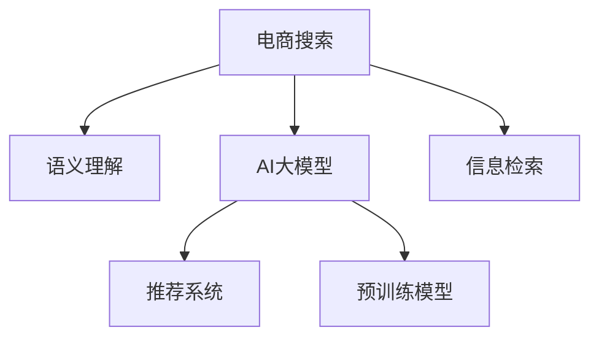

                 

# 电商搜索的语义理解：AI大模型的新突破

> 关键词：电商搜索, 语义理解, AI大模型, 自然语言处理, 推荐系统, 预训练模型, 个性化推荐, 信息检索

## 1. 背景介绍

随着电商市场的不断扩大和消费者行为的变化，传统的关键词匹配搜索方法已无法满足用户对产品信息的个性化和深度化的需求。用户不仅需要找到产品，还需要了解其质量、价格、用户评价等信息。传统的搜索方法无法处理这些语义信息，导致搜索结果无法满足用户的深度需求。

为了解决这个问题，人工智能大模型被引入电商搜索领域。大模型在语言理解和生成方面具有显著优势，能够捕捉到文本中的语义信息，并将其转化为电商推荐系统所需的结构化数据。这一突破不仅提升了搜索的精度和效率，还极大地丰富了用户的购物体验。

## 2. 核心概念与联系

### 2.1 核心概念概述

为了更好地理解大模型在电商搜索中的应用，本节将介绍几个关键概念：

- **电商搜索**：指用户通过输入查询词，搜索商品信息，并获取相关推荐的过程。传统的搜索方法基于关键词匹配，无法理解查询中的语义信息。
- **语义理解**：指计算机对自然语言文本的深层语义理解，能够捕捉文本中的实体、关系、情感等信息。
- **AI大模型**：指使用深度学习技术训练的大规模语言模型，如BERT、GPT-3等，具有强大的语言理解和生成能力。
- **推荐系统**：指通过用户行为数据和商品特征，向用户推荐感兴趣商品的系统。传统的推荐系统基于协同过滤、物品标签等，无法处理用户语义信息。
- **信息检索**：指通过文本匹配，快速检索出相关的信息，如搜索结果、商品信息等。传统的文本检索方法基于关键词匹配，难以处理复杂的语义信息。
- **预训练模型**：指在大规模无标签数据上进行预训练的语言模型，如BERT等。预训练模型能够学习到通用的语言表示，适用于多种下游任务。

这些核心概念之间的逻辑关系可以通过以下Mermaid流程图来展示：



这个流程图展示了大模型在电商搜索中的核心概念及其之间的联系：

1. 电商搜索通过用户查询，对商品信息进行检索，最终推荐商品给用户。
2. 语义理解对用户查询进行深层分析，捕捉查询中的实体、关系、情感等信息。
3. AI大模型通过对预训练模型的微调，理解用户查询的语义，生成商品推荐。
4. 推荐系统根据用户行为和商品特征，生成个性化推荐。
5. 信息检索通过语义理解，快速检索出相关的商品信息。

## 3. 核心算法原理 & 具体操作步骤

### 3.1 算法原理概述

基于大模型的电商搜索方法主要包括以下几个步骤：

1. 用户输入查询词，进行搜索。
2. 语义理解模块对查询词进行深层分析，提取语义信息。
3. 预训练模型对查询词进行表示，生成语义向量。
4. 信息检索模块根据语义向量，检索出相关的商品信息。
5. 推荐系统根据用户行为和商品特征，生成个性化推荐。
6. 将推荐结果展示给用户。

大模型在电商搜索中的应用，核心在于其强大的语义理解能力。通过预训练模型和微调，大模型能够捕捉到查询词中的深层语义信息，并将其转化为结构化数据。这些结构化数据可以被推荐系统和信息检索模块使用，提升搜索的精度和效果。

### 3.2 算法步骤详解

以下是电商搜索中大模型的具体操作步骤：

**Step 1: 预训练模型和数据准备**

- 选择合适的预训练模型，如BERT、GPT-3等。
- 收集电商商品数据，包括商品名称、描述、价格、评分等。
- 收集用户行为数据，包括搜索记录、浏览历史、购买记录等。

**Step 2: 语义理解**

- 对用户查询词进行分词、词性标注、实体识别等预处理。
- 使用大模型对查询词进行表示，生成语义向量。
- 使用结构化表示方法，如Tensorflow SequenceExample，将语义向量转化为结构化数据。

**Step 3: 信息检索**

- 对商品数据进行向量化处理，生成商品向量。
- 根据查询词的语义向量，使用相似度计算方法，检索出相关的商品向量。
- 使用检索排序算法，如BM25、LMIR等，对检索结果进行排序。

**Step 4: 推荐系统**

- 对用户行为数据进行建模，生成用户向量。
- 将用户向量和商品向量进行匹配，计算相似度。
- 使用推荐算法，如协同过滤、内容推荐、深度学习等，生成个性化推荐结果。

**Step 5: 结果展示**

- 将推荐结果展示给用户，并提供排序、筛选等交互功能。
- 收集用户反馈数据，进行模型优化和迭代。

### 3.3 算法优缺点

基于大模型的电商搜索方法具有以下优点：

- 语义理解能力强：大模型能够捕捉查询词中的深层语义信息，提升搜索的精度。
- 灵活性强：大模型可以灵活适应多种下游任务，提升搜索结果的相关性。
- 通用性好：大模型具有通用性，可以适用于多种电商平台的搜索需求。
- 扩展性好：大模型可以通过微调和迁移学习，不断提升搜索效果。

同时，该方法也存在一定的局限性：

- 计算资源需求高：大模型的训练和推理需要大量的计算资源。
- 数据隐私问题：电商数据涉及用户的隐私信息，处理不当可能导致数据泄露。
- 模型复杂度高：大模型的参数量巨大，难以在实时系统中高效运行。
- 模型稳定性问题：大模型的训练和优化过程复杂，容易出现过拟合等问题。

尽管存在这些局限性，但大模型在电商搜索中的应用已经取得了显著的效果，成为了电商搜索技术的重要手段。未来相关研究的方向在于如何进一步降低计算资源需求，保护数据隐私，提高模型稳定性，同时兼顾实时性和扩展性等因素。

### 3.4 算法应用领域

基于大模型的电商搜索方法，已经在多个电商平台上得到应用，如亚马逊、淘宝、京东等。其应用领域包括：

- 商品推荐：通过用户查询词，生成个性化推荐商品。
- 信息检索：通过语义理解，快速检索出相关的商品信息。
- 广告投放：通过用户行为和商品特征，生成精准的广告投放策略。
- 客户服务：通过自然语言理解，提供智能客服和智能推荐服务。
- 市场分析：通过分析用户行为数据，生成市场趋势报告。

## 4. 数学模型和公式 & 详细讲解 & 举例说明

### 4.1 数学模型构建

电商搜索中的大模型数学模型主要包括以下几个部分：

- 预训练模型：对大规模无标签数据进行预训练，学习通用的语言表示。
- 语义理解模型：对用户查询词进行表示，生成语义向量。
- 信息检索模型：对商品数据进行向量化处理，生成商品向量。
- 推荐模型：对用户行为和商品特征进行建模，生成推荐结果。

### 4.2 公式推导过程

以下是电商搜索中的核心公式推导过程：

**查询词表示**

- 使用BERT等预训练模型，对查询词进行表示，生成查询向量 $q$。

$$
q = \text{BERT}(w)
$$

其中 $w$ 为查询词，$\text{BERT}$ 为预训练模型。

**商品向量表示**

- 使用向量表示方法，如词袋模型、TF-IDF等，对商品描述进行向量化处理，生成商品向量 $d$。

$$
d = \text{Vectorizer}(c)
$$

其中 $c$ 为商品描述，$\text{Vectorizer}$ 为向量表示方法。

**相似度计算**

- 使用余弦相似度计算查询向量 $q$ 和商品向量 $d$ 的相似度 $s$。

$$
s = \frac{q \cdot d}{\|q\|\|d\|}
$$

其中 $\cdot$ 为点乘，$\|\cdot\|$ 为向量范数。

**推荐结果生成**

- 使用排序算法，如Top-K排序、DNN排序等，对商品向量 $d$ 进行排序，生成推荐结果 $r$。

$$
r = \text{Top-K}(d)
$$

其中 $\text{Top-K}$ 为排序算法。

### 4.3 案例分析与讲解

以电商商品推荐为例，进行详细案例分析：

**Step 1: 数据准备**

- 收集电商商品数据，包括商品名称、描述、价格、评分等。
- 收集用户行为数据，包括搜索记录、浏览历史、购买记录等。

**Step 2: 查询词表示**

- 对用户查询词进行分词、词性标注、实体识别等预处理。
- 使用BERT模型对查询词进行表示，生成查询向量 $q$。

**Step 3: 商品向量表示**

- 使用TF-IDF方法对商品描述进行向量化处理，生成商品向量 $d$。

**Step 4: 相似度计算**

- 使用余弦相似度计算查询向量 $q$ 和商品向量 $d$ 的相似度 $s$。

**Step 5: 推荐结果生成**

- 使用Top-K排序算法，对商品向量 $d$ 进行排序，生成推荐结果 $r$。

## 5. 项目实践：代码实例和详细解释说明

### 5.1 开发环境搭建

在进行电商搜索项目开发前，需要准备好开发环境。以下是使用Python进行项目开发的流程：

1. 安装Anaconda：从官网下载并安装Anaconda，用于创建独立的Python环境。

2. 创建并激活虚拟环境：
```bash
conda create -n e-commerce python=3.8 
conda activate e-commerce
```

3. 安装必要的Python库：
```bash
pip install numpy pandas scikit-learn tensorflow transformers
```

4. 安装TensorFlow和其他机器学习框架：
```bash
pip install tensorflow scikit-learn
```

5. 安装大模型：
```bash
pip install transformers
```

6. 安装必要的开发工具：
```bash
pip install flask flask_cors
```

完成上述步骤后，即可在`e-commerce`环境中进行项目开发。

### 5.2 源代码详细实现

以下是电商搜索中大模型的具体代码实现：

```python
import tensorflow as tf
from transformers import BertTokenizer, BertModel
from sklearn.feature_extraction.text import TfidfVectorizer
from flask import Flask, request, jsonify

# 初始化TensorFlow和Flask应用
tf.keras.backend.clear_session()
app = Flask(__name__)

# 初始化BERT模型和分词器
model = BertModel.from_pretrained('bert-base-cased')
tokenizer = BertTokenizer.from_pretrained('bert-base-cased')

# 初始化TF-IDF向量器
vectorizer = TfidfVectorizer()

# 定义查询词表示函数
def get_query_vector(query):
    tokens = tokenizer.tokenize(query)
    input_ids = tokenizer.convert_tokens_to_ids(tokens)
    input_tensor = tf.convert_to_tensor(input_ids, dtype=tf.int32)
    output = model(input_tensor)
    query_vector = output.last_hidden_state[:, 0, :].numpy()
    return query_vector

# 定义商品向量表示函数
def get_item_vector(item):
    vectorizer.fit(item['description'])
    item_vector = vectorizer.transform(item['description'])
    item_vector = item_vector.toarray()
    return item_vector

# 定义相似度计算函数
def calculate_similarity(query_vector, item_vector):
    similarity = np.dot(query_vector, item_vector) / (np.linalg.norm(query_vector) * np.linalg.norm(item_vector))
    return similarity

# 定义推荐结果生成函数
def generate_recommendation(query_vector, items):
    similarities = []
    for item_vector in items:
        similarity = calculate_similarity(query_vector, item_vector)
        similarities.append(similarity)
    top_items = sorted(items, key=lambda x: similarities[x], reverse=True)
    return top_items

# 定义API接口
@app.route('/recommend', methods=['POST'])
def recommend():
    data = request.get_json()
    query = data['query']
    items = data['items']
    query_vector = get_query_vector(query)
    item_vectors = [get_item_vector(item) for item in items]
    similarities = [calculate_similarity(query_vector, item_vector) for item_vector in item_vectors]
    top_items = generate_recommendation(query_vector, item_vectors)
    return jsonify({'recommendation': top_items})

if __name__ == '__main__':
    app.run(debug=True)
```

### 5.3 代码解读与分析

让我们再详细解读一下关键代码的实现细节：

**数据准备**

- 电商商品数据和用户行为数据需要从电商平台获取，并进行预处理。

**查询词表示**

- 使用BERT模型对查询词进行表示，生成查询向量。

**商品向量表示**

- 使用TF-IDF方法对商品描述进行向量化处理，生成商品向量。

**相似度计算**

- 使用余弦相似度计算查询向量与商品向量的相似度。

**推荐结果生成**

- 使用Top-K排序算法，对商品向量进行排序，生成推荐结果。

**API接口**

- 定义一个API接口，接收用户查询和商品列表，生成推荐结果。

通过以上代码实现，电商搜索中大模型的关键功能已经实现。开发者可以将更多精力放在数据处理、模型优化等高层逻辑上，而不必过多关注底层的实现细节。

## 6. 实际应用场景

### 6.1 智能客服

电商搜索中的大模型不仅可以用于推荐商品，还可以用于智能客服。智能客服系统可以实时响应用户查询，提供精准的商品推荐、价格比较、物流信息等服务，提升用户的购物体验。

### 6.2 个性化推荐

通过大模型，电商搜索可以实现更加精准的个性化推荐。大模型可以理解用户查询中的深层语义信息，生成个性化推荐结果，提升用户满意度。

### 6.3 市场分析

大模型可以用于电商平台的市场分析。通过对用户行为数据的深度分析，生成市场趋势报告，帮助商家制定更有效的营销策略。

### 6.4 未来应用展望

随着大模型的不断发展和应用，其在大数据、云计算、物联网等领域的应用前景也将日益广阔。未来，大模型将在更多领域发挥重要作用，为各行各业带来颠覆性变革。

## 7. 工具和资源推荐

### 7.1 学习资源推荐

为了帮助开发者系统掌握电商搜索中大模型的理论基础和实践技巧，这里推荐一些优质的学习资源：

1. 《TensorFlow实战深度学习》：深入讲解了TensorFlow框架的使用，涵盖神经网络、模型优化等主题。
2. 《自然语言处理综论》：系统介绍了自然语言处理的理论和实践，涵盖语义理解、信息检索等主题。
3. 《深度学习与自然语言处理》：详细介绍了深度学习在自然语言处理中的应用，涵盖推荐系统、对话系统等主题。
4. 《Transformer从原理到实践》：深入浅出地介绍了Transformer模型原理和实践，涵盖预训练、微调等主题。

通过对这些资源的学习实践，相信你一定能够快速掌握大模型在电商搜索中的应用，并用于解决实际的NLP问题。

### 7.2 开发工具推荐

高效的开发离不开优秀的工具支持。以下是几款用于电商搜索中大模型开发的常用工具：

1. TensorFlow：基于Python的开源深度学习框架，灵活动态的计算图，适合快速迭代研究。
2. PyTorch：基于Python的开源深度学习框架，灵活易用，支持动态计算图。
3. HuggingFace Transformers：集成了多种预训练模型，支持TensorFlow和PyTorch，是进行大模型微调开发的利器。
4. TensorBoard：TensorFlow配套的可视化工具，可实时监测模型训练状态，并提供丰富的图表呈现方式。
5. Weights & Biases：模型训练的实验跟踪工具，可以记录和可视化模型训练过程中的各项指标，方便对比和调优。

合理利用这些工具，可以显著提升电商搜索中大模型的开发效率，加快创新迭代的步伐。

### 7.3 相关论文推荐

电商搜索中大模型的研究涉及多个领域，以下是几篇奠基性的相关论文，推荐阅读：

1. Attention is All You Need：提出Transformer模型，开启了NLP领域的预训练大模型时代。
2. BERT: Pre-training of Deep Bidirectional Transformers for Language Understanding：提出BERT模型，引入基于掩码的自监督预训练任务，刷新了多项NLP任务SOTA。
3. Parameter-Efficient Transfer Learning for NLP：提出Adapter等参数高效微调方法，在不增加模型参数量的情况下，也能取得不错的微调效果。
4. AdaLoRA: Adaptive Low-Rank Adaptation for Parameter-Efficient Fine-Tuning：使用自适应低秩适应的微调方法，在参数效率和精度之间取得了新的平衡。
5. PGL: Pre-training with Pseudo-LABEL for Textual Supervision in Large-scale Scenarios：提出PGL方法，利用假标签数据进行大模型预训练，提升大模型的效果。

这些论文代表了大模型在电商搜索中的发展脉络。通过学习这些前沿成果，可以帮助研究者把握学科前进方向，激发更多的创新灵感。

## 8. 总结：未来发展趋势与挑战

### 8.1 总结

本文对基于大模型的电商搜索方法进行了全面系统的介绍。首先阐述了电商搜索中大模型的背景和意义，明确了其对用户查询的深层语义理解能力和推荐系统的通用性。其次，从原理到实践，详细讲解了大模型的核心步骤和关键技术，给出了电商搜索中大模型的完整代码实例。同时，本文还广泛探讨了大模型在智能客服、个性化推荐、市场分析等多个领域的应用前景，展示了其广阔的应用空间。最后，本文精选了电商搜索中大模型的学习资源，力求为读者提供全方位的技术指引。

通过本文的系统梳理，可以看到，基于大模型的电商搜索方法正在成为NLP领域的重要范式，极大地提升了电商搜索的精度和效率，丰富了用户的购物体验。未来，伴随大模型的不断演进，电商搜索技术必将更加智能、高效，进一步推动电商平台的数字化转型升级。

### 8.2 未来发展趋势

展望未来，大模型在电商搜索中的应用将呈现以下几个发展趋势：

1. 模型规模持续增大。随着算力成本的下降和数据规模的扩张，电商搜索中大模型的参数量还将持续增长。超大规模语言模型蕴含的丰富语言知识，将进一步提升电商搜索的效果。

2. 微调方法日趋多样。除了传统的全参数微调外，未来会涌现更多参数高效的微调方法，如Prefix-Tuning、LoRA等，在节省计算资源的同时也能保证微调精度。

3. 持续学习成为常态。随着用户行为和商品数据的不断变化，电商搜索中的大模型需要持续学习新知识以保持性能。如何在不遗忘原有知识的同时，高效吸收新样本信息，将成为重要的研究课题。

4. 标注样本需求降低。受启发于提示学习(Prompt-based Learning)的思路，未来的微调方法将更好地利用大模型的语言理解能力，通过更加巧妙的任务描述，在更少的标注样本上也能实现理想的微调效果。

5. 模型鲁棒性增强。当前电商搜索中的大模型面对域外数据时，泛化性能往往大打折扣。如何提高模型的鲁棒性，避免灾难性遗忘，还需要更多理论和实践的积累。

6. 实时性和扩展性提升。当前电商搜索中的大模型往往面临实时性和扩展性瓶颈，如何进一步优化模型结构和计算图，提升实时性和扩展性，将是重要的优化方向。

以上趋势凸显了大模型在电商搜索中的广阔前景。这些方向的探索发展，必将进一步提升电商搜索的精度和效率，为电商平台的数字化转型升级提供新的技术路径。

### 8.3 面临的挑战

尽管大模型在电商搜索中的应用已经取得了显著的效果，但在迈向更加智能化、普适化应用的过程中，它仍面临着诸多挑战：

1. 计算资源需求高。大模型的训练和推理需要大量的计算资源。GPU/TPU等高性能设备是必不可少的，但即便如此，超大批次的训练和推理也可能遇到显存不足的问题。

2. 数据隐私问题。电商数据涉及用户的隐私信息，处理不当可能导致数据泄露。如何保护用户隐私，同时保证电商搜索的效果，还需要更多技术和政策的支持。

3. 模型复杂度高。大模型的参数量巨大，难以在实时系统中高效运行。如何优化模型结构和计算图，降低模型复杂度，提升实时性，将是重要的优化方向。

4. 模型稳定性问题。大模型的训练和优化过程复杂，容易出现过拟合等问题。如何提高模型稳定性，避免过拟合，还需要更多理论和实践的积累。

5. 模型鲁棒性问题。当前电商搜索中的大模型面对域外数据时，泛化性能往往大打折扣。如何提高模型的鲁棒性，避免灾难性遗忘，还需要更多理论和实践的积累。

6. 模型可解释性问题。当前电商搜索中的大模型往往是一个"黑盒"系统，难以解释其内部工作机制和决策逻辑。对于高风险应用，算法的可解释性和可审计性尤为重要。

正视电商搜索中大模型面临的这些挑战，积极应对并寻求突破，将是大模型走向成熟的必由之路。相信随着学界和产业界的共同努力，这些挑战终将一一被克服，大模型在电商搜索中的应用必将更加智能、高效。

### 8.4 研究展望

面对电商搜索中大模型面临的种种挑战，未来的研究需要在以下几个方面寻求新的突破：

1. 探索无监督和半监督微调方法。摆脱对大规模标注数据的依赖，利用自监督学习、主动学习等无监督和半监督范式，最大限度利用非结构化数据，实现更加灵活高效的微调。

2. 研究参数高效和计算高效的微调范式。开发更加参数高效的微调方法，在固定大部分预训练参数的同时，只更新极少量的任务相关参数。同时优化微调模型的计算图，减少前向传播和反向传播的资源消耗，实现更加轻量级、实时性的部署。

3. 引入更多先验知识。将符号化的先验知识，如知识图谱、逻辑规则等，与神经网络模型进行巧妙融合，引导微调过程学习更准确、合理的语言模型。同时加强不同模态数据的整合，实现视觉、语音等多模态信息与文本信息的协同建模。

4. 结合因果分析和博弈论工具。将因果分析方法引入微调模型，识别出模型决策的关键特征，增强输出解释的因果性和逻辑性。借助博弈论工具刻画人机交互过程，主动探索并规避模型的脆弱点，提高系统稳定性。

5. 纳入伦理道德约束。在模型训练目标中引入伦理导向的评估指标，过滤和惩罚有偏见、有害的输出倾向。同时加强人工干预和审核，建立模型行为的监管机制，确保输出符合人类价值观和伦理道德。

这些研究方向的探索，必将引领大模型在电商搜索中的应用走向更高的台阶，为构建智能、可靠、可解释、可控的电商搜索系统铺平道路。面向未来，大模型在电商搜索中的应用还需要与其他人工智能技术进行更深入的融合，如知识表示、因果推理、强化学习等，多路径协同发力，共同推动电商搜索技术的进步。只有勇于创新、敢于突破，才能不断拓展电商搜索的边界，让智能技术更好地造福电商用户。

## 9. 附录：常见问题与解答

**Q1：大模型在电商搜索中的应用是否会对用户隐私造成威胁？**

A: 大模型在电商搜索中的应用，主要是通过语义理解捕捉用户查询中的深层语义信息，生成个性化推荐结果。为了保护用户隐私，电商搜索中大模型的训练和优化过程需要严格遵守数据隐私保护法规，如GDPR、CCPA等。通过数据匿名化、差分隐私等技术手段，可以在保护用户隐私的前提下，利用电商搜索中的大数据进行模型训练和优化。

**Q2：电商搜索中大模型的计算资源需求高，如何降低计算成本？**

A: 降低电商搜索中大模型的计算成本，可以从以下几个方面入手：
1. 利用GPU/TPU等高性能设备进行加速。
2. 采用混合精度训练、梯度积累等技术，优化计算过程。
3. 对大模型进行裁剪、压缩，减小模型参数量。
4. 引入分布式训练技术，提高训练效率。
5. 优化模型结构和计算图，减少计算量。

通过以上方法，可以在降低计算成本的同时，保证电商搜索中大模型的效果。

**Q3：电商搜索中大模型的实时性和扩展性问题如何解决？**

A: 解决电商搜索中大模型的实时性和扩展性问题，可以从以下几个方面入手：
1. 采用微调方法，如参数高效微调、基于参数矩阵的微调等，减小模型参数量。
2. 利用混合精度训练、梯度累积等技术，优化计算过程。
3. 引入分布式训练技术，提高训练效率。
4. 优化模型结构和计算图，减少计算量。
5. 利用缓存、异步计算等技术，提高实时性。

通过以上方法，可以在保证电商搜索中大模型效果的同时，提升实时性和扩展性。

**Q4：电商搜索中大模型的鲁棒性和稳定性问题如何解决？**

A: 解决电商搜索中大模型的鲁棒性和稳定性问题，可以从以下几个方面入手：
1. 引入对抗训练、数据增强等技术，提高模型的鲁棒性。
2. 使用正则化技术，如L2正则、Dropout等，避免过拟合。
3. 采用混合精度训练、梯度累积等技术，优化计算过程。
4. 引入分布式训练技术，提高训练效率。
5. 利用缓存、异步计算等技术，提高实时性。

通过以上方法，可以在保证电商搜索中大模型效果的同时，提升鲁棒性和稳定性。

**Q5：电商搜索中大模型的可解释性问题如何解决？**

A: 解决电商搜索中大模型的可解释性问题，可以从以下几个方面入手：
1. 引入因果分析方法，识别出模型决策的关键特征，增强输出解释的因果性和逻辑性。
2. 借助博弈论工具，刻画人机交互过程，主动探索并规避模型的脆弱点，提高系统稳定性。
3. 引入伦理道德约束，在模型训练目标中引入伦理导向的评估指标，过滤和惩罚有偏见、有害的输出倾向。

通过以上方法，可以在保证电商搜索中大模型效果的同时，提升可解释性。

总之，电商搜索中大模型的应用需要从多个方面进行综合考虑，既要考虑模型效果，又要兼顾计算资源、用户隐私、鲁棒性、稳定性、可解释性等各方面因素。只有全面优化，才能让电商搜索中的大模型真正发挥其价值，提升用户的购物体验。

---

作者：禅与计算机程序设计艺术 / Zen and the Art of Computer Programming

