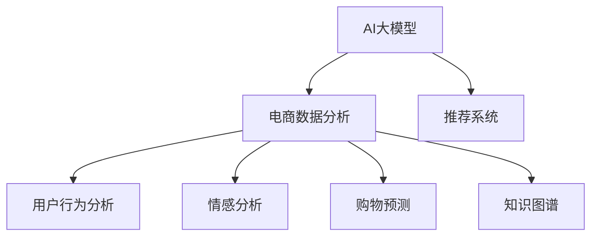

                 

# 电商数据分析：AI大模型的新维度

> 关键词：
电商数据分析, AI大模型, 推荐系统, 用户行为, 情感分析, 购物预测, 知识图谱

## 1. 背景介绍

### 1.1 问题由来
电商行业的蓬勃发展离不开大数据分析技术的支撑。通过挖掘用户行为数据、交易数据、商品评价数据等，电商企业能够更好地了解市场趋势，优化商品推荐，提升用户体验，从而提高销售转化率。然而，面对海量数据，传统的机器学习算法往往难以有效处理。

近年来，随着深度学习技术的成熟和算力的提升，AI大模型在电商数据分析中崭露头角。通过在大规模无标签数据上进行预训练，大模型能够自动学习到复杂的语义和模式，在处理电商数据时表现出强大的能力。本文将聚焦于AI大模型在电商数据分析中的新维度，探讨其核心算法原理、具体操作步骤，以及实际应用场景和未来趋势。

## 2. 核心概念与联系

### 2.1 核心概念概述

为更好地理解AI大模型在电商数据分析中的应用，本节将介绍几个密切相关的核心概念：

- AI大模型(Large AI Model)：以Transformer、BERT等为代表的深度神经网络模型，通过在大规模无标签数据上进行自监督学习，学习到通用的语义和模式表示。
- 电商数据分析(E-commerce Data Analytics)：指通过挖掘用户行为、商品信息、交易数据等，提取有价值的信息，以辅助决策、优化推荐、提高转化率等。
- 推荐系统(Recommender System)：根据用户的历史行为和偏好，智能推荐商品或服务的技术。
- 用户行为分析(User Behavior Analysis)：通过分析用户浏览、点击、购买等行为数据，挖掘用户兴趣和需求，从而改进推荐算法。
- 情感分析(Sentiment Analysis)：对用户评论、评分等文本数据进行情感倾向分析，评估用户对商品或服务的情感态度。
- 购物预测(Sales Prediction)：基于历史销售数据和预测模型，预测未来的销售趋势和需求变化。
- 知识图谱(Knowledge Graph)：利用图结构表示实体与实体之间的关系，提供语义查询和推理能力。

这些核心概念之间的逻辑关系可以通过以下Mermaid流程图来展示：



这个流程图展示了大模型的核心概念及其与电商数据分析的紧密联系：

1. 大模型通过预训练获得通用语义知识，用于电商数据分析。
2. 电商数据分析利用大模型的语义表示，进行推荐、行为分析、情感分析、预测等。
3. 知识图谱和大模型结合，提供更丰富的语义信息和结构化知识，增强电商数据分析的深度和广度。

## 3. 核心算法原理 & 具体操作步骤

### 3.1 算法原理概述

AI大模型在电商数据分析中的应用，主要依赖于其在语义理解和模式学习方面的强大能力。其核心思想是：将预训练的大模型应用于电商数据，利用其自动学习到的语义和模式知识，对用户行为、商品特征、交易记录等进行深入分析，辅助推荐、预测和决策。

具体而言，大模型在电商数据分析中的主要应用包括：
- 用户行为分析：通过分析用户的浏览、点击、购买等行为，了解用户兴趣和需求，提升推荐系统的效果。
- 情感分析：对用户评论、评分等文本数据进行情感分析，评估用户对商品或服务的情感态度，辅助产品优化和市场调整。
- 购物预测：基于历史销售数据和预测模型，预测未来的销售趋势和需求变化，帮助企业制定更好的库存和促销策略。

### 3.2 算法步骤详解

基于AI大模型的电商数据分析，通常包括以下几个关键步骤：

**Step 1: 准备数据集**
- 收集电商平台上的用户行为数据、商品信息数据、交易数据等，清洗并标注数据。
- 将数据划分为训练集、验证集和测试集，确保数据分布一致。

**Step 2: 加载预训练模型**
- 选择合适的预训练模型，如BERT、GPT等，将其加载到系统环境中。
- 对模型进行必要的配置，如设置模型的输入输出格式、优化器等。

**Step 3: 数据预处理**
- 对文本数据进行分词、截断、padding等预处理操作，确保模型输入符合要求。
- 对数值型数据进行归一化、标准化等处理，避免模型对数值的异常敏感。
- 对分类标签进行编码，将其转换为模型可接受的数值型输出。

**Step 4: 特征提取与模型训练**
- 利用大模型提取输入数据的语义表示，作为模型训练的特征。
- 选择合适的训练算法和损失函数，对模型进行有监督或无监督训练。
- 在训练过程中应用正则化技术，防止过拟合。

**Step 5: 模型评估与优化**
- 在测试集上评估模型性能，如准确率、召回率、F1-score等指标。
- 根据评估结果，调整模型参数和训练策略，进一步优化模型效果。

**Step 6: 部署与应用**
- 将优化后的模型部署到电商平台的后端服务中。
- 根据不同的应用场景，设计接口和算法，实现自动化推荐、预测和决策。

以上是基于AI大模型的电商数据分析的一般流程。在实际应用中，还需要根据具体任务的需求，对上述步骤进行优化和调整。

### 3.3 算法优缺点

基于AI大模型的电商数据分析方法具有以下优点：
1. 强大的语义理解能力：大模型能够自动学习复杂的语义模式，有效处理电商数据中的文本信息。
2. 多任务处理能力：同一模型可以应用于多个电商数据分析任务，如推荐、情感分析、购物预测等。
3. 高效的特征提取：大模型能够自动提取高维语义特征，减少手工特征工程的工作量。
4. 灵活的扩展性：通过微调或迁移学习，可以方便地将大模型应用于不同规模和类型的电商数据。

同时，该方法也存在一些局限性：
1. 数据依赖性强：大模型的性能很大程度上依赖于数据质量和标注样本的数量，标注成本较高。
2. 资源消耗大：大模型的训练和推理需要大量的计算资源，可能面临硬件瓶颈。
3. 解释性不足：大模型的决策过程通常缺乏可解释性，难以对其推理逻辑进行分析和调试。
4. 泛化能力有限：大模型面对新领域或新任务时，可能存在泛化能力不足的问题。
5. 对异常数据敏感：大模型对异常数据或噪声数据敏感，需要进行数据清洗和异常检测。

尽管存在这些局限性，但AI大模型在电商数据分析中的优势依然明显，值得广泛应用。

### 3.4 算法应用领域

AI大模型在电商数据分析中的应用，涉及多个领域，具体包括：

1. 推荐系统：利用大模型提取用户行为和商品特征的语义表示，构建推荐算法，提高推荐效果。

2. 用户画像分析：通过对用户行为数据的深度分析，生成详细的用户画像，了解用户兴趣和需求。

3. 商品评价分析：对用户评论、评分等文本数据进行情感分析，评估商品质量和用户体验。

4. 购物预测：基于历史销售数据和预测模型，预测未来的销售趋势和需求变化，优化库存管理和促销策略。

5. 搜索排序优化：利用大模型的语义理解能力，改进搜索算法和排序规则，提升用户检索体验。

6. 价格优化：通过对用户行为和市场数据的分析，制定更合理的定价策略，提高销售转化率。

## 4. 数学模型和公式 & 详细讲解  
### 4.1 数学模型构建

本节将使用数学语言对基于AI大模型的电商数据分析过程进行更加严格的刻画。

记电商数据集为 $\mathcal{D}=\{(x_i,y_i)\}_{i=1}^N$，其中 $x_i$ 为电商数据（如用户行为、商品信息等），$y_i$ 为对应的标签（如评分、购买行为等）。假设大模型为 $M_{\theta}$，其中 $\theta$ 为模型参数。

定义模型 $M_{\theta}$ 在输入 $x_i$ 上的预测为 $\hat{y}_i=M_{\theta}(x_i)$。则电商数据分析的目标是找到一个最优的模型参数 $\theta^*$，使得模型预测输出与真实标签之间的差异最小化：

$$
\theta^* = \mathop{\arg\min}_{\theta} \mathcal{L}(\theta)
$$

其中 $\mathcal{L}$ 为损失函数，用于衡量模型预测输出与真实标签之间的差异。常见的损失函数包括交叉熵损失、均方误差损失等。

### 4.2 公式推导过程

以推荐系统为例，假设电商数据集 $\mathcal{D}$ 中的样本 $(x_i,y_i)$ 表示用户 $i$ 的历史行为数据 $x_i$ 和其对商品 $j$ 的评分 $y_i$。我们的目标是学习一个推荐模型 $M_{\theta}$，使得对于新的用户行为 $x'$，能够预测其对商品 $j$ 的评分 $y'$。

设推荐模型的输入为 $x'$，输出为 $y'$，则损失函数 $\mathcal{L}$ 可以定义为交叉熵损失：

$$
\mathcal{L}(\theta) = -\frac{1}{N}\sum_{i=1}^N [y_i \log \hat{y}_i + (1-y_i) \log (1-\hat{y}_i)]
$$

其中 $\hat{y}_i=M_{\theta}(x_i)$ 为模型对样本 $i$ 的预测评分。

在训练过程中，模型参数 $\theta$ 更新策略为：

$$
\theta \leftarrow \theta - \eta \nabla_{\theta}\mathcal{L}(\theta)
$$

其中 $\eta$ 为学习率，$\nabla_{\theta}\mathcal{L}(\theta)$ 为损失函数对模型参数的梯度。

### 4.3 案例分析与讲解

假设我们使用BERT模型进行电商数据分析。对于用户行为数据，可以通过分词和向量编码将其输入BERT模型中，获得高维语义表示。然后，将用户行为表示与商品特征表示拼接，输入到全连接层中，得到最终的推荐评分。

训练时，我们可以将用户行为数据和商品评分数据划分为训练集和验证集，使用交叉熵损失进行有监督训练。在训练过程中，我们可以应用L2正则化、Dropout等正则化技术，防止过拟合。

## 5. 项目实践：代码实例和详细解释说明
### 5.1 开发环境搭建

在进行电商数据分析的大模型实践前，我们需要准备好开发环境。以下是使用Python进行TensorFlow开发的环境配置流程：

1. 安装Anaconda：从官网下载并安装Anaconda，用于创建独立的Python环境。

2. 创建并激活虚拟环境：
```bash
conda create -n tf-env python=3.8 
conda activate tf-env
```

3. 安装TensorFlow：根据CUDA版本，从官网获取对应的安装命令。例如：
```bash
conda install tensorflow -c tf
```

4. 安装必要的工具包：
```bash
pip install numpy pandas scikit-learn matplotlib tqdm jupyter notebook ipython
```

5. 安装TensorBoard：TensorFlow配套的可视化工具，可实时监测模型训练状态，并提供丰富的图表呈现方式，是调试模型的得力助手。

```bash
pip install tensorboard
```

完成上述步骤后，即可在`tf-env`环境中开始大模型实践。

### 5.2 源代码详细实现

下面我们以推荐系统为例，给出使用TensorFlow对BERT模型进行电商数据分析的PyTorch代码实现。

首先，定义推荐系统的数据处理函数：

```python
import tensorflow as tf
from transformers import BertTokenizer, TFBertForSequenceClassification
import numpy as np
import pandas as pd

def process_data(data_path):
    # 读取用户行为数据和商品评分数据
    train_data = pd.read_csv(data_path, sep=',', header=None)
    test_data = pd.read_csv(test_data_path, sep=',', header=None)
    
    # 数据预处理
    tokenizer = BertTokenizer.from_pretrained('bert-base-uncased')
    train_x = tokenizer(train_data['user_behavior'], padding=True, truncation=True, max_length=256)
    train_y = train_data['rating']
    
    # 对训练数据进行编码
    train_input_ids, train_attention_masks, train_labels = train_x['input_ids'], train_x['attention_mask'], train_y
    
    # 对测试数据进行编码
    test_x = tokenizer(test_data['user_behavior'], padding=True, truncation=True, max_length=256)
    test_input_ids, test_attention_masks = test_x['input_ids'], test_x['attention_mask']
    
    # 将数据转换为TensorFlow张量
    train_input_ids = tf.convert_to_tensor(train_input_ids)
    train_attention_masks = tf.convert_to_tensor(train_attention_masks)
    train_labels = tf.convert_to_tensor(train_labels)
    test_input_ids = tf.convert_to_tensor(test_input_ids)
    test_attention_masks = tf.convert_to_tensor(test_attention_masks)
    
    return train_input_ids, train_attention_masks, train_labels, test_input_ids, test_attention_masks

# 设置超参数
max_seq_length = 256
learning_rate = 2e-5
num_train_epochs = 3
batch_size = 32

# 定义模型
model = TFBertForSequenceClassification.from_pretrained('bert-base-uncased', num_labels=5)

# 定义优化器
optimizer = tf.keras.optimizers.AdamW(learning_rate=learning_rate)

# 定义评估指标
loss = tf.keras.losses.SparseCategoricalCrossentropy(from_logits=True)
metrics = [tf.keras.metrics.SparseCategoricalAccuracy('accuracy')]

# 定义模型编译配置
model.compile(optimizer=optimizer, loss=loss, metrics=metrics)

# 定义数据生成器
train_dataset = tf.data.Dataset.from_tensor_slices((train_input_ids, train_attention_masks, train_labels)).shuffle(1000).batch(batch_size)
validation_dataset = tf.data.Dataset.from_tensor_slices((test_input_ids, test_attention_masks, train_labels)).batch(batch_size)
```

然后，定义训练和评估函数：

```python
import tensorflow as tf

def train_step(model, batch):
    input_ids, attention_masks, labels = batch
    with tf.GradientTape() as tape:
        outputs = model(input_ids, attention_masks=attention_masks, training=True)
        loss = loss(labels, outputs)
    gradients = tape.gradient(loss, model.trainable_variables)
    optimizer.apply_gradients(zip(gradients, model.trainable_variables))
    return loss

def evaluate(model, dataset):
    loss, accuracy = tf.keras.metrics.Mean(), tf.keras.metrics.Mean()
    for batch in dataset:
        input_ids, attention_masks, labels = batch
        outputs = model(input_ids, attention_masks=attention_masks)
        loss_value = loss(labels, outputs)
        accuracy_value = accuracy(labels, outputs)
        loss.update_state(loss_value)
        accuracy.update_state(accuracy_value)
    return loss.result(), accuracy.result()

# 训练过程
train_loss = []
val_loss = []
val_accuracy = []

for epoch in range(num_train_epochs):
    for batch in train_dataset:
        loss_value = train_step(model, batch)
        train_loss.append(loss_value)
    
    # 在验证集上评估
    val_loss_value, val_accuracy_value = evaluate(model, validation_dataset)
    val_loss.append(val_loss_value)
    val_accuracy.append(val_accuracy_value)
    
    print(f"Epoch {epoch+1}, train loss: {np.mean(train_loss):.4f}, val loss: {np.mean(val_loss):.4f}, val accuracy: {np.mean(val_accuracy):.4f}")
```

最后，启动训练流程并在测试集上评估：

```python
import numpy as np

test_dataset = tf.data.Dataset.from_tensor_slices((test_input_ids, test_attention_masks, train_labels)).batch(batch_size)

# 测试过程
test_loss, test_accuracy = evaluate(model, test_dataset)

print(f"Test loss: {np.mean(test_loss):.4f}, Test accuracy: {np.mean(test_accuracy):.4f}")
```

以上就是使用TensorFlow对BERT进行电商数据分析的完整代码实现。可以看到，得益于TensorFlow的强大封装，我们可以用相对简洁的代码完成BERT模型的加载和训练。

### 5.3 代码解读与分析

让我们再详细解读一下关键代码的实现细节：

**process_data函数**：
- 读取电商数据集，并进行数据预处理。
- 使用BERT tokenizer对用户行为数据进行编码，转换为模型可接受的输入。
- 对编码后的数据进行padding，确保输入序列长度一致。
- 将数据转换为TensorFlow张量，并返回输入特征和标签。

**模型定义和编译**：
- 使用TensorFlow加载预训练的BERT模型，并进行必要的配置。
- 定义优化器和评估指标，编译模型配置。
- 定义数据生成器，对数据进行批处理和shuffle操作。

**训练过程**：
- 定义训练函数train_step，使用GradientTape记录梯度并更新模型参数。
- 在每个epoch内，对训练集数据进行迭代训练，记录训练损失。
- 在验证集上评估模型性能，记录验证损失和准确率。
- 输出每个epoch的平均损失和准确率。

**测试过程**：
- 使用evaluate函数在测试集上评估模型性能，记录测试损失和准确率。
- 输出测试结果。

可以看到，TensorFlow配合BERT模型使得电商数据分析的代码实现变得简洁高效。开发者可以将更多精力放在数据处理、模型改进等高层逻辑上，而不必过多关注底层的实现细节。

当然，工业级的系统实现还需考虑更多因素，如模型的保存和部署、超参数的自动搜索、更灵活的任务适配层等。但核心的电商数据分析流程基本与此类似。

## 6. 实际应用场景
### 6.1 智能客服系统

电商平台的智能客服系统是电商数据分析的重要应用场景之一。传统的客服系统依赖人工服务，高峰期响应慢、服务质量不稳定。而基于大模型的智能客服系统能够7x24小时不间断服务，快速响应客户咨询，提高客户满意度。

在技术实现上，可以收集客户的历史咨询记录，将问题-回答对作为监督数据，在此基础上对预训练模型进行微调。微调后的模型能够自动理解客户意图，匹配最合适的回答模板进行回复。对于客户提出的新问题，还可以接入检索系统实时搜索相关内容，动态组织生成回答。

### 6.2 库存管理系统

库存管理系统需要实时监测商品库存和销售趋势，以便及时调整库存量，避免缺货或积压。传统的库存管理系统依赖经验预测和人工调度，效率低且不够精确。而利用大模型进行电商数据分析，可以更准确地预测商品销售趋势，优化库存管理。

具体而言，可以通过收集历史销售数据和用户行为数据，训练大模型进行销量预测。根据预测结果，自动调整库存水平，优化物流配送，提升供应链效率。

### 6.3 个性化推荐系统

电商平台的个性化推荐系统是电商数据分析的核心应用之一。通过分析用户行为数据，了解用户兴趣和需求，能够提高推荐效果，提升用户粘性和转化率。

在推荐系统设计中，可以利用大模型提取用户行为和商品特征的语义表示，构建推荐算法，提高推荐效果。通过深度学习技术，可以挖掘用户潜在需求，动态调整推荐策略，提供个性化推荐服务。

### 6.4 未来应用展望

随着大模型和电商数据分析技术的不断发展，未来在电商领域的应用将更加广泛和深入：

1. 实时数据分析：利用大模型进行实时数据分析，及时了解市场动态和用户需求，优化库存管理和推荐策略。

2. 跨领域融合：将大模型与物联网、区块链、人工智能等技术结合，构建更加智能化的电商生态系统。

3. 深度定制服务：利用大模型进行深度定制化服务，满足不同客户的多样化需求，提高客户体验。

4. 自动化运营：通过自动化运营平台，实现电商数据分析、推荐、预测、决策等全流程自动化，提高运营效率。

5. 全球化拓展：利用大模型进行全球化电商数据分析，了解不同市场的消费习惯和需求，拓展全球市场。

6. 新兴技术融合：与AR/VR、语音交互、图像识别等新兴技术融合，提升用户交互体验，开拓新的应用场景。

以上趋势凸显了大模型在电商数据分析中的巨大潜力。这些方向的探索发展，必将进一步提升电商系统的性能和应用范围，为电商企业带来新的增长点。

## 7. 工具和资源推荐
### 7.1 学习资源推荐

为了帮助开发者系统掌握大模型在电商数据分析中的应用，这里推荐一些优质的学习资源：

1. 《深度学习与电商数据分析》书籍：介绍深度学习在电商数据分析中的应用，涵盖推荐系统、情感分析、购物预测等方向。

2. 《TensorFlow实战电商数据分析》课程：由Google TensorFlow团队开设的电商数据分析实战课程，涵盖TensorFlow在电商数据分析中的应用，提供详细的项目实践和案例分析。

3. 《大规模深度学习在电商领域的应用》论文：总结了大规模深度学习在电商数据分析中的前沿应用，提供了大量的工程实践经验。

4. 《电商平台数据分析》讲座：由知名电商数据分析专家主讲，涵盖电商数据分析的基础知识和最新应用。

通过对这些资源的学习实践，相信你一定能够快速掌握大模型在电商数据分析中的应用，并用于解决实际的电商问题。

### 7.2 开发工具推荐

高效的开发离不开优秀的工具支持。以下是几款用于电商数据分析的常用工具：

1. TensorFlow：由Google主导开发的开源深度学习框架，生产部署方便，适合大规模工程应用。

2. PyTorch：基于Python的开源深度学习框架，灵活动态的计算图，适合快速迭代研究。

3. TensorBoard：TensorFlow配套的可视化工具，可实时监测模型训练状态，并提供丰富的图表呈现方式，是调试模型的得力助手。

4. Jupyter Notebook：开源的交互式编程环境，支持Python、R等多种编程语言，提供详细的代码解释和注释功能。

5. H2O.ai：商业化的机器学习平台，支持多种深度学习框架，提供一站式的数据分析和建模工具。

合理利用这些工具，可以显著提升电商数据分析的开发效率，加快创新迭代的步伐。

### 7.3 相关论文推荐

大模型在电商数据分析中的应用源于学界的持续研究。以下是几篇奠基性的相关论文，推荐阅读：

1. Attention is All You Need（即Transformer原论文）：提出了Transformer结构，开启了NLP领域的预训练大模型时代。

2. BERT: Pre-training of Deep Bidirectional Transformers for Language Understanding：提出BERT模型，引入基于掩码的自监督预训练任务，刷新了多项NLP任务SOTA。

3. AI for Digital Commerce（电商AI应用）：总结了电商领域中AI技术的应用，包括推荐系统、用户画像分析、库存管理等方向。

4. Recommendation Systems for Online Retail：综述了推荐系统在电商领域的研究进展，涵盖协同过滤、基于内容推荐、深度学习推荐等方向。

5. Large Scale Deep Learning for Recommendation Systems：总结了大规模深度学习在推荐系统中的应用，提供了大量的工程实践经验。

这些论文代表了大模型在电商数据分析领域的发展脉络。通过学习这些前沿成果，可以帮助研究者把握学科前进方向，激发更多的创新灵感。

## 8. 总结：未来发展趋势与挑战

### 8.1 总结

本文对基于AI大模型的电商数据分析方法进行了全面系统的介绍。首先阐述了大模型和电商数据分析的研究背景和意义，明确了电商数据分析在大模型应用中的重要地位。其次，从原理到实践，详细讲解了大模型在电商数据分析中的核心算法和具体操作步骤，给出了电商数据分析的完整代码实例。同时，本文还广泛探讨了大模型在智能客服、库存管理、个性化推荐等电商领域的实际应用场景，展示了其巨大的应用潜力。

通过本文的系统梳理，可以看到，基于AI大模型的电商数据分析方法正在成为电商领域的重要范式，极大地提升了电商系统的智能化水平，为电商企业带来了新的增长点。未来，伴随大模型和电商数据分析技术的不断发展，大模型在电商领域的应用将更加广泛和深入。

### 8.2 未来发展趋势

展望未来，大模型在电商数据分析中的应用将呈现以下几个发展趋势：

1. 模型规模持续增大。随着算力成本的下降和数据规模的扩张，大模型的参数量还将持续增长。超大规模语言模型蕴含的丰富语义知识，有望支撑更加复杂多变的电商数据分析任务。

2. 深度融合多模态数据。电商数据分析不仅需要处理文本数据，还需要处理图像、视频、语音等多模态数据。大模型的多模态处理能力将得到更大发挥，能够更全面地理解电商数据。

3. 增强实时分析和预测能力。利用大模型进行实时数据分析，及时了解市场动态和用户需求，优化库存管理和推荐策略。实时预测技术的发展，将使电商系统更加灵活和智能。

4. 推动智能化运营平台发展。利用大模型进行全流程自动化分析、推荐、预测、决策等，构建智能化的电商运营平台，提高运营效率和用户体验。

5. 拓展全球化电商市场。利用大模型进行全球化电商数据分析，了解不同市场的消费习惯和需求，拓展全球市场。

以上趋势凸显了大模型在电商数据分析中的巨大潜力。这些方向的探索发展，必将进一步提升电商系统的性能和应用范围，为电商企业带来新的增长点。

### 8.3 面临的挑战

尽管大模型在电商数据分析中的优势明显，但在迈向更加智能化、普适化应用的过程中，它仍面临诸多挑战：

1. 数据依赖性强。大模型的性能很大程度上依赖于数据质量和标注样本的数量，标注成本较高。如何进一步降低微调对标注样本的依赖，将是一大难题。

2. 模型鲁棒性不足。大模型面对新领域或新任务时，可能存在泛化能力不足的问题。如何在不同领域和任务中保持模型的稳定性和鲁棒性，还需要更多理论和实践的积累。

3. 计算资源消耗大。大模型的训练和推理需要大量的计算资源，可能面临硬件瓶颈。如何优化模型结构和计算图，提高资源利用率，是未来的研究方向。

4. 可解释性不足。大模型的决策过程通常缺乏可解释性，难以对其推理逻辑进行分析和调试。对于电商企业，算法的可解释性和可审计性尤为重要。

5. 安全性有待保障。大模型在处理电商数据时，可能学习到有偏见、有害的信息，如何从数据和算法层面消除模型偏见，避免恶意用途，确保输出的安全性，也将是重要的研究课题。

6. 跨领域迁移能力有限。大模型在不同领域和任务中的迁移能力有限，如何提高模型的通用性和跨领域迁移能力，还需要进一步探索。

正视大模型在电商数据分析中的这些挑战，积极应对并寻求突破，将是大模型在电商数据分析中实现真正落地应用的必由之路。相信随着学界和产业界的共同努力，这些挑战终将一一被克服，大模型在电商数据分析中的应用将更加广泛和深入。

### 8.4 研究展望

面对大模型在电商数据分析中的挑战，未来的研究需要在以下几个方面寻求新的突破：

1. 探索无监督和半监督电商数据分析方法。摆脱对大规模标注数据的依赖，利用自监督学习、主动学习等无监督和半监督范式，最大限度利用非结构化数据，实现更加灵活高效的电商数据分析。

2. 研究参数高效和计算高效的电商数据分析方法。开发更加参数高效的电商数据分析方法，在固定大部分预训练参数的同时，只更新极少量的任务相关参数。同时优化电商数据分析的计算图，减少前向传播和反向传播的资源消耗，实现更加轻量级、实时性的部署。

3. 融合因果分析和博弈论工具。将因果分析方法引入电商数据分析模型，识别出模型决策的关键特征，增强输出解释的因果性和逻辑性。借助博弈论工具刻画人机交互过程，主动探索并规避模型的脆弱点，提高系统稳定性。

4. 结合多模态数据增强分析能力。利用大模型处理多模态数据，增强电商数据分析的深度和广度，提供更加全面的电商洞察。

5. 纳入伦理道德约束。在电商数据分析目标中引入伦理导向的评估指标，过滤和惩罚有偏见、有害的输出倾向。加强人工干预和审核，建立模型行为的监管机制，确保输出符合人类价值观和伦理道德。

这些研究方向的探索，必将引领大模型在电商数据分析技术迈向更高的台阶，为电商企业带来新的增长点。面向未来，大模型在电商数据分析技术还需要与其他人工智能技术进行更深入的融合，如知识表示、因果推理、强化学习等，多路径协同发力，共同推动电商数据分析技术的进步。

## 9. 附录：常见问题与解答

**Q1：电商数据分析中的大模型是否只适用于大规模企业？**

A: 大模型在电商数据分析中的应用，不仅适用于大规模企业，也可以应用于中小型企业。虽然大规模企业能够提供更多的数据和计算资源，但通过合理的数据预处理和模型优化，中小型企业也可以利用大模型提升电商数据分析的效果。

**Q2：电商数据分析中的大模型是否会泄露用户隐私？**

A: 大模型在电商数据分析中的应用，需要遵守相关的隐私保护法规和政策，如GDPR、CCPA等。可以通过数据脱敏、隐私保护技术等方式，确保用户数据的安全和隐私。同时，大模型本身不会泄露用户隐私，只有利用其进行数据分析后，才能获取用户行为和需求的信息。

**Q3：电商数据分析中的大模型是否需要从头训练？**

A: 大模型在电商数据分析中的应用，通常不需要从头训练。通过在预训练的基础上进行微调，利用大模型的通用语义知识，可以在较小的数据集上快速适应新的电商数据分析任务。

**Q4：电商数据分析中的大模型是否需要频繁更新？**

A: 大模型在电商数据分析中的应用，需要根据数据分布和用户需求的变化，定期进行微调和更新。可以通过定期更新大模型，提升其在新场景和新任务中的适应能力。

**Q5：电商数据分析中的大模型是否存在过拟合问题？**

A: 大模型在电商数据分析中的应用，可能存在过拟合问题，尤其是在标注数据不足的情况下。可以通过数据增强、正则化、对抗训练等方法，缓解过拟合问题，提高模型的泛化能力。

通过本文的系统梳理，可以看到，基于AI大模型的电商数据分析方法正在成为电商领域的重要范式，极大地提升了电商系统的智能化水平，为电商企业带来了新的增长点。未来，伴随大模型和电商数据分析技术的不断发展，大模型在电商领域的应用将更加广泛和深入。相信随着学界和产业界的共同努力，大模型在电商数据分析中的应用将更加广泛和深入。

