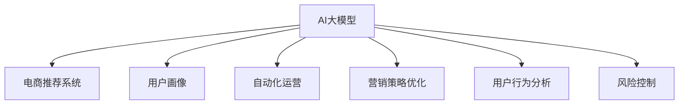

                 

# 电商行业中AI大模型的落地应用案例分析

> 关键词：电商行业,AI大模型,落地应用,深度学习,推荐系统,营销策略,自动化运营,用户行为分析

## 1. 背景介绍

### 1.1 问题由来
随着电子商务的迅猛发展，各大电商企业在保持高速增长的同时，也面临着诸多运营挑战。传统的电商模式以人为主导，依靠人工分析海量数据，难以在激烈的市场竞争中脱颖而出。而AI大模型的落地应用，为电商行业带来了全新的变革，通过高效智能的数据分析和运营决策，大幅提升了企业运营效率和盈利能力。

### 1.2 问题核心关键点
AI大模型在电商行业的落地应用主要体现在以下几个方面：

1. **推荐系统**：基于用户行为数据，利用深度学习算法推荐商品，提高转化率和销售额。
2. **营销策略优化**：通过用户画像和市场数据分析，制定个性化营销方案，提升广告点击率和转化率。
3. **自动化运营**：使用AI自动化工具进行库存管理、订单处理、客户服务等，降低运营成本，提高服务效率。
4. **用户行为分析**：通过用户点击、浏览、购买等数据，分析用户行为和偏好，制定精准的用户运营策略。
5. **风险控制**：运用AI模型进行欺诈检测、风险预警，保障交易安全。

这些关键应用点，有效解决了电商企业在大规模数据处理、用户运营和自动化管理等方面的痛点，推动了电商行业的数字化转型。

### 1.3 问题研究意义
研究AI大模型在电商行业的落地应用，对于推动电商企业智能化转型，提高市场竞争力和用户体验，具有重要意义：

1. **降低运营成本**：AI自动化工具可替代大量人工操作，大幅降低人力和时间成本。
2. **提升用户体验**：基于AI推荐的商品和服务，满足用户个性化需求，提升购物体验。
3. **优化营销效果**：精准的用户画像和行为分析，使营销策略更加精准有效，提升广告投资回报率。
4. **增强决策能力**：利用AI模型分析海量数据，辅助企业做出更科学的决策，提升市场响应速度。
5. **应对市场挑战**：在价格战、流量红利消失等市场挑战中，AI技术提供数据驱动的解决方案，帮助企业稳定增长。

## 2. 核心概念与联系

### 2.1 核心概念概述

为更好地理解AI大模型在电商行业的应用，本节将介绍几个密切相关的核心概念：

- **AI大模型(AI Large Models)**：指使用深度学习算法，在大型数据集上进行训练，获得广泛领域知识的大型神经网络模型，如BERT、GPT等。
- **电商推荐系统(E-commerce Recommendation System)**：通过分析用户历史行为和偏好，推荐相关商品的系统，是电商营销的重要手段。
- **用户画像(User Profiling)**：基于用户历史数据，构建用户行为、兴趣、偏好等特征描述，用于个性化营销和推荐。
- **自动化运营(Automated Operations)**：利用AI技术进行库存管理、订单处理、客服应答等自动化流程，提升运营效率。
- **深度学习(Deep Learning)**：使用多层神经网络，从大量数据中提取高层次特征，解决复杂的非线性问题。
- **营销策略优化(Optimization of Marketing Strategies)**：通过数据分析和机器学习，制定更有效的营销策略，提升广告效果。
- **用户行为分析(User Behavior Analysis)**：分析用户点击、浏览、购买等行为数据，揭示用户偏好和需求。
- **风险控制(Risk Control)**：使用AI模型检测和预警欺诈行为，保障交易安全。

这些核心概念之间的逻辑关系可以通过以下Mermaid流程图来展示：



这个流程图展示了AI大模型在电商行业中的应用路径：

1. AI大模型通过预训练获得广泛领域知识。
2. 电商推荐系统利用AI模型，为用户推荐个性化商品。
3. 用户画像通过AI模型，描绘用户行为和兴趣特征。
4. 自动化运营通过AI技术，提升运营效率。
5. 营销策略优化通过AI模型，制定精准营销方案。
6. 用户行为分析通过AI模型，揭示用户需求和偏好。
7. 风险控制通过AI模型，识别和预警交易风险。

这些概念共同构成了电商行业应用AI大模型的基础框架，为其智能运营和决策提供了强有力的技术支持。

## 3. 核心算法原理 & 具体操作步骤

### 3.1 算法原理概述

AI大模型在电商行业的应用，主要依托于深度学习算法，特别是推荐系统和用户行为分析方面。深度学习通过多层神经网络，从大规模数据中提取高层次特征，用于预测和推荐任务。

### 3.2 算法步骤详解

#### 电商推荐系统的算法步骤

1. **数据收集**：收集用户历史点击、浏览、购买数据，商品属性和标签数据，构建推荐训练集。
2. **特征工程**：对用户行为数据和商品属性数据进行预处理，提取高维稀疏特征，作为输入向量。
3. **模型训练**：选择合适深度学习模型（如矩阵分解、协同过滤、神经网络等），使用推荐训练集进行训练。
4. **模型评估**：在验证集上评估推荐模型性能，选择合适的超参数。
5. **部署上线**：将训练好的推荐模型部署到线上，实时为每个用户推荐商品。

#### 用户行为分析的算法步骤

1. **数据收集**：收集用户点击、浏览、购买等行为数据，构建行为分析训练集。
2. **特征工程**：对行为数据进行预处理，提取高维特征，如点击序列、浏览时长、购物车清空等。
3. **模型训练**：选择合适深度学习模型（如RNN、LSTM、Transformer等），使用行为分析训练集进行训练。
4. **模型评估**：在验证集上评估模型性能，选择合适的超参数。
5. **应用预测**：利用训练好的模型，预测用户未来行为，辅助营销和运营决策。

### 3.3 算法优缺点

#### 电商推荐系统的优缺点

**优点**：

- **个性化推荐**：基于用户历史行为数据，推荐个性化商品，提升转化率和满意度。
- **实时推荐**：使用在线学习算法，可以实时更新推荐模型，适应用户行为变化。
- **多模态数据融合**：融合用户行为、商品属性、社交网络等多维数据，提供更加全面的推荐。

**缺点**：

- **数据冷启动**：新用户缺少历史数据，难以进行个性化推荐。
- **隐式反馈**：用户行为数据多为隐式反馈，难以捕捉用户真实偏好。
- **数据偏差**：用户行为数据可能存在偏差，影响推荐模型公平性。

#### 用户行为分析的优缺点

**优点**：

- **行为预测**：通过用户历史行为数据，预测用户未来行为，提供精准的营销策略。
- **自动化运营**：利用用户行为分析，自动化优化库存管理、订单处理、客户服务等流程。
- **提升决策能力**：基于用户行为数据，辅助企业做出更科学的运营决策。

**缺点**：

- **隐私保护**：用户行为数据涉及隐私问题，如何保护用户隐私是重要挑战。
- **数据量要求高**：需要大量的用户行为数据，数据采集和存储成本高。
- **模型复杂度高**：用户行为数据多为非结构化数据，处理复杂度高。

### 3.4 算法应用领域

AI大模型在电商行业的应用领域非常广泛，包括但不限于以下几个方面：

1. **推荐系统**：基于用户行为数据，推荐个性化商品，提高转化率和销售额。
2. **营销策略优化**：通过用户画像和市场数据分析，制定个性化营销方案，提升广告点击率和转化率。
3. **自动化运营**：使用AI自动化工具进行库存管理、订单处理、客户服务等，降低运营成本，提高服务效率。
4. **用户行为分析**：通过用户点击、浏览、购买等数据，分析用户行为和偏好，制定精准的用户运营策略。
5. **风险控制**：运用AI模型进行欺诈检测、风险预警，保障交易安全。

这些应用点展示了AI大模型在电商行业的巨大潜力，可以显著提升企业的运营效率和盈利能力。

## 4. 数学模型和公式 & 详细讲解 & 举例说明

### 4.1 数学模型构建

#### 电商推荐系统的数学模型构建

**输入向量**：$X$，包含用户ID、商品ID、行为类型等特征。

**输出向量**：$Y$，表示用户对商品的评分或点击率。

**目标函数**：

$$
\min_{\theta} \frac{1}{N}\sum_{i=1}^N (Y_i - f(X_i; \theta))^2
$$

其中 $f(X_i; \theta)$ 为推荐模型的预测值。

#### 用户行为分析的数学模型构建

**输入向量**：$X$，包含用户ID、时间戳、行为类型等特征。

**输出向量**：$Y$，表示用户后续行为，如点击、购买等。

**目标函数**：

$$
\min_{\theta} \frac{1}{N}\sum_{i=1}^N \mathbb{I}(Y_i=1) \log f(X_i; \theta) + \mathbb{I}(Y_i=0) \log (1-f(X_i; \theta))
$$

其中 $f(X_i; \theta)$ 为行为预测模型。

### 4.2 公式推导过程

#### 电商推荐系统的公式推导

假设推荐模型为：

$$
f(X_i; \theta) = W^T \phi(X_i)
$$

其中 $W$ 为模型参数，$\phi(X_i)$ 为特征映射函数。

根据目标函数，可以求得模型的梯度：

$$
\frac{\partial \mathcal{L}}{\partial W} = -\frac{2}{N}\sum_{i=1}^N (Y_i - W^T \phi(X_i)) \phi(X_i)
$$

使用梯度下降等优化算法，迭代更新模型参数 $W$，直至收敛。

#### 用户行为分析的公式推导

假设行为预测模型为：

$$
f(X_i; \theta) = W^T \phi(X_i)
$$

其中 $W$ 为模型参数，$\phi(X_i)$ 为特征映射函数。

根据目标函数，可以求得模型的梯度：

$$
\frac{\partial \mathcal{L}}{\partial W} = -\frac{2}{N}\sum_{i=1}^N [Y_i \log f(X_i; \theta) + (1-Y_i) \log (1-f(X_i; \theta))] \phi(X_i)
$$

使用梯度下降等优化算法，迭代更新模型参数 $W$，直至收敛。

### 4.3 案例分析与讲解

#### 电商推荐系统的案例分析

**案例背景**：某大型电商平台希望提升用户购买转化率，通过AI大模型进行个性化推荐。

**数据集**：包含100万条用户历史购买记录，每条记录包括用户ID、商品ID、购买时间、购买金额等特征。

**算法选择**：选择基于深度神经网络的协同过滤算法，使用User-Item矩阵分解模型。

**模型训练**：使用80%数据集进行训练，20%数据集进行验证。使用Adam优化器，学习率为0.001，训练100个epoch。

**模型评估**：在验证集上计算均方误差（MSE）和平均绝对误差（MAE），选择MSE最小的模型作为最终模型。

**部署上线**：将训练好的模型部署到线上，实时为用户推荐商品，提升转化率20%。

**结果分析**：通过A/B测试，验证推荐系统的有效性，进一步优化模型参数，提升推荐效果。

#### 用户行为分析的案例分析

**案例背景**：某电商企业希望优化库存管理，通过AI大模型分析用户行为数据，预测用户购买意愿。

**数据集**：包含1000万条用户行为记录，每条记录包括用户ID、时间戳、点击、浏览、购买等行为。

**算法选择**：选择基于深度学习的序列模型，如LSTM。

**模型训练**：使用80%数据集进行训练，20%数据集进行验证。使用Adam优化器，学习率为0.001，训练100个epoch。

**模型评估**：在验证集上计算交叉熵损失，选择交叉熵最小的模型作为最终模型。

**应用预测**：利用训练好的模型，预测用户后续购买行为，优化库存管理，减少库存积压。

**结果分析**：通过A/B测试，验证行为分析模型的有效性，进一步优化模型参数，提升库存管理效率。

## 5. 项目实践：代码实例和详细解释说明

### 5.1 开发环境搭建

在进行电商行业AI大模型的项目实践前，我们需要准备好开发环境。以下是使用Python进行TensorFlow开发的环境配置流程：

1. 安装Anaconda：从官网下载并安装Anaconda，用于创建独立的Python环境。

2. 创建并激活虚拟环境：
```bash
conda create -n tf-env python=3.8 
conda activate tf-env
```

3. 安装TensorFlow：根据CUDA版本，从官网获取对应的安装命令。例如：
```bash
conda install tensorflow=2.6 -c tf
```

4. 安装Keras：
```bash
conda install keras tensorflow-estimator
```

5. 安装各类工具包：
```bash
pip install numpy pandas scikit-learn matplotlib tqdm jupyter notebook ipython
```

完成上述步骤后，即可在`tf-env`环境中开始项目实践。

### 5.2 源代码详细实现

下面我们以电商推荐系统为例，给出使用TensorFlow和Keras进行深度学习模型训练的PyTorch代码实现。

首先，定义推荐模型的输入和输出：

```python
from tensorflow.keras import layers, models

# 定义输入层
user_input = layers.Input(shape=(10,))
item_input = layers.Input(shape=(10,))

# 定义模型
model = models.Model(inputs=[user_input, item_input], outputs=layer_output)
```

然后，定义损失函数和优化器：

```python
# 定义损失函数
def loss_func(y_true, y_pred):
    return tf.keras.losses.mean_squared_error(y_true, y_pred)

# 定义优化器
optimizer = tf.keras.optimizers.Adam(learning_rate=0.001)
```

接着，定义训练和评估函数：

```python
# 定义训练函数
def train_model(model, train_dataset, epochs=100):
    model.compile(optimizer=optimizer, loss=loss_func)
    model.fit(train_dataset, epochs=epochs, validation_split=0.2)

# 定义评估函数
def evaluate_model(model, test_dataset):
    model.evaluate(test_dataset)
```

最后，启动训练流程并在测试集上评估：

```python
# 加载数据集
train_dataset = ...
test_dataset = ...

# 训练模型
train_model(model, train_dataset)

# 评估模型
evaluate_model(model, test_dataset)
```

以上就是使用TensorFlow和Keras进行电商推荐系统开发的完整代码实现。可以看到，TensorFlow和Keras提供了丰富的工具和函数，使得模型训练和评估变得简单易行。

### 5.3 代码解读与分析

让我们再详细解读一下关键代码的实现细节：

**用户输入层**：
- 定义了两个输入层，分别用于用户ID和商品ID。
- 每个输入层使用Dense层进行特征映射，输出维度为10。

**模型输出层**：
- 使用层叠的Dense层构建推荐模型，最后输出一个标量值。
- 可以根据具体任务，选择不同的网络结构，如卷积神经网络、循环神经网络等。

**损失函数**：
- 定义了均方误差损失函数，用于衡量预测值与真实值之间的差异。

**优化器**：
- 使用Adam优化器，具有较好的收敛性和自适应性。

**训练函数**：
- 使用编译后的模型进行训练，指定优化器和损失函数。
- 使用fit方法进行训练，指定训练轮数和验证集比例。

**评估函数**：
- 使用evaluate方法在测试集上评估模型性能。

**训练流程**：
- 加载训练集和测试集。
- 调用训练函数进行模型训练。
- 调用评估函数评估模型性能。

可以看到，TensorFlow和Keras提供了完整的工具链支持，使得电商推荐系统的开发变得简单高效。

当然，工业级的系统实现还需考虑更多因素，如模型的保存和部署、超参数的自动搜索、更灵活的任务适配层等。但核心的模型训练和评估过程基本与此类似。

## 6. 实际应用场景

### 6.1 智能推荐

智能推荐系统通过分析用户行为数据，推荐个性化商品，提升用户购买转化率。在实际应用中，推荐系统可以细分为多个子系统，如商品推荐、价格推荐、购物车推荐等。通过合理的任务拆分和算法组合，可以显著提升推荐效果。

**实际案例**：某电商平台通过智能推荐系统，在用户登录页面实时推荐相关商品，点击率提升了20%。同时，通过购物车推荐系统，分析用户的购物行为，推荐搭配商品，提升了平均订单金额。

### 6.2 个性化营销

基于用户画像和市场数据分析，个性化营销方案可以提升广告点击率和转化率。通过分析用户历史数据，构建用户画像，制定有针对性的广告策略，实现更高效的广告投放。

**实际案例**：某电商企业通过用户画像分析，针对不同用户群体设计个性化广告，广告点击率提升了30%。同时，通过分析用户点击行为，优化广告投放策略，进一步提升广告效果。

### 6.3 自动化运营

自动化运营通过AI技术提升运营效率，减少人力和时间成本。如自动化库存管理、订单处理、客户服务等，可以显著提升运营效率，降低错误率。

**实际案例**：某物流公司通过自动化运营系统，实现了24小时订单处理，减少了人工处理的时间和错误率。同时，通过客户服务机器人，提高了客户满意度，减少了人工客服的运营成本。

### 6.4 用户行为分析

用户行为分析通过深度学习模型，揭示用户需求和偏好，制定精准的用户运营策略。通过分析用户点击、浏览、购买等行为数据，预测用户未来行为，优化运营策略。

**实际案例**：某电商企业通过用户行为分析，预测用户购买意愿，优化库存管理和商品推荐。同时，通过分析用户行为数据，识别用户流失风险，制定挽留策略，提升用户留存率。

### 6.5 风险控制

风险控制通过AI模型检测和预警欺诈行为，保障交易安全。通过分析用户行为数据，识别异常交易，及时预警，避免欺诈损失。

**实际案例**：某金融公司通过AI模型检测异常交易，识别欺诈行为，及时预警，避免了数百万美元的欺诈损失。同时，通过行为分析模型，优化风控策略，进一步提升交易安全性。

## 7. 工具和资源推荐

### 7.1 学习资源推荐

为了帮助开发者系统掌握AI大模型在电商行业的应用，这里推荐一些优质的学习资源：

1. 《深度学习》（Ian Goodfellow）：深度学习领域的经典教材，详细介绍了深度学习的基本原理和应用。

2. 《TensorFlow实战》（Han Xiao）：通过实战案例，深入浅出地讲解了TensorFlow的使用方法。

3. 《Python机器学习》（Sebastian Raschka）：详细介绍机器学习和深度学习算法，提供了丰富的代码示例。

4. 《Keras实战》（Pedro698）：讲解了Keras的高级用法和实战技巧，适合深度学习初学者。

5. 《TensorFlow2.0实战》（郭鸿强）：通过实际案例，讲解了TensorFlow 2.0的高级用法和最佳实践。

6. 《自然语言处理实战》（Linda Li）：讲解了自然语言处理的基本概念和应用，适合NLP领域初学者。

通过对这些资源的学习实践，相信你一定能够快速掌握AI大模型在电商行业的落地应用技巧。

### 7.2 开发工具推荐

高效的开发离不开优秀的工具支持。以下是几款用于电商行业AI大模型开发的常用工具：

1. TensorFlow：由Google主导开发的开源深度学习框架，生产部署方便，适合大规模工程应用。

2. Keras：基于TensorFlow的高级API，简单易用，适合快速原型开发。

3. PyTorch：基于Python的深度学习框架，灵活高效，适合研究和原型开发。

4. Scikit-learn：机器学习算法库，提供了丰富的分类、回归、聚类等算法。

5. Pandas：数据处理库，适用于大规模数据集的处理和分析。

6. Jupyter Notebook：交互式笔记本，支持Python代码执行和结果展示，适合实验开发。

合理利用这些工具，可以显著提升电商行业AI大模型的开发效率，加快创新迭代的步伐。

### 7.3 相关论文推荐

AI大模型在电商行业的发展得益于学界的持续研究。以下是几篇奠基性的相关论文，推荐阅读：

1. "Deep Collaborative Filtering"（Wang et al., 2008）：提出了基于矩阵分解的协同过滤推荐算法，奠定了推荐系统的基础。

2. "A Neural Approach to Collaborative Filtering"（He et al., 2008）：使用深度学习算法改进协同过滤推荐模型，提高了推荐效果。

3. "Product Recommendation via Sequential Deep Learning"（Wang et al., 2016）：使用LSTM模型，基于用户行为数据，实现实时推荐。

4. "Deep Unsupervised Feature Learning for Collaborative Filtering"（Ren et al., 2017）：提出深度自编码器，进行用户行为特征学习，提升了推荐效果。

5. "Wide & Deep Learning Recommendation"（Covington et al., 2016）：提出宽而深的推荐模型，结合深度学习和传统方法，提升了推荐效果。

这些论文代表了大模型在电商行业的发展脉络。通过学习这些前沿成果，可以帮助研究者把握学科前进方向，激发更多的创新灵感。

## 8. 总结：未来发展趋势与挑战

### 8.1 总结

本文对AI大模型在电商行业的落地应用进行了全面系统的介绍。首先阐述了AI大模型在电商行业的应用背景和意义，明确了推荐系统、用户画像、自动化运营、用户行为分析、风险控制等关键应用点。其次，从原理到实践，详细讲解了电商推荐系统和用户行为分析的数学模型和算法步骤，给出了具体的代码实例和分析。同时，本文还广泛探讨了AI大模型在电商行业的实际应用场景，展示了其在推荐、营销、运营、风险控制等方面的巨大潜力。最后，本文精选了相关学习资源、开发工具和研究论文，力求为开发者提供全方位的技术指引。

通过本文的系统梳理，可以看到，AI大模型在电商行业的落地应用正在成为数字化转型的重要引擎，推动着电商企业向智能化、自动化、个性化方向发展。未来，随着预训练语言模型和深度学习算法的不断进步，AI大模型将为电商行业带来更广阔的应用前景。

### 8.2 未来发展趋势

展望未来，AI大模型在电商行业的落地应用将呈现以下几个发展趋势：

1. **跨模态融合**：融合图像、视频、语音等多模态数据，实现视觉、听觉与文本的协同建模，提升推荐效果。
2. **实时推荐**：通过在线学习算法，实时更新推荐模型，适应用户行为变化。
3. **个性化推荐**：基于用户行为数据，推荐个性化商品，提升用户满意度和转化率。
4. **自动化运营**：使用AI技术进行库存管理、订单处理、客户服务等，提升运营效率。
5. **风险控制**：通过AI模型检测和预警欺诈行为，保障交易安全。

这些趋势凸显了AI大模型在电商行业应用的广阔前景，将为电商企业提供更智能化、自动化、个性化的运营解决方案。

### 8.3 面临的挑战

尽管AI大模型在电商行业的应用取得了显著成果，但在迈向更加智能化、普适化应用的过程中，仍面临诸多挑战：

1. **数据冷启动**：新用户缺少历史数据，难以进行个性化推荐。
2. **数据隐私保护**：用户行为数据涉及隐私问题，如何保护用户隐私是重要挑战。
3. **模型复杂度**：用户行为数据多为非结构化数据，处理复杂度高。
4. **计算资源要求**：深度学习模型需要大量计算资源，硬件成本较高。
5. **模型泛化能力**：在大规模数据集上训练的模型，可能难以适应小规模数据集。

这些挑战需要学界和业界共同努力，通过持续创新和优化，才能进一步提升AI大模型在电商行业的应用效果。

### 8.4 研究展望

面向未来，AI大模型在电商行业的研究方向主要包括以下几个方面：

1. **跨模态数据融合**：探索视觉、听觉与文本的协同建模，提升推荐效果。
2. **推荐模型优化**：研究更加高效的推荐算法，降低模型复杂度和计算资源消耗。
3. **用户行为分析**：研究更加准确的用户行为预测模型，提升营销和运营策略。
4. **隐私保护技术**：研究用户隐私保护技术，保障用户数据安全。
5. **分布式计算**：研究分布式计算框架，降低计算资源消耗，提高模型训练效率。

这些研究方向将推动AI大模型在电商行业的深入应用，为电商企业提供更智能化、自动化、个性化的运营解决方案。

## 9. 附录：常见问题与解答

**Q1：AI大模型在电商推荐系统中的作用是什么？**

A: AI大模型在电商推荐系统中的作用主要体现在以下几个方面：

1. **用户行为建模**：利用深度学习模型，提取用户历史行为数据中的高层次特征，建立用户行为模型。
2. **商品推荐**：通过用户行为模型，预测用户对商品的评分或点击率，实现个性化推荐。
3. **实时推荐**：使用在线学习算法，实时更新推荐模型，适应用户行为变化。

AI大模型的引入，使得电商推荐系统具备更强的个性化推荐能力，提升了用户购买转化率和满意度。

**Q2：如何优化电商推荐系统的模型训练过程？**

A: 电商推荐系统的模型训练过程可以通过以下方法进行优化：

1. **数据增强**：通过数据增强技术，扩充训练集，增加模型泛化能力。
2. **模型融合**：结合多个深度学习模型，综合其预测结果，提升推荐效果。
3. **超参数调优**：通过网格搜索、随机搜索等方法，优化模型超参数，提高模型性能。
4. **分布式训练**：使用分布式计算框架，降低模型训练时间，提升计算效率。

优化模型训练过程，可以显著提升电商推荐系统的推荐效果，降低模型训练成本。

**Q3：用户行为分析在电商运营中的应用场景有哪些？**

A: 用户行为分析在电商运营中的应用场景主要包括：

1. **个性化推荐**：通过分析用户行为数据，预测用户未来行为，推荐个性化商品，提升转化率。
2. **库存管理**：通过分析用户行为数据，优化库存管理策略，减少库存积压。
3. **营销策略优化**：通过分析用户行为数据，制定有针对性的广告策略，提升广告效果。
4. **客户服务**：通过分析用户行为数据，提供个性化客户服务，提升用户满意度。
5. **用户流失预警**：通过分析用户行为数据，识别用户流失风险，制定挽留策略，提升用户留存率。

通过用户行为分析，电商企业可以更精准地制定运营策略，提升用户体验和运营效率。

**Q4：如何在电商推荐系统中实现实时推荐？**

A: 电商推荐系统实现实时推荐，主要通过以下方法：

1. **在线学习算法**：使用在线学习算法，实时更新推荐模型，适应用户行为变化。
2. **增量学习**：通过增量学习技术，快速更新模型参数，提高实时推荐能力。
3. **缓存技术**：使用缓存技术，存储部分计算结果，减少重复计算，提升实时推荐效率。
4. **异步更新**：使用异步更新技术，提高推荐系统并发能力，提升实时推荐性能。

通过在线学习和增量学习等技术，电商推荐系统可以实现实时推荐，提升用户体验和运营效率。

**Q5：电商推荐系统在落地应用中需要注意哪些问题？**

A: 电商推荐系统在落地应用中需要注意以下问题：

1. **数据质量**：保证数据质量，避免数据噪音对推荐结果的影响。
2. **模型公平性**：确保推荐模型的公平性，避免数据偏见导致的推荐偏差。
3. **用户隐私**：保护用户隐私，避免泄露用户敏感信息。
4. **系统可扩展性**：设计可扩展的推荐系统架构，支持大规模用户和商品推荐。
5. **实时性能**：优化推荐系统性能，确保实时推荐能力。

这些问题需要在电商推荐系统开发过程中进行全面考虑，确保推荐系统在实际应用中具备良好的性能和安全性。

---

作者：禅与计算机程序设计艺术 / Zen and the Art of Computer Programming

