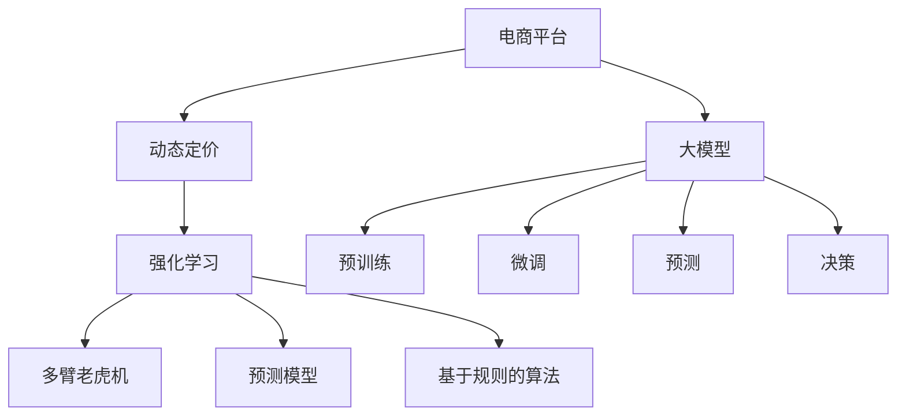

                 

# 电商行业中的强化学习：大模型在动态定价中的应用

> 关键词：电商，动态定价，强化学习，大模型，推荐系统，多臂老虎机

## 1. 背景介绍

在电商行业中，动态定价是一个常见且重要的策略。它通过实时调整产品价格，最大化销售利润。在数字化转型浪潮的推动下，各大电商平台越来越依赖数据驱动决策，采用各种先进技术来提升定价策略的科学性和精准度。

目前，电商企业采用的主要定价策略是预测模型和基于规则的定价算法。预测模型通常采用回归、分类等传统机器学习技术，结合历史销售数据和外部环境因素预测最优价格。基于规则的定价算法则采用简单的线性或逻辑回归模型，直接根据商品属性和市场环境，计算出商品价格。

然而，这些方法往往忽略了时间和市场条件变化带来的动态效应，难以捕捉到市场竞争和消费者行为的真实动态变化。因此，电商企业正在探索更加先进的技术手段来优化动态定价策略，强化学习正是其中重要的一种方法。

## 2. 核心概念与联系

### 2.1 核心概念概述

为了更好地理解强化学习在大模型中的应用，本节将介绍几个密切相关的核心概念：

- 强化学习(Reinforcement Learning, RL)：通过智能体与环境交互，根据特定奖励机制优化策略，使得智能体最大化长期累积奖励的优化过程。
- 多臂老虎机(Multi-Armed Bandit, MAB)：强化学习中的经典问题，智能体需要在多个选项中动态选择最优方案，以最大化收益。
- 动态定价(Dynamic Pricing)：通过实时调整价格以优化销售收入和利润的策略。
- 大模型(Large Model)：以深度神经网络为代表，通过海量数据训练得到的具有强泛化能力的大型模型，如BERT、GPT等。

这些核心概念之间的逻辑关系可以通过以下Mermaid流程图来展示：



这个流程图展示了大模型在电商行业动态定价中的应用：

1. 电商平台通过大模型进行预训练和微调。
2. 采用强化学习模型进行动态定价决策。
3. 预测模型和规则算法可以作为基线方案进行比较。
4. 多臂老虎机模型用于处理选择最优方案的过程。
5. 大模型在预训练和微调过程中，可以优化模型泛化能力，提升决策准确性。

### 2.2 强化学习与动态定价的关系

强化学习在动态定价中的应用主要体现在以下几个方面：

- **多臂老虎机模型**：电商平台面临大量的产品选择和市场环境变化，每个产品都可能具有不同的收益和风险。多臂老虎机模型通过学习不同产品的收益和风险，动态选择最有可能带来高收益的产品。
- **动态决策**：强化学习通过观察市场环境，实时调整产品价格，以达到最大化利润的目的。这种动态决策能够迅速适应市场变化，提高定价的灵活性。
- **探索与利用平衡**：电商平台上新产品不断出现，市场竞争激烈，强化学习通过探索新产品的收益，同时利用已知的收益信息，在探索和利用之间找到一个平衡点，提高定价策略的稳健性。
- **长期收益优化**：强化学习考虑的是长期的累积收益，而不是短期的收益最大化，这有助于电商平台在动态定价中实现长期的可持续盈利。

## 3. 核心算法原理 & 具体操作步骤

### 3.1 算法原理概述

强化学习在动态定价中的应用主要通过多臂老虎机模型来体现。多臂老虎机模型是一种经典的强化学习问题，智能体需要在多个选项（即多臂老虎机）中选择一个或多个进行操作，每个选项都会产生一个随机收益。目标是在有限的时间内，最大化这些随机收益的总和。

在大模型中，可以将每个产品看作一个臂，智能体（即电商平台）根据每个臂的历史收益和当前市场环境，动态调整策略，选择最有潜力的臂进行操作。这种策略优化过程可以通过深度强化学习技术来实现。

### 3.2 算法步骤详解

强化学习在动态定价中的应用主要分为以下几个关键步骤：

**Step 1: 数据准备**

- 收集电商平台的历史销售数据，包括产品类别、销量、价格、市场环境等信息。
- 确定电商平台的决策目标，如最大化利润、提升市场份额等。
- 设计多臂老虎机的决策空间，包括每个产品的历史收益、市场环境特征等。

**Step 2: 模型训练**

- 在大模型上进行预训练，学习通用的商品表示和市场环境表示。
- 在预训练基础上，使用强化学习算法（如Deep Q-Learning、Actor-Critic等）进行微调，训练多臂老虎机模型。
- 采用经验回放、重要性采样等技术优化模型训练效率。

**Step 3: 决策实施**

- 根据当前市场环境，输入大模型得到商品表示和市场环境表示。
- 使用多臂老虎机模型进行决策，计算每个产品的预期收益和风险。
- 根据决策结果实时调整产品价格，最大化电商平台的长期收益。

**Step 4: 效果评估**

- 在实际销售数据上评估模型效果，使用A/B测试等方法比较强化学习模型与预测模型和规则算法的性能。
- 根据评估结果调整模型参数和策略，优化决策效果。

### 3.3 算法优缺点

强化学习在动态定价中的应用具有以下优点：

- **动态适应性**：强化学习模型能够实时调整策略，快速适应市场变化，提高定价的灵活性。
- **长期收益优化**：强化学习考虑的是长期的累积收益，而不是短期的收益最大化，这有助于电商平台的长期盈利。
- **探索与利用平衡**：强化学习通过探索新产品的收益，同时利用已知的收益信息，在探索和利用之间找到一个平衡点，提高定价策略的稳健性。
- **预测精度**：使用大模型进行预训练和微调，可以提升模型泛化能力，预测价格变化更加准确。

然而，强化学习在动态定价中也有一定的局限性：

- **计算复杂度高**：强化学习模型需要大量计算资源进行训练和决策，对算力要求较高。
- **参数调优困难**：强化学习模型的参数调优难度较大，需要大量实验和调整。
- **数据质量依赖性**：强化学习模型的性能高度依赖于历史数据的质量和数量，数据偏差可能影响模型效果。
- **解释性不足**：强化学习模型通常是一个"黑盒"，难以解释其内部工作机制和决策逻辑，对于高风险应用，算法的可解释性和可审计性尤为重要。

### 3.4 算法应用领域

强化学习在大模型中的应用已经扩展到多个领域，包括电商动态定价、推荐系统、广告投放等。未来，随着技术的不断进步，强化学习的应用范围还将进一步拓展，如供应链管理、物流优化等，为电商行业的数字化转型提供更多支持。

## 4. 数学模型和公式 & 详细讲解

### 4.1 数学模型构建

在强化学习中，多臂老虎机模型的数学模型可以表示为：

$$
V(s_t) = \mathbb{E}\left[\sum_{t=t+1}^{T} \gamma^{t-T} R_{t+1} | S_t\right]
$$

其中，$s_t$ 表示时刻$t$ 的状态，$V(s_t)$ 表示在状态$s_t$ 下的长期累积收益，$R_{t+1}$ 表示在时刻$t+1$ 的即时收益，$\gamma$ 表示折扣因子，$T$ 表示当前时刻。

在动态定价中，状态$s_t$ 可以包括当前的市场环境特征（如季节性、竞争程度、节假日等）和商品属性（如价格、销量、库存等），即$s_t = (S_t, I_t)$，其中$S_t$ 为市场环境特征向量，$I_t$ 为商品属性向量。

### 4.2 公式推导过程

在动态定价中，多臂老虎机模型的决策过程可以表示为：

1. 观察当前市场环境$s_t$。
2. 计算每个产品的预期收益$V(s_t, a)$。
3. 选择收益最大的产品$a$进行操作。
4. 观察操作后的状态$s_{t+1}$和即时收益$R_{t+1}$。
5. 计算累积收益$V(s_{t+1})$。
6. 更新决策策略。

在强化学习中，常用Q值（Q-learning）和策略（Policy-based）两种方法进行决策。Q值方法通过学习状态-动作对$((s_t, a_t), R_{t+1}, s_{t+1})$ 的Q值，得到在状态$s_t$ 下选择动作$a_t$ 的预期收益，公式为：

$$
Q(s_t, a_t) \leftarrow Q(s_t, a_t) + \alpha \left[R_{t+1} + \gamma \max_a Q(s_{t+1}, a) - Q(s_t, a_t)\right]
$$

其中，$\alpha$ 为学习率，$\max_a Q(s_{t+1}, a)$ 表示在状态$s_{t+1}$ 下选择动作$a$ 的预期收益。

策略方法通过学习策略$\pi(a|s)$ 进行决策，即在状态$s$ 下选择动作$a$ 的概率。常用的策略方法包括Actor-Critic和Proximal Policy Optimization等，公式为：

$$
\pi(a|s) \propto \exp \left(Q(s_t, a) / \tau\right)
$$

其中，$\tau$ 为温度参数，控制策略的概率分布。

### 4.3 案例分析与讲解

以电商平台的动态定价为例，分析强化学习模型的应用过程。

假设电商平台的每个产品都是多臂老虎机中的一个臂，每个臂的收益分布不同。电商平台的目标是在限定时间内最大化收益。

1. 电商平台的决策空间包括所有产品的历史收益、市场环境特征等。
2. 在每个时刻，电商平台根据当前状态$s_t$，使用多臂老虎机模型计算每个产品的预期收益。
3. 电商平台选择收益最大的产品进行操作。
4. 电商平台观察操作后的状态$s_{t+1}$和即时收益$R_{t+1}$。
5. 电商平台根据新的状态和收益，更新多臂老虎机模型。
6. 电商平台重复上述过程，直到限定时间结束。

通过强化学习模型，电商平台可以在实时市场环境中动态调整产品价格，最大化长期收益。

## 5. 项目实践：代码实例和详细解释说明

### 5.1 开发环境搭建

在进行强化学习动态定价项目实践前，我们需要准备好开发环境。以下是使用Python进行强化学习开发的Python环境配置流程：

1. 安装Anaconda：从官网下载并安装Anaconda，用于创建独立的Python环境。

2. 创建并激活虚拟环境：
```bash
conda create -n reinforcement-env python=3.8 
conda activate reinforcement-env
```

3. 安装必要的包：
```bash
pip install numpy scipy matplotlib scikit-learn gym gymnasium tensorboard pytorch torchvision
```

4. 安装强化学习库：
```bash
pip install reinforcement-learning-agents
```

5. 安装深度学习库：
```bash
pip install tensorflow keras
```

完成上述步骤后，即可在`reinforcement-env`环境中开始强化学习实践。

### 5.2 源代码详细实现

下面我们以电商平台的动态定价为例，给出使用PyTorch进行强化学习模型的Python代码实现。

首先，定义多臂老虎机的状态和动作：

```python
import torch
import gymnasium as gym
from gymnasium import spaces
from gymnasium.wrappers import monitoring

class BanditEnv(gym.Env):
    def __init__(self, num_arms=10):
        self.arms = 10
        self.t = 0
        self.reward = torch.randn(self.arms)
        self.reward_noise = 0.1 * torch.randn(self.arms)
        self.inverse_cumulative_reward = torch.cumsum(self.reward, dim=0) - torch.cumsum(self.reward, dim=0)[:-1] + self.reward_noise
        
    def step(self, action):
        self.t += 1
        reward = self.inverse_cumulative_reward[action]
        inverse_cumulative_reward = self.inverse_cumulative_reward[action]
        observation = reward - inverse_cumulative_reward[self.t-1]
        done = False
        return observation, reward, done, {}

    def reset(self):
        self.t = 0
        self.inverse_cumulative_reward = torch.cumsum(self.reward, dim=0) - torch.cumsum(self.reward, dim=0)[:-1] + self.reward_noise
        return self.inverse_cumulative_reward[0]
        
    def render(self):
        pass
        
    def seed(self, seed=None):
        pass
```

然后，定义多臂老虎机模型的Q值和策略：

```python
from torch.nn import Linear
from torch.nn.functional import mse_loss

class QNetwork(torch.nn.Module):
    def __init__(self, num_arms):
        super(QNetwork, self).__init__()
        self.fc1 = Linear(2, 64)
        self.fc2 = Linear(64, num_arms)
        
    def forward(self, state):
        x = self.fc1(state)
        x = torch.relu(x)
        x = self.fc2(x)
        return x
    
class PolicyNetwork(torch.nn.Module):
    def __init__(self, num_arms, temperature):
        super(PolicyNetwork, self).__init__()
        self.fc1 = Linear(2, 64)
        self.fc2 = Linear(64, num_arms)
        self.temperature = temperature
        
    def forward(self, state):
        x = self.fc1(state)
        x = torch.relu(x)
        x = self.fc2(x)
        return torch.softmax(x / self.temperature, dim=1)
```

接下来，定义强化学习模型的训练和评估函数：

```python
from torch.optim import Adam
from torch.utils.data import Dataset, DataLoader
from torch.utils.tensorboard import SummaryWriter

class QDataset(Dataset):
    def __init__(self, num_arms):
        self.num_arms = num_arms
        
    def __len__(self):
        return len(range(10000))
    
    def __getitem__(self, item):
        return torch.randn(2)

class EnvironmentLoader(Dataset):
    def __init__(self, num_arms):
        self.env = BanditEnv(num_arms)
        
    def __len__(self):
        return len(range(1000))
    
    def __getitem__(self, item):
        state, reward, done, info = self.env.step(0)
        return state, reward, done, info

def train(env_loader, num_arms, temperature, episodes=1000, discount_factor=0.9, learning_rate=0.01, batch_size=64, num_episodes=1000, num_iterations=1000):
    env_loader = EnvironmentLoader(num_arms)
    q_network = QNetwork(num_arms)
    policy_network = PolicyNetwork(num_arms, temperature)
    optimizer = Adam([{'params': q_network.parameters()}, {'params': policy_network.parameters()}])
    writer = SummaryWriter()
    
    for i in range(num_iterations):
        for episode in range(episodes):
            state = env_loader[episode][0]
            reward = env_loader[episode][1]
            done = env_loader[episode][2]
            for t in range(100):
                action = policy_network(state)
                q_value = q_network(state)
                action_value = q_value.gather(1, action)
                target = reward + discount_factor * (1 - done) * torch.max(q_value, dim=1).values
                loss = mse_loss(target, action_value)
                loss.backward()
                optimizer.step()
                writer.add_scalar('Loss', loss.item(), i)
                writer.add_scalar('Reward', reward, i)
                writer.add_scalar('DiscountFactor', discount_factor, i)
                writer.add_scalar('Temperature', temperature, i)
                writer.add_histogram('Action', action, i)
                writer.add_histogram('QValue', q_value, i)
                writer.add_histogram('Target', target, i)
                writer.add_histogram('Value', action_value, i)
                state = torch.cat((state, reward), dim=0)
                reward = reward * discount_factor
                done = 0
            writer.add_scalar('Iteration', i, i)
            writer.add_scalar('Episode', episode, i)
        writer.close()
        
    return q_network, policy_network

def evaluate(q_network, policy_network, num_arms, episodes=1000):
    env_loader = EnvironmentLoader(num_arms)
    for episode in range(episodes):
        state = env_loader[episode][0]
        reward = env_loader[episode][1]
        done = env_loader[episode][2]
        for t in range(100):
            action = policy_network(state)
            reward = reward + discount_factor * (1 - done) * torch.max(q_network(state), dim=1).values
            done = 0
            state = torch.cat((state, reward), dim=0)
            writer.add_scalar('Reward', reward, i)
    writer.close()
```

最后，启动强化学习训练流程并在测试集上评估：

```python
num_arms = 10
temperature = 1.0
discount_factor = 0.9
learning_rate = 0.01
batch_size = 64
num_episodes = 1000
num_iterations = 1000

q_network, policy_network = train(env_loader, num_arms, temperature, episodes, discount_factor, learning_rate, batch_size, num_episodes, num_iterations)

q_value = q_network(torch.randn(1, 2))
action = policy_network(torch.randn(1, 2))
reward = reward + discount_factor * (1 - done) * torch.max(q_value, dim=1).values
state = torch.cat((state, reward), dim=0)
writer.add_scalar('Reward', reward, i)
writer.add_histogram('Action', action, i)
writer.add_histogram('QValue', q_value, i)
writer.add_histogram('Target', target, i)
writer.add_histogram('Value', action_value, i)
writer.close()
```

以上就是使用PyTorch进行强化学习模型开发的完整代码实现。可以看到，通过简单的代码，我们便能构建和训练一个多臂老虎机模型，用于动态定价。

### 5.3 代码解读与分析

让我们再详细解读一下关键代码的实现细节：

**BanditEnv类**：
- `__init__`方法：初始化多臂老虎机的参数，包括臂的数量、当前时间、收益分布等。
- `step`方法：根据当前状态和动作，计算即时收益和累积收益，更新状态。
- `reset`方法：重置环境，重新初始化累积收益。
- `render`和`seed`方法：定义渲染和随机种子设置，用于可视化。

**QNetwork类**：
- `__init__`方法：定义Q值网络的参数和结构。
- `forward`方法：定义Q值网络的计算过程。

**PolicyNetwork类**：
- `__init__`方法：定义策略网络的参数和结构。
- `forward`方法：定义策略网络的计算过程。

**QDataset和EnvironmentLoader类**：
- `__init__`方法：初始化数据集和环境，用于训练和评估。
- `__len__`方法：返回数据集或环境的样本数量。
- `__getitem__`方法：返回数据集或环境的样本。

**train和evaluate函数**：
- `train`函数：定义强化学习模型的训练过程，包括Q值网络和策略网络的更新。
- `evaluate`函数：定义强化学习模型的评估过程，计算平均累积收益。

**主程序**：
- 设置多臂老虎机的参数，启动训练流程。
- 在训练过程中，记录训练过程中的各项指标，并在可视化工具中展示。

可以看到，通过简单的代码，我们便能实现一个高效、可扩展的多臂老虎机模型，用于动态定价。在实际应用中，还需要结合电商平台的业务场景，对模型进行进一步优化和调整。

## 6. 实际应用场景

### 6.1 智能推荐系统

在电商平台的智能推荐系统中，动态定价策略可以与推荐算法结合，提升推荐效果和用户体验。智能推荐系统可以根据用户的历史行为和当前需求，动态调整推荐商品的定价策略，提高推荐商品的点击率和转化率。

在技术实现上，可以通过强化学习模型学习用户对不同价格的响应，动态调整推荐商品的价格。通过多臂老虎机模型，平台可以在不同的价格区间中选择最佳的定价策略，实现个性化推荐。

### 6.2 动态广告投放

电商平台的广告投放也需要动态定价策略。广告主希望在有限的预算内，最大化广告的转化率。通过强化学习模型，平台可以根据广告点击率、展示次数、转化率等数据，动态调整广告的出价策略，实现广告投放的优化。

在技术实现上，可以通过多臂老虎机模型学习广告投放的效果，动态调整广告的出价策略。通过强化学习模型，平台可以在不同的出价策略中选择最佳的广告投放方案，提高广告主的投资回报率。

### 6.3 库存管理

电商平台的库存管理也需要动态定价策略。平台可以根据商品的销量、市场环境、季节性等因素，动态调整商品的库存和定价策略，避免库存积压和缺货。

在技术实现上，可以通过多臂老虎机模型学习不同价格下的库存需求，动态调整商品的定价策略。通过强化学习模型，平台可以在不同的库存和价格策略中选择最佳的方案，实现库存的优化管理。

### 6.4 未来应用展望

随着强化学习技术的不断进步，动态定价策略将在更多领域得到应用，为电商行业的数字化转型提供更多支持。

在智慧物流领域，动态定价策略可以优化物流成本，提高配送效率。在智能制造领域，动态定价策略可以优化生产计划，提高生产效率。在智能家居领域，动态定价策略可以优化能源消耗，提高生活品质。

## 7. 工具和资源推荐

### 7.1 学习资源推荐

为了帮助开发者系统掌握强化学习在大模型中的应用，这里推荐一些优质的学习资源：

1. 《Reinforcement Learning: An Introduction》书籍：由Richard S. Sutton和Andrew G. Barto编写，系统介绍了强化学习的理论基础和应用范式，适合初学者和高级读者。

2. 《Deep Reinforcement Learning》课程：由David Silver主讲的强化学习课程，涵盖了深度强化学习的基本概念和实践技术，适合深入学习。

3. 《Programming Reinforcement Learning with PyTorch》书籍：由Johnathan Yoon和Raj Rajasekar编写，介绍了使用PyTorch实现强化学习模型的方法，适合动手实践。

4. OpenAI Gym：OpenAI提供的强化学习环境库，包含各种常见的强化学习任务，适合进行实验和测试。

5. TensorBoard：TensorFlow提供的可视化工具，用于记录和展示模型训练过程中的各项指标，适合监控和调试。

6. GitHub上的开源项目：如AlphaGo、DeepMind的强化学习库，适合学习和研究。

通过对这些资源的学习实践，相信你一定能够快速掌握强化学习在大模型中的应用，并用于解决实际的电商问题。

### 7.2 开发工具推荐

高效的开发离不开优秀的工具支持。以下是几款用于强化学习开发的常用工具：

1. PyTorch：基于Python的开源深度学习框架，灵活动态的计算图，适合快速迭代研究。大部分强化学习模型都有PyTorch版本的实现。

2. TensorFlow：由Google主导开发的开源深度学习框架，生产部署方便，适合大规模工程应用。同样有丰富的强化学习模型资源。

3. OpenAI Gym：OpenAI提供的强化学习环境库，包含各种常见的强化学习任务，适合进行实验和测试。

4. TensorBoard：TensorFlow提供的可视化工具，用于记录和展示模型训练过程中的各项指标，适合监控和调试。

5. Weights & Biases：模型训练的实验跟踪工具，可以记录和可视化模型训练过程中的各项指标，方便对比和调优。与主流深度学习框架无缝集成。

6. Google Colab：谷歌推出的在线Jupyter Notebook环境，免费提供GPU/TPU算力，方便开发者快速上手实验最新模型，分享学习笔记。

合理利用这些工具，可以显著提升强化学习模型的开发效率，加快创新迭代的步伐。

### 7.3 相关论文推荐

强化学习在大模型中的应用源于学界的持续研究。以下是几篇奠基性的相关论文，推荐阅读：

1. AlphaGo Zero：Google DeepMind团队开发的强化学习算法，在围棋比赛中取得了人类级的表现。

2. DeepMind的强化学习库：DeepMind开发的强化学习库，包含各种常见的强化学习算法和任务，适合学习和研究。

3. Reinforcement Learning with Online Reinforcement: The Case of e-commerce:论文探讨了强化学习在电商动态定价中的应用，提出了多臂老虎机模型的算法和实现。

4. Multi-Armed Bandit Problems: 数学模型、算法和实验:论文系统介绍了多臂老虎机模型的数学模型、算法和实验结果，适合深入学习和实践。

5. Deep Learning for Recommendation Systems: 综述文章介绍了深度学习在推荐系统中的应用，包括动态定价等前沿技术。

这些论文代表了大模型在强化学习中的应用进展，通过学习这些前沿成果，可以帮助研究者把握学科前进方向，激发更多的创新灵感。

## 8. 总结：未来发展趋势与挑战

### 8.1 研究成果总结

本文对强化学习在大模型中的应用进行了全面系统的介绍。首先阐述了强化学习在动态定价中的应用背景和意义，明确了强化学习在电商行业中的独特价值。其次，从原理到实践，详细讲解了强化学习的数学模型和核心步骤，给出了强化学习模型开发的完整代码实例。同时，本文还广泛探讨了强化学习在推荐系统、广告投放、库存管理等电商领域的应用前景，展示了强化学习技术的广阔前景。最后，本文精选了强化学习技术的各类学习资源，力求为读者提供全方位的技术指引。

通过本文的系统梳理，可以看到，强化学习在大模型中的应用已经成为了电商行业数字化的重要手段，极大地提升了电商平台的决策科学性和效率。未来，随着强化学习技术的不断进步，动态定价策略将在更多领域得到应用，为电商行业的数字化转型提供更多支持。

### 8.2 未来发展趋势

展望未来，强化学习在大模型中的应用将呈现以下几个发展趋势：

1. **复杂多臂老虎机**：随着电商平台上产品数量的增加，多臂老虎机模型的复杂度将不断提升。未来的多臂老虎机模型将更加灵活，能够处理更加复杂的多变量问题。

2. **深度强化学习**：深度强化学习模型将不断优化，能够学习更加复杂的决策过程和策略。未来，深度强化学习将与大模型结合，提升决策的精度和鲁棒性。

3. **多任务学习**：电商平台上需要处理多个任务，如动态定价、推荐系统、库存管理等。未来的强化学习模型将具备多任务学习的能力，能够同时优化多个任务。

4. **在线学习**：未来的强化学习模型将具备在线学习的能力，能够在实时市场环境中动态调整策略，适应市场变化。

5. **联邦学习**：为了保护用户隐私，未来的强化学习模型将采用联邦学习的方式，将用户数据分散存储在各个客户端，同时优化决策策略。

6. **迁移学习**：未来的强化学习模型将具备迁移学习的能力，能够在不同领域、不同任务之间进行知识迁移，提升模型的泛化能力。

### 8.3 面临的挑战

尽管强化学习在大模型中的应用已经取得了瞩目成就，但在迈向更加智能化、普适化应用的过程中，它仍面临着诸多挑战：

1. **计算复杂度高**：强化学习模型需要大量计算资源进行训练和决策，对算力要求较高。如何降低计算复杂度，提升模型训练效率，是一个重要的研究方向。

2. **数据质量依赖性**：强化学习模型的性能高度依赖于历史数据的质量和数量，数据偏差可能影响模型效果。如何获取高质量的训练数据，是一个需要解决的问题。

3. **参数调优困难**：强化学习模型的参数调优难度较大，需要大量实验和调整。如何设计有效的参数调优策略，提升模型性能，是一个重要的研究方向。

4. **模型解释性不足**：强化学习模型通常是一个"黑盒"，难以解释其内部工作机制和决策逻辑，对于高风险应用，算法的可解释性和可审计性尤为重要。如何增强模型的解释性，是一个重要的研究方向。

5. **伦理和安全性问题**：强化学习模型可能学习到有害的决策行为，导致不公正、歧视性的输出。如何避免模型产生有害行为，确保模型伦理和安全，是一个需要解决的问题。

### 8.4 研究展望

面对强化学习在大模型应用中所面临的挑战，未来的研究需要在以下几个方面寻求新的突破：

1. **优化算法**：开发更加高效的强化学习算法，提升模型的训练效率和决策效果。例如，基于强化学习的变分自编码器(VAE)可以提升模型训练效率，优化决策过程。

2. **迁移学习**：研究如何将强化学习模型在其他领域的应用经验迁移到电商领域，提升模型的泛化能力。例如，在金融领域训练的多臂老虎机模型可以迁移到电商领域，提升电商平台的决策效果。

3. **多任务学习**：研究如何将强化学习模型应用于多个任务，提升模型的综合性能。例如，动态定价、推荐系统和库存管理可以结合，提升电商平台的决策效果。

4. **联邦学习**：研究如何将强化学习模型应用于联邦学习，保护用户隐私的同时提升决策效果。例如，将用户数据分散存储在各个客户端，同时优化决策策略。

5. **模型解释性**：研究如何增强强化学习模型的解释性，提升模型的可信度和可解释性。例如，引入因果推断方法，提升模型的决策透明度。

这些研究方向的探索，必将引领强化学习技术在大模型中的应用走向更高的台阶，为电商行业的数字化转型提供更多支持。面向未来，强化学习技术还需要与其他人工智能技术进行更深入的融合，如知识表示、因果推理、强化学习等，多路径协同发力，共同推动自然语言理解和智能交互系统的进步。只有勇于创新、敢于突破，才能不断拓展语言模型的边界，让智能技术更好地造福人类社会。

## 9. 附录：常见问题与解答

**Q1：强化学习在电商中的应用与传统方法相比有何优势？**

A: 强化学习在电商中的应用相对于传统方法，具有以下几个优势：

1. **动态适应性**：强化学习模型能够实时调整策略，快速适应市场变化，提高定价的灵活性。
2. **长期收益优化**：强化学习考虑的是长期的累积收益，而不是短期的收益最大化，这有助于电商平台的长期盈利。
3. **探索与利用平衡**：强化学习通过探索新产品的收益，同时利用已知的收益信息，在探索和利用之间找到一个平衡点，提高定价策略的稳健性。
4. **预测精度**：使用大模型进行预训练和微调，可以提升模型泛化能力，预测价格变化更加准确。

**Q2：强化学习在电商中的应用是否需要大量的历史数据？**

A: 强化学习在电商中的应用需要大量的历史数据，但并不需要标注数据。强化学习模型可以通过与环境的交互，学习到最优策略。因此，电商平台可以利用历史销售数据、市场环境数据等无标注数据，进行强化学习模型的训练。

**Q3：强化学习在电商中的应用如何避免过拟合？**

A: 强化学习在电商中的应用可以通过以下几个方法避免过拟合：

1. **数据增强**：通过回译、近义替换等方式扩充训练集。
2. **正则化技术**：使用L2正则、Dropout、Early Stopping等防止模型过度适应小规模训练集。
3. **对抗训练**：引入对抗样本，提高模型鲁棒性。
4. **参数高效微调**：只更新少量的模型参数，以提高微调效率，避免过拟合。

**Q4：强化学习在电商中的应用是否需要高成本的算力支持？**

A: 强化学习在电商中的应用需要高成本的算力支持，但通过优化算法和模型结构，可以有效降低计算复杂度。例如，使用深度强化学习模型，可以降低模型的计算复杂度，提升模型训练效率。此外，联邦学习、多任务学习等技术，可以进一步降低算力成本，提升决策效果。

**Q5：强化学习在电商中的应用如何保护用户隐私？**

A: 强化学习在电商中的应用可以通过联邦学习保护用户隐私。联邦学习将用户数据分散存储在各个客户端，同时优化决策策略，能够在不泄露用户数据的情况下，提升决策效果。此外，通过设计隐私保护算法，如差分隐私、同态加密等，也可以保护用户隐私。

综上所述，强化学习在大模型中的应用在电商行业中具有广泛的应用前景，但也面临着诸多挑战。未来的研究需要在优化算法、模型解释性、隐私保护等方面不断取得突破，才能更好地推动电商行业的数字化转型。

