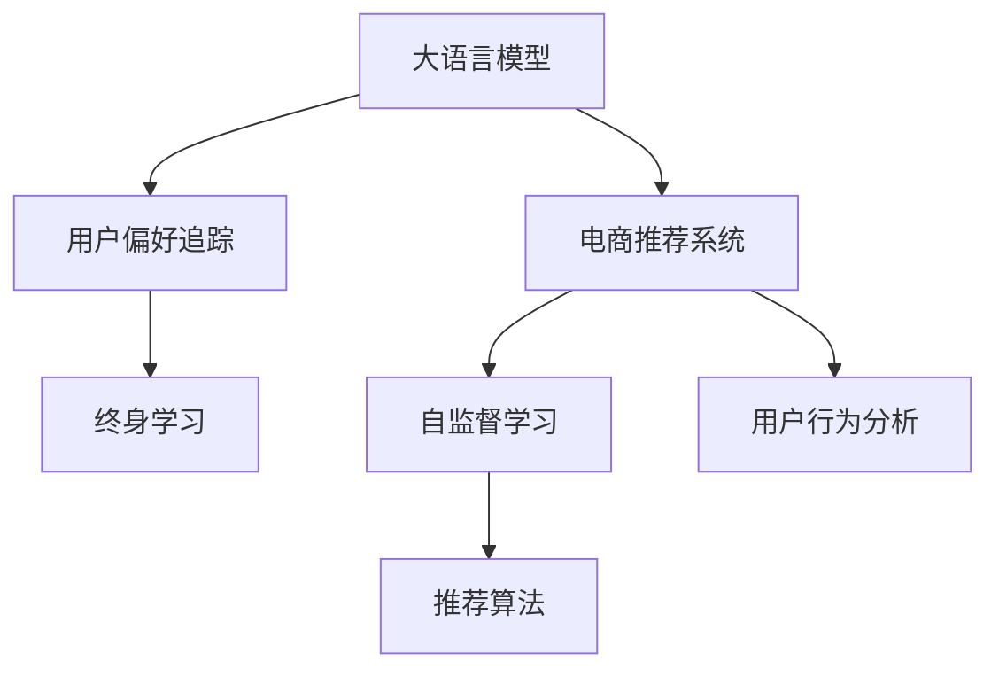

                 

# 电商行业中的终身学习：大模型在用户偏好追踪中的应用

> 关键词：大语言模型,用户偏好追踪,电商推荐系统,终身学习,自监督学习,推荐算法,用户行为分析

## 1. 背景介绍

### 1.1 问题由来
随着电商市场的迅速发展，用户购买行为的多样性和复杂性日益增加。传统的推荐算法难以全面把握用户个性化的需求，无法实时调整推荐策略，导致用户体验和转化率双双下降。如何精准追踪和理解用户偏好，成为电商企业亟需解决的问题。

大语言模型在自然语言处理(NLP)领域的突破性进展，使得其被引入电商推荐系统中，用于分析用户行为和生成推荐。大模型通过对用户评论、搜索记录等数据进行预训练，学习到丰富的语义表示和用户语境信息，并在特定任务上进行微调，可以显著提升电商推荐系统的精准度和个性化水平。

### 1.2 问题核心关键点
大模型在电商推荐系统中的应用，核心在于如何利用大规模预训练数据和微调技术，构建基于用户偏好的推荐引擎。具体问题包括：
- 如何高效地获取和处理用户数据？
- 如何将大模型的预训练能力转化为电商推荐系统中的实时推荐？
- 如何在推荐算法中引入大模型的自然语言理解能力，提升推荐精度？
- 如何在推荐系统运行时实现大模型的持续学习，更新用户偏好？
- 如何平衡模型的实时性和准确性？

通过研究这些核心问题，可以为电商推荐系统提供更为智能和个性化的服务，提升用户体验和运营效率。

## 2. 核心概念与联系

### 2.1 核心概念概述

为更好地理解大模型在电商推荐系统中的应用，本节将介绍几个密切相关的核心概念：

- 大语言模型(Large Language Model, LLM)：以自回归(如GPT)或自编码(如BERT)模型为代表的大规模预训练语言模型。通过在大规模无标签文本语料上进行预训练，学习通用的语言表示，具备强大的语言理解和生成能力。

- 电商推荐系统(Recommendation System in E-commerce)：利用用户历史行为数据，结合商品特征，为每个用户推荐最合适的商品或服务的系统。电商推荐系统是提升用户转化率和平台粘性的关键。

- 用户偏好追踪(User Preference Tracking)：通过分析用户的历史行为数据，实时学习并调整其偏好，提高推荐的精准度和个性化水平。

- 终身学习(Lifelong Learning)：指模型能够持续从新数据中学习，同时保持已学习的知识，而不会出现灾难性遗忘。这与电商推荐系统中的实时数据更新和用户偏好调整高度契合。

- 自监督学习(Self-Supervised Learning)：指在无标签数据上进行学习，自动生成学习信号，提升模型的泛化能力。电商推荐系统中的用户行为数据往往是无标签的，自监督学习能够充分发挥其价值。

- 推荐算法(Recommendation Algorithms)：利用用户历史行为、商品属性、时间等因素，生成推荐结果的算法。常见的推荐算法包括基于协同过滤、基于内容过滤、混合推荐等。

- 用户行为分析(User Behavior Analysis)：对用户的操作、点击、浏览等行为进行分析，挖掘用户兴趣和偏好，为推荐系统提供决策依据。

这些核心概念之间的逻辑关系可以通过以下Mermaid流程图来展示：



这个流程图展示了大语言模型在电商推荐系统中的应用框架：

1. 大语言模型通过预训练学习通用语言表示。
2. 电商推荐系统利用大模型的预训练能力，生成推荐结果。
3. 用户偏好追踪模块通过实时学习用户行为，调整推荐策略。
4. 终身学习使模型能够持续更新，避免遗忘。
5. 自监督学习在大模型中发挥作用，充分利用无标签数据。
6. 推荐算法结合用户行为分析，输出个性化的推荐结果。

这些概念共同构成了大语言模型在电商推荐系统中的应用基础，使得大模型能够深度参与到用户偏好的追踪和推荐策略的优化中。

## 3. 核心算法原理 & 具体操作步骤
### 3.1 算法原理概述

大模型在电商推荐系统中的应用，本质上是一种终身学习的范式。其核心思想是：通过实时获取用户行为数据，利用大模型的预训练能力，动态调整推荐策略，满足用户个性化的需求。

形式化地，假设大语言模型为 $M_{\theta}$，其中 $\theta$ 为模型参数。电商推荐系统中的用户行为数据记为 $D=\{(x_i,y_i)\}_{i=1}^N$，其中 $x_i$ 为用户的搜索、浏览、购买等行为序列，$y_i$ 为用户对行为序列的反馈，如评分、点击等。电商推荐系统的目标是最小化预测结果与实际反馈之间的差异，即：

$$
\theta^* = \mathop{\arg\min}_{\theta} \sum_{i=1}^N \mathcal{L}(M_{\theta}(x_i),y_i)
$$

其中 $\mathcal{L}$ 为损失函数，可以是均方误差、交叉熵等。在实际应用中，通常采用后验平均法或最大似然估计等方法，优化模型的预测能力。

### 3.2 算法步骤详解

大模型在电商推荐系统中的应用，一般包括以下几个关键步骤：

**Step 1: 收集和处理用户数据**
- 收集电商平台上用户的历史行为数据，如搜索记录、点击记录、购买记录等。
- 对数据进行清洗和标准化，去除噪声和异常值，保证数据质量。
- 对用户行为序列进行编码，转化为模型所需的输入格式。

**Step 2: 构建用户行为模型**
- 设计合适的行为序列编码方法，如循环神经网络(RNN)、卷积神经网络(CNN)等。
- 利用大模型对行为序列进行编码，得到用户行为表示。
- 将用户行为表示输入到推荐算法，生成推荐结果。

**Step 3: 实时推荐和反馈**
- 根据用户的实时行为数据，对用户行为模型进行微调，更新用户行为表示。
- 利用更新后的用户行为表示，重新计算推荐结果。
- 将推荐结果展示给用户，并获取用户的反馈，如点击、购买等。

**Step 4: 持续学习和更新**
- 根据用户的反馈，计算推荐结果的损失，更新模型参数。
- 利用终身学习技术，保持模型对新数据的适应能力，避免过拟合。
- 定期对模型进行重训练，利用最新数据更新知识库。

### 3.3 算法优缺点

大模型在电商推荐系统中的应用，具有以下优点：
1. 可以处理大规模用户数据，分析用户复杂的购买行为。
2. 能够实时调整推荐策略，提升用户体验和转化率。
3. 利用大模型的预训练能力，提升推荐算法的准确性。
4. 利用自监督学习，充分利用无标签数据，提升模型泛化能力。
5. 利用终身学习技术，保持模型对新数据的适应能力。

同时，该方法也存在一些局限性：
1. 数据隐私问题。电商平台上用户数据的隐私保护是重要问题，需要确保用户数据的安全和匿名化。
2. 实时计算开销大。实时微调和更新需要大量计算资源，可能影响系统性能。
3. 模型复杂度高。大模型的结构复杂，训练和推理耗时较长。
4. 模型更新频繁。用户行为快速变化，模型需要频繁更新，影响稳定性。
5. 技术门槛高。需要熟悉大模型的训练、微调等技术，才能有效应用。

尽管存在这些局限性，但就目前而言，基于大模型的推荐系统已经成为电商领域的主流技术，具有显著的性能提升和商业价值。

### 3.4 算法应用领域

大模型在电商推荐系统中的应用，已经覆盖了多个领域，包括但不限于：

- 商品推荐：根据用户的历史行为和实时数据，推荐最符合其兴趣的商品。
- 活动推荐：推荐促销活动、优惠券等，提高用户参与度和转化率。
- 价格优化：根据用户行为预测商品需求，动态调整商品价格。
- 库存管理：预测商品销售情况，优化库存水平和供应链。
- 客服服务：利用用户评论和行为数据，生成个性化的客服回复。

除了以上应用，大模型还可以用于分析和预测用户行为，挖掘潜在的用户需求和趋势，提升电商平台的运营效率。

## 4. 数学模型和公式 & 详细讲解
### 4.1 数学模型构建

在电商推荐系统中，大模型的应用主要依赖于用户行为序列的建模和推荐算法的融合。假设用户行为序列为 $x = (x_1, x_2, \cdots, x_T)$，其中 $x_t$ 表示第 $t$ 步的用户行为。则行为序列建模的目标是最大化用户对行为的预测概率 $p(x)$：

$$
p(x) = \frac{1}{Z} \prod_{t=1}^T p(x_t \mid x_{t-1}, x_{t-2}, \cdots, x_1)
$$

其中 $Z$ 为归一化因子，$x_t$ 的条件概率 $p(x_t \mid x_{t-1}, x_{t-2}, \cdots, x_1)$ 可以通过大模型进行学习。

将行为序列 $x$ 输入到用户行为模型 $M_{\theta}$，得到行为表示 $h(x)$：

$$
h(x) = M_{\theta}(x)
$$

行为表示 $h(x)$ 用于推荐算法中的特征提取和相似度计算，生成推荐结果 $y$：

$$
y = f(h(x), g)
$$

其中 $f$ 为推荐算法函数，$g$ 为商品特征向量。

推荐结果 $y$ 与用户反馈 $y_i$ 之间的损失函数为：

$$
\mathcal{L} = \frac{1}{N} \sum_{i=1}^N \ell(y_i, y)
$$

其中 $\ell$ 为损失函数，可以是均方误差、交叉熵等。

### 4.2 公式推导过程

以下我们以基于用户行为序列的推荐为例，推导推荐系统的损失函数及梯度计算公式。

假设用户行为序列为 $x = (x_1, x_2, \cdots, x_T)$，行为表示 $h(x)$ 为 $d$ 维向量，商品特征向量为 $g$ 为 $d'$ 维向量，推荐算法函数 $f$ 为线性函数：

$$
f(h(x), g) = w^T h(x) + b
$$

其中 $w$ 为权重向量，$b$ 为偏置项。

推荐结果 $y$ 与用户反馈 $y_i$ 之间的损失函数为均方误差损失：

$$
\mathcal{L} = \frac{1}{N} \sum_{i=1}^N (y_i - f(h(x_i), g))^2
$$

对 $w$ 和 $b$ 进行优化，得到：

$$
w^* = \mathop{\arg\min}_{w, b} \mathcal{L}
$$

利用反向传播算法计算梯度，得到：

$$
\frac{\partial \mathcal{L}}{\partial w} = \frac{1}{N} \sum_{i=1}^N (y_i - f(h(x_i), g)) h(x_i)^T
$$

$$
\frac{\partial \mathcal{L}}{\partial b} = \frac{1}{N} \sum_{i=1}^N (y_i - f(h(x_i), g))
$$

在得到梯度后，即可带入优化算法，如梯度下降法，更新模型参数 $w$ 和 $b$。重复上述过程直至收敛，最终得到最优的权重和偏置项 $w^*$ 和 $b^*$。

## 5. 项目实践：代码实例和详细解释说明
### 5.1 开发环境搭建

在进行推荐系统开发前，我们需要准备好开发环境。以下是使用Python进行PyTorch开发的环境配置流程：

1. 安装Anaconda：从官网下载并安装Anaconda，用于创建独立的Python环境。

2. 创建并激活虚拟环境：
```bash
conda create -n recsys python=3.8 
conda activate recsys
```

3. 安装PyTorch：根据CUDA版本，从官网获取对应的安装命令。例如：
```bash
conda install pytorch torchvision torchaudio cudatoolkit=11.1 -c pytorch -c conda-forge
```

4. 安装各类工具包：
```bash
pip install numpy pandas scikit-learn matplotlib tqdm jupyter notebook ipython
```

完成上述步骤后，即可在`recsys`环境中开始推荐系统开发。

### 5.2 源代码详细实现

下面我们以基于用户行为序列的推荐系统为例，给出使用PyTorch进行电商推荐系统开发的PyTorch代码实现。

首先，定义用户行为序列的编码函数：

```python
import torch
from torch import nn

class BehaviourEncoding(nn.Module):
    def __init__(self, input_size, hidden_size, output_size):
        super(BehaviourEncoding, self).__init__()
        self.lstm = nn.LSTM(input_size, hidden_size, batch_first=True)
        self.fc = nn.Linear(hidden_size, output_size)
        
    def forward(self, x):
        _, (h_n, h_c) = self.lstm(x)
        return self.fc(h_n)
```

然后，定义推荐算法函数：

```python
class Recommendation(nn.Module):
    def __init__(self, output_size, hidden_size):
        super(Recommendation, self).__init__()
        self.fc = nn.Linear(hidden_size, output_size)
        
    def forward(self, h, g):
        return self.fc(h) + g
```

接着，定义推荐系统的损失函数和优化器：

```python
from torch.optim import Adam

def build_loss_function(output_size, hidden_size):
    criterion = nn.MSELoss()
    return criterion

def build_optimizer(model, learning_rate):
    optimizer = Adam(model.parameters(), lr=learning_rate)
    return optimizer
```

最后，启动训练流程并在测试集上评估：

```python
epochs = 10
learning_rate = 0.001
hidden_size = 128
output_size = 10

behaviour_model = BehaviourEncoding(input_size, hidden_size, hidden_size)
recommendation_model = Recommendation(hidden_size, output_size)
loss_function = build_loss_function(output_size, hidden_size)
optimizer = build_optimizer(model, learning_rate)

behaviour_model.to(device)
recommendation_model.to(device)

for epoch in range(epochs):
    loss = train_epoch(behaviour_model, recommendation_model, loss_function, optimizer, train_data, train_labels)
    print(f'Epoch {epoch+1}, loss: {loss:.3f}')
    
    evaluate(behaviour_model, recommendation_model, loss_function, test_data, test_labels)

```

以上就是使用PyTorch进行电商推荐系统开发的完整代码实现。可以看到，得益于PyTorch的灵活性和易用性，我们能够快速搭建推荐系统的行为模型和推荐算法，并通过损失函数和优化器进行训练和评估。

### 5.3 代码解读与分析

让我们再详细解读一下关键代码的实现细节：

**BehaviourEncoding类**：
- `__init__`方法：初始化LSTM和全连接层，作为用户行为序列的编码器。
- `forward`方法：将行为序列输入LSTM，得到行为表示，再经过全连接层得到推荐结果。

**Recommendation类**：
- `__init__`方法：初始化全连接层，作为推荐算法函数。
- `forward`方法：将行为表示和商品特征向量输入全连接层，生成推荐结果。

**build_loss_function和build_optimizer函数**：
- 定义了均方误差损失函数和Adam优化器，用于模型训练和评估。

**train_epoch和evaluate函数**：
- `train_epoch`函数：在训练集上训练模型，计算损失并更新参数。
- `evaluate`函数：在测试集上评估模型性能，输出均方误差。

这些代码示例展示了如何使用PyTorch实现电商推荐系统的行为建模和推荐算法。需要注意的是，实际的电商推荐系统需要结合业务逻辑和算法策略，进行更加复杂的设计和优化。

## 6. 实际应用场景

### 6.1 智能客服

基于大模型的电商推荐系统，可以用于构建智能客服系统。智能客服能够自动理解用户输入的问题，并根据用户行为历史生成个性化的回复，提升用户体验。

在技术实现上，可以将用户搜索记录、客服对话记录等数据输入大模型进行预训练，学习到用户的语境信息。然后，对每个用户生成行为表示，将其输入推荐算法，生成个性化回复。智能客服系统能够不断学习用户的行为和反馈，优化回复策略，提高服务质量。

### 6.2 个性化推荐

大模型的电商推荐系统，可以应用于个性化推荐，为每个用户推荐最适合的商品。通过对用户历史行为进行分析，结合大模型的预训练能力，推荐系统可以挖掘用户兴趣，生成精准的推荐结果。

在实际应用中，可以将用户浏览记录、点击记录等数据输入大模型，学习到用户的行为表示。然后，将行为表示输入推荐算法，结合商品特征向量，生成推荐结果。推荐系统可以实时更新行为表示，根据最新的用户行为数据调整推荐策略。

### 6.3 商品销售预测

电商推荐系统还可以通过大模型进行商品销售预测，帮助商家优化库存和促销策略。通过对用户行为进行分析，结合大模型的预训练能力，推荐系统可以预测不同商品的需求量，优化库存水平和促销活动。

在实际应用中，可以将用户行为数据输入大模型，学习到用户的行为表示。然后，将行为表示输入推荐算法，结合商品销售数据，预测商品需求量。商家可以根据预测结果，优化库存水平和促销策略，提升运营效率。

## 7. 工具和资源推荐

### 7.1 学习资源推荐

为了帮助开发者系统掌握电商推荐系统中的大模型应用，这里推荐一些优质的学习资源：

1. 《深度学习推荐系统》系列书籍：深入讲解了推荐系统的原理和实现，包括大模型在推荐中的应用。

2. Kaggle电商推荐系统竞赛：收集了大量电商推荐系统的数据集和模型，适合进行实战练习。

3. PyTorch官方文档：提供了详细的PyTorch代码示例，适合快速上手。

4. 《Recommender Systems》课程：斯坦福大学开设的推荐系统课程，内容覆盖全面，适合系统学习。

5. TensorFlow推荐系统示例：谷歌提供的推荐系统示例代码，适合深入理解推荐算法。

通过对这些资源的学习实践，相信你一定能够快速掌握电商推荐系统中的大模型应用。

### 7.2 开发工具推荐

高效的开发离不开优秀的工具支持。以下是几款用于电商推荐系统开发的工具：

1. PyTorch：基于Python的开源深度学习框架，灵活的计算图设计，适合快速迭代研究。

2. TensorFlow：由Google主导开发的深度学习框架，生产部署方便，适合大规模工程应用。

3. Scikit-learn：Python机器学习库，提供了丰富的机器学习算法，适合进行数据处理和特征工程。

4. Pandas：Python数据分析库，适合处理电商推荐系统中的大规模数据集。

5. Jupyter Notebook：交互式笔记本，适合进行模型训练和调试。

合理利用这些工具，可以显著提升电商推荐系统的开发效率，加快创新迭代的步伐。

### 7.3 相关论文推荐

电商推荐系统的发展离不开学界的持续研究。以下是几篇奠基性的相关论文，推荐阅读：

1. "The Recommender System Handbook" by Krystian Pelczynski and Johan Hall: 全面介绍推荐系统的理论、技术和应用。

2. "Collaborative Filtering for Implicit Feedback Datasets" by Pan et al.：介绍协同过滤算法在电商推荐系统中的应用。

3. "Personalized Ranking in Recommendation Systems" by Yang et al.：介绍基于深度学习的推荐系统，包括大模型的应用。

4. "Hierarchical Probabilistic Matrix Factorization" by Aihara et al.：介绍层次化矩阵分解算法在电商推荐系统中的应用。

5. "Adversarial Training Methods for Robust Recommendation Systems" by Zhu et al.：介绍对抗训练在电商推荐系统中的应用，提升模型的鲁棒性。

这些论文代表了大模型在电商推荐系统中的应用脉络。通过学习这些前沿成果，可以帮助研究者把握学科前进方向，激发更多的创新灵感。

## 8. 总结：未来发展趋势与挑战

### 8.1 总结

本文对大模型在电商推荐系统中的应用进行了全面系统的介绍。首先阐述了电商推荐系统和大模型用户偏好追踪的研究背景和意义，明确了电商推荐系统对用户偏好的实时追踪和个性化推荐的需求。其次，从原理到实践，详细讲解了大模型的用户行为建模和推荐算法，给出了电商推荐系统的完整代码实例。同时，本文还广泛探讨了电商推荐系统在大模型微调、行为分析和实时推荐等方面的应用前景，展示了大模型在电商领域的广泛潜力。

通过本文的系统梳理，可以看到，大模型在电商推荐系统中的应用，已经成为电商领域的重要技术范式，极大地提升了推荐的个性化和精准度。得益于大模型的强大预训练能力，电商推荐系统能够更好地理解和预测用户行为，提升用户体验和转化率。未来，伴随大模型的持续发展和电商市场的繁荣，大模型在电商推荐系统中的应用前景将更加广阔。

### 8.2 未来发展趋势

展望未来，大模型在电商推荐系统中的应用将呈现以下几个发展趋势：

1. 实时性进一步提升。大模型在电商推荐系统中的应用，将更加注重实时性和计算效率，降低延迟，提升用户体验。

2. 模型复杂度降低。未来的大模型将采用更简单、更轻量化的结构，降低计算资源消耗，提升系统性能。

3. 用户行为深度分析。通过对用户行为数据的深度分析和建模，挖掘更多用户的隐性需求和兴趣，提高推荐的个性化和精准度。

4. 多模态融合。结合图像、语音等多模态数据，提升推荐系统对用户的全面理解，提供更为丰富的推荐内容。

5. 社交网络分析。引入社交网络分析技术，利用用户之间的社交关系，提升推荐的可信度和多样性。

6. 推荐系统的集成化。将大模型与决策树、规则引擎等传统推荐系统进行集成，形成综合推荐的解决方案。

以上趋势凸显了大模型在电商推荐系统中的广泛应用前景。这些方向的探索发展，必将进一步提升推荐系统的性能和应用范围，为电商市场带来新的增长点。

### 8.3 面临的挑战

尽管大模型在电商推荐系统中的应用取得了显著的进展，但在迈向更加智能化、普适化应用的过程中，仍面临诸多挑战：

1. 数据隐私问题。电商平台上用户数据的隐私保护是重要问题，需要确保用户数据的安全和匿名化。

2. 实时计算开销大。实时微调和更新需要大量计算资源，可能影响系统性能。

3. 模型复杂度高。大模型的结构复杂，训练和推理耗时较长。

4. 模型更新频繁。用户行为快速变化，模型需要频繁更新，影响稳定性。

5. 技术门槛高。需要熟悉大模型的训练、微调等技术，才能有效应用。

尽管存在这些挑战，但随着大模型的不断进步和电商市场的快速增长，大模型在电商推荐系统中的应用将更加成熟，未来潜力巨大。

### 8.4 研究展望

面对大模型在电商推荐系统中的应用面临的挑战，未来的研究需要在以下几个方面寻求新的突破：

1. 探索无监督和半监督学习。摆脱对大规模标注数据的依赖，利用自监督学习、主动学习等无监督和半监督范式，最大限度利用无标签数据，实现更加灵活高效的微调。

2. 研究参数高效和计算高效的微调范式。开发更加参数高效的微调方法，在固定大部分预训练参数的同时，只更新极少量的任务相关参数。同时优化微调模型的计算图，减少前向传播和反向传播的资源消耗，实现更加轻量级、实时性的部署。

3. 引入因果推断和博弈论工具。将因果推断方法引入微调模型，识别出模型决策的关键特征，增强输出解释的因果性和逻辑性。借助博弈论工具刻画人机交互过程，主动探索并规避模型的脆弱点，提高系统稳定性。

4. 纳入伦理道德约束。在模型训练目标中引入伦理导向的评估指标，过滤和惩罚有偏见、有害的输出倾向。同时加强人工干预和审核，建立模型行为的监管机制，确保输出符合人类价值观和伦理道德。

这些研究方向的探索，必将引领大模型在电商推荐系统中的应用迈向更高的台阶，为构建安全、可靠、可解释、可控的智能系统铺平道路。面向未来，大模型在电商推荐系统中的研究还需要与其他人工智能技术进行更深入的融合，如知识表示、因果推理、强化学习等，多路径协同发力，共同推动电商市场的智能化和普适化进程。只有勇于创新、敢于突破，才能不断拓展电商推荐系统的边界，让智能技术更好地造福电商市场。

## 9. 附录：常见问题与解答

**Q1：电商推荐系统中的大模型如何利用用户行为数据进行预训练？**

A: 电商推荐系统中的大模型可以通过收集用户的历史行为数据，如搜索记录、点击记录、购买记录等，进行自监督预训练。例如，可以将用户行为序列作为输入，使用LSTM等循环神经网络进行建模，学习到用户行为表示。然后，将行为表示作为监督信号，训练模型输出用户行为的预测概率。在预训练过程中，模型可以学习到用户行为的语言表示和语境信息，为后续微调和实时推荐提供基础。

**Q2：电商推荐系统中的大模型如何实现实时推荐？**

A: 电商推荐系统中的大模型实现实时推荐，主要依赖于用户行为模型的微调和推荐算法的动态调整。首先，根据用户的历史行为数据，使用LSTM等循环神经网络对其进行编码，得到行为表示。然后，将行为表示输入推荐算法，结合商品特征向量，生成推荐结果。在用户进行实时操作时，将最新的行为数据输入行为模型进行微调，更新行为表示。最后，将更新后的行为表示重新输入推荐算法，生成最新的推荐结果。通过这种方式，电商推荐系统可以实现实时推荐，提升用户体验和转化率。

**Q3：电商推荐系统中的大模型如何平衡实时性和准确性？**

A: 电商推荐系统中的大模型平衡实时性和准确性，可以通过以下几个方面进行优化：
1. 引入缓存机制：在推荐系统中引入缓存机制，将历史推荐结果存储在缓存中，当新用户行为数据到来时，先查询缓存，如未命中再进行实时推荐计算。
2. 梯度累积技术：使用梯度累积技术，将多个批次的梯度累加，分批次更新模型参数，减少单次更新对系统性能的影响。
3. 模型压缩：对大模型进行压缩，减少参数量和计算资源消耗，提高实时性。
4. 分布式计算：使用分布式计算框架，如Spark、Flink等，实现并行计算，提升推荐系统的计算能力。
5. 优化算法：使用优化算法，如Adam、Adagrad等，提高模型的收敛速度和稳定性，减少实时推荐的时间延迟。

通过这些优化技术，电商推荐系统可以在保证实时性的同时，提升推荐算法的准确性和稳定性。

**Q4：电商推荐系统中的大模型如何处理用户行为数据的多样性？**

A: 电商推荐系统中的大模型处理用户行为数据的多样性，主要通过以下几个方面进行优化：
1. 数据清洗：对用户行为数据进行清洗，去除噪声和异常值，确保数据质量。
2. 行为编码：将用户行为序列编码为LSTM等循环神经网络，学习到用户行为表示，捕捉行为的多样性和复杂性。
3. 多维度建模：结合用户行为数据的多维度特征，如时间、地理位置、用户属性等，进行多维度建模，提升模型的泛化能力。
4. 多模态融合：结合图像、语音等多模态数据，提升推荐系统对用户的全面理解，处理行为数据的多样性。
5. 用户行为分析：通过对用户行为数据的深度分析和建模，挖掘更多用户的隐性需求和兴趣，提升推荐的个性化和精准度。

通过这些方法，电商推荐系统可以更好地处理用户行为数据的多样性，提升推荐的个性化和精准度。

**Q5：电商推荐系统中的大模型如何提升推荐系统的个性化？**

A: 电商推荐系统中的大模型提升推荐系统的个性化，主要通过以下几个方面进行优化：
1. 用户行为分析：通过对用户行为数据的深度分析和建模，挖掘更多用户的隐性需求和兴趣，提高推荐的个性化和精准度。
2. 行为建模：使用大模型对用户行为序列进行建模，学习到用户行为表示，捕捉行为的多样性和复杂性。
3. 推荐算法优化：结合用户行为表示和商品特征向量，使用推荐算法生成推荐结果，提升推荐的个性化和多样性。
4. 多模态融合：结合图像、语音等多模态数据，提升推荐系统对用户的全面理解，提供更为丰富的推荐内容。
5. 推荐系统集成：将大模型与决策树、规则引擎等传统推荐系统进行集成，形成综合推荐的解决方案。

通过这些方法，电商推荐系统可以更好地理解和预测用户行为，提供个性化和多样化的推荐结果，提升用户体验和转化率。

**Q6：电商推荐系统中的大模型如何处理用户行为数据的隐私保护问题？**

A: 电商推荐系统中的大模型处理用户行为数据的隐私保护问题，主要通过以下几个方面进行优化：
1. 数据匿名化：对用户行为数据进行匿名化处理，去除敏感信息，保护用户隐私。
2. 差分隐私：引入差分隐私技术，对推荐系统进行扰动处理，保护用户数据的隐私性和安全性。
3. 数据加密：对用户行为数据进行加密处理，防止数据泄露和滥用。
4. 联邦学习：使用联邦学习技术，将用户数据分布式存储，只在本地进行模型训练，保护用户数据的安全性。
5. 合规监管：确保电商推荐系统符合相关的数据隐私和安全法规，如GDPR、CCPA等，保护用户数据隐私。

通过这些方法，电商推荐系统可以在保护用户数据隐私的同时，提供高效的个性化推荐服务。

