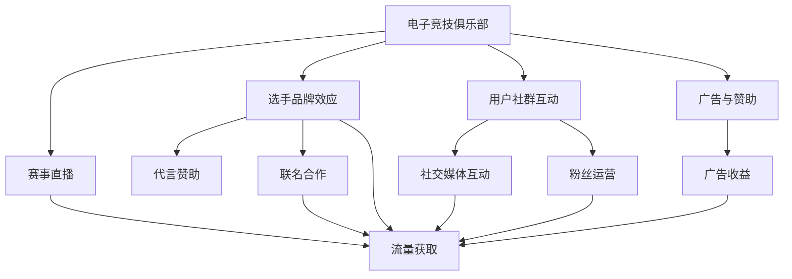
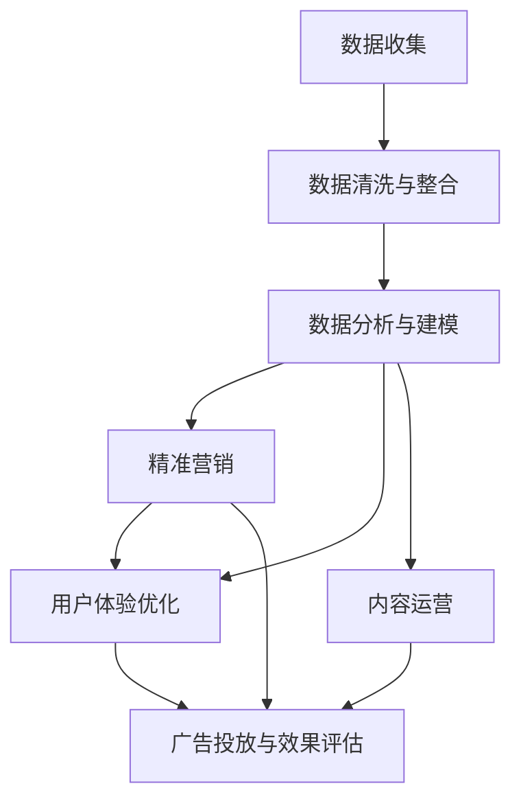

                 

# 电子竞技俱乐部的注意力经济运营模式

> 关键词：电子竞技, 注意力经济, 数据驱动, 精准营销, 用户体验

## 1. 背景介绍

在当前数字化时代，注意力成为一种稀缺资源，谁能获得更多用户的注意力，谁就能在激烈的市场竞争中获得更大的市场份额。电子竞技（eSports）作为数字娱乐产业的重要组成部分，吸引了全球数亿玩家的关注，成为一种全新的注意力经济模式。电子竞技俱乐部（eSports team）作为这一领域的核心参与者，需要充分运用注意力经济理论，通过数据驱动精准营销和用户洞察，提升运营效率和收益。

### 1.1 电子竞技行业概述
电子竞技作为一项新兴的体育竞技项目，融合了游戏、竞技、社交等多重元素，吸引了大量年轻用户的关注。据统计，2022年全球电子竞技市场规模已超过10亿美元，玩家数达4.5亿人，成为全球规模最大的娱乐市场之一。电子竞技行业主要包括以下几个环节：

- **游戏制作与发行**：开发和发行各种电子竞技游戏，如《英雄联盟》、《DOTA2》、《守望先锋》等。
- **赛事组织与管理**：策划和组织各类电子竞技赛事，如国际邀请赛、地区锦标赛、职业联赛等。
- **选手培养与管理**：培训和挖掘优秀的电子竞技选手，并提供赛事管理和商业化服务。
- **内容运营与营销**：运营电子竞技内容，包括比赛直播、选手访谈、赛事分析等，并通过多种渠道进行营销推广。
- **用户社群管理**：建立和维护电子竞技玩家社群，增强用户粘性，提升品牌影响力。

### 1.2 注意力经济模式
注意力经济模式指通过获取和利用用户的注意力资源，实现商业价值的最大化。在电子竞技领域，注意力经济主要体现在以下几个方面：

- **赛事直播**：电子竞技赛事直播吸引了大量观众观看，成为俱乐部获取流量和广告收益的重要渠道。
- **选手品牌效应**：顶尖选手具有高曝光率和品牌影响力，通过代言、赞助、联名等方式产生可观的商业价值。
- **用户社群互动**：电子竞技玩家社群具有高度的活跃性和粘性，通过社交媒体互动、粉丝运营等方式，可以提升用户粘性和忠诚度。
- **广告与赞助**：品牌通过赞助电子竞技赛事和选手，获得高曝光率和用户信任，提升品牌形象和市场份额。

## 2. 核心概念与联系

### 2.1 核心概念概述
在电子竞技俱乐部的注意力经济运营模式中，涉及多个核心概念：

- **电子竞技俱乐部**：指运营和管理电子竞技选手的组织，通常包括选手培训、赛事管理、商业化服务等。
- **注意力经济**：指通过获取和利用用户的注意力资源，实现商业价值的最大化。
- **数据驱动精准营销**：指通过数据分析和挖掘，精准定位用户需求和行为特征，实现更高效的市场营销策略。
- **用户体验**：指用户在使用电子竞技产品或服务时的感受和体验，是提升用户粘性和满意度的关键因素。
- **内容运营**：指通过运营电子竞技内容，提升用户的参与度和品牌影响力。

这些核心概念通过以下Mermaid流程图展示其联系：



### 2.2 核心概念原理和架构的 Mermaid 流程图



## 3. 核心算法原理 & 具体操作步骤

### 3.1 算法原理概述
电子竞技俱乐部的注意力经济运营模式基于数据驱动的精准营销策略。其核心算法原理包括以下几个方面：

- **数据收集与清洗**：收集用户行为数据、赛事数据、广告数据、社交媒体互动数据等，并进行清洗和整合。
- **数据分析与建模**：通过机器学习算法，对数据进行建模分析，挖掘用户需求和行为特征。
- **精准营销**：利用数据模型和算法，精准定位目标用户，实现更高效的市场营销策略。
- **用户体验优化**：通过数据分析，优化电子竞技产品和服务，提升用户体验和满意度。
- **内容运营**：通过数据驱动的内容创作和分发，提升内容的吸引力和传播效果。

### 3.2 算法步骤详解
以下是电子竞技俱乐部注意力经济运营模式的核心算法步骤：

**Step 1: 数据收集与清洗**

- **数据来源**：从游戏平台、赛事组织、广告平台、社交媒体等渠道收集数据。
- **数据类型**：用户行为数据（如观看时长、点击率、互动频率）、赛事数据（如赛程、比分、选手表现）、广告数据（如广告曝光量、点击量、转化率）、社交媒体互动数据（如评论、点赞、分享）等。
- **数据清洗**：去重、处理缺失值、处理异常值等。

**Step 2: 数据分析与建模**

- **特征工程**：提取用户行为特征（如年龄、性别、地域、偏好）、赛事特征（如比赛难度、对手实力、对战结果）、广告特征（如广告类型、创意、投放渠道）等。
- **数据建模**：利用机器学习算法（如随机森林、神经网络、梯度提升树等）对数据进行建模分析，挖掘用户需求和行为特征。
- **模型评估**：通过交叉验证、A/B测试等方法，评估模型的效果和稳定性。

**Step 3: 精准营销**

- **目标用户定位**：利用数据模型和算法，精准定位目标用户群体。
- **个性化营销**：根据用户行为特征和偏好，设计个性化营销策略（如定制广告、定向推送、专属优惠）。
- **效果评估**：跟踪营销效果（如转化率、购买率、品牌曝光度），不断优化营销策略。

**Step 4: 用户体验优化**

- **用户行为分析**：通过数据分析，了解用户在使用电子竞技产品和服务时的行为和感受。
- **功能改进**：根据用户反馈，优化产品功能和界面设计。
- **内容更新**：根据用户偏好，更新游戏内容、比赛直播、选手访谈等，提升用户参与度。

**Step 5: 内容运营**

- **内容创作**：根据数据模型和用户需求，创作高质量的内容（如赛事解说、选手访谈、比赛分析）。
- **内容分发**：利用社交媒体、视频平台、游戏平台等渠道进行内容分发，提升内容的传播效果。
- **效果监控**：跟踪内容表现（如观看量、分享量、互动量），优化内容创作和分发策略。

### 3.3 算法优缺点

**优点**

- **数据驱动**：通过大数据分析，精准定位用户需求和行为特征，实现更高效的市场营销策略。
- **个性化营销**：根据用户偏好，设计个性化营销策略，提升用户体验和满意度。
- **提升收益**：通过精准营销和内容运营，提升电子竞技俱乐部的品牌曝光度和商业收益。

**缺点**

- **数据隐私**：电子竞技俱乐部需要收集和处理大量用户数据，涉及用户隐私和数据安全问题。
- **算法复杂性**：数据建模和算法优化需要较高的技术和资源投入，存在一定的实施难度。
- **市场变化**：电子竞技市场变化快，数据和算法模型需要不断更新和迭代，保持竞争力。

### 3.4 算法应用领域

电子竞技俱乐部的注意力经济运营模式已经在诸多实际应用场景中得到验证，包括：

- **赛事直播**：通过数据分析，优化赛事直播内容，提升观看体验和互动效果。
- **选手代言与赞助**：利用数据模型，精准定位品牌目标用户，实现更高转化率的代言和赞助活动。
- **粉丝运营**：通过社交媒体互动，提升用户粘性和社群活跃度，增强品牌忠诚度。
- **广告投放**：通过个性化广告投放，提升广告点击率和转化率，实现更高的广告收益。

## 4. 数学模型和公式 & 详细讲解 & 举例说明

### 4.1 数学模型构建

电子竞技俱乐部的注意力经济运营模式涉及多个数学模型，包括用户行为模型、赛事模型、广告模型、内容模型等。这里以用户行为模型为例，介绍其数学模型构建。

**用户行为模型**：通过收集用户观看时长、点击率、互动频率等数据，建立用户行为模型，预测用户后续行为。

假设用户行为数据为 $X=\{x_1,x_2,\cdots,x_n\}$，其中 $x_i=(x_{i1},x_{i2},\cdots,x_{im})$ 为第 $i$ 个用户的 $m$ 个行为特征，如年龄、性别、地域等。用户行为模型为：

$$
f(X) = WX + b
$$

其中 $W$ 为权重矩阵，$b$ 为偏置向量。通过训练数据集，求解最优的 $W$ 和 $b$，得到用户行为预测模型 $f(X)$。

### 4.2 公式推导过程

假设已有 $N$ 个用户的 $m$ 个行为特征和对应的 $n$ 个行为标签，数据集为 $D=\{(X_i,Y_i)\}_{i=1}^N$，其中 $X_i=(x_{i1},x_{i2},\cdots,x_{im})$，$Y_i=(y_1,y_2,\cdots,y_n)$ 为用户的 $n$ 个行为标签（如观看、点击、互动等）。

用户行为模型的损失函数为交叉熵损失函数：

$$
\mathcal{L}(W,b) = -\frac{1}{N}\sum_{i=1}^N \sum_{j=1}^n y_j \log f_j(X_i)
$$

其中 $f_j(X_i)$ 为第 $i$ 个用户在第 $j$ 个行为上的预测概率。

通过最小化损失函数，得到最优的权重矩阵 $W$ 和偏置向量 $b$，得到用户行为预测模型 $f(X)$。

### 4.3 案例分析与讲解

假设某电子竞技俱乐部收集到 $100$ 个用户的年龄、性别、地域等行为特征，以及他们观看《英雄联盟》赛事的次数、点击率、互动频率等行为标签。通过数据建模，得到以下用户行为模型：

$$
f(X) = 0.5x_1 + 0.8x_2 - 0.2x_3 + 0.1x_4
$$

其中 $x_1$ 为年龄，$x_2$ 为性别，$x_3$ 为地域，$x_4$ 为观看次数。

利用此模型，可以对新用户的行为进行预测，例如：一个年龄为 $25$ 岁，男性，来自北美的用户，观看《英雄联盟》赛事的点击率约为 $0.6$，互动频率约为 $0.7$。根据用户行为模型，该用户观看次数的预测概率为 $0.8$。

## 5. 项目实践：代码实例和详细解释说明

### 5.1 开发环境搭建

进行电子竞技俱乐部的注意力经济运营模式开发，需要以下开发环境：

- **Python 3.8**：作为主要的编程语言，提供丰富的科学计算和数据分析库。
- **PyTorch**：开源深度学习框架，提供高效的张量计算和神经网络模型。
- **Scikit-Learn**：提供丰富的机器学习算法和数据处理工具。
- **Pandas**：提供数据处理和分析库，方便数据清洗和整合。
- **Jupyter Notebook**：提供交互式编程环境，方便实验和调试。

### 5.2 源代码详细实现

以下是使用 Python 和 PyTorch 实现用户行为模型预测的代码示例：

```python
import torch
import torch.nn as nn
import torch.optim as optim
import pandas as pd
from sklearn.model_selection import train_test_split

# 数据准备
data = pd.read_csv('user_behavior.csv')
X = data.drop('watch_count', axis=1)
Y = data['watch_count']

# 数据划分
X_train, X_test, Y_train, Y_test = train_test_split(X, Y, test_size=0.2, random_state=42)

# 定义模型
class UserBehaviorModel(nn.Module):
    def __init__(self, input_size, output_size):
        super(UserBehaviorModel, self).__init__()
        self.fc1 = nn.Linear(input_size, 16)
        self.fc2 = nn.Linear(16, 8)
        self.fc3 = nn.Linear(8, output_size)

    def forward(self, x):
        x = torch.relu(self.fc1(x))
        x = torch.relu(self.fc2(x))
        x = self.fc3(x)
        return x

# 模型初始化
model = UserBehaviorModel(input_size=X_train.shape[1], output_size=1)

# 定义损失函数和优化器
criterion = nn.MSELoss()
optimizer = optim.Adam(model.parameters(), lr=0.001)

# 模型训练
for epoch in range(100):
    optimizer.zero_grad()
    outputs = model(X_train)
    loss = criterion(outputs, Y_train)
    loss.backward()
    optimizer.step()

    if epoch % 10 == 0:
        print('Epoch [{}/{}], Loss: {:.4f}'.format(epoch+1, 100, loss.item()))

# 模型评估
with torch.no_grad():
    outputs = model(X_test)
    loss = criterion(outputs, Y_test)
    print('Test Loss: {:.4f}'.format(loss.item()))
```

### 5.3 代码解读与分析

**数据准备**：
- 通过 Pandas 读取用户行为数据，并将其分为输入特征 $X$ 和目标变量 $Y$。
- 使用 train_test_split 将数据集划分为训练集和测试集。

**模型定义**：
- 定义一个包含三层全连接神经网络的用户行为模型。
- 输入层、隐藏层、输出层的大小分别为 $X_train.shape[1]$、16、1。
- 使用 ReLU 激活函数。

**模型训练**：
- 定义交叉熵损失函数和优化器。
- 使用循环训练模型，更新模型参数。
- 每10个epoch输出训练损失。

**模型评估**：
- 在测试集上评估模型，输出测试损失。

## 6. 实际应用场景

### 6.1 赛事直播优化

电子竞技俱乐部可以通过数据分析，优化赛事直播内容和互动方式，提升观众观看体验和参与度。具体措施包括：

- **内容推送**：根据观众观看历史和互动行为，推送感兴趣的赛事和选手。
- **互动引导**：通过聊天室、弹幕等互动方式，引导观众参与讨论和提问。
- **个性化广告**：在直播过程中插入个性化广告，提升广告收益。

### 6.2 选手代言与赞助

电子竞技俱乐部可以通过数据分析，精准定位品牌目标用户，实现更高转化率的代言和赞助活动。具体措施包括：

- **用户画像分析**：通过数据分析，建立用户画像，精准定位目标用户。
- **代言人选择**：根据用户画像，选择与目标用户群体匹配的代言人。
- **赞助活动设计**：设计符合目标用户需求的赞助活动，提升转化率。

### 6.3 粉丝运营

电子竞技俱乐部可以通过社交媒体互动，提升用户粘性和社群活跃度，增强品牌忠诚度。具体措施包括：

- **社群管理**：建立和管理电子竞技玩家社群，增强用户粘性和互动。
- **内容创作**：创作符合用户需求的内容（如赛事解说、选手访谈、比赛分析），提升用户参与度。
- **用户反馈收集**：通过社交媒体互动，收集用户反馈，不断优化内容和互动方式。

### 6.4 广告投放

电子竞技俱乐部可以通过个性化广告投放，提升广告点击率和转化率，实现更高的广告收益。具体措施包括：

- **定向广告**：根据用户行为特征和偏好，定向投放广告。
- **效果监控**：跟踪广告投放效果，优化广告投放策略。
- **多渠道投放**：通过多个渠道（如社交媒体、视频平台、游戏平台）进行广告投放，提升广告覆盖率。

## 7. 工具和资源推荐

### 7.1 学习资源推荐

为了帮助开发者系统掌握电子竞技俱乐部的注意力经济运营模式，这里推荐一些优质的学习资源：

- **电子竞技技术博客**：由电子竞技行业专家撰写，深入浅出地介绍了电子竞技行业的技术和管理经验。
- **电子竞技赛事组织与运营**：由电子竞技组织和运营者撰写，介绍电子竞技赛事的策划、执行和管理。
- **数据分析与机器学习**：通过线上课程、书籍、论文等资源，学习数据分析和机器学习的基本理论和实践技巧。
- **社交媒体营销**：通过线上课程、书籍、案例分析等资源，学习社交媒体营销的策略和技巧。

### 7.2 开发工具推荐

高效的开发离不开优秀的工具支持。以下是几款用于电子竞技俱乐部注意力经济运营模式开发的常用工具：

- **Jupyter Notebook**：提供交互式编程环境，方便实验和调试。
- **TensorBoard**：实时监测模型训练状态，提供丰富的图表呈现方式，是调试模型的得力助手。
- **Python**：作为主要的编程语言，提供丰富的科学计算和数据分析库。
- **PyTorch**：开源深度学习框架，提供高效的张量计算和神经网络模型。
- **Scikit-Learn**：提供丰富的机器学习算法和数据处理工具。
- **Pandas**：提供数据处理和分析库，方便数据清洗和整合。

### 7.3 相关论文推荐

电子竞技俱乐部注意力经济运营模式的研究源于学界的持续研究。以下是几篇奠基性的相关论文，推荐阅读：

- **电子竞技数据挖掘与分析**：介绍电子竞技数据的收集、处理和分析方法，以及基于数据驱动的决策支持。
- **电子竞技注意力经济模型**：提出基于注意力经济理论的电子竞技俱乐部运营模型，分析数据驱动精准营销策略。
- **电子竞技内容推荐与个性化**：研究电子竞技内容推荐和个性化的算法和策略，提升用户参与度和满意度。

## 8. 总结：未来发展趋势与挑战

### 8.1 研究成果总结

本文对电子竞技俱乐部注意力经济运营模式进行了全面系统的介绍。首先阐述了电子竞技行业和注意力经济模式的基本概念，明确了电子竞技俱乐部运营的重要性和挑战。其次，从原理到实践，详细讲解了电子竞技俱乐部注意力经济运营模式的数据驱动精准营销策略，提供了完整的代码实例和详细解释说明。同时，本文还广泛探讨了注意力经济模式在赛事直播优化、选手代言与赞助、粉丝运营、广告投放等多个实际应用场景中的应用前景，展示了注意力经济模式的巨大潜力。此外，本文精选了注意力经济模式的学习资源，力求为读者提供全方位的技术指引。

通过本文的系统梳理，可以看到，电子竞技俱乐部的注意力经济运营模式正在成为电子竞技行业的重要范式，极大地拓展了电子竞技俱乐部的运营边界，催生了更多的落地场景。受益于数据驱动和精准营销的精准定位，电子竞技俱乐部的品牌曝光度和商业收益得到了显著提升。未来，伴随数据科技和人工智能技术的持续进步，电子竞技俱乐部的运营模式还将不断创新，进一步提升用户体验和运营效率。

### 8.2 未来发展趋势

展望未来，电子竞技俱乐部的注意力经济运营模式将呈现以下几个发展趋势：

- **数据驱动智能化**：通过大数据分析和人工智能技术，实现电子竞技俱乐部的智能化运营，提升决策效率和效果。
- **用户需求个性化**：利用数据挖掘和个性化推荐技术，实现电子竞技俱乐部的精准营销，提升用户满意度和忠诚度。
- **内容创新多样化**：通过数据分析和创意设计，创作更多样化的电子竞技内容，提升用户的参与度和体验。
- **跨平台生态建设**：通过数据整合和跨平台合作，构建电子竞技俱乐部的生态系统，提升品牌影响力和市场份额。
- **新兴技术融合**：将虚拟现实（VR）、增强现实（AR）、人工智能（AI）等新兴技术融入电子竞技俱乐部运营中，提升用户体验和互动效果。

### 8.3 面临的挑战

尽管电子竞技俱乐部的注意力经济运营模式已经取得了瞩目成就，但在迈向更加智能化、普适化运营的过程中，它仍面临着诸多挑战：

- **数据隐私与安全**：电子竞技俱乐部需要收集和处理大量用户数据，涉及用户隐私和数据安全问题。
- **技术复杂性与成本**：数据分析和人工智能技术的实施需要较高的技术和资源投入，存在一定的实施难度。
- **市场变化与竞争**：电子竞技市场变化快，需要不断更新和迭代数据和算法模型，保持竞争力。
- **用户体验与内容质量**：电子竞技俱乐部的运营需要兼顾用户体验和内容质量，避免过度商业化影响用户粘性和满意度。
- **品牌价值与社区建设**：电子竞技俱乐部需要建立和维护强大的品牌形象和社群，增强用户粘性和品牌忠诚度。

### 8.4 研究展望

面对电子竞技俱乐部注意力经济运营模式所面临的挑战，未来的研究需要在以下几个方面寻求新的突破：

- **数据隐私保护**：探索隐私保护技术和方法，确保用户数据的安全和隐私。
- **跨平台数据整合**：研究跨平台数据整合技术，实现电子竞技俱乐部间的资源共享和协同运营。
- **个性化推荐算法**：研究更加高效的个性化推荐算法，提升推荐精度和用户满意度。
- **多模态数据融合**：研究多模态数据融合技术，提升电子竞技俱乐部的内容创作和分发效果。
- **新兴技术应用**：探索新兴技术（如VR、AR、AI）在电子竞技俱乐部的应用，提升用户体验和互动效果。

这些研究方向的探索，必将引领电子竞技俱乐部运营模式迈向更高的台阶，为电子竞技行业带来更多的创新和突破。相信随着数据科技和人工智能技术的不断进步，电子竞技俱乐部的注意力经济运营模式将更加智能、高效和用户友好，为电子竞技行业的发展注入新的动力。

## 9. 附录：常见问题与解答

**Q1: 电子竞技俱乐部如何通过数据驱动精准营销？**

A: 电子竞技俱乐部可以通过以下步骤实现数据驱动精准营销：
1. 数据收集：收集用户行为数据、赛事数据、广告数据、社交媒体互动数据等。
2. 数据清洗与整合：对数据进行清洗和整合，去除噪音和异常值。
3. 数据分析与建模：利用机器学习算法，对数据进行建模分析，挖掘用户需求和行为特征。
4. 精准营销：利用数据模型和算法，精准定位目标用户，实现更高效的市场营销策略。
5. 效果评估：跟踪营销效果，不断优化营销策略。

**Q2: 电子竞技俱乐部在赛事直播优化中需要注意哪些方面？**

A: 电子竞技俱乐部在赛事直播优化中需要注意以下方面：
1. 内容推送：根据观众观看历史和互动行为，推送感兴趣的赛事和选手。
2. 互动引导：通过聊天室、弹幕等互动方式，引导观众参与讨论和提问。
3. 个性化广告：在直播过程中插入个性化广告，提升广告收益。
4. 效果监控：跟踪直播效果，优化直播内容。

**Q3: 电子竞技俱乐部在粉丝运营中如何提升用户粘性和社群活跃度？**

A: 电子竞技俱乐部在粉丝运营中可以采取以下措施提升用户粘性和社群活跃度：
1. 社群管理：建立和管理电子竞技玩家社群，增强用户粘性和互动。
2. 内容创作：创作符合用户需求的内容（如赛事解说、选手访谈、比赛分析），提升用户参与度。
3. 用户反馈收集：通过社交媒体互动，收集用户反馈，不断优化内容和互动方式。

**Q4: 电子竞技俱乐部在广告投放中需要注意哪些方面？**

A: 电子竞技俱乐部在广告投放中需要注意以下方面：
1. 定向广告：根据用户行为特征和偏好，定向投放广告。
2. 效果监控：跟踪广告投放效果，优化广告投放策略。
3. 多渠道投放：通过多个渠道（如社交媒体、视频平台、游戏平台）进行广告投放，提升广告覆盖率。

**Q5: 电子竞技俱乐部在广告投放中需要注意哪些方面？**

A: 电子竞技俱乐部在广告投放中需要注意以下方面：
1. 定向广告：根据用户行为特征和偏好，定向投放广告。
2. 效果监控：跟踪广告投放效果，优化广告投放策略。
3. 多渠道投放：通过多个渠道（如社交媒体、视频平台、游戏平台）进行广告投放，提升广告覆盖率。

通过以上讨论，可以看到，电子竞技俱乐部通过数据驱动的精准营销，已经在赛事直播优化、选手代言与赞助、粉丝运营、广告投放等多个实际应用场景中取得了显著成效。未来，伴随数据科技和人工智能技术的持续进步，电子竞技俱乐部的运营模式还将不断创新，进一步提升用户体验和运营效率，为电子竞技行业的发展注入新的动力。

---

作者：禅与计算机程序设计艺术 / Zen and the Art of Computer Programming

