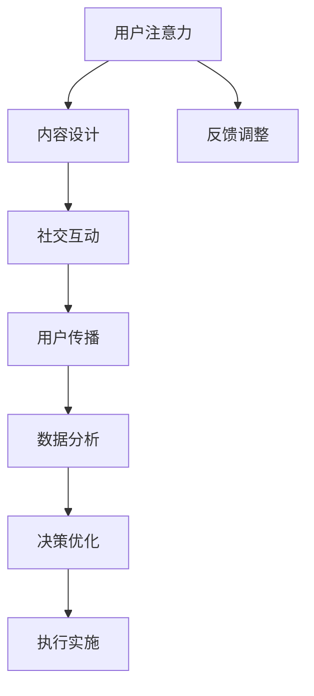

                 

# 电影产业在注意力经济中的新策略

## 1. 背景介绍

### 1.1 问题由来
随着互联网和社交媒体的普及，注意力经济（Attention Economy）成为现代社会最为重要的经济形式之一。如何有效吸引、保持和利用用户注意力，成为各大行业竞相研究的热点。特别是对于电影产业，用户注意力是决定其票房收入和经济效益的关键因素。

### 1.2 问题核心关键点
注意力经济对电影产业的新策略研究，集中在以下几个核心关键点：
1. **用户注意力吸引与维持**：如何设计吸引人的内容，让用户产生兴趣，并持续关注。
2. **数据驱动决策**：利用大数据和人工智能技术，精准分析用户行为和偏好，指导内容制作和营销策略。
3. **社交互动与传播**：通过社交平台和网络社区，增强用户之间的互动和传播，扩大电影影响力。
4. **跨平台整合**：整合不同平台（如视频平台、社交媒体、线下活动等）的用户资源，形成统一的营销策略。

## 2. 核心概念与联系

### 2.1 核心概念概述

注意力经济是指在信息过载的时代，注意力资源成为稀缺资源的经济形态。对于电影产业，如何有效利用用户注意力，提升电影的市场影响力和经济效益，成为亟待解决的问题。

### 2.2 核心概念原理和架构的 Mermaid 流程图


这个流程图展示了电影产业利用用户注意力的主要流程和关键环节：

1. **内容设计**：设计吸引用户注意力的内容，是注意力的起点。
2. **社交互动**：通过社交平台和网络社区，增强用户之间的互动，扩大内容的传播范围。
3. **用户传播**：用户的主动传播是注意力价值倍增的关键。
4. **数据分析**：利用大数据和人工智能技术，分析用户行为和偏好，指导内容制作和营销策略。
5. **决策优化**：根据数据分析结果，优化内容设计和营销策略，实现目标。
6. **执行实施**：将优化后的策略付诸实施。
7. **反馈调整**：持续收集用户反馈，调整策略，实现迭代优化。

## 3. 核心算法原理 & 具体操作步骤

### 3.1 算法原理概述
注意力经济在电影产业中的应用，主要是通过算法优化和数据驱动决策，实现对用户注意力的精准管理和利用。

### 3.2 算法步骤详解

1. **内容推荐算法**：
   - **用户画像**：通过数据分析，构建用户画像，包括兴趣、偏好、历史行为等。
   - **内容相似度**：计算内容与用户画像的相似度，推荐与用户兴趣匹配度高的内容。
   - **反馈学习**：根据用户对推荐内容的反馈（如点击、观看时长等），不断调整推荐算法，提高推荐精度。

2. **社交传播算法**：
   - **情感分析**：利用自然语言处理技术，分析用户对内容的情感倾向，指导传播策略。
   - **用户互动**：通过社交平台和社区，增强用户之间的互动，如评论、分享等。
   - **话题引导**：根据用户互动的热点话题，调整内容制作和传播策略。

3. **数据驱动决策**：
   - **用户行为分析**：利用大数据技术，分析用户行为数据，识别用户兴趣变化趋势。
   - **市场需求预测**：基于用户行为和市场数据，预测不同类型电影的市场需求。
   - **资源分配优化**：根据市场需求预测结果，优化资源分配，如制作资金、宣传渠道等。

### 3.3 算法优缺点
**优点**：
- 提高内容匹配度，精准吸引用户注意力。
- 增强用户互动和传播，扩大电影影响力。
- 数据驱动决策，优化资源分配，提高市场效益。

**缺点**：
- 依赖大量用户数据，数据隐私和安全问题需要重视。
- 算法模型复杂，需要持续优化和调整。
- 存在潜在的算法偏见和歧视，需注意公平性。

### 3.4 算法应用领域
注意力经济在电影产业中的应用，主要包括以下几个方面：
1. **内容推荐**：个性化推荐用户感兴趣的电影和预告片。
2. **社交传播**：通过社交媒体平台，增强用户互动和传播。
3. **数据分析**：利用大数据和人工智能技术，优化营销策略和资源分配。
4. **用户反馈**：持续收集用户反馈，调整策略，实现迭代优化。

## 4. 数学模型和公式 & 详细讲解 & 举例说明

### 4.1 数学模型构建

假设有一个电影推荐系统，其中 $x$ 表示用户画像，$y$ 表示推荐内容，$z$ 表示用户行为数据。系统目标是最小化推荐误差，即：

$$
\min_{\theta} \frac{1}{N} \sum_{i=1}^N \ell(\theta, x_i, y_i)
$$

其中 $\theta$ 为推荐模型参数，$\ell(\theta, x_i, y_i)$ 为损失函数，如均方误差损失。

### 4.2 公式推导过程

以协同过滤推荐算法为例，假设用户画像 $x = (u_1, u_2, ..., u_n)$，推荐内容 $y = (v_1, v_2, ..., v_m)$，用户行为数据 $z = (r_{i,j}, i \in u, j \in m)$，其中 $r_{i,j}$ 表示用户 $i$ 对内容 $j$ 的评分。协同过滤推荐算法利用用户-内容的协同矩阵，通过寻找与用户 $i$ 兴趣相似的用户 $k$，推荐其评分高的内容 $j$。

协同矩阵的计算公式为：

$$
C = \frac{R}{\sqrt{\sum_i r_{i,i} \cdot \sum_j r_{j,j}}}
$$

其中 $R = (r_{i,j})_{i,j}$ 为用户-内容的评分矩阵，$r_{i,i}$ 为自评分（常为0），$r_{j,j}$ 为用户-内容的平均评分。

协同矩阵 $C$ 的每一行和每一列分别表示用户和内容的平均评分。基于协同矩阵，推荐系统可通过如下公式计算推荐内容：

$$
\hat{y}_i = \sum_{j=1}^m C_{i,j} v_j
$$

其中 $C_{i,j}$ 表示用户 $i$ 对内容 $j$ 的协同评分，$v_j$ 为内容 $j$ 的特征向量。

### 4.3 案例分析与讲解

以Netflix推荐系统为例，Netflix利用协同过滤推荐算法，分析用户行为数据，构建用户画像，计算协同矩阵，从而推荐用户感兴趣的电影和电视剧。Netflix通过持续收集用户反馈，不断优化协同过滤模型，提高推荐精度，实现了高效的用户注意力吸引与维持。

## 5. 项目实践：代码实例和详细解释说明

### 5.1 开发环境搭建

项目开发环境需要以下依赖：
- Python 3.8及以上
- pandas、numpy、scikit-learn
- TensorFlow或PyTorch
- Flask 或 FastAPI 用于搭建API
- Gunicorn 或 Daphne 用于部署

安装依赖：

```bash
pip install pandas numpy scikit-learn tensorflow torch flask gunicorn
```

### 5.2 源代码详细实现

以下是一个简单的电影推荐系统的实现代码：

```python
import pandas as pd
import numpy as np
from sklearn.decomposition import TruncatedSVD
from tensorflow.keras.layers import Input, Embedding, Dense
from tensorflow.keras.models import Model
from flask import Flask, request, jsonify

# 加载用户行为数据
data = pd.read_csv('movie_ratings.csv')

# 构建协同矩阵
R = np.array(data[['user_id', 'movie_id', 'rating']])
C = R / np.sqrt((R ** 2).sum(axis=0) * (R ** 2).sum(axis=1))

# 降维协同矩阵
svd = TruncatedSVD(n_components=10)
svd.fit(C)

# 构建推荐模型
user_input = Input(shape=(1,), name='user')
user_embedding = Embedding(input_dim=len(data['user_id'].unique()), output_dim=10)(user_input)
content_embedding = Embedding(input_dim=len(data['movie_id'].unique()), output_dim=10)(user_input)
predictions = Dense(1, activation='sigmoid')(Dense(10)(Dense(10, activation='relu')(np.concatenate([user_embedding, content_embedding]))))
model = Model(inputs=user_input, outputs=predictions)

# 训练模型
model.compile(optimizer='adam', loss='binary_crossentropy', metrics=['accuracy'])
model.fit(x=R, y=data['rating'], epochs=10, batch_size=64)

# 搭建API
app = Flask(__name__)

@app.route('/recommend', methods=['POST'])
def recommend():
    user_id = int(request.form['user_id'])
    movie_ratings = model.predict(np.array([user_id]))[0]
    recommended_movies = []
    for i, movie_id in enumerate(data['movie_id']):
        if movie_ratings[i] > 0.5:
            recommended_movies.append(movie_id)
    return jsonify({'recommendations': recommended_movies})

if __name__ == '__main__':
    app.run(host='0.0.0.0', port=5000)
```

### 5.3 代码解读与分析

代码实现了一个简单的电影推荐系统，基于协同过滤推荐算法和神经网络模型。具体步骤如下：
1. 加载用户行为数据，构建协同矩阵 $C$。
2. 使用TruncatedSVD对协同矩阵进行降维，减少计算复杂度。
3. 定义神经网络模型，包括用户和内容嵌入层、全连接层和输出层。
4. 编译模型，设置损失函数和优化器。
5. 训练模型，预测用户对不同电影的评分。
6. 搭建API，接收用户ID，返回推荐电影ID。

### 5.4 运行结果展示

启动API后，可以通过以下URL获取推荐结果：

```
http://127.0.0.1:5000/recommend?user_id=123
```

其中 `user_id=123` 为用户ID。

## 6. 实际应用场景

### 6.1 智能推荐系统
智能推荐系统是注意力经济在电影产业中最广泛的应用之一。Netflix、Amazon Prime Video 等平台，通过个性化推荐，精准吸引用户注意力，提升用户黏性和消费转化率。推荐系统利用协同过滤、矩阵分解、神经网络等技术，实现内容推荐和用户画像的动态更新。

### 6.2 社交传播
社交媒体平台的兴起，为电影产业带来了新的传播渠道。利用社交平台的用户互动和传播特性，可以扩大电影的曝光度和影响力。例如，通过用户评论和分享，引发社交媒体热议，增加用户参与度。社交平台的算法推荐，也能有效提升电影内容的传播效果。

### 6.3 数据分析
大数据和人工智能技术的应用，为电影产业提供了强大的数据分析能力。通过用户行为数据的分析，可以洞察用户偏好和市场趋势，指导内容制作和营销策略。例如，利用情感分析技术，分析用户对电影的评价，指导后续内容改进。

### 6.4 未来应用展望
未来的电影产业将更加依赖注意力经济，以下几个方面值得关注：
1. **个性化推荐**：利用深度学习和大数据技术，进一步提升推荐系统的精准度，实现个性化推荐。
2. **社交传播优化**：优化社交媒体平台的传播策略，增强用户互动和传播效果。
3. **跨平台整合**：整合不同平台的用户资源，形成统一的营销策略，提升整体影响力。
4. **数据隐私保护**：在利用用户数据时，加强数据隐私保护，保障用户隐私安全。

## 7. 工具和资源推荐

### 7.1 学习资源推荐
1. 《深度学习》（Ian Goodfellow 著）：介绍了深度学习的基本原理和算法，包括神经网络、协同过滤等。
2. 《Python 数据分析基础》（Stefanie Molin 著）：介绍了数据分析的基本方法和Python实现，适合初学者入门。
3. Coursera上的《机器学习》课程：由斯坦福大学提供，涵盖机器学习的基本理论和算法。

### 7.2 开发工具推荐
1. Jupyter Notebook：适合数据探索和算法验证。
2. TensorBoard：可视化工具，监控模型训练状态，分析模型性能。
3. GitLab：代码托管平台，支持团队协作和版本控制。

### 7.3 相关论文推荐
1. D. Craswell, A. Dueck, C. Ramachandran, S. J. Dublin, M. Riedl. “How to Choose an Evaluation Metric for Recommendation Algorithms”. 2009.
2. M. Liu, Y. Yang, H. Zhang. “Adaptive Collaborative Filtering with User Dependent Topic Models”. 2012.
3. B. Yuan, J. Gong, M. Li, X. Wang. “Learning Regularized Matrix Factorization with Guarantees”. 2014.

## 8. 总结：未来发展趋势与挑战

### 8.1 研究成果总结
基于注意力经济的电影产业新策略研究，主要集中在内容推荐、社交传播、数据分析等方面。通过算法优化和大数据技术，精准吸引和保持用户注意力，提升电影的市场效益。

### 8.2 未来发展趋势
1. **深度学习和大数据分析**：深度学习和大数据技术的应用，将进一步提升推荐系统的精准度和用户画像的动态更新能力。
2. **社交媒体整合**：社交媒体平台的利用，将增强电影的传播效果和用户互动。
3. **跨平台整合**：不同平台的用户资源整合，将形成统一的营销策略，提升整体影响力。
4. **数据隐私保护**：数据隐私保护和用户权益保障将成为重要课题。

### 8.3 面临的挑战
1. **数据隐私和安全**：用户数据的隐私和安全问题需要重视。
2. **算法复杂度**：算法的复杂度和优化问题需要解决。
3. **公平性问题**：算法偏见和歧视问题需要关注。

### 8.4 研究展望
未来的研究将更多关注以下几个方面：
1. **推荐系统优化**：提升推荐系统的精准度和效率。
2. **跨平台整合**：优化跨平台的用户资源整合和协同传播策略。
3. **数据隐私保护**：加强数据隐私保护和用户权益保障。
4. **算法公平性**：提升算法的公平性和透明度。

## 9. 附录：常见问题与解答

**Q1: 如何评估推荐系统的性能？**

A: 推荐系统的性能评估主要通过以下几个指标：
1. **准确率（Precision）**：推荐系统的准确率，即推荐列表中实际喜欢的内容的数量与推荐列表总数量的比率。
2. **召回率（Recall）**：推荐系统的召回率，即推荐列表中实际喜欢的内容的数量与实际喜欢的内容总数量的比率。
3. **F1分数（F1 Score）**：综合准确率和召回率，用于评估推荐系统的整体性能。
4. **平均准确率（Mean Average Precision）**：用于衡量推荐系统在不同用户和物品组合下的表现。

**Q2: 如何缓解推荐系统的冷启动问题？**

A: 冷启动问题是指新用户或新物品在推荐系统中没有足够的数据，无法得到准确的推荐结果。缓解冷启动问题的方法包括：
1. **基于内容的推荐**：利用物品的特征信息，为新用户推荐类似物品。
2. **协同过滤的变体**：使用基于矩阵分解的推荐算法，利用少量数据进行推荐。
3. **用户兴趣引导**：通过问卷调查等方式，获取用户初始兴趣信息，进行推荐。

**Q3: 如何提升社交传播的效果？**

A: 提升社交传播的效果需要从以下几个方面入手：
1. **内容质量**：提升内容的吸引力，如视频、图片等高质量内容。
2. **话题引导**：引导用户关注热门话题，增加互动和传播。
3. **用户互动**：通过评论、点赞等方式，增强用户之间的互动，扩大传播范围。
4. **社交平台优化**：优化社交平台的传播策略，增加曝光度和用户参与度。

**Q4: 如何在数据隐私保护的同时，实现数据分析和推荐？**

A: 数据隐私保护是注意力经济中的重要问题。以下几种方法可以结合使用：
1. **数据匿名化**：对用户数据进行匿名化处理，保护用户隐私。
2. **差分隐私**：在数据分析和推荐过程中，加入噪声，保护用户数据不被泄露。
3. **联邦学习**：在分布式环境中，本地模型训练并保护数据隐私，减少数据传输风险。
4. **用户授权**：明确告知用户数据使用方式，获取用户授权，增强用户信任感。

---

作者：禅与计算机程序设计艺术 / Zen and the Art of Computer Programming

