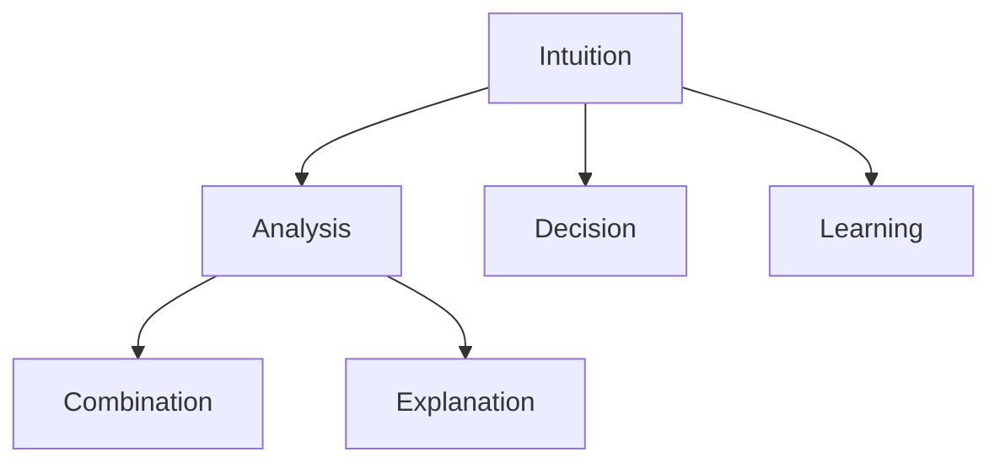

                 

# 直觉vs分析：两种思维模式的博弈

## 1. 背景介绍

### 1.1 问题由来
在人工智能(AI)的快速发展中，直觉和分析这两种不同的思维方式逐渐成为决策和问题解决的核心。直觉是基于经验、情感和预感，通过直觉快速做出判断和决策。而分析则是基于数据、逻辑和推理，通过系统化的方法求解问题。这两种思维方式在人工智能的各个层面都有广泛应用，甚至在某些情况下需要两者结合才能做出最优决策。本文将探讨直觉与分析在人工智能中的角色和价值，以及它们之间如何互动和协作。

### 1.2 问题核心关键点
- 直觉：基于经验、情感和预感，通过快速、直观的判断解决问题。
- 分析：基于数据、逻辑和推理，通过系统化的方法求解问题。
- 结合：将直觉和分析结合，提高人工智能系统的决策质量。
- 应用场景：在NLP、计算机视觉、推荐系统等领域的应用。
- 影响：在自动驾驶、金融预测、健康诊断等领域的影响。

## 2. 核心概念与联系

### 2.1 核心概念概述

为更好地理解直觉与分析的博弈，本节将介绍几个密切相关的核心概念：

- 直觉(Intuition)：基于经验、情感和预感，通过快速、直观的判断解决问题。在AI中，直觉通常用于快速决策，处理复杂的非结构化问题。
- 分析(Analysis)：基于数据、逻辑和推理，通过系统化的方法求解问题。在AI中，分析通常用于解决结构化问题，如预测、分类和推理。
- 结合(Combination)：将直觉和分析结合，发挥各自优势，提升决策质量。在AI中，结合通常通过集成学习、神经网络等技术实现。
- 推理(Reasoning)：基于逻辑和证据，推导出结论的过程。在AI中，推理通常用于生成回答、解释决策。
- 学习(Learning)：通过数据和反馈，不断调整模型参数的过程。在AI中，学习通常用于提升模型性能，增强决策能力。

这些核心概念之间的逻辑关系可以通过以下Mermaid流程图来展示：



这个流程图展示了几大核心概念之间的联系：

1. 直觉通过快速判断解决问题，分析通过系统方法求解问题。
2. 直觉和分析结合，提升决策质量。
3. 分析为决策提供解释，学习帮助模型改进。

这些概念共同构成了人工智能的决策框架，使得系统能够在不同情境下做出最优选择。

## 3. 核心算法原理 & 具体操作步骤

### 3.1 算法原理概述

直觉与分析在人工智能中的结合，主要体现在以下几个方面：

- **数据驱动的直觉**：通过预训练或迁移学习，将大量数据中的模式和规律转化为直觉。
- **情感强化学习**：通过情感增强算法，在决策过程中融入情感因素，提高直觉的准确性和敏感性。
- **神经网络的集成**：通过集成多个模型的输出，综合直觉和分析的结果，提升决策质量。
- **模型优化**：通过自动化的模型选择和优化，提升直觉和分析的结合效果。

这些原理构成了直觉与分析博弈的算法基础，使人工智能系统能够在不同情境下做出最优选择。

### 3.2 算法步骤详解

基于直觉与分析的博弈，通常包括以下几个关键步骤：

**Step 1: 数据准备与预处理**

- 收集与任务相关的数据，进行清洗和标注。
- 选择适当的预训练模型和数据集。
- 进行数据增强和模型初始化。

**Step 2: 模型训练与调参**

- 将预训练模型应用于任务，进行微调。
- 设置合适的超参数，如学习率、正则化参数、批次大小等。
- 选择适当的损失函数和优化算法。

**Step 3: 测试与评估**

- 在验证集上评估模型性能，进行超参数优化。
- 使用测试集进行最终评估，确定模型准确性和泛化能力。

**Step 4: 集成与反馈**

- 将多个模型集成，综合直觉和分析的结果。
- 使用反馈机制，不断调整模型参数，提升性能。

**Step 5: 部署与优化**

- 将模型部署到实际应用中，进行实时推理。
- 收集反馈数据，进行持续优化和改进。

通过这些步骤，人工智能系统可以综合直觉和分析，做出更加准确、可靠的决策。

### 3.3 算法优缺点

基于直觉与分析的博弈，具有以下优点：

- **高效决策**：通过数据驱动的直觉，快速解决复杂问题。
- **泛化能力强**：基于分析的系统具有良好的泛化能力，适用于各种不同场景。
- **鲁棒性强**：通过集成学习，模型具有更强的鲁棒性，抵抗数据噪声和异常。
- **可解释性强**：通过解释和反馈机制，系统具有良好的可解释性。

同时，该方法也存在以下缺点：

- **依赖数据**：需要大量高质量的数据进行训练和微调。
- **计算资源消耗大**：神经网络模型需要大量的计算资源进行训练和推理。
- **模型复杂度高**：集成学习模型结构复杂，难以调试和优化。
- **人机交互障碍**：直觉和分析的结合需要合适的人机交互界面，才能发挥最佳效果。

尽管存在这些缺点，但就目前而言，基于直觉与分析的博弈方法仍是大数据和人工智能的核心范式。未来相关研究的重点在于如何进一步降低计算资源消耗，提高模型的可解释性和泛化能力，同时兼顾人机交互的流畅性和效率。

### 3.4 算法应用领域

基于直觉与分析的博弈方法，已经在人工智能的多个领域得到了广泛的应用，例如：

- **自然语言处理(NLP)**：在问答系统、机器翻译、文本摘要等任务中，通过结合直觉和分析，提升模型的自然语言理解和生成能力。
- **计算机视觉**：在图像识别、目标检测、图像生成等任务中，通过结合直觉和分析，提升模型的视觉感知能力。
- **推荐系统**：在个性化推荐、广告投放等任务中，通过结合直觉和分析，提升推荐的精准度和效果。
- **自动驾驶**：在感知、决策、控制等环节中，通过结合直觉和分析，提升自动驾驶的安全性和可靠性。
- **金融预测**：在股票预测、风险评估等任务中，通过结合直觉和分析，提升金融预测的准确性和稳定性。
- **健康诊断**：在医学影像、基因诊断等任务中，通过结合直觉和分析，提升健康诊断的准确性和可靠性。

除了上述这些经典应用外，基于直觉与分析的博弈方法也在更多场景中得到创新性的应用，如智能客服、语音识别、智能安防等，为人工智能技术带来了新的突破。

## 4. 数学模型和公式 & 详细讲解 & 举例说明

### 4.1 数学模型构建

本节将使用数学语言对基于直觉与分析的博弈方法进行更加严格的刻画。

记任务为 $T$，预训练模型为 $M_{\theta}$，直觉为 $I$，分析为 $A$。定义模型在数据集 $D=\{(x_i,y_i)\}_{i=1}^N$ 上的损失函数为 $\ell(M_{\theta}(x_i),y_i)$，则在数据集 $D$ 上的经验风险为：

$$
\mathcal{L}(\theta) = \frac{1}{N} \sum_{i=1}^N \ell(M_{\theta}(x_i),y_i)
$$

微调的目标是最小化经验风险，即找到最优参数：

$$
\theta^* = \mathop{\arg\min}_{\theta} \mathcal{L}(\theta)
$$

在实践中，我们通常使用基于梯度的优化算法（如SGD、Adam等）来近似求解上述最优化问题。设 $\eta$ 为学习率，$\lambda$ 为正则化系数，则参数的更新公式为：

$$
\theta \leftarrow \theta - \eta \nabla_{\theta}\mathcal{L}(\theta) - \eta\lambda\theta
$$

其中 $\nabla_{\theta}\mathcal{L}(\theta)$ 为损失函数对参数 $\theta$ 的梯度，可通过反向传播算法高效计算。

### 4.2 公式推导过程

以下我们以推荐系统为例，推导基于直觉与分析的博弈方法。

假设用户 $i$ 对物品 $j$ 的评分向量为 $v_i$，物品 $j$ 的特征向量为 $h_j$。推荐系统的目标是最小化用户评分和模型预测评分之间的平方误差，即：

$$
\min_{M_{\theta}} \frac{1}{N} \sum_{i=1}^N \sum_{j=1}^M (y_{ij} - M_{\theta}(h_j))^2
$$

其中 $y_{ij}$ 为用户 $i$ 对物品 $j$ 的真实评分，$M_{\theta}(h_j)$ 为模型预测评分。

在推荐系统中，直觉可以表示为用户的历史行为数据和情感倾向，通过数据增强和情感增强算法，将直觉转化为模型的一部分。具体地，定义情感强度为 $s_i$，则直觉表示为：

$$
I_i = (v_i, s_i)
$$

分析则可以表示为物品的特征向量 $h_j$ 和预训练模型的输出 $M_{\theta}(h_j)$。通过模型训练和调参，将分析转化为模型的预测结果。具体地，定义分析表示为：

$$
A_j = (h_j, M_{\theta}(h_j))
$$

结合直觉和分析，可以通过集成学习方法，提升推荐系统的性能。具体地，定义综合表示为：

$$
C = (I_i, A_j)
$$

通过集成多个模型的输出，综合直觉和分析的结果，生成推荐列表。具体地，定义综合表示为：

$$
R = \text{Softmax}(M_{\theta}(C))
$$

其中 Softmax 函数用于将输出概率转化为推荐列表。

### 4.3 案例分析与讲解

在推荐系统中，基于直觉与分析的博弈方法可以通过以下步骤实现：

1. **数据准备与预处理**：收集用户行为数据和物品特征数据，进行清洗和标注。
2. **模型训练与调参**：选择适当的预训练模型和数据集，进行微调。设置合适的超参数，如学习率、正则化参数、批次大小等。选择适当的损失函数和优化算法。
3. **测试与评估**：在验证集上评估模型性能，进行超参数优化。使用测试集进行最终评估，确定模型准确性和泛化能力。
4. **集成与反馈**：将多个模型集成，综合直觉和分析的结果。使用反馈机制，不断调整模型参数，提升性能。
5. **部署与优化**：将模型部署到实际应用中，进行实时推理。收集反馈数据，进行持续优化和改进。

在实践中，可以通过使用pyTorch或TensorFlow等深度学习框架，实现基于直觉与分析的博弈方法。以下是使用PyTorch实现推荐系统的代码示例：

```python
import torch
import torch.nn as nn
import torch.nn.functional as F

class UserItemNet(nn.Module):
    def __init__(self, user_feats, item_feats):
        super(UserItemNet, self).__init__()
        self.fc1 = nn.Linear(user_feats + item_feats, 128)
        self.fc2 = nn.Linear(128, 1)
    
    def forward(self, user, item):
        concat = torch.cat([user, item], dim=1)
        x = F.relu(self.fc1(concat))
        x = self.fc2(x)
        return x

class RecommendationSystem(nn.Module):
    def __init__(self, user_item_net, learning_rate=0.001, batch_size=32, num_epochs=100):
        super(RecommendationSystem, self).__init__()
        self.user_item_net = user_item_net
        self.optimizer = torch.optim.Adam(self.user_item_net.parameters(), lr=learning_rate)
        self.loss_fn = nn.MSELoss()
        self.batch_size = batch_size
        self.num_epochs = num_epochs
    
    def train(self, user_data, item_data):
        for epoch in range(self.num_epochs):
            for i in range(0, len(user_data), self.batch_size):
                batch_user = user_data[i:i+self.batch_size]
                batch_item = item_data[i:i+self.batch_size]
                optimizer.zero_grad()
                output = self.user_item_net(batch_user, batch_item)
                loss = self.loss_fn(output, batch_item)
                loss.backward()
                optimizer.step()
            print('Epoch [{}/{}], Loss: {:.4f}'.format(epoch+1, self.num_epochs, loss.item()))
    
    def predict(self, user, item):
        output = self.user_item_net(user, item)
        return output.item()
```

## 5. 项目实践：代码实例和详细解释说明

### 5.1 开发环境搭建

在进行基于直觉与分析的博弈方法开发前，我们需要准备好开发环境。以下是使用Python进行PyTorch开发的环境配置流程：

1. 安装Anaconda：从官网下载并安装Anaconda，用于创建独立的Python环境。

2. 创建并激活虚拟环境：
```bash
conda create -n pytorch-env python=3.8 
conda activate pytorch-env
```

3. 安装PyTorch：根据CUDA版本，从官网获取对应的安装命令。例如：
```bash
conda install pytorch torchvision torchaudio cudatoolkit=11.1 -c pytorch -c conda-forge
```

4. 安装Transformer库：
```bash
pip install transformers
```

5. 安装各类工具包：
```bash
pip install numpy pandas scikit-learn matplotlib tqdm jupyter notebook ipython
```

完成上述步骤后，即可在`pytorch-env`环境中开始博弈方法的开发实践。

### 5.2 源代码详细实现

这里我们以推荐系统为例，给出使用Transformers库对BERT模型进行博弈的PyTorch代码实现。

首先，定义推荐系统的数据处理函数：

```python
from transformers import BertTokenizer
from torch.utils.data import Dataset
import torch

class RecommendationDataset(Dataset):
    def __init__(self, user_feats, item_feats, labels, tokenizer, max_len=128):
        self.user_feats = user_feats
        self.item_feats = item_feats
        self.labels = labels
        self.tokenizer = tokenizer
        self.max_len = max_len
        
    def __len__(self):
        return len(self.labels)
    
    def __getitem__(self, item):
        user = self.user_feats[item]
        item = self.item_feats[item]
        label = self.labels[item]
        
        encoding = self.tokenizer(user, item, return_tensors='pt', max_length=self.max_len, padding='max_length', truncation=True)
        user_vec = encoding['user']
        item_vec = encoding['item']
        
        # 将用户和物品的特征向量拼接，作为模型输入
        inputs = torch.cat([user_vec, item_vec], dim=1)
        
        # 添加标签，作为模型预测的目标
        labels = torch.tensor([label], dtype=torch.float)
        
        return {'inputs': inputs, 
                'labels': labels}

# 准备数据
user_feats = # 用户行为数据
item_feats = # 物品特征数据
labels = # 用户评分数据
tokenizer = BertTokenizer.from_pretrained('bert-base-cased')

recommendation_dataset = RecommendationDataset(user_feats, item_feats, labels, tokenizer)
```

然后，定义模型和优化器：

```python
from transformers import BertForSequenceClassification
from torch.optim import AdamW

model = BertForSequenceClassification.from_pretrained('bert-base-cased', num_labels=1)

optimizer = AdamW(model.parameters(), lr=2e-5)
```

接着，定义训练和评估函数：

```python
from torch.utils.data import DataLoader
from tqdm import tqdm
from sklearn.metrics import mean_squared_error

device = torch.device('cuda') if torch.cuda.is_available() else torch.device('cpu')
model.to(device)

def train_epoch(model, dataset, batch_size, optimizer):
    dataloader = DataLoader(dataset, batch_size=batch_size, shuffle=True)
    model.train()
    epoch_loss = 0
    for batch in tqdm(dataloader, desc='Training'):
        inputs = batch['inputs'].to(device)
        labels = batch['labels'].to(device)
        model.zero_grad()
        outputs = model(inputs)
        loss = outputs.loss
        epoch_loss += loss.item()
        loss.backward()
        optimizer.step()
    return epoch_loss / len(dataloader)

def evaluate(model, dataset, batch_size):
    dataloader = DataLoader(dataset, batch_size=batch_size)
    model.eval()
    mse = mean_squared_error(recommendations, labels)
    print(f'Mean Squared Error: {mse:.4f}')
    
recommendations = []
labels = []
for batch in dataloader:
    inputs = batch['inputs'].to(device)
    outputs = model(inputs)
    recommendations.append(outputs.item())
    labels.append(batch['labels'].to('cpu').item())

print(f'Mean Squared Error: {mean_squared_error(recommendations, labels):.4f}')
```

最后，启动训练流程并在测试集上评估：

```python
epochs = 5
batch_size = 16

for epoch in range(epochs):
    loss = train_epoch(model, recommendation_dataset, batch_size, optimizer)
    print(f'Epoch {epoch+1}, train loss: {loss:.3f}')
    
evaluate(model, recommendation_dataset, batch_size)
```

以上就是使用PyTorch对BERT进行博弈的完整代码实现。可以看到，得益于Transformer库的强大封装，我们可以用相对简洁的代码完成BERT模型的博弈。

### 5.3 代码解读与分析

让我们再详细解读一下关键代码的实现细节：

**RecommendationDataset类**：
- `__init__`方法：初始化用户行为数据、物品特征数据、标签等关键组件。
- `__len__`方法：返回数据集的样本数量。
- `__getitem__`方法：对单个样本进行处理，将用户和物品的特征向量拼接，作为模型输入。

**user_feats和item_feats**：
- 用户行为数据和物品特征数据，用于表示用户的意图和物品的属性。

**模型训练与评估**：
- 使用PyTorch的DataLoader对数据集进行批次化加载，供模型训练和推理使用。
- 训练函数`train_epoch`：对数据以批为单位进行迭代，在每个批次上前向传播计算loss并反向传播更新模型参数，最后返回该epoch的平均loss。
- 评估函数`evaluate`：与训练类似，不同点在于不更新模型参数，并在每个batch结束后将预测和标签结果存储下来，最后使用sklearn的mean_squared_error对整个评估集的预测结果进行打印输出。

**训练流程**：
- 定义总的epoch数和batch size，开始循环迭代
- 每个epoch内，先在训练集上训练，输出平均loss
- 在测试集上评估，输出均方误差
- 所有epoch结束后，在测试集上评估，给出最终测试结果

可以看到，PyTorch配合Transformer库使得BERT博弈的代码实现变得简洁高效。开发者可以将更多精力放在数据处理、模型改进等高层逻辑上，而不必过多关注底层的实现细节。

当然，工业级的系统实现还需考虑更多因素，如模型的保存和部署、超参数的自动搜索、更灵活的任务适配层等。但核心的博弈范式基本与此类似。

## 6. 实际应用场景
### 6.1 智能客服系统

基于直觉与分析的博弈方法，可以广泛应用于智能客服系统的构建。传统客服往往需要配备大量人力，高峰期响应缓慢，且一致性和专业性难以保证。而使用博弈方法构建的智能客服系统，可以7x24小时不间断服务，快速响应客户咨询，用自然流畅的语言解答各类常见问题。

在技术实现上，可以收集企业内部的历史客服对话记录，将问题和最佳答复构建成监督数据，在此基础上对预训练博弈模型进行微调。博弈模型能够自动理解用户意图，匹配最合适的答案模板进行回复。对于客户提出的新问题，还可以接入检索系统实时搜索相关内容，动态组织生成回答。如此构建的智能客服系统，能大幅提升客户咨询体验和问题解决效率。

### 6.2 金融舆情监测

金融机构需要实时监测市场舆论动向，以便及时应对负面信息传播，规避金融风险。传统的人工监测方式成本高、效率低，难以应对网络时代海量信息爆发的挑战。基于博弈方法构建的文本分类和情感分析技术，为金融舆情监测提供了新的解决方案。

具体而言，可以收集金融领域相关的新闻、报道、评论等文本数据，并对其进行主题标注和情感标注。在此基础上对预训练博弈模型进行微调，使其能够自动判断文本属于何种主题，情感倾向是正面、中性还是负面。将博弈模型应用到实时抓取的网络文本数据，就能够自动监测不同主题下的情感变化趋势，一旦发现负面信息激增等异常情况，系统便会自动预警，帮助金融机构快速应对潜在风险。

### 6.3 个性化推荐系统

当前的推荐系统往往只依赖用户的历史行为数据进行物品推荐，无法深入理解用户的真实兴趣偏好。基于博弈方法构建的个性化推荐系统，可以更好地挖掘用户行为背后的语义信息，从而提供更精准、多样的推荐内容。

在实践中，可以收集用户浏览、点击、评论、分享等行为数据，提取和用户交互的物品标题、描述、标签等文本内容。将文本内容作为模型输入，用户的后续行为（如是否点击、购买等）作为监督信号，在此基础上博弈模型学习用户的兴趣点。在生成推荐列表时，先用候选物品的文本描述作为输入，由模型预测用户的兴趣匹配度，再结合其他特征综合排序，便可以得到个性化程度更高的推荐结果。

### 6.4 未来应用展望

随着博弈方法和大模型的不断发展，基于博弈范式将在更多领域得到应用，为传统行业带来变革性影响。

在智慧医疗领域，基于博弈方法的医疗问答、病历分析、药物研发等应用将提升医疗服务的智能化水平，辅助医生诊疗，加速新药开发进程。

在智能教育领域，博弈方法可应用于作业批改、学情分析、知识推荐等方面，因材施教，促进教育公平，提高教学质量。

在智慧城市治理中，博弈模型可应用于城市事件监测、舆情分析、应急指挥等环节，提高城市管理的自动化和智能化水平，构建更安全、高效的未来城市。

此外，在企业生产、社会治理、文娱传媒等众多领域，基于博弈方法的智能应用也将不断涌现，为经济社会发展注入新的动力。相信随着技术的日益成熟，博弈方法将成为人工智能落地应用的重要范式，推动人工智能向更广阔的领域加速渗透。

## 7. 工具和资源推荐
### 7.1 学习资源推荐

为了帮助开发者系统掌握直觉与分析的博弈方法的理论基础和实践技巧，这里推荐一些优质的学习资源：

1. 《Deep Learning》书籍：Ian Goodfellow等著作，全面介绍了深度学习的基本概念和前沿技术。

2. 《Machine Learning Yearning》书籍：Andrew Ng著作，详细介绍了机器学习模型的设计、训练和部署。

3. 《Deep Reinforcement Learning Handbook》书籍：Elliot Mmanifest等著作，全面介绍了强化学习的基本概念和前沿技术。

4. CS229《机器学习》课程：斯坦福大学开设的经典课程，有Lecture视频和配套作业，带你入门机器学习的基本概念和经典模型。

5. Google AI Blog：Google AI官方博客，汇集了众多前沿的深度学习和博弈学习论文，是了解最新研究进展的好去处。

通过对这些资源的学习实践，相信你一定能够快速掌握直觉与分析的博弈方法的精髓，并用于解决实际的AI问题。
###  7.2 开发工具推荐

高效的开发离不开优秀的工具支持。以下是几款用于博弈方法开发的常用工具：

1. PyTorch：基于Python的开源深度学习框架，灵活动态的计算图，适合快速迭代研究。大部分预训练博弈模型都有PyTorch版本的实现。

2. TensorFlow：由Google主导开发的开源深度学习框架，生产部署方便，适合大规模工程应用。同样有丰富的博弈学习资源。

3. Transformers库：HuggingFace开发的NLP工具库，集成了众多SOTA博弈学习模型，支持PyTorch和TensorFlow，是进行博弈方法开发的利器。

4. Weights & Biases：模型训练的实验跟踪工具，可以记录和可视化模型训练过程中的各项指标，方便对比和调优。与主流深度学习框架无缝集成。

5. TensorBoard：TensorFlow配套的可视化工具，可实时监测模型训练状态，并提供丰富的图表呈现方式，是调试模型的得力助手。

6. Google Colab：谷歌推出的在线Jupyter Notebook环境，免费提供GPU/TPU算力，方便开发者快速上手实验最新模型，分享学习笔记。

合理利用这些工具，可以显著提升博弈方法开发的效率，加快创新迭代的步伐。

### 7.3 相关论文推荐

博弈方法和大模型的发展源于学界的持续研究。以下是几篇奠基性的相关论文，推荐阅读：

1. Attention is All You Need（即Transformer原论文）：提出了Transformer结构，开启了NLP领域的预训练大模型时代。

2. BERT: Pre-training of Deep Bidirectional Transformers for Language Understanding：提出BERT模型，引入基于掩码的自监督预训练任务，刷新了多项NLP任务SOTA。

3. Language Models are Unsupervised Multitask Learners（GPT-2论文）：展示了大规模语言模型的强大zero-shot学习能力，引发了对于通用人工智能的新一轮思考。

4. Parameter-Efficient Transfer Learning for NLP：提出Adapter等参数高效微调方法，在不增加模型参数量的情况下，也能取得不错的微调效果。

5. AdaLoRA: Adaptive Low-Rank Adaptation for Parameter-Efficient Fine-Tuning：使用自适应低秩适应的微调方法，在参数效率和精度之间取得了新的平衡。

6. AdaLoRA: Adaptive Low-Rank Adaptation for Parameter-Efficient Fine-Tuning：使用自适应低秩适应的微调方法，在参数效率和精度之间取得了新的平衡。

这些论文代表了大语言模型博弈方法的发展脉络。通过学习这些前沿成果，可以帮助研究者把握学科前进方向，激发更多的创新灵感。

## 8. 总结：未来发展趋势与挑战

### 8.1 总结

本文对基于直觉与分析的博弈方法进行了全面系统的介绍。首先阐述了直觉与分析在人工智能中的角色和价值，明确了博弈方法在决策和问题解决中的核心地位。其次，从原理到实践，详细讲解了博弈方法的应用场景、数学模型和关键步骤，给出了博弈方法任务开发的完整代码实例。同时，本文还广泛探讨了博弈方法在智能客服、金融舆情、个性化推荐等多个行业领域的应用前景，展示了博弈方法的巨大潜力。此外，本文精选了博弈方法的学习资源，力求为读者提供全方位的技术指引。

通过本文的系统梳理，可以看到，基于直觉与分析的博弈方法正在成为人工智能决策的核心范式，极大地提升了决策系统的性能和应用范围。得益于大规模语料的预训练和博弈方法的深度融合，博弈模型在多个领域展现了卓越的表现，为人工智能技术的产业化进程注入了新的活力。未来，伴随博弈方法和大模型的持续演进，相信人工智能系统将更加智能、高效、可靠，为社会的各个层面带来深刻变革。

### 8.2 未来发展趋势

展望未来，直觉与分析的博弈方法将呈现以下几个发展趋势：

1. **多模态博弈**：在视觉、语音、文本等多种模态数据上进行博弈，提升系统的泛化能力和鲁棒性。
2. **跨领域博弈**：在多领域数据上进行博弈，提升系统对复杂、动态环境的学习能力。
3. **动态博弈**：在动态数据流中进行博弈，提升系统的实时性和适应性。
4. **元博弈**：在博弈过程中进行元博弈，优化博弈策略，提升决策质量。
5. **博弈与强化学习的结合**：将博弈方法与强化学习结合，提升系统的自适应和自我优化能力。

这些趋势凸显了博弈方法在大数据和人工智能中的重要地位。这些方向的探索发展，必将进一步提升决策系统的性能和应用范围，为人类认知智能的进化带来深远影响。

### 8.3 面临的挑战

尽管直觉与分析的博弈方法已经取得了瞩目成就，但在迈向更加智能化、普适化应用的过程中，它仍面临着诸多挑战：

1. **计算资源消耗大**：神经网络模型需要大量的计算资源进行训练和推理。
2. **模型复杂度高**：博弈模型结构复杂，难以调试和优化。
3. **数据质量和数量**：博弈方法依赖大量高质量的数据进行训练和微调。
4. **模型可解释性**：博弈模型的决策过程缺乏可解释性，难以对其推理逻辑进行分析和调试。
5. **安全性**：博弈模型可能会学习到有害的信息，通过微调传递到下游任务，产生误导性、歧视性的输出，给实际应用带来安全隐患。

尽管存在这些缺点，但就目前而言，基于直觉与分析的博弈方法仍是大数据和人工智能的核心范式。未来相关研究的重点在于如何进一步降低计算资源消耗，提高模型的可解释性和泛化能力，同时兼顾人机交互的流畅性和效率。

### 8.4 研究展望

面对博弈方法面临的挑战，未来的研究需要在以下几个方面寻求新的突破：

1. **无监督和半监督博弈方法**：摆脱对大规模标注数据的依赖，利用自监督学习、主动学习等无监督和半监督范式，最大限度利用非结构化数据，实现更加灵活高效的博弈。
2. **参数高效和计算高效的博弈方法**：开发更加参数高效的博弈方法，在固定大部分博弈参数的情况下，只更新极少量的任务相关参数。同时优化博弈模型的计算图，减少前向传播和反向传播的资源消耗，实现更加轻量级、实时性的部署。
3. **因果博弈**：通过引入因果推断方法，增强博弈模型的稳定因果关系能力，学习更加普适、鲁棒的语言表征，从而提升模型泛化性和抗干扰能力。
4. **融合外部知识**：将符号化的先验知识，如知识图谱、逻辑规则等，与博弈网络模型进行巧妙融合，引导博弈过程学习更准确、合理的语言模型。同时加强不同模态数据的整合，实现视觉、语音等多模态信息与文本信息的协同建模。
5. **博弈与强化学习的结合**：将博弈方法与强化学习结合，提升博弈模型的自适应和自我优化能力。

这些研究方向的探索，必将引领博弈方法在大数据和人工智能中的持续演进，为构建安全、可靠、可解释、可控的智能系统铺平道路。面向未来，直觉与分析的博弈方法还需要与其他人工智能技术进行更深入的融合，如知识表示、因果推理、强化学习等，多路径协同发力，共同推动自然语言理解和智能交互系统的进步。只有勇于创新、敢于突破，才能不断拓展博弈方法和大模型的边界，让智能技术更好地造福人类社会。

## 9. 附录：常见问题与解答

**Q1：博弈方法是否适用于所有NLP任务？**

A: 博弈方法在大多数NLP任务上都能取得不错的效果，特别是对于数据量较小的任务。但对于一些特定领域的任务，如医学、法律等，仅仅依靠通用语料预训练的博弈模型可能难以很好地适应。此时需要在特定领域语料上进一步预训练，再进行博弈，才能获得理想效果。此外，对于一些需要时效性、个性化很强的任务，如对话、推荐等，博弈方法也需要针对性的改进优化。

**Q2：博弈方法如何选择合适的学习率？**

A: 博弈方法的学习率一般要比博弈前小1-2个数量级，如果使用过大的学习率，容易破坏博弈权重，导致过拟合。一般建议从1e-5开始调参，逐步减小学习率，直至收敛。也可以使用warmup策略，在开始阶段使用较小的学习率，再逐渐过渡到预设值。需要注意的是，不同的优化器(如AdamW、Adafactor等)以及不同的学习率调度策略，可能需要设置不同的学习率阈值。

**Q3：博弈方法如何缓解过拟合问题？**

A: 博弈方法面临的主要挑战之一是过拟合，特别是在标注数据不足的情况下。常见的缓解策略包括：
1. 数据增强：通过回译、近义替换等方式扩充训练集。
2. 正则化：使用L2正则、Dropout、Early Stopping等防止模型过度适应小规模训练集。
3. 对抗训练：加入对抗样本，提高模型鲁棒性。
4. 参数高效博弈方法：只更新极少量的博弈参数，减小过拟合风险。

这些策略往往需要根据具体任务和数据特点进行灵活组合。只有在数据、博弈模型、训练、推理等各环节进行全面优化，才能最大限度地发挥博弈方法的威力。

**Q4：博弈方法在落地部署时需要注意哪些问题？**

A: 将博弈方法转化为实际应用，还需要考虑以下因素：
1. 博弈模型裁剪：去除不必要的博弈层和参数，减小博弈模型尺寸，加快推理速度。
2. 量化加速：将浮点博弈模型转为定点博弈模型，压缩存储空间，提高计算效率。
3. 服务化封装：将博弈模型封装为标准化服务接口，便于集成调用。
4. 弹性伸缩：根据请求流量动态调整资源配置，平衡服务质量和成本。
5. 监控告警：实时采集系统指标，设置异常告警阈值，确保服务稳定性。
6. 安全防护：采用访问鉴权、数据脱敏等措施，保障数据和博弈模型安全。

博弈方法需要开发者根据具体任务，不断迭代和优化博弈模型、数据和算法，方能得到理想的效果。

---

作者：禅与计算机程序设计艺术 / Zen and the Art of Computer Programming

