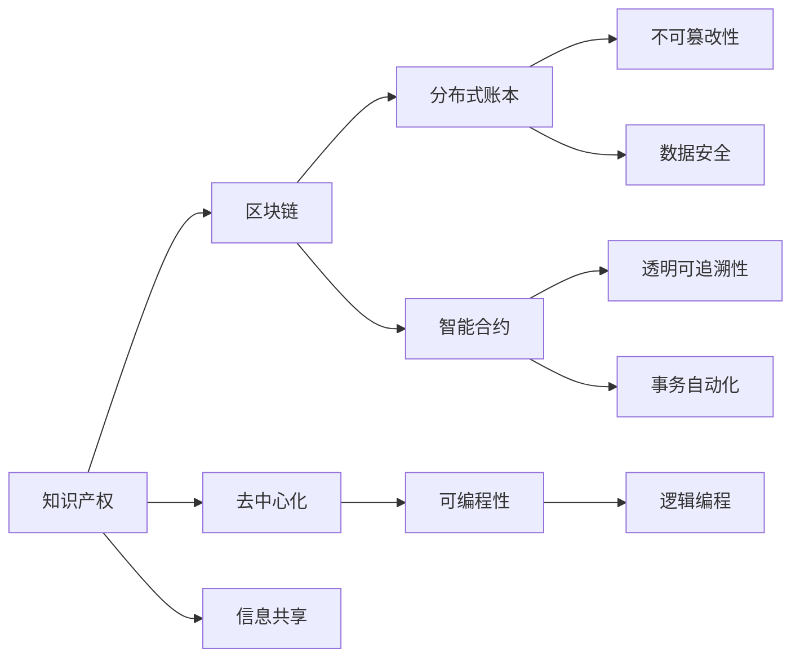

                 

# 知识产权与区块链技术的结合

## 1. 背景介绍

知识产权(IPR)是指创作者对其智力劳动成果所享有的专有权利，包括专利、版权、商标、商业秘密等。在知识经济时代，知识产权保护成为驱动创新和产业发展的关键因素。然而，现有的知识产权管理与保护体系面临着诸多挑战：

- 数据分散，信息孤岛：众多企业和机构拥有大量分散的知识产权信息，难以高效集成和共享。
- 证据确凿，篡改难以追踪：传统纸质文档和链外存储的数据容易被篡改，导致证据效力难以验证。
- 过程透明，参与方责任不清：知识产权交易、授权等过程复杂，各方责任难以明确。
- 维权成本高，周期长：侵权事件频繁发生，维权成本高昂，耗时长。

近年来，区块链技术作为一种去中心化的分布式账本技术，因其不可篡改、透明可追溯的特点，开始被引入知识产权管理与保护领域。本文将详细探讨如何利用区块链技术解决知识产权管理与保护中的痛点，推动知识产权领域的信息化、智能化和数字化转型。

## 2. 核心概念与联系

### 2.1 核心概念概述

为更好地理解知识产权与区块链技术的结合，本节将介绍几个关键概念：

- 区块链(Blockchain)：一种分布式数据库技术，通过去中心化的网络节点共识机制，实现数据的安全存储和透明可追溯。
- 智能合约(Smart Contract)：区块链上的可执行代码，用于自动化管理知识产权相关事务，如版权登记、授权、交易等。
- 分布式账本(Distributed Ledger)：区块链的底层账本结构，实现去中心化的数据记录与共享。
- 不可篡改性(Immutability)：区块链数据的不可篡改特性，确保知识产权证据的真实性。
- 透明可追溯性(Transparency and Traceability)：区块链的透明性和可追溯性，便于知识产权的监管和追踪。
- 去中心化(Decentralization)：区块链的分布式网络结构，去除了中心化机构的干预，提升知识产权管理的透明度和公正性。
- 可编程性(Programmability)：通过智能合约实现复杂的知识产权事务逻辑，提升自动化管理效率。

这些核心概念通过区块链技术的组合和应用，可以实现知识产权的全程数字化管理，保障信息安全，降低维权成本，提高交易效率。

### 2.2 核心概念原理和架构的 Mermaid 流程图



这个流程图展示了知识产权与区块链技术之间的逻辑关系：

1. 知识产权通过区块链技术实现数字化管理。
2. 分布式账本提供安全的数据记录和存储。
3. 智能合约实现自动化的知识产权事务管理。
4. 不可篡改性和透明可追溯性确保数据真实性。
5. 去中心化提升管理透明度和公正性。
6. 可编程性提供灵活的事务逻辑处理能力。

这些概念和技术结合，形成了完整的区块链在知识产权管理中的应用框架。

## 3. 核心算法原理 & 具体操作步骤
### 3.1 算法原理概述

基于区块链技术的知识产权管理与保护系统，主要利用了区块链的不可篡改性、透明可追溯性和去中心化特性。其核心算法原理包括：

1. 分布式账本(Distributed Ledger)：记录知识产权信息的分布式账本，每个节点都有完整的账本副本，确保数据的透明性和不可篡改性。
2. 智能合约(Smart Contract)：自动执行、无需信任的管理知识产权相关事务的自动化合约，实现自动化的合同签订、审核、授权等。
3. 共识算法(Consensus Algorithm)：保证分布式账本的一致性和正确性，防止单点故障和篡改攻击。

### 3.2 算法步骤详解

以下介绍基于区块链技术的知识产权管理与保护系统的详细步骤：

**Step 1: 系统搭建与配置**
- 选择适合的区块链平台，如Ethereum、Hyperledger Fabric等，搭建区块链网络。
- 配置智能合约开发环境，如Truffle、Remix等，编写和部署智能合约代码。

**Step 2: 数字身份与认证**
- 为参与方创建区块链账户，并使用公钥私钥对方式进行身份认证。
- 实现数字签名功能，确保交易的不可抵赖性。

**Step 3: 知识产权登记**
- 将知识产权信息上传区块链，通过智能合约验证信息的有效性。
- 将验证通过的信息记录在分布式账本中，确保其不可篡改性和透明可追溯性。

**Step 4: 知识产权授权与使用**
- 使用智能合约管理知识产权的授权与使用，记录授权记录和合同条款。
- 实现自动化的授权审批流程，提升效率和透明度。

**Step 5: 知识产权交易与流转**
- 实现去中心化的知识产权交易市场，各方通过智能合约自动完成交易。
- 使用分布式账本记录交易记录，防止篡改和纠纷。

**Step 6: 知识产权监测与维权**
- 实时监控区块链上的知识产权信息，发现侵权行为及时预警。
- 收集侵权证据，通过智能合约自动提起诉讼或仲裁。

### 3.3 算法优缺点

基于区块链技术的知识产权管理与保护系统有以下优点：

1. 透明可追溯：分布式账本提供所有交易记录的透明和可追溯性，确保知识产权信息公开透明。
2. 去中心化：去除了中心化机构，提升了知识产权管理的公正性和透明度。
3. 不可篡改：区块链的不可篡改特性确保了知识产权证据的真实性和完整性。
4. 自动化效率：智能合约实现了自动化的知识产权事务管理，提升了效率和准确性。
5. 低成本维护：区块链降低了维护成本，降低了侵权风险。

同时，该系统也存在以下缺点：

1. 计算资源消耗：区块链的共识算法和智能合约执行需要大量的计算资源，影响系统性能。
2. 扩展性问题：大规模部署可能面临扩展性问题，网络延迟和同步问题需要解决。
3. 技术门槛高：区块链技术和智能合约的开发需要一定的技术门槛，难以快速普及。
4. 法律法规滞后：现有法律法规尚未完全适应区块链技术，需要进一步规范。

### 3.4 算法应用领域

基于区块链技术的知识产权管理与保护系统，已经在多个领域得到应用，例如：

- 版权登记：利用区块链记录原创作品的版权信息，实现版权的自动登记和保护。
- 专利申请：通过区块链提交专利申请，实现自动化审核和记录。
- 商标管理：利用区块链记录商标信息，实现自动化的商标登记和授权。
- 知识产权交易：实现去中心化的知识产权交易平台，提升交易效率和透明度。
- 数字内容授权：通过智能合约实现数字内容的自动授权和付费，减少侵权风险。

这些应用场景展示了区块链技术在知识产权管理与保护中的广泛应用潜力。未来，随着技术的不断发展和普及，区块链将进一步深入到知识产权的各个环节，带来更多创新应用。

## 4. 数学模型和公式 & 详细讲解 & 举例说明
### 4.1 数学模型构建

在本节中，我们将构建一个简单的数学模型，用于描述基于区块链的知识产权管理与保护系统。

假设有一个包含n个知识产权信息的数据集，每个信息包含id、名称、所有者、授权信息等属性。使用区块链分布式账本来记录这些信息，使用智能合约来管理这些信息的授权和使用。

数学模型定义如下：

- 知识产权信息集合：$D=\{d_1, d_2, ..., d_n\}$，其中$d_i=(\text{id}, \text{name}, \text{owner}, \text{license}, \text{useRight})$。
- 智能合约：$C=\{c_1, c_2, ..., c_m\}$，其中$c_j=(\text{logic}, \text{condition}, \text{execute}, \text{trigger})$。
- 区块链账本：$B=\{b_1, b_2, ..., b_n\}$，其中$b_i=\{d_i, c_j\}$。

### 4.2 公式推导过程

1. 知识产权信息上传：
   - 上传操作：$d_i \rightarrow B$。
   - 验证操作：验证$d_i$的合法性，验证通过则更新账本。
   - 智能合约触发：$c_j$的触发条件满足，执行智能合约操作。
   
2. 授权与使用：
   - 授权操作：$\text{license}_i \rightarrow C$，执行智能合约进行授权记录。
   - 使用操作：$\text{useRight}_i \rightarrow C$，执行智能合约进行使用记录。
   
3. 交易与流转：
   - 交易操作：$\text{transfer}_i \rightarrow C$，执行智能合约进行交易记录。
   - 合约执行：验证交易合法性，记录交易结果。
   
### 4.3 案例分析与讲解

假设有一个音乐版权信息$d=(1, "Song A", "Artist 1", "OBLA", "Public Use")$，需要将其上传并记录到区块链上。

**上传操作**：
1. $d \rightarrow B$，验证$d$的合法性。
2. $d$的验证通过，更新账本。
3. $c_j$的触发条件满足，执行智能合约操作。

**授权操作**：
1. $\text{license} \rightarrow C$，执行智能合约进行授权记录。

**使用操作**：
1. $\text{useRight} \rightarrow C$，执行智能合约进行使用记录。

**交易操作**：
1. $\text{transfer} \rightarrow C$，执行智能合约进行交易记录。

**合约执行**：
1. 验证交易合法性，记录交易结果。

## 5. 项目实践：代码实例和详细解释说明
### 5.1 开发环境搭建

进行基于区块链技术的知识产权管理与保护系统开发时，需要搭建合适的开发环境。以下是使用Python进行Hyperledger Fabric开发的环境配置流程：

1. 安装Hyperledger Fabric：从官网下载并安装Hyperledger Fabric，按照官方文档配置网络。

2. 搭建Fabric网络：使用Composer进行网络搭建，包括节点、通道、用户等组件的创建和配置。

3. 编写智能合约：使用Composer IDE编写智能合约代码，并编译生成可执行合约。

4. 测试智能合约：在Fabric网络上部署测试智能合约，进行功能验证。

### 5.2 源代码详细实现

下面以专利申请管理为例，给出使用Hyperledger Fabric对智能合约进行开发的PyTorch代码实现。

首先，定义智能合约的业务逻辑和数据模型：

```python
from hyperledger_fabric import Contract
from hyperledger_fabric.shim import SHIM Milestone

class PatentContract(Contract):
    def __init__(self):
        super().__init__()
    
    def init(self, stub):
        args = stub.getArgs()
        patent_id = args[0]
        patent_title = args[1]
        patent_holder = args[2]
        patent_description = args[3]
        patent_status = args[4]
        patent_priorities = args[5]
        patent_date = args[6]
        
        self._set_state(patent_id, patent_title, patent_holder, patent_description, patent_status, patent_priorities, patent_date)
    
    def _set_state(self, patent_id, patent_title, patent_holder, patent_description, patent_status, patent_priorities, patent_date):
        self.patent_state[patent_id] = {
            'title': patent_title,
            'holder': patent_holder,
            'description': patent_description,
            'status': patent_status,
            'priorities': patent_priorities,
            'date': patent_date
        }
    
    def get_patent(self, stub):
        patent_id = stub.getFunction('getPatent')
        patent_state = self._get_state(patent_id)
        return patent_state
    
    def set_patent(self, stub):
        patent_id = stub.getFunction('setPatent')
        title = stub.getStringArg(0)
        holder = stub.getStringArg(1)
        description = stub.getStringArg(2)
        status = stub.getStringArg(3)
        priorities = stub.getStringArg(4)
        date = stub.getStringArg(5)
        
        self._set_state(patent_id, title, holder, description, status, priorities, date)
    
    def set_status(self, stub):
        patent_id = stub.getStringArg(0)
        status = stub.getStringArg(1)
        self._update_state(patent_id, 'status', status)
    
    def update_priorities(self, stub):
        patent_id = stub.getStringArg(0)
        priorities = stub.getStringArg(1)
        self._update_state(patent_id, 'priorities', priorities)
    
    def transfer_patent(self, stub):
        patent_id = stub.getStringArg(0)
        holder = stub.getStringArg(1)
        self._update_state(patent_id, 'holder', holder)
    
    def _update_state(self, patent_id, key, value):
        if patent_id in self.patent_state:
            self.patent_state[patent_id][key] = value
        else:
            raise Milestone('Invalid patent ID')
    
    def _get_state(self, patent_id):
        if patent_id in self.patent_state:
            return self.patent_state[patent_id]
        else:
            raise Milestone('Invalid patent ID')
```

然后，定义智能合约的链码和链码配置文件：

```python
# 链码配置文件
{
    "Version": "1.0",
    "EndorsementPolicy": {
        "Name": "Majority",
        "Identities": ["Alice", "Bob", "Charlie"]
    },
    "Application": {
        "Chaincode": "myPatentContract",
        "Version": "1.0"
    },
    "Parameters": {
        "orgs": ["CompanyA", "CompanyB"]
    },
    "Peer": ["peer0.org1.com", "peer1.org1.com"]
}
```

最后，启动智能合约并验证其功能：

```python
from hyperledger_fabric.shim.shim import SHIM
from hyperledger_fabric.shim.signature import Signature
from hyperledger_fabric.shim.signature import CredentialProvider
from hyperledger_fabric.shim.ledger import ledger

# 初始化智能合约
con = PatentContract()

# 向区块链上提交初始化事务
tx = "init"

# 生成交易签名
sig = con.sign(tx)
response = ledger.executor.submit_transaction('CompanyA', tx, sig, CredentialProvider())

# 查询专利信息
response = ledger.executor.query('CompanyA', "getPatent", "1001")

# 更新专利信息
response = ledger.executor.submit_transaction('CompanyA', "setPatent", "1001", "New Patent Title", "CompanyA", "New Patent Description", "New Patent Status", "New Patent Priorities", "New Patent Date")
```

以上就是使用Hyperledger Fabric对智能合约进行开发的完整代码实现。可以看到，Hyperledger Fabric的智能合约开发与Python语言的结合，使得智能合约的编写和部署变得非常简单。

### 5.3 代码解读与分析

让我们再详细解读一下关键代码的实现细节：

**PatentContract类**：
- `__init__`方法：初始化智能合约对象，调用`_set_state`方法设置初始专利信息。
- `_set_state`方法：根据传入的参数，将专利信息存储在状态变量中。
- `get_patent`方法：根据专利ID查询专利信息。
- `set_patent`方法：根据传入的参数，设置专利信息。
- `set_status`方法：根据专利ID更新专利状态。
- `update_priorities`方法：根据专利ID更新专利优先级。
- `transfer_patent`方法：根据专利ID更新专利持有者。

**链码配置文件**：
- 定义了链码版本、背书策略、应用和链码名称等关键配置项。
- 配置了组织名称和节点列表，用于验证智能合约签名。

**链码执行流程**：
- 使用`submit_transaction`方法提交事务，生成签名后提交。
- 使用`query`方法查询专利信息，返回查询结果。
- 使用`submit_transaction`方法更新专利信息，提交事务并更新状态变量。

可以看到，Hyperledger Fabric的智能合约开发流程相对简单，通过Python语言和Composer IDE的结合，可以轻松实现智能合约的编写、验证和部署。

当然，工业级的系统实现还需考虑更多因素，如多组织协作、跨链交互等复杂场景。但核心的智能合约开发流程基本与此类似。

## 6. 实际应用场景
### 6.1 数字版权管理

基于区块链的数字版权管理系统，可以实现版权信息的透明记录和追踪，防止版权侵权。具体应用包括：

- 版权登记：将作品信息上传区块链，记录作品的创建者、发布日期、版权归属等信息。
- 版权转移：实现版权的自动转移和授权，减少纠纷和侵权。
- 版权收益分配：记录作品的收益分配情况，实现自动化的版权收益分配。

### 6.2 专利管理

基于区块链的专利管理系统，可以实现专利信息的透明记录和追踪，提升专利管理效率和安全性。具体应用包括：

- 专利申请：通过智能合约提交专利申请，实现自动化的审核和记录。
- 专利授权：记录专利授权信息，实现专利的自动授权和撤销。
- 专利交易：实现专利的去中心化交易和流转，提升交易效率和透明度。

### 6.3 商标管理

基于区块链的商标管理系统，可以实现商标信息的透明记录和追踪，提升商标管理效率和安全性。具体应用包括：

- 商标登记：将商标信息上传区块链，记录商标的创建者、注册日期、注册地等信息。
- 商标授权：记录商标的授权信息，实现商标的自动授权和撤销。
- 商标使用：记录商标的使用情况，防止商标侵权和盗用。

### 6.4 未来应用展望

随着区块链技术的不断发展和普及，未来在知识产权管理与保护领域将有更多创新应用：

1. 实时监控与预警：利用区块链实时监控知识产权信息，发现侵权行为及时预警，减少侵权风险。
2. 智能合约执行：通过智能合约自动执行知识产权相关事务，提升事务处理效率和准确性。
3. 跨链互操作：实现不同区块链平台之间的互操作，提升数据的共享和交换效率。
4. 合规性检查：利用区块链记录和验证知识产权相关合同的合规性，减少法律风险。
5. 自动竞拍与交易：实现知识产权的自动竞拍和交易，提升交易的透明度和效率。

## 7. 工具和资源推荐
### 7.1 学习资源推荐

为了帮助开发者系统掌握区块链技术及其在知识产权管理中的应用，这里推荐一些优质的学习资源：

1. 《区块链技术入门》书籍：深入浅出地介绍了区块链的基本概念、技术原理和应用场景，适合初学者入门。
2. Hyperledger Fabric官方文档：详细介绍了Hyperledger Fabric的架构和开发流程，是Hyperledger Fabric开发必备资料。
3. Composer IDE：Hyperledger Fabric的开发工具，提供可视化编程环境，快速编写和部署智能合约。
4. Ethereum开发者手册：详细介绍了Ethereum的智能合约开发和部署流程，适合学习基于以太坊的区块链应用开发。
5. 《智能合约实战》书籍：基于Ethereum的智能合约开发实践，涵盖智能合约的设计、开发和测试等多个环节。

通过对这些资源的学习实践，相信你一定能够快速掌握区块链技术及其在知识产权管理中的应用。

### 7.2 开发工具推荐

高效的开发离不开优秀的工具支持。以下是几款用于区块链开发和智能合约开发的常用工具：

1. Composer：Hyperledger Fabric的开发工具，提供可视化编程环境，快速编写和部署智能合约。
2. Remix：Ethereum智能合约的开发环境，支持多种编程语言，提供实时调试和测试功能。
3. Truffle：Ethereum智能合约的开发框架，提供自动化测试、部署和监控功能，支持复杂的合约逻辑。
4. Ganache：Ethereum本地测试网络，支持快速部署和测试智能合约，适合开发和测试环节。
5. Solidity IDE：基于Solidity语言的智能合约开发工具，提供代码补全、语法高亮等辅助开发功能。

合理利用这些工具，可以显著提升区块链开发和智能合约开发的效率，加快创新迭代的步伐。

### 7.3 相关论文推荐

区块链技术及其在知识产权管理中的应用，吸引了众多学者的关注。以下是几篇奠基性的相关论文，推荐阅读：

1. Satoshi Nakamoto. Bitcoin: A Peer-to-Peer Electronic Cash System. 2008.
2. Nick Szabo. Smart Contracts: Digital Contracts Without Counterparties. 1996.
3. Christian A. Bühler. Blockchain Technology for Business: A Review of the Technology's Impact on Transactions and the Economy. 2018.
4. Antonios Kouzis, Konstantinos Papadopoulos. Blockchain Technology in Intellectual Property Management. 2017.
5. Emin Gun Sirer, Jacob L. Evans. Smart Contracts: Trustless Trading and Attestation in Bitcoin. 2016.

这些论文代表了大语言模型微调技术的发展脉络。通过学习这些前沿成果，可以帮助研究者把握学科前进方向，激发更多的创新灵感。

## 8. 总结：未来发展趋势与挑战

### 8.1 总结

本文对基于区块链技术的知识产权管理与保护系统进行了全面系统的介绍。首先阐述了知识产权管理与保护领域面临的挑战，明确了区块链技术的引入需求。其次，从原理到实践，详细讲解了区块链在知识产权管理中的应用，给出了智能合约开发的完整代码实例。同时，本文还广泛探讨了区块链在版权、专利、商标等不同领域的应用场景，展示了区块链技术的广泛应用潜力。最后，本文精选了区块链技术的各类学习资源，力求为读者提供全方位的技术指引。

通过本文的系统梳理，可以看到，基于区块链技术的知识产权管理与保护系统，能够有效解决现有知识产权管理中存在的信息孤岛、证据篡改、透明度低等问题，提升知识产权管理的智能化、信息化水平。未来，随着区块链技术的不断发展和普及，知识产权管理与保护将迎来新的变革，为经济社会发展注入新的动力。

### 8.2 未来发展趋势

展望未来，区块链技术在知识产权管理与保护领域将呈现以下几个发展趋势：

1. 智能化水平提升：随着AI和区块链技术的融合，智能化水平将进一步提升，实现更高效、精准的知识产权管理。
2. 生态系统建设：区块链生态系统的建设将不断完善，推动更多组织和企业参与到知识产权管理中。
3. 跨链互操作：区块链间的互操作性提升，实现数据和服务的跨链协同。
4. 合规性检查：利用区块链记录和验证知识产权相关合同的合规性，减少法律风险。
5. 实时监控与预警：利用区块链实时监控知识产权信息，发现侵权行为及时预警，减少侵权风险。

以上趋势凸显了区块链技术在知识产权管理中的广阔前景。这些方向的探索发展，必将进一步提升知识产权管理与保护的水平，为经济社会发展注入新的动力。

### 8.3 面临的挑战

尽管区块链技术在知识产权管理与保护领域展示了广阔的应用前景，但在迈向更加智能化、普适化应用的过程中，它仍面临着诸多挑战：

1. 计算资源消耗：区块链的共识算法和智能合约执行需要大量的计算资源，影响系统性能。
2. 扩展性问题：大规模部署可能面临扩展性问题，网络延迟和同步问题需要解决。
3. 技术门槛高：区块链技术和智能合约的开发需要一定的技术门槛，难以快速普及。
4. 法律法规滞后：现有法律法规尚未完全适应区块链技术，需要进一步规范。

### 8.4 研究展望

面对区块链技术在知识产权管理与保护领域所面临的挑战，未来的研究需要在以下几个方面寻求新的突破：

1. 探索无监督和半监督智能合约。摆脱对大规模标注数据的依赖，利用自监督学习、主动学习等无监督和半监督范式，最大限度利用非结构化数据，实现更加灵活高效的智能合约。
2. 研究参数高效和计算高效的智能合约。开发更加参数高效的智能合约方法，在固定大部分预训练参数的同时，只更新极少量的任务相关参数。同时优化智能合约的计算图，减少前向传播和反向传播的资源消耗，实现更加轻量级、实时性的部署。
3. 引入因果分析和博弈论工具。将因果分析方法引入智能合约，识别出智能合约决策的关键特征，增强输出解释的因果性和逻辑性。借助博弈论工具刻画人机交互过程，主动探索并规避智能合约的脆弱点，提高系统稳定性。
4. 纳入伦理道德约束。在智能合约的目标函数中引入伦理导向的评估指标，过滤和惩罚有害的输出倾向。同时加强人工干预和审核，建立智能合约行为的监管机制，确保输出符合人类价值观和伦理道德。

这些研究方向凸显了区块链技术在知识产权管理与保护领域的广阔前景。只有勇于创新、敢于突破，才能不断拓展区块链技术的边界，让智能技术更好地造福人类社会。

## 9. 附录：常见问题与解答

**Q1：什么是区块链技术？**

A: 区块链是一种分布式数据库技术，通过去中心化的网络节点共识机制，实现数据的安全存储和透明可追溯。区块链上的数据被组织成一系列的区块，并通过加密算法连接形成链条。

**Q2：区块链如何实现去中心化？**

A: 区块链通过分布式账本和共识算法实现去中心化。每个节点都有完整的账本副本，并通过共识算法达成共识，共同维护账本的正确性。

**Q3：智能合约是如何实现的？**

A: 智能合约是基于区块链的可执行代码，通常用Solidity、JavaScript等编程语言编写。通过区块链的分布式账本和共识机制，智能合约可以在无需中介的情况下自动执行。

**Q4：区块链技术在知识产权管理中的应用有哪些？**

A: 区块链技术在知识产权管理中的应用包括数字版权管理、专利管理、商标管理、版权交易等。利用区块链的不可篡改性和透明性，实现知识产权的透明记录和追踪，提升知识产权管理的效率和安全性。

**Q5：区块链技术在知识产权管理中存在哪些挑战？**

A: 区块链技术在知识产权管理中存在计算资源消耗高、扩展性问题、技术门槛高、法律法规滞后等挑战。需要进一步探索优化智能合约设计、提升扩展性、降低技术门槛和规范法律法规。

通过这些常见问题的解答，可以帮助读者更好地理解区块链技术及其在知识产权管理中的应用。希望本文的介绍能为读者提供有价值的参考，推动区块链技术在知识产权领域的应用和普及。

