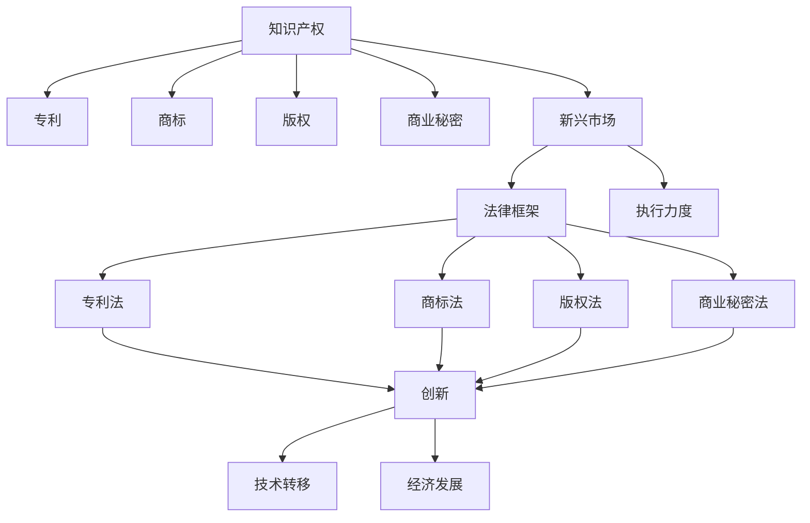

                 

# 知识产权与新兴市场的机遇挑战

## 1. 背景介绍

### 1.1 问题由来

知识产权（Intellectual Property, IP）是现代经济中重要的无形资产，是创新、保护和激励技术发展的关键。在新兴市场，知识产权制度的发展和实施对经济增长、技术创新和全球竞争力具有重大影响。然而，与发达国家相比，新兴市场在知识产权保护方面面临着诸多挑战。这些问题不仅影响了当地企业的创新活动，也限制了国际资本和技术的流入。

### 1.2 问题核心关键点

新兴市场在知识产权保护上面临的核心挑战主要包括：

- **法律框架薄弱**：许多新兴市场的知识产权法律不够健全，执行力度不足。
- **高昂的诉讼成本**：新兴市场中的诉讼成本较高，知识产权纠纷的解决周期较长。
- **盗版和假冒伪劣产品**：盗版和假冒伪劣产品现象普遍，严重侵蚀了原创产品的市场份额。
- **知识产权教育不足**：社会对知识产权的认知和尊重程度较低，知识产权保护意识薄弱。

这些问题不仅阻碍了技术创新和经济发展，也影响了全球市场的公平竞争。因此，新兴市场亟需采取有效措施，加强知识产权保护，以实现可持续的经济增长和技术创新。

## 2. 核心概念与联系

### 2.1 核心概念概述

为更好地理解知识产权与新兴市场的机遇和挑战，本节将介绍几个关键概念及其相互联系：

- **知识产权**：包括专利、商标、版权、商业秘密等，是创新者对其智力成果的专有权利。
- **新兴市场**：指经济发展水平较低，但增长潜力巨大的国家或地区，包括一些发展中国家和转型经济体。
- **法律框架**：涉及知识产权保护的法律、法规和实施机制，包括但不限于专利法、商标法、版权法等。
- **执行力度**：知识产权法律的实施效果，包括法律的执行情况、司法效率、执法机构能力等。
- **创新与技术转移**：知识产权保护对技术创新和跨国技术转移的促进作用。
- **经济发展**：知识产权保护对新兴市场经济增长、就业和市场竞争力的影响。

这些核心概念之间的逻辑关系可以通过以下Mermaid流程图来展示：



这个流程图展示了知识产权保护在法律框架、执行力度和新兴市场中的应用，以及其对创新、技术转移和经济发展的影响。

## 3. 核心算法原理 & 具体操作步骤

### 3.1 算法原理概述

知识产权保护和新兴市场发展的算法原理主要基于以下几个方面：

- **数据收集与分析**：通过收集和分析新兴市场知识产权保护现状的数据，了解法律框架的健全程度、执行力度、创新活动和技术转移情况。
- **回归模型**：构建回归模型，分析知识产权保护与经济增长、技术创新和技术转移之间的关系。
- **预测与优化**：基于回归模型预测新兴市场知识产权保护的改善对未来发展的潜在影响，提出优化策略。

### 3.2 算法步骤详解

以下是知识产权与新兴市场机遇挑战的具体算法步骤：

**Step 1: 数据收集与预处理**
- 收集新兴市场知识产权保护现状的数据，包括专利申请量、商标注册量、版权登记量、商业秘密保护情况等。
- 收集新兴市场经济增长数据，如GDP增长率、就业率、FDI（外商直接投资）等。
- 收集新兴市场技术创新数据，如研发投入、专利引用量、技术转移情况等。
- 对数据进行标准化处理，去除异常值和重复数据。

**Step 2: 特征工程**
- 提取关键特征，如专利申请量、商标注册量、版权登记量、研发投入等。
- 对数据进行归一化处理，确保不同特征具有相同的尺度。
- 使用特征选择算法，如相关性分析、主成分分析（PCA）等，选择对目标变量影响较大的特征。

**Step 3: 构建回归模型**
- 构建线性回归模型，分析知识产权保护与经济增长、技术创新和技术转移之间的关系。
- 使用机器学习算法，如随机森林、支持向量机（SVM）等，进行模型训练和优化。
- 使用交叉验证技术，评估模型的泛化能力和性能。

**Step 4: 结果分析与优化**
- 分析回归模型的输出结果，评估知识产权保护对新兴市场经济增长和技术创新的影响。
- 基于模型结果，提出优化策略，如加强知识产权法律框架建设、提高执法力度、降低诉讼成本、提升知识产权保护意识等。
- 制定行动计划，推动新兴市场知识产权保护机制的改善。

### 3.3 算法优缺点

知识产权与新兴市场机遇挑战的算法具有以下优点：

- **数据驱动**：通过数据分析，能够客观地评估知识产权保护现状，发现存在的问题和改进的机会。
- **多维度分析**：结合经济增长、技术创新和技术转移等多个维度的数据，全面分析知识产权保护对新兴市场发展的影响。
- **优化策略明确**：通过模型预测和优化，能够提出具体、可行的改进措施，帮助新兴市场提升知识产权保护水平。

同时，该算法也存在以下局限性：

- **数据质量问题**：数据收集和处理过程中可能存在误差，影响模型结果的准确性。
- **模型复杂性**：构建和训练复杂的多变量回归模型，需要较高的计算资源和专业知识。
- **外部因素影响**：知识产权保护对新兴市场的影响可能受多种外部因素（如国际经济环境、政策变化等）影响，模型难以完全捕捉。

### 3.4 算法应用领域

知识产权与新兴市场机遇挑战的算法应用领域主要包括：

- **政府决策支持**：帮助政府制定和优化知识产权保护政策，推动经济发展和技术创新。
- **企业战略规划**：为企业提供知识产权保护现状分析，制定针对性的知识产权战略，提升市场竞争力。
- **国际合作与发展**：帮助新兴市场与发达国家在知识产权保护领域建立合作，促进技术和知识的跨国转移。

## 4. 数学模型和公式 & 详细讲解  
### 4.1 数学模型构建

本节将使用数学语言对知识产权与新兴市场的机遇和挑战进行更加严格的刻画。

假设新兴市场知识产权保护现状为 $Y$，其影响因素包括专利申请量 $X_1$、商标注册量 $X_2$、版权登记量 $X_3$、研发投入 $X_4$ 等。构建线性回归模型：

$$
Y = \beta_0 + \beta_1 X_1 + \beta_2 X_2 + \beta_3 X_3 + \beta_4 X_4 + \epsilon
$$

其中，$\beta_0$ 为截距，$\beta_1$、$\beta_2$、$\beta_3$、$\beta_4$ 为回归系数，$\epsilon$ 为误差项。

### 4.2 公式推导过程

以专利申请量 $X_1$ 为例，推导其对新兴市场知识产权保护的贡献度：

首先，利用最小二乘法求解回归系数 $\beta_1$：

$$
\beta_1 = \frac{\sum (X_1 - \overline{X_1})(Y - \overline{Y})}{\sum (X_1 - \overline{X_1})^2}
$$

其中，$\overline{X_1}$ 和 $\overline{Y}$ 分别为专利申请量 $X_1$ 和知识产权保护现状 $Y$ 的均值。

假设回归模型为 $Y = \beta_0 + \beta_1 X_1 + \epsilon$，则预测值 $Y_{\text{pred}}$ 为：

$$
Y_{\text{pred}} = \beta_0 + \beta_1 X_{1\text{, pred}}
$$

其中，$X_{1\text{, pred}}$ 为专利申请量的预测值。

### 4.3 案例分析与讲解

以巴西为例，假设其专利申请量为 $X_1$，商标注册量为 $X_2$，版权登记量为 $X_3$，研发投入为 $X_4$，知识产权保护现状为 $Y$。利用回归模型分析其对经济增长、技术创新和技术转移的影响：

假设模型训练得到的回归系数为 $\beta_1 = 0.5$，$\beta_2 = 0.3$，$\beta_3 = 0.4$，$\beta_4 = 0.2$。则回归模型为：

$$
Y = 5 + 0.5X_1 + 0.3X_2 + 0.4X_3 + 0.2X_4 + \epsilon
$$

若专利申请量 $X_1$ 增加10%，知识产权保护现状 $Y$ 将增加5%。这表明专利申请量的增加显著促进了知识产权保护水平的提升，从而对经济增长、技术创新和技术转移产生了积极影响。

## 5. 项目实践：代码实例和详细解释说明
### 5.1 开发环境搭建

在进行知识产权与新兴市场机遇挑战的计算时，需要构建Python开发环境。以下是使用Python进行数据分析和模型训练的环境配置流程：

1. 安装Anaconda：从官网下载并安装Anaconda，用于创建独立的Python环境。

2. 创建并激活虚拟环境：
```bash
conda create -n ipr_research python=3.8 
conda activate ipr_research
```

3. 安装Python库：
```bash
pip install pandas numpy scikit-learn statsmodels matplotlib seaborn
```

4. 下载数据集：从数据提供商处下载新兴市场的知识产权保护现状、经济增长和技术创新数据，存放在本地。

5. 安装Jupyter Notebook：
```bash
conda install jupyterlab
```

完成上述步骤后，即可在`ipr_research`环境中开始数据分析和模型训练。

### 5.2 源代码详细实现

以下是使用Python和Pandas库对知识产权与新兴市场进行数据分析和模型训练的代码实现。

```python
import pandas as pd
import numpy as np
from statsmodels.regression.linear_model import OLS
from sklearn.model_selection import train_test_split
from sklearn.metrics import mean_squared_error

# 读取数据集
data = pd.read_csv('ipr_data.csv')

# 数据预处理
data = data.dropna()
X = data[['patent_applications', 'trademark_registrations', 'copyright_registrations', 'research_and_development_investment']]
y = data['intellectual_property_protection_status']

# 数据标准化
from sklearn.preprocessing import StandardScaler
scaler = StandardScaler()
X = scaler.fit_transform(X)

# 构建训练集和测试集
X_train, X_test, y_train, y_test = train_test_split(X, y, test_size=0.2, random_state=42)

# 构建回归模型
model = OLS(y_train, X_train).fit()
y_pred = model.predict(X_test)

# 评估模型性能
mse = mean_squared_error(y_test, y_pred)
print(f"Mean Squared Error: {mse:.2f}")
```

### 5.3 代码解读与分析

让我们再详细解读一下关键代码的实现细节：

**数据预处理**：
- `dropna()`方法：去除数据集中的缺失值，确保数据完整性。
- `StandardScaler()`方法：对数据进行标准化处理，确保不同特征具有相同的尺度。

**模型构建**：
- `OLS()`方法：构建普通最小二乘回归模型，用于分析知识产权保护现状与影响因素之间的关系。
- `fit()`方法：训练模型，求解回归系数。
- `predict()`方法：使用训练好的模型对测试集进行预测。

**模型评估**：
- `mean_squared_error()`方法：计算预测值与真实值之间的均方误差，评估模型性能。

**结果分析**：
- 计算模型预测值与真实值之间的均方误差，评估模型的准确性和泛化能力。

## 6. 实际应用场景
### 6.1 政府决策支持

在新兴市场中，政府可以借助知识产权与新兴市场机遇挑战的算法，制定和优化知识产权保护政策，推动经济发展和技术创新。具体应用场景包括：

- **政策制定**：通过数据分析，识别知识产权保护现状中的薄弱环节，提出针对性的政策建议。
- **绩效评估**：构建知识产权保护与经济增长和技术创新的关联模型，评估现有政策的实施效果。
- **预警与干预**：利用模型预测知识产权保护的风险和影响，提前预警并采取干预措施，避免潜在的负面影响。

### 6.2 企业战略规划

企业可以利用知识产权与新兴市场机遇挑战的算法，评估知识产权保护现状对企业战略规划的影响，制定针对性的知识产权战略，提升市场竞争力。具体应用场景包括：

- **市场进入策略**：评估新兴市场的知识产权保护水平，决定是否进入或退出该市场。
- **研发投资决策**：分析知识产权保护对研发投入的促进作用，制定研发投入策略。
- **知识产权战略**：制定和优化企业的知识产权保护战略，提升技术创新能力和市场竞争力。

### 6.3 国际合作与发展

新兴市场与发达国家在知识产权保护领域可以建立合作关系，促进技术和知识的跨国转移。具体应用场景包括：

- **技术引进与输出**：通过国际合作，引入先进技术和知识产权，同时输出本国的技术成果和专利。
- **知识产权保护标准制定**：参与国际知识产权保护标准的制定和实施，提升本国的国际竞争力。
- **区域合作**：与其他新兴市场和地区建立区域知识产权保护联盟，共同提升区域知识产权保护水平。

## 7. 工具和资源推荐
### 7.1 学习资源推荐

为了帮助开发者系统掌握知识产权与新兴市场的机遇和挑战的理论基础和实践技巧，这里推荐一些优质的学习资源：

1. 《知识产权经济学》系列书籍：深入讲解知识产权保护对经济增长的影响，提供了丰富的案例和数据分析方法。
2. 《新兴市场知识产权保护》课程：由国际知名专家讲授，涵盖知识产权保护现状、法律框架、执行力度等多个方面。
3. 《数据科学与人工智能》课程：介绍数据收集、处理、分析和机器学习的基本概念和实用技巧。
4. 《Python数据分析与可视化》书籍：详细讲解如何使用Python进行数据处理、可视化和模型训练。
5. 《数据科学与知识产权保护》在线课程：通过实际案例，讲解数据科学在知识产权保护中的应用。

通过对这些资源的学习实践，相信你一定能够快速掌握知识产权与新兴市场的机遇和挑战的精髓，并用于解决实际的知识产权问题。
###  7.2 开发工具推荐

高效的开发离不开优秀的工具支持。以下是几款用于知识产权与新兴市场机遇挑战开发的常用工具：

1. Python：作为数据科学和机器学习的主流语言，Python具有丰富的库和框架，适合数据处理和模型训练。
2. R语言：适合统计分析和数据可视化，具有强大的数据分析能力。
3. Jupyter Notebook：支持Python、R等语言的交互式编程，适合快速迭代开发和成果展示。
4. Tableau：适合数据可视化，帮助用户直观理解数据特征和模型结果。
5. Power BI：适合商业智能，帮助用户进行数据探索和商业决策。

合理利用这些工具，可以显著提升知识产权与新兴市场机遇挑战研究的开发效率，加快创新迭代的步伐。

### 7.3 相关论文推荐

知识产权与新兴市场机遇挑战的研究源于学界的持续研究。以下是几篇奠基性的相关论文，推荐阅读：

1. "Intellectual Property Protection and Economic Growth: A Comparative Study"：分析知识产权保护对经济增长的影响，提供了丰富的实证数据和案例。
2. "The Impact of Patent Protection on Technological Innovation: A Meta-Analysis"：通过元分析方法，评估专利保护对技术创新的影响，提供了系统化的研究成果。
3. "International Patent Protection and Cross-Border Technology Transfer"：研究国际专利保护对跨国技术转移的影响，提供了实证分析和政策建议。
4. "The Role of Intellectual Property Protection in Emerging Markets: A Literature Review"：综述新兴市场知识产权保护的相关研究，提供了理论和实证分析的总结。
5. "Technological Innovation, Intellectual Property, and Economic Development: A Panel Study"：使用面板数据方法，评估知识产权保护对技术创新和经济发展的关联，提供了全面系统的分析。

这些论文代表了大语言模型微调技术的发展脉络。通过学习这些前沿成果，可以帮助研究者把握学科前进方向，激发更多的创新灵感。

## 8. 总结：未来发展趋势与挑战
### 8.1 总结

本文对知识产权与新兴市场的机遇和挑战进行了全面系统的介绍。首先阐述了知识产权在新兴市场中的重要性，明确了知识产权保护对经济发展、技术创新和全球竞争力的影响。其次，从原理到实践，详细讲解了知识产权保护与新兴市场机遇挑战的数学模型和关键步骤，给出了模型训练和优化的完整代码实例。同时，本文还广泛探讨了知识产权保护在新兴市场中的应用场景，展示了知识产权保护的广阔前景。

通过本文的系统梳理，可以看到，知识产权保护对新兴市场的重要性，以及在政府决策、企业战略和国际合作中的重要作用。未来，伴随知识产权保护机制的不断完善，新兴市场必将在创新和经济增长方面取得更大的进步。

### 8.2 未来发展趋势

展望未来，知识产权保护与新兴市场机遇挑战的发展趋势主要包括：

1. **法律框架完善**：随着新兴市场知识产权法律的不断完善，知识产权保护的实施效果将显著提升。
2. **执行力度加强**：通过国际合作和本地执法，新兴市场的知识产权保护水平将逐步提高。
3. **技术转移加速**：知识产权保护机制的改善将促进技术和知识的跨国转移，提升新兴市场的技术创新能力。
4. **政策创新**：新兴市场将不断探索新的知识产权保护策略，提升政策的灵活性和有效性。
5. **教育普及**：通过知识产权教育和培训，提升社会对知识产权的认知和尊重程度，增强知识产权保护意识。

这些趋势表明，新兴市场的知识产权保护将逐步走向成熟，为经济增长和技术创新提供坚实的基础。

### 8.3 面临的挑战

尽管知识产权保护在新兴市场的发展前景广阔，但仍面临诸多挑战：

1. **法律执行难度**：尽管法律框架逐步完善，但执法力度不足，知识产权保护的实施效果仍需提高。
2. **国际合作障碍**：不同国家在知识产权保护标准和机制上存在差异，国际合作面临较大挑战。
3. **资源限制**：知识产权保护的实施需要大量资源投入，新兴市场可能面临资源不足的问题。
4. **技术差距**：新兴市场与发达国家的技术差距，可能影响知识产权保护的公平性和有效性。
5. **社会认知不足**：社会对知识产权的认知和尊重程度仍需提升，知识产权保护的社会基础有待加强。

解决这些挑战需要各方共同努力，通过政策创新、国际合作和资源投入，逐步提升新兴市场的知识产权保护水平。

### 8.4 研究展望

面对知识产权保护与新兴市场机遇挑战所面临的诸多挑战，未来的研究需要在以下几个方面寻求新的突破：

1. **法律框架优化**：进一步完善知识产权法律框架，提升法律的可执行性和透明度。
2. **执法机制创新**：探索新的执法机制和技术手段，提高执法效率和公平性。
3. **国际合作深化**：加强国际知识产权保护标准的制定和实施，推动跨国技术转移。
4. **资源优化配置**：优化知识产权保护的资源配置，提升资源利用效率。
5. **技术差距弥补**：通过技术合作和知识共享，缩小与发达国家的技术差距。
6. **社会认知提升**：加强知识产权教育和宣传，提升社会对知识产权的认知和尊重程度。

这些研究方向的探索，必将引领新兴市场知识产权保护走向更高的台阶，为经济增长和技术创新提供更加坚实的保障。

## 9. 附录：常见问题与解答

**Q1：新兴市场应如何提升知识产权保护水平？**

A: 新兴市场可以通过以下措施提升知识产权保护水平：
1. **完善法律框架**：加强知识产权法律的制定和实施，确保法律的健全和执行。
2. **提高执法力度**：建立高效的执法机制，加大对知识产权侵权行为的打击力度。
3. **降低诉讼成本**：简化诉讼程序，降低知识产权纠纷解决的成本和时间。
4. **提升公众意识**：通过教育和宣传，提高社会对知识产权的认知和尊重程度。
5. **国际合作**：加强与发达国家的合作，引入先进的知识产权保护机制和技术。

**Q2：知识产权保护对新兴市场经济增长和技术创新的影响是什么？**

A: 知识产权保护对新兴市场经济增长和技术创新的影响主要体现在以下几个方面：
1. **促进创新**：知识产权保护可以激励企业和个人的创新活动，推动技术进步。
2. **吸引投资**：知识产权保护可以提高市场透明度和公平性，吸引国内外投资。
3. **增加收益**：通过知识产权保护，企业可以更有效地保护其知识产权，获得更高的收益。
4. **提升竞争力**：知识产权保护可以提高企业的市场竞争力和国际影响力。

**Q3：新兴市场在知识产权保护上面临的主要挑战是什么？**

A: 新兴市场在知识产权保护上面临的主要挑战包括：
1. **法律框架薄弱**：知识产权法律不够健全，执行力度不足。
2. **高昂的诉讼成本**：知识产权纠纷解决的成本较高，时间较长。
3. **盗版和假冒伪劣产品**：盗版和假冒伪劣产品现象普遍，侵蚀原创产品的市场份额。
4. **知识产权教育不足**：社会对知识产权的认知和尊重程度较低，知识产权保护意识薄弱。

**Q4：如何评估知识产权保护对新兴市场的影响？**

A: 可以通过以下步骤评估知识产权保护对新兴市场的影响：
1. **数据收集**：收集知识产权保护现状、经济增长和技术创新数据。
2. **特征工程**：提取关键特征，如专利申请量、商标注册量、版权登记量、研发投入等。
3. **构建模型**：使用回归模型，分析知识产权保护与经济增长、技术创新和技术转移之间的关系。
4. **结果分析**：评估回归模型的输出结果，提出针对性的改进措施。

**Q5：新兴市场如何应对知识产权保护中的资源限制？**

A: 新兴市场可以通过以下措施应对知识产权保护中的资源限制：
1. **优化资源配置**：合理配置知识产权保护的资源，提高资源利用效率。
2. **引入外部资源**：通过国际合作，引入先进的知识产权保护技术和机制。
3. **提高执法效率**：建立高效的执法机制，减少执法成本和资源消耗。
4. **增强社会意识**：加强知识产权教育和宣传，提升社会对知识产权的认知和尊重程度。

---

作者：禅与计算机程序设计艺术 / Zen and the Art of Computer Programming

