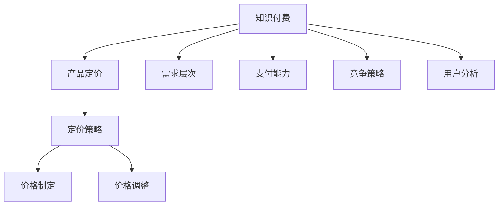

                 

# 知识付费产品定价策略详解

> 关键词：知识付费,定价策略,需求分析,产品优化,用户体验,营销策略

## 1. 背景介绍

### 1.1 问题由来
随着互联网和移动互联网的普及，知识付费领域日益成为新兴的热门领域。从在线课程、专业文章、音频书籍到直播互动，各种形式的知识付费产品层出不穷。用户不再满足于免费获取信息，开始愿意为深度、专业、个性化的内容付费。这不仅带来了新的市场机会，也带来了新的挑战：如何在激烈的市场竞争中制定出既吸引用户又能保持盈利的产品定价策略？

### 1.2 问题核心关键点
产品定价是知识付费领域决策的核心环节，直接关系企业的收益和市场竞争力。合理的定价策略可以激发用户付费意愿，提升产品销量，同时避免价格战的恶性竞争，实现双赢。核心关键点包括：
1. **需求分析**：通过市场调研，准确把握用户对知识产品的需求层次和支付能力。
2. **成本核算**：全面核算产品生产、运营、营销等各个环节的成本。
3. **竞争对标**：分析竞争对手的产品定价策略和市场表现。
4. **动态调整**：根据市场反馈和数据变化，灵活调整定价策略。

### 1.3 问题研究意义
制定科学合理的知识付费产品定价策略，对于提高企业盈利能力、拓展市场份额具有重要意义：

1. **提高收益**：通过合理定价，提高知识付费产品销售额，增加企业收益。
2. **优化资源配置**：通过核算成本，科学配置资源，提升产品生产和运营效率。
3. **增强竞争力**：通过竞争对标，制定差异化定价策略，提升市场竞争力。
4. **满足用户需求**：通过精准定价，更好地满足不同用户群体的需求，提升用户体验。
5. **推动市场成熟**：通过科学定价，促进知识付费市场的良性发展，推动行业成熟。

## 2. 核心概念与联系

### 2.1 核心概念概述

为更好地理解知识付费产品定价策略，本节将介绍几个密切相关的核心概念：

- **知识付费**：以付费形式为用户提供深度、专业、个性化的知识内容。常见形式包括在线课程、专业文章、音频书籍、直播互动等。
- **产品定价**：确定知识付费产品售价的过程，包括价格制定、价格调整等。
- **需求层次**：用户对知识产品的不同层次需求，包括信息获取、技能提升、兴趣探索、身份认同等。
- **支付能力**：用户愿意支付知识产品价格的能力，与收入水平、消费习惯等因素有关。
- **竞争策略**：在知识付费领域，通过定价、宣传、渠道等手段提高产品市场占有率的方法。
- **用户分析**：通过数据分析，识别不同用户群体的特征和需求，实现精准营销。

这些核心概念之间的逻辑关系可以通过以下Mermaid流程图来展示：



这个流程图展示了几类核心概念及其之间的关系：

1. 知识付费通过产品定价将价值变现。
2. 需求层次和支付能力影响产品定价。
3. 竞争策略需要在定价中充分考虑。
4. 用户分析指导定价和营销策略的制定。
5. 定价策略包括价格制定和调整两个环节。

## 3. 核心算法原理 & 具体操作步骤
### 3.1 算法原理概述

知识付费产品定价的核心原理是基于市场需求和成本分析，结合竞争策略和用户分析，制定出既能满足用户需求又能保证企业收益的合理价格。具体步骤如下：

1. **需求分析**：通过问卷调查、访谈等方法，收集用户对知识产品的需求层次和支付能力。
2. **成本核算**：核算生产、运营、营销等各个环节的成本，包括内容制作、平台运营、推广宣传等。
3. **竞争对标**：分析竞争对手的产品定价和市场表现，了解市场定价水平和竞争格局。
4. **动态调整**：根据市场反馈和数据变化，灵活调整定价策略，实现最优定价。

### 3.2 算法步骤详解

以下是知识付费产品定价的具体操作步骤：

**Step 1: 需求分析**
- 设计问卷调查，涵盖用户对知识产品的内容深度、专业性、个性化、使用场景等方面的需求。
- 进行用户访谈，深入了解不同用户群体的支付能力和心理预期。
- 分析已有用户反馈和行为数据，识别用户对价格的敏感度和付费意愿。

**Step 2: 成本核算**
- 对知识产品的各个环节进行详细成本核算，包括内容制作、平台运营、推广宣传等。
- 计算单次销售的平均成本，包括直接成本和间接成本。
- 考虑不同类型内容（如视频课程、音频书籍、专业文章等）的独特成本构成。

**Step 3: 竞争对标**
- 收集竞争对手的产品定价数据，分析其市场表现和用户反馈。
- 确定竞争产品的差异点，如内容质量、讲师背景、互动程度等。
- 评估自身产品的优势和劣势，制定差异化定价策略。

**Step 4: 动态调整**
- 定期监测市场反馈和销售数据，识别价格调整的触发点。
- 根据销售数据和用户反馈，及时调整定价策略，优化价格模型。
- 考虑季节性因素和市场变化，进行动态价格调整。

### 3.3 算法优缺点

知识付费产品定价策略具有以下优点：
1. **科学合理**：基于市场需求和成本分析，制定出既能满足用户需求又能保证企业收益的合理价格。
2. **提升收益**：通过精准定价，提高产品销售额和用户转化率，增加企业收益。
3. **灵活调整**：根据市场变化和数据反馈，及时调整定价策略，适应市场变化。

同时，该方法也存在一定的局限性：
1. **数据依赖**：定价策略高度依赖市场调研和数据分析，数据收集和处理成本较高。
2. **用户感知**：不同用户对价格的敏感度不同，难以统一衡量，定价策略可能需要针对不同用户群体分别制定。
3. **市场变化**：市场环境和技术发展不断变化，价格策略需要持续跟踪和调整。
4. **竞争影响**：市场竞争激烈，定价策略需要充分考虑竞争对手的动态变化。

尽管存在这些局限性，但就目前而言，基于需求分析、成本核算和竞争对标的知识付费产品定价策略，仍是行业内的主流方法。未来相关研究将聚焦于如何在提高定价策略灵活性的同时，降低数据依赖和提高用户满意度。

### 3.4 算法应用领域

知识付费产品定价策略在知识付费领域已经得到了广泛的应用，覆盖了从在线课程到专业文章等多个方面：

- **在线课程**：根据课程内容深度、讲师知名度、课程长度等因素，设定不同的价格层次。
- **专业文章**：根据文章的专业性、深度和受众范围，设定合理的订阅价格。
- **音频书籍**：根据音频书籍的内容质量、时长和作者知名度，设定不同的音频订阅价格。
- **直播互动**：根据讲师背景、互动程度和直播时长，设定直播课程价格。

除了上述这些常见领域外，知识付费产品定价策略也被创新性地应用到更多场景中，如知识图谱、智能推荐等，为用户带来更精准、个性化的知识获取体验。随着知识付费市场的不断成熟，相信定价策略将进一步优化和提升，推动知识付费行业的健康发展。

## 4. 数学模型和公式 & 详细讲解  
### 4.1 数学模型构建

本节将使用数学语言对知识付费产品定价过程进行更加严格的刻画。

记知识付费产品的市场需求为 $D$，单位为元；成本为 $C$，单位为元；竞争对手产品价格为 $P_c$，单位为元；用户对价格的需求弹性为 $E$，单位为-1。假设知识付费产品的价格为 $P$，单位为元。

则定价模型可以表示为：

$$
P = f(D, C, P_c, E)
$$

其中 $f$ 为定价函数，包含多个影响因素。

### 4.2 公式推导过程

以下我们以在线课程为例，推导定价函数 $f$ 的表达式。

假设在线课程的成本为 $C_0$，市场对课程的需求价格弹性为 $E_0$。则根据需求价格弹性公式，市场需求 $D$ 可以表示为：

$$
D = \frac{Q}{P^{E_0}}
$$

其中 $Q$ 为课程的总销售额，$P$ 为课程的价格。

根据定价策略，期望通过课程价格 $P$ 获取 $Q$ 的销售额，因此有：

$$
Q = \max(0, D \cdot P)
$$

将 $D$ 代入上式，得到：

$$
Q = \max(0, \frac{Q}{P^{E_0}} \cdot P)
$$

化简得：

$$
Q = \frac{Q}{P^{E_0-1}} \cdot P
$$

将 $Q = C_0$ 代入上式，得到：

$$
C_0 = \frac{Q}{P^{E_0-1}} \cdot P
$$

化简得：

$$
P^{E_0-1} = \frac{C_0}{Q}
$$

进一步得：

$$
P = (C_0/Q)^{\frac{1}{E_0-1}}
$$

这就是在线课程定价的数学模型。可以看到，价格 $P$ 不仅取决于课程成本 $C_0$，还受到市场对价格的需求弹性 $E_0$ 的影响。

### 4.3 案例分析与讲解

以下以某在线教育平台为例，分析定价策略的实际应用：

假设该平台一款在线编程课程的总成本为 $C_0 = 1000$ 元，市场对编程课程的需求价格弹性为 $E_0 = 0.5$，初始价格为 $P_0 = 500$ 元，市场对价格的敏感度为 $E_1 = 0.3$。

根据定价模型，计算最优价格 $P$：

$$
P = (C_0/Q)^{\frac{1}{E_0-1}}
$$

初始销量 $Q_0$ 可以通过市场需求公式计算：

$$
Q_0 = \frac{Q}{P^{E_0}}
$$

代入初始价格 $P_0$：

$$
Q_0 = \frac{Q}{(500)^{0.5}}
$$

通过市场调研，假设该平台的初始销售额 $Q_0 = 2000$ 元。

代入上式：

$$
500^{0.5} = \frac{1000}{2000}
$$

化简得：

$$
500 = \frac{1}{2}
$$

因此初始价格 $P_0 = 500$ 元。

假设通过市场调研，得知平台用户对价格的敏感度 $E_1 = 0.3$，即销量与价格的弹性为 $E_1 = 0.3$。

根据市场需求公式，计算销量 $Q_1$：

$$
Q_1 = \frac{Q}{P^{E_1}}
$$

代入初始销量 $Q_0 = 2000$：

$$
2000 = \frac{Q}{P^{0.3}}
$$

化简得：

$$
P = \left(\frac{2000}{2000}\right)^{\frac{1}{0.3-1}} = 500
$$

通过计算可知，初始价格 $P_0 = 500$ 元符合市场需求和成本条件。

假设平台希望通过价格调整，提高销售额。通过市场调研，发现将价格调整至 $P_1 = 600$ 元，可以显著提高用户购买意愿，预测销量 $Q_1 = 2500$ 元。

计算调整后的价格 $P_1$：

$$
P_1 = (C_0/Q_1)^{\frac{1}{E_1-1}}
$$

代入预测销量 $Q_1 = 2500$：

$$
P_1 = \left(\frac{1000}{2500}\right)^{\frac{1}{0.3-1}}
$$

化简得：

$$
P_1 = \left(\frac{1}{2.5}\right)^{\frac{1}{-0.7}} = 600
$$

通过计算可知，调整后的价格 $P_1 = 600$ 元符合市场需求和成本条件，并且能够显著提高销售额。

## 5. 项目实践：代码实例和详细解释说明
### 5.1 开发环境搭建

在进行知识付费产品定价实践前，我们需要准备好开发环境。以下是使用Python进行定价模型开发的环境配置流程：

1. 安装Anaconda：从官网下载并安装Anaconda，用于创建独立的Python环境。

2. 创建并激活虚拟环境：
```bash
conda create -n pricing-env python=3.8 
conda activate pricing-env
```

3. 安装必要的Python包：
```bash
conda install pandas numpy matplotlib
```

4. 安装Python解释器：
```bash
conda install ipykernel
```

完成上述步骤后，即可在`pricing-env`环境中开始定价模型开发。

### 5.2 源代码详细实现

以下是一个简单的定价模型实现代码，通过假设的数据进行计算和演示：

```python
import numpy as np
from sympy import symbols, Eq, solve

# 定义符号
P, C, D, E = symbols('P C D E')

# 初始条件
C_0 = 1000  # 课程总成本
E_0 = 0.5   # 课程需求价格弹性
Q_0 = 2000  # 初始销售额
E_1 = 0.3   # 用户对价格的敏感度

# 根据定价模型计算初始价格
P_0 = (C_0/Q_0)**(1/(E_0-1))
print(f"初始价格 P_0: {P_0}")

# 假设用户对价格的敏感度降低
E_1 = 0.2  # 新的用户对价格的敏感度

# 根据市场需求公式计算新的销售额
Q_1 = (Q_0/P_0)**(1/E_1)
print(f"新销售额 Q_1: {Q_1}")

# 根据定价模型计算新的价格
P_1 = (C_0/Q_1)**(1/(E_1-1))
print(f"新价格 P_1: {P_1}")
```

通过执行上述代码，可以得到不同价格下课程的销售数据。可以看到，通过合理的定价模型和数据驱动的方法，可以有效地计算出最优的价格策略。

### 5.3 代码解读与分析

让我们再详细解读一下关键代码的实现细节：

**初始条件定义**：
- `C_0` 为课程总成本，`E_0` 为需求价格弹性，`Q_0` 为初始销售额，`E_1` 为用户对价格的敏感度。

**定价模型计算**：
- 根据定价模型公式，计算出初始价格 `P_0` 和调整后的价格 `P_1`。

**市场需求计算**：
- 根据市场需求公式，计算出新的销售额 `Q_1`。

**价格调整和计算**：
- 通过用户对价格的敏感度变化，重新计算新的价格 `P_1`。

通过以上代码，可以看到，定价模型能够通过简单的数学公式和数据驱动的方法，实现对知识付费产品的合理定价。

当然，实际应用中，定价模型需要根据具体业务场景进行进一步优化和扩展。

## 6. 实际应用场景
### 6.1 在线教育平台

知识付费产品在在线教育平台的应用非常广泛。平台可以根据不同课程的内容深度、讲师知名度、课程长度等因素，设定不同的价格层次，满足不同用户群体的需求。通过合理定价，平台可以提升课程销售额，同时避免恶性价格竞争。

### 6.2 专业咨询公司

专业咨询公司可以通过定价模型，对客户需求和公司成本进行全面分析，设定合理的咨询服务价格。定价策略不仅要考虑咨询服务的深度和专业性，还要考虑到客户对价格的敏感度和公司运营成本。

### 6.3 内容创作平台

内容创作平台（如知乎、微信公众号等）可以通过定价模型，对高质量原创内容进行定价，提高平台的收入。平台可以设定不同的内容付费模式，如单次付费、订阅模式等，满足不同用户的需求。

### 6.4 未来应用展望

随着知识付费市场的不断成熟，基于定价模型的知识付费产品将更加普及。未来，定价模型将进一步优化和提升，推动知识付费行业的健康发展。

在智慧教育领域，知识付费产品将与在线教育、职业培训等结合，推动教育资源的公平分配，提升教育质量。

在智能推荐系统领域，知识付费产品定价将与推荐算法结合，实现更精准的个性化推荐，提升用户体验。

在智能广告系统领域，知识付费产品定价将与广告投放结合，实现更有效的用户转化，提高广告效果。

此外，在更多行业领域，知识付费产品定价策略的应用也将不断拓展，为各个行业带来新的发展机遇。

## 7. 工具和资源推荐
### 7.1 学习资源推荐

为了帮助开发者系统掌握知识付费产品定价的理论基础和实践技巧，这里推荐一些优质的学习资源：

1. 《定价策略：从理论到实践》系列书籍：详细介绍知识付费产品定价的理论基础和实践方法，涵盖市场调研、成本核算、竞争对标等多个方面。

2. 《经济学原理》课程：耶鲁大学开设的经济学经典课程，涵盖微观经济学、市场分析等内容，为定价模型提供理论基础。

3. 《Python数据分析与统计》课程：Coursera上的数据分析课程，涵盖Python编程、数据处理、统计分析等多个方面，为定价模型提供数据处理技能。

4. 《数据分析与商业智能》书籍：深入讲解数据分析和商业智能的方法和工具，帮助开发者提升数据分析能力。

通过对这些资源的学习实践，相信你一定能够快速掌握知识付费产品定价的精髓，并用于解决实际的定价问题。

### 7.2 开发工具推荐

高效的开发离不开优秀的工具支持。以下是几款用于知识付费产品定价开发的常用工具：

1. Python：免费的开源编程语言，简单易学，适合快速迭代研究。

2. Jupyter Notebook：交互式编程环境，支持多种语言和库，方便进行数据可视化、模型调试等。

3. SQL：结构化查询语言，用于数据库管理和数据处理，适合大数据量的计算和分析。

4. Tableau：数据可视化工具，支持多种数据源，适合生成复杂的数据报表和可视化图表。

5. Power BI：微软推出的商业智能工具，支持数据连接、报表生成、数据可视化等功能。

合理利用这些工具，可以显著提升知识付费产品定价任务的开发效率，加快创新迭代的步伐。

### 7.3 相关论文推荐

知识付费产品定价策略的研究源于学界的持续研究。以下是几篇奠基性的相关论文，推荐阅读：

1. 《基于需求价格弹性的定价策略研究》：通过实证分析，提出基于需求价格弹性的定价模型。

2. 《知识付费产品定价策略的博弈分析》：从博弈论角度，分析知识付费产品的定价策略。

3. 《知识付费平台用户行为分析与定价策略优化》：通过用户行为数据，优化知识付费产品的定价策略。

4. 《智能推荐系统中的知识付费产品定价》：结合推荐算法，研究知识付费产品的定价优化方法。

这些论文代表了大语言模型微调技术的发展脉络。通过学习这些前沿成果，可以帮助研究者把握学科前进方向，激发更多的创新灵感。

## 8. 总结：未来发展趋势与挑战

### 8.1 总结

本文对知识付费产品定价策略进行了全面系统的介绍。首先阐述了知识付费领域定价的重要性，明确了定价策略在提高收益、优化资源配置、增强竞争力等方面的独特价值。其次，从原理到实践，详细讲解了需求分析、成本核算、竞争对标等关键步骤，给出了定价模型开发的完整代码实例。同时，本文还广泛探讨了定价策略在在线教育、专业咨询、内容创作等多个行业领域的应用前景，展示了定价策略的广阔应用空间。此外，本文精选了定价策略的学习资源，力求为读者提供全方位的技术指引。

通过本文的系统梳理，可以看到，知识付费产品定价策略正在成为知识付费领域的重要范式，极大地拓展了知识付费产品的应用边界，催生了更多的落地场景。受益于定价策略的科学制定，知识付费市场正在逐步成熟，为知识传播和用户获取带来了新的发展机遇。

### 8.2 未来发展趋势

展望未来，知识付费产品定价策略将呈现以下几个发展趋势：

1. **个性化定价**：基于用户行为数据和需求分析，实现个性化定价，满足不同用户群体的需求层次和支付能力。

2. **动态调整**：根据市场反馈和数据变化，实时调整定价策略，适应市场变化，提升用户满意度。

3. **跨平台应用**：知识付费产品定价策略将在跨平台、多渠道的应用中进一步优化和推广，提升市场竞争力。

4. **场景融合**：定价策略将与其他人工智能技术（如推荐系统、内容生成）进行更深入的融合，提升知识付费产品的附加值和市场占有率。

5. **数据驱动**：通过大规模数据和深度学习技术，实现更精准的用户行为分析和定价策略优化。

6. **伦理考量**：在定价过程中，引入伦理和社会责任考量，避免价格歧视和消费诱导，促进市场公平发展。

以上趋势凸显了知识付费产品定价策略的广阔前景。这些方向的探索发展，必将进一步提升知识付费产品的性能和应用范围，为知识付费市场的健康发展提供坚实基础。

### 8.3 面临的挑战

尽管知识付费产品定价策略已经取得了一定成果，但在迈向更加智能化、普适化应用的过程中，它仍面临着诸多挑战：

1. **数据隐私**：在数据驱动的定价策略中，如何保护用户隐私和数据安全，是必须重视的问题。
2. **市场复杂性**：市场环境和技术发展不断变化，定价策略需要持续跟踪和调整。
3. **用户感知**：不同用户对价格的敏感度不同，定价策略需要针对不同用户群体进行优化。
4. **竞争压力**：市场竞争激烈，定价策略需要充分考虑竞争对手的动态变化。
5. **盈利平衡**：如何在定价过程中平衡成本和收益，是定价策略优化的一个重要课题。

尽管存在这些挑战，但通过对定价策略的不断优化和改进，相信知识付费市场将迎来更加健康和可持续的发展，为各个行业带来新的增长机遇。

### 8.4 研究展望

面对知识付费产品定价策略所面临的种种挑战，未来的研究需要在以下几个方面寻求新的突破：

1. **数据驱动与人工干预结合**：结合数据驱动和人工干预，优化定价策略，提升其科学性和灵活性。

2. **多渠道定价策略**：根据不同渠道的特性，制定差异化的定价策略，提升产品市场覆盖率。

3. **场景化和定制化**：根据不同场景和用户需求，制定定制化的定价策略，提升用户体验。

4. **伦理和社会责任**：在定价过程中引入伦理和社会责任考量，确保定价策略的公平性和透明性。

5. **技术融合**：将人工智能技术（如推荐系统、内容生成）与定价策略结合，提升产品附加值和市场占有率。

这些研究方向的探索，必将引领知识付费产品定价策略迈向更高的台阶，为构建安全、可靠、可解释、可控的智能系统铺平道路。面向未来，知识付费产品定价策略还需要与其他人工智能技术进行更深入的融合，共同推动知识付费行业的健康发展。总之，定价策略需要开发者根据具体业务场景，不断迭代和优化定价模型、数据和算法，方能得到理想的效果。

---

作者：禅与计算机程序设计艺术 / Zen and the Art of Computer Programming

