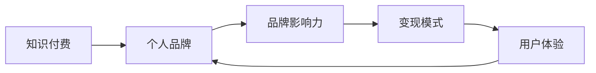

                 

# 知识付费创业中的个人品牌塑造

> 关键词：知识付费、个人品牌、影响力、用户体验、变现模式

## 1. 背景介绍

在数字化时代，知识付费已成为人们获取知识的重要途径。特别是在信息爆炸、竞争激烈的今天，许多人愿意为高品质的知识和见解买单。根据相关报告，全球知识付费市场规模预计将在未来几年内以年均20%的速度增长，到2025年市场规模将达到270亿美元。在这股浪潮中，个人品牌塑造成为了知识付费创业的关键。一个强大的个人品牌不仅能提升产品信任度、增加用户粘性，还能实现高效变现，构建良性循环。本文将从多个维度剖析知识付费创业中个人品牌塑造的策略和技巧，力求为创业者提供实用的指导。

## 2. 核心概念与联系

### 2.1 核心概念概述

在知识付费领域，个人品牌塑造涉及多个核心概念，包括但不限于：

- **知识付费**：指消费者为获取有价值知识或见解而支付费用的商业活动。它是一种快速增长的新型商业模式，将知识、信息和经验货币化。

- **个人品牌**：指个人在特定领域或行业中的知名度、影响力及差异化特征。一个良好的个人品牌能够提升专业信誉、增加用户信任、吸引更多关注和合作机会。

- **品牌塑造**：指个人或企业通过一系列行为和策略，构建和提升品牌知名度、认可度和美誉度的过程。在知识付费领域，品牌塑造尤为重要，关系到产品的市场接受度和变现潜力。

- **影响力变现**：指个人品牌利用其影响力，通过内容付费、广告变现、知识服务等多种方式实现商业价值的转化。

- **用户体验**：指用户在使用知识产品和服务过程中的感受和满意度。优质的用户体验能提升用户忠诚度，促进二次消费和口碑传播。

这些核心概念通过以下逻辑链条相互关联：通过知识付费，个人品牌得到塑造；品牌影响力转化为变现机会；优质的用户体验增强用户粘性，进一步提升品牌影响力。以下是一个简化的Mermaid流程图，展示这些概念之间的联系：



## 3. 核心算法原理 & 具体操作步骤

### 3.1 算法原理概述

知识付费中的个人品牌塑造，本质上是一个多目标优化问题。目标包括提升品牌知名度、增强品牌影响力、提升用户体验、实现高效变现等。其核心算法原理涉及以下方面：

1. **用户画像建模**：通过数据分析和用户行为追踪，建立用户画像，了解用户需求、偏好和购买行为。
2. **内容推荐算法**：使用推荐系统算法，为用户提供个性化的知识内容推荐，提升用户体验和满意度。
3. **品牌影响力评估**：通过社交媒体分析、流量数据、用户反馈等指标，评估个人品牌的影响力。
4. **变现模式设计**：结合品牌定位和市场需求，设计多样化的变现模式，如内容订阅、课程收费、品牌合作等。
5. **用户体验优化**：通过用户反馈和数据分析，持续优化产品和服务，提升用户满意度和忠诚度。

### 3.2 算法步骤详解

以下是知识付费创业中个人品牌塑造的具体算法步骤：

**Step 1: 用户画像建模**

- **数据收集**：通过用户注册、浏览、购买行为数据，收集用户基本信息、兴趣偏好、消费能力等信息。
- **数据分析**：使用聚类、分类、关联分析等算法，识别用户群体特征，划分用户画像标签。
- **画像更新**：定期更新用户画像，保持数据的实时性。

**Step 2: 内容推荐算法**

- **模型选择**：选择适合的知识推荐算法，如协同过滤、基于内容的推荐、混合推荐等。
- **训练优化**：在用户数据集上训练推荐模型，并使用交叉验证和A/B测试优化模型性能。
- **实时推荐**：根据用户行为实时调整推荐策略，提升用户体验。

**Step 3: 品牌影响力评估**

- **社交媒体分析**：通过社交媒体数据、搜索引擎关键词等指标，评估品牌在行业内的知名度和影响力。
- **流量数据监测**：使用网站访问量、用户停留时间等指标，评估品牌在平台上的表现。
- **用户反馈收集**：通过调查问卷、在线评论等方式，收集用户对品牌和产品的反馈。

**Step 4: 变现模式设计**

- **多元变现**：结合品牌定位和市场需求，设计多样化的变现模式，如内容订阅、课程收费、品牌合作、增值服务等。
- **定价策略**：根据市场调研和用户反馈，确定合理的课程价格和订阅费率，实现收益最大化。
- **收入分配**：合理分配平台、创作者和用户之间的收益，形成良性循环。

**Step 5: 用户体验优化**

- **用户反馈分析**：定期收集用户反馈，分析用户满意度和不满意度。
- **产品迭代**：根据用户反馈，优化产品功能和用户体验。
- **性能监控**：实时监控产品性能指标，如加载速度、稳定性、可用性等，确保高质量的用户体验。

### 3.3 算法优缺点

个人品牌塑造中的算法具有以下优点：

1. **个性化推荐**：通过用户画像和内容推荐算法，提升用户体验，增加用户粘性。
2. **精准营销**：利用品牌影响力评估算法，精准定位目标用户群体，实现高效变现。
3. **持续优化**：通过数据分析和用户反馈，不断优化产品和服务，保持品牌竞争力和市场份额。

同时，这些算法也存在一些缺点：

1. **数据隐私问题**：用户数据的收集和使用可能引发隐私保护问题，需严格遵守相关法律法规。
2. **模型复杂性**：推荐算法和品牌评估模型可能较为复杂，需投入大量时间和资源进行设计和优化。
3. **市场变化敏感**：品牌塑造和变现模式设计需灵活应对市场变化，否则容易失去竞争力。
4. **技术门槛较高**：相关技术需具备一定的数据科学和机器学习背景，对创业者的技术要求较高。

## 4. 数学模型和公式 & 详细讲解 & 举例说明

### 4.1 数学模型构建

在知识付费中的个人品牌塑造过程中，可以构建如下数学模型：

- **用户画像建模**：设用户画像为 $U=\{u_1, u_2, ..., u_N\}$，其中 $u_i$ 为第 $i$ 个用户，包含基本信息、兴趣偏好、消费能力等特征。
- **内容推荐算法**：设推荐系统为 $R$，包含内容库 $C$ 和用户画像 $U$，通过模型 $M$ 预测用户对内容的偏好，推荐最佳内容。
- **品牌影响力评估**：设品牌影响力为 $I$，包含社交媒体指标 $S$、流量数据 $F$、用户反馈 $R$，通过模型 $I$ 计算品牌影响力得分。
- **变现模式设计**：设变现模式为 $E$，包含内容订阅 $E_1$、课程收费 $E_2$、品牌合作 $E_3$、增值服务 $E_4$，通过模型 $E$ 选择最合适的变现策略。
- **用户体验优化**：设用户体验为 $U_x$，包含用户满意度 $S_x$、停留时间 $T_x$、使用频次 $F_x$，通过模型 $U_x$ 优化用户满意度。

### 4.2 公式推导过程

以用户画像建模为例，设用户画像为 $u_i=(u_{i1}, u_{i2}, ..., u_{in})$，其中 $u_{ik}$ 为第 $i$ 个用户的第 $k$ 个特征。用户画像建模的公式推导如下：

1. **数据预处理**：
   - 对用户基本信息进行归一化处理，得到 $\overline{u}_{ik}$。
   - 对用户兴趣偏好和消费能力进行离散化处理，得到 $d_{ik}$。

2. **聚类算法**：
   - 使用 K-means 聚类算法，将用户分为 $K$ 个类别，每个类别代表一种用户画像。
   - 设第 $i$ 个用户属于第 $k$ 个类别，则用户画像向量 $u_i$ 与类别 $k$ 的关系可表示为 $u_i = w_k * \overline{u}_{ik} + b_k * d_{ik}$，其中 $w_k$ 和 $b_k$ 为聚类算法的权重参数。

3. **分类算法**：
   - 使用决策树、支持向量机等分类算法，对用户进行更精细的分类。
   - 设用户画像为 $u_i^{'} = (u_{i1}^{'} u_{i2}^{'} ... u_{in}^{'})$，其中 $u_{ik}^{'}$ 为分类后的特征。

### 4.3 案例分析与讲解

假设一个知识付费平台收集了用户的基本信息、浏览历史和购买记录。通过用户画像建模，可以发现用户分为两类：科技爱好者和职场新手。科技爱好者更倾向于购买技术类课程，而职场新手则偏好职场技能提升类课程。平台可以基于这些画像，设计针对性的课程推荐，提升用户满意度和购买转化率。

## 5. 项目实践：代码实例和详细解释说明

### 5.1 开发环境搭建

在知识付费创业中，开发环境搭建至关重要。以下是使用Python和Django框架搭建知识付费平台的基本流程：

1. **环境准备**：安装Python、Django、PostgreSQL、Redis等工具。
2. **项目初始化**：使用Django创建新项目，设置数据库配置和Redis缓存配置。
3. **模型设计**：设计用户、课程、订单、评论等模型，并创建对应的数据表。
4. **用户画像建模**：使用PyTorch等库，设计用户画像聚类和分类模型，训练并保存模型。
5. **内容推荐算法**：使用TensorFlow等库，设计协同过滤或基于内容的推荐算法，训练并保存模型。
6. **品牌影响力评估**：使用Scikit-learn等库，设计社交媒体分析、流量数据监测和用户反馈收集模型，训练并保存模型。

### 5.2 源代码详细实现

以下是一个简化的Python代码示例，展示如何基于用户行为数据，使用协同过滤算法进行内容推荐：

```python
import pandas as pd
import numpy as np
from surprise import Dataset, Reader, KNNBasic

# 加载用户行为数据
data = pd.read_csv('user_behavior.csv')

# 数据预处理
user_ids, item_ids, ratings = data['user_id'], data['item_id'], data['rating']
reader = Reader(rating_scale=(1, 5))
dataset = Dataset.load_from_df(data=[(user_id, item_id, rating) for user_id, item_id, rating in zip(user_ids, item_ids, ratings)], reader=reader)

# 训练协同过滤模型
algo = KNNBasic(k=20)
algo.fit(dataset.build_full_trainset())

# 预测用户对新内容的评分
test_user_id = 12345
test_item_id = 'PYTHON-101'
user, item = dataset.user_indices[test_user_id], dataset.item_indices[test_item_id]
prediction = algo.predict(user, item)
print(f"推荐评分: {prediction.est.value}")
```

### 5.3 代码解读与分析

上述代码中，我们使用Surprise库实现了基于协同过滤的推荐算法。代码的核心步骤如下：

1. **数据加载和预处理**：使用Pandas库加载用户行为数据，并进行必要的预处理，如归一化、离散化等。
2. **数据格式转换**：使用Surprise库的Reader类将数据转换为推荐系统所需的格式。
3. **模型训练**：使用KNNBasic算法训练协同过滤模型，设置k值为20，表示每个用户最感兴趣的20个物品。
4. **预测评分**：使用训练好的模型，对测试用户对新物品的评分进行预测，输出推荐评分。

## 6. 实际应用场景

### 6.4 未来应用展望

在知识付费创业中，个人品牌塑造涉及到多种实际应用场景，以下是一些未来发展方向：

- **个性化推荐系统的优化**：结合用户画像和行为数据，不断优化推荐算法，提升用户体验和购买转化率。
- **数据隐私和安全**：严格遵守数据隐私保护法律法规，建立数据加密、用户权限管理等安全机制。
- **多渠道变现模式**：结合线上线下渠道，探索多样化的变现模式，如课程收费、品牌合作、增值服务等。
- **品牌传播和营销**：通过内容营销、社交媒体传播等方式，提升品牌知名度和影响力。
- **用户反馈和产品迭代**：建立用户反馈收集和产品迭代机制，不断优化产品和服务。

## 7. 工具和资源推荐

### 7.1 学习资源推荐

在知识付费创业中，需要不断学习和更新相关知识。以下是一些优质的学习资源推荐：

1. **《数据科学入门》课程**：Coursera提供的入门级数据科学课程，涵盖数据分析、机器学习、推荐系统等内容。
2. **《Python数据科学手册》书籍**：由Jake VanderPlas撰写，全面介绍了Python在数据科学中的应用，包含数据分析、可视化、机器学习等。
3. **Kaggle竞赛平台**：参与Kaggle数据科学竞赛，锻炼实战能力，了解行业最新技术趋势。
4. **Django官方文档**：Django框架的官方文档，提供详细的教程和示例，适合学习Web开发和数据库设计。
5. **TensorFlow官方文档**：TensorFlow框架的官方文档，提供丰富的API和算法实现，适合学习深度学习和推荐系统。

### 7.2 开发工具推荐

知识付费创业中需要各种开发工具的配合，以下是一些常用的开发工具推荐：

1. **Jupyter Notebook**：基于Web的交互式编程环境，适合数据科学和机器学习开发。
2. **Git**：版本控制工具，适合代码管理、协作开发和项目管理。
3. **PyCharm**：Python IDE，提供代码高亮、调试、自动补全等功能，适合Python开发。
4. **PostgreSQL**：开源关系型数据库，适合存储和查询大量用户数据。
5. **Redis**：开源内存数据库，适合缓存和快速读取数据。

### 7.3 相关论文推荐

以下是一些与知识付费相关的经典论文推荐，值得深入阅读：

1. **《推荐系统》论文**：由Liu Binyuan撰写，介绍了推荐系统的发展历程、算法设计和应用案例。
2. **《基于用户画像的商品推荐系统研究》论文**：由Zhou Xinyang等撰写，研究了用户画像建模和推荐算法的设计。
3. **《知识付费市场研究报告》**：相关行业研究报告，分析了知识付费市场的规模、趋势和用户需求。

## 8. 总结：未来发展趋势与挑战

### 8.1 研究成果总结

在知识付费创业中，个人品牌塑造已经成为一个重要方向。通过数据分析、机器学习和推荐系统等技术手段，结合用户画像、内容推荐、品牌影响力评估等策略，可以实现高效的品牌塑造和变现。但在这个过程中，仍面临一些挑战，如数据隐私、技术门槛、市场变化等。

### 8.2 未来发展趋势

未来，知识付费领域的个人品牌塑造将呈现以下发展趋势：

- **智能化推荐系统**：结合自然语言处理、图像识别等技术，提升推荐系统智能化水平，提供更个性化的内容。
- **全渠道变现模式**：结合线上线下渠道，探索更多的变现模式，如社交电商、直播变现、知识付费订阅等。
- **用户体验优化**：通过人工智能、大数据等技术，持续优化用户体验，提升用户粘性和满意度。
- **数据驱动决策**：利用大数据分析和人工智能，实现从数据到决策的全链路智能化。
- **跨界融合**：知识付费与社交媒体、金融、教育等领域深度融合，拓展应用场景和变现途径。

### 8.3 面临的挑战

在知识付费创业中，个人品牌塑造仍面临诸多挑战：

- **技术门槛高**：需要具备一定的数据科学、机器学习和Web开发背景，技术门槛较高。
- **数据隐私和安全**：需要严格遵守数据隐私保护法律法规，建立完善的数据安全和隐私保护机制。
- **市场竞争激烈**：知识付费市场竞争激烈，需要不断创新和优化产品和服务，才能保持竞争力。
- **内容质量控制**：高质量内容是知识付费的核心，需建立严格的审核机制，确保内容质量和原创性。
- **用户体验优化**：需要通过用户反馈和数据分析，不断优化用户体验，提升用户粘性和满意度。

### 8.4 研究展望

未来的研究需要聚焦以下几个方向：

- **个性化推荐算法**：探索更高效、更智能的推荐算法，提升用户体验和转化率。
- **数据隐私保护**：研究数据隐私保护技术，确保用户数据的安全性和合法性。
- **内容推荐策略**：结合用户画像、行为数据和市场趋势，设计合理的推荐策略，优化产品变现能力。
- **用户体验设计**：结合心理学和认知科学，设计良好的用户体验，提升用户满意度和忠诚度。
- **跨界融合应用**：探索知识付费与其他领域的深度融合，拓宽应用场景和变现途径。

## 9. 附录：常见问题与解答

### 常见问题1：知识付费创业中，如何选择合适的推荐算法？

**解答**：选择推荐算法时，需要考虑用户数据的特点和推荐系统的目标。常见推荐算法包括协同过滤、基于内容的推荐、混合推荐等。协同过滤适用于用户数据较为丰富的场景，基于内容的推荐适用于物品特征较为丰富的场景，混合推荐则结合两者优势。选择合适的算法，需根据具体需求和数据情况进行实验验证。

### 常见问题2：知识付费创业中，如何提升品牌影响力？

**解答**：提升品牌影响力需多管齐下，包括内容质量提升、用户互动增加、品牌传播加强等。高质量内容是品牌影响力的基础，需持续投入原创和深度内容。增加用户互动，通过评论、讨论等方式，提升用户粘性。加强品牌传播，通过社交媒体、SEO等方式，提升品牌知名度和影响力。

### 常见问题3：知识付费创业中，如何平衡数据隐私和安全？

**解答**：在知识付费创业中，需严格遵守数据隐私保护法律法规，建立完善的数据安全和隐私保护机制。具体措施包括：

1. **数据匿名化**：对用户数据进行匿名化处理，保护用户隐私。
2. **数据加密**：使用加密技术保护数据传输和存储过程中的安全性。
3. **权限管理**：建立用户权限管理机制，确保数据访问和使用合法合规。
4. **安全审计**：定期进行安全审计，发现和修复安全漏洞，保障数据安全。

通过上述措施，可以有效提升知识付费平台的数据安全和隐私保护水平。

---

作者：禅与计算机程序设计艺术 / Zen and the Art of Computer Programming

