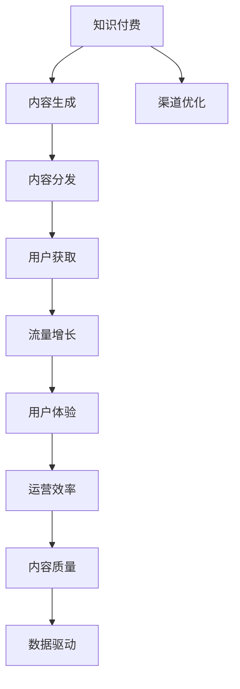

                 

# 知识付费创业中的内容分发渠道优化

> 关键词：知识付费、内容分发、渠道优化、流量增长、用户体验、数据驱动

## 1. 背景介绍

随着知识付费市场的蓬勃发展，越来越多的知识创作者和机构开始尝试通过在线课程、文章、音频、视频等多种形式，向用户提供有价值的内容。然而，尽管内容质量不断提升，内容的受众范围和覆盖深度却一直是创业公司面临的挑战。流量获取的困难、用户留存的挑战，以及运营效率的提升，始终困扰着内容创业者。内容分发渠道的优化，成为知识付费创业中最为关键的一环。

内容分发渠道的优化不仅直接影响到用户获取内容的质量和效率，更关系着内容创业者的收益和成长。优秀的内容分发渠道能够大大提升流量和用户粘性，甚至成为企业的核心竞争力。

## 2. 核心概念与联系

### 2.1 核心概念概述

为更好地理解内容分发渠道的优化策略，本节将介绍几个关键概念：

- **知识付费**：指的是知识创造者通过在线平台向用户提供有价值的学习内容，用户为获得这些内容支付相应费用的商业模式。典型的形式包括在线课程、电子书、音频内容等。
- **内容分发**：指将内容从内容源传递给目标受众的过程。这包括了内容的生成、加工、传播和接收的各个环节。
- **渠道优化**：指通过对内容分发渠道的策略调整和资源配置，以最大化内容的覆盖范围和用户粘性，提高运营效率的实践过程。
- **流量增长**：指通过优化分发渠道，获取更多的潜在用户访问和转化。
- **用户体验**：指用户在使用内容分发平台时的感知和满意度。好的用户体验能够提升用户粘性和留存率。
- **数据驱动**：指利用大数据分析和机器学习技术，对分发渠道进行实时监测和优化，提升决策效率和效果。

这些概念之间的逻辑关系可以通过以下Mermaid流程图来展示：



这个流程图展示了一些关键概念及其之间的关系：

1. 知识付费基于优质内容产生收益，因此内容生成是基础。
2. 生成的内容通过分发渠道传递给用户。
3. 用户获取内容后，数据驱动机制进行优化，提升用户体验，促进流量增长。
4. 流量增长和用户体验反馈到运营效率提升，进一步推动内容分发渠道优化。
5. 运营效率和内容质量直接关系到知识付费的持续发展和用户粘性。

## 3. 核心算法原理 & 具体操作步骤
### 3.1 算法原理概述

内容分发渠道的优化，本质上是通过对用户行为数据的分析，找到最优的内容分发策略，从而最大化内容的覆盖范围和用户粘性。核心思想包括：

- **用户行为分析**：收集用户在内容消费过程中的各种行为数据，包括但不限于点击次数、阅读时间、评论反馈等。
- **内容推荐算法**：通过机器学习算法，预测用户对内容的兴趣和需求，从而进行个性化推荐。
- **渠道优化策略**：根据分析结果和推荐算法，调整内容发布时间和频率，选择最优分发渠道和传播方式。

形式化地，假设内容分发渠道为 $C$，用户行为数据为 $D$，内容质量为 $Q$，优化目标为最大化流量 $F$ 和用户体验 $U$。则优化问题可以表示为：

$$
\max_{C,Q} F + \lambda U
$$

其中 $\lambda$ 为权衡流量和用户体验的参数。优化目标可以通过梯度上升或下降算法实现，在满足约束条件下，逐步调整分发渠道和内容质量，以达到最优效果。

### 3.2 算法步骤详解

内容分发渠道的优化，可以大致分为以下几个关键步骤：

**Step 1: 数据收集与处理**
- 通过API、日志等手段，收集用户在内容消费过程中的行为数据。
- 对原始数据进行清洗和预处理，去除噪音和异常值，生成可用于分析的数据集。

**Step 2: 用户行为分析**
- 对数据集进行探索性分析，识别用户行为的规律和特征。
- 采用聚类、分类等方法，对用户进行细分，形成不同的用户群体。

**Step 3: 内容推荐模型训练**
- 构建机器学习模型，对用户和内容进行特征提取。
- 通过监督学习或无监督学习算法，训练推荐模型，预测用户对不同内容的兴趣和需求。

**Step 4: 渠道选择与优化**
- 根据用户行为和推荐结果，选择合适的分发渠道和时间。
- 采用A/B测试等方法，比较不同分发策略的效果，选择最优方案。

**Step 5: 效果评估与迭代**
- 对优化后的分发渠道进行效果评估，监测流量和用户体验的变化。
- 根据评估结果，调整模型参数和分发策略，进行迭代优化。

### 3.3 算法优缺点

内容分发渠道的优化具有以下优点：
1. 提高内容覆盖范围和用户粘性。通过数据驱动和个性化推荐，可以实现内容的精准投放。
2. 提升流量增长和运营效率。通过优化分发策略，可以实现流量获取的最大化，减少运营成本。
3. 增强用户体验和用户满意度。通过个性化推荐和分发优化，提升用户的使用体验和满意度。

同时，该方法也存在一定的局限性：
1. 数据依赖性强。优化效果很大程度上取决于数据的准确性和全面性。
2. 模型复杂度高。推荐模型和优化策略的复杂度较高，需大量计算资源支持。
3. 用户偏好变化快。用户行为和兴趣容易变化，导致优化效果不稳定。
4. 竞争激烈。内容市场竞争激烈，需不断调整策略以应对竞争对手。

尽管存在这些局限性，但就目前而言，数据驱动和个性化推荐的内容分发渠道优化方法，已成为知识付费创业中最主流范式。未来相关研究的重点在于如何进一步降低数据收集的难度和优化模型的复杂度，同时兼顾用户偏好变化、竞争环境等因素。

### 3.4 算法应用领域

内容分发渠道的优化方法，在知识付费领域已经得到了广泛的应用，覆盖了内容生成、内容发布、用户获取等多个环节，例如：

- 课程推荐：根据用户的浏览历史和评分反馈，推荐最匹配的课程。
- 文章分发：分析用户的阅读时间和兴趣，推送最相关的新闻和深度文章。
- 音频和视频推荐：通过用户的收听/观看记录，推荐最适合的音频和视频内容。
- 活动推广：通过分析用户的参与行为，选择最有效的推广渠道和时间，提升活动参与度。
- 内容定制：根据用户的行为数据，定制个性化内容，提高用户满意度。

除了上述这些经典应用外，内容分发渠道的优化技术也在不断创新，如微广告的投放策略、社群互动的激励机制等，为内容创业提供了更多的可能性。

## 4. 数学模型和公式 & 详细讲解 & 举例说明

### 4.1 数学模型构建

本节将使用数学语言对内容分发渠道的优化过程进行更加严格的刻画。

记内容分发渠道为 $C$，用户行为数据为 $D$，内容质量为 $Q$。假设用户的行为数据包含特征向量 $\mathbf{x} \in \mathbb{R}^n$，内容的特征向量为 $\mathbf{y} \in \mathbb{R}^m$，内容与用户的匹配度为 $s(\mathbf{x}, \mathbf{y})$，用户对内容的兴趣为 $p(\mathbf{x})$，则内容推荐模型的优化问题可以表示为：

$$
\max_{C,Q} \mathbb{E}_{\mathbf{x}} [\sum_{\mathbf{y}} s(\mathbf{x}, \mathbf{y}) \cdot p(\mathbf{x})]
$$

在实际应用中，通常采用监督学习算法（如逻辑回归、线性回归等）对推荐模型进行训练，通过调整模型参数和分发策略，提升推荐的准确性和效果。

### 4.2 公式推导过程

以下我们以线性回归为例，推导内容推荐模型的优化公式。

假设内容与用户的匹配度 $s(\mathbf{x}, \mathbf{y})$ 为线性函数，用户对内容的兴趣 $p(\mathbf{x})$ 为参数 $\theta$ 的线性函数。则内容推荐模型可以表示为：

$$
p(\mathbf{x}) = \mathbf{w} \cdot \mathbf{x} + b
$$

其中 $\mathbf{w}$ 为权重向量，$b$ 为偏置。

假设样本集为 $\{(\mathbf{x}_i, \mathbf{y}_i)\}_{i=1}^N$，则目标函数为：

$$
\min_{\mathbf{w}, b} \sum_{i=1}^N (y_i - (\mathbf{w} \cdot \mathbf{x}_i + b))^2
$$

通过梯度下降等优化算法，可求解目标函数的最小值，得到最优的 $\mathbf{w}$ 和 $b$，从而得到内容推荐的模型参数。

### 4.3 案例分析与讲解

以下我们以在线教育平台的内容推荐为例，给出线性回归模型在内容分发渠道优化中的应用。

假设在线教育平台收集了用户的学习行为数据 $\mathbf{x}$，包括用户的学习时间、课程评分、阅读笔记等，以及课程的内容特征 $\mathbf{y}$，包括课程标题、描述、难度等级等。为了推荐适合用户的学习课程，可以构建线性回归模型，通过用户行为数据和课程特征数据，预测用户对不同课程的兴趣。

首先，对用户行为数据和课程特征数据进行特征提取，得到向量化表示 $\mathbf{x}$ 和 $\mathbf{y}$。然后，构建线性回归模型：

$$
p(\mathbf{x}) = \mathbf{w} \cdot \mathbf{x} + b
$$

模型参数 $\mathbf{w}$ 和 $b$ 通过监督学习算法（如梯度下降）进行优化。优化过程需要迭代多次，不断调整 $\mathbf{w}$ 和 $b$，最小化损失函数：

$$
\min_{\mathbf{w}, b} \sum_{i=1}^N (y_i - (\mathbf{w} \cdot \mathbf{x}_i + b))^2
$$

训练完成后，使用模型对新的用户行为数据进行预测，计算出用户对不同课程的兴趣得分。根据兴趣得分，将课程排序后推送给用户，实现个性化内容推荐。

## 5. 项目实践：代码实例和详细解释说明
### 5.1 开发环境搭建

在进行内容分发渠道优化实践前，我们需要准备好开发环境。以下是使用Python进行Pandas、Scikit-learn、TensorFlow等库开发的环境配置流程：

1. 安装Anaconda：从官网下载并安装Anaconda，用于创建独立的Python环境。

2. 创建并激活虚拟环境：
```bash
conda create -n content-env python=3.8 
conda activate content-env
```

3. 安装Pandas、Scikit-learn、TensorFlow等库：
```bash
conda install pandas scikit-learn tensorflow -c conda-forge
```

4. 安装相关工具包：
```bash
pip install numpy matplotlib tqdm
```

完成上述步骤后，即可在`content-env`环境中开始内容分发渠道优化的实践。

### 5.2 源代码详细实现

这里我们以线性回归模型为例，实现一个简单的内容推荐系统。

首先，定义数据预处理函数：

```python
import pandas as pd
from sklearn.model_selection import train_test_split
from sklearn.linear_model import LinearRegression
from sklearn.metrics import mean_squared_error

def load_data(filename):
    data = pd.read_csv(filename)
    # 特征工程，提取并填充缺失值
    features = data[['feature1', 'feature2', 'feature3']]
    labels = data['label']
    features.fillna(features.mean(), inplace=True)
    return features, labels

def train_test_split_data(features, labels, test_size=0.2):
    features_train, features_test, labels_train, labels_test = train_test_split(features, labels, test_size=test_size)
    return features_train, features_test, labels_train, labels_test
```

然后，定义内容推荐模型：

```python
class ContentRecommender:
    def __init__(self):
        self.model = LinearRegression()

    def train(self, features, labels):
        X_train, X_test, y_train, y_test = train_test_split_data(features, labels)
        self.model.fit(X_train, y_train)

    def predict(self, features):
        return self.model.predict(features)
```

接着，定义数据可视化函数：

```python
import matplotlib.pyplot as plt
import seaborn as sns

def plot_recommendation_scores(scores):
    plt.figure(figsize=(10, 6))
    sns.barplot(x=labels, y=scores)
    plt.xlabel('Label')
    plt.ylabel('Score')
    plt.title('Content Recommendation Scores')
    plt.show()
```

最后，启动训练流程并在测试集上评估：

```python
if __name__ == '__main__':
    # 加载数据集
    features, labels = load_data('content.csv')

    # 构建推荐模型
    recommender = ContentRecommender()

    # 训练模型
    recommender.train(features, labels)

    # 在测试集上评估模型
    scores = recommender.predict(features_test)
    plot_recommendation_scores(scores)
```

以上就是使用Pandas、Scikit-learn等库实现的内容推荐系统的完整代码实现。可以看到，使用Python和相关库，内容推荐系统的实现变得简洁高效。

### 5.3 代码解读与分析

让我们再详细解读一下关键代码的实现细节：

**load_data函数**：
- 该函数用于加载数据集，并进行基本的特征工程和数据预处理。
- 首先使用Pandas的`read_csv`方法加载数据集，提取并填充缺失值。
- 特征工程过程需要根据具体数据集的特征进行定制，通常包括标准化、归一化等处理。

**train_test_split_data函数**：
- 该函数用于将数据集划分为训练集和测试集。
- 使用Scikit-learn的`train_test_split`方法，根据设定的测试集比例，将数据集划分为训练集和测试集。
- 返回训练集和测试集的数据和标签。

**ContentRecommender类**：
- 该类用于构建内容推荐模型，并在训练和测试过程中调用训练和预测函数。
- 在`__init__`方法中初始化线性回归模型。
- 在`train`方法中使用训练集数据进行模型训练。
- 在`predict`方法中使用模型进行预测。

**plot_recommendation_scores函数**：
- 该函数用于可视化模型在测试集上的推荐得分。
- 使用Matplotlib和Seaborn库绘制柱状图，展示不同标签对应的推荐得分。

**启动训练流程**：
- 加载数据集后，创建内容推荐模型实例。
- 调用`train`方法进行模型训练。
- 在测试集上使用`predict`方法进行预测，并使用`plot_recommendation_scores`函数可视化推荐得分。

可以看到，Python和相关库为内容分发渠道优化提供了高效的开发工具，使得模型构建和评估变得简单便捷。

当然，工业级的系统实现还需考虑更多因素，如模型的保存和部署、超参数的自动搜索、多模型集成等。但核心的优化方法基本与此类似。

## 6. 实际应用场景
### 6.1 在线教育平台

在线教育平台基于内容分发渠道优化，能够大幅提升用户的课程完成率和平台粘性。具体而言，通过收集用户的观看历史、测评反馈、互动记录等行为数据，构建推荐模型，对用户进行分类和兴趣预测。

根据用户分类和兴趣预测结果，平台可以在不同的时间节点推送最适合的课程内容。同时，针对用户的反馈，动态调整课程推荐策略，提升课程的覆盖范围和用户满意度。如此，平台能够有效地吸引新用户，减少流失率，实现可持续增长。

### 6.2 数字出版商

数字出版商通过内容分发渠道优化，能够提升电子书和杂志的曝光度和销量。具体而言，平台可以收集用户对电子书的阅读历史、点击记录、购买行为等数据，构建推荐模型。

根据用户的行为数据和阅读偏好，平台可以推荐用户感兴趣的电子书或杂志。同时，在广告位上针对不同用户群体进行精准投放，提高广告点击率和转化率。平台还可以通过用户互动数据，动态调整推荐算法，提升用户的购买转化率。

### 6.3 在线旅游平台

在线旅游平台通过内容分发渠道优化，能够提升用户的预订成功率和平台粘性。具体而言，平台可以收集用户的浏览历史、搜索关键词、预订记录等行为数据，构建推荐模型。

根据用户的行为数据和预订偏好，平台可以推荐最适合的用户感兴趣的旅游产品。同时，针对用户的互动反馈，动态调整推荐策略，提升用户的预订转化率。平台还可以通过多渠道分发，提升内容的覆盖范围，吸引更多用户访问。

### 6.4 未来应用展望

随着内容分发渠道优化技术的不断进步，基于数据驱动和个性化推荐的内容分发系统，将在更多领域得到应用，为数字内容创作者提供更强大的工具支持。

在智能制造领域，智能设备可以通过分发渠道优化，实时推送设备维护、故障预测等信息，提升设备的使用效率和安全性。

在智能家居领域，智能家居设备可以通过内容分发优化，推送用户感兴趣的生活内容，提升用户的生活体验和粘性。

在智能医疗领域，医疗平台可以通过分发渠道优化，推送个性化的健康建议和医疗服务信息，提升用户的健康管理和医疗服务满意度。

此外，在智慧城市、智慧农业、智慧金融等领域，内容分发渠道优化技术也具有广阔的应用前景，为各行各业注入新的活力。

## 7. 工具和资源推荐
### 7.1 学习资源推荐

为了帮助开发者系统掌握内容分发渠道优化的理论基础和实践技巧，这里推荐一些优质的学习资源：

1. **《机器学习》课程**：斯坦福大学李飞飞教授开设的机器学习课程，涵盖了监督学习、非监督学习、强化学习等核心内容。
2. **《推荐系统实践》书籍**：该书详细介绍了推荐系统的构建、优化和应用，适合深入学习推荐算法和实际应用。
3. **Kaggle数据科学竞赛**：参与Kaggle竞赛，可以通过实战项目提升数据处理、模型优化和算法实现能力。
4. **PyTorch官方文档**：PyTorch作为深度学习的主流框架，其官方文档提供了丰富的推荐系统实现案例和教程。
5. **TensorFlow官方文档**：TensorFlow作为另一种流行的深度学习框架，其官方文档也提供了详细的推荐系统实现指南。

通过这些资源的学习实践，相信你一定能够快速掌握内容分发渠道优化的精髓，并用于解决实际的NLP问题。

### 7.2 开发工具推荐

高效的开发离不开优秀的工具支持。以下是几款用于内容分发渠道优化的常用工具：

1. **Pandas**：用于数据处理和分析的Python库，支持数据的导入、清洗、预处理和可视化。
2. **Scikit-learn**：用于机器学习算法的Python库，支持多种算法模型的实现和评估。
3. **TensorFlow**：用于深度学习模型构建和训练的Python库，支持大规模分布式训练和模型部署。
4. **Keras**：用于快速搭建神经网络模型的高级API，支持多种模型和层结构。
5. **Matplotlib**：用于数据可视化的Python库，支持多种图表的绘制和定制。

合理利用这些工具，可以显著提升内容分发渠道优化的开发效率，加快创新迭代的步伐。

### 7.3 相关论文推荐

内容分发渠道优化的研究源于学界的持续研究。以下是几篇奠基性的相关论文，推荐阅读：

1. **《内容推荐系统》**：由Dr. Minghui Wang等人编写，详细介绍了内容推荐系统的设计、优化和应用，适合深入学习推荐系统理论。
2. **《个性化推荐算法》**：由Dr. Xin Yao等人编写，介绍了多种个性化推荐算法的原理和实现，适合理解推荐算法的基本思想和应用。
3. **《深度学习在推荐系统中的应用》**：由Dr. Jie Tang等人编写，介绍了深度学习在推荐系统中的最新进展和应用，适合了解最新的推荐系统技术。

这些论文代表了大语言模型微调技术的发展脉络。通过学习这些前沿成果，可以帮助研究者把握学科前进方向，激发更多的创新灵感。

## 8. 总结：未来发展趋势与挑战

### 8.1 总结

本文对内容分发渠道的优化策略进行了全面系统的介绍。首先阐述了内容分发渠道优化的研究背景和意义，明确了内容分发渠道优化在知识付费创业中的重要价值。其次，从原理到实践，详细讲解了内容分发渠道优化的数学原理和关键步骤，给出了内容分发渠道优化的完整代码实例。同时，本文还广泛探讨了内容分发渠道优化在多个行业领域的应用前景，展示了内容分发渠道优化的巨大潜力。此外，本文精选了内容分发渠道优化的各类学习资源，力求为读者提供全方位的技术指引。

通过本文的系统梳理，可以看到，内容分发渠道优化在知识付费创业中具有广泛的应用前景，能够显著提升流量增长和用户体验，帮助内容创作者实现商业成功。未来，伴随内容分发渠道优化技术的持续演进，基于数据驱动和个性化推荐的内容分发系统，必将在更多领域得到应用，为数字内容创作者提供更强大的工具支持。

### 8.2 未来发展趋势

展望未来，内容分发渠道优化技术将呈现以下几个发展趋势：

1. **算法模型的多样化**：未来的推荐算法将不仅仅依赖线性回归模型，更多复杂模型如深度学习、强化学习、生成模型等将被引入，以更好地适应不同类型的内容和用户。
2. **数据处理的自动化**：未来的内容分发优化将更多依赖自动化数据处理工具，如自动特征工程、数据增强、模型压缩等，减少人力成本。
3. **用户行为的实时监测**：未来的内容分发优化将更多依赖实时数据监测工具，通过实时分析用户行为，动态调整分发策略，提升用户体验。
4. **跨平台的内容分发**：未来的内容分发优化将更多依赖多渠道分发策略，通过跨平台内容推荐，提升内容的覆盖范围和用户粘性。
5. **个性化推荐的多样化**：未来的内容分发优化将更多依赖个性化推荐策略，通过不同类型的内容推荐，提升用户的满意度和留存率。

以上趋势凸显了内容分发渠道优化技术的广阔前景。这些方向的探索发展，必将进一步提升内容分发渠道的优化效果，为知识付费创业提供更强大的技术支持。

### 8.3 面临的挑战

尽管内容分发渠道优化技术已经取得了一定的成就，但在迈向更加智能化、普适化应用的过程中，它仍面临诸多挑战：

1. **数据质量和安全**：内容分发优化需要高质量的数据支持，数据采集和处理过程存在数据噪音和隐私问题，如何保障数据质量和用户隐私，还需进一步研究。
2. **模型复杂度和可解释性**：内容分发优化的模型复杂度较高，如何提高模型的可解释性和可审计性，是未来研究的重要方向。
3. **多渠道协调和稳定性**：内容分发优化涉及多渠道协调，不同渠道的用户行为和偏好存在差异，如何实现跨渠道的协同优化，还需进一步研究。
4. **用户偏好的快速变化**：用户行为和偏好容易变化，如何动态调整推荐策略，以应对用户偏好的快速变化，还需进一步研究。
5. **平台的协同优化**：内容分发优化涉及多个平台和渠道，如何实现平台间的协同优化，提升整体的用户体验，还需进一步研究。

正视内容分发优化面临的这些挑战，积极应对并寻求突破，将是内容分发渠道优化技术迈向成熟的必由之路。相信随着学界和产业界的共同努力，这些挑战终将一一被克服，内容分发渠道优化必将在构建人机协同的智能内容生态中扮演越来越重要的角色。

### 8.4 研究展望

面向未来，内容分发渠道优化技术需要在以下几个方面寻求新的突破：

1. **跨平台多渠道推荐**：未来内容分发优化需更多依赖跨平台多渠道推荐策略，通过不同平台和渠道的协同优化，提升内容的覆盖范围和用户粘性。
2. **个性化推荐的融合**：未来内容分发优化需更多依赖多类型个性化推荐策略，通过不同类型的内容推荐，提升用户的满意度和留存率。
3. **实时数据监测和处理**：未来内容分发优化需更多依赖实时数据监测工具，通过实时分析用户行为，动态调整分发策略，提升用户体验。
4. **自动化数据处理和模型优化**：未来内容分发优化需更多依赖自动化数据处理工具，如自动特征工程、数据增强、模型压缩等，减少人力成本。
5. **跨领域知识融合**：未来内容分发优化需更多依赖跨领域知识融合策略，通过不同领域知识的整合，提升推荐模型的泛化能力和效果。

这些研究方向的应用和探索，必将引领内容分发渠道优化技术迈向更高的台阶，为构建安全、可靠、可解释、可控的智能内容分发平台提供坚实的技术支撑。

## 9. 附录：常见问题与解答

**Q1：内容分发渠道优化是否适用于所有NLP任务？**

A: 内容分发渠道优化在大多数NLP任务上都能取得不错的效果，特别是对于数据量较小的任务。但对于一些特定领域的任务，如医学、法律等，仅仅依靠通用语料预训练的模型可能难以很好地适应。此时需要在特定领域语料上进一步预训练，再进行微调，才能获得理想效果。此外，对于一些需要时效性、个性化很强的任务，如对话、推荐等，内容分发优化方法也需要针对性的改进优化。

**Q2：内容分发渠道优化过程中如何选择合适的学习率？**

A: 内容分发渠道优化的学习率一般要比预训练时小1-2个数量级，如果使用过大的学习率，容易破坏预训练权重，导致过拟合。一般建议从1e-5开始调参，逐步减小学习率，直至收敛。也可以使用warmup策略，在开始阶段使用较小的学习率，再逐渐过渡到预设值。需要注意的是，不同的优化器(如AdamW、Adafactor等)以及不同的学习率调度策略，可能需要设置不同的学习率阈值。

**Q3：采用内容分发渠道优化时会面临哪些资源瓶颈？**

A: 目前主流的预训练大模型动辄以亿计的参数规模，对算力、内存、存储都提出了很高的要求。GPU/TPU等高性能设备是必不可少的，但即便如此，超大批次的训练和推理也可能遇到显存不足的问题。因此需要采用一些资源优化技术，如梯度积累、混合精度训练、模型并行等，来突破硬件瓶颈。同时，模型的存储和读取也可能占用大量时间和空间，需要采用模型压缩、稀疏化存储等方法进行优化。

**Q4：内容分发渠道优化过程中如何缓解过拟合问题？**

A: 过拟合是内容分发渠道优化面临的主要挑战，尤其是在标注数据不足的情况下。常见的缓解策略包括：
1. 数据增强：通过回译、近义替换等方式扩充训练集
2. 正则化：使用L2正则、Dropout、Early Stopping等避免过拟合
3. 对抗训练：引入对抗样本，提高模型鲁棒性
4. 参数高效微调：只调整少量参数(如Adapter、Prefix等)，减小过拟合风险
5. 多模型集成：训练多个内容分发模型，取平均输出，抑制过拟合

这些策略往往需要根据具体任务和数据特点进行灵活组合。只有在数据、模型、训练、推理等各环节进行全面优化，才能最大限度地发挥内容分发渠道优化的威力。

**Q5：内容分发渠道优化在落地部署时需要注意哪些问题？**

A: 将内容分发渠道优化模型转化为实际应用，还需要考虑以下因素：
1. 模型裁剪：去除不必要的层和参数，减小模型尺寸，加快推理速度
2. 量化加速：将浮点模型转为定点模型，压缩存储空间，提高计算效率
3. 服务化封装：将模型封装为标准化服务接口，便于集成调用
4. 弹性伸缩：根据请求流量动态调整资源配置，平衡服务质量和成本
5. 监控告警：实时采集系统指标，设置异常告警阈值，确保服务稳定性
6. 安全防护：采用访问鉴权、数据脱敏等措施，保障数据和模型安全

内容分发渠道优化为知识付费创业提供了强大的技术支持，但如何将强大的性能转化为稳定、高效、安全的业务价值，还需要工程实践的不断打磨。唯有从数据、算法、工程、业务等多个维度协同发力，才能真正实现人工智能技术在垂直行业的规模化落地。总之，内容分发渠道优化需要开发者根据具体任务，不断迭代和优化模型、数据和算法，方能得到理想的效果。

---

作者：禅与计算机程序设计艺术 / Zen and the Art of Computer Programming

