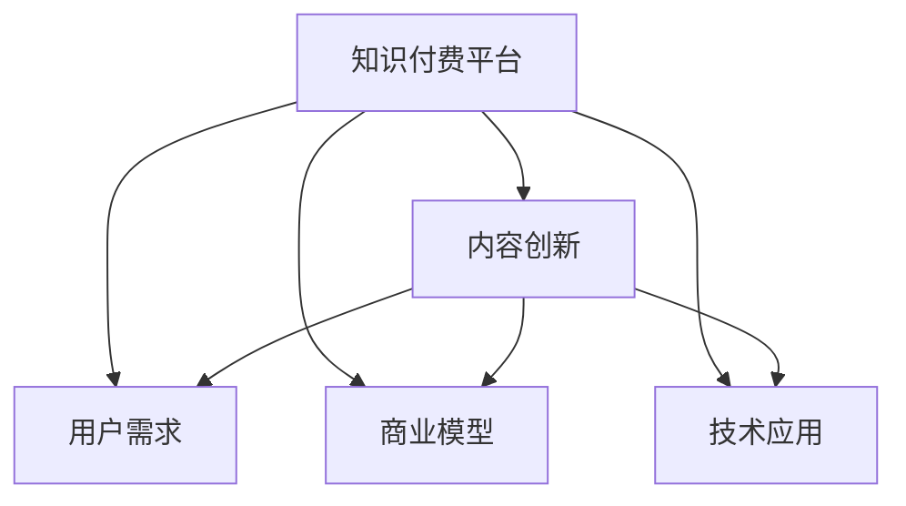

                 

# 知识付费创业中的内容创新思路

> 关键词：知识付费,内容创新,用户需求,商业模型,技术应用

## 1. 背景介绍

随着知识经济时代的到来，知识付费日益成为一种新兴的商业模式，其以高价值、低成本、灵活便捷等特点吸引了大批用户的关注。知识付费涵盖了广泛的内容领域，包括在线课程、咨询答疑、技术分享、市场分析等。尽管市场规模庞大，但多数知识付费平台依旧面临内容同质化、用户粘性低、收益模式单一等问题，亟需新的内容创新思路以实现可持续发展。

本文聚焦于知识付费创业中的内容创新思路，探讨如何在满足用户需求的同时，通过内容创新提高平台竞争力，形成差异化优势，并最终实现商业模式变现。

## 2. 核心概念与联系

### 2.1 核心概念概述

知识付费创业涉及多个关键概念，主要包括：

- **知识付费平台**：提供专业知识和技能的学习、交流与交易的平台，如得到、网易云课堂、知乎live等。
- **内容创新**：指在知识付费平台上创造和传播新颖、有价值的内容，满足用户不断增长的知识需求，实现平台与用户间的双向互动。
- **用户需求**：知识付费用户关注的痛点和需求，包括职业发展、自我提升、兴趣爱好等。
- **商业模型**：知识付费平台的盈利模式，如订阅制、按需支付、广告、会员增值服务等。
- **技术应用**：利用人工智能、大数据、区块链等前沿技术，提升平台运营效率，增强内容推荐、用户分析、版权保护等功能。

通过这些概念，我们可以构建知识付费创业的基本框架，并逐一探讨如何通过内容创新驱动平台的发展。

### 2.2 核心概念原理和架构的 Mermaid 流程图



该图展示了知识付费平台与内容创新、用户需求、商业模型、技术应用之间的联系。内容创新直接面向用户需求，通过技术应用实现商业变现，形成平台运营闭环。

## 3. 核心算法原理 & 具体操作步骤

### 3.1 算法原理概述

知识付费平台的内容创新，核心在于如何高效地匹配用户需求和高质量的内容。基于用户行为数据，通过机器学习算法进行内容推荐，帮助用户发现感兴趣的知识资源，提升用户粘性和转化率。这一过程涉及以下核心算法原理：

1. **协同过滤**：通过分析用户行为数据，推荐类似用户喜欢的内容。
2. **基于内容的推荐**：根据内容本身的特点（如作者、主题、标签等），推荐相关知识。
3. **混合推荐算法**：结合协同过滤和基于内容的推荐，提升推荐效果。

### 3.2 算法步骤详解

内容创新算法通常包括以下关键步骤：

1. **数据采集与预处理**：收集用户行为数据（如点击、浏览、评论、收藏等），进行数据清洗和特征提取。
2. **用户画像构建**：基于用户行为数据，构建用户画像，识别不同用户的需求和偏好。
3. **内容特征提取**：提取内容特征，如作者、主题、难度等级、时间戳等，作为推荐的基础。
4. **推荐算法实现**：结合协同过滤和基于内容的推荐算法，进行模型训练和优化。
5. **推荐结果排序**：根据模型预测结果和用户历史行为数据，对推荐内容进行排序，生成推荐列表。

### 3.3 算法优缺点

基于算法的内容推荐具有以下优点：

- **高效匹配**：通过数据分析和机器学习算法，能够快速找到满足用户需求的内容。
- **个性化推荐**：根据用户行为和内容特征，提供高度个性化的推荐服务。
- **实时更新**：可以实时分析用户行为数据，更新推荐内容，保持内容的新鲜度。

同时，该方法也存在一些缺点：

- **数据隐私问题**：需要收集和分析用户行为数据，可能涉及隐私保护问题。
- **模型复杂性**：算法模型较为复杂，需要大量的数据和计算资源进行训练和优化。
- **过度推荐问题**：推荐的过度依赖算法，可能导致冷门内容被忽视。

### 3.4 算法应用领域

内容推荐算法广泛应用于知识付费平台，如得到、网易云音乐、知乎live等，主要作用包括：

1. **个性化推荐**：为用户提供个性化内容推荐，提升用户粘性和满意度。
2. **热门内容挖掘**：挖掘平台热门内容，指导内容制作和推广。
3. **内容推荐优化**：根据用户反馈和行为数据，不断优化推荐算法，提升推荐效果。
4. **用户行为分析**：通过分析用户行为数据，进行市场调研和用户需求分析。

## 4. 数学模型和公式 & 详细讲解 & 举例说明

### 4.1 数学模型构建

基于协同过滤和基于内容的推荐算法，构建推荐模型的数学模型如下：

1. **协同过滤算法**：假设用户$u$和物品$i$之间存在隐含的用户-物品评分矩阵$R$，用户和物品的特征向量分别为$U$和$I$。协同过滤算法通过计算用户$u$和物品$i$的相似度，预测用户对物品的评分$R_{ui}$。

2. **基于内容的推荐算法**：假设内容$c$包含多个特征$X$，内容特征和用户偏好之间存在映射关系$F$，内容$c$和用户$u$之间的相似度$S$可通过内容特征$X$计算得到。

### 4.2 公式推导过程

1. **协同过滤算法**：
   $$
   \hat{R}_{ui} = \alpha_1\sum_{j=1}^M r_{uj}r_{ji} + \alpha_2\sum_{k=1}^N u_{uk}i_{kj}
   $$
   其中，$r_{uj}$为物品$i$被用户$u$评分，$u_{uk}$和$i_{kj}$为用户$u$和物品$i$的特征，$\alpha_1$和$\alpha_2$为调节系数。

2. **基于内容的推荐算法**：
   $$
   S_{ui} = \langle X_c, F_u \rangle
   $$
   其中，$\langle \cdot, \cdot \rangle$为向量点乘，$F_u$为用户$u$的特征向量。

### 4.3 案例分析与讲解

假设知识付费平台上有用户$u$和内容$c$，我们通过协同过滤算法计算出$u$和$c$的相似度，然后根据基于内容的推荐算法，计算出$c$和用户$u$的相似度，最终根据相似度对$c$进行推荐。

## 5. 项目实践：代码实例和详细解释说明

### 5.1 开发环境搭建

要实现内容推荐算法，首先需要搭建相应的开发环境。这里提供一个基于Python的开发环境搭建示例：

1. 安装Anaconda：从官网下载并安装Anaconda，用于创建独立的Python环境。
   ```bash
   conda create -n recomm_system python=3.8
   conda activate recomm_system
   ```

2. 安装必要的依赖库：包括Scikit-learn、TensorFlow、PyTorch等。
   ```bash
   pip install scikit-learn tensorflow pytorch
   ```

3. 准备数据集：获取用户行为数据和内容特征数据，并进行预处理和特征提取。

### 5.2 源代码详细实现

以下是一个基于协同过滤算法的推荐系统实现示例，使用Scikit-learn库：

```python
from sklearn.neighbors import NearestNeighbors
from sklearn.metrics.pairwise import cosine_similarity
import numpy as np

# 用户行为数据
user_ratings = np.array([[1, 2, 3, 4], [4, 3, 2, 1], [2, 1, 3, 4]])

# 物品特征
item_features = np.array([[1, 2, 3], [4, 5, 6], [7, 8, 9]])

# 构建用户-物品评分矩阵
R = user_ratings

# 构建物品-特征矩阵
I = item_features

# 计算用户-物品评分矩阵的评分预测
K = 5  # 邻居数
neighbors = NearestNeighbors(n_neighbors=K, algorithm='brute').fit(R)
_, indices = neighbors.kneighbors(R)
predicted_ratings = np.zeros_like(R)
for u in range(R.shape[0]):
    for j in range(R.shape[1]):
        predicted_ratings[u][j] = R[indices[u][j]][j]

# 输出预测评分
print(predicted_ratings)
```

### 5.3 代码解读与分析

**代码说明**：
1. 首先，我们准备了一个简单的用户行为数据和物品特征数据，构建用户-物品评分矩阵$R$和物品-特征矩阵$I$。
2. 使用NearestNeighbors算法进行用户-物品相似度计算，预测用户对物品的评分。
3. 根据预测评分，生成推荐列表。

**算法解释**：
1. 通过NearestNeighbors算法计算用户-物品的相似度，找出用户$u$最相似的$K$个物品。
2. 根据相似物品的评分，预测用户$u$对物品$i$的评分，生成推荐列表。

**注意事项**：
1. 实际应用中，数据集应根据平台的具体情况进行设计，如用户行为数据包括点击、评论、分享等行为，特征数据包括内容标签、难度等级、发布时间等。
2. 需要针对不同类型的数据，选择适合的特征提取和相似度计算方法。
3. 可以结合多种推荐算法，提升推荐效果。

### 5.4 运行结果展示

运行代码后，可以得到用户的推荐评分，并生成推荐列表。实际应用中，推荐列表会动态更新，反映用户最新的行为和兴趣。

## 6. 实际应用场景

### 6.1 个性化推荐系统

在知识付费平台上，个性化推荐系统是实现内容创新的核心。通过推荐系统，平台可以精准地匹配用户需求和高质量内容，提升用户粘性和满意度。例如，得到平台的“得到精选”功能，就是通过个性化推荐，帮助用户发现感兴趣的优质课程。

### 6.2 内容制作与推广

平台可以通过分析热门内容和用户行为数据，指导内容制作和推广策略。例如，知乎live可以根据用户对特定话题的兴趣和参与度，推广相关主题讲座，吸引更多用户参与。

### 6.3 用户需求分析

通过用户行为数据和推荐效果反馈，平台可以不断优化推荐算法，提升用户满意度。例如，网易云音乐可以根据用户听歌行为，推荐符合其喜好的音乐和专辑。

### 6.4 未来应用展望

未来，知识付费平台的内容创新将更具智能化和个性化。随着机器学习、自然语言处理等技术的进步，平台将更加精准地理解用户需求，推荐更多元化、高价值的内容。例如，智能语音助手可以识别用户的语言习惯，推荐相应课程或讲座；虚拟教练可以根据用户的学习进度和反馈，提供个性化辅导和建议。

## 7. 工具和资源推荐

### 7.1 学习资源推荐

以下是一些有助于知识付费创业中内容创新的学习资源：

1. **《推荐系统实战》**：详细介绍了推荐算法的原理和实现，涵盖协同过滤、基于内容的推荐、混合推荐等多种算法。
2. **Coursera《机器学习》课程**：由斯坦福大学教授Andrew Ng主讲，深入浅出地讲解了机器学习基础知识和推荐系统构建。
3. **Kaggle竞赛**：通过参与推荐系统相关的Kaggle竞赛，可以学习多种推荐算法并获取实战经验。
4. **书籍《机器学习实战》**：介绍了推荐系统、聚类分析、文本挖掘等多种算法，适合快速入门和实践。

### 7.2 开发工具推荐

以下是几款用于知识付费内容创新的开发工具：

1. **Python**：Python是推荐系统开发的主流语言，具有丰富的开源库和框架。
2. **Scikit-learn**：提供了简单易用的机器学习算法和工具，适合快速开发和验证推荐模型。
3. **TensorFlow**：Google开发的深度学习框架，适合大规模分布式训练。
4. **PyTorch**：Facebook开发的深度学习框架，具有动态图和灵活的API设计。
5. **Jupyter Notebook**：用于数据探索、模型验证和报告撰写的交互式编程环境。

### 7.3 相关论文推荐

以下是几篇推荐系统相关的经典论文，推荐阅读：

1. **《Trustworthy Recommendation Algorithms》**：提出可信推荐算法，降低推荐系统的偏见和误导。
2. **《Improving Precision at K in Top-K Ranking Based on Implicit Feedback》**：针对隐式反馈推荐，提出改进精度的方法。
3. **《Hybrid recommender systems: Survey and experimental evaluation》**：对混合推荐算法进行了系统性回顾和实验评估。
4. **《Deep Learning for Recommendation Systems》**：总结了深度学习在推荐系统中的应用，包括嵌入学习、序列模型等。

## 8. 总结：未来发展趋势与挑战

### 8.1 研究成果总结

本文探讨了知识付费创业中的内容创新思路，重点介绍了基于协同过滤和基于内容的推荐算法，并提供了代码实例和实际应用场景。通过这些内容，读者可以初步了解知识付费平台的推荐系统设计和优化方法。

### 8.2 未来发展趋势

未来，知识付费平台的内容创新将呈现以下趋势：

1. **智能化推荐**：通过人工智能技术，实现更智能、更个性化的推荐服务。
2. **多元化内容**：推荐更多元化的内容形式，如视频课程、音频讲座、虚拟现实体验等。
3. **数据驱动**：基于用户行为数据和平台数据，持续优化推荐算法和内容制作策略。

### 8.3 面临的挑战

尽管内容创新为知识付费平台带来了新的机会，但仍需面对以下挑战：

1. **数据隐私问题**：用户数据隐私保护是知识付费平台的重要挑战。
2. **算法偏见**：推荐算法可能存在偏见，导致推荐结果不公。
3. **用户流失**：过度推荐可能导致用户疲劳和流失。
4. **技术门槛**：推荐算法和机器学习技术的复杂性，增加了内容创新的技术门槛。

### 8.4 研究展望

面对这些挑战，未来的研究需要在以下几个方面寻求新的突破：

1. **隐私保护**：探索隐私保护技术，如差分隐私、联邦学习等，保护用户数据隐私。
2. **算法公平**：引入公平性评估指标，优化推荐算法，降低偏见和歧视。
3. **模型优化**：研究更高效的推荐算法，提升推荐精度和实时性。
4. **内容多样化**：探索更多元化的内容形式，提升用户体验和参与度。

## 9. 附录：常见问题与解答

**Q1：推荐算法中的冷启动问题如何解决？**

A: 冷启动问题是指平台刚加入的新用户或新物品，没有足够的历史行为数据进行推荐。可以采用基于内容的推荐算法，根据物品特征和用户特征进行推荐；同时，通过问卷调查、兴趣描述等方式，获取用户兴趣偏好，进行初期推荐。

**Q2：如何评估推荐系统的推荐效果？**

A: 推荐系统的评估指标主要包括：准确率、召回率、F1分数、平均绝对误差等。实际应用中，通常结合多个指标进行综合评估，如用户满意度、转化率等。

**Q3：推荐系统中的协同过滤算法有哪些类型？**

A: 协同过滤算法主要包括：基于用户的协同过滤、基于物品的协同过滤、混合协同过滤等。其中，基于用户的协同过滤算法根据用户行为相似度进行推荐；基于物品的协同过滤算法根据物品相似度进行推荐；混合协同过滤算法结合用户和物品相似度进行推荐，综合考虑用户和物品的共同特征。

**Q4：推荐系统的推荐结果排序有哪些策略？**

A: 推荐系统的推荐结果排序策略主要包括：基于排序的推荐、基于阈值的推荐、混合排序推荐等。其中，基于排序的推荐根据用户评分预测结果进行排序；基于阈值的推荐根据用户评分预测结果和阈值进行二分类；混合排序推荐综合考虑多个排序策略。

**Q5：推荐系统中的用户行为数据有哪些类型？**

A: 推荐系统的用户行为数据主要包括以下类型：点击、浏览、观看、购买、评分、收藏、分享等。不同类型的行为数据可以用于不同的推荐算法和策略。

---

作者：禅与计算机程序设计艺术 / Zen and the Art of Computer Programming

