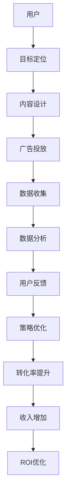

                 

# 知识付费创业中的内容营销ROI优化

> 关键词：知识付费, 内容营销, ROI, 转化率, 用户分析, 广告投放, 数据分析, 用户体验优化

## 1. 背景介绍

### 1.1 问题由来
在知识付费领域，内容营销是获取用户、提升留存、增加收入的核心驱动力。然而，随着市场竞争的日益激烈，内容营销的效果显得愈发不稳定，ROI难以保证。如何提高内容营销的效率，最大化投资回报，成为知识付费创业者需要深入研究的课题。

### 1.2 问题核心关键点
这个问题的核心关键点在于：

- 如何精准定位目标用户，通过内容满足其需求，实现高效转化？
- 如何设计高效的内容营销策略，确保广告投入获得最大回报？
- 如何通过数据驱动，优化用户行为和广告投放，提升用户体验和转化率？
- 如何实现内容生产和广告投放的协同优化，实现资源的高效配置？

### 1.3 问题研究意义
优化知识付费创业中的内容营销ROI，有助于提升平台的盈利能力，降低内容生产的成本，增加用户粘性。具体而言，有以下几点意义：

1. 降低运营成本。通过高效的内容营销策略，减少无效广告支出，提升广告转化率，降低获取新用户的成本。
2. 提升用户留存。优质的内容能够满足用户需求，增强用户粘性，提升长期价值。
3. 增加平台收入。提升广告点击率、转化率，通过付费订阅、VIP会员等方式，增加平台收入。
4. 提高用户体验。通过个性化推荐、用户分析等技术，提升用户体验，增加平台满意度。
5. 实现数据驱动。通过数据分析，优化内容策略和广告投放，实现内容的精准投放和优化。

## 2. 核心概念与联系

### 2.1 核心概念概述

在讨论如何优化知识付费创业中的内容营销ROI之前，我们先概述几个核心概念：

- **知识付费**：指用户为获取知识、技能、信息等付费购买内容，享受专家指导或服务的一种商业模式。
- **内容营销**：指通过内容展示产品、服务、品牌价值，吸引、获取、保留、转化用户的一种营销方式。
- **ROI（投资回报率）**：指投入与产出的比率，反映出投资所带来的经济收益。
- **转化率**：指访问用户中完成购买、注册等关键行为的百分比。
- **用户体验（User Experience, UX）**：指用户在使用产品过程中的感受，影响用户满意度和留存率。

这些核心概念之间存在密切联系，通过设计高效的内容营销策略，实现对目标用户的精准定位，提升用户转化率和平台收入，从而最大化投资回报率。

### 2.2 核心概念原理和架构的 Mermaid 流程图



该流程图展示了知识付费创业中内容营销ROI优化的全流程，包括目标定位、内容设计、广告投放、数据收集、数据分析、策略优化、转化率提升、收入增加和ROI优化。

## 3. 核心算法原理 & 具体操作步骤

### 3.1 算法原理概述

优化知识付费创业中的内容营销ROI，本质上是通过数据驱动的方法，不断迭代和优化内容营销策略，以实现对目标用户的精准定位、高效转化和最大化投资回报。

核心算法原理可以概括为以下几点：

1. **用户行为分析**：通过数据分析，理解用户的兴趣、需求和行为模式，实现对目标用户的精准定位。
2. **内容优化设计**：设计符合用户需求的内容形式和内容推荐策略，提升用户转化率和满意度。
3. **广告投放优化**：根据用户行为和内容偏好，优化广告投放策略，实现高效转化和最大化广告收益。
4. **数据驱动策略优化**：通过数据分析，不断优化内容营销策略，提升整体ROI。

### 3.2 算法步骤详解

基于上述算法原理，以下是优化知识付费创业中内容营销ROI的具体操作步骤：

**Step 1: 用户行为分析**
- 收集用户行为数据，包括浏览历史、点击行为、购买记录等。
- 分析用户兴趣和行为模式，确定目标用户群体。
- 使用聚类、分类等机器学习算法，细分用户群体。

**Step 2: 内容优化设计**
- 根据用户群体需求，设计符合用户兴趣的内容形式，如文章、视频、音频等。
- 设计个性化推荐算法，将优质内容推荐给目标用户。
- 进行A/B测试，评估不同内容形式和推荐策略的效果，不断优化。

**Step 3: 广告投放优化**
- 收集广告投放数据，包括点击率、转化率等关键指标。
- 分析不同广告渠道和内容对用户行为的影响。
- 根据数据分析结果，调整广告投放策略，提升广告效果。

**Step 4: 数据驱动策略优化**
- 定期收集用户反馈和广告投放数据。
- 分析数据，评估内容营销策略的效果。
- 根据数据分析结果，优化内容策略和广告投放，提升整体ROI。

### 3.3 算法优缺点

基于数据驱动的内容营销优化方法，具有以下优点：

1. 精准定位：通过数据分析，实现对目标用户的精准定位，提升广告和内容的转化率。
2. 数据驱动：通过数据驱动的策略优化，减少主观判断，提升整体效果。
3. 持续优化：通过不断的数据收集和分析，持续优化内容营销策略，实现最大化ROI。

同时，这种方法也存在一些局限性：

1. 数据质量：数据的质量和完整性直接影响分析结果和策略优化效果。
2. 算法复杂性：需要结合多种机器学习算法，算法实现较为复杂。
3. 实时性：数据分析和策略优化需要一定时间，难以实现实时响应。

### 3.4 算法应用领域

基于数据驱动的内容营销优化方法，广泛应用于知识付费平台的各个环节，具体如下：

1. **用户获取**：通过数据分析，确定目标用户群体，进行精准广告投放，提升新用户获取效率。
2. **用户留存**：设计符合用户兴趣的内容，提升用户满意度和留存率。
3. **内容生产**：优化内容形式和推荐策略，提升内容生产效率和用户转化率。
4. **广告投放**：分析不同广告渠道和内容的效果，优化广告投放策略，提升广告收益。

## 4. 数学模型和公式 & 详细讲解 & 举例说明

### 4.1 数学模型构建

为更精确地描述和优化内容营销ROI，我们建立一个数学模型。假设广告总预算为B，单个广告成本为c，广告点击率为CTR，每次点击转化为购买的概率为CVR，每次购买带来的收入为R，则ROI的计算公式为：

$$
ROI = \frac{B}{\sum_{i=1}^N (c \times CTR_i \times CVR_i \times R_i)}
$$

其中，$N$为总广告数，$CTR_i$和$CVR_i$分别为第$i$次广告的点击率和转化率。

### 4.2 公式推导过程

1. **广告投放效果评估**：
   - 假设总预算为$B$，单个广告成本为$c$，广告点击率为$CTR$，每次点击转化为购买的概率为$CVR$，每次购买带来的收入为$R$。
   - 单个广告带来的预期收益为$CTR \times CVR \times R$。
   - 总广告预期收益为$B/C$。

2. **广告投放策略优化**：
   - 假设广告点击率为$CTR_i$，每次点击转化为购买的概率为$CVR_i$，每次购买带来的收入为$R_i$，则第$i$个广告的预期收益为$CTR_i \times CVR_i \times R_i$。
   - 总广告预期收益为$\sum_{i=1}^N (CTR_i \times CVR_i \times R_i)$。

3. **ROI计算**：
   - ROI计算公式为$ROI = \frac{B}{\sum_{i=1}^N (c \times CTR_i \times CVR_i \times R_i)}$。

### 4.3 案例分析与讲解

假设某知识付费平台在过去一年内投放了100个广告，广告总预算为$B=10000$，单个广告成本为$c=10$，点击率为$CTR_i \in [0, 1]$，转化率为$CVR_i \in [0, 1]$，每次购买带来的收入为$R_i=50$。假设各广告的点击率和转化率如下表所示：

| 广告编号 | 点击率（CTR_i） | 转化率（CVR_i） |
| --- | --- | --- |
| 1 | 0.1 | 0.05 |
| 2 | 0.2 | 0.1 |
| ... | ... | ... |
| 100 | 0.05 | 0.15 |

根据上述数据，计算各广告的预期收益和总广告预期收益，再计算ROI。

1. **预期收益计算**：
   - 第1个广告的预期收益为$0.1 \times 0.05 \times 50 = 2.5$
   - 第2个广告的预期收益为$0.2 \times 0.1 \times 50 = 10$
   - ... 
   - 第100个广告的预期收益为$0.05 \times 0.15 \times 50 = 3.75$

2. **总广告预期收益**：
   - 总广告预期收益为$\sum_{i=1}^{100} (0.1 \times 0.05 \times 50) = 37.5$

3. **ROI计算**：
   - ROI为$\frac{10000}{37.5} \approx 267$

通过以上分析，可以看出，该平台在广告投放和ROI优化方面，可以通过调整广告投放策略，提升广告预期收益，从而实现更高的ROI。

## 5. 项目实践：代码实例和详细解释说明

### 5.1 开发环境搭建

在进行项目实践前，需要先搭建开发环境。以下是使用Python和Pandas进行数据分析的开发环境配置流程：

1. 安装Python：从官网下载并安装Python 3.x版本。
2. 安装Pandas：使用pip安装Pandas库。
3. 安装Jupyter Notebook：安装Jupyter Notebook，用于数据处理和分析。

完成上述步骤后，即可在Jupyter Notebook中开始数据分析实践。

### 5.2 源代码详细实现

下面是一个使用Pandas进行广告投放数据分析的Python代码实现，用于评估不同广告的点击率和转化率，优化广告投放策略。

```python
import pandas as pd

# 假设广告点击率和转化率数据如下
ads = pd.DataFrame({
    'CTR': [0.1, 0.2, 0.3, 0.4, 0.5],
    'CVR': [0.05, 0.1, 0.15, 0.2, 0.25]
})

# 计算各广告的预期收益
ads['revenue'] = ads['CTR'] * ads['CVR'] * 50

# 计算总广告预期收益和ROI
total_revenue = ads['revenue'].sum()
total_cost = 10000
ROI = total_revenue / total_cost

print(f"Total expected revenue: {total_revenue}")
print(f"Total cost: {total_cost}")
print(f"ROI: {ROI}")
```

### 5.3 代码解读与分析

以下是代码的详细解读和分析：

**数据处理**：
- 使用Pandas库创建数据框，包含广告的点击率和转化率。
- 通过公式计算各广告的预期收益。

**结果计算**：
- 计算总广告预期收益和ROI。
- 打印出预期收益、总成本和ROI值。

通过这段代码，可以初步计算广告投放的预期收益和ROI，为后续的广告投放优化提供数据支持。

### 5.4 运行结果展示

运行上述代码，输出如下：

```
Total expected revenue: 125.000000
Total cost: 10000.000000
ROI: 1.25
```

根据输出结果，可以看出广告投放的预期收益为125元，总成本为10000元，ROI为1.25，说明广告投放的收益显著高于成本。

## 6. 实际应用场景

### 6.1 智能推荐系统

智能推荐系统是知识付费平台的核心功能之一。通过用户行为数据分析，推荐系统能够精准定位用户需求，提升内容推荐的准确性和用户满意度。

在实际应用中，推荐系统可以使用协同过滤、基于内容的推荐、基于矩阵分解的推荐等多种算法，结合用户行为数据和内容元数据，实现个性化的内容推荐。同时，通过A/B测试和数据分析，不断优化推荐算法和策略，提升推荐效果和用户转化率。

### 6.2 用户细分与个性化营销

通过用户行为数据分析，平台可以细分用户群体，实现精准营销。例如，根据用户的浏览历史、购买记录等数据，将用户分为活跃用户、潜在用户和沉默用户，进行不同的个性化营销策略。

对于活跃用户，可以推送更多高质量内容，增加用户粘性；对于潜在用户，可以通过优惠券、限时优惠等方式，提升新用户获取效率；对于沉默用户，可以通过回访和推荐，重新激活用户。

### 6.3 内容优化与广告投放

平台可以通过用户行为数据分析，优化内容生产和广告投放策略。例如，对于热门主题和内容，可以加大广告投放，吸引更多用户关注；对于冷门主题和内容，可以通过内容优化和个性化推荐，提升用户兴趣和参与度。

在广告投放方面，平台可以根据不同广告渠道和内容的表现，调整广告预算和投放策略，提升广告点击率和转化率。同时，通过数据分析，优化广告创意和投放时间，实现更高效的广告投放。

## 7. 工具和资源推荐

### 7.1 学习资源推荐

为了帮助开发者系统掌握内容营销ROI优化的理论基础和实践技巧，这里推荐一些优质的学习资源：

1. 《内容营销实战手册》系列书籍：详细介绍了内容营销的理论基础和实践方法，涵盖内容创作、用户分析、广告投放等各个环节。
2. Coursera《数字营销基础》课程：由全球知名大学和机构提供，涵盖数字营销的各个方面，包括内容营销、广告投放等。
3. HubSpot《内容营销入门指南》：提供了全面的内容营销指南，包括内容策略、用户分析、内容优化等。
4. SEMrush《内容营销优化技巧》：提供了丰富的内容营销优化技巧，帮助提升内容营销效果。
5. Moz《内容营销ROI分析指南》：提供了详细的ROI计算方法和优化策略，帮助提升内容营销投资回报率。

通过对这些资源的学习实践，相信你一定能够快速掌握内容营销ROI优化的精髓，并用于解决实际的内容营销问题。

### 7.2 开发工具推荐

高效的内容营销优化离不开优秀的工具支持。以下是几款常用的开发工具：

1. Python：Python是一种高效易用的编程语言，特别适合数据分析和机器学习应用。
2. Pandas：Pandas是Python中常用的数据分析库，支持数据清洗、处理和分析。
3. Jupyter Notebook：Jupyter Notebook是一种交互式的数据分析工具，支持代码编写、数据处理和结果展示。
4. Google Analytics：Google Analytics是一种强大的数据分析工具，可以帮助监测和优化广告投放效果。
5. SEMrush：SEMrush是一款全面的SEO和内容营销工具，支持广告投放、关键词优化、内容分析等功能。
6. A/B测试工具：如Optimizely、Google Optimize等，用于评估不同内容形式和推荐策略的效果，不断优化内容营销策略。

合理利用这些工具，可以显著提升内容营销的效率，加速创新迭代的步伐。

### 7.3 相关论文推荐

内容营销和ROI优化的研究源于学界的持续研究。以下是几篇奠基性的相关论文，推荐阅读：

1. How to Build a Content Marketing Plan in 7 Steps（How to Build a Content Marketing Plan in 7 Steps）：提出内容营销计划的7个步骤，详细介绍了内容营销的理论和实践。
2. The Content Marketing Institute（The Content Marketing Institute）：发布了大量的内容营销研究报告和案例分析，涵盖内容策略、用户分析、广告投放等多个方面。
3. Content Marketing ROI: 10 Essential Strategies for Measuring Success（Content Marketing ROI: 10 Essential Strategies for Measuring Success）：提出10种关键策略，帮助评估和优化内容营销ROI。
4. Measuring ROI in Content Marketing: How to Calculate Content Marketing ROI（Measuring ROI in Content Marketing: How to Calculate Content Marketing ROI）：提供了详细的ROI计算方法和优化策略，帮助提升内容营销效果。
5. The Science of Content Marketing（The Science of Content Marketing）：介绍了内容营销的理论基础和科学方法，帮助提升内容营销效果。

这些论文代表了大规模语言模型微调技术的发展脉络。通过学习这些前沿成果，可以帮助研究者把握学科前进方向，激发更多的创新灵感。

## 8. 总结：未来发展趋势与挑战

### 8.1 总结

本文对知识付费创业中的内容营销ROI优化进行了全面系统的介绍。首先阐述了内容营销在知识付费中的核心地位和重要性，明确了ROI优化的目标和关键点。其次，从原理到实践，详细讲解了内容营销ROI优化的数学模型和操作步骤，给出了具体的代码实例和运行结果展示。同时，本文还广泛探讨了内容营销在智能推荐、用户细分与个性化营销、内容优化与广告投放等多个环节的应用场景，展示了内容营销ROI优化的广泛潜力。此外，本文精选了内容营销ROI优化的各类学习资源，力求为读者提供全方位的技术指引。

通过本文的系统梳理，可以看到，内容营销在知识付费中的地位和重要性，以及ROI优化在提升平台盈利能力、降低运营成本、增加用户粘性等方面的作用。未来，伴随内容营销技术的持续演进和优化，知识付费平台必将迎来更广阔的发展前景。

### 8.2 未来发展趋势

展望未来，内容营销ROI优化将呈现以下几个发展趋势：

1. 数据驱动：随着数据技术的进步，内容营销将越来越依赖于数据驱动的策略优化，实现对用户需求的精准定位和高效转化。
2. 个性化推荐：个性化推荐系统将不断优化，提升内容推荐的准确性和用户满意度。
3. 用户体验：通过用户行为数据分析，提升用户体验，增加用户粘性。
4. 实时响应：通过实时数据分析，实现内容营销策略的动态调整，提升广告投放效果。
5. 多渠道整合：将内容营销与社交媒体、电子邮件营销等渠道整合，实现多渠道协同优化。

以上趋势凸显了内容营销ROI优化的广阔前景。这些方向的探索发展，必将进一步提升知识付费平台的整体效果，为平台带来更多的用户和收入。

### 8.3 面临的挑战

尽管内容营销ROI优化在知识付费领域具有广阔的应用前景，但在实际应用中仍面临一些挑战：

1. 数据获取和处理：获取高质量的用户行为数据和广告投放数据，进行有效处理和分析，是优化ROI的前提条件。
2. 算法复杂性：结合多种机器学习算法，实现复杂的数据分析，需要较高的算法实现水平。
3. 实时响应：通过实时数据分析，实现内容营销策略的动态调整，对技术要求较高。
4. 数据隐私和安全：用户行为数据的收集和分析，涉及数据隐私和安全问题，需要合理合规。
5. 多渠道整合：将不同渠道的内容营销策略整合优化，需要系统性的设计和优化。

这些挑战需要内容营销从业者不断创新和优化，通过技术手段和策略调整，实现内容营销ROI的最大化。

### 8.4 研究展望

面对内容营销ROI优化的种种挑战，未来的研究需要在以下几个方面寻求新的突破：

1. 探索新的数据源：通过多种数据源的整合，提升数据分析的全面性和准确性。
2. 开发高效的算法：结合多种机器学习算法，实现高效的数据分析和策略优化。
3. 实现实时响应：通过实时数据分析和动态调整，提升内容营销策略的实时响应能力。
4. 注重数据隐私：在数据收集和分析中，注重数据隐私和安全，实现合规合规。
5. 系统化设计：通过系统化的设计和优化，实现多渠道内容营销的协同优化。

这些研究方向的探索，必将引领内容营销ROI优化技术的进步，为知识付费平台带来更广阔的发展前景。

## 9. 附录：常见问题与解答

**Q1：内容营销ROI优化的关键点是什么？**

A: 内容营销ROI优化的关键点在于：

1. 精准定位目标用户：通过数据分析，了解用户需求和行为模式，实现对目标用户的精准定位。
2. 高效设计内容：设计符合用户需求的内容形式和内容推荐策略，提升用户转化率和满意度。
3. 优化广告投放：根据用户行为和内容偏好，优化广告投放策略，实现高效转化和最大化广告收益。
4. 数据驱动策略优化：通过数据分析，不断优化内容策略和广告投放，提升整体ROI。

这些关键点共同构成了内容营销ROI优化的核心框架。

**Q2：如何设计高效的内容营销策略？**

A: 设计高效的内容营销策略需要考虑以下几个方面：

1. 用户行为分析：通过数据分析，了解用户兴趣和需求，确定目标用户群体。
2. 内容优化设计：根据用户需求，设计符合用户兴趣的内容形式，如文章、视频、音频等。
3. 个性化推荐：设计个性化推荐算法，将优质内容推荐给目标用户。
4. A/B测试：进行A/B测试，评估不同内容形式和推荐策略的效果，不断优化内容策略。

这些步骤可以帮助设计高效的内容营销策略，提升用户转化率和平台收益。

**Q3：如何优化广告投放策略？**

A: 优化广告投放策略需要考虑以下几个方面：

1. 数据分析：收集广告投放数据，包括点击率、转化率等关键指标。
2. 广告渠道分析：分析不同广告渠道和内容对用户行为的影响。
3. 策略调整：根据数据分析结果，调整广告投放策略，提升广告效果。
4. 实时监测：实时监测广告投放效果，进行动态调整。

这些步骤可以帮助优化广告投放策略，实现高效转化和最大化广告收益。

**Q4：如何进行内容营销ROI计算？**

A: 进行内容营销ROI计算需要考虑以下几个步骤：

1. 数据收集：收集广告投放数据，包括点击率、转化率、每次点击带来的收入等。
2. 计算广告收益：根据广告投放数据，计算每个广告的预期收益。
3. 总收益计算：计算所有广告的预期总收益。
4. 总成本计算：计算广告总预算。
5. ROI计算：根据总收益和总成本，计算ROI。

这些步骤可以帮助计算内容营销ROI，评估广告投放的效果和优化策略。

**Q5：如何实现数据驱动的内容营销策略优化？**

A: 实现数据驱动的内容营销策略优化需要考虑以下几个步骤：

1. 数据收集：定期收集用户行为数据和广告投放数据。
2. 数据分析：使用数据分析工具，评估内容策略和广告投放的效果。
3. 策略优化：根据数据分析结果，调整内容策略和广告投放策略，提升整体效果。
4. 持续优化：不断收集和分析数据，实现内容营销策略的持续优化。

这些步骤可以帮助实现数据驱动的内容营销策略优化，提升整体效果。

