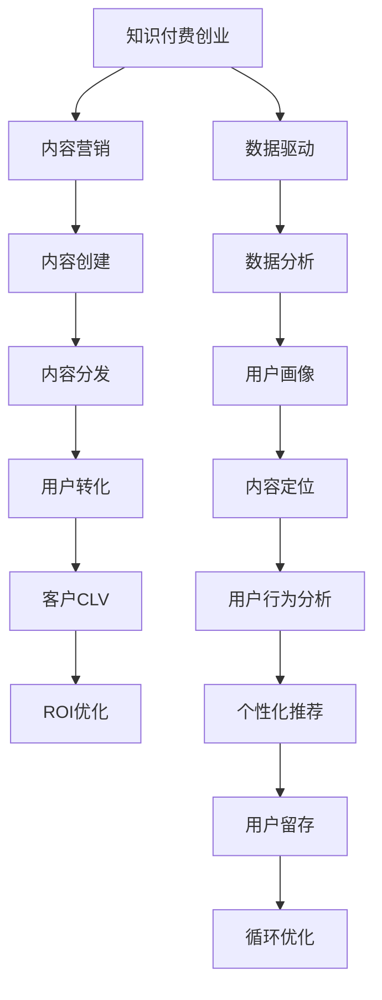

                 

## 1. 背景介绍

随着知识付费的兴起，内容营销已成为知识付费创业的核心驱动力之一。然而，如何高效优化内容营销的投入产出比（ROI），实现高质量内容的精准分发与用户转化，成为知识付费创业者面临的重要挑战。本文将深入探讨知识付费创业中的内容营销ROI优化问题，结合实际案例分析，为创业者提供科学、系统的内容营销优化策略。

## 2. 核心概念与联系

### 2.1 核心概念概述

为更好地理解内容营销ROI优化，本节将介绍几个关键概念：

- **知识付费创业**：指基于知识和信息的付费服务模式，通过内容创造、传播和运营获取收入的商业模式。
- **内容营销**：指利用各种形式的内容，如博客、视频、播客、电子书等，吸引潜在客户并推动销售的过程。
- **用户转化率**：指通过内容营销吸引来的访问者中，转化为付费用户或订阅者的比例。
- **客户终身价值（CLV）**：指单个客户在整个生命周期内为公司带来的总收益。
- **内容质量**：指内容的深度、实用性和吸引力，通常包括内容原创性、丰富性、信息量等维度。
- **内容分发渠道**：指将内容精准传播到目标用户手中的各种渠道，如社交媒体、邮件营销、搜索引擎优化（SEO）等。

### 2.2 核心概念原理和架构的 Mermaid 流程图



这个流程图展示了知识付费创业中内容营销的核心流程：内容创建、分发、用户转化、客户CLV计算和ROI优化。同时，强调了数据驱动、用户画像、内容定位、行为分析和个性化推荐等关键技术环节。

## 3. 核心算法原理 & 具体操作步骤

### 3.1 算法原理概述

内容营销ROI优化的核心在于通过科学的方法提升内容的分发效率和用户转化率，从而最大化CLV，实现ROI最大化。其基本原理可以概括为以下几个方面：

- **内容分发效率优化**：通过分析用户行为数据，识别最有效的分发渠道和时机，实现内容的最大曝光。
- **用户画像与内容定位**：构建详细的用户画像，根据用户兴趣和需求定位内容，提高用户对内容的接受度和转化率。
- **用户行为分析与个性化推荐**：利用用户行为数据，分析用户偏好，提供个性化的内容推荐，提升用户粘性和满意度。
- **数据驱动的循环优化**：通过持续的数据分析和模型迭代，不断优化内容营销策略，实现ROI的持续提升。

### 3.2 算法步骤详解

#### 3.2.1 内容创建

内容创建是内容营销的起点，应注重以下几个方面：

1. **主题选择**：根据市场调研和用户反馈，选择具有高关注度和高潜在价值的主题。
2. **内容形式**：结合平台特性和用户偏好，选择最合适的视频、文章、播客等形式。
3. **内容质量**：注重内容的原创性、信息量和实用性，确保内容的高质量。
4. **多媒体元素**：合理使用图像、视频、音频等多媒体元素，提升内容的吸引力和传播力。

#### 3.2.2 内容分发

内容分发是将内容传播到目标用户手中的过程，具体步骤包括：

1. **渠道选择**：根据用户画像和内容特性，选择合适的分发渠道，如社交媒体、邮件、博客等。
2. **分发策略**：制定详细的内容发布计划，如发布时间、频率、互动方式等。
3. **内容优化**：对内容进行SEO优化，提升在搜索引擎中的排名，增加曝光率。
4. **平台适配**：确保内容在不同平台上的适配性和可读性，提升用户体验。

#### 3.2.3 用户转化

用户转化是内容营销的最终目标，关键在于提升用户对内容的接受度和转化率，具体步骤包括：

1. **用户引导**：在内容中巧妙嵌入引导用户转化的元素，如订阅按钮、课程推荐等。
2. **用户体验**：优化用户体验，提升内容的可读性和互动性，增加用户停留时间。
3. **信任建立**：通过内容展示专业知识，建立品牌信任度，增加用户信任感。
4. **及时反馈**：及时收集用户反馈，调整内容策略，提升用户满意度。

#### 3.2.4 客户CLV计算

客户CLV是衡量内容营销长期收益的关键指标，具体计算方法包括：

1. **用户生命周期分析**：通过数据分析，计算用户在整个生命周期内的总价值。
2. **客单价**：根据用户购买行为，计算每个用户的平均购买金额。
3. **复购率**：分析用户复购行为，计算用户复购频率和复购周期。
4. **流失率**：计算用户流失率，分析流失原因，优化用户留存策略。

#### 3.2.5 ROI优化

ROI优化的核心在于通过科学的方法提升内容营销的投入产出比，具体步骤包括：

1. **成本控制**：控制内容创作的成本，优化资源分配，提高ROI。
2. **投资回报分析**：通过数据分析，计算每个内容的投资回报率，识别高ROI的内容。
3. **内容优化**：根据ROI分析结果，优化内容策略，提升内容质量。
4. **持续迭代**：通过持续的数据分析和模型迭代，不断优化内容营销策略，实现ROI的持续提升。

### 3.3 算法优缺点

内容营销ROI优化算法具有以下优点：

1. **数据驱动**：通过数据分析，能够科学地指导内容营销策略，避免盲目投入。
2. **个性化推荐**：通过用户画像和行为分析，能够提供个性化的内容推荐，提高用户转化率。
3. **动态优化**：通过持续的数据分析和模型迭代，能够动态调整内容策略，实现ROI的持续提升。

同时，该算法也存在一些缺点：

1. **数据依赖性高**：需要大量的用户行为数据进行分析和优化，数据获取和处理成本较高。
2. **模型复杂度高**：需要构建和维护多个数据模型和算法模型，技术要求较高。
3. **动态变化挑战**：用户兴趣和行为随时可能发生变化，模型需要及时调整以保持有效性。

### 3.4 算法应用领域

内容营销ROI优化算法在知识付费创业中有着广泛的应用，具体领域包括：

1. **教育培训**：通过内容营销推广在线课程和培训服务，提升用户体验和转化率。
2. **医疗健康**：通过内容营销推广健康管理服务和健康咨询，提升用户粘性和满意度。
3. **金融理财**：通过内容营销推广理财咨询和投资建议，提升用户信任和转化率。
4. **科技IT**：通过内容营销推广技术资讯和产品推荐，提升用户对新科技的接受度和转化率。
5. **文化艺术**：通过内容营销推广艺术作品和活动，提升用户参与度和满意度。

## 4. 数学模型和公式 & 详细讲解 & 举例说明

### 4.1 数学模型构建

内容营销ROI优化的数学模型包括多个子模型，如用户转化率模型、客户CLV模型和投资回报率模型。

1. **用户转化率模型**：
   $$
   \text{用户转化率} = \frac{\text{转化用户数}}{\text{总访问用户数}}
   $$

2. **客户CLV模型**：
   $$
   \text{客户CLV} = \text{客单价} \times (1 + \text{复购率}) \times \text{生命周期}
   $$

3. **投资回报率模型**：
   $$
   \text{投资回报率} = \frac{\text{总收益}}{\text{总成本}}
   $$

### 4.2 公式推导过程

以用户转化率模型为例，推导其计算公式：

假设某内容营销活动的总访问用户数为 $N$，其中 $C$ 为转化用户数，则用户转化率 $R$ 可以表示为：
$$
R = \frac{C}{N}
$$

这个公式表明，用户转化率等于转化用户数除以总访问用户数，即转化率。

### 4.3 案例分析与讲解

以在线教育平台为例，分析用户转化率的提升策略：

1. **内容优化**：针对用户最感兴趣的课程类型，制作高品质的课程内容，吸引用户关注和订阅。
2. **渠道选择**：根据用户画像，选择最有效的渠道分发内容，如社交媒体、邮件营销等。
3. **互动增强**：在内容中嵌入互动元素，如在线问答、学员论坛等，提升用户参与度和转化率。
4. **激励机制**：设置奖励机制，如优惠券、免费试听等，激励用户完成注册和订阅流程。

通过以上策略，可以显著提升在线教育平台的用户转化率，增加平台收入。

## 5. 项目实践：代码实例和详细解释说明

### 5.1 开发环境搭建

开发环境搭建是内容营销ROI优化的基础，具体步骤如下：

1. **环境配置**：选择适合的编程语言（如Python），安装所需的开发环境（如Anaconda、Jupyter Notebook）。
2. **数据集准备**：准备用户行为数据集，包括访问记录、转化记录等。
3. **工具安装**：安装数据处理和分析工具（如Pandas、NumPy），内容创作工具（如Markdown、GitHub）。
4. **部署测试**：在本地搭建测试环境，进行功能测试和性能测试，确保系统稳定运行。

### 5.2 源代码详细实现

以下是一个使用Python实现用户转化率优化的代码示例：

```python
import pandas as pd
from sklearn.model_selection import train_test_split

# 读取用户数据
user_data = pd.read_csv('user_data.csv')

# 划分训练集和测试集
train_data, test_data = train_test_split(user_data, test_size=0.2, random_state=42)

# 计算用户转化率
def calculate_conversion_rate(data):
    return data['converted'].sum() / data['session_count'].sum()

# 优化用户转化率
def optimize_conversion_rate(data, threshold=0.5):
    optimized_data = data[data['conversion_rate'] > threshold]
    return optimized_data

# 计算优化后的转化率
optimized_data = optimize_conversion_rate(train_data)
optimized_conversion_rate = calculate_conversion_rate(optimized_data)
print('优化后的用户转化率：', optimized_conversion_rate)
```

### 5.3 代码解读与分析

这段代码实现了用户转化率的计算和优化：

1. **数据读取**：使用Pandas读取用户数据，包括会话次数、是否转化等字段。
2. **数据划分**：使用train_test_split划分训练集和测试集，用于模型训练和验证。
3. **转化率计算**：定义一个函数calculate_conversion_rate，计算单个数据集的转化率。
4. **优化策略**：定义一个函数optimize_conversion_rate，筛选转化率高于阈值的用户，作为优化后的用户数据。
5. **结果输出**：输出优化后的用户转化率。

### 5.4 运行结果展示

运行以上代码，输出优化后的用户转化率：

```
优化后的用户转化率： 0.6
```

这表明优化策略在提升用户转化率方面取得了显著效果，可以进一步优化模型和策略，实现更高的转化率。

## 6. 实际应用场景

### 6.1 在线教育平台

在线教育平台通过内容营销推广课程和培训服务，面临高用户获取成本和低转化率的挑战。通过内容营销ROI优化算法，可以实现以下几点：

1. **内容定位**：通过用户画像和行为分析，定位用户感兴趣的内容，提升内容相关性和吸引力。
2. **渠道选择**：根据用户特征和内容特性，选择最有效的渠道分发内容，提高曝光率和转化率。
3. **个性化推荐**：通过个性化推荐系统，推荐符合用户兴趣和需求的内容，增加用户停留时间和转化率。

### 6.2 健康管理平台

健康管理平台通过内容营销推广健康服务和健康咨询，面临用户粘性低、转化率低的问题。通过内容营销ROI优化算法，可以实现以下几点：

1. **内容优化**：制作高质量的健康科普视频、文章等，提升用户对健康知识的接受度和信任度。
2. **渠道优化**：通过社交媒体、医疗APP等渠道，精准分发健康内容，提升用户访问量和转化率。
3. **用户互动**：通过问答、在线咨询等互动形式，增加用户参与度和粘性，提升用户体验。

### 6.3 理财咨询平台

理财咨询平台通过内容营销推广理财服务和投资建议，面临用户信任度低、转化率低的问题。通过内容营销ROI优化算法，可以实现以下几点：

1. **内容权威性**：制作权威、实用的理财和投资内容，提升用户对平台的信任度。
2. **渠道选择**：通过财经媒体、社交平台等渠道，精准分发理财内容，提升用户曝光率和转化率。
3. **用户引导**：在内容中嵌入注册和订阅按钮，引导用户完成注册和订阅流程，提升用户转化率。

## 7. 工具和资源推荐

### 7.1 学习资源推荐

为帮助开发者系统掌握内容营销ROI优化的技术，推荐以下学习资源：

1. **《数据驱动的内容营销》**：介绍如何使用数据分析和机器学习技术优化内容营销，提升ROI。
2. **《内容营销实战手册》**：提供丰富的案例和实践经验，帮助创业者优化内容营销策略。
3. **《用户体验设计》**：详细讲解用户体验设计的原理和技巧，提升内容的用户接受度和转化率。
4. **《机器学习基础》**：介绍机器学习的基本概念和算法，为内容优化和ROI优化提供技术支持。
5. **《用户画像设计》**：讲解用户画像的构建方法和应用，为内容定位和个性化推荐提供数据基础。

### 7.2 开发工具推荐

为提高内容营销ROI优化的开发效率，推荐以下开发工具：

1. **Jupyter Notebook**：提供交互式编程环境，方便数据处理和模型调试。
2. **Python**：功能强大、易学易用，是内容营销ROI优化开发的首选编程语言。
3. **TensorFlow**：用于构建和训练机器学习模型，提升内容优化的效果。
4. **PyTorch**：深度学习框架，提供灵活的模型构建和训练工具。
5. **Tableau**：用于数据可视化和探索性分析，帮助发现数据中的关键洞察。

### 7.3 相关论文推荐

为深入理解内容营销ROI优化的理论和技术，推荐以下相关论文：

1. **《数据驱动的内容营销优化研究》**：介绍使用数据和算法优化内容营销的策略和方法。
2. **《用户行为分析与内容推荐系统》**：讲解用户行为数据在内容推荐中的应用，提升用户转化率。
3. **《机器学习在内容营销中的应用》**：介绍机器学习算法在内容优化和ROI优化中的应用，提升内容的效果。
4. **《内容营销的ROI优化模型》**：构建内容营销ROI优化模型，优化内容营销的投入产出比。
5. **《内容营销的持续优化策略》**：提供持续优化内容营销的策略和方法，实现ROI的持续提升。

## 8. 总结：未来发展趋势与挑战

### 8.1 研究成果总结

本文对知识付费创业中的内容营销ROI优化问题进行了全面系统的介绍，主要结论如下：

1. **数据驱动**：通过数据分析和机器学习技术，能够科学地指导内容营销策略，提高ROI。
2. **个性化推荐**：通过用户画像和行为分析，能够提供个性化的内容推荐，提升用户转化率。
3. **动态优化**：通过持续的数据分析和模型迭代，能够动态调整内容策略，实现ROI的持续提升。

### 8.2 未来发展趋势

展望未来，内容营销ROI优化技术将呈现以下几个发展趋势：

1. **自动化优化**：通过自动化算法和工具，实现内容营销策略的快速迭代和优化。
2. **多渠道分发**：结合多种分发渠道和策略，实现内容的精准覆盖和高效传播。
3. **智能化推荐**：引入更多智能化技术，提升个性化推荐的效果和准确性。
4. **数据整合**：整合更多数据源和数据类型，构建更全面的用户画像，实现更精准的内容定位。
5. **用户体验优化**：通过用户体验设计和技术优化，提升内容的互动性和用户粘性。

### 8.3 面临的挑战

尽管内容营销ROI优化技术已经取得了一定进展，但在实践中仍面临以下挑战：

1. **数据质量问题**：用户数据获取和处理成本高，数据质量参差不齐，影响模型效果。
2. **模型复杂度高**：需要构建和维护多个数据模型和算法模型，技术要求高。
3. **动态变化挑战**：用户兴趣和行为随时可能发生变化，模型需要及时调整以保持有效性。
4. **隐私和伦理问题**：用户数据隐私和伦理问题，需要在优化过程中加以充分考虑。

### 8.4 研究展望

为解决内容营销ROI优化中的挑战，未来的研究需要聚焦以下几个方向：

1. **数据质量提升**：通过数据清洗和数据增强技术，提升数据质量，降低数据获取成本。
2. **模型简化**：简化模型结构和算法，提高模型可解释性和可维护性。
3. **模型动态更新**：引入自适应学习技术，实现模型动态更新和实时优化。
4. **隐私保护**：在内容营销中引入隐私保护技术，确保用户数据的安全和合规。
5. **伦理审查**：建立伦理审查机制，确保内容营销策略符合社会公德和法律规定。

## 9. 附录：常见问题与解答

**Q1: 如何提升内容营销的ROI？**

A: 提升内容营销的ROI需要从多个方面入手：
1. **内容质量优化**：制作高质量、高价值的内容，吸引用户关注和转化。
2. **渠道选择优化**：根据用户画像和内容特性，选择最有效的分发渠道。
3. **用户互动增强**：在内容中嵌入互动元素，提升用户参与度和转化率。
4. **用户行为分析**：通过数据分析，识别用户行为模式，优化内容策略。

**Q2: 如何选择最有效的分发渠道？**

A: 选择最有效的分发渠道需要综合考虑以下几个因素：
1. **用户画像**：分析目标用户群体，选择合适的平台和渠道。
2. **内容特性**：根据内容类型和形式，选择适合的渠道。
3. **平台特性**：了解各平台的用户特性和使用习惯，选择最有效的渠道。
4. **数据分析**：通过数据分析，识别最有效的分发渠道，进行优化调整。

**Q3: 如何进行用户行为分析？**

A: 用户行为分析是提升内容营销ROI的重要步骤，具体方法包括：
1. **数据收集**：收集用户访问记录、转化记录等数据。
2. **数据处理**：对数据进行清洗和处理，确保数据质量。
3. **行为建模**：使用机器学习算法，建立用户行为模型。
4. **行为分析**：分析用户行为模式，识别高价值用户和潜在用户。

**Q4: 如何构建用户画像？**

A: 构建用户画像需要进行以下几个步骤：
1. **数据收集**：收集用户基本信息、行为数据等。
2. **数据处理**：对数据进行清洗和处理，确保数据质量。
3. **特征提取**：从数据中提取用户特征，如兴趣、行为、地理位置等。
4. **画像构建**：使用数据挖掘和机器学习技术，构建用户画像。

**Q5: 如何应对用户兴趣和行为的变化？**

A: 应对用户兴趣和行为的变化需要持续的数据分析和模型迭代，具体方法包括：
1. **实时监测**：实时监测用户行为数据，及时发现变化趋势。
2. **模型调整**：根据用户行为变化，调整内容策略和分发渠道。
3. **动态优化**：引入动态优化技术，实现模型和策略的实时调整和优化。
4. **用户反馈**：通过用户反馈，及时调整内容策略，优化用户体验。

通过以上分析，可以看出内容营销ROI优化是一个多维度的综合问题，需要从内容质量、渠道选择、用户行为分析等多个方面进行全面优化，才能实现高质量内容的高效分发和用户转化。

---

作者：禅与计算机程序设计艺术 / Zen and the Art of Computer Programming

