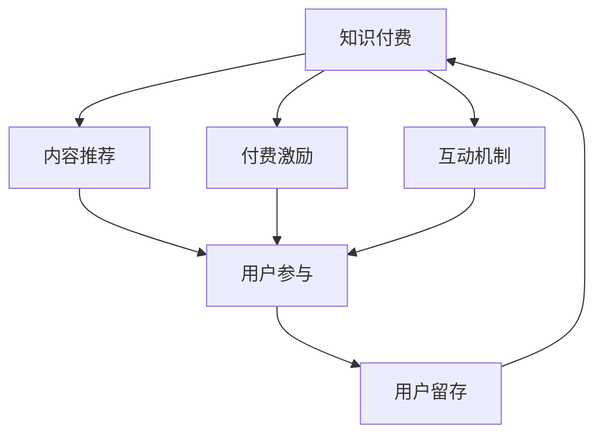

                 

# 知识付费创业中的用户参与度提升策略

> 关键词：知识付费,用户参与度,内容推荐,付费激励,互动机制,社交网络,智能算法,用户留存

## 1. 背景介绍

随着信息爆炸时代的到来，互联网学习形式已不再局限于传统的电视课程、线下讲座等形式，知识付费成为新潮流。例如得到、喜马拉雅、知乎live等平台的兴起，标志着知识付费模式的不断成熟。然而，知识付费产品如何吸引用户、提升用户参与度、进而促成付费转化，成为创业公司亟待解决的问题。本文将从内容推荐、付费激励、互动机制三个角度，深度剖析知识付费创业中的用户参与度提升策略，并结合国内外相关案例进行系统分析。

## 2. 核心概念与联系

### 2.1 核心概念概述

要提升知识付费产品的用户参与度，首先需要了解几个关键概念：

- **知识付费**：指通过付费方式获取特定领域知识的在线服务形式，主要包含电子书、课程、音频、视频等内容。用户通过购买这些服务，获取专属学习资源。

- **用户参与度**：指用户在学习过程中，通过关注、互动、分享等行为，体现出对产品的活跃程度和满意度的综合指标。主要包含访问量、浏览时长、评论量、购买量等维度。

- **内容推荐**：指根据用户历史行为和偏好，智能匹配推荐相关课程或文章，提升用户体验和满意度，从而吸引更多用户参与。

- **付费激励**：指通过激励机制，如优惠券、限时折扣、积分奖励等，提高用户对付费产品的兴趣和信任，进而促进付费转化。

- **互动机制**：指通过社群、论坛、直播等形式，增强用户间的互动和交流，增加用户粘性，构建用户社区，提升用户留存。

- **社交网络**：指在知识付费平台上构建的、以内容为主导的用户关系网络。用户通过关系链的传播，快速获取优质内容，增强参与感。

- **智能算法**：指利用机器学习、自然语言处理等技术，实现内容推荐、付费激励、互动机制等功能。如协同过滤、序列模式挖掘、情感分析、文本分类等算法。

这些概念间存在紧密联系，相互影响、相互促进。例如，良好的内容推荐机制可以提升用户体验，吸引用户参与，进而增加付费概率；而互动机制可以增强用户粘性，构建社交网络，通过社交网络的传播效应，提升内容推荐和付费激励的效果；而智能算法则支撑了上述功能实现，形成了一套完整的、动态优化的生态系统。

### 2.2 核心概念原理和架构的 Mermaid 流程图



上图中，内容推荐、付费激励、互动机制都直接关系到用户参与度的提升，而用户参与度的提升又直接影响用户留存率。知识付费产品围绕着这四大关键环节，通过智能算法的优化，形成了一条完整的用户参与度提升链条。

## 3. 核心算法原理 & 具体操作步骤

### 3.1 算法原理概述

知识付费产品中的用户参与度提升策略，本质上是一种多目标优化问题，包括内容推荐、付费激励和互动机制三部分。这些策略通过智能算法协同优化，实现了对用户行为的有效引导和激励。

假设用户对知识的获取需求可以用$U$表示，用户对付费产品的信任和满意度可以用$C$表示，用户间互动的质量和频次可以用$I$表示。最终目标是最大化用户参与度，即优化$U+C+I$的值。内容推荐、付费激励和互动机制分别通过推荐算法、激励算法和互动算法实现。这些算法相互配合，共同构建了一个多维度的、动态优化的用户参与度提升框架。

### 3.2 算法步骤详解

#### 3.2.1 内容推荐算法

内容推荐算法主要通过协同过滤、基于内容的推荐、基于矩阵分解的推荐等方法，对用户历史行为和兴趣进行建模，智能匹配推荐相关内容。具体步骤包括：

1. **用户行为记录**：收集用户的历史浏览记录、购买记录、点赞、收藏、评论等行为数据。

2. **构建用户兴趣模型**：利用协同过滤算法（如基于用户的协同过滤、基于物品的协同过滤），构建用户兴趣模型，挖掘用户间的相似性。

3. **生成内容推荐列表**：根据用户兴趣模型，结合物品特征，利用矩阵分解等方法，生成推荐列表。

4. **实时更新**：根据用户行为实时更新推荐算法，保持推荐内容的相关性和时效性。

#### 3.2.2 付费激励算法

付费激励算法通过优惠券、限时折扣、积分奖励等策略，吸引用户对付费产品的兴趣和信任，从而促成付费转化。具体步骤包括：

1. **用户画像构建**：收集用户基本信息、行为数据、购买记录等，构建用户画像。

2. **个性化激励方案设计**：根据用户画像，设计个性化激励方案，如针对不同阶段、不同类型用户，提供不同形式的激励。

3. **动态调整**：根据用户反馈，动态调整激励策略，优化激励效果。

#### 3.2.3 互动机制算法

互动机制算法通过构建社群、论坛、直播等形式，增强用户间的互动和交流，构建用户社区，提升用户留存。具体步骤包括：

1. **社群构建**：根据用户兴趣、行为等特征，构建相应的社群或小组，让用户有更多交流机会。

2. **内容生成和传播**：通过社区激励机制，鼓励用户生成优质内容，并利用社交网络传播。

3. **互动数据分析**：利用机器学习等技术，分析社群互动数据，挖掘用户偏好，优化互动体验。

### 3.3 算法优缺点

知识付费产品中的用户参与度提升策略，主要有以下优点和缺点：

#### 3.3.1 优点

1. **个性化推荐**：通过智能算法，实现个性化内容推荐，满足用户个性化需求，提升用户体验。

2. **精准激励**：利用机器学习等技术，设计精准的付费激励策略，提高用户对付费产品的兴趣和信任。

3. **高效互动**：通过智能算法优化互动机制，增强用户间的互动和交流，构建用户社区。

#### 3.3.2 缺点

1. **数据隐私问题**：用户行为数据的收集和分析，可能涉及用户隐私和数据安全问题。

2. **算法复杂度**：智能算法涉及复杂的数据处理和模型训练，需要投入大量资源和技术支持。

3. **过度推荐**：智能算法可能存在过度推荐问题，造成用户信息过载，反而降低用户参与度。

### 3.4 算法应用领域

用户参与度提升策略在知识付费创业中具有广泛的应用领域，例如：

- **在线教育平台**：如Coursera、edX等，通过内容推荐、付费激励、互动机制，提升用户参与度和课程完成率。

- **内容付费社区**：如知乎live、简书等，通过社区构建、内容传播、互动分析，提升用户粘性和社区活跃度。

- **企业培训系统**：通过智能推荐和激励机制，增强员工学习积极性和参与度，提升企业培训效果。

## 4. 数学模型和公式 & 详细讲解 & 举例说明

### 4.1 数学模型构建

知识付费平台的用户参与度提升，可以通过多目标优化模型进行建模，假设模型参数为$w$，用户行为数据为$D$，用户画像数据为$U$，互动数据为$I$。多目标优化模型的目标函数为：

$$
\max_{w} f(w; D, U, I) = U(w; D) + C(w; U, I) + I(w; D, U)
$$

其中，$U(w; D)$表示内容推荐策略的效果，$C(w; U, I)$表示付费激励策略的效果，$I(w; D, U)$表示互动机制策略的效果。

### 4.2 公式推导过程

#### 4.2.1 内容推荐策略

内容推荐策略可以表示为：

$$
U(w; D) = \sum_{i=1}^{N} \left( \sum_{j=1}^{M} D_{ij} \cdot w_j \right)
$$

其中，$N$表示用户数量，$M$表示物品数量，$D_{ij}$表示用户$i$对物品$j$的评分或行为数据，$w_j$表示物品$j$的特征权重。

#### 4.2.2 付费激励策略

付费激励策略可以表示为：

$$
C(w; U, I) = \sum_{i=1}^{N} \left( u_i \cdot w_i \right)
$$

其中，$u_i$表示用户$i$的画像特征向量，$w_i$表示用户画像特征的权重。

#### 4.2.3 互动机制策略

互动机制策略可以表示为：

$$
I(w; D, U) = \sum_{i=1}^{N} \left( v_i \cdot w_i \right)
$$

其中，$v_i$表示用户$i$的互动特征向量，$w_i$表示用户互动特征的权重。

### 4.3 案例分析与讲解

以知乎live为例，探讨如何通过用户参与度提升策略，构建高活跃度社区。

#### 4.3.1 内容推荐策略

知乎live采用协同过滤、基于内容的推荐算法，结合用户行为数据和物品特征，为用户推荐热门live和相关live。具体步骤如下：

1. 收集用户历史浏览、点赞、评论等行为数据。
2. 利用协同过滤算法，挖掘用户间的相似性，构建用户兴趣模型。
3. 利用基于内容的推荐算法，生成热门live和相关live的推荐列表。
4. 实时更新推荐算法，保持推荐内容的相关性和时效性。

#### 4.3.2 付费激励策略

知乎live通过优惠券、限时折扣、积分奖励等策略，吸引用户参与直播互动，促成付费转化。具体步骤如下：

1. 收集用户基本信息、行为数据、购买记录等，构建用户画像。
2. 根据用户画像，设计个性化激励方案，如针对新用户提供优惠券，针对活跃用户提供限时折扣等。
3. 根据用户反馈，动态调整激励策略，优化激励效果。

#### 4.3.3 互动机制策略

知乎live通过社区构建、内容传播、互动分析，提升用户粘性和社区活跃度。具体步骤如下：

1. 根据用户兴趣、行为等特征，构建相应的社群或小组。
2. 鼓励用户生成优质内容，并通过社交网络传播。
3. 利用机器学习等技术，分析社群互动数据，挖掘用户偏好，优化互动体验。

## 5. 项目实践：代码实例和详细解释说明

### 5.1 开发环境搭建

在进行知识付费产品开发时，需要先搭建好开发环境，包括服务器、数据库、应用服务等。以下是一个基本的搭建流程：

1. 选择合适的云服务提供商，如阿里云、腾讯云、AWS等，创建服务器实例。

2. 搭建MySQL或PostgreSQL等关系型数据库，用于存储用户行为、画像、互动等数据。

3. 部署Web应用，如Nginx、Apache等，用于承载知识付费产品的前端界面。

4. 搭建后台服务，如Python Flask、Node.js等，用于后端业务逻辑处理和数据管理。

5. 配置负载均衡、防火墙、SSL等安全措施，保护用户数据和应用安全。

### 5.2 源代码详细实现

以下是一个基于Python Flask框架的在线教育平台的代码实现，其中包含了内容推荐、付费激励、互动机制等功能模块。

#### 5.2.1 内容推荐模块

```python
from flask import Flask, render_template, request
from pymongo import MongoClient

app = Flask(__name__)

# 初始化MongoDB客户端，连接课程数据库
client = MongoClient('mongodb://localhost:27017/')
db = client['courses']
collection = db['courses']

# 用户行为记录
@app.route('/recommend', methods=['POST'])
def recommend():
    user_id = request.form.get('user_id')
    item_id = request.form.get('item_id')
    
    # 查询用户历史行为数据
    query = {'user_id': user_id}
    user_data = collection.find(query)
    
    # 查询物品特征数据
    query = {'_id': item_id}
    item_data = collection.find(query)
    
    # 构建用户兴趣模型，生成推荐列表
    user_interests = [d['feature'] for d in user_data]
    item_features = [d['feature'] for d in item_data]
    recommend_list = compute_recommend_list(user_interests, item_features)
    
    return render_template('recommend.html', item_id=item_id, recommend_list=recommend_list)
```

#### 5.2.2 付费激励模块

```python
# 用户画像构建
@app.route('/profile', methods=['POST'])
def profile():
    user_id = request.form.get('user_id')
    
    # 查询用户基本信息、行为数据、购买记录等
    query = {'user_id': user_id}
    user_data = collection.find(query)
    
    # 设计个性化激励方案
    user_profile = {'user_id': user_id, 'profile': user_data}
    
    return render_template('profile.html', user_profile=user_profile)
```

#### 5.2.3 互动机制模块

```python
# 社区构建
@app.route('/community', methods=['POST'])
def community():
    user_id = request.form.get('user_id')
    
    # 根据用户兴趣、行为等特征，构建社区或小组
    query = {'user_id': user_id}
    user_data = collection.find(query)
    
    # 生成社区或小组，加入互动机制
    community_data = generate_community(user_data)
    
    return render_template('community.html', community_data=community_data)
```

### 5.3 代码解读与分析

以上代码实现了知识付费平台中的内容推荐、付费激励和互动机制功能。其中，内容推荐模块通过查询用户历史行为数据和物品特征数据，生成推荐列表；付费激励模块根据用户画像设计个性化激励方案；互动机制模块根据用户兴趣、行为等特征，构建社区或小组。

## 6. 实际应用场景

### 6.1 在线教育平台

在线教育平台是知识付费的重要应用场景之一。通过内容推荐、付费激励和互动机制，可以有效提升用户参与度和课程完成率。例如，Coursera和edX通过智能推荐和激励策略，提升了用户学习体验和课程完成率。

具体实现上，Coursera和edX采用协同过滤、基于内容的推荐算法，结合用户行为数据和物品特征，为用户推荐相关课程。同时，通过优惠券、限时折扣等激励策略，吸引用户参与课程学习。在互动机制方面，Coursera和edX通过论坛、社群、直播等形式，增强用户间的互动和交流，构建用户社区，提升用户粘性和留存率。

### 6.2 内容付费社区

内容付费社区是知识付费的另一重要应用场景，通过社区构建、内容传播和互动分析，提升用户参与度和社区活跃度。例如，知乎live通过智能推荐和激励策略，构建了高活跃度社区。

具体实现上，知乎live采用协同过滤、基于内容的推荐算法，结合用户行为数据和物品特征，为用户推荐热门live和相关live。同时，通过优惠券、限时折扣等激励策略，吸引用户参与直播互动。在互动机制方面，知乎live通过社区构建、内容传播、互动分析，提升用户粘性和社区活跃度。

## 7. 工具和资源推荐

### 7.1 学习资源推荐

为帮助开发者系统掌握知识付费产品的用户参与度提升策略，以下是一些优质的学习资源：

1. 《知识付费业务实践》：深入浅出地介绍知识付费产品的用户参与度提升策略，包括内容推荐、付费激励、互动机制等。

2. 《自然语言处理与机器学习》：涵盖自然语言处理和机器学习的基本概念和前沿技术，为知识付费产品中的智能算法提供理论基础。

3. Coursera和edX的在线课程：提供系统性的知识付费业务开发和学习资源，涵盖内容推荐、付费激励、互动机制等。

4. GitHub上的知识付费项目：通过学习优秀的开源项目，了解知识付费产品的开发实践和算法实现。

### 7.2 开发工具推荐

高效的开发离不开优秀的工具支持。以下是几款用于知识付费产品开发的工具：

1. Flask和Django：基于Python的Web框架，适用于开发轻量级的知识付费产品。

2. Redis和MongoDB：高性能的数据存储和管理工具，适用于存储用户行为、画像、互动等数据。

3. Scikit-learn和TensorFlow：强大的机器学习库，适用于实现内容推荐和互动机制。

4. ELK Stack：ElasticSearch、Logstash和Kibana的组合，用于日志管理、数据分析和可视化。

5. Apache Kafka：分布式消息队列，适用于实时处理用户行为数据和互动数据。

### 7.3 相关论文推荐

知识付费产品中的用户参与度提升策略，涉及大量机器学习、自然语言处理等前沿技术。以下是几篇奠基性的相关论文，推荐阅读：

1. "Collaborative Filtering for Implicit Feedback Datasets"：介绍协同过滤算法的基本原理和应用，为知识付费平台的内容推荐提供理论基础。

2. "Deep Learning in Recommendation Systems"：综述深度学习在推荐系统中的应用，介绍神经网络、卷积神经网络、循环神经网络等模型。

3. "Social Influence and Online Word of Mouth"：分析社交网络对知识付费平台用户行为的影响，提出增强用户互动和社区构建的策略。

4. "Interactive Dynamic Learning to Recommend"：介绍基于交互式学习的推荐算法，为知识付费平台的用户参与度提升提供新思路。

## 8. 总结：未来发展趋势与挑战

### 8.1 研究成果总结

本文深入剖析了知识付费产品中的用户参与度提升策略，包括内容推荐、付费激励和互动机制。通过多目标优化模型和多维度的智能算法，实现了对用户行为的有效引导和激励。具体实现上，我们以在线教育平台和内容付费社区为例，介绍了具体的算法和功能模块，并给出了系统架构和代码实例。同时，通过学习资源、开发工具和相关论文推荐，帮助开发者更好地理解和实践知识付费产品的用户参与度提升策略。

### 8.2 未来发展趋势

展望未来，知识付费产品的用户参与度提升策略将呈现以下几个发展趋势：

1. **深度学习算法的普及**：随着深度学习算法的普及和优化，内容推荐和付费激励的效果将不断提升。

2. **个性化推荐算法的发展**：基于深度学习、协同过滤等个性化推荐算法将更加精准，提升用户推荐体验。

3. **互动机制的多样化**：社交网络、论坛、直播等互动形式将更加多样，增强用户间的交流和互动。

4. **多模态数据的融合**：结合文本、图像、视频等多模态数据，实现更全面、准确的用户画像和推荐。

5. **实时数据处理**：利用大数据、流计算等技术，实现实时数据处理，提升用户互动和推荐的即时性。

### 8.3 面临的挑战

尽管知识付费产品中的用户参与度提升策略已取得一定成效，但仍面临诸多挑战：

1. **数据隐私问题**：用户行为数据的收集和分析可能涉及用户隐私和数据安全问题。

2. **算法复杂度**：智能算法涉及复杂的数据处理和模型训练，需要投入大量资源和技术支持。

3. **过拟合问题**：智能算法可能存在过拟合问题，造成推荐内容与实际需求不符。

4. **用户体验问题**：过度推荐和低质量内容可能降低用户参与度和满意度。

5. **交互机制问题**：互动机制的实现和维护需要大量人力和技术支持，且效果难以量化评估。

### 8.4 研究展望

未来的研究需要从以下几个方面进行探索：

1. **隐私保护技术**：研究如何保护用户隐私，减少数据泄露风险。

2. **高效算法设计**：设计高效、低复杂度的智能算法，提升推荐和互动效果。

3. **个性化推荐策略**：研究个性化推荐策略，提高推荐的精准性和相关性。

4. **用户参与度量化**：研究如何量化用户参与度，建立用户行为分析体系。

5. **互动机制优化**：优化互动机制，提升用户互动体验和社区活跃度。

总之，知识付费产品中的用户参与度提升策略是一个复杂的多目标优化问题，需要从内容推荐、付费激励和互动机制等多维度进行全面优化。只有不断探索和创新，才能实现知识付费产品的长期可持续发展。

## 9. 附录：常见问题与解答

**Q1：知识付费产品如何吸引用户？**

A: 知识付费产品的用户吸引策略主要包括以下几个方面：

1. **优质内容**：提供高质量、有价值的课程和内容，满足用户的学习需求。

2. **推荐算法**：通过智能推荐算法，为用户推荐相关课程和内容，提升用户体验。

3. **激励机制**：通过优惠券、限时折扣、积分奖励等策略，吸引用户付费。

4. **互动机制**：通过社群、论坛、直播等形式，增强用户间的互动和交流，提升用户粘性。

**Q2：如何设计精准的付费激励策略？**

A: 设计精准的付费激励策略主要包括以下几个步骤：

1. **用户画像构建**：收集用户基本信息、行为数据、购买记录等，构建用户画像。

2. **个性化激励方案设计**：根据用户画像，设计个性化激励方案，如针对不同阶段、不同类型用户，提供不同形式的激励。

3. **动态调整**：根据用户反馈，动态调整激励策略，优化激励效果。

**Q3：互动机制如何增强用户粘性？**

A: 互动机制可以通过以下方式增强用户粘性：

1. **社群构建**：根据用户兴趣、行为等特征，构建相应的社群或小组，让用户有更多交流机会。

2. **内容生成和传播**：通过社区激励机制，鼓励用户生成优质内容，并利用社交网络传播。

3. **互动数据分析**：利用机器学习等技术，分析社群互动数据，挖掘用户偏好，优化互动体验。

**Q4：如何避免智能算法中的过拟合问题？**

A: 避免智能算法中的过拟合问题主要包括以下几个方面：

1. **数据清洗**：对数据进行清洗，去除噪声和异常值，提升数据质量。

2. **正则化技术**：利用L1、L2正则化等技术，防止模型过度拟合训练数据。

3. **模型简化**：减少模型复杂度，避免过度拟合。

4. **交叉验证**：通过交叉验证，评估模型的泛化能力，优化模型参数。

**Q5：如何衡量用户参与度？**

A: 用户参与度的衡量主要包括以下几个指标：

1. **访问量**：用户在产品中的总访问次数。

2. **浏览时长**：用户在产品中的浏览时间，反映用户对内容的兴趣程度。

3. **评论量**：用户在产品中的评论数量，反映用户互动的活跃度。

4. **购买量**：用户在产品中的购买数量，反映用户付费意愿和满意度。

通过综合分析这些指标，可以全面衡量知识付费产品的用户参与度，优化产品策略。

---

作者：禅与计算机程序设计艺术 / Zen and the Art of Computer Programming

