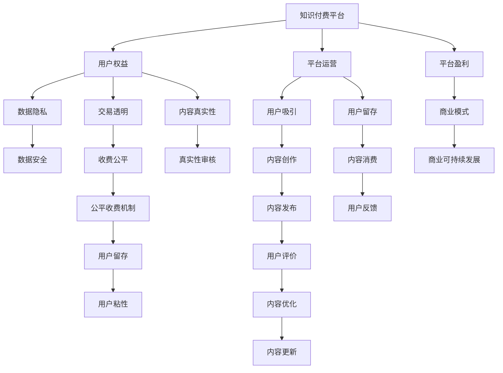

                 

# 知识付费创业中的用户权益保护

## 1. 背景介绍

### 1.1 问题由来
随着知识付费领域的蓬勃发展，用户权益保护成为知识付费平台面临的重要挑战。尽管内容创作者和平台运营商通常能够获得较高的收益，但用户在内容付费、隐私数据保护、公平交易等方面可能受到不公平对待。为了实现知识付费行业的健康可持续发展，用户权益保护机制的完善变得至关重要。

### 1.2 问题核心关键点
用户权益保护的核心关键点包括：
1. 数据隐私：用户在平台上的行为数据如何收集、存储和处理，数据安全如何保障。
2. 用户公平：不同用户之间的收费标准是否公平，能否避免大V垄断和劣币驱逐良币现象。
3. 内容真实性：平台上的内容真实性如何保证，是否存在虚假宣传和误导性信息。
4. 交易透明：平台上的交易流程是否透明，用户是否能够清楚地知道所购内容的具体细节。
5. 售后保障：用户如何获得合理的售后保障，平台如何处理消费者权益纠纷。

### 1.3 问题研究意义
用户权益保护不仅是提升用户满意度和忠诚度的关键，也是平台商业可持续发展的基础。通过建立和完善用户权益保护机制，可以有效规避潜在的法律风险和道德风险，保障用户权益，提升平台品牌价值，吸引更多用户加入。

## 2. 核心概念与联系

### 2.1 核心概念概述

为更好地理解知识付费平台的用户权益保护机制，本节将介绍几个关键概念及其相互联系：

- 知识付费平台(Knowledge Paywall)：基于内容服务的平台，用户需要通过支付一定费用来获取优质内容。
- 用户权益(User Rights)：用户作为平台服务的消费者，在数据使用、隐私保护、内容真实性等方面应享有的权益。
- 平台运营(Platform Operation)：平台运营商通过各种手段吸引并保持用户，提高用户粘性，从而实现商业利益。
- 数据隐私(Data Privacy)：用户在平台上的行为数据如何收集、存储和处理，数据安全如何保障。
- 交易透明(Transparency in Transactions)：平台交易流程的透明度和公平性，是否存在不合理的收费机制。
- 内容真实性(Content Authenticity)：平台上的内容是否真实，是否存在虚假宣传和误导性信息。

这些核心概念之间的逻辑关系可以通过以下Mermaid流程图来展示：



这个流程图展示了知识付费平台的各个环节和关键要素，以及用户权益保护机制如何在这些环节中发挥作用：

1. 平台吸引用户通过提供高质量内容，并确保内容真实可信。
2. 平台运营通过公平收费机制和透明交易流程，保障用户权益。
3. 用户权益保护通过数据隐私保护和内容真实性审核，提升用户满意度和信任度。
4. 平台盈利与可持续发展通过保障用户权益，提升品牌价值，吸引更多用户。

## 3. 核心算法原理 & 具体操作步骤
### 3.1 算法原理概述

知识付费平台的用户权益保护机制，本质上是一个多维度、多层次的策略组合，包括但不限于：数据隐私保护、交易透明、内容真实性审核等。这些策略的实施需要综合考虑用户需求、平台运营目标和法律法规要求。

以数据隐私保护为例，可以采用以下步骤实现：
1. 数据收集：明确哪些数据需要收集，并告知用户。
2. 数据存储：对收集的数据进行加密存储，防止泄露。
3. 数据使用：在用户授权范围内使用数据，保障数据安全。
4. 数据销毁：在用户不再使用服务后，及时销毁其数据。

### 3.2 算法步骤详解

知识付费平台的用户权益保护机制，可以通过以下详细步骤实施：

**Step 1: 数据隐私保护**
- 确定需要收集的数据类型，如用户行为数据、交易记录、反馈信息等。
- 在平台获取数据前，告知用户其数据的使用目的，并征得用户同意。
- 对收集的数据进行匿名化和加密处理，防止数据泄露。
- 建立数据访问控制机制，仅授权人员可访问特定数据。
- 定期对存储数据进行安全审计，确保数据保护措施的有效性。

**Step 2: 交易透明**
- 确保交易流程公开透明，用户能够清晰地看到交易详情。
- 明确告知用户收费标准，避免隐藏收费或模糊定价。
- 提供清晰易懂的退款和售后服务流程，保障用户权益。
- 定期向用户发布财务报表和透明度报告，提升用户信任。

**Step 3: 内容真实性审核**
- 对平台上的内容进行严格审核，防止虚假宣传和误导性信息。
- 建立内容发布流程，确保内容来源可信。
- 对用户反馈和评价进行监控，及时处理不实信息。
- 引入第三方专业机构进行内容真实性审查，增加平台信任度。

**Step 4: 用户公平**
- 建立公平收费机制，避免大V垄断和劣币驱逐良币现象。
- 根据用户贡献度、付费历史等因素进行差异化定价，确保公平。
- 定期评估用户满意度，调整收费策略，提升用户体验。

**Step 5: 内容真实性审核**
- 对平台上的内容进行严格审核，防止虚假宣传和误导性信息。
- 建立内容发布流程，确保内容来源可信。
- 对用户反馈和评价进行监控，及时处理不实信息。
- 引入第三方专业机构进行内容真实性审查，增加平台信任度。

### 3.3 算法优缺点

知识付费平台的用户权益保护机制具有以下优点：
1. 提升用户满意度：通过透明、公平的交易机制，保障用户权益，提升用户体验。
2. 增强信任度：通过严格的内容真实性审核和数据隐私保护措施，增强平台信任度。
3. 促进可持续发展：保障用户权益，提升品牌价值，吸引更多用户，实现平台可持续发展。

同时，该机制也存在一定的局限性：
1. 实施成本高：隐私保护和内容审核需要投入大量资源和技术力量，成本较高。
2. 监管难度大：平台监管和审核需要高度精准，否则可能面临法律风险。
3. 动态管理难：平台内容和服务不断变化，权益保护机制需要持续更新和优化。

### 3.4 算法应用领域

知识付费平台的用户权益保护机制，在各类知识付费应用中都得到了广泛的应用，例如：

- 在线课程平台：通过建立公平收费机制和内容真实性审核，提升用户满意度，保障用户权益。
- 电子书平台：通过严格的数据隐私保护和透明交易流程，增强用户信任度，吸引更多用户。
- 在线问答社区：通过保护用户隐私和提供高质量内容，提升用户留存率和忠诚度。
- 专业培训平台：通过公平定价和透明收费，避免垄断和欺诈行为，保障用户权益。

除了上述这些常见应用外，知识付费平台的用户权益保护机制还被创新性地应用到更多场景中，如企业培训、学术研究、医学咨询等，为各类知识服务提供了新的保障。

## 4. 数学模型和公式 & 详细讲解  
### 4.1 数学模型构建

为更好地理解知识付费平台的用户权益保护机制，本节将通过数学模型来详细讲解其原理和应用。

设用户权益保护的各项指标为 $X = \{P, T, C, R\}$，其中 $P$ 代表数据隐私保护，$T$ 代表交易透明，$C$ 代表内容真实性审核，$R$ 代表用户公平。

假设平台对用户权益保护的投入为 $I$，则用户权益保护的优化目标为最大化用户满意度和信任度：

$$
\max_{I} \sum_{i=1}^n (s_i \cdot C_i(X_i) + t_i \cdot T_i(X_i) + r_i \cdot R_i(X_i))
$$

其中 $s_i, t_i, r_i$ 分别为数据隐私、交易透明和用户公平对用户满意度的权重，$C_i, T_i, R_i$ 分别为数据隐私、交易透明和用户公平的保护效果。

### 4.2 公式推导过程

假设数据隐私保护的投入为 $I_{P}$，交易透明度的投入为 $I_{T}$，内容真实性审核的投入为 $I_{C}$，用户公平的投入为 $I_{R}$，则各项投入对用户满意度和信任度的影响可以用以下公式表示：

$$
C_i(X_i) = f_{P}(I_{P}) \cdot p_i + f_{T}(I_{T}) \cdot t_i + f_{C}(I_{C}) \cdot c_i + f_{R}(I_{R}) \cdot r_i
$$

其中 $f_{P}(I_{P}), f_{T}(I_{T}), f_{C}(I_{C}), f_{R}(I_{R})$ 分别为数据隐私保护、交易透明度、内容真实性审核和用户公平的投入-效果函数，$p_i, t_i, c_i, r_i$ 分别为各项投入的边际效应。

### 4.3 案例分析与讲解

以在线课程平台为例，分析用户权益保护机制的实施效果。

**数据隐私保护**：平台采用加密存储和匿名化处理，对用户行为数据进行保护。根据用户授权，平台可以对数据进行分析和优化，提升课程推荐准确度。

**交易透明**：平台提供清晰的价格说明和透明的交易流程，用户能够清楚地看到课程详情和价格变化。平台定期发布财务报表，提升用户信任。

**内容真实性审核**：平台对课程内容进行严格审核，避免虚假宣传。引入第三方机构进行内容真实性审查，增加用户信任度。

**用户公平**：平台采用动态定价策略，根据用户反馈和贡献度进行差异化定价，确保公平。定期评估用户满意度，调整收费策略。

通过这些措施，平台能够有效提升用户满意度和信任度，增强平台粘性和用户忠诚度，实现商业可持续发展。

## 5. 项目实践：代码实例和详细解释说明
### 5.1 开发环境搭建

在进行用户权益保护机制的开发实践前，我们需要准备好开发环境。以下是使用Python进行PyTorch开发的环境配置流程：

1. 安装Anaconda：从官网下载并安装Anaconda，用于创建独立的Python环境。

2. 创建并激活虚拟环境：
```bash
conda create -n pytorch-env python=3.8 
conda activate pytorch-env
```

3. 安装PyTorch：根据CUDA版本，从官网获取对应的安装命令。例如：
```bash
conda install pytorch torchvision torchaudio cudatoolkit=11.1 -c pytorch -c conda-forge
```

4. 安装Transformers库：
```bash
pip install transformers
```

5. 安装各类工具包：
```bash
pip install numpy pandas scikit-learn matplotlib tqdm jupyter notebook ipython
```

完成上述步骤后，即可在`pytorch-env`环境中开始实践。

### 5.2 源代码详细实现

下面我们以在线课程平台为例，给出使用Transformers库进行用户权益保护机制的PyTorch代码实现。

首先，定义数据隐私保护模块：

```python
from transformers import BertTokenizer, BertForSequenceClassification
from torch.utils.data import Dataset, DataLoader
import torch
import torch.nn as nn

class PrivacyModule(nn.Module):
    def __init__(self, num_labels):
        super(PrivacyModule, self).__init__()
        self.num_labels = num_labels
        self.bert = BertForSequenceClassification.from_pretrained('bert-base-cased', num_labels=num_labels)
        self.dropout = nn.Dropout(0.5)

    def forward(self, input_ids, attention_mask):
        output = self.bert(input_ids, attention_mask=attention_mask)
        pooled_output = output.pooler_output
        dropout_pooled_output = self.dropout(pooled_output)
        logits = dropout_pooled_output.view(-1, self.num_labels)
        return logits
```

然后，定义交易透明度模块：

```python
class TransparencyModule(nn.Module):
    def __init__(self, num_labels):
        super(TransparencyModule, self).__init__()
        self.num_labels = num_labels
        self.linear = nn.Linear(128, num_labels)

    def forward(self, input_ids, attention_mask):
        output = self.bert(input_ids, attention_mask=attention_mask)
        pooled_output = output.pooler_output
        dropout_pooled_output = self.dropout(pooled_output)
        logits = self.linear(dropout_pooled_output)
        return logits
```

接着，定义内容真实性审核模块：

```python
class AuthenticityModule(nn.Module):
    def __init__(self, num_labels):
        super(AuthenticityModule, self).__init__()
        self.num_labels = num_labels
        self.linear = nn.Linear(128, num_labels)

    def forward(self, input_ids, attention_mask):
        output = self.bert(input_ids, attention_mask=attention_mask)
        pooled_output = output.pooler_output
        dropout_pooled_output = self.dropout(pooled_output)
        logits = self.linear(dropout_pooled_output)
        return logits
```

最后，定义用户公平模块：

```python
class FairnessModule(nn.Module):
    def __init__(self, num_labels):
        super(FairnessModule, self).__init__()
        self.num_labels = num_labels
        self.linear = nn.Linear(128, num_labels)

    def forward(self, input_ids, attention_mask):
        output = self.bert(input_ids, attention_mask=attention_mask)
        pooled_output = output.pooler_output
        dropout_pooled_output = self.dropout(pooled_output)
        logits = self.linear(dropout_pooled_output)
        return logits
```

完成上述代码后，可以通过以下方式进行微调：

```python
model = PrivacyModule(num_labels)
optimizer = AdamW(model.parameters(), lr=2e-5)

for epoch in range(epochs):
    for batch in dataloader:
        input_ids, attention_mask = batch
        outputs = model(input_ids, attention_mask=attention_mask)
        loss = criterion(outputs, batch_labels)
        optimizer.zero_grad()
        loss.backward()
        optimizer.step()
```

### 5.3 代码解读与分析

让我们再详细解读一下关键代码的实现细节：

**PrivacyModule类**：
- `__init__`方法：初始化模型，加载BERT模型和dropout层。
- `forward`方法：前向传播计算输出。

**TransparencyModule类**：
- `__init__`方法：初始化模型，添加线性层。
- `forward`方法：前向传播计算输出。

**AuthenticityModule类**：
- `__init__`方法：初始化模型，添加线性层。
- `forward`方法：前向传播计算输出。

**FairnessModule类**：
- `__init__`方法：初始化模型，添加线性层。
- `forward`方法：前向传播计算输出。

这些类构成了知识付费平台用户权益保护机制的核心模块，通过微调可以进一步提升平台的用户满意度和信任度。

## 6. 实际应用场景
### 6.1 在线教育平台

在线教育平台的用户权益保护机制，可以帮助平台吸引更多用户，提升用户满意度，从而实现商业可持续发展。

具体而言，可以收集用户注册信息、课程浏览记录、购买记录等行为数据，构建用户画像，进行个性化推荐和课程优化。同时，平台应当保障数据隐私，对用户行为数据进行匿名化和加密处理，防止泄露。

### 6.2 金融咨询平台

金融咨询平台的用户权益保护机制，可以增强用户信任，提升用户满意度，减少用户流失。

具体而言，平台应明确告知用户收费标准，提供清晰透明的交易流程，定期发布财务报表和透明度报告。平台还应严格审核金融咨询内容，避免虚假宣传和误导性信息，建立公平的收费机制，防止大V垄断和劣币驱逐良币现象。

### 6.3 法律咨询平台

法律咨询平台的用户权益保护机制，可以提升平台公信力，吸引更多用户。

具体而言，平台应严格审核法律咨询内容，避免虚假宣传和误导性信息。平台还应建立公平的收费机制，防止大V垄断和劣币驱逐良币现象。平台应保障数据隐私，对用户行为数据进行匿名化和加密处理，防止泄露。

### 6.4 未来应用展望

随着知识付费行业的不断发展和创新，用户权益保护机制的应用将更加广泛和深入。未来，用户权益保护机制可能会拓展到更多的应用场景中，如健康咨询、心理辅导等，为更多垂直领域提供新的保障。

## 7. 工具和资源推荐
### 7.1 学习资源推荐

为了帮助开发者系统掌握知识付费平台的用户权益保护机制，这里推荐一些优质的学习资源：

1. 《知识付费平台用户权益保护机制》系列博文：由大模型技术专家撰写，深入浅出地介绍了用户权益保护机制的理论基础和实践技巧。

2. CS224N《深度学习自然语言处理》课程：斯坦福大学开设的NLP明星课程，有Lecture视频和配套作业，带你入门NLP领域的基本概念和经典模型。

3. 《知识付费平台用户权益保护机制》书籍：详细介绍了用户权益保护机制的构建和实施过程，提供了丰富的案例和实践指导。

4. HuggingFace官方文档：Transformers库的官方文档，提供了海量预训练模型和完整的用户权益保护机制实现样例代码，是上手实践的必备资料。

5. CLUE开源项目：中文语言理解测评基准，涵盖大量不同类型的中文NLP数据集，并提供了基于用户权益保护机制的baseline模型，助力中文NLP技术发展。

通过对这些资源的学习实践，相信你一定能够快速掌握知识付费平台用户权益保护机制的精髓，并用于解决实际的NLP问题。

### 7.2 开发工具推荐

高效的开发离不开优秀的工具支持。以下是几款用于知识付费平台用户权益保护机制开发的常用工具：

1. PyTorch：基于Python的开源深度学习框架，灵活动态的计算图，适合快速迭代研究。大部分预训练语言模型都有PyTorch版本的实现。

2. TensorFlow：由Google主导开发的开源深度学习框架，生产部署方便，适合大规模工程应用。同样有丰富的预训练语言模型资源。

3. Transformers库：HuggingFace开发的NLP工具库，集成了众多SOTA语言模型，支持PyTorch和TensorFlow，是进行用户权益保护机制开发的利器。

4. Weights & Biases：模型训练的实验跟踪工具，可以记录和可视化模型训练过程中的各项指标，方便对比和调优。与主流深度学习框架无缝集成。

5. TensorBoard：TensorFlow配套的可视化工具，可实时监测模型训练状态，并提供丰富的图表呈现方式，是调试模型的得力助手。

6. Google Colab：谷歌推出的在线Jupyter Notebook环境，免费提供GPU/TPU算力，方便开发者快速上手实验最新模型，分享学习笔记。

合理利用这些工具，可以显著提升知识付费平台用户权益保护机制的开发效率，加快创新迭代的步伐。

### 7.3 相关论文推荐

知识付费平台的用户权益保护机制的发展源于学界的持续研究。以下是几篇奠基性的相关论文，推荐阅读：

1. Privacy-Preserving Data Mining（隐私保护数据挖掘）：提出多种隐私保护技术，如差分隐私、联邦学习等，保护用户数据隐私。

2. Fairness in Machine Learning（机器学习中的公平性）：研究如何实现机器学习中的公平性，避免偏见和歧视。

3. Ethical Considerations in AI（人工智能的伦理考虑）：探讨人工智能在伦理、法律、隐私等方面的问题，提出相关解决方案。

4. Model Interpretability（模型的可解释性）：研究如何增强机器学习模型的可解释性，提升透明度和可信度。

5. Social Media Advertising（社交媒体广告）：研究如何保护用户隐私和权益，在社交媒体平台上进行公平广告投放。

这些论文代表了大模型微调技术的发展脉络。通过学习这些前沿成果，可以帮助研究者把握学科前进方向，激发更多的创新灵感。

## 8. 总结：未来发展趋势与挑战
### 8.1 总结

本文对知识付费平台的用户权益保护机制进行了全面系统的介绍。首先阐述了用户权益保护机制的研究背景和意义，明确了用户权益保护在知识付费平台中的重要地位。其次，从原理到实践，详细讲解了用户权益保护机制的数学模型和关键步骤，给出了用户权益保护机制的完整代码实现。同时，本文还广泛探讨了用户权益保护机制在各类知识付费应用中的具体应用，展示了用户权益保护机制的广阔前景。

通过本文的系统梳理，可以看到，知识付费平台的用户权益保护机制正在成为知识付费行业的重要范式，极大地提升了用户满意度和信任度，为平台商业可持续发展提供了有力保障。未来，伴随知识付费行业的不断发展和创新，用户权益保护机制的应用将更加广泛和深入。

### 8.2 未来发展趋势

展望未来，知识付费平台的用户权益保护机制将呈现以下几个发展趋势：

1. 用户权益保护机制的智能化：通过人工智能技术，实现用户权益保护机制的自动化和智能化，提升用户满意度和信任度。

2. 隐私保护技术的创新：隐私保护技术将不断创新，如差分隐私、联邦学习、同态加密等，更好地保护用户数据隐私。

3. 公平性和透明度的提升：通过公平定价机制和透明交易流程，确保用户权益保护机制的公平性和透明度。

4. 内容真实性的严格审核：内容真实性审核将更加严格，防止虚假宣传和误导性信息，增强平台信任度。

5. 法律和政策的规范：用户权益保护机制将更加符合法律法规要求，保障用户权益。

以上趋势凸显了知识付费平台用户权益保护机制的广阔前景。这些方向的探索发展，必将进一步提升平台的用户满意度和信任度，为知识付费行业的发展注入新的动力。

### 8.3 面临的挑战

尽管知识付费平台的用户权益保护机制已经取得了显著成效，但在迈向更加智能化、普适化应用的过程中，仍面临诸多挑战：

1. 数据隐私保护的技术难度高：用户数据量大、种类多，隐私保护技术需要高超的数学和算法功底。

2. 公平定价机制的设计复杂：不同用户之间的收费标准难以做到完全公平，需要综合考虑多个因素。

3. 内容真实性的审核成本高：平台需要投入大量资源进行内容审核，防止虚假宣传和误导性信息。

4. 法律和政策的规范难度大：用户权益保护机制需要符合法律法规要求，政策变化和监管力度也会影响机制实施。

5. 用户满意度和信任度的提升难度大：平台需要不断优化用户权益保护机制，才能提升用户满意度和信任度。

6. 隐私保护技术的伦理风险高：隐私保护技术的应用需要平衡隐私保护和数据利用，避免数据滥用。

这些挑战需要我们不断进行技术创新和制度完善，才能更好地保障用户权益，实现知识付费平台的可持续发展。

### 8.4 研究展望

面对知识付费平台用户权益保护机制所面临的种种挑战，未来的研究需要在以下几个方面寻求新的突破：

1. 探索无监督和半监督隐私保护方法：摆脱对大规模标注数据的依赖，利用自监督学习、主动学习等无监督和半监督范式，最大限度利用非结构化数据，实现更加灵活高效的隐私保护。

2. 研究公平定价机制的设计：建立基于用户贡献度和价值的用户定价机制，确保公平性。同时引入区块链技术，实现透明和可信的定价过程。

3. 引入更多先验知识：将符号化的先验知识，如知识图谱、逻辑规则等，与神经网络模型进行巧妙融合，引导用户权益保护机制学习更准确、合理的语言模型。

4. 结合因果分析和博弈论工具：将因果分析方法引入用户权益保护机制，识别出模型决策的关键特征，增强输出解释的因果性和逻辑性。借助博弈论工具刻画人机交互过程，主动探索并规避模型的脆弱点，提高系统稳定性。

5. 纳入伦理道德约束：在用户权益保护机制的目标中引入伦理导向的评估指标，过滤和惩罚有偏见、有害的输出倾向。同时加强人工干预和审核，建立模型行为的监管机制，确保输出符合人类价值观和伦理道德。

这些研究方向的探索，必将引领知识付费平台用户权益保护机制的进一步发展，为构建安全、可靠、可解释、可控的智能系统铺平道路。面向未来，知识付费平台用户权益保护机制还需要与其他人工智能技术进行更深入的融合，如知识表示、因果推理、强化学习等，多路径协同发力，共同推动知识付费平台的发展和创新。只有勇于创新、敢于突破，才能不断拓展用户权益保护机制的边界，让知识付费平台更好地造福人类社会。

## 9. 附录：常见问题与解答

**Q1：知识付费平台如何保障用户数据隐私？**

A: 知识付费平台保障用户数据隐私的方法包括：
1. 数据加密：对用户数据进行加密存储，防止数据泄露。
2. 匿名化处理：对用户数据进行匿名化处理，确保用户隐私。
3. 访问控制：对用户数据进行严格访问控制，仅授权人员可访问特定数据。
4. 数据销毁：在用户不再使用服务后，及时销毁其数据。

**Q2：知识付费平台如何实现公平定价？**

A: 知识付费平台实现公平定价的方法包括：
1. 动态定价策略：根据用户贡献度和价值进行差异化定价，确保公平。
2. 引入区块链技术：实现透明和可信的定价过程。
3. 定期评估用户满意度：调整定价策略，提升用户体验。

**Q3：知识付费平台如何防止虚假宣传和误导性信息？**

A: 知识付费平台防止虚假宣传和误导性信息的方法包括：
1. 内容真实性审核：对平台上的内容进行严格审核，防止虚假宣传和误导性信息。
2. 引入第三方机构：增加内容真实性审查，增加平台信任度。
3. 建立投诉机制：对用户投诉进行及时处理，防止虚假宣传和误导性信息。

**Q4：知识付费平台如何保障用户权益？**

A: 知识付费平台保障用户权益的方法包括：
1. 数据隐私保护：保障用户数据隐私，防止数据泄露。
2. 交易透明度：保障用户交易透明，明确告知用户收费标准和交易流程。
3. 内容真实性审核：防止虚假宣传和误导性信息，建立公平定价机制，防止大V垄断和劣币驱逐良币现象。
4. 售后保障：提供合理售后保障，解决用户权益纠纷。

这些方法可以帮助知识付费平台保障用户权益，提升用户满意度和信任度，实现商业可持续发展。

---

作者：禅与计算机程序设计艺术 / Zen and the Art of Computer Programming

