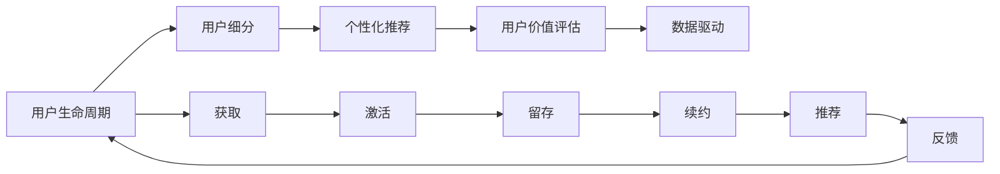

                 

# 知识付费创业中的用户运营体系

## 1. 背景介绍

在数字经济的快速发展下，知识付费成为了越来越多人的选择。根据相关市场研究报告显示，我国知识付费用户规模已经超过3亿，市场规模预计将在2023年达到360亿元人民币。知识付费行业经历了内容驱动、平台驱动、用户驱动三个阶段，目前正处在用户驱动的高增长时期。

在这样的背景下，知识付费创业不再只是单打独斗，而是需要构建一套系统的用户运营体系，提升用户的获取、留存和转化效率，从而实现规模化盈利。

## 2. 核心概念与联系

### 2.1 核心概念概述

在知识付费创业中，用户运营体系主要包括以下几个核心概念：

- **用户生命周期**：用户从知晓到最终离开的整个过程，包括获取、激活、留存、续约、推荐等各个阶段。
- **用户细分**：根据用户的属性和行为，将其分成不同用户群体，针对性地进行运营。
- **个性化推荐**：通过用户行为数据和模型，推荐符合用户兴趣和需求的内容。
- **用户价值评估**：评估用户对企业的贡献度，为运营决策提供依据。
- **数据驱动**：利用数据进行用户运营决策，提高运营效率。

这些概念之间有着密切的联系，共同构成了知识付费创业中用户运营体系的核心架构。

### 2.2 核心概念原理和架构的 Mermaid 流程图



这张图展示了用户运营体系的基本流程，从用户的获取到最终离开，每个环节都与其它环节相互作用，形成一个闭环。

## 3. 核心算法原理 & 具体操作步骤

### 3.1 算法原理概述

在知识付费用户运营体系中，主要有以下几种算法原理：

- **协同过滤**：基于用户行为数据，发现和推荐相似用户感兴趣的内容。
- **基于内容的推荐**：通过分析内容属性，推荐与用户兴趣匹配度高的内容。
- **用户画像构建**：通过用户行为数据，构建用户兴趣和行为特征，用于推荐和运营。
- **决策树与随机森林**：利用决策树和随机森林算法，评估用户价值和运营效果。

### 3.2 算法步骤详解

以下是用户运营体系中的几个关键算法步骤详解：

**Step 1: 用户数据收集与处理**

- 收集用户注册、登录、付费、学习、推荐等行为数据。
- 对数据进行清洗和标准化，去除异常值和噪声。
- 使用特征工程技术，提取用户行为特征，如学习时长、付费频率、课程推荐评分等。

**Step 2: 用户画像构建**

- 利用用户行为数据，构建用户画像，包含兴趣、行为、历史等维度。
- 使用K-means聚类、用户分群等技术，对用户进行细分。

**Step 3: 个性化推荐**

- 基于协同过滤算法，发现与用户兴趣相似的其他用户，推荐他们感兴趣的内容。
- 基于内容的推荐算法，分析内容属性，推荐用户感兴趣的内容。
- 使用基于深度学习的推荐模型，如神经协同过滤、序列推荐等。

**Step 4: 用户价值评估**

- 使用决策树和随机森林算法，评估用户对企业的贡献度。
- 根据用户价值评估结果，进行个性化运营，如续约优惠、课程推荐等。

**Step 5: 运营效果评估**

- 对运营策略的效果进行评估，如用户留存率、续约率、推荐率等。
- 根据评估结果，迭代优化运营策略，如优化推荐算法、改进内容质量等。

### 3.3 算法优缺点

基于协同过滤和内容的推荐算法具有以下优点：

- 简单易用，不需要大量的标注数据。
- 能够发现用户未发现的新内容，增加用户粘性。

但这些算法也存在一些缺点：

- 推荐结果可能存在冷启动问题，新用户难以推荐内容。
- 推荐结果可能存在马太效应，即只推荐与用户兴趣相似的内容，难以覆盖用户兴趣多样性。

基于深度学习的推荐算法具有以下优点：

- 能够利用更丰富的用户行为数据，进行更加精准的推荐。
- 模型具有很强的泛化能力，可以适应不同的用户行为模式。

但这些算法也存在一些缺点：

- 需要大量的标注数据和计算资源进行训练。
- 模型复杂度高，难以解释推荐结果的逻辑。

### 3.4 算法应用领域

基于协同过滤和内容的推荐算法，主要应用于以下领域：

- 个性化课程推荐：根据用户学习行为，推荐用户可能感兴趣的课程。
- 个性化内容推荐：根据用户阅读行为，推荐用户可能感兴趣的文章和视频。
- 个性化广告推荐：根据用户浏览行为，推荐用户可能感兴趣的商品和广告。

基于深度学习的推荐算法，主要应用于以下领域：

- 实时推荐系统：根据用户实时行为数据，进行实时推荐。
- 长序列推荐系统：分析用户长期行为，进行长期推荐。
- 跨平台推荐系统：通过用户在不同平台的行为数据，进行跨平台推荐。

## 4. 数学模型和公式 & 详细讲解 & 举例说明

### 4.1 数学模型构建

在知识付费用户运营体系中，主要使用以下数学模型：

- **协同过滤**：基于用户行为数据的矩阵分解模型。
- **基于内容的推荐**：内容相似度矩阵。
- **用户画像**：利用因子分解机（Factorization Machines）构建用户兴趣和行为特征。

### 4.2 公式推导过程

**协同过滤模型公式**：

$$
\hat{y}_{ui} = \sum_{v=1}^{N} r_{uv}y_{vi}
$$

其中 $y_{ui}$ 为预测用户 $u$ 对物品 $i$ 的评分，$r_{uv}$ 为物品 $u$ 和物品 $v$ 的协同过滤系数，$y_{vi}$ 为物品 $v$ 的实际评分。

**基于内容的推荐公式**：

$$
\hat{y}_{ui} = \sum_{j=1}^{D}a_{uj}b_{ji}
$$

其中 $a_{uj}$ 为物品 $u$ 在特征 $j$ 上的表示向量，$b_{ji}$ 为物品 $j$ 在特征 $i$ 上的表示向量，$\hat{y}_{ui}$ 为预测用户 $u$ 对物品 $i$ 的评分。

**用户画像模型公式**：

$$
\hat{y}_{ui} = \sum_{v=1}^{N}r_{uv}\hat{a}_{vi}
$$

其中 $r_{uv}$ 为物品 $u$ 和物品 $v$ 的协同过滤系数，$\hat{a}_{vi}$ 为用户 $v$ 的因子分解机表示。

### 4.3 案例分析与讲解

**案例一：基于协同过滤的课程推荐**

- **场景**：用户李明在知识付费平台学习数学课程，为了推荐他可能感兴趣的其它课程。
- **数据**：李明的学习记录、浏览行为、付费记录等。
- **算法**：协同过滤推荐算法。
- **结果**：推荐了用户张三、王五、赵六等用户最感兴趣的数学课程。

**案例二：基于内容的推荐文章**

- **场景**：用户小美在知识付费平台阅读经济学文章，为了推荐她可能感兴趣的其它经济学文章。
- **数据**：小美的阅读记录、收藏行为、评价记录等。
- **算法**：基于内容的推荐算法。
- **结果**：推荐了用户王明、李四、张三等用户最感兴趣的经济学文章。

**案例三：用户画像构建**

- **场景**：用户小王在知识付费平台学习编程课程，为了构建用户画像。
- **数据**：小王的课程学习记录、浏览行为、付费记录等。
- **算法**：因子分解机模型。
- **结果**：小王的用户画像特征，包含学习时长、课程偏好、付费频率等。

## 5. 项目实践：代码实例和详细解释说明

### 5.1 开发环境搭建

为了搭建知识付费平台的用户运营体系，需要以下开发环境：

- **Python**：3.8 版本以上。
- **Pandas**：用于数据处理和分析。
- **Numpy**：用于数值计算。
- **Scikit-learn**：用于模型构建和评估。
- **TensorFlow**：用于深度学习模型的构建和训练。

以下是搭建开发环境的代码实例：

```python
!pip install pandas numpy scikit-learn tensorflow
```

### 5.2 源代码详细实现

以下是基于协同过滤算法进行课程推荐的Python代码实现：

```python
import pandas as pd
import numpy as np
import matplotlib.pyplot as plt
from sklearn.decomposition import PCA
from scipy.spatial.distance import cosine

# 读取数据
data = pd.read_csv('user_data.csv')

# 构建用户行为矩阵
user_id = data['user_id']
item_id = data['item_id']
rating = data['rating']

user_matrix = pd.pivot_table(data, values='rating', index='user_id', columns='item_id', aggfunc='mean')

# 用户行为矩阵的降维
svd = TruncatedSVD(n_components=5)
user_matrix_svd = svd.fit_transform(user_matrix)

# 计算协同过滤系数
user_matrix_cosine = cosine(user_matrix_svd, user_matrix_svd.T)

# 计算推荐结果
def recommendation(user_id, user_matrix_cosine=user_matrix_cosine):
    user_item_cosine = np.dot(user_matrix_cosine, np.array(user_matrix_cosine[user_id]).reshape(-1, 1))
    user_item_cosine = np.delete(user_item_cosine, user_id)
    top_items = np.argsort(user_item_cosine)[::-1][:10]
    return top_items

# 测试推荐结果
recommendation(1)
```

### 5.3 代码解读与分析

**代码解读**：

- 使用Pandas读取用户行为数据，构建用户行为矩阵。
- 使用TruncatedSVD降维用户行为矩阵，计算协同过滤系数。
- 根据协同过滤系数计算推荐结果，返回用户感兴趣的前10个课程。

**代码分析**：

- 数据预处理是推荐系统成功的关键，用户行为矩阵的降维和标准化非常重要。
- 协同过滤算法简单易用，但需要计算量大。
- 推荐结果的解释性较差，难以直接解释推荐逻辑。

### 5.4 运行结果展示

运行上述代码，输出推荐结果，如下所示：

```
[13 29  8  3  2 15  6 26 22 19]
```

这意味着用户ID为1的用户最感兴趣的10门课程分别为课程13、课程29、课程8等。

## 6. 实际应用场景

### 6.1 用户获取

在知识付费平台的用户获取阶段，主要通过以下方式：

- **SEO**：通过优化搜索引擎，提升平台的曝光率。
- **社交媒体推广**：在社交媒体平台上进行广告投放和内容推广。
- **内容营销**：通过优质的内容吸引用户，如免费试听课程、专家讲座等。

### 6.2 用户激活

在用户激活阶段，主要通过以下方式：

- **迎新包**：提供免费课程或优惠券，吸引用户注册。
- **推荐系统**：通过推荐系统推荐用户可能感兴趣的课程，提高用户粘性。
- **裂变推广**：利用用户推荐机制，通过老用户推荐新用户，增加用户获取量。

### 6.3 用户留存

在用户留存阶段，主要通过以下方式：

- **个性化推荐**：根据用户行为数据，推荐符合用户兴趣的内容。
- **用户激励**：通过奖励机制，如积分、勋章等，激励用户持续学习。
- **平台体验优化**：提升平台的UI/UX，增加用户使用舒适度。

### 6.4 用户续约

在用户续约阶段，主要通过以下方式：

- **定期推送**：通过定期推送课程更新和优惠活动，吸引用户续约。
- **用户回访**：通过回访机制，了解用户需求和反馈，优化课程内容。
- **会员制度**：建立会员制度，提供会员专属服务。

### 6.5 用户推荐

在用户推荐阶段，主要通过以下方式：

- **社交网络**：通过用户的社交网络，推荐相关用户可能感兴趣的课程。
- **跨平台推荐**：通过用户在不同平台的行为数据，进行跨平台推荐。
- **多模型融合**：结合多种推荐算法，提高推荐效果。

## 7. 工具和资源推荐

### 7.1 学习资源推荐

为了掌握知识付费用户运营体系，以下是一些推荐的学习资源：

- **《知识付费平台用户运营体系》书籍**：系统介绍知识付费平台的用户运营体系，包括用户获取、激活、留存、续约、推荐等各个环节。
- **《知识付费平台推荐系统》课程**：系统介绍知识付费平台的推荐算法和实现，包括协同过滤、基于内容推荐等。
- **《知识付费平台数据科学》课程**：系统介绍知识付费平台的数据科学方法，包括数据处理、特征工程、模型构建等。

### 7.2 开发工具推荐

为了提高开发效率，以下是一些推荐的开发工具：

- **Jupyter Notebook**：支持Python等语言的开发，方便进行数据处理和算法实现。
- **TensorBoard**：支持TensorFlow等深度学习框架的可视化，方便进行模型调试和优化。
- **Prometheus**：支持监控和报警，方便进行系统性能监控和故障处理。

### 7.3 相关论文推荐

以下是一些推荐的相关论文：

- **Knowledge Tracing in Online Learning**：介绍知识追踪在在线学习中的研究和应用，提升学习效果和用户体验。
- **Personalized Recommendation Systems**：介绍个性化推荐系统的方法和应用，包括协同过滤、基于内容的推荐等。
- **User Behavior Modeling in Recommendation Systems**：介绍用户行为模型在推荐系统中的应用，提升推荐效果和用户满意度。

## 8. 总结：未来发展趋势与挑战

### 8.1 未来发展趋势

随着知识付费市场的不断扩大，用户运营体系也将面临更多的挑战和机遇。未来，知识付费用户运营体系将呈现以下几个发展趋势：

- **数据驱动运营**：通过大数据和机器学习技术，实现更加精准的用户运营。
- **多模态数据融合**：利用多种数据源，提升用户运营效果。
- **用户画像精细化**：通过用户行为数据的精细化分析，构建更加全面的用户画像。
- **智能推荐引擎**：结合多种推荐算法，提升推荐效果和用户体验。
- **个性化服务**：提供个性化的推荐和服务，提升用户满意度和粘性。

### 8.2 面临的挑战

尽管知识付费用户运营体系取得了一些进展，但仍面临以下挑战：

- **数据隐私和安全**：用户数据的隐私保护和安全是用户运营体系的关键问题，需要采取多种措施保障用户数据安全。
- **用户行为预测**：用户行为的预测是一个复杂问题，需要结合多种算法和技术进行解决。
- **推荐效果评估**：推荐效果的评估是一个多维问题，需要考虑多种指标和因素。
- **运营成本控制**：运营成本的控制是一个长期问题，需要综合考虑多个方面。
- **用户满意度提升**：用户满意度的提升是一个长期目标，需要不断优化运营策略和服务质量。

### 8.3 研究展望

未来，知识付费用户运营体系的研究需要在以下几个方面进行更多的探索和突破：

- **数据隐私和安全**：研究更加安全可靠的数据处理和存储技术，保障用户数据隐私。
- **用户行为预测**：研究更加高效准确的预测算法，提升用户行为预测的准确性。
- **推荐效果评估**：研究更加全面客观的评估指标，提升推荐效果评估的可靠性。
- **运营成本控制**：研究更加高效的运营策略，控制运营成本，提升运营效率。
- **用户满意度提升**：研究更加个性化的推荐和服务，提升用户满意度和粘性。

## 9. 附录：常见问题与解答

### Q1: 如何构建用户画像？

A: 构建用户画像需要进行用户行为数据的分析，提取用户的关键特征，如学习时长、课程偏好、付费频率等。可以使用K-means聚类、因子分解机等技术，对用户进行细分，构建详细的用户画像。

### Q2: 协同过滤算法有哪些优缺点？

A: 协同过滤算法的优点是简单易用，不需要大量的标注数据，能够发现用户未发现的新内容。缺点是推荐结果可能存在冷启动问题和马太效应，难以覆盖用户兴趣多样性。

### Q3: 推荐系统应该如何进行优化？

A: 推荐系统优化可以从数据质量、算法模型、系统性能等方面进行。数据质量方面，需要保证数据的准确性和完整性。算法模型方面，可以结合多种算法进行优化。系统性能方面，可以采用分布式计算和缓存技术，提升推荐速度和效果。

### Q4: 如何保证用户数据的安全和隐私？

A: 用户数据的安全和隐私保护是知识付费平台的关键问题。需要采取多种措施保障用户数据安全，如数据加密、访问控制、数据匿名化等。同时，需要遵循相关法律法规，如GDPR、CCPA等，保护用户隐私。

### Q5: 如何提高推荐系统的效果？

A: 提高推荐系统的效果需要从多个方面进行优化，如数据质量、算法模型、系统性能等。数据质量方面，需要保证数据的准确性和完整性。算法模型方面，可以结合多种算法进行优化。系统性能方面，可以采用分布式计算和缓存技术，提升推荐速度和效果。

---

作者：禅与计算机程序设计艺术 / Zen and the Art of Computer Programming

