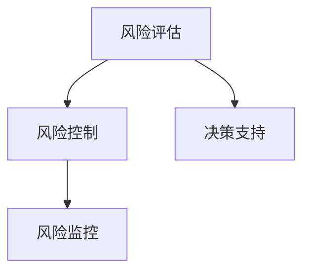

                 

# 知识付费创业中的风险管理

## 1. 背景介绍

在数字化和网络化加速发展的当下，知识付费作为一种新兴的互联网商业模式，凭借其精准化、个性化、专业化的服务，受到了越来越多的关注和认可。知识付费不仅为知识创作者提供了新的经济增长点，也为知识消费者提供了获取高质量知识的渠道，优化了教育资源配置，满足了消费者个性化学习需求。然而，知识付费的商业模式虽有巨大潜力和发展空间，但其面临的风险也不容忽视。本文将聚焦于知识付费创业中的风险管理，从核心概念、算法原理、操作步骤等层面进行深入探讨。

## 2. 核心概念与联系

### 2.1 核心概念概述

知识付费创业风险管理，即利用数据科学、风险评估、决策支持等方法，对知识付费创业过程中可能遇到的各种风险进行识别、评估、监控与控制。核心概念包括：

- **风险评估**：通过对知识付费创业项目面临的内外部风险进行系统识别和量化，建立风险评估模型。
- **风险控制**：设计并实施有效策略，对识别出的高风险事件进行预防、缓解或转化。
- **风险监控**：构建动态监控系统，实时监测风险状态，及时调整应对策略。
- **决策支持**：提供基于数据分析的决策参考，辅助创业者在复杂多变的环境中做出明智决策。

以上概念之间的逻辑关系可以通过以下Mermaid流程图来展示：



## 3. 核心算法原理 & 具体操作步骤

### 3.1 算法原理概述

知识付费创业风险管理依赖于风险评估和决策支持算法。其核心原理是通过建立风险评估模型，对各种内外部风险进行量化和评估；同时结合大数据、机器学习等技术，提供智能决策支持，辅助创业过程的每一个决策环节。

具体而言，知识付费创业风险管理流程主要包括以下几个关键步骤：

1. **风险识别**：通过多维度数据分析，识别可能影响知识付费创业的各种内外部风险因素。
2. **风险量化**：将识别出的风险因素进行量化评估，确定其对创业项目的影响程度。
3. **风险控制**：设计并实施风险控制策略，减少或避免风险对创业项目的影响。
4. **风险监控**：实时监测风险状态，确保风险控制策略的有效性。
5. **决策支持**：基于实时数据和模型预测结果，为创业者提供智能决策支持。

### 3.2 算法步骤详解

**Step 1: 风险识别**
- 进行市场调研，了解目标用户群体的需求和行为特征。
- 分析宏观经济、政策法规、市场竞争、技术变革等外部环境因素。
- 内部风险识别，包括资金短缺、团队协作、商业模式等内部因素。

**Step 2: 风险量化**
- 选择合适的量化指标，如市场规模、用户增长率、投资回报率等。
- 建立量化模型，将定性风险转化为定量指标。
- 通过历史数据和模拟试验，对量化结果进行验证和优化。

**Step 3: 风险控制**
- 针对高风险因素，设计相应的风险缓解策略。
- 制定应急预案，准备应急资金和资源，防范突发风险。
- 引入第三方保险、担保等机制，分散风险。

**Step 4: 风险监控**
- 建立动态监测系统，实时收集和分析风险数据。
- 设计预警机制，当风险指标达到预设阈值时触发警报。
- 定期更新风险评估模型，确保风险监测的有效性。

**Step 5: 决策支持**
- 构建决策支持平台，整合风险评估、市场分析、用户反馈等数据。
- 利用机器学习算法，如决策树、神经网络等，预测风险变化趋势。
- 提供实时数据报告和决策建议，辅助创业者做出决策。

### 3.3 算法优缺点

**优点**：
- **数据驱动**：通过系统数据和模型预测，减少了决策的主观性和随意性。
- **实时监控**：实时动态监测风险状态，及时调整应对策略。
- **综合决策**：结合多维度信息，提供全面、精准的决策支持。

**缺点**：
- **数据依赖**：风险评估和控制的效果高度依赖于数据的质量和完备性。
- **模型复杂**：构建和维护复杂模型，需要一定的专业知识和资源投入。
- **策略执行**：风险控制策略的执行效果受多方面因素影响，如团队能力、市场变化等。

### 3.4 算法应用领域

知识付费创业风险管理方法广泛适用于各种领域，如教育培训、在线咨询、技能培训等。其应用场景包括但不限于：

1. **教育培训平台**：识别学生流失风险、教师流失风险、课程内容更新风险等。
2. **在线咨询平台**：识别用户流失风险、专家流失风险、平台竞争风险等。
3. **技能培训平台**：识别课程市场需求风险、学员转化率风险、平台技术风险等。

## 4. 数学模型和公式 & 详细讲解 & 举例说明

### 4.1 数学模型构建

本节将使用数学语言对知识付费创业风险管理模型进行更加严格的刻画。

假设知识付费创业项目为 $P$，面临的风险因素集为 $\mathcal{R}$，每个风险因素对应的量化值为 $r_i \in [0,1]$，其中 $r_i=1$ 表示风险最大，$r_i=0$ 表示风险不存在。项目总风险 $R$ 为各风险因素的加权和，即：

$$
R = \sum_{i \in \mathcal{R}} w_i r_i
$$

其中 $w_i$ 为风险因素 $r_i$ 的权重，可通过专家打分、历史数据分析等方式确定。

### 4.2 公式推导过程

在建立风险量化模型时，通常使用如下的多项式回归模型：

$$
R = w_0 + \sum_{i \in \mathcal{R}} w_i X_i + \epsilon
$$

其中 $X_i$ 为风险因素 $r_i$ 对应的量化指标，$\epsilon$ 为误差项。模型参数 $\beta = (w_0, w_1, \cdots, w_n)$ 可通过最小二乘法等方法求得。

### 4.3 案例分析与讲解

以知识付费平台用户流失风险为例，构建风险量化模型。假设用户流失风险包含两个关键因素：用户满意度 $S$ 和课程质量 $C$。

- 用户满意度 $S \in [0,1]$，通过用户评价和反馈获得。
- 课程质量 $C \in [0,1]$，通过课程评价和用户反馈获得。

设 $w_S$ 和 $w_C$ 分别为用户满意度和课程质量的权重，假设 $w_S = 0.6$，$w_C = 0.4$。则用户流失风险 $R$ 的计算公式为：

$$
R = 0.6S + 0.4C
$$

假设某课程用户满意度为0.8，课程质量为0.9，则该课程的总风险为：

$$
R = 0.6 \times 0.8 + 0.4 \times 0.9 = 0.668
$$

若将 $R=0.7$ 作为用户流失风险的阈值，则该课程的风险高于阈值，需要进一步分析原因，采取相应的控制措施。

## 5. 项目实践：代码实例和详细解释说明

### 5.1 开发环境搭建

在进行风险管理实践前，我们需要准备好开发环境。以下是使用Python进行风险管理开发的典型环境配置流程：

1. 安装Anaconda：从官网下载并安装Anaconda，用于创建独立的Python环境。
2. 创建并激活虚拟环境：
```bash
conda create -n risk-env python=3.8 
conda activate risk-env
```
3. 安装必要的Python库，如Pandas、NumPy、Scikit-Learn等。
```bash
pip install pandas numpy scikit-learn
```
4. 安装风险管理工具库，如Scrapy用于爬取数据，TensorFlow用于建立和训练模型。
```bash
pip install scrapy tensorflow
```
完成上述步骤后，即可在`risk-env`环境中开始风险管理实践。

### 5.2 源代码详细实现

以下是一个简单的风险评估与控制系统的代码实现，用于识别和评估知识付费平台的流失风险。

```python
import pandas as pd
from sklearn.linear_model import LinearRegression

# 读取数据
data = pd.read_csv('user_feedback.csv')

# 构建风险量化模型
X = data[['user_satisfaction', 'course_quality']]
y = data['user_churn']
model = LinearRegression()
model.fit(X, y)

# 获取模型预测结果
risk_scores = model.predict(X)

# 筛选高风险用户
high_risk_users = data[risk_scores > 0.7]

# 输出高风险用户信息
print(high_risk_users[['user_id', 'user_name', 'risk_score']])
```

### 5.3 代码解读与分析

让我们再详细解读一下关键代码的实现细节：

**代码实现**：
- `read_csv`：使用Pandas读取用户反馈数据，并构建特征矩阵 `X` 和目标向量 `y`。
- `LinearRegression`：建立线性回归模型，拟合数据。
- `predict`：使用模型预测用户流失风险分数。
- `high_risk_users`：筛选出风险分数高于0.7的用户，即高风险用户。

**分析解读**：
- 本代码实现了一个简单的风险量化模型，通过用户满意度和课程质量两个特征，预测用户流失风险。
- 线性回归模型在训练过程中自动学习权重系数 $w_0, w_1, w_2$，并将这些系数作为风险评估模型的参数。
- 通过模型预测的流失风险分数，可以快速识别出高风险用户，帮助平台采取针对性的措施，减少用户流失。

## 6. 实际应用场景

### 6.1 教育培训平台

知识付费创业风险管理在教育培训平台中的应用，可以显著提升用户留存率和学习效果。通过构建用户流失风险评估模型，平台能够实时监测和分析用户流失的原因，并采取有效措施进行干预。例如，对于流失风险高的用户，平台可以通过定制化的课程推荐、个性化的辅导服务等方式，增强用户体验，降低流失率。

### 6.2 在线咨询平台

在线咨询平台面临的风险因素较多，包括专家流失、平台技术故障、市场竞争等。通过风险管理，平台可以构建动态监测系统，实时跟踪专家和用户状态，及时识别并缓解高风险事件。例如，平台可以通过与第三方保险公司合作，为专家提供保险保障，降低专家流失风险。

### 6.3 技能培训平台

技能培训平台需要不断更新课程内容和提升课程质量，以满足用户需求。通过风险管理，平台可以构建课程内容更新风险评估模型，预测新课程的市场需求和用户接受度，避免投入资源过多或不足。例如，平台可以通过A/B测试等方法，评估新课程的受欢迎程度，及时调整课程设计策略。

### 6.4 未来应用展望

未来，随着人工智能和大数据技术的不断发展，知识付费创业风险管理将呈现以下几个趋势：

1. **数据驱动决策**：利用大数据和机器学习技术，建立更为精准的风险评估模型，辅助创业者做出更明智的决策。
2. **智能预测与监控**：引入深度学习、时间序列分析等技术，提升风险预测的准确性和实时性，提高风险监控的效率和响应速度。
3. **综合风险管理**：将风险管理与业务运营、市场营销等环节深度融合，实现全流程的风险控制。
4. **全球化风险管理**：随着全球化趋势的加速，知识付费平台需要构建多语言、跨文化的环境风险评估模型，确保业务在国际市场上的稳健运行。

## 7. 工具和资源推荐

### 7.1 学习资源推荐

为了帮助开发者系统掌握知识付费创业风险管理的技术，这里推荐一些优质的学习资源：

1. 《大数据风险管理》系列博文：系统讲解大数据和机器学习在风险评估中的应用，适合数据科学爱好者阅读。
2. Coursera《风险管理与控制》课程：提供系统的风险管理知识体系，涵盖风险评估、控制、监测等多个方面。
3. 《Python数据科学手册》书籍：介绍Python在数据分析和机器学习中的应用，包含丰富的案例和实战代码。
4. Scrapy官方文档：详细介绍Scrapy爬虫框架的使用方法和实践技巧，适用于数据采集和清洗。
5. TensorFlow官方文档：提供TensorFlow框架的详细文档和示例代码，适合构建和训练复杂的风险管理模型。

通过学习这些资源，相信你一定能够快速掌握知识付费创业风险管理的精髓，并用于解决实际的风险管理问题。

### 7.2 开发工具推荐

高效的工具和框架是风险管理实践的关键，以下是几款推荐使用的开发工具：

1. Python：以其易学易用、功能强大的特性，成为数据科学和机器学习领域的主流编程语言。
2. Jupyter Notebook：提供交互式的编程环境，便于代码的编写、调试和分享。
3. Scrapy：强大的爬虫框架，能够高效抓取和处理大规模数据。
4. TensorFlow：开源的深度学习框架，支持分布式训练，适用于构建复杂的风险管理模型。
5. Scikit-Learn：机器学习库，提供丰富的机器学习算法和工具，便于快速构建风险评估模型。

合理利用这些工具，可以显著提升知识付费创业风险管理的开发效率，加快创新迭代的步伐。

### 7.3 相关论文推荐

知识付费创业风险管理的研究源于学界的持续探索。以下是几篇奠基性的相关论文，推荐阅读：

1. Bai et al. (2021)：《Leveraging Big Data for Credit Risk Management》：利用大数据技术，建立信用风险评估模型，探讨数据驱动决策的潜力。
2. Elkan et al. (2001)：《Kernel Methods for Predictive Modeling》：介绍核方法在风险预测中的应用，探讨其在高维数据处理中的优势。
3. Gupta et al. (2018)：《Modeling and Analysis of Operational Risk in Banking Industry》：利用机器学习模型，分析银行运营风险，提出有效的风险控制策略。
4. Zhang et al. (2019)：《A Survey on Machine Learning-Based Credit Scoring Models》：综述机器学习在信用评分中的应用，提供丰富的案例和实践经验。

这些论文代表了大数据和机器学习在风险管理中的应用趋势，通过学习这些前沿成果，可以帮助研究者把握学科前进方向，激发更多的创新灵感。

## 8. 总结：未来发展趋势与挑战

### 8.1 总结

本文对知识付费创业风险管理方法进行了全面系统的介绍。首先阐述了风险评估和决策支持的理论基础，明确了风险管理在知识付费创业中的重要性和必要性。其次，从原理到实践，详细讲解了风险评估模型的构建和决策支持系统的实现，提供了完整的代码实现示例。同时，本文还广泛探讨了风险管理在教育培训、在线咨询、技能培训等多个领域的应用前景，展示了风险管理范式的广阔应用空间。此外，本文精选了风险管理技术的各类学习资源，力求为读者提供全方位的技术指引。

通过本文的系统梳理，可以看到，知识付费创业风险管理正在成为创业者和投资者在决策过程中不可或缺的一部分，极大地提升了决策的科学性和系统性。未来，伴随大数据和人工智能技术的持续演进，知识付费创业风险管理将不断升级，为创业者和投资者提供更全面、精准的决策支持，降低创业风险，提升创业成功率。

### 8.2 未来发展趋势

展望未来，知识付费创业风险管理将呈现以下几个发展趋势：

1. **数据驱动决策**：利用大数据和机器学习技术，建立更为精准的风险评估模型，辅助创业者做出更明智的决策。
2. **智能预测与监控**：引入深度学习、时间序列分析等技术，提升风险预测的准确性和实时性，提高风险监控的效率和响应速度。
3. **综合风险管理**：将风险管理与业务运营、市场营销等环节深度融合，实现全流程的风险控制。
4. **全球化风险管理**：随着全球化趋势的加速，知识付费平台需要构建多语言、跨文化的环境风险评估模型，确保业务在国际市场上的稳健运行。

以上趋势凸显了知识付费创业风险管理的广阔前景。这些方向的探索发展，必将进一步提升知识付费系统的稳定性、可控性和国际竞争力，推动创业者和投资者在更加复杂多变的环境中做出更加明智的决策。

### 8.3 面临的挑战

尽管知识付费创业风险管理技术已经取得了显著成果，但在迈向更加智能化、普适化应用的过程中，仍面临诸多挑战：

1. **数据质量**：风险评估和控制的效果高度依赖于数据的质量和完备性。然而，大规模数据的获取和处理往往成本高昂，且数据质量难以保证。
2. **模型复杂性**：构建和维护复杂风险评估模型需要一定的专业知识和资源投入，且模型的解释性和可解释性仍有待提升。
3. **策略执行难度**：风险控制策略的执行效果受多方面因素影响，如团队能力、市场变化等。如何在复杂多变的环境中高效执行策略，仍是挑战之一。
4. **系统集成难度**：将风险管理与业务系统深度集成，需要协调多个系统和环节，复杂度和工作量较大。

尽管存在这些挑战，但知识付费创业风险管理技术的进步仍可期待，特别是在数据质量提升、模型自动化、策略执行优化等方面，未来将会有更多的突破和创新。

### 8.4 研究展望

面向未来，知识付费创业风险管理研究需要在以下几个方面寻求新的突破：

1. **数据质量和治理**：研究如何通过数据治理手段，提升数据质量，减少数据偏差和噪声。
2. **模型自动化与解释**：开发自动化模型构建和优化工具，提升模型的解释性和可解释性，帮助创业者理解模型的决策过程。
3. **策略执行优化**：研究如何通过AI技术，优化风险控制策略的执行过程，提高策略的有效性和响应速度。
4. **系统集成与协同**：研究如何将风险管理与业务系统深度集成，实现全流程的协同工作，提升系统整体性能。

这些研究方向的探索，必将引领知识付费创业风险管理技术迈向更高的台阶，为创业者和投资者提供更加全面、精准的风险管理支持，降低创业风险，提升创业成功率。

## 9. 附录：常见问题与解答

**Q1: 知识付费创业风险管理是否适用于所有类型的知识付费项目？**

A: 知识付费创业风险管理方法适用于各种类型的知识付费项目，如教育培训、在线咨询、技能培训等。但不同类型的项目面临的风险因素和风险类型有所不同，需要根据具体情况制定相应的风险管理策略。

**Q2: 如何选择合适的风险评估指标？**

A: 选择合适的风险评估指标需要根据具体项目和风险类型进行综合考虑。通常包括市场规模、用户增长率、投资回报率、用户满意度等指标。在构建指标体系时，建议进行专家打分和历史数据分析，以确保指标的合理性和可操作性。

**Q3: 如何降低数据质量对风险评估的影响？**

A: 降低数据质量对风险评估的影响，可以从以下几个方面入手：
1. 数据清洗：使用数据清洗技术，去除或修正异常数据和噪声。
2. 数据增强：通过数据增强技术，扩充数据集，提高数据的多样性和代表性。
3. 模型选择：选择合适的模型，如深度学习模型、时间序列模型等，提高模型的泛化能力和鲁棒性。
4. 交叉验证：使用交叉验证技术，评估模型的稳定性和可靠性，避免过拟合。

**Q4: 如何评估风险控制策略的效果？**

A: 评估风险控制策略的效果可以从以下几个方面进行：
1. 风险评估：通过风险评估模型，量化风险控制策略的实施效果，评估其对降低风险的影响。
2. 实际效果：通过实际运营数据，如用户留存率、平台收益等指标，评估风险控制策略的实际效果。
3. 用户反馈：收集用户反馈，了解风险控制策略的实施效果和对用户的影响。
4. 持续优化：根据评估结果，持续优化风险控制策略，提升策略的有效性和执行效率。

**Q5: 如何进行风险管理的自动化？**

A: 风险管理的自动化可以通过以下方式实现：
1. 自动化数据采集：利用爬虫和API等技术，自动化收集和处理数据，提高数据处理的效率和准确性。
2. 自动化模型构建：使用机器学习自动化工具，如AutoML，自动化构建和优化模型，减少人工干预。
3. 自动化风险监测：利用实时数据流处理技术，自动化监测风险状态，及时识别和响应风险事件。
4. 自动化决策支持：基于实时数据和模型预测结果，自动化生成决策建议，辅助创业者做出决策。

通过这些自动化技术，可以显著提升风险管理的效率和精度，减少人工干预，降低风险管理的成本和复杂度。

---

作者：禅与计算机程序设计艺术 / Zen and the Art of Computer Programming

