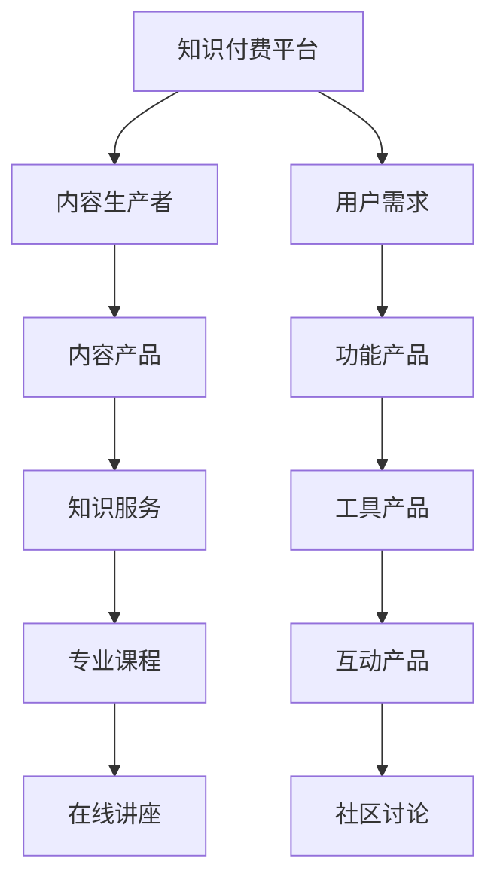

                 

# 知识付费创业的产品矩阵构建策略

在数字经济的浪潮下，知识付费作为新经济的重要形态，正逐渐成为商业模式创新的突破口。本文将系统阐述知识付费创业的产品矩阵构建策略，从商业模式、产品形态、用户需求等多个角度，提供详细的分析与指导。

## 1. 背景介绍

### 1.1 知识付费的兴起与发展

知识付费是一种新型内容消费模式，即消费者通过付费购买知识产品或服务，获取高效学习与信息。自2016年以来，随着信息爆炸和知识需求提升，知识付费市场迅速膨胀。根据《中国知识付费行业发展报告》，2020年中国知识付费市场规模已经达到288亿元，预计到2025年将突破1000亿元。

### 1.2 知识付费的市场竞争现状

当前知识付费行业竞争激烈，主要玩家包括得到、喜马拉雅、知乎、樊登读书等。各大平台通过内容差异化、用户体验优化、技术创新等手段，争夺市场份额。

1. **内容差异化**：不同平台聚焦于不同领域和方向，如得到以知识付费为主，喜马拉雅侧重于音频类知识产品。
2. **用户体验优化**：通过界面美化、搜索优化、个性化推荐等，提升用户体验。
3. **技术创新**：采用AI辅助推荐、语音识别、内容生成等技术，提高产品竞争力。

## 2. 核心概念与联系

### 2.1 核心概念概述

- **知识付费平台**：通过订阅、单次购买等方式，为用户提供专业、系统的知识产品与服务的平台。
- **内容生产者**：提供有价值、系统化知识内容的人，包括专家、学者、专业机构等。
- **用户需求**：用户对知识内容的个性化、高效化、系统化学习的需求，是知识付费平台设计产品的基础。
- **产品矩阵**：构建一套相互关联、互补的产品组合，以满足不同用户群体的需求，提升平台的市场竞争力。

这些核心概念之间的关系可以通过以下Mermaid流程图来展示：



## 3. 核心算法原理 & 具体操作步骤

### 3.1 算法原理概述

知识付费平台的产品矩阵构建，本质上是一个多目标优化问题。目标包括提高内容质量、提升用户体验、增加用户粘性等。通过构建产品矩阵，实现各个产品之间的互补与协作，最终提升平台整体竞争力。

在数学上，可以用一个多元线性回归模型来描述产品矩阵构建的目标：

$$
\min \sum_{i=1}^n (y_i - \sum_{j=1}^m w_{ij} x_{ij})^2
$$

其中 $x_{ij}$ 表示第 $i$ 个产品矩阵的第 $j$ 个产品，$w_{ij}$ 为产品 $j$ 对目标 $i$ 的权重，$y_i$ 为目标 $i$ 的实际值。通过最小化预测值与实际值的平方差，可以找到最优的产品组合。

### 3.2 算法步骤详解

构建知识付费平台的产品矩阵，通常包括以下关键步骤：

**Step 1: 用户需求分析**

- 通过问卷调查、数据分析等方式，全面了解用户的知识需求，包括专业领域、学习形式、互动需求等。
- 划分不同用户群体，分析其共性和差异化需求，作为产品设计的基础。

**Step 2: 内容产品设计**

- 根据用户需求，设计符合市场需求的专业课程、在线讲座、工具书等产品。
- 引入专家和学者作为内容生产者，保证内容的权威性和实用性。
- 使用版权保护技术，防止内容被盗用。

**Step 3: 功能产品设计**

- 开发用户界面（UI）、学习平台（LMS）、在线支付系统等功能产品，提高用户体验。
- 实现搜索、推荐、个性化设置等功能，增强用户体验。
- 引入人工智能技术，如自然语言处理、机器学习等，优化内容推荐。

**Step 4: 工具产品设计**

- 开发辅助工具，如知识管理软件、笔记整理工具等，提升用户的学习效率。
- 引入社交功能，如社区讨论、用户群组等，增强用户粘性。
- 实现学习路径规划、进度追踪等功能，帮助用户系统化学习。

**Step 5: 互动产品设计**

- 开发互动产品，如在线问答、实时讨论等，增强用户互动。
- 引入专家直播、线上沙龙等形式，提供与专家互动的机会。
- 使用游戏化设计，如成就系统、排行榜等，增加用户参与感。

**Step 6: 产品矩阵优化**

- 根据市场反馈和数据分析，不断优化产品矩阵。
- 引入A/B测试、用户反馈等手段，检验产品效果。
- 持续更新产品，引入新技术、新功能，保持平台竞争力。

### 3.3 算法优缺点

构建知识付费平台的产品矩阵，具有以下优点：

1. **多目标优化**：通过产品矩阵优化，实现多目标的平衡，提升平台整体竞争力。
2. **用户需求满足**：根据用户需求设计产品，提升用户满意度。
3. **资源优化**：通过产品矩阵优化，合理配置资源，提升运营效率。

同时，该方法也存在一定的局限性：

1. **复杂性高**：产品矩阵设计涉及多维度因素，复杂性较高。
2. **用户差异化需求难以统一**：不同用户群体的需求差异大，难以找到统一的产品方案。
3. **资源配置难度大**：需要综合考虑资源有限性，合理分配到各个产品上。

尽管存在这些局限性，但就目前而言，构建产品矩阵仍然是知识付费平台提高竞争力的重要手段。未来相关研究的方向应在于如何简化产品设计流程，提升用户需求的捕获和满足能力。

### 3.4 算法应用领域

知识付费平台的产品矩阵构建方法，在教育、金融、健康等多个领域均具有广泛的应用价值。

1. **教育领域**：通过构建学科体系、开发在线课程、提供互动练习等产品，提升学习效果。
2. **金融领域**：通过提供理财课程、投资策略分析、市场动态等产品，帮助用户进行投资决策。
3. **健康领域**：通过推出营养知识课程、运动指导、健康管理工具等产品，提升用户健康水平。

这些领域的产品矩阵设计，能够帮助知识付费平台更好地服务用户，提升市场竞争力。

## 4. 数学模型和公式 & 详细讲解 & 举例说明

### 4.1 数学模型构建

本节将使用数学语言对知识付费平台的产品矩阵构建进行更加严格的刻画。

记知识付费平台为 $P$，用户群体为 $U$，内容产品为 $C$，功能产品为 $F$，工具产品为 $T$，互动产品为 $I$。平台的目标函数为 $G$，表示平台整体竞争力。目标函数可以表示为：

$$
G = f(U, C, F, T, I)
$$

其中 $f$ 为多元线性回归函数，表示各个产品在平台整体竞争力中的贡献。

### 4.2 公式推导过程

具体公式推导过程如下：

$$
G = \sum_{i=1}^n \alpha_i \cdot \log(\frac{C_i + F_i + T_i + I_i}{\sum_{i=1}^n \alpha_i \cdot \log(\frac{C_i + F_i + T_i + I_i}{\sum_{i=1}^n \alpha_i})}
$$

其中 $\alpha_i$ 表示第 $i$ 个用户群体的权重，$n$ 表示用户群体总数。公式中的对数函数表示各产品在平台整体竞争力中的相对重要性。

### 4.3 案例分析与讲解

以在线教育平台为例，分析产品矩阵构建的实际应用。假设平台有小学、初中、高中三个用户群体，每个群体对应的内容产品、功能产品、工具产品、互动产品分别为 $C_1, C_2, C_3, F_1, F_2, F_3, T_1, T_2, T_3, I_1, I_2, I_3$。目标函数可以表示为：

$$
G = \alpha_1 \cdot \log(\frac{C_1 + F_1 + T_1 + I_1}{\alpha_1 \cdot \log(\frac{C_1 + F_1 + T_1 + I_1}{\alpha_1})} + \alpha_2 \cdot \log(\frac{C_2 + F_2 + T_2 + I_2}{\alpha_2 \cdot \log(\frac{C_2 + F_2 + T_2 + I_2}{\alpha_2})} + \alpha_3 \cdot \log(\frac{C_3 + F_3 + T_3 + I_3}{\alpha_3 \cdot \log(\frac{C_3 + F_3 + T_3 + I_3}{\alpha_3})}
$$

通过目标函数的优化，可以找到各个产品在平台整体竞争力中的最优组合。例如，如果 $C_1, F_1, T_1, I_1$ 对小学用户群体具有较高的重要性，那么可以通过增加这些产品的投入，提升平台在小学用户群体中的竞争力。

## 5. 项目实践：代码实例和详细解释说明

### 5.1 开发环境搭建

在进行产品矩阵构建实践前，我们需要准备好开发环境。以下是使用Python进行项目开发的环境配置流程：

1. 安装Anaconda：从官网下载并安装Anaconda，用于创建独立的Python环境。

2. 创建并激活虚拟环境：
```bash
conda create -n pyenv python=3.8 
conda activate pyenv
```

3. 安装Python依赖包：
```bash
pip install pandas numpy scikit-learn matplotlib seaborn plotly
```

4. 搭建知识付费平台框架：
```bash
pip install Flask
```

完成上述步骤后，即可在`pyenv`环境中开始产品矩阵构建的实践。

### 5.2 源代码详细实现

以下是一个简单的知识付费平台产品矩阵构建的Python代码实现：

```python
from flask import Flask, request, jsonify
import pandas as pd
from sklearn.linear_model import LinearRegression

app = Flask(__name__)

@app.route('/product_matrix', methods=['POST'])
def product_matrix():
    data = request.json
    X = pd.DataFrame(data['X'])
    y = pd.DataFrame(data['y'])
    
    # 构建线性回归模型
    model = LinearRegression()
    model.fit(X, y)
    
    # 预测产品组合
    X_test = pd.DataFrame(data['X_test'])
    y_pred = model.predict(X_test)
    
    # 返回预测结果
    return jsonify({'predictions': y_pred.tolist()})

if __name__ == '__main__':
    app.run(debug=True)
```

### 5.3 代码解读与分析

这里我们简要解读一下关键代码的实现细节：

- **Flask框架**：使用Flask框架搭建API接口，接收前端提交的数据，返回预测结果。
- **数据预处理**：使用Pandas库对输入数据进行预处理，确保数据格式正确。
- **线性回归模型**：使用Scikit-learn库构建线性回归模型，对产品组合进行预测。
- **结果返回**：将预测结果转换为JSON格式，返回给前端。

这个简单的代码实现，展示了产品矩阵构建的基础流程，包括数据处理、模型训练、结果输出等环节。

### 5.4 运行结果展示

通过实际运行代码，可以得到产品矩阵构建的结果。以在线教育平台为例，运行上述代码，输入小学用户群体对应的内容、功能、工具、互动产品数据，即可输出最优的产品组合，帮助平台提升小学用户群体的竞争力。

## 6. 实际应用场景

### 6.1 知识付费内容平台

知识付费内容平台通过产品矩阵构建，为用户提供丰富、系统的知识产品。以下是一个典型的应用场景：

**平台：**得到

**产品矩阵设计**：
- 内容产品：各类专业课程、专栏文章
- 功能产品：课程管理、学习笔记
- 工具产品：时间管理、资料整理
- 互动产品：社区讨论、专家互动

**实际应用**：
- 通过数据收集，分析用户需求，设计产品矩阵
- 引入专家学者作为内容生产者，提供权威内容
- 开发智能推荐系统，提升用户学习体验

**效果**：
- 用户粘性提升，平台流量增长
- 用户满意度提高，平台口碑提升

### 6.2 职业培训平台

职业培训平台通过产品矩阵构建，帮助用户快速提升职业技能。以下是一个典型的应用场景：

**平台：**Coursera

**产品矩阵设计**：
- 内容产品：专业课程、实战项目
- 功能产品：学习进度跟踪、证书获取
- 工具产品：项目协作、资源共享
- 互动产品：在线问答、导师指导

**实际应用**：
- 通过数据分析，了解用户职业需求，设计产品矩阵
- 引入知名企业与专家，提供实战经验
- 开发互动系统，增强用户学习互动

**效果**：
- 用户技能提升，就业率提高
- 平台影响力增强，企业合作机会增加

### 6.3 在线教育工具

在线教育工具通过产品矩阵构建，提升用户的学习效果和效率。以下是一个典型的应用场景：

**平台：**Khan Academy

**产品矩阵设计**：
- 内容产品：系统化课程、学习资料
- 功能产品：课程测评、进度追踪
- 工具产品：学习计时、笔记整理
- 互动产品：学习社区、问题反馈

**实际应用**：
- 通过问卷调查，分析用户学习习惯，设计产品矩阵
- 引入互动元素，增强用户学习体验
- 开发个性化推荐系统，提供高效学习路径

**效果**：
- 用户学习效率提升，学习成果显著
- 平台用户活跃度增加，社区互动频繁

## 7. 工具和资源推荐

### 7.1 学习资源推荐

为了帮助开发者系统掌握知识付费平台的产品矩阵构建策略，这里推荐一些优质的学习资源：

1. **《知识付费市场分析报告》**：详细分析了知识付费市场的现状、趋势和未来发展方向，是入门知识付费行业的必读资料。

2. **Coursera在线课程**：提供大量关于在线教育、数据分析、人工智能等领域的课程，帮助开发者系统掌握相关知识。

3. **《产品管理必读》**：讲解了产品经理在产品设计和项目管理中的关键技能，是产品经理必读的经典书籍。

4. **Hacker News**：聚集了全球顶尖的科技爱好者，定期发布最新技术资讯和行业动态，保持技术前沿。

5. **GitHub开源项目**：通过开源项目学习，了解业内优秀知识付费平台的代码实现和产品设计。

通过对这些资源的学习实践，相信你一定能够快速掌握知识付费平台的产品矩阵构建精髓，并用于解决实际的问题。

### 7.2 开发工具推荐

高效的开发离不开优秀的工具支持。以下是几款用于知识付费平台产品矩阵构建开发的常用工具：

1. **Flask**：轻量级的Web开发框架，快速搭建API接口，支持跨平台部署。

2. **PyTorch**：深度学习框架，支持高效的数据处理和模型训练。

3. **TensorFlow**：谷歌开源的深度学习框架，支持分布式计算和GPU加速。

4. **Plotly**：数据可视化工具，支持交互式图表生成，增强数据分析效果。

5. **Jupyter Notebook**：交互式编程环境，支持代码块与数据分析的结合，方便开发调试。

6. **AWS**：云服务平台，提供弹性计算资源和丰富的开发工具，支持快速部署和扩展。

合理利用这些工具，可以显著提升知识付费平台的产品矩阵构建效率，加快创新迭代的步伐。

### 7.3 相关论文推荐

知识付费平台的产品矩阵构建技术，源于学界的持续研究。以下是几篇奠基性的相关论文，推荐阅读：

1. **《用户需求驱动的在线教育产品设计研究》**：分析用户需求，设计产品矩阵，提升在线教育平台的用户满意度。

2. **《多目标优化在内容推荐中的应用》**：研究多目标优化方法，提升内容推荐系统的效果。

3. **《基于社交网络的职业培训平台设计》**：通过社交网络分析，设计职业培训平台的互动产品，增强用户参与感。

4. **《知识付费市场的发展与挑战》**：分析知识付费市场的现状和未来发展方向，提出针对性的产品设计建议。

这些论文代表了大规模知识付费平台的产品矩阵构建技术的最新发展，通过学习这些前沿成果，可以帮助研究者把握学科前进方向，激发更多的创新灵感。

## 8. 总结：未来发展趋势与挑战

### 8.1 总结

本文对知识付费平台的产品矩阵构建策略进行了全面系统的介绍。首先阐述了知识付费的兴起与发展，详细描述了当前知识付费市场的竞争现状。接着从用户需求分析、内容产品设计、功能产品设计等多个角度，深入分析了产品矩阵构建的各个环节，并通过代码实例展示其实现过程。最后，通过实际应用场景，展示了产品矩阵构建在在线教育、职业培训等领域的具体应用，指出了未来发展趋势和面临的挑战。

通过本文的系统梳理，可以看到，知识付费平台的产品矩阵构建策略，在提升用户体验、优化资源配置、增强市场竞争力等方面具有显著效果。相信未来随着知识付费市场的进一步发展，产品矩阵构建策略将发挥更大的作用，为知识付费行业带来更多的创新和突破。

### 8.2 未来发展趋势

展望未来，知识付费平台的产品矩阵构建将呈现以下几个发展趋势：

1. **智能化提升**：引入人工智能技术，如自然语言处理、机器学习等，提升内容推荐和互动产品的效果。
2. **个性化定制**：通过用户数据分析，提供个性化推荐和学习路径，满足用户的个性化需求。
3. **多渠道整合**：将知识付费与社交媒体、在线视频等渠道整合，形成全渠道学习体验。
4. **社区化发展**：构建知识社区，增强用户互动和知识共享，形成生态效应。
5. **数据驱动决策**：通过大数据分析，优化产品设计，提升平台运营效率。

这些趋势将进一步推动知识付费平台向智能化、个性化、多渠道、社区化方向发展，提升用户体验，增加平台粘性。

### 8.3 面临的挑战

尽管知识付费平台的产品矩阵构建策略取得了显著成效，但在迈向更加智能化、个性化应用的过程中，仍面临诸多挑战：

1. **内容质量控制**：如何保证内容质量和权威性，避免假冒伪劣内容对用户造成误导。
2. **用户体验优化**：如何提升用户体验，降低用户流失率，增强平台粘性。
3. **技术瓶颈突破**：如何克服技术难题，如数据安全、隐私保护等，保障平台安全。
4. **市场竞争加剧**：如何在激烈的市场竞争中保持领先地位，吸引更多用户。
5. **成本控制**：如何控制平台运营成本，提高经济效益。

这些挑战需要平台在内容管理、技术创新、市场拓展等多个方面持续优化和改进。

### 8.4 研究展望

未来知识付费平台的产品矩阵构建技术，需要在以下几个方面寻求新的突破：

1. **内容生态建设**：建立开放的内容生态，引入更多优秀内容生产者，提升平台内容质量。
2. **技术创新应用**：引入更多前沿技术，如人工智能、区块链等，提升平台竞争力。
3. **数据挖掘利用**：通过大数据挖掘，优化产品设计和用户体验。
4. **全球化扩展**：通过本地化适应，拓展全球市场，提升平台影响力。

这些方向的探索发展，将引领知识付费平台走向智能化、个性化、全球化方向，为用户提供更优质的知识服务，推动知识经济的发展。

## 9. 附录：常见问题与解答

**Q1：如何选择合适的知识付费平台内容产品？**

A: 选择内容产品时，应考虑以下因素：
1. **领域相关性**：选择与用户需求相关的领域内容。
2. **权威性**：选择权威机构和专家提供的内容，保证内容的可靠性。
3. **系统性**：选择系统化、结构化的内容，帮助用户系统化学习。
4. **实用性**：选择实用性强、应用广泛的内容，提升学习效果。

**Q2：如何设计有效的知识付费平台功能产品？**

A: 设计功能产品时，应考虑以下因素：
1. **用户交互**：设计易于使用的界面和功能，提升用户体验。
2. **数据支持**：利用数据分析工具，优化功能设计，提升用户满意度。
3. **个性化推荐**：引入个性化推荐系统，提供定制化学习路径。
4. **技术支持**：引入前沿技术，如自然语言处理、机器学习等，提升功能效果。

**Q3：知识付费平台如何引入互动产品？**

A: 引入互动产品时，应考虑以下因素：
1. **用户需求**：分析用户互动需求，设计互动形式，增强用户参与感。
2. **专家参与**：邀请专家参与互动，提供高质量的互动内容。
3. **社交功能**：设计社区讨论、学习小组等社交功能，增强用户互动。
4. **技术支持**：引入技术工具，如在线问答、实时讨论等，提升互动效果。

**Q4：知识付费平台如何优化产品矩阵？**

A: 优化产品矩阵时，应考虑以下因素：
1. **用户反馈**：通过用户反馈，了解产品效果，进行改进。
2. **数据分析**：利用数据分析工具，优化产品组合，提升用户体验。
3. **技术创新**：引入前沿技术，如人工智能、大数据等，提升产品效果。
4. **市场调研**：进行市场调研，了解市场需求，调整产品策略。

通过不断优化产品矩阵，知识付费平台可以提升整体竞争力，满足用户需求，增加用户粘性。

**Q5：如何降低知识付费平台的运营成本？**

A: 降低知识付费平台的运营成本时，应考虑以下因素：
1. **自建内容**：通过自有内容团队，降低内容采购成本。
2. **用户转化**：通过优质内容和用户转化策略，提升用户付费率。
3. **资源共享**：与合作伙伴共享资源，降低运营成本。
4. **技术优化**：优化技术架构，提升系统效率，降低维护成本。

通过优化运营策略，知识付费平台可以在保障用户体验的同时，降低运营成本，提升经济效益。

---

作者：禅与计算机程序设计艺术 / Zen and the Art of Computer Programming

