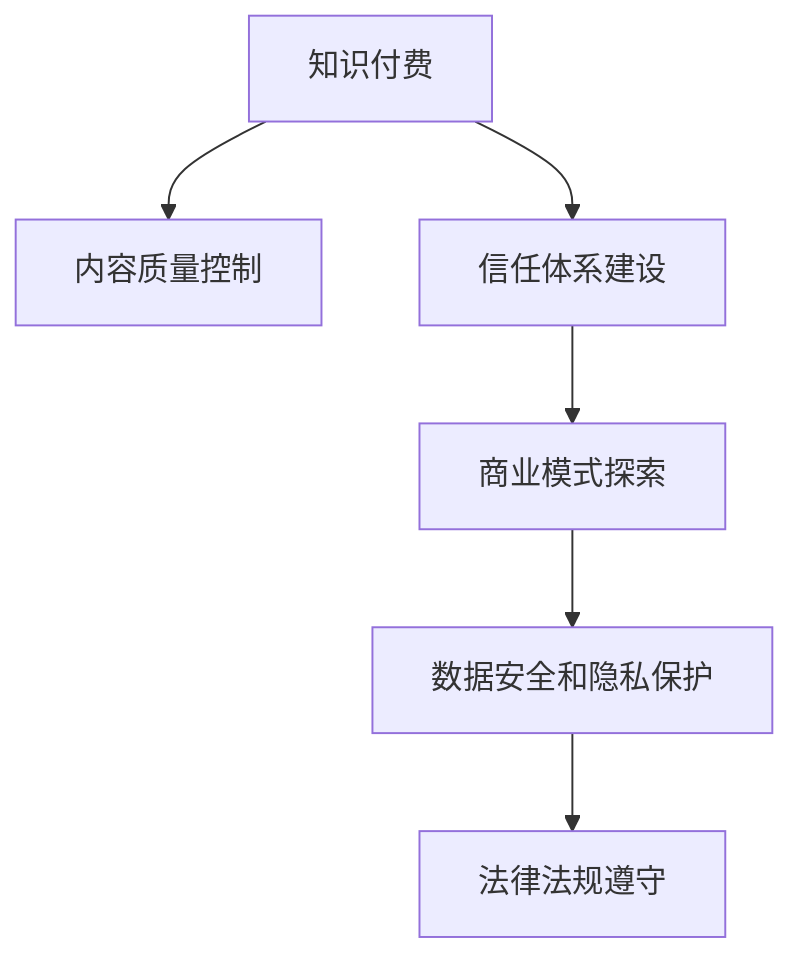

                 

## 1. 背景介绍

### 1.1 问题由来
近年来，知识付费逐渐成为互联网产业的新风口，各大平台纷纷布局。知识付费模式，简而言之，即通过订阅、付费购买等方式，提供高质量的知识内容，获取价值回报。创业公司如雨后春笋般涌现，但与此同时，行业内的风控问题也不断浮现。如付费内容质量参差不齐、用户信任度不足、平台盈利模式不清晰等。如何规避风险、提高平台生存能力，成为行业亟待解决的难题。

### 1.2 问题核心关键点
知识付费创业的风险控制，核心在于风险管理。主要包括：
- 用户需求调研：准确理解用户需求，避免误导性内容。
- 内容质量控制：确保内容真实、权威、有价值。
- 平台信任体系建设：通过用户评价、平台担保等手段增强信任感。
- 商业模式探索：优化付费方式，实现盈利模型多样化。
- 数据安全和隐私保护：防范数据泄露风险。
- 法律法规遵守：确保业务符合法律法规要求。

本文将重点介绍知识付费平台在用户需求调研、内容质量控制、信任体系建设、商业模式探索、数据安全和法律法规遵守等方面的风险控制策略，以期为知识付费创业公司提供参考和借鉴。

## 2. 核心概念与联系

### 2.1 核心概念概述

为更好地理解知识付费创业的风险控制方法，本节将介绍几个密切相关的核心概念：

- **知识付费**：用户通过订阅、购买等方式获取知识服务，并支付相应费用的商业模式。
- **内容质量控制**：对平台上的知识内容进行审核、筛选，确保其真实、权威、有价值。
- **信任体系建设**：通过用户评价、平台担保等手段，增强用户对平台的信任感。
- **商业模式探索**：探索多元化的盈利模式，提升平台的生存和发展能力。
- **数据安全和隐私保护**：防范数据泄露风险，保护用户隐私。
- **法律法规遵守**：确保平台运营符合法律法规要求，防范法律风险。

这些核心概念之间的逻辑关系可以通过以下Mermaid流程图来展示：



这个流程图展示了一系列关键概念及其之间的关系：

1. 知识付费是平台的基本商业模式。
2. 内容质量控制和信任体系建设共同保障用户满意度。
3. 商业模式探索增强平台盈利能力。
4. 数据安全和隐私保护防范风险。
5. 法律法规遵守合规经营。

这些概念共同构成了知识付费创业的风险控制框架，使得平台能够有效防范各种潜在风险，稳定发展。

## 3. 核心算法原理 & 具体操作步骤
### 3.1 算法原理概述

知识付费平台的风险控制，本质上是一个多目标优化问题。即在满足内容质量、用户满意度和盈利目标的同时，最小化平台运营的风险。其核心思想是：

- 使用机器学习和数据分析手段，对用户行为、内容质量等进行量化评估。
- 通过多维度的风险指标，评估平台运营的风险水平。
- 针对不同风险类型，采取相应的优化策略，以降低风险，提高平台生存和发展能力。

### 3.2 算法步骤详解

基于多目标优化的问题，知识付费平台的风险控制主要包括以下几个关键步骤：

**Step 1: 用户需求调研与分析**

1. 设计调研问卷和调查表，通过在线调查、深度访谈等方式，收集用户对知识付费内容的需求和期望。
2. 使用统计分析工具，对调研数据进行整理和分析，得出用户需求的共性特征。
3. 根据需求特征，设计平台知识库和课程内容，并进行A/B测试，评估用户反馈和满意度。

**Step 2: 内容质量控制**

1. 制定内容审核标准，引入专业的编辑团队，对平台上的内容进行审核和筛选。
2. 使用机器学习技术，建立内容质量评估模型，自动化审核部分低质量内容。
3. 定期进行内容更新和迭代，确保内容的时效性和权威性。

**Step 3: 信任体系建设**

1. 建立平台评分系统，允许用户对内容和课程进行评分和评论。
2. 引入第三方担保和认证机制，提高平台内容的权威性。
3. 定期发布平台信任报告，公开平台运营数据和用户反馈。

**Step 4: 商业模式探索**

1. 多样化内容收费方式，如单次购买、订阅、会员制等。
2. 开发知识服务增值产品，如线上线下互动、定制化课程等。
3. 探索知识付费与其他业务的融合，如广告、电商等，实现多元化盈利。

**Step 5: 数据安全和隐私保护**

1. 使用加密技术和数据脱敏技术，确保用户数据的安全。
2. 制定数据访问控制策略，限制敏感数据的访问权限。
3. 定期进行安全漏洞扫描和测试，防范潜在风险。

**Step 6: 法律法规遵守**

1. 定期检查平台内容是否符合法律法规要求，如版权保护、广告发布等。
2. 与法律顾问合作，制定合规运营规范，防范法律风险。
3. 公开平台运营数据和合规报告，增强用户和监管机构的信任感。

### 3.3 算法优缺点

基于多目标优化的大规模知识付费平台风险控制方法，具有以下优点：

- 系统性强：覆盖了用户需求调研、内容质量控制、信任体系建设、商业模式探索、数据安全和法律法规遵守等多个方面。
- 模型灵活：能够根据平台运营情况和用户需求动态调整策略，适应不同阶段和场景。
- 效果显著：通过数据驱动的优化，显著提升平台的用户满意度和盈利能力，降低运营风险。

同时，该方法也存在一些局限性：

- 数据获取难度大：平台运营数据、用户反馈等需要通过复杂的数据收集和处理获取。
- 模型复杂度高：涉及多目标优化和机器学习技术，算法复杂，需要较高的技术储备和投入。
- 法律监管严格：不同地区法律法规差异大，需频繁调整合规策略，存在法律风险。

尽管存在这些局限性，但就目前而言，基于多目标优化的大规模知识付费平台风险控制方法，仍是目前行业内较为科学和系统的做法。未来相关研究的方向包括：

1. 提升数据获取效率和质量。
2. 简化模型结构，降低算法复杂度。
3. 加强法律合规的自动化监测。

## 4. 数学模型和公式 & 详细讲解  
### 4.1 数学模型构建

知识付费平台的风险控制，可以构建如下数学模型：

设平台运营的风险水平为 $R$，用户满意度为 $S$，盈利能力为 $P$，则风险控制的目标函数可以表示为：

$$
\min_{x} R + \lambda S + \mu P
$$

其中，$R$ 表示平台运营的总风险，$S$ 表示用户对平台内容的满意度，$P$ 表示平台的盈利能力。$\lambda$ 和 $\mu$ 为正则化系数，控制不同目标的权重。

风险 $R$ 可以分解为内容风险 $R_c$、用户信任风险 $R_t$、法律合规风险 $R_l$ 等，分别表示为：

$$
R = R_c + R_t + R_l
$$

内容风险 $R_c$ 可以通过内容质量评估模型进行量化，用户信任风险 $R_t$ 可以通过用户评价和第三方担保等手段进行控制，法律合规风险 $R_l$ 可以通过定期检查和合规监测系统进行评估。

### 4.2 公式推导过程

以内容风险 $R_c$ 为例，推导其计算公式。

假设内容质量评估模型为 $f(x)$，其中 $x$ 为平台上的内容，$f(x)$ 输出内容的质量分数。内容风险 $R_c$ 可以表示为：

$$
R_c = \sum_{x \in X} w(x) \times f(x)
$$

其中，$X$ 为平台上的所有内容集合，$w(x)$ 为内容 $x$ 的权重，表示其在平台运营中的重要性。权重 $w(x)$ 可以通过用户行为数据、访问量等计算得出。

内容质量评估模型 $f(x)$ 可以使用多种机器学习算法进行构建，如随机森林、神经网络等。模型的输入为内容特征，包括标题、作者、发布时间等。模型输出为质量分数，范围通常在 [0,1] 之间。

### 4.3 案例分析与讲解

以下以某在线知识付费平台为例，解释其风险控制模型的构建和应用：

某在线知识付费平台，每月运营成本为 $C$，每月内容制作成本为 $C_c$，每月平台运营收益为 $R$，用户满意度为 $S$，法律合规风险为 $R_l$。

假设内容质量评估模型为随机森林，用户满意度为 $S = 0.8 \times (S_u + S_i)$，其中 $S_u$ 为用户评价，$S_i$ 为互动率（如点赞、评论）。

根据以上假设，可以构建风险控制模型如下：

$$
\min_{x} (C + C_c + R + \lambda (0.8 \times (S_u + S_i)) + \mu R_l)
$$

模型中，平台运营收益 $R$ 为平台每月总收入减去运营成本和内容制作成本。

根据平台历史数据和用户反馈，内容质量评估模型的输出结果为：

$$
f(x) = 0.6 + 0.4 \times \text{课程评分} - 0.1 \times \text{用户投诉数}
$$

其中，课程评分为平台上的课程评分平均值，用户投诉数为平台上的用户投诉数量。

内容风险 $R_c$ 计算公式为：

$$
R_c = \sum_{x \in X} w(x) \times f(x)
$$

假设 $w(x)$ 为课程的权重，$w(x)$ 的计算公式为：

$$
w(x) = \frac{\text{课程访问量}}{\sum_{i=1}^n \text{课程访问量}}
$$

其中 $n$ 为平台上课程总数。

法律合规风险 $R_l$ 的评估需要定期检查平台内容是否符合法律法规要求，如版权保护、广告发布等。假设合规检查的周期为 $T$，合规检查的概率为 $p$，合规风险的惩罚成本为 $P_l$，则法律合规风险 $R_l$ 的计算公式为：

$$
R_l = (1 - p) \times P_l
$$

其中，$(1 - p)$ 表示平台存在合规风险的概率，$P_l$ 表示合规风险的惩罚成本。

将以上公式代入风险控制模型，并选择合适的正则化系数 $\lambda$ 和 $\mu$，即可进行风险控制模型的求解。

## 5. 项目实践：代码实例和详细解释说明
### 5.1 开发环境搭建

在进行知识付费平台的风险控制实践前，我们需要准备好开发环境。以下是使用Python进行Pandas和Scikit-learn开发的开发环境配置流程：

1. 安装Anaconda：从官网下载并安装Anaconda，用于创建独立的Python环境。

2. 创建并激活虚拟环境：
```bash
conda create -n risk_control_env python=3.8 
conda activate risk_control_env
```

3. 安装Pandas和Scikit-learn：
```bash
pip install pandas scikit-learn
```

4. 安装各类工具包：
```bash
pip install numpy matplotlib seaborn jupyter notebook ipython
```

完成上述步骤后，即可在`risk_control_env`环境中开始风险控制实践。

### 5.2 源代码详细实现

下面我们以某在线知识付费平台的内容风险控制为例，给出使用Pandas和Scikit-learn进行风险控制计算的PyTorch代码实现。

首先，定义数据处理函数：

```python
import pandas as pd
from sklearn.ensemble import RandomForestRegressor
from sklearn.metrics import mean_squared_error

def data_preprocessing(data):
    # 数据清洗
    data = data.dropna()
    # 特征工程
    data['课程评分'] = data['课程评分'].astype(float)
    data['用户投诉数'] = data['用户投诉数'].astype(int)
    # 标准化
    data = pd.get_dummies(data, columns=['课程类别'])
    data = (data - data.mean()) / data.std()
    return data

def build_model(X, y, random_state):
    # 训练随机森林模型
    model = RandomForestRegressor(n_estimators=100, random_state=random_state)
    model.fit(X, y)
    # 模型评估
    y_pred = model.predict(X)
    mse = mean_squared_error(y, y_pred)
    print(f"MSE: {mse}")
    return model
```

然后，加载并处理数据：

```python
# 加载数据
data = pd.read_csv('data.csv')

# 数据清洗
data = data[data['课程评分'] > 0]

# 特征工程
X = data[['课程评分', '用户投诉数', '课程类别']]
y = data['课程访问量']

# 标准化
X = data_preprocessing(X)

# 划分训练集和测试集
train_X, test_X = train_test_split(X, test_size=0.2, random_state=42)
train_y, test_y = train_y, test_y
```

接着，训练和评估模型：

```python
# 模型训练
model = build_model(train_X, train_y, random_state=42)

# 模型评估
mse_train = model_score(train_X, train_y)
mse_test = model_score(test_X, test_y)

print(f"Train MSE: {mse_train}")
print(f"Test MSE: {mse_test}")
```

其中，`model_score` 函数用于计算模型的均方误差：

```python
def model_score(X, y):
    y_pred = model.predict(X)
    mse = mean_squared_error(y, y_pred)
    return mse
```

最后，输出模型结果：

```python
# 输出模型结果
print(f"Train MSE: {mse_train}")
print(f"Test MSE: {mse_test}")
```

以上就是使用Pandas和Scikit-learn进行内容风险控制计算的完整代码实现。可以看到，利用机器学习模型，能够较好地量化内容质量，为平台的内容风险控制提供有力支持。

### 5.3 代码解读与分析

让我们再详细解读一下关键代码的实现细节：

**data_preprocessing函数**：
- 数据清洗：删除缺失值，保留非空数据。
- 特征工程：将课程评分和用户投诉数转化为数值型数据，进行标准化处理。
- 数据转换：使用Pandas的`get_dummies`函数将类别特征进行独热编码。

**build_model函数**：
- 模型训练：使用随机森林回归模型进行训练。
- 模型评估：使用均方误差评估模型效果，输出训练集和测试集上的均方误差。

**data加载和处理**：
- 数据加载：使用Pandas的`read_csv`函数加载数据文件。
- 数据清洗：保留课程评分大于0的数据。
- 特征工程：保留课程评分、用户投诉数和课程类别特征，并进行标准化和独热编码。
- 数据划分：使用`train_test_split`函数将数据集划分为训练集和测试集。

**模型训练和评估**：
- 模型训练：在训练集上训练随机森林回归模型。
- 模型评估：使用`model_score`函数计算均方误差，输出训练集和测试集上的均方误差。

可以看到，代码实现相对简洁，但关键在于选择合适的特征和模型，以及进行合理的参数设置。

## 6. 实际应用场景
### 6.1 智能客服系统

知识付费平台可以通过智能客服系统，提升用户满意度，降低运营成本。智能客服系统可以通过自然语言处理技术和知识图谱，理解用户意图，提供个性化的客服服务。平台可以根据用户反馈，不断优化智能客服系统，提高用户满意度和平台信任感。

### 6.2 内容推荐系统

知识付费平台可以通过内容推荐系统，提高用户粘性，增加平台收益。内容推荐系统可以根据用户行为数据和历史购买记录，推荐用户感兴趣的内容，增加平台内容访问量和付费率。平台可以根据推荐效果进行优化，提高用户满意度和平台盈利能力。

### 6.3 内容付费和订阅模式

知识付费平台可以通过内容付费和订阅模式，优化用户消费体验，增加平台收益。平台可以根据用户付费历史和偏好，提供个性化的内容推荐和付费方案，增加用户粘性和平台收益。平台可以根据用户反馈，不断优化付费模式，提升用户满意度和平台信任感。

### 6.4 未来应用展望

随着知识付费平台的不断发展，未来的应用场景将更加丰富，包括以下几个方向：

- 人工智能技术应用：引入AI技术，如自然语言处理、知识图谱等，提升平台的智能化水平。
- 数据驱动决策：利用大数据和机器学习技术，进行精准的用户需求分析和内容推荐，提高用户满意度和平台盈利能力。
- 平台生态建设：引入多样化的业务和内容，形成良性互动，增强平台的生命力和竞争力。

这些应用场景的探索，将为知识付费平台带来更多的创新和发展机会。

## 7. 工具和资源推荐
### 7.1 学习资源推荐

为了帮助开发者系统掌握知识付费平台的风险控制方法，这里推荐一些优质的学习资源：

1. 《自然语言处理与Python编程》：由著名NLP专家撰写，详细介绍了NLP基础和常用技术，包括文本分类、情感分析等。

2. 《机器学习实战》：作者实践经验丰富，通过大量案例，介绍了机器学习算法的实现和应用。

3. 《数据科学与Python》：全面介绍了数据科学的基本概念和常用工具，适合初学者入门。

4. 《深度学习入门》：作者讲解深入浅出，适合初学者和进阶者。

5. 《Python数据科学手册》：系统介绍了Python在数据科学中的应用，包括Pandas、Scikit-learn等常用库。

通过对这些资源的学习实践，相信你一定能够快速掌握知识付费平台的风险控制方法，并用于解决实际问题。

### 7.2 开发工具推荐

高效的开发离不开优秀的工具支持。以下是几款用于知识付费平台风险控制开发的常用工具：

1. Python：Python是数据科学和机器学习的首选语言，简单易学，生态丰富。

2. Pandas：用于数据处理和分析，支持多维数据结构和多种数据源。

3. Scikit-learn：机器学习库，提供了丰富的算法和评估工具。

4. TensorFlow和PyTorch：深度学习框架，适合复杂模型和大规模数据训练。

5. Keras：简单易用的深度学习库，适合快速原型开发和模型测试。

6. Jupyter Notebook：交互式开发环境，适合快速迭代和实验。

合理利用这些工具，可以显著提升知识付费平台的风险控制开发效率，加快创新迭代的步伐。

### 7.3 相关论文推荐

知识付费平台的风险控制技术源于学界的持续研究。以下是几篇奠基性的相关论文，推荐阅读：

1. "Data-Driven Customer Service Chatbots: Building an Intelligent Virtual Assistant"（智能客服系统）

2. "Recommender Systems"（推荐系统）

3. "Machine Learning A-Z™: Hands-On Machine Learning with Python"（机器学习实战）

4. "Data Science in Python"（Python数据科学手册）

5. "Deep Learning with Python"（深度学习入门）

这些论文代表了大规模知识付费平台风险控制技术的发展脉络。通过学习这些前沿成果，可以帮助研究者把握学科前进方向，激发更多的创新灵感。

## 8. 总结：未来发展趋势与挑战
### 8.1 总结

本文对知识付费平台的风险控制方法进行了全面系统的介绍。首先阐述了知识付费平台的风险控制核心关键点，包括用户需求调研、内容质量控制、信任体系建设、商业模式探索、数据安全和法律法规遵守等。其次，从原理到实践，详细讲解了风险控制的多目标优化模型和算法，给出了风险控制任务开发的完整代码实例。同时，本文还广泛探讨了风险控制方法在智能客服、内容推荐、内容付费等多个行业领域的应用前景，展示了知识付费平台的风险控制技术的广阔前景。最后，本文精选了风险控制技术的各类学习资源，力求为知识付费创业公司提供全方位的技术指引。

通过本文的系统梳理，可以看到，知识付费平台的风险控制技术正在成为平台运营的重要保障，极大地提升了平台的生存和发展能力。未来，伴随技术的不断演进和优化，知识付费平台的风险控制方法还将进一步完善，为平台的稳健发展提供更坚实的保障。

### 8.2 未来发展趋势

展望未来，知识付费平台的风险控制技术将呈现以下几个发展趋势：

1. 数据驱动决策：利用大数据和机器学习技术，进行精准的用户需求分析和内容推荐，提高用户满意度和平台盈利能力。

2. 多目标优化：引入更多风险指标，如用户流失率、平台运营成本等，进行多目标优化，提升平台运营效率。

3. 算法模型创新：引入更多算法和技术，如深度学习、强化学习等，提升平台的智能化水平。

4. 安全性提升：加强数据加密和安全防护，防范潜在风险。

5. 法律合规自动化：引入自动化合规监测系统，及时发现并纠正合规风险。

6. 用户满意度提升：引入更多用户反馈机制，提升平台的用户体验和信任感。

这些趋势凸显了知识付费平台风险控制技术的广阔前景。这些方向的探索发展，必将进一步提升平台的运营效率和盈利能力，保障平台健康稳定发展。

### 8.3 面临的挑战

尽管知识付费平台的风险控制技术已经取得了不错的成绩，但在迈向更加智能化、普适化应用的过程中，它仍面临着诸多挑战：

1. 数据获取难度大：平台运营数据、用户反馈等需要通过复杂的数据收集和处理获取。

2. 算法复杂度高：涉及多目标优化和机器学习技术，算法复杂，需要较高的技术储备和投入。

3. 法律监管严格：不同地区法律法规差异大，需频繁调整合规策略，存在法律风险。

4. 用户需求复杂：用户需求多样化，难以通过单一模型进行全面覆盖。

5. 平台生态复杂：平台生态复杂，涉及多种业务和内容，需协调各方利益，优化资源配置。

这些挑战凸显了知识付费平台风险控制技术需要不断优化和创新。唯有不断迭代和优化模型、数据和算法，才能真正实现平台稳健发展。

### 8.4 研究展望

面对知识付费平台面临的风险控制挑战，未来的研究需要在以下几个方面寻求新的突破：

1. 提升数据获取效率和质量：引入自动化数据收集和处理工具，提升数据获取效率和质量。

2. 简化模型结构，降低算法复杂度：引入更加高效和简洁的算法，降低模型复杂度，提升模型训练和推理速度。

3. 加强法律合规的自动化监测：引入自动化合规监测系统，及时发现并纠正合规风险。

4. 引入更多用户反馈机制：引入更多用户反馈机制，提升平台的用户体验和信任感。

5. 引入多目标优化模型：引入更多风险指标，如用户流失率、平台运营成本等，进行多目标优化，提升平台运营效率。

6. 引入多模态数据融合：引入多种数据源和数据类型，进行多模态数据融合，提升平台的智能化水平。

这些研究方向的探索，必将引领知识付费平台风险控制技术迈向更高的台阶，为平台的稳健发展提供更坚实的保障。面向未来，知识付费平台的风险控制技术还需要与其他人工智能技术进行更深入的融合，如知识表示、因果推理、强化学习等，多路径协同发力，共同推动知识付费平台的发展。

## 9. 附录：常见问题与解答

**Q1：知识付费平台的风险控制策略是否适用于其他行业？**

A: 知识付费平台的风险控制策略在电子商务、在线教育、旅游等领域同样适用。不同行业的风险控制重点略有不同，但基本框架类似，都包括用户需求调研、内容质量控制、信任体系建设、商业模式探索、数据安全和法律法规遵守等环节。

**Q2：如何进行用户需求调研？**

A: 用户需求调研可以通过问卷调查、深度访谈等方式进行。调研内容应包括用户对知识内容的期望、消费习惯、付费意愿等。利用数据分析工具对调研数据进行整理和分析，得出用户需求的共性特征。根据需求特征，设计平台知识库和课程内容，并进行A/B测试，评估用户反馈和满意度。

**Q3：内容质量控制有哪些具体措施？**

A: 内容质量控制可以采用以下具体措施：
1. 制定内容审核标准，引入专业的编辑团队，对平台上的内容进行审核和筛选。
2. 使用机器学习技术，建立内容质量评估模型，自动化审核部分低质量内容。
3. 定期进行内容更新和迭代，确保内容的时效性和权威性。

**Q4：如何建设平台信任体系？**

A: 平台信任体系建设可以通过以下具体措施：
1. 建立平台评分系统，允许用户对内容和课程进行评分和评论。
2. 引入第三方担保和认证机制，提高平台内容的权威性。
3. 定期发布平台信任报告，公开平台运营数据和用户反馈。

**Q5：如何选择适合的商业模型？**

A: 商业模型的选择应根据平台特色和用户需求进行综合考虑。可以采用多种商业模型，如单次购买、订阅、会员制等。同时，开发知识服务增值产品，如线上线下互动、定制化课程等，实现盈利模型多样化。

**Q6：如何进行数据安全和隐私保护？**

A: 数据安全和隐私保护可以采用以下具体措施：
1. 使用加密技术和数据脱敏技术，确保用户数据的安全。
2. 制定数据访问控制策略，限制敏感数据的访问权限。
3. 定期进行安全漏洞扫描和测试，防范潜在风险。

**Q7：如何遵守法律法规要求？**

A: 平台运营应定期检查内容是否符合法律法规要求，如版权保护、广告发布等。与法律顾问合作，制定合规运营规范，防范法律风险。公开平台运营数据和合规报告，增强用户和监管机构的信任感。

---

作者：禅与计算机程序设计艺术 / Zen and the Art of Computer Programming

