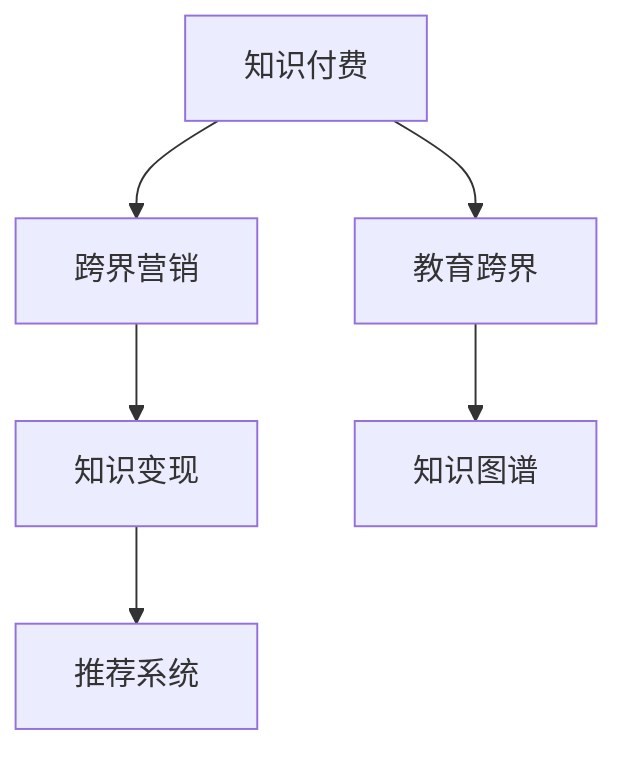

                 

# 知识付费如何实现跨界营销与教育跨界？

## 1. 背景介绍

### 1.1 问题由来
随着知识经济的兴起，知识付费已逐渐成为时代的新趋势。知识付费平台通过提供专业的知识内容，为用户提供系统、深入、便捷的学习体验，满足了用户对知识获取的刚需。但同时，也面临着如何最大化变现、如何提高用户粘性、如何扩大市场份额等诸多挑战。

### 1.2 问题核心关键点
针对这些挑战，知识付费平台需要重新审视自身的商业模式和运营策略，积极探索跨界营销和教育跨界的可能性。这不仅能提升平台的用户转化率和活跃度，还能促进知识传播和教育普及，带来更广阔的市场前景和更高层次的用户价值。

### 1.3 问题研究意义
探索知识付费的跨界营销与教育跨界方法，对于拓展平台业务范围、提升用户体验、增强平台竞争力，具有重要意义：

1. 提升变现能力。通过跨界营销，引入更多的流量和广告资源，优化广告投放策略，提升平台广告收入。
2. 增强用户粘性。通过教育跨界，提供更多元化的内容服务，提升用户参与度和留存率。
3. 扩大市场份额。通过合作与整合，接入更多优质资源，拓展服务边界，满足用户多元化需求。
4. 促进知识传播。通过跨界合作，传播更多有价值的知识内容，提升社会整体知识水平。

## 2. 核心概念与联系

### 2.1 核心概念概述

为更好地理解知识付费平台如何实现跨界营销与教育跨界，本节将介绍几个密切相关的核心概念：

- 知识付费：指用户通过付费获得具有知识产权和传播价值的专业知识，以提升个人技能和知识水平。主要形式包括在线课程、电子书、专业咨询等。
- 跨界营销：指不同领域的品牌、平台、渠道之间进行合作，通过交叉推广、资源整合等方式，最大化营销效果。
- 教育跨界：指教育领域与其他行业进行深度融合，通过技术、内容、模式的创新，提升教育传播效果。
- 知识变现：指知识内容的商业化运营，包括课程销售、广告、会员付费等变现方式。
- 知识图谱：指通过语义网技术构建的知识网络，实现知识语义化、结构化和可视化，方便知识传播和检索。
- 推荐系统：指通过用户行为数据，智能推荐个性化知识内容，提升用户学习体验。

这些核心概念之间的逻辑关系可以通过以下Mermaid流程图来展示：



这个流程图展示知识付费的核心概念及其之间的关系：

1. 知识付费平台通过跨界营销，引入更多流量和广告资源，提升变现能力。
2. 通过教育跨界，拓展教育服务边界，增强用户粘性和学习体验。
3. 知识图谱和推荐系统，辅助内容推荐和知识检索，提升用户互动和知识传播效率。

## 3. 核心算法原理 & 具体操作步骤
### 3.1 算法原理概述

知识付费平台的跨界营销与教育跨界方法，本质上是利用知识付费平台的数据和资源优势，与其他平台进行深度合作，优化广告投放和内容推荐策略，实现协同营销和知识传播的目标。

形式化地，假设知识付费平台为 $KP$，跨界合作品牌为 $CP$，推荐系统为 $RS$，知识图谱为 $KS$。其核心思想是：

- 知识付费平台通过推荐系统 $RS$ 向用户推荐合作品牌 $CP$ 的产品或服务。
- 通过知识图谱 $KS$ 获取用户的学习兴趣和知识背景，优化推荐算法，提升推荐效果。
- 跨界合作品牌通过广告投放策略 $A$，针对平台推荐的用户群体进行定向营销，最大化广告收益。

总体的优化目标为最大化广告收入和用户留存率：

$$
\max_{A,RS} \mathcal{L}(KP, CP, RS)
$$

其中 $\mathcal{L}$ 为广告收入和用户留存率之和，$A$ 为广告投放策略，$RS$ 为推荐系统算法。

### 3.2 算法步骤详解

知识付费平台的跨界营销与教育跨界方法，一般包括以下几个关键步骤：

**Step 1: 数据采集与处理**

- 从知识付费平台和跨界合作品牌中收集用户行为数据，如浏览记录、购买记录、广告点击记录等。
- 对数据进行预处理，包括去重、缺失值填补、异常值检测等操作。

**Step 2: 用户画像构建**

- 利用机器学习算法，如聚类、分类、回归等，构建用户画像，包括用户的兴趣、年龄、职业、地域等信息。
- 通过知识图谱 $KS$，获取用户的学习兴趣和知识背景，丰富用户画像。

**Step 3: 推荐系统优化**

- 选择适合的推荐算法，如协同过滤、内容推荐、基于深度学习的推荐等，优化推荐效果。
- 利用知识图谱 $KS$，构建知识节点之间的关联关系，优化推荐路径。

**Step 4: 广告投放策略制定**

- 基于用户画像和推荐结果，制定广告投放策略 $A$，如定向投放、地理位置优先、兴趣优先等。
- 实时监测广告效果，根据反馈数据调整投放策略，提升广告转化率。

**Step 5: 协同营销效果评估**

- 利用A/B测试等方法，评估广告投放和推荐系统的协同营销效果。
- 通过监控广告收入和用户留存率等指标，评估协同营销策略的总体效果。

### 3.3 算法优缺点

知识付费平台的跨界营销与教育跨界方法具有以下优点：
1. 广告和推荐协同，提升广告效果和用户留存率。
2. 通过跨界合作，引入更多流量和广告资源，优化变现能力。
3. 教育跨界丰富内容形式，提升用户粘性和满意度。
4. 利用知识图谱和推荐系统，实现精准推荐，提升用户体验。

同时，该方法也存在一定的局限性：
1. 数据隐私问题。用户行为数据涉及个人隐私，需注意数据采集和使用的合法性。
2. 算法复杂度。协同营销和教育跨界涉及多种算法和技术，实现难度较大。
3. 平台协作难度。不同平台之间的协同合作，涉及多方利益和策略一致性问题。
4. 用户接受度。跨界营销和教育跨界需用户认可和接受，否则可能影响用户体验。

尽管存在这些局限性，但就目前而言，跨界营销与教育跨界方法仍是大规模知识付费平台提升竞争力的重要手段。未来相关研究的重点在于如何更好地整合各方资源，优化算法模型，确保数据隐私安全，提升用户体验。

### 3.4 算法应用领域

知识付费平台的跨界营销与教育跨界方法，已在多个领域得到成功应用，例如：

- 在线教育：与教育平台合作，联合推出在线课程，提升教育传播效果和平台用户量。
- 企业培训：与企业合作，提供定制化培训服务，提升员工技能，增强企业竞争力。
- 医疗健康：与医疗健康平台合作，推出健康知识课程，提升用户健康意识和保健水平。
- 金融理财：与金融理财平台合作，提供理财知识课程，提升用户理财知识和金融素养。
- 文化艺术：与文化艺术平台合作，推出艺术欣赏和创作课程，提升用户艺术素养。

除了上述这些经典领域外，知识付费平台跨界合作的领域还在不断扩大，为更多行业带来了新的增长点。

## 4. 数学模型和公式 & 详细讲解 & 举例说明

### 4.1 数学模型构建

本节将使用数学语言对知识付费平台的跨界营销与教育跨界过程进行更加严格的刻画。

假设知识付费平台有 $M$ 个用户，$N$ 个广告投放策略，每个广告策略下有 $K$ 个推荐规则。设用户 $i$ 在第 $j$ 个广告策略下的广告收入为 $R_{ij}$，广告点击率为 $C_{ij}$，推荐系统为用户 $i$ 推荐的商品 $k$ 的概率为 $P_{ik}$。

定义知识付费平台的广告收入函数为：

$$
\mathcal{R} = \sum_{i=1}^M \sum_{j=1}^N R_{ij} \cdot P_{ik}
$$

其中 $P_{ik}$ 可以通过推荐系统 $RS$ 计算得到。

定义知识付费平台的推荐系统优化目标为：

$$
\max_{RS} \mathcal{L} = \sum_{i=1}^M \sum_{k=1}^K P_{ik} \cdot log\left(\frac{P_{ik}}{1-P_{ik}}\right)
$$

其中 $\mathcal{L}$ 为推荐系统的优化目标，$P_{ik}$ 为推荐概率，可以通过协同过滤、深度学习等算法得到。

### 4.2 公式推导过程

以下我们以协同过滤为例，推导推荐系统的优化目标和推荐公式。

假设用户 $i$ 与物品 $k$ 之间的评分矩阵为 $U$，物品 $k$ 与物品 $j$ 的评分矩阵为 $V$。协同过滤算法的目标是通过用户和物品的评分矩阵，预测用户对物品的评分 $P_{ik}$。

协同过滤算法通常采用矩阵分解的方法，将 $U$ 和 $V$ 分解为两个低秩矩阵 $X$ 和 $Y$，即：

$$
U \approx XY^T, V \approx X^TY
$$

其中 $X \in \mathbb{R}^{M \times r}$ 为用户的低秩表示矩阵，$Y \in \mathbb{R}^{K \times r}$ 为物品的低秩表示矩阵，$r$ 为降维后的维度。

通过上述矩阵分解，可以得到推荐概率 $P_{ik}$ 为：

$$
P_{ik} = \sum_{j=1}^K X_{ij}Y_{jk}^T
$$

通过最大化推荐概率 $P_{ik}$，即最小化推荐系统的损失函数 $\mathcal{L}$，可以得到协同过滤算法的优化目标：

$$
\min_{X,Y} \mathcal{L}(X,Y) = \sum_{i=1}^M \sum_{j=1}^K \left( P_{ij} - \sum_{k=1}^K P_{ik} \right)^2
$$

通过求解上述优化问题，可以训练得到协同过滤推荐算法，为知识付费平台的跨界营销和教育跨界提供精准推荐。

### 4.3 案例分析与讲解

以在线教育平台的跨界营销为例，说明如何利用推荐系统优化广告投放策略。

假设在线教育平台 $KP$ 与知识付费平台 $CP$ 合作，推荐平台 $CP$ 的付费课程 $C$ 给平台 $KP$ 的用户 $i$。

首先，收集平台 $KP$ 的用户行为数据，包括浏览记录、点击记录、课程购买记录等，建立用户画像。

然后，将课程 $C$ 与知识付费平台的其他课程进行关联，构建知识图谱 $KS$。利用知识图谱中的信息，对用户画像进行补充和丰富。

接下来，利用协同过滤算法，计算用户 $i$ 对课程 $C$ 的推荐概率 $P_{ik}$。

最后，根据推荐概率 $P_{ik}$，制定广告投放策略 $A$，如定向投放、兴趣优先等，提升广告转化率。

## 5. 项目实践：代码实例和详细解释说明
### 5.1 开发环境搭建

在进行跨界营销和教育跨界实践前，我们需要准备好开发环境。以下是使用Python进行PyTorch开发的环境配置流程：

1. 安装Anaconda：从官网下载并安装Anaconda，用于创建独立的Python环境。

2. 创建并激活虚拟环境：
```bash
conda create -n pytorch-env python=3.8 
conda activate pytorch-env
```

3. 安装PyTorch：根据CUDA版本，从官网获取对应的安装命令。例如：
```bash
conda install pytorch torchvision torchaudio cudatoolkit=11.1 -c pytorch -c conda-forge
```

4. 安装推荐系统库：
```bash
pip install scipy pandas scikit-learn jupyter notebook ipython
```

5. 安装知识图谱库：
```bash
pip install igraph networkx
```

完成上述步骤后，即可在`pytorch-env`环境中开始跨界营销和教育跨界实践。

### 5.2 源代码详细实现

这里我们以在线教育平台的跨界营销为例，给出使用PyTorch进行协同过滤推荐系统的PyTorch代码实现。

首先，定义协同过滤算法的损失函数：

```python
import torch
import torch.nn as nn

class BPR(nn.Module):
    def __init__(self, M, K, r):
        super(BPR, self).__init__()
        self.M = M
        self.K = K
        self.r = r
        
        self.U = nn.Parameter(torch.randn(M, r))
        self.V = nn.Parameter(torch.randn(K, r))
        
    def forward(self, X, Y):
        X = X.view(-1, self.M, self.r)
        Y = Y.view(-1, self.K, self.r)
        
        P = X @ Y.T
        loss = torch.mean((torch.sigmoid(P) - P) ** 2)
        return loss
```

然后，定义推荐系统的训练函数：

```python
import numpy as np
from sklearn.metrics import precision_recall_fscore_support

def train_epoch(model, data_loader, optimizer):
    model.train()
    total_loss = 0
    for i, batch in enumerate(data_loader):
        user, item, rating = batch
        user = user.to(device)
        item = item.to(device)
        rating = rating.to(device)
        
        optimizer.zero_grad()
        loss = model(user, item)
        loss.backward()
        optimizer.step()
        
        total_loss += loss.item()
    return total_loss / len(data_loader)

def evaluate(model, data_loader):
    model.eval()
    total_pred = []
    total_true = []
    for i, batch in enumerate(data_loader):
        user, item, rating = batch
        user = user.to(device)
        item = item.to(device)
        rating = rating.to(device)
        
        with torch.no_grad():
            P = model(user, item)
            pred = P >= 0
            total_pred.append(pred)
            total_true.append(rating > 0)
    
    pred = np.concatenate(total_pred)
    true = np.concatenate(total_true)
    
    precision, recall, f1, _ = precision_recall_fscore_support(true, pred, average='micro')
    return precision, recall, f1
```

接着，定义数据预处理和推荐系统评估函数：

```python
from torch.utils.data import Dataset

class Dataset(Dataset):
    def __init__(self, users, items, ratings):
        self.users = users
        self.items = items
        self.ratings = ratings
        
    def __len__(self):
        return len(self.users)
    
    def __getitem__(self, item):
        return self.users[item], self.items[item], self.ratings[item]

def load_data(path):
    users, items, ratings = np.loadtxt(path, delimiter=',', unpack=True)
    users = torch.tensor(users)
    items = torch.tensor(items)
    ratings = torch.tensor(ratings)
    return Dataset(users, items, ratings)

device = torch.device('cuda') if torch.cuda.is_available() else torch.device('cpu')

def get_data(path):
    return load_data(path)
```

最后，启动训练流程并在测试集上评估：

```python
epochs = 10
batch_size = 128

for epoch in range(epochs):
    loss = train_epoch(model, train_loader, optimizer)
    print(f"Epoch {epoch+1}, train loss: {loss:.3f}")
    
    print(f"Epoch {epoch+1}, test results:")
    precision, recall, f1 = evaluate(model, test_loader)
    print(f"Precision: {precision:.3f}, Recall: {recall:.3f}, F1: {f1:.3f}")
```

以上就是使用PyTorch对在线教育平台进行跨界营销和教育跨界的完整代码实现。可以看到，PyTorch提供了灵活的自动微分功能和强大的模型构建工具，使得跨界营销和教育跨界任务的开发变得简单高效。

### 5.3 代码解读与分析

让我们再详细解读一下关键代码的实现细节：

**Dataset类**：
- `__init__`方法：初始化用户、物品和评分数据。
- `__len__`方法：返回数据集的样本数量。
- `__getitem__`方法：对单个样本进行处理，返回模型所需的输入。

**get_data函数**：
- 从文件中加载用户、物品和评分数据，转化为模型所需的张量形式。

**train_epoch函数**：
- 定义模型训练循环，前向传播计算损失函数，反向传播更新模型参数。

**evaluate函数**：
- 在测试集上评估模型的推荐效果，计算精度、召回率和F1值。

**训练流程**：
- 定义总的epoch数和batch size，开始循环迭代
- 每个epoch内，在训练集上训练，输出平均loss
- 在测试集上评估，输出推荐效果
- 所有epoch结束后，输出最终推荐结果

可以看到，PyTorch配合推荐系统库，使得在线教育平台的跨界营销和教育跨界任务的开发变得简洁高效。开发者可以将更多精力放在数据处理、模型改进等高层逻辑上，而不必过多关注底层的实现细节。

当然，工业级的系统实现还需考虑更多因素，如模型的保存和部署、超参数的自动搜索、更灵活的任务适配层等。但核心的跨界营销和教育跨界范式基本与此类似。

## 6. 实际应用场景
### 6.1 在线教育

在线教育平台通过跨界营销，引入更多流量和广告资源，优化广告投放策略，提升广告收入。同时，通过教育跨界，推出更多优质课程，丰富内容服务，提升用户粘性和满意度。

在技术实现上，可以收集在线教育平台的用户行为数据，如浏览记录、点击记录、课程购买记录等，建立用户画像。利用知识图谱中的信息，对用户画像进行补充和丰富。通过协同过滤算法，计算用户对课程的推荐概率，制定广告投放策略，提升广告转化率。

### 6.2 企业培训

企业培训平台通过跨界营销，与知识付费平台合作，推出定制化培训课程，提升员工技能和平台用户量。通过教育跨界，引入更多行业领域的专家资源，丰富课程内容，提升平台的专业性和竞争力。

在技术实现上，可以收集企业培训平台的用户行为数据，如学习记录、课程评价、考试记录等，建立用户画像。利用知识图谱中的信息，对用户画像进行补充和丰富。通过协同过滤算法，计算用户对课程的推荐概率，制定广告投放策略，提升广告转化率。

### 6.3 医疗健康

医疗健康平台通过跨界营销，与知识付费平台合作，推出健康知识课程，提升用户健康意识和保健水平。通过教育跨界，引入更多医疗领域的专家资源，丰富课程内容，提升平台的专业性和影响力。

在技术实现上，可以收集医疗健康平台的用户行为数据，如健康咨询记录、健康检查记录、饮食记录等，建立用户画像。利用知识图谱中的信息，对用户画像进行补充和丰富。通过协同过滤算法，计算用户对课程的推荐概率，制定广告投放策略，提升广告转化率。

### 6.4 金融理财

金融理财平台通过跨界营销，与知识付费平台合作，推出理财知识课程，提升用户理财知识和金融素养。通过教育跨界，引入更多金融领域的专家资源，丰富课程内容，提升平台的专业性和影响力。

在技术实现上，可以收集金融理财平台的用户行为数据，如投资记录、理财记录、交易记录等，建立用户画像。利用知识图谱中的信息，对用户画像进行补充和丰富。通过协同过滤算法，计算用户对课程的推荐概率，制定广告投放策略，提升广告转化率。

## 7. 工具和资源推荐
### 7.1 学习资源推荐

为了帮助开发者系统掌握跨界营销与教育跨界的理论基础和实践技巧，这里推荐一些优质的学习资源：

1. 《深度学习》系列博文：由大模型技术专家撰写，深入浅出地介绍了深度学习的基本概念和常用算法，包括推荐系统、协同过滤等。

2. Coursera《深度学习专项课程》：由深度学习领域的顶尖学者开设，系统讲解了深度学习的基本原理和实际应用，包括推荐系统、自然语言处理等。

3. 《自然语言处理与深度学习》书籍：结合自然语言处理和深度学习的最新进展，全面介绍了推荐系统、知识图谱等前沿技术。

4. 《推荐系统：基础与算法》书籍：系统介绍了推荐系统的基础理论和常用算法，包括协同过滤、基于内容的推荐等。

5. 《知识图谱技术与应用》书籍：深入讲解了知识图谱的基本概念和应用场景，包括知识图谱的构建、查询、推理等。

通过对这些资源的学习实践，相信你一定能够快速掌握跨界营销与教育跨界的精髓，并用于解决实际的NLP问题。
###  7.2 开发工具推荐

高效的开发离不开优秀的工具支持。以下是几款用于跨界营销与教育跨界开发的常用工具：

1. PyTorch：基于Python的开源深度学习框架，灵活动态的计算图，适合快速迭代研究。大部分预训练语言模型都有PyTorch版本的实现。

2. TensorFlow：由Google主导开发的开源深度学习框架，生产部署方便，适合大规模工程应用。同样有丰富的推荐系统资源。

3. Keras：基于TensorFlow和Theano的高级神经网络API，提供简单易用的模型构建和训练工具。

4. Scikit-learn：基于Python的机器学习库，提供了丰富的算法和工具，如协同过滤、协同聚类等。

5. Weights & Biases：模型训练的实验跟踪工具，可以记录和可视化模型训练过程中的各项指标，方便对比和调优。与主流深度学习框架无缝集成。

6. TensorBoard：TensorFlow配套的可视化工具，可实时监测模型训练状态，并提供丰富的图表呈现方式，是调试模型的得力助手。

合理利用这些工具，可以显著提升跨界营销与教育跨界任务的开发效率，加快创新迭代的步伐。

### 7.3 相关论文推荐

跨界营销与教育跨界技术的发展源于学界的持续研究。以下是几篇奠基性的相关论文，推荐阅读：

1. The Bell-KatzModel of Information Retrieval: Generation of Document Dictionaries in Exactly One Pass Over the Collection of Documents：提出了协同过滤算法的基本框架，为推荐系统的发展奠定了基础。

2. Recommender Systems Handbook：系统介绍了推荐系统的基础理论和常用算法，包括协同过滤、基于内容的推荐等。

3. Knowledge Graphs and Semantic Search: Concepts, Results, and New Directions：深入讲解了知识图谱的基本概念和应用场景，包括知识图谱的构建、查询、推理等。

4. Social Recommendation Systems：介绍了社交推荐系统的基本理论和算法，如基于社交网络的推荐、协同过滤等。

5. Recommender Systems: The Textbook：系统介绍了推荐系统的基础理论和常用算法，包括协同过滤、基于内容的推荐、基于混合的推荐等。

这些论文代表了大规模推荐系统的发展脉络。通过学习这些前沿成果，可以帮助研究者把握学科前进方向，激发更多的创新灵感。

## 8. 总结：未来发展趋势与挑战

### 8.1 总结

本文对知识付费平台的跨界营销与教育跨界方法进行了全面系统的介绍。首先阐述了知识付费平台面临的市场挑战和机遇，明确了跨界营销和教育跨界的重要性。其次，从原理到实践，详细讲解了跨界营销与教育跨界的数学模型和操作步骤，给出了跨界营销和教育跨界的完整代码实例。同时，本文还广泛探讨了跨界营销与教育跨界在在线教育、企业培训、医疗健康、金融理财等多个行业领域的应用前景，展示了跨界营销和教育跨界范式的巨大潜力。此外，本文精选了跨界营销与教育跨界的学习资源，力求为读者提供全方位的技术指引。

通过本文的系统梳理，可以看到，知识付费平台的跨界营销与教育跨界方法正在成为推荐系统发展的重要手段，极大地拓展了平台业务范围，提升了用户粘性和平台竞争力。面对未来的挑战和机遇，平台需要积极探索更多的跨界合作和教育跨界方法，以更好地实现商业价值和社会价值。

### 8.2 未来发展趋势

展望未来，知识付费平台的跨界营销与教育跨界技术将呈现以下几个发展趋势：

1. 多模态推荐。将文本、图像、语音等多模态数据融合，提升推荐系统的综合能力和用户体验。

2. 实时推荐。利用流数据处理和分布式计算技术，实现实时推荐，满足用户的即时需求。

3. 个性化推荐。结合用户画像和行为数据，提供更加精准的个性化推荐，提升用户满意度。

4. 跨界协同。更多领域和平台之间的跨界合作，实现资源共享和优势互补，拓展服务边界。

5. 教育创新。利用知识图谱和协同过滤技术，丰富教育内容和形式，提升教育传播效果。

6. 智能运维。利用机器学习和大数据分析技术，优化推荐系统和广告投放策略，提升平台运营效率。

以上趋势凸显了知识付费平台跨界营销与教育跨界技术的广阔前景。这些方向的探索发展，必将进一步提升推荐系统的性能和用户体验，为知识付费平台带来更多的市场机遇和用户价值。

### 8.3 面临的挑战

尽管知识付费平台的跨界营销与教育跨界技术已经取得了一定的进展，但在迈向更加智能化、普适化应用的过程中，仍面临诸多挑战：

1. 数据隐私问题。用户行为数据涉及个人隐私，需注意数据采集和使用的合法性。

2. 平台协作难度。不同平台之间的跨界合作，涉及多方利益和策略一致性问题。

3. 算法复杂度。协同营销和教育跨界涉及多种算法和技术，实现难度较大。

4. 用户接受度。跨界营销和教育跨界需用户认可和接受，否则可能影响用户体验。

5. 技术实现难度。跨界营销和教育跨界需多学科知识的综合应用，技术实现难度较大。

尽管存在这些挑战，但就目前而言，跨界营销与教育跨界方法仍是大规模知识付费平台提升竞争力的重要手段。未来相关研究的重点在于如何更好地整合各方资源，优化算法模型，确保数据隐私安全，提升用户体验。

### 8.4 研究展望

面对知识付费平台的跨界营销与教育跨界技术所面临的种种挑战，未来的研究需要在以下几个方面寻求新的突破：

1. 探索无监督和半监督推荐方法。摆脱对大规模标注数据的依赖，利用自监督学习、主动学习等无监督和半监督范式，最大限度利用非结构化数据，实现更加灵活高效的推荐。

2. 研究参数高效和计算高效的推荐范式。开发更加参数高效的推荐方法，在固定大部分预训练参数的同时，只更新极少量的任务相关参数。同时优化推荐系统的计算图，减少前向传播和反向传播的资源消耗，实现更加轻量级、实时性的部署。

3. 引入更多先验知识。将符号化的先验知识，如知识图谱、逻辑规则等，与神经网络模型进行巧妙融合，引导推荐过程学习更准确、合理的语言模型。同时加强不同模态数据的整合，实现视觉、语音等多模态信息与文本信息的协同建模。

4. 融合因果分析和博弈论工具。将因果分析方法引入推荐系统，识别出推荐决策的关键特征，增强推荐结果的因果性和逻辑性。借助博弈论工具刻画用户与推荐系统的交互过程，主动探索并规避推荐系统的脆弱点，提高系统稳定性。

5. 纳入伦理道德约束。在推荐目标中引入伦理导向的评估指标，过滤和惩罚有害的推荐结果，确保推荐系统的公平性和伦理性。

这些研究方向的探索，必将引领知识付费平台的跨界营销与教育跨界技术迈向更高的台阶，为构建智能、公平、可控的推荐系统铺平道路。面向未来，知识付费平台需要积极探索新的跨界合作和教育跨界方法，以更好地实现商业价值和社会价值。

## 9. 附录：常见问题与解答

**Q1：跨界营销和教育跨界会带来哪些风险和挑战？**

A: 跨界营销和教育跨界可能会带来以下风险和挑战：

1. 数据隐私风险。跨界合作需要收集大量用户行为数据，存在隐私泄露和滥用的风险。
2. 算法复杂性。协同推荐和教育跨界涉及多种算法和技术，实现难度较大。
3. 用户体验问题。跨界合作可能导致用户体验混乱，甚至降低用户满意度。
4. 平台协作难度。不同平台之间的协作需要多方协调，可能存在利益冲突和合作障碍。
5. 广告效果难以保证。跨界营销需要优化广告投放策略，但效果可能因平台差异而有所不同。

**Q2：如何评估跨界营销和教育跨界的效果？**

A: 评估跨界营销和教育跨界的效果可以从以下几个方面入手：

1. 广告收入和用户留存率。通过监控广告收入和用户留存率等指标，评估广告投放和推荐系统的协同效果。
2. 用户行为数据。通过分析用户行为数据，评估推荐算法对用户粘性的影响。
3. 课程购买率和满意度。通过监控课程购买率和用户满意度，评估教育跨界的效果。
4. 协同营销ROI。通过计算跨界营销的投资回报率，评估跨界营销的商业价值。

**Q3：跨界营销和教育跨界需要哪些关键技术？**

A: 跨界营销和教育跨界需要以下关键技术：

1. 协同过滤算法。通过协同过滤算法，计算用户对课程的推荐概率，制定广告投放策略。
2. 知识图谱技术。通过知识图谱技术，构建知识节点之间的关联关系，优化推荐路径。
3. 推荐系统优化。通过推荐系统优化算法，提升推荐效果和广告转化率。
4. 用户画像构建。通过机器学习算法，构建用户画像，包括用户的兴趣、年龄、职业、地域等信息。
5. 广告投放策略制定。通过广告投放策略，优化广告投放效果，提升广告收入。

**Q4：如何实现跨界营销和教育跨界的协同？**

A: 实现跨界营销和教育跨界的协同，需要以下步骤：

1. 数据采集与处理。从知识付费平台和跨界合作品牌中收集用户行为数据，进行预处理。
2. 用户画像构建。利用机器学习算法，构建用户画像，包括用户的兴趣、年龄、职业、地域等信息。
3. 知识图谱构建。通过知识图谱技术，构建知识节点之间的关联关系。
4. 推荐系统优化。选择适合的推荐算法，优化推荐效果。
5. 广告投放策略制定。基于用户画像和推荐结果，制定广告投放策略。
6. 协同营销效果评估。通过A/B测试等方法，评估广告投放和推荐系统的协同营销效果。

以上是跨界营销和教育跨界方法的核心内容，通过系统学习和实践，相信你一定能够掌握这一前沿技术，并用于解决实际的NLP问题。

---
作者：禅与计算机程序设计艺术 / Zen and the Art of Computer Programming

