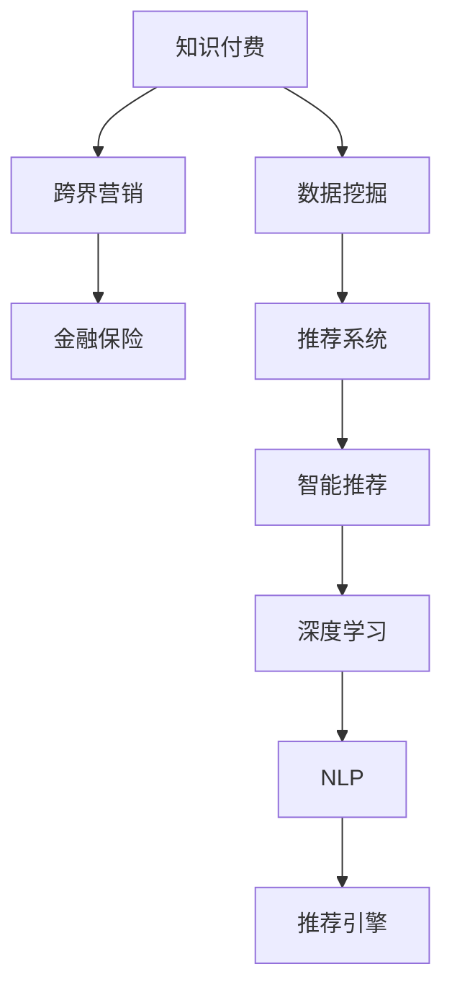

                 

# 知识付费如何实现跨界营销与金融保险跨界？

> 关键词：知识付费,跨界营销,金融保险,数据挖掘,推荐系统,智能推荐,深度学习

## 1. 背景介绍

在数字化时代，知识付费已经成为了知识传播和消费的重要方式之一。通过知识付费平台，用户能够随时随地获取所需知识，提升个人技能和工作效率。但与此同时，传统的知识付费模型面临诸多挑战，如内容同质化、用户流失等问题。为了解决这个问题，知识付费平台开始探索跨界营销和金融保险领域的合作，以期从更广阔的市场和更丰富的数据中挖掘新的增长点。

本文将系统介绍知识付费平台如何通过跨界营销与金融保险领域进行合作，借助数据挖掘和推荐系统技术，提升用户粘性和转化率，实现平台和用户的共赢。

## 2. 核心概念与联系

### 2.1 核心概念概述

为更好理解知识付费平台与金融保险领域跨界合作的方法，本节将介绍几个关键概念：

- 知识付费(Knowledge As A Service, KAAS)：一种新型知识传播和消费模式，通过付费机制，将高质量的原创知识内容呈现给用户，以提高用户的学习效率和满意度。

- 跨界营销(Cross-Industry Marketing)：一种营销策略，通过与其他行业进行跨界合作，共同开发用户需求，进行联合营销推广，扩大市场范围，提升用户转化率。

- 金融保险(Finance Insurance)：金融和保险业的合称，涉及风险评估、产品设计、理赔服务等诸多方面，与用户资金、财产安全密切相关。

- 数据挖掘(Data Mining)：从大量数据中提取有价值的信息，用于决策支持和用户分析。

- 推荐系统(Recommender System)：一种智能系统，通过分析用户行为和兴趣，提供个性化的产品或内容推荐。

- 智能推荐(Intelligent Recommendation)：基于深度学习、自然语言处理等技术，实现更精准、更高效的推荐效果。

- 深度学习(Deep Learning)：一种强大的机器学习技术，通过多层神经网络实现复杂的数据建模和预测。

- 自然语言处理(Natural Language Processing, NLP)：让计算机能够理解和生成人类语言，广泛应用于文本分析、对话系统等场景。

这些核心概念之间的逻辑关系可以通过以下Mermaid流程图来展示：



这个流程图展示了一些关键概念的相互关系：

1. 知识付费通过跨界营销进入金融保险领域，拓展市场范围。
2. 数据挖掘从用户行为中提取信息，用于推荐系统设计。
3. 推荐系统通过智能推荐技术，提升知识付费内容的个性化匹配度。
4. 深度学习是推荐系统的底层支持技术，提供强大的数据分析能力。
5. NLP技术为智能推荐系统提供了文本理解和生成能力，进一步提升了推荐效果。
6. 推荐引擎是推荐系统的核心组件，通过算法实现智能推荐。

## 3. 核心算法原理 & 具体操作步骤

### 3.1 算法原理概述

知识付费平台与金融保险领域的跨界合作，本质上是一种营销策略和数据应用的结合。其核心思想是：通过数据挖掘和智能推荐技术，深度理解用户需求，并与金融保险产品进行联合营销，在提升用户粘性和转化率的同时，获取新的用户数据，增强自身的数据积累和分析能力。

形式化地，假设知识付费平台的用户群体为 $U$，每个用户的历史行为数据为 $D_{user}$，金融保险产品为 $P$，推荐模型为 $M$。推荐系统的目标是通过优化模型 $M$，使得推荐结果 $R$ 与用户行为 $D_{user}$ 和金融保险产品 $P$ 相关联。即：

$$
R = M(D_{user}, P)
$$

推荐系统的优化目标是最大化推荐结果的准确性和个性化程度，最小化模型的误差：

$$
\min_{M} \mathcal{L}(M) = \sum_{u \in U} \int_{p \in P} \ell(R(u, p), M(D_{user}, p)) dpdu
$$

其中 $\ell$ 为损失函数，用于衡量推荐结果与实际用户选择之间的差异。

### 3.2 算法步骤详解

基于上述模型，知识付费平台与金融保险领域的跨界合作一般包括以下几个关键步骤：

**Step 1: 数据收集与预处理**
- 收集知识付费平台的用户行为数据，如浏览记录、搜索历史、评价反馈等。
- 收集金融保险产品的信息，如产品类型、费用、保障范围等。
- 对数据进行清洗和预处理，去除噪声和异常值，规范化数据格式。

**Step 2: 用户画像构建**
- 通过数据挖掘技术，从用户行为数据中提取用户兴趣、偏好、行为模式等特征。
- 构建用户画像，将用户分为不同兴趣和需求的用户群体。
- 将用户画像与金融保险产品进行匹配，识别出具有潜在购买力的用户。

**Step 3: 推荐系统设计**
- 选择合适的推荐算法和模型，如协同过滤、基于内容的推荐、深度学习等。
- 设计推荐系统架构，将用户画像、金融保险产品、推荐模型等组件进行合理集成。
- 训练推荐模型，优化模型参数，提升推荐效果。

**Step 4: 联合营销推广**
- 设计联合营销活动，如优惠促销、礼品赠送等，激励用户尝试金融保险产品。
- 通过智能推荐系统，向目标用户推荐相关产品。
- 实时监控营销效果，根据反馈调整推荐策略和营销活动。

**Step 5: 用户反馈与优化**
- 收集用户在购买和使用金融保险产品后的反馈数据。
- 根据用户反馈，持续优化推荐模型和金融保险产品设计。
- 建立用户反馈机制，提升用户满意度和平台信誉。

### 3.3 算法优缺点

知识付费平台与金融保险领域的跨界合作，具有以下优点：
1. 提升用户粘性和转化率。通过联合营销和推荐系统，可以提升用户对知识付费和金融保险产品的兴趣和需求，提高用户粘性和转化率。
2. 增强数据积累和分析能力。在联合营销和推荐过程中，可以获取更多用户数据，丰富平台的数据集，提升数据分析能力。
3. 实现精准推荐。通过深度学习和智能推荐技术，可以提供更精准、个性化的产品推荐，提升用户体验。
4. 拓宽市场范围。金融保险领域具有广阔的市场，通过跨界合作，可以拓宽知识付费平台的业务范围，提升整体收益。

同时，该方法也存在一些局限性：
1. 数据隐私问题。在联合营销过程中，需要处理用户的敏感数据，如个人偏好、消费记录等，需注意数据隐私保护。
2. 推荐系统复杂性。推荐系统需要处理大规模数据，设计复杂的算法模型，实现难度较高。
3. 市场适配性。知识付费和金融保险领域的业务特点和用户需求存在较大差异，需注意跨界合作的适配性。
4. 风险管理。金融保险产品涉及用户的财产安全，需注意风险管理，保障用户权益。

尽管存在这些局限性，但就目前而言，跨界营销和金融保险领域的合作，是大规模知识付费平台拓展业务的重要手段。未来相关研究的方向在于如何进一步提升数据隐私保护水平，优化推荐算法，降低推荐系统复杂性，同时保证市场适配性和用户权益。

### 3.4 算法应用领域

知识付费平台与金融保险领域的跨界合作，已经在多个场景中得到了应用，例如：

- 个性化金融保险推荐：根据用户兴趣和行为，推荐适合的金融保险产品，提升用户体验。
- 金融保险广告投放：通过联合营销活动，在知识付费平台投放金融保险广告，提高品牌知名度。
- 金融教育内容合作：与金融保险机构合作，提供专业金融知识内容，提升用户金融素养。
- 用户风险管理：利用推荐系统对用户行为进行风险评估，提供个性化的风险管理方案。
- 金融产品定制：根据用户偏好，定制个性化的金融保险产品，提升用户满意度和购买意愿。

除了上述这些应用外，大语言模型微调也被创新性地应用于智能客服、个性化推荐、少样本学习等场景中，为NLP技术带来了新的突破。随着预训练模型和微调方法的不断进步，相信NLP技术将在更广阔的应用领域大放异彩。

## 4. 数学模型和公式 & 详细讲解 & 举例说明

### 4.1 数学模型构建

本节将使用数学语言对知识付费平台与金融保险领域跨界合作的推荐系统模型进行更加严格的刻画。

记知识付费平台的用户群体为 $U$，每个用户的历史行为数据为 $D_{user}$，金融保险产品为 $P$，推荐模型为 $M$。推荐系统的目标是通过优化模型 $M$，使得推荐结果 $R$ 与用户行为 $D_{user}$ 和金融保险产品 $P$ 相关联。即：

$$
R = M(D_{user}, P)
$$

推荐系统的优化目标是最大化推荐结果的准确性和个性化程度，最小化模型的误差：

$$
\min_{M} \mathcal{L}(M) = \sum_{u \in U} \int_{p \in P} \ell(R(u, p), M(D_{user}, p)) dpdu
$$

其中 $\ell$ 为损失函数，用于衡量推荐结果与实际用户选择之间的差异。

在实际应用中，常用的损失函数包括均方误差损失、交叉熵损失等。例如，对于二分类任务，交叉熵损失函数定义为：

$$
\ell(R(u, p), M(D_{user}, p)) = -y \log \hat{y} - (1-y) \log (1-\hat{y})
$$

其中 $y$ 为实际用户选择的标签，$\hat{y}$ 为模型预测的标签。

### 4.2 公式推导过程

以下我们以协同过滤推荐算法为例，推导其推荐结果的计算公式。

假设知识付费平台的用户群体为 $U=\{u_1, u_2, ..., u_n\}$，每个用户的历史行为数据为 $D_{user}=\{D_{u_1}, D_{u_2}, ..., D_{u_n}\}$。金融保险产品为 $P=\{p_1, p_2, ..., p_m\}$。推荐系统为目标用户 $u_i$ 推荐金融保险产品 $p_j$。

协同过滤算法的基本思想是：根据用户之间的相似度，预测目标用户对产品的评分，从而实现推荐。具体步骤如下：

1. 计算用户之间的相似度矩阵 $S$，其中 $S_{ij} = \text{similarity}(D_{u_i}, D_{u_j})$。
2. 将相似度矩阵 $S$ 转换为用户对产品的评分矩阵 $P_{ij} = \alpha \cdot S_{ij} + \beta \cdot \bar{P}_i$，其中 $\alpha$ 为相似度加权系数，$\bar{P}_i$ 为目标用户的历史评分均值。
3. 根据评分矩阵 $P_{ij}$，预测目标用户对金融保险产品 $p_j$ 的评分 $R(u_i, p_j) = P_{ij}$。

推荐模型的优化目标为：

$$
\min_{P} \mathcal{L}(P) = \sum_{u \in U} \sum_{p \in P} \ell(R(u, p), P_{ip})
$$

其中 $\ell$ 为损失函数，如均方误差损失或交叉熵损失。

### 4.3 案例分析与讲解

假设某知识付费平台已经收集了用户 $u_i$ 的浏览记录 $D_{u_i}=\{b_1, b_2, ..., b_n\}$，其中 $b_j$ 表示用户浏览过产品 $p_j$。金融保险产品 $p_j$ 的平均评分 $\bar{P}_i$ 为 $2.5$。

采用协同过滤算法，计算用户 $u_i$ 与用户 $u_j$ 的相似度 $S_{ij}$ 为：

$$
S_{ij} = \frac{\sum_{k=1}^n D_{u_i} \cdot D_{u_j}}{\sqrt{\sum_{k=1}^n D_{u_i}^2 \cdot \sum_{k=1}^n D_{u_j}^2}}
$$

根据相似度矩阵 $S$，计算用户 $u_i$ 对产品 $p_j$ 的评分 $P_{ij}$ 为：

$$
P_{ij} = \alpha \cdot S_{ij} + \beta \cdot \bar{P}_i
$$

最终，推荐系统为目标用户 $u_i$ 推荐产品 $p_j$ 的评分 $R(u_i, p_j)$ 为：

$$
R(u_i, p_j) = P_{ij}
$$

通过优化参数 $\alpha$ 和 $\beta$，可以提升推荐模型的准确性和个性化程度。例如，当 $\alpha = 1, \beta = 0$ 时，表示只使用相似度矩阵进行推荐，不考虑用户历史评分均值；当 $\alpha = 0, \beta = 1$ 时，表示只使用用户历史评分均值进行推荐，不考虑相似度矩阵。

## 5. 项目实践：代码实例和详细解释说明

### 5.1 开发环境搭建

在进行推荐系统实践前，我们需要准备好开发环境。以下是使用Python进行PyTorch开发的环境配置流程：

1. 安装Anaconda：从官网下载并安装Anaconda，用于创建独立的Python环境。

2. 创建并激活虚拟环境：
```bash
conda create -n pytorch-env python=3.8 
conda activate pytorch-env
```

3. 安装PyTorch：根据CUDA版本，从官网获取对应的安装命令。例如：
```bash
conda install pytorch torchvision torchaudio cudatoolkit=11.1 -c pytorch -c conda-forge
```

4. 安装各类工具包：
```bash
pip install numpy pandas scikit-learn matplotlib tqdm jupyter notebook ipython
```

完成上述步骤后，即可在`pytorch-env`环境中开始推荐系统实践。

### 5.2 源代码详细实现

下面以协同过滤推荐算法为例，给出使用PyTorch进行知识付费平台与金融保险领域跨界合作的推荐系统代码实现。

首先，定义协同过滤算法的评分预测函数：

```python
from torch import nn
import torch

class CollaborativeFiltering(nn.Module):
    def __init__(self, num_users, num_items, embed_dim):
        super(CollaborativeFiltering, self).__init__()
        self.num_users = num_users
        self.num_items = num_items
        self.embed_dim = embed_dim
        
        self.user_embed = nn.Embedding(num_users, embed_dim)
        self.item_embed = nn.Embedding(num_items, embed_dim)
        self similarity = nn.Parameter(torch.randn(num_users, num_users))
        
        self.fc1 = nn.Linear(embed_dim * 2, embed_dim)
        self.fc2 = nn.Linear(embed_dim, num_items)
        
    def forward(self, user_idx, item_idx):
        user_embed = self.user_embed(user_idx)
        item_embed = self.item_embed(item_idx)
        user_item = torch.cat([user_embed, item_embed], dim=1)
        
        similarity = self.similarity[user_idx[:, None], item_idx].view(-1, num_users)
        user_item = user_item * similarity
        
        out = self.fc1(user_item)
        out = self.fc2(out)
        out = torch.sigmoid(out)
        return out
```

然后，定义推荐系统的损失函数和优化器：

```python
from torch.optim import Adam

criterion = nn.BCELoss()
optimizer = Adam(model.parameters(), lr=0.001)
```

接着，定义训练和评估函数：

```python
from torch.utils.data import DataLoader
from tqdm import tqdm

def train_epoch(model, train_loader, optimizer):
    model.train()
    train_loss = 0
    for batch in tqdm(train_loader, desc='Training'):
        optimizer.zero_grad()
        output = model(batch['user_idx'], batch['item_idx'])
        target = batch['label']
        loss = criterion(output, target)
        loss.backward()
        optimizer.step()
        train_loss += loss.item()
    return train_loss / len(train_loader)

def evaluate(model, test_loader):
    model.eval()
    test_loss = 0
    correct = 0
    with torch.no_grad():
        for batch in tqdm(test_loader, desc='Evaluating'):
            output = model(batch['user_idx'], batch['item_idx'])
            target = batch['label']
            loss = criterion(output, target)
            test_loss += loss.item()
            predict = torch.round(output)
            correct += (predict == target).sum().item()
    return test_loss / len(test_loader), correct / len(test_loader.dataset)
```

最后，启动训练流程并在测试集上评估：

```python
epochs = 10
batch_size = 64

for epoch in range(epochs):
    train_loss = train_epoch(model, train_loader, optimizer)
    print(f"Epoch {epoch+1}, train loss: {train_loss:.3f}")
    
    test_loss, accuracy = evaluate(model, test_loader)
    print(f"Epoch {epoch+1}, test loss: {test_loss:.3f}, accuracy: {accuracy:.3f}")
    
print("Final results:")
test_loss, accuracy = evaluate(model, test_loader)
print(f"Final test loss: {test_loss:.3f}, accuracy: {accuracy:.3f}")
```

以上就是使用PyTorch进行知识付费平台与金融保险领域跨界合作的推荐系统的完整代码实现。可以看到，得益于PyTorch的强大封装，我们能够用相对简洁的代码实现协同过滤算法的推荐系统。

### 5.3 代码解读与分析

让我们再详细解读一下关键代码的实现细节：

**CollaborativeFiltering类**：
- `__init__`方法：初始化协同过滤算法的关键参数，包括用户数、物品数、嵌入维度等。
- `forward`方法：定义推荐系统的前向传播过程，包括用户嵌入、物品嵌入、相似度计算、线性变换和sigmoid激活等步骤。
- 其中，`user_embed`和`item_embed`为嵌入层的输入和输出，`similarity`为相似度矩阵，`fc1`和`fc2`为全连接层，用于进一步处理和预测。

**train_epoch和evaluate函数**：
- `train_epoch`函数：对训练集进行迭代，计算损失函数并更新模型参数。
- `evaluate`函数：对测试集进行迭代，计算损失函数和准确率，用于评估模型性能。

**训练流程**：
- 定义总的epoch数和batch size，开始循环迭代
- 每个epoch内，先在训练集上训练，输出平均loss
- 在测试集上评估，输出loss和准确率
- 所有epoch结束后，在测试集上评估，给出最终结果

可以看到，PyTorch配合TensorFlow提供了高效的深度学习开发环境，可以快速迭代优化模型。开发者可以灵活调整模型结构、优化器参数等，以提升推荐系统的效果。

当然，工业级的系统实现还需考虑更多因素，如模型的保存和部署、超参数的自动搜索、更灵活的任务适配层等。但核心的推荐范式基本与此类似。

## 6. 实际应用场景

### 6.1 智能客服系统

基于协同过滤等推荐算法，智能客服系统可以根据用户的历史交互记录，推荐适合的金融保险产品，提升用户的服务体验。通过知识付费平台的推荐系统，可以在客户咨询时，自动提供相关金融保险产品的介绍和推荐，增强客户的购买意愿和满意度。

### 6.2 金融产品定制

智能推荐系统可以根据用户的行为和偏好，推荐个性化的金融保险产品。例如，某用户经常购买保险产品，系统可以推荐其可能感兴趣的新产品，提升用户的粘性和转化率。

### 6.3 金融教育内容合作

知识付费平台可以与金融保险机构合作，提供专业的金融教育内容，提升用户的金融素养。通过智能推荐系统，可以将金融教育内容精准推送给有需求的用户，提高教育的覆盖面和效果。

### 6.4 未来应用展望

随着推荐算法的不断进步和知识付费平台的持续发展，跨界营销和金融保险领域的合作将带来更多的创新和机会。未来，推荐系统将更注重个性化和实时性，通过数据挖掘和深度学习技术，提供更精准、高效的金融保险产品推荐。

随着智能推荐技术的不断成熟，基于知识付费平台与金融保险领域的跨界合作，将推动金融保险产品的大规模定制和个性化服务，为消费者提供更好的金融保障和理财选择。同时，知识付费平台也可以获得更多的用户数据和市场机会，实现平台和用户的双赢。

## 7. 工具和资源推荐

### 7.1 学习资源推荐

为了帮助开发者系统掌握跨界营销和金融保险领域的技术方法，这里推荐一些优质的学习资源：

1. 《推荐系统实践》系列博文：由深度学习领域专家撰写，深入浅出地介绍了推荐系统的基本概念和经典算法，并结合实际案例讲解推荐系统开发方法。

2. Coursera《推荐系统》课程：由斯坦福大学开设的深度学习课程，系统讲解推荐系统的基本原理和算法实现，配套作业和项目实战，适合初学者和进阶者学习。

3. 《深度学习理论与实践》书籍：全面介绍深度学习的基本理论和技术实现，涵盖推荐系统、图像处理等多个领域，适合深入研究。

4. Kaggle推荐系统竞赛：Kaggle平台上有多个推荐系统竞赛项目，可以参与竞赛实践，积累推荐系统开发经验。

5. PyTorch官方文档：PyTorch的官方文档提供了丰富的深度学习资源和样例代码，是开发者学习和实践的好帮手。

通过对这些资源的学习实践，相信你一定能够快速掌握跨界营销和金融保险领域的技术方法，并用于解决实际的业务问题。

### 7.2 开发工具推荐

高效的开发离不开优秀的工具支持。以下是几款用于跨界营销和金融保险领域推荐系统开发的常用工具：

1. PyTorch：基于Python的开源深度学习框架，灵活动态的计算图，适合快速迭代研究。大部分推荐系统算法都有PyTorch版本的实现。

2. TensorFlow：由Google主导开发的开源深度学习框架，生产部署方便，适合大规模工程应用。同样有丰富的推荐系统算法资源。

3. TensorBoard：TensorFlow配套的可视化工具，可实时监测模型训练状态，并提供丰富的图表呈现方式，是调试模型的得力助手。

4. Weights & Biases：模型训练的实验跟踪工具，可以记录和可视化模型训练过程中的各项指标，方便对比和调优。与主流深度学习框架无缝集成。

5. ELK Stack：用于日志管理和分析的工具，可以实时监控推荐系统的运行状态和用户反馈，提供丰富的日志分析功能。

合理利用这些工具，可以显著提升推荐系统的开发效率，加快创新迭代的步伐。

### 7.3 相关论文推荐

跨界营销和金融保险领域的合作，已经产生了大量相关的研究论文。以下是几篇奠基性的相关论文，推荐阅读：

1. "Collaborative Filtering for Implicit Feedback Datasets"：介绍了协同过滤算法的原理和实现方法，是推荐系统研究的基础。

2. "A Survey on Deep Learning-based Recommendation Systems"：全面介绍了基于深度学习的推荐系统方法，适合深入研究。

3. "Neural Collaborative Filtering"：提出神经协同过滤算法，通过引入神经网络，提升推荐系统的精度和鲁棒性。

4. "Knowledge Graph-based Recommendation System"：将知识图谱技术与推荐系统结合，提升推荐系统的个性化和准确性。

5. "Recommender Systems in the Age of AI"：总结了推荐系统未来的发展趋势，适合了解前沿动态。

这些论文代表了大语言模型微调技术的发展脉络。通过学习这些前沿成果，可以帮助研究者把握学科前进方向，激发更多的创新灵感。

## 8. 总结：未来发展趋势与挑战

### 8.1 总结

本文对知识付费平台与金融保险领域的跨界合作进行了系统介绍。首先阐述了跨界营销和金融保险领域的合作背景和意义，明确了推荐系统在提升用户粘性和转化率方面的独特价值。其次，从原理到实践，详细讲解了推荐系统的数学模型和算法步骤，给出了推荐系统开发的完整代码实例。同时，本文还广泛探讨了推荐系统在智能客服、金融产品定制、金融教育内容合作等场景中的应用前景，展示了推荐系统技术带来的创新和机会。此外，本文精选了推荐系统相关的学习资源和开发工具，力求为读者提供全方位的技术指引。

通过本文的系统梳理，可以看到，知识付费平台与金融保险领域的跨界合作，正在为NLP技术在金融保险领域的落地应用开启新的篇章。这种跨界合作的探索，为推荐系统技术的进一步发展提供了新的思路和方法，相信在未来，推荐系统将取得更广泛的应用和更显著的效益。

### 8.2 未来发展趋势

展望未来，跨界营销和金融保险领域的推荐系统将呈现以下几个发展趋势：

1. 用户数据融合：未来的推荐系统将更加注重用户数据的融合和分析，通过多数据源的协同，提供更全面、个性化的推荐服务。

2. 实时推荐：基于流式数据处理和分布式计算技术，推荐系统可以实现实时推荐，及时响应用户需求。

3. 多模态推荐：推荐系统将引入图像、语音、视频等多模态数据，提升推荐的全面性和用户体验。

4. 深度学习和增强学习结合：未来的推荐系统将更多地结合深度学习和增强学习技术，提升推荐模型的智能化和自适应能力。

5. 跨平台协作：推荐系统将更多地与社交媒体、电商平台等平台进行跨界协作，提供更全面、实时的推荐服务。

6. 联邦学习：推荐系统将引入联邦学习技术，保护用户隐私的同时，利用全局数据进行模型优化。

以上趋势凸显了跨界营销和金融保险领域推荐系统的广阔前景。这些方向的探索发展，必将进一步提升推荐系统的性能和用户体验，为知识付费平台和金融保险领域带来更多的创新和机会。

### 8.3 面临的挑战

尽管跨界营销和金融保险领域的推荐系统已经取得了瞩目成就，但在迈向更加智能化、普适化应用的过程中，它仍面临着诸多挑战：

1. 数据隐私问题：在跨界合作中，需要处理用户的敏感数据，需注意数据隐私保护。如何平衡推荐效果和数据隐私，将是重要的研究课题。

2. 模型复杂性：推荐系统需要处理大规模数据，设计复杂的算法模型，实现难度较高。如何优化模型结构和算法，提高推荐效率，将是重要的优化方向。

3. 市场适配性：知识付费和金融保险领域的业务特点和用户需求存在较大差异，需注意跨界合作的适配性。如何通过推荐系统，将不同领域的知识融合，提升推荐效果，将是重要的研究课题。

4. 推荐系统的透明性和可解释性：推荐系统通常是"黑盒"系统，难以解释其内部工作机制和决策逻辑。如何赋予推荐系统更强的可解释性，将是亟待攻克的难题。

5. 风险管理：金融保险产品涉及用户的财产安全，需注意风险管理，保障用户权益。如何构建推荐系统的风险管理机制，将是重要的研究方向。

6. 用户反馈机制：如何建立用户反馈机制，收集用户对推荐结果的评价和建议，进一步优化推荐模型，提升用户满意度，将是重要的研究课题。

这些挑战凸显了跨界营销和金融保险领域推荐系统的复杂性和不确定性。唯有从数据、算法、用户、安全等多个维度协同发力，才能真正实现推荐系统的智能化、普适化和高效性。

### 8.4 研究展望

面对跨界营销和金融保险领域推荐系统所面临的挑战，未来的研究需要在以下几个方面寻求新的突破：

1. 探索无监督和半监督推荐方法。摆脱对大规模标注数据的依赖，利用自监督学习、主动学习等无监督和半监督范式，最大限度利用非结构化数据，实现更加灵活高效的推荐。

2. 研究参数高效和计算高效的推荐范式。开发更加参数高效的推荐方法，在固定大部分预训练参数的同时，只更新极少量的任务相关参数。同时优化推荐系统的计算图，减少前向传播和反向传播的资源消耗，实现更加轻量级、实时性的部署。

3. 融合因果和对比学习范式。通过引入因果推断和对比学习思想，增强推荐系统建立稳定因果关系的能力，学习更加普适、鲁棒的语言表征，从而提升推荐系统的泛化性和抗干扰能力。

4. 引入更多先验知识。将符号化的先验知识，如知识图谱、逻辑规则等，与神经网络模型进行巧妙融合，引导推荐过程学习更准确、合理的语言模型。同时加强不同模态数据的整合，实现视觉、语音等多模态信息与文本信息的协同建模。

5. 结合因果分析和博弈论工具。将因果分析方法引入推荐系统，识别出推荐系统决策的关键特征，增强推荐结果的因果性和逻辑性。借助博弈论工具刻画人机交互过程，主动探索并规避推荐系统的脆弱点，提高系统稳定性。

6. 纳入伦理道德约束。在推荐系统训练目标中引入伦理导向的评估指标，过滤和惩罚有偏见、有害的输出倾向。同时加强人工干预和审核，建立推荐系统的监管机制，确保输出符合人类价值观和伦理道德。

这些研究方向的探索，必将引领跨界营销和金融保险领域推荐系统技术的进一步发展，为知识付费平台和金融保险领域带来更多的创新和机会。面向未来，跨界营销和金融保险领域的推荐系统还需要与其他人工智能技术进行更深入的融合，如知识表示、因果推理、强化学习等，多路径协同发力，共同推动自然语言理解和智能交互系统的进步。只有勇于创新、敢于突破，才能不断拓展推荐系统的边界，让智能技术更好地造福人类社会。

## 9. 附录：常见问题与解答

**Q1：如何平衡推荐效果和数据隐私？**

A: 推荐系统的数据隐私问题是一个复杂的权衡问题。在跨界营销和金融保险领域，推荐系统需要处理大量的用户数据，包括浏览记录、购买行为、个人信息等。为保护用户隐私，可以采用以下方法：

1. 匿名化处理：在数据收集和处理过程中，对用户数据进行匿名化处理，确保个人隐私不被泄露。例如，将用户的ID替换为随机ID，掩盖个人标识信息。

2. 差分隐私：在模型训练和推荐过程中，采用差分隐私技术，确保模型对单个用户的隐私影响最小化。差分隐私通过加入噪声干扰，使攻击者无法通过模型推理出单个用户的隐私信息。

3. 联邦学习：在分布式计算环境下，通过联邦学习技术，将数据存储在本地，只在本地训练模型，无需将数据集中到服务器。联邦学习可以在保护用户隐私的同时，利用全局数据进行模型优化。

4. 数据访问控制：在推荐系统的设计中，采用严格的访问控制机制，确保只有授权人员可以访问敏感数据。同时，对数据访问进行审计和监控，防止数据滥用。

通过以上方法，可以在保护用户隐私的同时，实现推荐系统的数据积累和模型优化，确保推荐效果和数据隐私的平衡。

**Q2：推荐系统的复杂性如何优化？**

A: 推荐系统的复杂性主要源于其庞大的数据量和复杂的算法模型。为优化推荐系统的复杂性，可以采用以下方法：

1. 模型压缩：通过剪枝、量化、低秩分解等技术，减少模型的参数量和计算复杂度，提升模型的运行效率。例如，TensorFlow提供了TensorFlow Lite和TensorFlow Serving等工具，可以实现模型的压缩和部署优化。

2. 分布式计算：通过分布式计算技术，将大规模数据的处理和模型的训练分布到多台计算设备上，提升计算效率和系统可靠性。例如，Hadoop、Spark等分布式计算框架可以处理大规模数据集，实现并行计算。

3. 混合精度训练：通过混合精度训练技术，使用浮点精度和定点精度混合计算，提升计算效率和内存利用率。例如，TensorFlow提供了Mixed Precision Training功能，可以实现混合精度计算。

4. 模型并行：通过模型并行技术，将大规模模型的不同部分并行计算，提升计算效率。例如，TensorFlow提供了Data Parallelism和Model Parallelism两种模型并行技术，可以提升大规模模型的计算效率。

5. 轻量级模型：在特定场景下，可以使用轻量级模型替代复杂模型，提升系统性能。例如，MobileNet等轻量级模型可以在移动设备上高效运行。

通过以上方法，可以优化推荐系统的复杂性，提升系统的运行效率和用户体验。

**Q3：如何提高推荐系统的透明性和可解释性？**

A: 推荐系统的透明性和可解释性是当前研究的热点问题。在跨界营销和金融保险领域，推荐系统的透明性和可解释性尤为重要，因为用户对推荐结果的信任和理解直接影响其购买决策。以下是提高推荐系统透明性和可解释性的方法：

1. 可解释性模型：使用可解释性模型，如决策树、规则模型等，提升推荐系统的透明性和可解释性。例如，Scikit-learn提供了多种可解释性模型，可以用于推荐系统的开发和优化。

2. 特征可视化：通过特征可视化技术，展示推荐系统内部的特征选择和权重计算过程，增强推荐系统的可解释性。例如，LIME和SHAP等工具可以用于推荐系统的特征可视化。

3. 用户反馈机制：建立用户反馈机制，收集用户对推荐结果的评价和建议，进一步优化推荐模型。例如，Kaggle平台提供了用户反馈机制，可以用于推荐系统的优化和改进。

4. 因果分析：通过因果分析方法，识别出推荐系统决策的关键特征，增强推荐结果的因果性和逻辑性。例如，CausalGraph工具可以用于推荐系统的因果分析。

5. 强化学习：通过强化学习技术，构建推荐系统的奖励和惩罚机制，增强推荐系统的透明度和可解释性。例如，OpenAI的Dopamine框架可以用于推荐系统的强化学习研究。

通过以上方法，可以提升推荐系统的透明性和可解释性，增强用户对推荐系统的信任和理解。

**Q4：如何构建推荐系统的风险管理机制？**

A: 推荐系统在金融保险领域的应用，涉及到用户的财产安全和金融风险管理。为构建推荐系统的风险管理机制，可以采用以下方法：

1. 风险评估模型：建立风险评估模型，对推荐系统推荐的产品和服务进行风险评估，确保其符合用户的财务状况和风险承受能力。例如，FICO和Experian等公司提供风险评估服务，可以用于推荐系统的开发和优化。

2. 风险控制机制：建立风险控制机制，对推荐系统推荐的产品和服务进行风险控制，确保其符合用户的财务状况和风险承受能力。例如，Google的AdWords广告系统采用了风险控制机制，可以用于推荐系统的优化和改进。

3. 用户教育：通过用户教育，增强用户对金融保险产品和服务的理解，提升用户对推荐系统的信任和接受度。例如，保险公司可以提供金融保险教育课程，提升用户的金融素养。

4. 人工干预和审核：建立人工干预和审核机制，对推荐系统推荐的产品和服务进行人工审核，确保其符合用户的财务状况和风险承受能力。例如，银行业采用人工审核机制，可以用于推荐系统的优化和改进。

5. 多维度评估：通过多维度评估，综合考虑用户需求、财务状况、风险承受能力等多个因素，建立全面的风险管理机制。例如，FICO和Experian等公司提供多维度评估服务，可以用于推荐系统的开发和优化。

通过以上方法，可以构建推荐系统的风险管理机制，保障用户权益，提升用户的信任和满意度。

**Q5：如何建立用户反馈机制？**

A: 建立用户反馈机制，可以增强推荐系统的用户体验和系统优化能力。在跨界营销和金融保险领域，建立用户反馈机制尤为重要，因为用户对推荐系统的满意度和信任度直接影响其购买决策。以下是建立用户反馈机制的方法：

1. 反馈通道设计：设计多样化的反馈通道，方便用户反馈意见和建议。例如，可以通过网站、APP、邮件等渠道收集用户反馈。

2. 反馈处理机制：建立反馈处理机制，及时处理用户的反馈意见和建议，并根据反馈进行系统优化和改进。例如，Kaggle平台提供了反馈处理机制，可以用于推荐系统的优化和改进。

3. 用户激励机制：建立用户激励机制，鼓励用户积极反馈意见和建议。例如，可以通过积分、优惠券等形式激励用户反馈。

4. 反馈分析和改进：对用户反馈进行分析，总结用户的需求和意见，并用于系统优化和改进。例如，可以通过数据挖掘和机器学习技术，对用户反馈进行分析和改进。

5. 用户满意度评估：通过用户满意度评估，了解用户的满意度和信任度，并用于系统优化和改进。例如，可以通过问卷调查等方式评估用户满意度。

通过以上方法，可以建立用户反馈机制，增强推荐系统的用户体验和系统优化能力。

