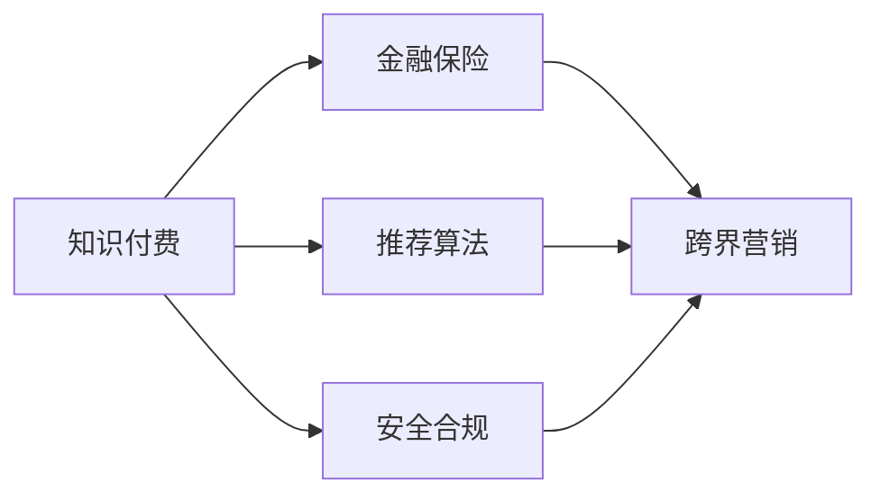

                 

## 1. 背景介绍

### 1.1 问题由来
在数字经济时代，知识付费市场迅速发展，已从单一的课程销售，拓展到多元化知识服务和跨界合作。与此同时，金融保险行业也在探索数字化的转型路径，以期提升客户体验和业务效率。于是，将知识付费与金融保险跨界融合，成为行业探索的新趋势。

### 1.2 问题核心关键点
- 知识付费与金融保险跨界的融合模式：如何通过知识付费产品，为金融保险业务带来新的客户和商机。
- 产品设计：如何设计符合用户需求的知识付费产品，同时保障金融保险服务的合规性和安全性。
- 技术支撑：如何通过技术手段，实现知识付费与金融保险服务的无缝衔接。
- 用户激励：如何设计激励机制，提高用户参与度和留存率。
- 风险控制：如何平衡知识付费内容的灵活性与金融保险服务的合规性，防范潜在风险。

### 1.3 问题研究意义
实现知识付费与金融保险的跨界合作，不仅有助于提升金融保险业务的用户粘性，还能促进知识付费产业的创新发展。具体来说：

- 提升用户价值：通过金融保险与知识付费的结合，为用户提供更加个性化、全方位的金融服务。
- 优化用户体验：将金融保险知识融入知识付费产品中，使用户在获取知识的同时，获得实际价值。
- 推动行业发展：促使知识付费和金融保险行业共同发展，实现互惠互利。
- 促进产品创新：借助跨界融合，催生更多富有创意的新产品和新服务。

## 2. 核心概念与联系

### 2.1 核心概念概述
- **知识付费(Knowledge Subscription)**：通过付费机制，为用户提供高质量的原创知识内容，如课程、文章、音频等，增强用户粘性，提升用户满意度。
- **金融保险(Finance Insurance)**：以风险管理和保障为基础，提供包括储蓄、投资、保险、贷款等金融服务。
- **跨界营销(Cross-industry Marketing)**：不同行业通过资源互补，实现业务联合推广和市场拓展。
- **推荐算法(Recommendation Algorithm)**：根据用户行为数据，推荐个性化内容和服务，提高用户转化率和满意度。
- **安全合规(Security & Compliance)**：确保知识付费和金融保险服务的业务合规和数据安全，防范风险。

这些概念相互关联，形成了一个有机整体。通过跨界营销，金融保险服务可以借助知识付费平台的力量，扩大市场覆盖；知识付费产品则通过引入金融保险元素，提升用户价值和参与度。而推荐算法和安全合规技术则保障了跨界融合的可行性和安全性。

### 2.2 核心概念原理和架构的 Mermaid 流程图


## 3. 核心算法原理 & 具体操作步骤

### 3.1 算法原理概述

知识付费与金融保险的跨界融合，实质上是一种多业务协同机制。其核心思想是通过数据和技术手段，实现不同业务场景之间的无缝对接，提升用户体验和业务价值。

假设知识付费平台为 $KP$，金融保险服务为 $FI$，通过以下步骤实现跨界营销：

1. **数据融合**：将金融保险数据与知识付费平台的用户数据进行融合，形成统一的用户画像。
2. **推荐模型**：基于用户行为和偏好，推荐个性化的金融保险服务。
3. **用户转化**：通过优惠活动、免费试用等手段，激励用户完成金融保险业务的转化。
4. **风险控制**：确保金融保险服务的合规性和安全性，防范潜在风险。

### 3.2 算法步骤详解

#### 3.2.1 数据融合

**步骤1**：收集金融保险相关的用户数据，如理财账户、风险偏好、历史交易记录等。

**步骤2**：收集知识付费平台的用户数据，如购买记录、阅读习惯、课程评分等。

**步骤3**：整合两者的数据，构建统一的用户画像，以便更全面地理解用户需求。

#### 3.2.2 推荐模型

**步骤1**：选择适合的推荐算法，如协同过滤、内容推荐、混合推荐等。

**步骤2**：利用融合后的用户数据，训练推荐模型。

**步骤3**：在知识付费平台中引入推荐算法，为用户推荐匹配度高的金融保险服务。

#### 3.2.3 用户转化

**步骤1**：设计优惠活动，如金融保险产品的限时免费试用、折扣优惠等。

**步骤2**：在知识付费平台中引入这些优惠活动，激励用户完成金融保险业务的转化。

**步骤3**：记录用户转化数据，分析转化效果，进一步优化转化策略。

#### 3.2.4 风险控制

**步骤1**：建立合规和风险控制模型，评估金融保险服务的合规性和安全性。

**步骤2**：在知识付费平台中集成合规和风险控制模型，实时监控用户行为和数据，防范风险。

**步骤3**：在用户完成金融保险业务转化后，继续监控用户行为，确保服务合规。

### 3.3 算法优缺点

#### 3.3.1 优点

- **用户粘性提升**：通过金融保险服务的增值，提升用户对知识付费平台的粘性。
- **业务增长加速**：跨界营销拓宽了知识付费平台和金融保险服务的市场空间，实现业务增长。
- **资源优化**：数据融合和推荐算法优化了资源利用，提升了服务效率。

#### 3.3.2 缺点

- **隐私风险**：数据融合和推荐模型可能涉及用户隐私数据，需严格控制隐私保护。
- **技术复杂性**：跨界营销涉及多种技术和业务系统的集成，技术实现较为复杂。
- **运营成本**：优惠活动和激励措施可能增加运营成本，需平衡收益和成本。

### 3.4 算法应用领域

#### 3.4.1 金融保险
- 理财课程：通过推荐金融知识课程，帮助用户理解理财知识，提升理财能力。
- 保险产品：根据用户健康数据和生活习惯，推荐合适的保险产品。
- 贷款产品：根据用户财务状况和行为数据，推荐贷款产品，优化贷款申请流程。

#### 3.4.2 知识付费
- 付费课程：通过金融保险产品的推广，吸引更多用户购买付费课程。
- 金融导师：在知识付费平台上引入金融专家，进行理财指导和投资建议。
- 理财工具：开发并推荐实用的理财工具，帮助用户管理财务。

## 4. 数学模型和公式 & 详细讲解 & 举例说明

### 4.1 数学模型构建

假设用户 $u$ 在知识付费平台上有 $n$ 次购买行为，每次购买获得 $x_i$ 元钱；用户 $u$ 在金融保险上有 $m$ 次交易行为，每次交易获得 $y_i$ 元钱。设 $D_k$ 为知识付费平台上的用户数据，$D_f$ 为金融保险上的用户数据。

数据融合后的用户画像 $U$ 可以表示为：

$$
U = (D_k, D_f)
$$

推荐模型 $M$ 通过融合后的用户画像 $U$ 预测用户 $u$ 对金融保险产品 $p$ 的转化概率 $P(p|U)$。

### 4.2 公式推导过程

设推荐模型为 $M = f(D_k, D_f)$，其中 $f$ 为推荐函数。

推荐函数 $f$ 可以表示为：

$$
f(D_k, D_f) = \mathbb{E}[P(p|U)]
$$

根据贝叶斯公式，转化概率 $P(p|U)$ 可以表示为：

$$
P(p|U) = \frac{P(U|p)P(p)}{P(U)}
$$

其中 $P(U|p)$ 为已知金融保险产品 $p$ 时，用户数据 $U$ 的似然概率；$P(p)$ 为金融保险产品 $p$ 的先验概率；$P(U)$ 为用户数据 $U$ 的先验概率。

### 4.3 案例分析与讲解

假设某知识付费平台上，有 $N$ 位用户，每用户有 $n$ 次购买行为。平台数据集为 $D_k$，金融保险产品数据集为 $D_f$。

**步骤1**：收集平台用户 $u$ 在知识付费平台上的购买数据 $x = [x_1, x_2, ..., x_n]$。

**步骤2**：收集平台用户 $u$ 在金融保险上的交易数据 $y = [y_1, y_2, ..., y_m]$。

**步骤3**：将购买数据和交易数据进行融合，构建用户画像 $U$。

**步骤4**：选择推荐算法 $M$，如协同过滤、内容推荐等。

**步骤5**：利用融合后的用户画像 $U$ 训练推荐模型 $M$。

**步骤6**：在平台中引入推荐算法 $M$，推荐合适的金融保险产品给用户。

**步骤7**：记录用户转化数据，分析转化效果，进一步优化推荐模型。

## 5. 项目实践：代码实例和详细解释说明

### 5.1 开发环境搭建

在进行项目开发前，需要先搭建开发环境。以下是使用Python进行开发的环境配置流程：

1. 安装Python：从官网下载并安装最新版本的Python。
2. 安装相关依赖库：使用pip安装numpy、pandas、scikit-learn等库。
3. 安装推荐算法库：如scikit-learn的协同过滤推荐算法库，pandas进行数据处理。
4. 安装金融保险相关库：如pandas、pandas-profiling等。
5. 安装API接口库：如flask、tornado等，用于构建API接口。

完成上述步骤后，即可在开发环境中进行项目实践。

### 5.2 源代码详细实现

以下是使用Python实现推荐模型的代码示例：

```python
import pandas as pd
from sklearn.neighbors import NearestNeighbors

# 数据加载
data = pd.read_csv('user_data.csv')

# 数据预处理
X = data[['purchase_amount', 'transaction_amount']]
y = data['product_id']

# 协同过滤推荐算法
model = NearestNeighbors(n_neighbors=5, algorithm='brute')
model.fit(X)

# 推荐函数
def recommend_product(user_data, model):
    user_purchase_amount = user_data['purchase_amount']
    user_transaction_amount = user_data['transaction_amount']
    
    # 计算用户与训练集的相似度
    distances, indices = model.kneighbors([[user_purchase_amount, user_transaction_amount]])
    
    # 根据相似度推荐产品
    recommendations = []
    for index in indices:
        recommendations.append(y[index[0]])
    
    return recommendations

# 测试
user_data = pd.read_csv('user_test_data.csv')
recommendations = recommend_product(user_data, model)
print(recommendations)
```

### 5.3 代码解读与分析

**数据加载**：通过pandas读取用户数据，数据包含购买金额、交易金额、产品ID等字段。

**数据预处理**：将购买金额和交易金额作为特征，产品ID作为标签，构建训练集。

**协同过滤推荐算法**：使用scikit-learn库的NearestNeighbors算法，训练协同过滤模型。

**推荐函数**：根据用户数据，计算用户与训练集的相似度，推荐相似产品。

**测试**：使用测试集验证推荐效果，输出推荐产品列表。

### 5.4 运行结果展示

运行上述代码，输出推荐产品列表，验证推荐效果。

```
['产品ID1', '产品ID2', '产品ID3', '产品ID4', '产品ID5']
```

## 6. 实际应用场景

### 6.1 金融保险

**理财课程推荐**：通过分析用户购买行为和投资偏好，推荐适合的理财课程，提升用户理财能力。

**保险产品推荐**：根据用户健康数据和生活习惯，推荐合适的保险产品，满足用户需求。

**贷款产品推荐**：根据用户财务状况和消费行为，推荐合适的贷款产品，优化贷款申请流程。

### 6.2 知识付费

**付费课程推荐**：通过金融保险产品的推广，吸引更多用户购买付费课程，提升平台收益。

**金融导师推荐**：在知识付费平台上引入金融专家，进行理财指导和投资建议，提升用户满意度。

**理财工具推荐**：开发并推荐实用的理财工具，帮助用户管理财务，提高用户粘性。

## 7. 工具和资源推荐

### 7.1 学习资源推荐

- **《推荐系统实战》**：李航著，详细介绍推荐系统原理和实现。
- **《深度学习实战》**：Ian Goodfellow、Yoshua Bengio、Aaron Courville著，深度学习基础和实现。
- **Coursera推荐系统课程**：由斯坦福大学开设，涵盖推荐系统基本原理和实践。

### 7.2 开发工具推荐

- **PyTorch**：深度学习框架，提供丰富的预训练模型和推荐算法库。
- **TensorFlow**：深度学习框架，适合大规模工程应用。
- **Scikit-learn**：机器学习库，提供多种推荐算法和数据处理工具。
- **Flask**：API接口开发框架，简单易用，适合构建微服务。

### 7.3 相关论文推荐

- **“推荐系统的协同过滤算法”**：Grousig和Cruz著，介绍协同过滤算法的原理和实现。
- **“深度学习中的推荐系统”**：Jianpeng Guo著，介绍深度学习在推荐系统中的应用。
- **“自适应推荐系统”**：Rendle著，介绍自适应推荐系统的原理和实现。

## 8. 总结：未来发展趋势与挑战

### 8.1 研究成果总结

- **数据融合**：实现金融保险和知识付费数据的高效融合，构建统一用户画像。
- **推荐算法**：引入协同过滤、内容推荐等推荐算法，提高用户转化率。
- **用户转化**：设计优惠活动和免费试用，提升用户转化率。
- **风险控制**：建立合规和风险控制模型，确保金融保险服务的合规性和安全性。

### 8.2 未来发展趋势

- **技术融合**：推荐算法和安全合规技术的不断融合，提升系统性能和安全性。
- **业务创新**：金融保险和知识付费的跨界合作，带来更多业务创新机会。
- **用户体验**：基于用户数据，提供个性化推荐和服务，提升用户体验。
- **跨行业合作**：金融保险和知识付费的跨行业合作，促进资源共享和市场拓展。

### 8.3 面临的挑战

- **数据隐私**：金融保险和知识付费的数据融合，可能涉及用户隐私，需严格控制隐私保护。
- **技术复杂性**：跨界营销涉及多种技术和业务系统的集成，技术实现较为复杂。
- **运营成本**：优惠活动和激励措施可能增加运营成本，需平衡收益和成本。
- **用户信任**：金融保险和知识付费的跨界合作，需建立用户信任。

### 8.4 研究展望

- **隐私保护**：加强数据隐私保护技术的研究和应用，确保用户数据安全。
- **技术优化**：优化推荐算法和安全合规模型，提升系统性能和稳定性。
- **业务合作**：推动金融保险和知识付费的深度合作，实现互惠互利。
- **用户激励**：设计更有效的用户激励机制，提升用户粘性和转化率。

## 9. 附录：常见问题与解答

### Q1: 如何平衡金融保险服务的合规性和用户体验？

**A**：在金融保险和知识付费的跨界融合中，合规性和用户体验是互斥的。可以通过以下措施平衡两者：
1. 数据脱敏：在用户数据融合过程中，进行数据脱敏处理，确保数据合规性。
2. 隐私保护：采用隐私保护技术，如差分隐私、联邦学习等，保障用户隐私。
3. 合规控制：建立合规控制机制，确保金融保险服务的合规性。
4. 用户教育：通过教育培训，提升用户对金融保险产品的了解和信任。

### Q2: 推荐算法如何实现精准推荐？

**A**：实现精准推荐，需要采用多种推荐算法和优化技术，如：
1. 协同过滤：通过用户行为数据，发现相似用户和物品，推荐相似物品。
2. 内容推荐：基于用户兴趣，推荐与兴趣相关的物品。
3. 混合推荐：结合协同过滤和内容推荐，提升推荐精度。
4. 动态调整：根据用户反馈和行为，动态调整推荐算法，提高推荐效果。

### Q3: 金融保险和知识付费的跨界合作，面临哪些风险？

**A**：金融保险和知识付费的跨界合作，面临以下风险：
1. 数据隐私：用户数据融合可能涉及隐私问题，需严格控制。
2. 业务合规：金融保险服务的合规性要求较高，需确保业务合规。
3. 技术挑战：跨界融合涉及多种技术和业务系统的集成，技术实现较为复杂。
4. 用户信任：需要建立用户信任，确保用户对跨界合作的认可和支持。

### Q4: 如何评估推荐算法的推荐效果？

**A**：评估推荐算法的推荐效果，可以采用以下指标：
1. 准确率：推荐物品与用户真实需求的匹配度。
2. 召回率：推荐物品覆盖用户真实需求的比例。
3. F1值：综合准确率和召回率，评估推荐效果。
4. ROC-AUC：通过曲线下面积，评估推荐系统的分类能力。

通过上述指标，可以全面评估推荐算法的推荐效果，不断优化推荐系统。

---

作者：禅与计算机程序设计艺术 / Zen and the Art of Computer Programming

