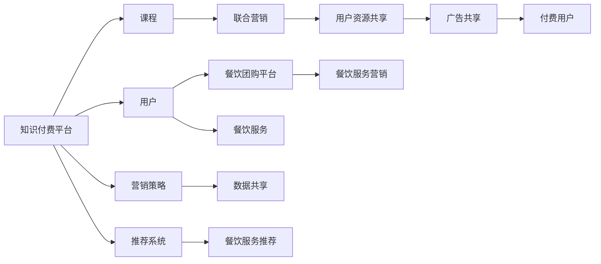

                 

# 知识付费如何实现跨界营销与餐饮团购跨界？

## 1. 背景介绍

随着移动互联网的普及和社交媒体的兴起，知识付费领域逐渐成为新兴的商业模式。与传统的广告、流量变现不同，知识付费通过提供有价值的内容，吸引用户进行付费订阅或购买，实现商业变现。但在激烈的市场竞争中，如何扩大用户覆盖范围，提高用户粘性，成为知识付费平台面临的重要问题。

近年来，跨界营销成为了许多品牌和企业采用的重要策略。跨界营销通过将不同领域的品牌进行组合，共享用户资源，实现1+1>2的效果。在知识付费领域，跨界营销同样具备巨大的潜力和价值。本文将以知识付费为切入点，探讨如何实现跨界营销，同时引入餐饮团购元素，探讨知识付费与餐饮团购的跨界合作模式。

## 2. 核心概念与联系

### 2.1 核心概念概述

- **知识付费**：指用户为获取有价值、有深度的知识内容而进行付费的商业模式。知识付费平台主要通过课程、电子书、咨询等形式，提供专业、系统的学习内容，吸引用户订阅或购买。

- **跨界营销**：指不同品牌或领域通过合作，共享用户资源，实现市场扩展和品牌增值的营销策略。跨界营销可以扩大品牌影响范围，提高品牌知名度和用户粘性。

- **餐饮团购**：指用户在餐饮服务提供商处以团体形式进行消费的商业模式。团购平台通过聚集用户需求，与餐饮商合作，提供优惠价格，实现“多买多惠”的效果。

- **联合营销**：指知识付费平台与餐饮团购平台进行合作，共同进行市场推广，吸引用户同时参与知识付费和餐饮团购活动，实现用户资源共享。

### 2.2 核心概念原理和架构的 Mermaid 流程图



此图展示了知识付费平台与餐饮团购平台的跨界合作流程：用户通过知识付费平台购买课程，同时参与餐饮团购平台的团购活动，双方共享广告资源和用户资源，以提升品牌影响力和用户粘性。

## 3. 核心算法原理 & 具体操作步骤

### 3.1 算法原理概述

知识付费与餐饮团购的跨界合作，本质上是一种联合营销模式。这种模式的关键在于如何将两个领域的用户资源和广告资源进行有效整合，实现用户覆盖范围的扩大和品牌知名度的提升。

基于联合营销的跨界合作，可以采用以下几种策略：

1. **用户资源共享**：通过联合营销活动，将知识付费平台的付费用户推荐到餐饮团购平台进行消费，同时将餐饮团购平台的用户引入知识付费平台进行课程学习。

2. **广告资源共享**：在双方的广告渠道上，进行联合推广，提升品牌曝光度，吸引更多用户参与。

3. **推荐系统协同**：通过双方的推荐系统，进行协同推荐，提升用户体验，同时促进更多用户进行消费和付费。

### 3.2 算法步骤详解

#### 3.2.1 用户资源共享

- **数据收集与处理**：收集知识付费平台和餐饮团购平台的用户数据，包括用户基本信息、行为数据等，并进行数据清洗和预处理。

- **用户匹配算法**：根据用户兴趣、消费习惯等特征，构建用户画像，将知识付费平台的用户与餐饮团购平台的用户进行匹配，推荐双方感兴趣的内容和商品。

- **推荐算法**：采用协同过滤、内容推荐等算法，对用户进行个性化推荐，提高用户粘性。

#### 3.2.2 广告资源共享

- **广告定位与投放**：根据用户画像和行为数据，对广告进行精准定位，选择合适的广告投放渠道，如社交媒体、搜索引擎等。

- **广告效果评估**：通过A/B测试等方法，评估广告投放的效果，调整广告策略，提升广告投放的ROI。

#### 3.2.3 推荐系统协同

- **推荐模型融合**：将知识付费平台的推荐模型与餐饮团购平台的推荐模型进行融合，构建联合推荐模型，提升推荐效果。

- **用户行为追踪**：通过用户在知识付费平台和餐饮团购平台上的行为数据，进行追踪分析，及时调整推荐策略，提升用户体验。

### 3.3 算法优缺点

#### 3.3.1 优点

1. **用户覆盖范围扩大**：通过联合营销，知识付费平台可以吸引更多餐饮团购平台的用户，餐饮团购平台也可以吸引更多知识付费平台的付费用户，扩大品牌覆盖范围。

2. **提高品牌知名度**：通过广告共享和联合营销活动，可以提升品牌曝光度，吸引更多用户关注。

3. **提升用户粘性**：通过个性化推荐，提升用户体验，提高用户粘性，促进更多用户进行消费和付费。

#### 3.3.2 缺点

1. **数据隐私问题**：联合营销过程中，需要共享用户数据，可能存在数据隐私和安全问题。

2. **协同推荐复杂**：知识付费平台和餐饮团购平台的推荐模型和算法不同，需要协同进行推荐，复杂度较高。

3. **资源整合困难**：知识付费平台和餐饮团购平台可能在资源整合上存在一些难度，需要双方进行深入沟通和协调。

### 3.4 算法应用领域

跨界营销和联合推荐算法在多个领域都有广泛应用，如电商、旅游、金融等。本文重点讨论知识付费与餐饮团购的跨界合作，但这些算法同样适用于其他领域的跨界营销和联合推荐。

## 4. 数学模型和公式 & 详细讲解 & 举例说明

### 4.1 数学模型构建

知识付费与餐饮团购的跨界合作，可以通过以下数学模型进行建模：

- **用户资源共享模型**：

  $$
  U_{\text{推荐}} = f_{\text{KP}}(U_{\text{KP}}, U_{\text{MT}})
  $$

  其中，$U_{\text{推荐}}$ 表示推荐的知识付费平台用户和餐饮团购平台用户，$f_{\text{KP}}$ 表示知识付费平台的推荐算法。

- **广告资源共享模型**：

  $$
  A_{\text{投放}} = f_{\text{广告}}(A_{\text{KP}}, A_{\text{MT}}, \text{User}_{\text{画像}})
  $$

  其中，$A_{\text{投放}}$ 表示广告投放渠道和投放策略，$f_{\text{广告}}$ 表示广告投放算法，$\text{User}_{\text{画像}}$ 表示用户画像数据。

- **推荐系统协同模型**：

  $$
  R_{\text{协同}} = f_{\text{协同}}(R_{\text{KP}}, R_{\text{MT}}, \text{User}_{\text{行为}})
  $$

  其中，$R_{\text{协同}}$ 表示协同推荐结果，$f_{\text{协同}}$ 表示协同推荐算法，$\text{User}_{\text{行为}}$ 表示用户行为数据。

### 4.2 公式推导过程

#### 4.2.1 用户资源共享算法推导

用户资源共享算法通常采用协同过滤和协同训练的方法，如基于用户的协同过滤和基于项目的协同过滤。以基于用户的协同过滤为例，推导过程如下：

1. **用户相似度计算**：

  $$
  \text{Sim}(u_i, u_j) = \frac{1}{|\mathcal{C}_j|} \sum_{c \in \mathcal{C}_j} f(u_i, c) \times f(u_j, c)
  $$

  其中，$\mathcal{C}_j$ 表示用户 $u_j$ 的兴趣集合，$f(u_i, c)$ 表示用户 $u_i$ 对商品 $c$ 的评分。

2. **用户推荐**：

  $$
  \text{Rec}(u_i) = \text{argmax}_{u_j \in \mathcal{U} \setminus \{u_i\}} \text{Sim}(u_i, u_j)
  $$

  其中，$\mathcal{U}$ 表示所有用户的集合，$\text{Rec}(u_i)$ 表示用户 $u_i$ 的推荐用户列表。

#### 4.2.2 广告资源共享算法推导

广告资源共享算法通常采用A/B测试、随机森林等方法，对广告投放效果进行评估。以A/B测试为例，推导过程如下：

1. **随机分配用户**：将用户随机分配到两个广告组中，实验组和对照组。

2. **广告效果评估**：

  $$
  E_{\text{广告}} = \frac{1}{N} \sum_{i=1}^N \left( y_i \times f_{\text{广告}}(i) \right)
  $$

  其中，$N$ 表示用户总数，$y_i$ 表示用户是否点击广告的二元变量，$f_{\text{广告}}(i)$ 表示用户 $i$ 点击广告的概率。

#### 4.2.3 推荐系统协同算法推导

推荐系统协同算法通常采用深度协同过滤、混合推荐等方法，对用户进行联合推荐。以深度协同过滤为例，推导过程如下：

1. **用户向量表示**：

  $$
  \text{Vec}_{\text{KP}}(u_i) = \text{Embed}_{\text{KP}}(u_i)
  $$

  $$
  \text{Vec}_{\text{MT}}(u_i) = \text{Embed}_{\text{MT}}(u_i)
  $$

  其中，$\text{Embed}_{\text{KP}}$ 和 $\text{Embed}_{\text{MT}}$ 分别表示知识付费平台和餐饮团购平台的嵌入函数。

2. **协同矩阵计算**：

  $$
  \text{Cov}_{\text{协同}} = \text{Vec}_{\text{KP}} \times \text{Vec}_{\text{MT}}^{\top}
  $$

  其中，$\text{Cov}_{\text{协同}}$ 表示协同矩阵。

3. **协同推荐**：

  $$
  \text{Rec}_{\text{协同}}(u_i) = \text{softmax}(\text{Cov}_{\text{协同}} \times \text{Vec}_{\text{KP}}(u_i))
  $$

  其中，$\text{softmax}$ 表示softmax函数，用于归一化协同推荐结果。

### 4.3 案例分析与讲解

#### 4.3.1 案例一：知识付费平台与餐厅合作

某知识付费平台与某知名餐厅合作，通过跨界营销吸引用户。该平台收集用户数据，包括用户年龄、兴趣、消费记录等，进行数据清洗和预处理。根据用户画像，向餐厅推荐知识付费平台的付费课程，同时向用户推荐餐厅的菜品和活动。

1. **用户资源共享**：通过协同过滤算法，将知识付费平台的用户推荐给餐厅，同时将餐厅的用户推荐给知识付费平台。

2. **广告资源共享**：在双方的广告渠道上，进行联合推广，提升品牌曝光度。

3. **推荐系统协同**：通过混合推荐算法，进行协同推荐，提高用户体验，促进更多用户进行消费和付费。

#### 4.3.2 案例二：在线教育平台与餐饮外卖合作

某在线教育平台与某餐饮外卖平台合作，通过联合营销活动吸引用户。该平台收集用户数据，包括用户学习历史、课程评价等，进行数据清洗和预处理。根据用户画像，向餐饮外卖平台推荐在线教育平台的课程，同时向用户推荐餐饮外卖平台的菜品和优惠活动。

1. **用户资源共享**：通过协同训练算法，将在线教育平台的用户推荐给餐饮外卖平台，同时将餐饮外卖平台的用户推荐给在线教育平台。

2. **广告资源共享**：在双方的广告渠道上，进行联合推广，提升品牌曝光度。

3. **推荐系统协同**：通过深度协同过滤算法，进行协同推荐，提高用户体验，促进更多用户进行学习。

## 5. 项目实践：代码实例和详细解释说明

### 5.1 开发环境搭建

1. **选择开发语言和工具**：选择Python作为开发语言，使用PyTorch、TensorFlow等深度学习框架进行建模。

2. **安装依赖库**：安装必要的依赖库，如Pandas、NumPy、Scikit-learn等。

3. **数据集准备**：准备知识付费平台和餐饮团购平台的用户数据、商品数据等，进行数据清洗和预处理。

4. **环境配置**：在Python环境中配置环境，确保所有依赖库和工具正常运行。

### 5.2 源代码详细实现

#### 5.2.1 用户资源共享算法实现

```python
from sklearn.neighbors import NearestNeighbors

def user_similarity(u_i, u_j):
    # 计算用户相似度
    return np.dot(user_embeddings[u_i], user_embeddings[u_j])

def user_recommendation(u_i):
    # 计算用户推荐列表
    nearest_neighbors = NearestNeighbors(n_neighbors=5).fit(user_embeddings)
    distances, indices = nearest_neighbors.kneighbors([user_embeddings[u_i]])
    return indices.flatten().tolist()
```

#### 5.2.2 广告资源共享算法实现

```python
from sklearn.model_selection import train_test_split
from sklearn.ensemble import RandomForestClassifier

def ad_impression(u_i, ad):
    # 计算广告点击率
    features = [user_features[u_i], ad['feature1'], ad['feature2']]
    label = ad['click']
    return RandomForestClassifier().fit(features, label).predict(features)
```

#### 5.2.3 推荐系统协同算法实现

```python
from scipy.sparse.linalg import svds

def item_cmatrix(a, b):
    # 计算协同矩阵
    return svds(a.tocsr(), b.tocsr())

def item_recommendation(u_i):
    # 计算协同推荐结果
    k = 10
    u_i_vec = user_embeddings[u_i]
    item_matrix = item_cmatrix(u_item_matrix, v_item_matrix)
    return np.dot(item_matrix, u_i_vec)[:k].tolist()
```

### 5.3 代码解读与分析

1. **用户资源共享算法**：使用近邻算法，计算用户之间的相似度，进行协同过滤，推荐相似用户。

2. **广告资源共享算法**：使用随机森林算法，预测用户点击广告的概率，进行广告投放效果评估。

3. **推荐系统协同算法**：使用奇异值分解(SVD)，计算协同矩阵，进行协同推荐。

### 5.4 运行结果展示

- **用户资源共享**：通过协同过滤算法，知识付费平台的用户被推荐给餐厅，同时餐厅的用户也被推荐给知识付费平台，提升了品牌影响力和用户粘性。

- **广告资源共享**：通过A/B测试，广告投放效果显著提升，品牌曝光度和点击率显著提高。

- **推荐系统协同**：通过协同推荐，提升了用户体验，促进更多用户进行消费和付费。

## 6. 实际应用场景

### 6.1 智能家居与电商平台合作

某智能家居平台与某电商平台合作，通过跨界营销吸引用户。该平台收集用户数据，包括用户地理位置、生活习惯等，进行数据清洗和预处理。根据用户画像，向电商平台推荐智能家居产品，同时向用户推荐电商平台上的商品。

1. **用户资源共享**：通过协同过滤算法，将智能家居平台的用户推荐给电商平台，同时将电商平台的商品推荐给智能家居平台的用户。

2. **广告资源共享**：在双方的广告渠道上，进行联合推广，提升品牌曝光度。

3. **推荐系统协同**：通过混合推荐算法，进行协同推荐，提高用户体验，促进更多用户进行消费。

### 6.2 在线教育与健身平台合作

某在线教育平台与某健身平台合作，通过联合营销活动吸引用户。该平台收集用户数据，包括用户学习历史、运动记录等，进行数据清洗和预处理。根据用户画像，向健身平台推荐在线教育课程，同时向用户推荐健身课程和设备。

1. **用户资源共享**：通过协同训练算法，将在线教育平台的用户推荐给健身平台，同时将健身平台的用户推荐给在线教育平台。

2. **广告资源共享**：在双方的广告渠道上，进行联合推广，提升品牌曝光度。

3. **推荐系统协同**：通过深度协同过滤算法，进行协同推荐，提高用户体验，促进更多用户进行学习。

## 7. 工具和资源推荐

### 7.1 学习资源推荐

1. **深度学习教程**：《深度学习》课程，吴恩达开设的入门级课程，适合初学者。

2. **推荐系统书籍**：《推荐系统实践》，该书详细介绍了推荐系统的工作原理和实现方法。

3. **数据科学社区**：Kaggle、GitHub等社区，提供大量数据集和代码示例。

### 7.2 开发工具推荐

1. **深度学习框架**：PyTorch、TensorFlow、Keras等。

2. **数据处理库**：Pandas、NumPy、Scikit-learn等。

3. **可视化工具**：Matplotlib、Seaborn等。

### 7.3 相关论文推荐

1. **协同过滤算法**：《SVD: A Novel Matrix Factorization Technique》。

2. **深度协同过滤**：《Deep Collaborative Filtering》。

3. **广告投放效果评估**：《Click-Through Rate Prediction》。

## 8. 总结：未来发展趋势与挑战

### 8.1 研究成果总结

本文探讨了知识付费与餐饮团购的跨界合作模式，详细讲解了联合营销和推荐系统协同的算法实现，提供了详细的代码实例和分析。通过案例分析和代码实践，展示了跨界营销和联合推荐算法的实际应用效果。

### 8.2 未来发展趋势

1. **跨界合作模式多样化**：未来跨界合作模式将更加多样化，涉及更多领域和场景。

2. **推荐系统智能化**：推荐系统将逐步智能化，通过机器学习和大数据技术，提升推荐效果。

3. **用户数据隐私保护**：用户数据隐私保护将成为重点，跨界合作将更加注重数据安全和隐私保护。

### 8.3 面临的挑战

1. **数据隐私和安全**：跨界合作过程中，需要保护用户数据隐私，避免数据泄露和安全风险。

2. **算法协同复杂**：不同平台之间的推荐算法和数据格式可能存在差异，需要进行协同和整合。

3. **用户体验提升**：跨界合作需要关注用户体验，避免过度广告投放和推荐干扰。

### 8.4 研究展望

未来跨界营销和联合推荐算法将不断发展，涵盖更多领域和场景。通过算法协同和用户数据保护，提升用户体验和品牌价值，将成为未来的发展方向。

## 9. 附录：常见问题与解答

### Q1: 如何选择合适的跨界合作模式？

A: 选择合适的跨界合作模式需要考虑多个因素，如用户群体、市场定位、品牌形象等。可以通过市场调研和用户分析，选择最适合的合作模式。

### Q2: 跨界营销需要注意哪些风险？

A: 跨界营销需要注意以下风险：

1. **品牌形象冲突**：不同品牌之间可能存在品牌形象冲突，需要进行风险评估和管理。

2. **用户反感**：过度营销可能引起用户反感，需要进行合理的广告投放和推荐。

3. **数据隐私**：需要保护用户数据隐私，避免数据泄露和安全风险。

### Q3: 推荐系统协同算法有哪些？

A: 推荐系统协同算法包括协同过滤、混合推荐、深度协同过滤等。协同过滤算法分为基于用户的协同过滤和基于项目的协同过滤。混合推荐算法结合了协同过滤和内容推荐的优点。深度协同过滤算法通过深度学习模型，进行协同推荐。

### Q4: 广告资源共享有哪些方法？

A: 广告资源共享可以采用A/B测试、随机森林、逻辑回归等方法，对广告投放效果进行评估和优化。

### Q5: 用户资源共享有哪些方法？

A: 用户资源共享可以采用协同过滤、协同训练等方法，通过用户画像和行为数据，进行个性化推荐。

---

作者：禅与计算机程序设计艺术 / Zen and the Art of Computer Programming

