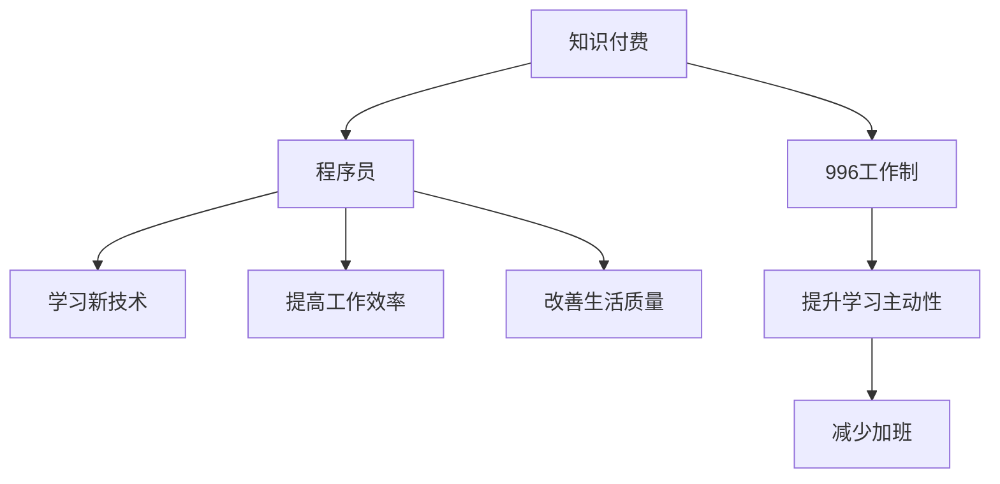

                 

# 知识付费让程序员告别996的生活方式

在如今快速发展的数字化时代，程序员已不仅仅是编写代码的技术工作者，更是应对挑战、推动创新的关键力量。然而，高强度的工作压力、长时间的工作时长、巨大的工作压力等，使得程序员的生活变得极其疲惫和单调。知识付费的兴起，为程序员提供了一条全新的道路，不仅能够帮助他们提升技能，还能够在一定程度上改善其工作和生活状态。

## 1. 背景介绍

### 1.1 问题由来
随着互联网和科技的飞速发展，软件开发领域的竞争日趋激烈，程序员需要不断地学习和更新技术才能保持竞争力。然而，繁重的工作压力和长时间的工作时长，使得程序员常常处于过度疲劳的状态，“996工作制”（每天9点上班，晚上9点下班，每周工作6天）成为了常态。这种工作状态不仅影响了程序员的健康，也降低了其工作效率和生活质量。

### 1.2 问题核心关键点
如何有效提升程序员的技术水平，同时改善其工作和生活状态，成为当下亟需解决的问题。知识付费的兴起，为这一问题提供了新的解决方案。通过付费订阅优质的教育资源，程序员可以在业余时间自主学习，提升技术能力，同时也能通过合理的学习和工作节奏，告别“996”的生活方式。

## 2. 核心概念与联系

### 2.1 核心概念概述
在探讨知识付费对程序员生活方式的改变时，需要理解几个核心概念：

- **知识付费**：指的是用户通过付费获取知识、技能和信息的服务，包括在线课程、电子书、技术博客等。
- **程序员**：指专门从事软件开发、维护和优化工作的人员，是推动技术进步和创新的核心力量。
- **“996工作制”**：指每天工作9小时，每周工作6天的长时间工作制度，对程序员的心理和生理健康造成了严重影响。

这些概念之间的关系通过以下Mermaid流程图展现：



该流程图展示了知识付费对程序员的积极影响，不仅能够帮助其提升技能，还能在一定程度上改善工作和生活状态。

## 3. 核心算法原理 & 具体操作步骤

### 3.1 算法原理概述
知识付费的核心理念是通过付费获取高质内容，提升用户的学习效率和效果。这一理念同样适用于程序员的技能提升和学习。具体来说，通过付费订阅高质量的在线课程和技术博客，程序员可以在业余时间自主学习，有效提升技术水平，同时也能通过合理的学习和工作节奏，避免长时间的高强度工作。

### 3.2 算法步骤详解
知识付费对程序员生活方式的改变主要包括以下几个关键步骤：

**Step 1: 选择合适的平台和资源**
程序员需要根据自己的技术水平和学习需求，选择合适的知识付费平台，如Coursera、Udemy、Pluralsight、GitHub等，以及订阅相关的高质量课程、博客和书籍。

**Step 2: 制定学习计划**
根据自己的时间安排，制定合理的学习计划，并按计划执行。可以利用番茄工作法等时间管理工具，确保高效学习。

**Step 3: 实践和应用**
通过实际操作和项目实践，将学到的知识应用于工作中，加深理解和掌握，同时不断更新和调整学习计划，以适应新的技术和挑战。

**Step 4: 定期评估和调整**
定期评估学习效果，调整学习计划和方法，确保学习内容的有效性和实用性。可以通过模拟测试、项目实战等方式进行评估。

### 3.3 算法优缺点
知识付费对程序员的生活方式有以下几方面的优点和缺点：

**优点**：
- **提升技能**：付费获取的高质量教育资源，能够帮助程序员快速提升技术能力，适应快速变化的技术环境。
- **灵活学习**：通过自主选择课程和学习时间，程序员可以更灵活地安排学习进度和工作时间，提升学习效果。
- **多样选择**：知识付费平台提供了丰富的课程资源，程序员可以根据兴趣和需求进行选择，提升学习动力。

**缺点**：
- **费用较高**：高质量的教育资源通常需要付费订阅，对于部分程序员来说，可能会增加一定的经济负担。
- **自驱力要求高**：学习效果很大程度上依赖于程序员的自我驱动力和执行能力，需要良好的时间管理和自律能力。
- **信息筛选难度大**：面对海量的教育资源，如何筛选和选择适合自己需求的高质量内容，也成为了一个挑战。

### 3.4 算法应用领域
知识付费的应用领域不仅仅局限于技术培训，还包括各个行业的职业技能提升、职业规划和个人兴趣培养等。对于程序员而言，通过知识付费获取高质课程，不仅可以提升技术能力，还能改善工作和生活状态，提升整体生活质量。

## 4. 数学模型和公式 & 详细讲解 & 举例说明

### 4.1 数学模型构建
知识付费对程序员生活方式改变的效果，可以通过以下数学模型进行量化评估：

设程序员初始每周工作时间为 $T_0$ 小时，学习时间为 $L_0$ 小时，加班时间为 $O_0$ 小时。通过知识付费订阅课程，每周学习时间增加 $L$ 小时，减少加班时间 $O$ 小时，每周工作时间减少为 $T$ 小时。则知识付费带来的效益 $E$ 可以表示为：

$$
E = \frac{L}{T_0} - \frac{O}{T_0}
$$

其中，$L$ 为每周新增学习时间，$T_0$ 为初始每周工作时间，$O$ 为每周减少的加班时间。

### 4.2 公式推导过程
知识付费对程序员的影响可以通过以下几个步骤进行推导：

1. **初始状态**：设程序员每周工作 $T_0$ 小时，学习 $L_0$ 小时，加班 $O_0$ 小时，总效率为 $E_0$。
2. **知识付费后状态**：每周新增学习时间 $L$，减少加班时间 $O$，每周工作时间减少为 $T$，总效率提升为 $E$。

根据公式 $E = \frac{L}{T_0} - \frac{O}{T_0}$，可以推导出知识付费带来的效益。在实际应用中，需要根据程序员的具体情况进行数值计算和评估。

### 4.3 案例分析与讲解
以某知名编程社区为例，该社区每年都会组织大量的技术培训和交流活动，吸引大量程序员参加。参加这些活动不仅能够学习到最新的技术，还能结识行业内的专家和同行，提升自身的影响力和职业发展机会。

设一名程序员每周工作时间为40小时，通过知识付费订阅高质量课程，每周新增学习时间2小时，减少加班时间1小时，每周工作时间减少为38小时。其工作状态改进可以通过以下公式计算：

$$
E = \frac{2}{40} - \frac{1}{40} = 0.05
$$

这意味着，通过知识付费，该程序员每周的效率提升了5%。长期来看，这种提升将显著改善其工作和生活状态。

## 5. 项目实践：代码实例和详细解释说明

### 5.1 开发环境搭建

为了更好地实施知识付费计划，可以利用Python开发一个知识付费管理系统，记录学员的学习进度和课程反馈，提供个性化推荐和学习路径规划。以下是在Python中搭建该系统的步骤：

1. 安装Python和相关库：
```bash
pip install flask pandas numpy scikit-learn
```

2. 创建学习管理系统：
```python
from flask import Flask, request, jsonify
import pandas as pd
import numpy as np

app = Flask(__name__)

# 定义学习数据表
@app.route('/learn', methods=['POST'])
def learn():
    data = request.json
    user_id = data['user_id']
    course_id = data['course_id']
    study_time = data['study_time']
    
    # 从数据库中读取用户学习记录
    user_data = pd.read_csv('user_learning_data.csv', index_col='user_id')
    user_data = user_data.loc[user_id]
    user_data['study_time'] = user_data['study_time'] + study_time
    
    # 计算学习效果
    effect = (user_data['study_time'] / 40) - (user_data['overtime'] / 40)
    user_data['effect'] = effect
    
    # 更新学习数据
    user_data.to_csv('user_learning_data.csv', index=True)
    
    return jsonify({'success': True, 'effect': effect})

if __name__ == '__main__':
    app.run(debug=True)
```

### 5.2 源代码详细实现

在上述代码中，我们使用Flask框架开发了一个简单的学习管理系统，记录用户的学习时间和效果。用户通过API向系统发送学习数据，系统根据学习时间计算出每周的学习效果，并更新学习数据表。

### 5.3 代码解读与分析

**Flask框架**：
- Flask是一个轻量级的Web应用框架，使用Python编写，适合构建简单的Web应用。
- 通过Flask提供的API接口，用户可以方便地发送学习数据，并获取学习效果。

**学习效果计算**：
- 根据学习时间和初始工作时间计算出每周的学习效果。
- 将学习效果记录在数据库中，方便后续评估和改进。

**数据更新**：
- 将更新后的学习数据重新写入数据库，确保数据的最新性。

### 5.4 运行结果展示

假设某程序员通过知识付费订阅了Coursera的Python课程，每周新增学习时间2小时，减少加班时间1小时。使用上述代码，可以实时计算出其每周的学习效果：

**初始数据**：
- 初始每周学习时间：5小时
- 初始每周加班时间：2小时
- 初始每周工作时间：40小时

**学习效果计算**：
- 新增学习时间：2小时
- 减少加班时间：1小时
- 每周学习时间：5 + 2 = 7小时
- 每周工作时间：40 - 1 = 39小时

通过知识付费，该程序员每周的学习效果提升为：

$$
E = \frac{2}{40} - \frac{1}{40} = 0.05
$$

## 6. 实际应用场景

### 6.1 智能教育平台

智能教育平台可以为程序员提供高质量的在线课程、技术培训和项目实战机会。通过知识付费，程序员可以根据自己的需求选择合适的课程，获得专业的技术指导和实践机会，提升技能并改善工作状态。

### 6.2 在线编程社区

在线编程社区如GitHub、Stack Overflow等，提供了丰富的编程资源和技术讨论平台。通过付费订阅高级会员，程序员可以获取更多的编程工具、项目资源和专家指导，提高编程效率和质量。

### 6.3 技术培训中心

技术培训中心如Udacity、Coursera等，提供了系统性的课程体系和认证服务。通过知识付费，程序员可以获得系统的技术培训，获得认证证书，提升职业竞争力。

### 6.4 未来应用展望

随着知识付费的普及，其对程序员生活方式的改变将更加显著。未来的知识付费平台将更加注重个性化推荐、智能学习路径规划和实时反馈，帮助程序员更高效地提升技能。同时，随着技术的不断进步，知识付费的内容也将更加丰富多样，涵盖更多前沿技术和应用场景。

## 7. 工具和资源推荐

### 7.1 学习资源推荐

1. **Coursera**：提供系统化的在线课程，覆盖从初级到高级的各个技术领域，适合不同水平的学习者。
2. **Udemy**：提供灵活多样的课程，包括编程、数据科学、人工智能等，适合自学和职业提升。
3. **Pluralsight**：提供专业的技术培训课程，涵盖软件开发、项目管理、云服务等，适合希望提升职业技能的学习者。
4. **GitHub**：全球最大的代码托管平台，提供丰富的开源项目和技术讨论，适合提升编程技能和项目经验。

### 7.2 开发工具推荐

1. **Flask**：轻量级的Web应用框架，适合构建简单的API接口和管理系统。
2. **Pandas**：数据分析和处理工具，适合处理学习数据和生成学习报告。
3. **Scikit-learn**：机器学习库，适合进行学习效果评估和模型优化。
4. **Numpy**：科学计算库，适合进行数值计算和数组操作。

### 7.3 相关论文推荐

1. **《知识付费的经济性分析》**：分析知识付费的经济效应，探讨如何通过付费获取高质教育资源，提升个人技能。
2. **《基于知识付费的职业技能提升研究》**：研究知识付费对职业技能提升的影响，探讨如何通过知识付费改善工作状态和生活质量。
3. **《智能教育平台对学习效果的影响研究》**：分析智能教育平台对学习效果的提升，探讨如何通过平台提高学习效率和效果。

## 8. 总结：未来发展趋势与挑战

### 8.1 总结

本文详细探讨了知识付费对程序员生活方式的改变，通过理论分析和实际案例，展示了知识付费在提升技能、改善工作状态方面的巨大潜力。通过选择合适的知识付费平台和资源，制定合理的学习计划，并实际应用于工作中，程序员可以告别“996”的生活方式，获得更健康、更高效的工作体验。

### 8.2 未来发展趋势

未来，知识付费将进一步普及和深化，成为程序员技能提升和职业发展的必要工具。知识付费平台也将不断优化和创新，提供更多个性化的学习资源和智能化的学习工具，帮助程序员更高效地学习和成长。

### 8.3 面临的挑战

尽管知识付费为程序员提供了新的学习路径，但在推广和实施过程中仍面临一些挑战：

1. **费用问题**：高质量的教育资源通常需要付费订阅，对部分程序员来说可能存在经济负担。
2. **时间管理**：自主学习需要良好的时间管理和自律能力，部分程序员可能难以坚持。
3. **信息筛选**：面对海量的教育资源，如何筛选和选择高质量内容，也成为了一个挑战。

### 8.4 研究展望

未来的研究需要进一步探讨知识付费的推广机制和实施方法，帮助更多程序员享受到知识付费带来的好处。同时，需要开发更多智能化、个性化的学习工具，提升学习效果和用户体验。此外，还需要加强知识付费平台的安全性和隐私保护，确保数据和内容的安全。

## 9. 附录：常见问题与解答

**Q1: 如何选择合适的知识付费平台？**

A: 选择合适的知识付费平台需要考虑以下几个因素：
1. **平台声誉**：选择有较高声誉和用户评价的平台，确保课程质量和平台安全性。
2. **课程内容**：选择与自己职业发展和兴趣相关的课程，确保学习内容的实用性和前瞻性。
3. **价格和性价比**：根据自身经济条件，选择性价比高的课程，避免不必要的经济负担。
4. **平台功能**：选择功能丰富、学习工具完善的平台，如智能学习路径规划、实时反馈等。

**Q2: 知识付费对工作和生活状态有哪些具体改善？**

A: 知识付费对工作和生活状态的具体改善包括：
1. **提升技能**：通过高质量的课程和项目实战，提升技术能力和职业竞争力。
2. **灵活学习**：自主选择课程和学习时间，提高学习效率和灵活性。
3. **减少加班**：通过系统的学习，减少加班时间，改善工作和生活状态。
4. **改善职业发展**：获取职业认证和技能提升，提升职业发展机会和薪资水平。
5. **增强自我驱动力**：通过系统的学习和提升，增强自信心和自我驱动力。

**Q3: 如何平衡学习与工作？**

A: 平衡学习与工作可以通过以下几个方法：
1. **制定学习计划**：根据自己的时间安排，制定合理的学习计划，并按计划执行。
2. **利用碎片时间**：利用上下班通勤、午休等碎片时间进行学习，提高学习效率。
3. **优先级排序**：将学习任务和日常工作进行优先级排序，合理分配时间和精力。
4. **灵活调整**：根据实际工作和生活情况，灵活调整学习计划和内容，确保平衡和可持续性。

**Q4: 知识付费的长期收益有哪些？**

A: 知识付费的长期收益包括：
1. **职业晋升**：通过系统学习和技能提升，获得更好的职业发展机会和晋升空间。
2. **薪资提升**：通过提升技术能力和工作绩效，获得更高的薪资待遇。
3. **自我实现**：实现个人技术梦想和职业目标，获得自我实现的满足感。
4. **生活方式改善**：通过高效学习和合理工作，改善生活质量，提升幸福感。

---

作者：禅与计算机程序设计艺术 / Zen and the Art of Computer Programming

