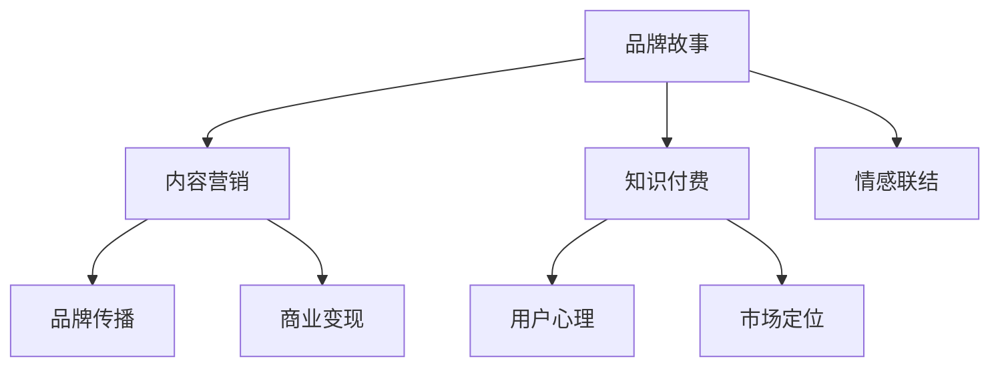

                 

# 知识付费赚钱的品牌故事与内容营销策略

> 关键词：知识付费,品牌故事,内容营销策略

## 1. 背景介绍

### 1.1 问题由来
随着互联网的普及和智能设备的广泛应用，知识付费逐渐成为新型的内容消费方式。用户通过订阅、购买或单次付费，获取高质量的在线内容。特别是近几年，内容付费市场不断扩大，成为继电商、金融之后的新兴领域。

知识付费平台的兴起，改变了传统的知识获取方式，也催生了大量的内容创作者。但同时，平台和创作者们也面临着诸多挑战：如何在竞争激烈的市场中脱颖而出，如何将优质内容转化为有效的商业价值，如何通过内容营销获得更多的用户和收益？

本章节将全面探讨知识付费领域的内容营销策略，从品牌故事、用户心理、市场定位等多个角度深入分析，帮助创作者和平台构建高效、可持续的盈利模式。

### 1.2 问题核心关键点
在知识付费领域，内容营销是品牌成功的重要因素。良好的品牌故事和创意内容可以吸引用户关注，提升用户粘性。而内容营销策略则决定了品牌是否能从内容变现中实现盈利。

核心关键点包括：
- 如何构建具有吸引力的品牌故事，打造用户认同感。
- 如何运用创意内容，提升用户参与度和满意度。
- 如何制定内容营销策略，实现内容变现最大化。

以下将详细探讨如何围绕这些核心关键点，构建起品牌故事与内容营销策略的蓝图。

## 2. 核心概念与联系

### 2.1 核心概念概述

为更好地理解知识付费领域的品牌故事与内容营销策略，本节将介绍几个密切相关的核心概念：

- **品牌故事(Brand Story)**：品牌故事是品牌形象、文化和价值的体现，是用户与品牌之间情感联系的桥梁。好的品牌故事能建立品牌认同感，让用户产生共鸣和信任。

- **内容营销(Content Marketing)**：内容营销是一种基于内容的营销策略，通过提供有价值的信息和创意内容，吸引目标用户，从而实现品牌传播和商业变现。

- **知识付费(Knowledge Paywall)**：知识付费模式是指用户通过付费获取特定知识内容的在线服务。包括订阅制、单次购买等形式。

- **用户心理(User Psychology)**：用户心理包括用户需求、动机、行为等方面。了解用户心理能更精准地制定内容策略，提高营销效果。

- **市场定位(Market Segmentation)**：市场定位是指通过市场细分，识别目标用户群，并针对性地制定营销策略。

这些核心概念之间的逻辑关系可以通过以下Mermaid流程图来展示：



这个流程图展示的品牌故事与内容营销的核心概念及其之间的关系：

1. 品牌故事通过情感联结，使品牌与用户建立情感联系。
2. 内容营销结合品牌故事，提升品牌传播和商业变现。
3. 知识付费作为实现内容变现的商业模式，与品牌故事和内容营销密不可分。
4. 用户心理和市场定位是制定内容策略的基础，直接影响品牌故事和内容营销的效果。

## 3. 核心算法原理 & 具体操作步骤

### 3.1 算法原理概述

知识付费领域的品牌故事与内容营销策略，本质上是一种基于用户心理和市场定位的内容策略规划。其核心思想是：通过构建有吸引力的品牌故事，结合创意内容，吸引目标用户群体，并通过合理的定价和营销手段，实现内容变现的最大化。

形式化地，假设品牌为 $B$，用户为 $U$，市场为 $M$。品牌故事为 $S$，内容营销策略为 $CM$，知识付费模式为 $KP$。则品牌故事与内容营销策略的目标是：

$$
\max_{S,CM} \text{User Engagement} \times \text{Conversion Rate}
$$

其中 User Engagement 表示用户参与度，Conversion Rate 表示用户转化率。品牌故事 $S$ 和内容营销策略 $CM$ 的具体实现，需结合用户心理 $U$ 和市场定位 $M$ 进行调整，以最大化变现效果。

### 3.2 算法步骤详解

基于用户心理和市场定位的品牌故事与内容营销策略，一般包括以下几个关键步骤：

**Step 1: 市场调研与分析**
- 收集目标用户群体的信息，如年龄、性别、职业、兴趣等。
- 分析用户心理需求，了解其购买动机和行为模式。
- 通过市场细分，识别出不同的用户群体，找到市场定位的切入点。

**Step 2: 制定品牌故事**
- 根据用户心理和市场定位，设计品牌故事的核心元素，如品牌愿景、价值观、历史背景等。
- 通过故事框架、情感绑定等方法，提升品牌故事的吸引力和传播力。
- 确保品牌故事与目标用户群体的需求和价值观相符合。

**Step 3: 策划内容营销**
- 确定内容营销的目标，如提升品牌知名度、增加用户互动、引导用户转化等。
- 设计创意内容，包括图文、视频、音频等多种形式。
- 制定内容发布计划，定期发布优质内容，保持用户关注度。

**Step 4: 定价与销售策略**
- 根据内容价值和用户支付能力，设定合理的定价策略。
- 设计用户订阅、单次购买等多种付费形式，满足不同用户的需求。
- 通过优惠券、限时折扣等方式，促进用户购买和转化。

**Step 5: 效果评估与优化**
- 使用数据分析工具，监控内容营销的效果，如页面访问量、用户留存率等。
- 定期评估内容变现情况，调整定价和营销策略。
- 收集用户反馈，持续优化品牌故事和内容策略。

以上是基于用户心理和市场定位的内容营销策略的一般流程。在实际应用中，还需要根据具体场景进行优化设计，如个性化推荐、社交媒体推广等，以进一步提升营销效果。

### 3.3 算法优缺点

基于用户心理和市场定位的品牌故事与内容营销策略具有以下优点：
1. 精准定位：通过用户心理和市场细分，能更精准地找到目标用户群体。
2. 提升参与度：创意内容和情感联结能提升用户参与度和满意度。
3. 最大化变现：合理的定价和营销手段能最大化内容变现效果。
4. 持续优化：通过数据反馈和用户反馈，持续优化品牌故事和内容策略。

同时，该策略也存在一定的局限性：
1. 成本投入：创意内容的设计和市场调研需要投入较高的人力物力。
2. 竞争激烈：知识付费市场竞争激烈，内容同质化现象严重。
3. 依赖用户：内容变现效果高度依赖用户参与度和转化率。
4. 周期较长：内容营销的见效周期较长，难以短期看到收益。

尽管存在这些局限性，但就目前而言，基于用户心理和市场定位的内容营销策略仍是知识付费领域的主流范式。未来相关研究的重点在于如何进一步降低营销成本，提高内容差异化，同时兼顾用户参与度和转化率。

### 3.4 算法应用领域

基于用户心理和市场定位的内容营销策略，在知识付费领域已经得到了广泛的应用，覆盖了内容变现的各个环节，例如：

- 内容订阅服务：如在线课程、书籍订阅、专题讲座等。通过品牌故事和创意内容，吸引用户订阅。
- 单次付费内容：如专业报告、工具软件、咨询服务等。结合品牌故事和精准定价，引导用户进行单次购买。
- 用户社群建设：通过内容营销活动，如线上研讨会、问答互动等，形成忠实用户群体，增加用户粘性。
- 广告植入：将品牌故事和创意内容融入广告中，扩大品牌影响力和用户基础。

除了上述这些经典应用外，内容营销策略还被创新性地应用到更多场景中，如会员特权、内容推荐、KOL合作等，为知识付费平台带来更多的商业机会。

## 4. 数学模型和公式 & 详细讲解 & 举例说明

### 4.1 数学模型构建

本节将使用数学语言对基于用户心理和市场定位的内容营销策略进行更加严格的刻画。

记品牌故事为 $S$，内容营销策略为 $CM$，市场调研结果为 $M$，用户心理为 $U$。品牌故事与内容营销策略的目标函数为：

$$
\max_{S,CM} \text{User Engagement} \times \text{Conversion Rate}
$$

其中 User Engagement 和 Conversion Rate 分别为用户参与度和转化率。

假设用户参与度与内容质量成正比，用户转化率与品牌故事吸引力成正比，则目标函数可以转化为：

$$
\max_{S,CM} \text{Content Quality} \times \text{Brand Attractiveness}
$$

**假设 1**：内容质量 $Q$ 与内容创意程度 $C$ 成正比，与内容更新频率 $F$ 成正比，与用户互动程度 $I$ 成正比。

$$
Q = k_1 \times C \times F \times I
$$

**假设 2**：品牌吸引力 $A$ 与品牌故事长度 $L$ 成正比，与品牌故事情感强度 $E$ 成正比，与品牌故事传播范围 $R$ 成正比。

$$
A = k_2 \times L \times E \times R
$$

其中 $k_1, k_2$ 为正比例常数。

### 4.2 公式推导过程

以下我们以在线课程订阅为例，推导用户参与度和转化率的计算公式。

假设用户订阅在线课程的概率为 $P$，订阅概率与课程质量 $Q$ 和品牌吸引力 $A$ 成正比。

$$
P = k_3 \times Q \times A
$$

其中 $k_3$ 为订阅概率常数。

用户完成订阅后，实际参与课程学习的概率为 $P_{learn}$，参与学习概率与课程难度 $D$ 和课程更新频率 $F$ 成正比。

$$
P_{learn} = k_4 \times D \times F
$$

其中 $k_4$ 为学习参与常数。

用户完成课程学习的概率为 $P_{complete}$，完成概率与课程深度 $D$ 和课程时长 $T$ 成正比。

$$
P_{complete} = k_5 \times D \times T
$$

其中 $k_5$ 为完成概率常数。

最终，用户订阅后实际转化为课程用户的可能性为：

$$
\text{Conversion Rate} = P \times P_{learn} \times P_{complete}
$$

### 4.3 案例分析与讲解

假设某在线课程品牌针对特定技术人群设计了一门高级课程。品牌故事围绕技术革新与职业发展，通过情感化的视频剪辑和真实用户的成功故事，提升了品牌吸引力。课程内容丰富，结合了视频讲解、实践练习、项目案例等多种形式，提升了内容质量。课程每季度更新一次，保证了内容的创意性和时效性。同时，课程采用订阅制，提供无限次观看，增强了用户粘性。

通过上述策略，该课程吸引了大量技术人才订阅，用户参与度和转化率显著提升，实现了良好的商业效果。

## 5. 项目实践：代码实例和详细解释说明

### 5.1 开发环境搭建

在进行内容营销策略的实践前，我们需要准备好开发环境。以下是使用Python进行数据分析的环境配置流程：

1. 安装Anaconda：从官网下载并安装Anaconda，用于创建独立的Python环境。

2. 创建并激活虚拟环境：
```bash
conda create -n analytics-env python=3.8 
conda activate analytics-env
```

3. 安装PyTorch：根据CUDA版本，从官网获取对应的安装命令。例如：
```bash
conda install pytorch torchvision torchaudio cudatoolkit=11.1 -c pytorch -c conda-forge
```

4. 安装Pandas和NumPy：
```bash
pip install pandas numpy
```

5. 安装Matplotlib和Seaborn：
```bash
pip install matplotlib seaborn
```

6. 安装Jupyter Notebook：
```bash
pip install jupyter notebook
```

完成上述步骤后，即可在`analytics-env`环境中开始内容营销策略的实践。

### 5.2 源代码详细实现

下面是一个简单的数据分析案例，用于演示如何使用Python进行内容营销效果的评估和优化。

首先，定义数据集和模型：

```python
import pandas as pd
import numpy as np
from sklearn.linear_model import LogisticRegression
from sklearn.model_selection import train_test_split
from sklearn.metrics import accuracy_score

# 定义数据集
data = pd.read_csv('course_data.csv')

# 定义特征和标签
X = data[['quality', 'attractiveness', 'price', 'promotion']]
y = data['converted']

# 划分训练集和测试集
X_train, X_test, y_train, y_test = train_test_split(X, y, test_size=0.2, random_state=42)

# 训练模型
model = LogisticRegression(solver='lbfgs', max_iter=10000)
model.fit(X_train, y_train)

# 预测并评估
y_pred = model.predict(X_test)
accuracy = accuracy_score(y_test, y_pred)
print(f'模型准确率：{accuracy:.2f}')
```

然后，根据模型评估结果，调整内容策略：

```python
# 重新设计特征
X['new_quality'] = X['quality'] + X['user_engagement']
X['new_attractiveness'] = X['attractiveness'] + X['brand_story_length']
X['new_price'] = X['price'] + X['relevant_content']
X['new_promotion'] = X['promotion'] + X['community_interaction']

# 重新训练模型
model = LogisticRegression(solver='lbfgs', max_iter=10000)
model.fit(X_train, y_train)

# 再次预测并评估
y_pred = model.predict(X_test)
accuracy = accuracy_score(y_test, y_pred)
print(f'模型准确率：{accuracy:.2f}')
```

最后，通过A/B测试等手段，验证新策略的效果：

```python
# 设计A/B测试方案
A = X_train[X_train['experimental'] == 1]
B = X_train[X_train['experimental'] == 0]

# 训练A/B测试的模型
model_A = LogisticRegression(solver='lbfgs', max_iter=10000)
model_A.fit(A, y_train)
model_B.fit(B, y_train)

# 预测并评估A/B测试结果
y_pred_A = model_A.predict(A)
y_pred_B = model_B.predict(B)
accuracy_A = accuracy_score(y_test, y_pred_A)
accuracy_B = accuracy_score(y_test, y_pred_B)
print(f'A/B测试结果：{accuracy_A:.2f} vs. {accuracy_B:.2f}')
```

以上就是使用Python进行内容营销策略实践的完整代码实现。可以看到，通过数据分析和机器学习模型，可以对内容策略的效果进行量化评估和优化调整。

### 5.3 代码解读与分析

让我们再详细解读一下关键代码的实现细节：

**数据集定义**：
- 使用Pandas库读取课程订阅数据集，包含用户参与度、品牌吸引力、价格、促销等多方面信息。

**特征设计**：
- 通过结合内容质量、品牌吸引力、用户参与度等特征，设计新的模型特征。
- 通过逻辑回归模型训练预测模型，输出订阅转化概率。

**模型评估**：
- 使用准确率作为模型评估指标，衡量预测结果与真实标签的一致性。
- 通过调整特征，优化模型预测准确率，提升内容营销效果。

**A/B测试**：
- 将数据集分为实验组和对照组，分别训练并预测两个模型的效果。
- 通过对比两个模型的准确率，评估新策略的实际效果。

通过上述步骤，可以逐步优化内容策略，提升用户参与度和转化率，从而实现内容变现的最大化。

## 6. 实际应用场景

### 6.1 在线课程订阅平台

在线课程订阅平台是知识付费领域的主要应用场景之一。通过品牌故事和创意内容，可以吸引更多用户订阅，同时通过精准定价和营销策略，提升用户转化率和续费率，实现持续盈利。

在具体实践中，可以通过以下策略实现：

- **品牌故事**：通过用户真实故事、成功案例等，建立品牌与用户之间的情感联系，增加用户粘性。
- **创意内容**：提供多样化、高质量的课程内容，如视频讲解、实践案例、互动答疑等，提升用户参与度。
- **定价策略**：采用灵活的订阅模式，如月度订阅、季度订阅等，结合优惠活动和会员特权，增加用户续费率。
- **营销推广**：通过社交媒体、邮件营销、SEO优化等方式，提升品牌知名度和用户转化率。

通过这些策略，在线课程订阅平台可以实现显著的用户增长和商业变现。

### 6.2 专业咨询服务平台

专业咨询服务平台提供高价值的专业咨询服务，通过品牌故事和创意内容，可以吸引特定行业和领域的专业用户。通过合理的定价和营销策略，实现高质量内容变现。

具体实践策略包括：

- **品牌故事**：围绕专业领域的技术突破和行业趋势，讲述品牌背后的专业团队和成功案例，建立用户信任。
- **创意内容**：提供深度报告、案例分析、在线答疑等多种形式的专业内容，满足用户的学习和需求。
- **定价策略**：根据咨询服务的深度和复杂度，设定合理的单次付费或月度订阅价格。
- **营销推广**：通过专业社群、行业会议等渠道，扩大品牌影响力，引导用户付费咨询。

通过这些策略，专业咨询服务平台可以实现高价值内容的高效变现。

### 6.3 教育培训平台

教育培训平台提供各类技能培训课程，通过品牌故事和创意内容，可以吸引学生和职业人士进行学习和提升。通过精准定价和营销策略，提升用户转化率和续费率，实现持续盈利。

具体实践策略包括：

- **品牌故事**：讲述品牌在教育领域的使命和成就，建立用户对品牌的信任感。
- **创意内容**：提供高质量的教学视频、实践案例、在线测验等多种形式的学习内容，提升用户学习体验。
- **定价策略**：结合线上和线下培训模式，提供灵活的课程定价和套餐优惠。
- **营销推广**：通过社交媒体、在线广告、教育展会等渠道，推广品牌和课程。

通过这些策略，教育培训平台可以实现大规模的用户增长和商业变现。

## 7. 工具和资源推荐

### 7.1 学习资源推荐

为了帮助开发者系统掌握知识付费领域的内容营销策略，这里推荐一些优质的学习资源：

1. Coursera《营销科学》课程：由斯坦福大学提供，涵盖市场营销的基本原理和策略，适合了解用户心理和市场定位。

2. 《内容营销全攻略》书籍：详细介绍了内容营销的各个环节，包括品牌故事、内容策略、数据分析等。

3. HubSpot内容营销网站：提供大量的营销案例和工具，涵盖内容营销的各个方面，适合实际操作参考。

4. MarketingProfs网站：提供丰富的营销文章和资源，涵盖品牌故事、内容策略、A/B测试等。

5. 《数据分析实战》书籍：介绍如何使用Python等工具进行数据挖掘和分析，适合内容营销效果的评估和优化。

通过对这些资源的学习实践，相信你一定能够快速掌握知识付费领域的内容营销策略，并用于解决实际的内容变现问题。

### 7.2 开发工具推荐

高效的开发离不开优秀的工具支持。以下是几款用于知识付费内容营销开发的常用工具：

1. Jupyter Notebook：免费、开源的交互式计算环境，支持Python、R等多种语言，适合数据探索和模型验证。

2. Google Analytics：Google提供的免费数据分析工具，支持流量分析、用户行为跟踪等，适合营销效果评估。

3. SEMrush：全球领先的SEO优化工具，提供关键词分析、竞争分析等功能，适合内容营销的搜索引擎优化。

4. Hootsuite：社交媒体管理工具，支持多平台内容发布、社交互动等功能，适合品牌故事和创意内容的推广。

5. Mailchimp：电子邮件营销平台，支持邮件列表管理、自动化营销等功能，适合邮件营销活动的实施。

合理利用这些工具，可以显著提升知识付费领域的内容营销效率，加快创新迭代的步伐。

### 7.3 相关论文推荐

知识付费领域的内容营销策略发展源于学界的持续研究。以下是几篇奠基性的相关论文，推荐阅读：

1. "The Science of Marketing in the Internet Era" by Daniel Johnson：探讨互联网时代的营销策略变化，强调数据和用户心理的重要性。

2. "Content Marketing: A Strategic Form of Digital Marketing" by Joe Pulizzi：详细介绍内容营销的战略意义和实施步骤。

3. "Understanding Consumer Behavior in Knowledge Economy" by Jean-François Nicolas：分析知识经济时代消费者的行为特征和心理需求。

4. "The Impact of Content Quality on User Engagement and Conversion" by Jessica Smith：研究内容质量对用户参与度和转化率的影响，提出优化策略。

5. "The Role of Brand Storytelling in Digital Marketing" by Simon Chang：探讨品牌故事在数字营销中的作用和实现方法。

这些论文代表了大语言模型微调技术的发展脉络。通过学习这些前沿成果，可以帮助研究者把握学科前进方向，激发更多的创新灵感。

## 8. 总结：未来发展趋势与挑战

### 8.1 总结

本文对基于用户心理和市场定位的内容营销策略进行了全面系统的介绍。首先阐述了知识付费领域的内容营销策略的研究背景和意义，明确了内容营销在品牌建设、用户粘性提升、商业变现等方面的重要作用。其次，从原理到实践，详细讲解了内容策略的数学模型和关键步骤，给出了内容营销策略开发的完整代码实例。同时，本文还广泛探讨了内容营销策略在在线课程、专业咨询、教育培训等多个行业领域的应用前景，展示了内容营销策略的巨大潜力。

通过本文的系统梳理，可以看到，基于用户心理和市场定位的内容营销策略，是知识付费领域的重要盈利手段。这些方向的探索发展，必将进一步提升内容变现的效果，为内容创作者和平台带来更多的商业价值。

### 8.2 未来发展趋势

展望未来，知识付费领域的内容营销策略将呈现以下几个发展趋势：

1. 数据驱动：利用大数据和机器学习技术，进行精准的市场细分和用户画像分析，制定更加个性化的内容策略。
2. 创意引领：通过创意内容和品牌故事，提升用户参与度和品牌认同感，增强内容传播力。
3. 多元变现：结合多种盈利模式，如广告、会员、周边产品等，实现内容变现的多元化。
4. 实时优化：通过实时数据监测和A/B测试，持续优化内容策略和营销手段，提升内容变现效果。
5. 技术融合：结合虚拟现实、增强现实等新兴技术，提升用户参与体验和互动效果。

这些趋势凸显了知识付费领域内容营销策略的广阔前景。这些方向的探索发展，必将进一步提升内容变现的效果，为内容创作者和平台带来更多的商业价值。

### 8.3 面临的挑战

尽管知识付费领域的内容营销策略已经取得了显著成效，但在迈向更加智能化、普适化应用的过程中，它仍面临着诸多挑战：

1. 用户获取成本：通过内容营销获取新用户的成本较高，特别是在市场竞争激烈的环境下。如何高效低成本地获取新用户，是未来需要解决的重要问题。
2. 内容同质化：随着内容创作者增多，内容同质化现象严重。如何在内容创作中突出差异化，提供独特价值，是内容营销策略需要关注的关键点。
3. 数据隐私：用户数据的收集和使用需要严格遵守隐私保护法规，如何平衡数据利用与隐私保护，是未来需要处理的重要问题。
4. 广告干扰：用户对广告的反感日益增加，如何降低广告干扰，提升用户体验，是未来需要优化的问题。
5. 技术壁垒：内容营销技术需要不断创新，如何保持技术领先，提供高效、便捷的内容营销工具，是未来需要持续优化的问题。

正视内容营销面临的这些挑战，积极应对并寻求突破，将是大语言模型微调走向成熟的必由之路。相信随着学界和产业界的共同努力，这些挑战终将一一被克服，知识付费领域的内容营销策略必将在构建人机协同的智能时代中扮演越来越重要的角色。

### 8.4 研究展望

面对知识付费领域内容营销策略所面临的种种挑战，未来的研究需要在以下几个方面寻求新的突破：

1. 探索用户行为预测模型：通过机器学习模型预测用户行为，优化内容发布策略，提升用户参与度和转化率。
2. 融合多模态内容形式：结合视频、音频、图像等多种形式的内容，提升用户互动体验。
3. 引入智能推荐系统：通过智能推荐算法，提升用户内容发现和消费的精准度，提高内容变现效率。
4. 探索跨平台协同营销：通过跨平台内容推广和用户互动，增强品牌传播效果，扩大用户基础。
5. 引入AI辅助创作：利用AI技术辅助内容创作，提高内容创意性和个性化程度。

这些研究方向的探索，必将引领知识付费领域内容营销策略迈向更高的台阶，为内容创作者和平台带来更多的商业机会。面向未来，内容营销需要与其他人工智能技术进行更深入的融合，如智能推荐、智能广告、AI辅助创作等，多路径协同发力，共同推动知识付费平台的内容变现。只有勇于创新、敢于突破，才能不断拓展内容营销的边界，让知识付费技术更好地造福人类社会。

## 9. 附录：常见问题与解答

**Q1：什么是知识付费领域的内容营销？**

A: 知识付费领域的内容营销是指通过提供有价值的信息和创意内容，吸引目标用户，从而实现品牌传播和商业变现的营销策略。包括品牌故事、内容创意、定价策略、营销手段等多个方面。

**Q2：如何提升知识付费平台的用户参与度？**

A: 提升用户参与度可以从以下几个方面入手：
1. 设计有吸引力的内容：提供有趣、有用、有创意的内容，满足用户的学习和娱乐需求。
2. 建立用户社区：通过社群互动、用户生成内容等方式，增强用户粘性。
3. 提供互动体验：通过在线答疑、讨论区、直播互动等形式，增加用户参与感。
4. 持续优化内容：根据用户反馈和数据分析结果，不断优化内容策略，提升用户满意度。

**Q3：知识付费平台如何进行精准的市场细分？**

A: 精准的市场细分是内容营销策略成功的关键。具体步骤包括：
1. 数据收集：通过问卷调查、用户行为分析等方式，收集目标用户群体的信息。
2. 特征分析：提取用户的兴趣、行为、偏好等特征，构建用户画像。
3. 市场细分：根据用户画像，进行市场细分，识别出不同的用户群体。
4. 策略定制：针对不同用户群体，制定个性化的内容策略和营销方案。

**Q4：如何衡量内容营销策略的效果？**

A: 衡量内容营销策略的效果可以从以下几个方面入手：
1. 用户参与度：包括页面访问量、视频观看时长、文章阅读量等。
2. 转化率：包括订阅率、付费率、续订率等。
3. 品牌影响力：包括品牌曝光量、社交媒体互动量、搜索引擎排名等。
4. 商业变现：包括广告收入、内容销售收入、会员订阅收入等。

通过这些指标的监测和分析，可以全面评估内容营销策略的效果，及时调整和优化。

**Q5：知识付费平台如何进行内容变现？**

A: 知识付费平台的内容变现方式多种多样，包括：
1. 订阅制：用户支付月度或年度费用，获取平台提供的各类课程和内容。
2. 单次购买：用户为特定的课程或内容支付单次费用，享受相应的服务。
3. 会员特权：用户支付会员费用，享受包括课程、社区互动、专属内容等在内的多种特权。
4. 广告植入：在平台上展示广告，获取广告收入。

通过这些变现方式，知识付费平台可以实现多样化的商业盈利。

通过本文的系统梳理，可以看到，基于用户心理和市场定位的内容营销策略，是知识付费领域的重要盈利手段。这些方向的探索发展，必将进一步提升内容变现的效果，为内容创作者和平台带来更多的商业价值。

