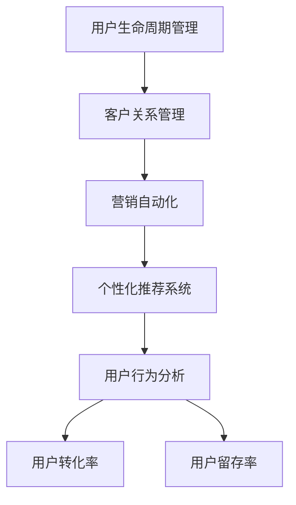

                 

# 知识付费赚钱的用户生命周期管理与营销自动化

> 关键词：知识付费, 用户生命周期管理, 营销自动化, 客户关系管理, 用户行为分析, 用户转化率, 用户留存率, 个性化推荐, 自动化营销

## 1. 背景介绍

### 1.1 问题由来

在互联网时代，知识付费成为一种快速增长的商业模式，带来了大量收益。然而，如何管理好用户生命周期，实现有效转化和留存，成为知识付费平台的关键挑战。传统的客户关系管理(CRM)系统功能单一、操作繁琐，难以满足平台不断变化的需求。通过数据驱动的用户生命周期管理和营销自动化，可以有效提升用户转化率和留存率，实现平台收益最大化。

### 1.2 问题核心关键点

知识付费平台的业务痛点主要集中在以下几个方面：

- **用户增长缓慢**：平台获客成本高，新用户转化率低。
- **用户流失严重**：用户流失率高，二次购买意愿低。
- **用户粘性不足**：用户对内容更新不敏感，平台难以长期维持用户的活跃度。
- **营销效果不佳**：现有营销手段效果有限，无法精准触达目标用户。
- **数据孤岛问题**：数据分布在多个系统中，难以形成统一的用户画像，无法实现精细化管理。

这些问题阻碍了知识付费平台的健康发展，需要通过先进的技术手段进行改进。

## 2. 核心概念与联系

### 2.1 核心概念概述

为更好地理解用户生命周期管理和营销自动化的工作原理和优化方向，本节将介绍几个密切相关的核心概念：

- **用户生命周期管理(Customer Lifecycle Management, CLM)**：通过对用户行为数据进行分析，划分用户生命周期阶段，如新用户、付费用户、流失用户等，并通过个性化策略提升用户转化率和留存率。
- **客户关系管理(Customer Relationship Management, CRM)**：通过系统化手段管理客户关系，维护客户信息，实现客户全生命周期管理和营销自动化。
- **营销自动化(Marketing Automation)**：利用自动化技术对营销活动进行管理和优化，提高营销效率，降低成本。
- **个性化推荐系统**：通过分析用户行为和偏好，向用户推荐个性化的内容和服务，提升用户体验和平台粘性。
- **用户行为分析**：通过追踪和分析用户行为数据，揭示用户需求和行为规律，优化产品和服务。
- **用户转化率**：指从潜在用户转化为实际购买用户的比例，反映了平台的用户购买意愿和营销效果。
- **用户留存率**：指在一定周期内用户继续活跃在平台的比例，反映了平台对用户的吸引力。

这些核心概念之间的逻辑关系可以通过以下Mermaid流程图来展示：



这个流程图展示了几者之间的关系：

1. 用户生命周期管理通过客户关系管理系统的数据支持，细分用户群体，进行精准的个性化营销和自动化活动。
2. 营销自动化利用客户关系管理系统和个性化推荐系统的数据，自动化执行各类营销活动。
3. 用户行为分析通过客户关系管理系统和个性化推荐系统收集的数据，分析用户行为规律，为决策提供依据。
4. 用户转化率和留存率反映了用户生命周期管理和营销自动化的效果，进一步指导后续的优化策略。

这些概念共同构成了知识付费平台用户生命周期管理和营销自动化的工作框架，通过数据驱动手段提升用户管理和营销效率。

## 3. 核心算法原理 & 具体操作步骤

### 3.1 算法原理概述

用户生命周期管理和营销自动化的核心算法基于数据驱动的机器学习和统计方法。通过对用户行为数据进行分析，识别出不同生命周期阶段的特点，预测用户行为和需求，优化营销策略。具体的算法流程如下：

1. **用户划分**：根据用户行为数据，将用户划分为不同的生命周期阶段。
2. **特征提取**：提取用户行为特征，如浏览次数、购买频率、学习时长等。
3. **模型训练**：利用机器学习模型对用户特征进行分析，预测用户行为和需求。
4. **个性化推荐**：根据用户特征和行为预测，提供个性化的内容和优惠，提升用户满意度和转化率。
5. **自动化营销**：根据用户生命周期阶段，自动化执行不同营销活动，如邮件营销、社交媒体广告、短信通知等。

### 3.2 算法步骤详解

用户生命周期管理和营销自动化的算法流程包括以下几个关键步骤：

**Step 1: 数据收集与清洗**
- 从客户关系管理系统、个性化推荐系统、网站访问日志等渠道收集用户数据。
- 对数据进行去重、补全、清洗，消除噪声和异常值。

**Step 2: 用户行为建模**
- 利用数据挖掘技术对用户行为数据进行分析，划分用户生命周期阶段。
- 提取关键行为特征，如购买次数、学习时长、活跃度等。
- 利用机器学习算法（如K-Means、决策树等）进行用户行为建模。

**Step 3: 个性化推荐系统**
- 设计个性化推荐算法，如协同过滤、内容推荐、标签推荐等。
- 利用用户特征和行为数据，进行个性化推荐。
- 使用A/B测试评估推荐效果，不断优化推荐模型。

**Step 4: 自动化营销策略**
- 根据用户生命周期阶段和行为预测，设计自动化营销策略。
- 通过营销自动化工具，如Marketo、HubSpot等，实现自动化执行。
- 实时监控营销效果，根据数据反馈不断调整策略。

**Step 5: 数据监控与反馈**
- 实时监控用户生命周期管理和营销自动化的效果。
- 定期进行用户行为分析，更新用户画像和生命周期模型。
- 定期评估用户转化率和留存率，调整优化策略。

### 3.3 算法优缺点

基于数据驱动的算法在用户生命周期管理和营销自动化中具有以下优点：

1. **精准化管理**：通过数据驱动的算法，能够实现对用户的精准管理和个性化营销，提高转化率和留存率。
2. **自动化高效**：自动化执行营销活动，节省人工成本，提高效率。
3. **数据驱动决策**：依赖数据和算法进行决策，降低人工干预，提升决策的客观性和科学性。

同时，该方法也存在一定的局限性：

1. **数据质量依赖**：算法的有效性依赖于数据的质量和完整性。如果数据缺失或噪声较多，算法效果会大打折扣。
2. **模型复杂度**：复杂的机器学习模型需要大量计算资源，对系统性能要求较高。
3. **隐私问题**：收集和分析用户数据，需要严格遵守隐私法规，保护用户隐私。
4. **公平性问题**：算法可能存在偏见，影响不同用户群体的公平性。

尽管存在这些局限性，但就目前而言，基于数据驱动的算法仍是大规模用户生命周期管理和营销自动化的重要手段。未来相关研究的重点在于如何进一步降低算法对数据质量的依赖，提高模型的可解释性和公平性。

### 3.4 算法应用领域

用户生命周期管理和营销自动化技术在知识付费平台中的应用已经非常广泛，涵盖了各个环节：

- **用户获取与转化**：通过数据分析和个性化推荐，吸引潜在用户并进行转化。
- **用户留存与忠诚度提升**：通过精准的自动化营销和个性化的内容推送，提升用户留存率，增强用户粘性。
- **用户流失预警与干预**：通过实时监控和预测，及时发现用户流失风险并进行干预。
- **用户行为分析与优化**：通过用户行为数据，分析用户需求，优化产品和服务。

此外，该技术还应用于企业CRM、电商平台、社交媒体等多个领域，为实现精准营销和提升用户体验提供了有力的技术支撑。

## 4. 数学模型和公式 & 详细讲解

### 4.1 数学模型构建

本节将使用数学语言对用户生命周期管理和营销自动化的数学模型进行更加严格的刻画。

记用户生命周期划分为 $N$ 个阶段，第 $i$ 个阶段的转化率为 $c_i$，初始用户数为 $u_0$，经过 $k$ 个阶段后，转化成付费用户的数量为：

$$
u_k = u_0 \prod_{i=1}^{k} c_i
$$

根据贝叶斯网络模型，用户在不同阶段的条件概率为 $P_i|k$，其中 $P_i|k$ 表示在经过 $k$ 个阶段后，用户处于第 $i$ 阶段的条件概率。通过最大似然估计方法，可以计算出每个阶段的条件概率：

$$
P_i|k = \frac{u_i}{u_k}
$$

利用上述模型，可以对用户在不同阶段的转化概率进行预测，从而优化营销策略。

### 4.2 公式推导过程

假设用户生命周期划分为四个阶段：新用户、试用用户、付费用户、流失用户。利用上述公式，可以计算出每个阶段的转化率。

设初始用户数为 $u_0=1000$，第一阶段（新用户）的转化率为 $c_1=0.2$，第二阶段（试用用户）的转化率为 $c_2=0.3$，第三阶段（付费用户）的转化率为 $c_3=0.5$，第四阶段（流失用户）的转化率为 $c_4=0$。

根据公式计算得到：

$$
u_1 = u_0 \cdot c_1 = 1000 \cdot 0.2 = 200
$$
$$
u_2 = u_1 \cdot c_2 = 200 \cdot 0.3 = 60
$$
$$
u_3 = u_2 \cdot c_3 = 60 \cdot 0.5 = 30
$$
$$
u_4 = u_3 \cdot c_4 = 30 \cdot 0 = 0
$$

从计算结果可以看出，用户在第一阶段和新用户的转化率最高，但随着阶段数增加，转化率逐渐降低。这说明用户在试用阶段和付费阶段的流失风险较高，需要重点进行干预。

### 4.3 案例分析与讲解

假设某知识付费平台收集到历史数据，包含用户在不同阶段的转化率和流失率。利用上述模型进行预测，发现用户在试用阶段的流失率较高，且随着试用时长增加，流失风险逐渐升高。基于此，平台可以采取以下措施：

1. **提高试用体验**：改进试用界面和内容，增加试用时长，降低用户流失率。
2. **个性化推荐**：根据用户试用行为，提供个性化的推荐内容，提高用户满意度和转化率。
3. **主动干预**：在试用阶段末尾，向用户发送个性化通知和优惠，促使用户进行付费购买。

通过上述措施，平台可以有效提升用户转化率和留存率，实现商业价值最大化。

## 5. 项目实践：代码实例和详细解释说明

### 5.1 开发环境搭建

在进行用户生命周期管理和营销自动化实践前，我们需要准备好开发环境。以下是使用Python进行Scikit-learn开发的常见环境配置流程：

1. 安装Anaconda：从官网下载并安装Anaconda，用于创建独立的Python环境。

2. 创建并激活虚拟环境：
```bash
conda create -n user_lifecycle python=3.8 
conda activate user_lifecycle
```

3. 安装Scikit-learn、Numpy、Pandas等必要库：
```bash
conda install scikit-learn numpy pandas
```

4. 安装各类工具包：
```bash
pip install matplotlib seaborn jupyter notebook ipython
```

完成上述步骤后，即可在`user_lifecycle`环境中开始用户生命周期管理和营销自动化的开发。

### 5.2 源代码详细实现

下面以用户流失预警为例，给出使用Scikit-learn库进行用户行为分析和建模的Python代码实现。

首先，定义数据处理函数：

```python
import pandas as pd
from sklearn.model_selection import train_test_split
from sklearn.preprocessing import StandardScaler
from sklearn.ensemble import RandomForestClassifier

def preprocess_data(data):
    # 数据清洗和补全
    data = data.dropna()

    # 数据标准化
    data['特征1'] = StandardScaler().fit_transform(data[['特征1']])
    data['特征2'] = StandardScaler().fit_transform(data[['特征2']])

    # 特征工程
    data['流失标签'] = data['流失率'] > 0.5

    # 数据划分
    X = data.drop(['流失率'], axis=1)
    y = data['流失标签']
    X_train, X_test, y_train, y_test = train_test_split(X, y, test_size=0.2, random_state=42)

    return X_train, X_test, y_train, y_test
```

然后，定义模型训练函数：

```python
def train_model(X_train, y_train):
    # 随机森林分类器
    model = RandomForestClassifier(n_estimators=100, random_state=42)
    model.fit(X_train, y_train)

    # 输出特征重要性
    feature_importance = pd.DataFrame({'特征': X_train.columns, '重要性': model.feature_importances_})
    feature_importance = feature_importance.sort_values(by='重要性', ascending=False)
    return model, feature_importance
```

接着，定义模型评估函数：

```python
def evaluate_model(model, X_test, y_test):
    # 计算模型准确率、召回率和F1分数
    y_pred = model.predict(X_test)
    accuracy = metrics.accuracy_score(y_test, y_pred)
    recall = metrics.recall_score(y_test, y_pred)
    f1 = metrics.f1_score(y_test, y_pred)

    # 输出评估结果
    print(f'Accuracy: {accuracy:.2f}\nRecall: {recall:.2f}\nF1: {f1:.2f}')
```

最后，启动模型训练和评估流程：

```python
# 加载数据
data = pd.read_csv('user_data.csv')

# 数据预处理
X_train, X_test, y_train, y_test = preprocess_data(data)

# 模型训练
model, feature_importance = train_model(X_train, y_train)

# 模型评估
evaluate_model(model, X_test, y_test)
```

以上就是使用Scikit-learn库进行用户行为分析和建模的完整代码实现。可以看到，Scikit-learn库提供了丰富的机器学习算法和评估工具，可以方便地实现用户生命周期管理的核心功能。

### 5.3 代码解读与分析

让我们再详细解读一下关键代码的实现细节：

**preprocess_data函数**：
- `dropna`方法：去除缺失值和异常值。
- `StandardScaler`方法：对特征进行标准化处理，消除不同特征的单位差异。
- `特征工程`：将流失率转化为二分类标签，0表示未流失，1表示流失。
- `train_test_split`方法：将数据划分为训练集和测试集。

**train_model函数**：
- `RandomForestClassifier`方法：使用随机森林算法进行模型训练。
- `feature_importance`属性：输出模型的特征重要性，帮助分析特征对流失预测的影响。

**evaluate_model函数**：
- `metrics`模块：使用Scikit-learn内置的评估函数，计算模型精度、召回率和F1分数。

**训练流程**：
- `read_csv`方法：从CSV文件中加载用户数据。
- `preprocess_data`函数：对数据进行清洗和预处理。
- `train_model`函数：训练随机森林模型，输出特征重要性。
- `evaluate_model`函数：评估模型效果，输出评估指标。

这些代码展示了用户生命周期管理和营销自动化中的核心算法流程，包括数据预处理、模型训练和评估等环节。

## 6. 实际应用场景

### 6.1 智能客服系统

智能客服系统可以广泛应用于知识付费平台的用户管理和营销自动化。通过收集用户对话记录，分析用户需求和行为，实时推荐相关内容和优惠券，可以显著提升客服效率和用户满意度。

在技术实现上，可以引入自然语言处理技术，对用户对话进行情感分析和意图识别，实时生成个性化回复。同时，利用用户生命周期管理模型，根据用户当前状态和行为，提供有针对性的推荐和服务。

### 6.2 个性化推荐系统

个性化推荐系统是知识付费平台的重要功能之一。通过收集用户浏览、学习、购买等行为数据，利用机器学习算法进行分析和建模，可以为用户推荐个性化的内容和服务，提升用户体验和平台粘性。

在具体实现中，可以使用协同过滤、内容推荐、标签推荐等方法，结合用户生命周期管理模型，动态调整推荐策略，提升推荐效果。同时，利用A/B测试评估推荐模型，不断优化推荐算法。

### 6.3 用户流失预警与干预

用户流失是知识付费平台面临的重大挑战之一。通过实时监控用户行为数据，预测用户流失风险，及时进行干预，可以有效提升用户留存率。

在实践中，可以设定不同的流失预警阈值，定期进行数据采集和分析，及时发现高流失风险用户，并提供个性化的干预措施，如重新推荐课程、发送优惠券、进行电话回访等。

### 6.4 未来应用展望

随着人工智能技术的不断进步，用户生命周期管理和营销自动化将不断拓展应用场景，为知识付费平台带来更多商业价值：

1. **多渠道营销**：通过整合社交媒体、电子邮件、短信等多种营销渠道，实现多渠道触达用户，提升营销效果。
2. **个性化内容创作**：利用用户行为分析，创作个性化的视频、音频、文章等内容，提升用户粘性和满意度。
3. **智能定价策略**：通过用户生命周期管理和行为分析，制定差异化的定价策略，提升用户购买意愿和平台收益。
4. **用户体验优化**：结合用户行为数据和反馈，不断优化平台界面和功能，提升用户体验。
5. **客户服务升级**：通过智能客服和个性化推荐，提升客户服务质量，增强用户忠诚度。

## 7. 工具和资源推荐

### 7.1 学习资源推荐

为了帮助开发者系统掌握用户生命周期管理和营销自动化的理论基础和实践技巧，这里推荐一些优质的学习资源：

1. **《用户生命周期管理》系列博文**：由大模型技术专家撰写，深入浅出地介绍了用户生命周期管理的核心概念和实际应用。

2. **Coursera《数据科学与统计》课程**：约翰霍普金斯大学开设的统计学课程，涵盖数据分析和机器学习的基本知识，适合入门学习。

3. **《Python数据分析实战》书籍**：介绍如何使用Python进行数据清洗、分析和建模，结合实际案例，适合实战练习。

4. **Kaggle平台**：提供大量用户行为数据集和竞赛任务，通过实践学习用户生命周期管理和营销自动化方法。

5. **《用户行为分析与挖掘》书籍**：深入介绍用户行为分析和挖掘技术，涵盖数据预处理、特征工程、模型训练等全流程。

通过对这些资源的学习实践，相信你一定能够快速掌握用户生命周期管理和营销自动化的精髓，并用于解决实际的NLP问题。

### 7.2 开发工具推荐

高效的开发离不开优秀的工具支持。以下是几款用于用户生命周期管理和营销自动化开发的常用工具：

1. Python：Python是目前最流行的数据分析和机器学习工具，拥有丰富的库和框架。
2. Scikit-learn：Python的机器学习库，提供各种经典算法的实现。
3. Pandas：Python的数据处理库，支持数据清洗、转换和分析。
4. Jupyter Notebook：Python的数据分析和机器学习开发环境，支持代码展示和交互式计算。
5. Tableau：数据可视化工具，支持多维度数据分析和图表展示。

合理利用这些工具，可以显著提升用户生命周期管理和营销自动化的开发效率，加快创新迭代的步伐。

### 7.3 相关论文推荐

用户生命周期管理和营销自动化的发展源于学界的持续研究。以下是几篇奠基性的相关论文，推荐阅读：

1. **User Lifecycle Management with Machine Learning**：介绍机器学习在用户生命周期管理中的应用，涵盖数据预处理、模型训练和评估等环节。

2. **Customer Relationship Management: A Practical Approach**：详细介绍客户关系管理系统的设计和实现，涵盖CRM系统的各个模块。

3. **Marketing Automation: A Strategic Approach**：从营销自动化系统的角度，介绍如何利用自动化技术优化营销活动，提升营销效率。

4. **Personalized Recommendation Systems**：介绍个性化推荐系统的理论基础和实现方法，涵盖协同过滤、内容推荐、标签推荐等算法。

5. **User Behavior Prediction with Deep Learning**：介绍使用深度学习进行用户行为预测的方法，涵盖神经网络、卷积神经网络、循环神经网络等模型。

这些论文代表了大规模用户生命周期管理和营销自动化的发展脉络。通过学习这些前沿成果，可以帮助研究者把握学科前进方向，激发更多的创新灵感。

## 8. 总结：未来发展趋势与挑战

### 8.1 总结

本文对用户生命周期管理和营销自动化的核心算法和操作步骤进行了全面系统的介绍。首先阐述了用户生命周期管理和营销自动化的研究背景和意义，明确了其在大规模知识付费平台中的应用价值。其次，从原理到实践，详细讲解了用户生命周期管理的数学模型和关键步骤，给出了用户生命周期管理的完整代码实例。同时，本文还广泛探讨了用户生命周期管理和营销自动化的实际应用场景，展示了其在知识付费平台中的巨大潜力。

通过本文的系统梳理，可以看到，用户生命周期管理和营销自动化技术在知识付费平台中的应用已经初具规模，为平台带来了显著的商业价值。未来，伴随技术的不断进步和应用场景的不断拓展，用户生命周期管理和营销自动化必将成为知识付费平台的重要竞争力，为平台持续增长和商业成功提供有力保障。

### 8.2 未来发展趋势

展望未来，用户生命周期管理和营销自动化技术将呈现以下几个发展趋势：

1. **智能化水平提升**：利用更高级的机器学习算法和大规模数据，提高用户生命周期管理模型的准确性和智能化水平。
2. **多渠道融合**：整合多渠道数据，实现全渠道用户行为分析，提升营销效果。
3. **数据隐私保护**：在数据收集和分析过程中，加强数据隐私保护，确保用户信息安全。
4. **用户体验优化**：利用用户生命周期管理和个性化推荐系统，优化用户界面和交互体验，提升用户体验。
5. **实时化处理**：实现实时数据采集和分析，及时发现用户流失风险并进行干预。
6. **自动化程度提升**：提高营销自动化的自动化水平，降低人工干预，提升营销效率。

以上趋势凸显了用户生命周期管理和营销自动化的广阔前景。这些方向的探索发展，必将进一步提升知识付费平台的运营效率和用户管理水平，为平台带来更大的商业价值。

### 8.3 面临的挑战

尽管用户生命周期管理和营销自动化技术已经取得了一定进展，但在迈向更加智能化、普适化应用的过程中，仍面临诸多挑战：

1. **数据隐私问题**：用户行为数据的收集和分析需要严格遵守隐私法规，保护用户隐私。
2. **算法复杂度**：高级算法需要大量计算资源，对系统性能要求较高。
3. **数据质量问题**：数据质量对模型效果有重要影响，需要高质量的数据源。
4. **模型公平性**：算法可能存在偏见，影响不同用户群体的公平性。
5. **实时性要求**：需要实时处理和分析数据，对系统架构和存储要求较高。

尽管存在这些挑战，但通过不断优化算法和提升系统性能，用户生命周期管理和营销自动化必将在知识付费平台中发挥更大的作用，推动平台商业价值最大化。

### 8.4 研究展望

面对用户生命周期管理和营销自动化所面临的挑战，未来的研究需要在以下几个方面寻求新的突破：

1. **模型可解释性提升**：开发更易于解释和理解的用户生命周期管理模型，提升模型的可信度和应用价值。
2. **数据隐私保护**：开发更加安全的数据保护技术，确保用户信息不被滥用。
3. **自动化技术优化**：优化营销自动化的算法和流程，提高自动化执行的效率和效果。
4. **跨平台协同**：实现不同平台和渠道之间的数据整合和共享，提升全渠道用户管理能力。
5. **多模态数据分析**：结合文本、语音、图像等多种模态数据，进行综合分析和建模。
6. **用户需求预测**：利用深度学习和因果推断技术，预测用户需求和行为，提升推荐效果。

这些研究方向的探索，必将引领用户生命周期管理和营销自动化的技术发展，推动知识付费平台向更加智能化、普适化方向迈进。

## 9. 附录：常见问题与解答

**Q1：如何判断用户流失风险？**

A: 利用用户行为数据，通过建模预测用户流失概率。常见的方法包括随机森林、逻辑回归、神经网络等。根据预测结果，设定不同的流失预警阈值，及时进行干预。

**Q2：用户行为数据如何收集和处理？**

A: 用户行为数据可以从网站访问日志、用户操作记录、购买记录等多个渠道收集。收集到的数据需要进行清洗和补全，消除噪声和异常值，再进行标准化和特征工程处理，提取有用的特征。

**Q3：用户行为分析的目的是什么？**

A: 用户行为分析的目的是通过追踪和分析用户行为数据，揭示用户需求和行为规律，优化产品和服务。利用用户行为数据，可以制定更加精准的营销策略，提升用户体验和平台收益。

**Q4：用户生命周期管理的核心是什么？**

A: 用户生命周期管理的核心是通过数据分析和建模，划分用户生命周期阶段，并针对不同阶段进行个性化营销和干预。核心步骤包括数据收集、预处理、建模、推荐和自动化执行。

**Q5：如何优化用户生命周期管理模型？**

A: 通过不断收集和分析用户行为数据，更新用户生命周期模型，提升模型的准确性和适应性。同时，利用A/B测试等方法评估模型效果，不断优化算法和策略。

这些问题的解答，可以帮助你更好地理解用户生命周期管理和营销自动化的核心概念和实现细节，提升你的实际应用能力。

---

作者：禅与计算机程序设计艺术 / Zen and the Art of Computer Programming

