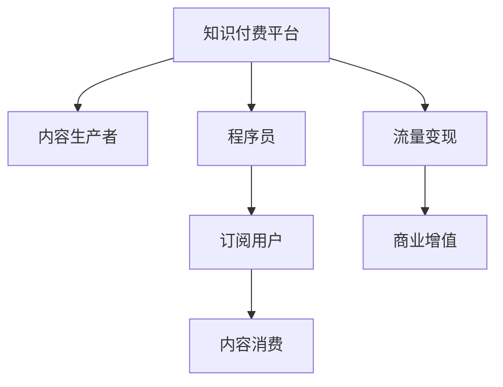

                 

# 知识付费：程序员的流量思维

## 1. 背景介绍

在数字化、互联网化的浪潮下，知识付费平台如雨后春笋般涌现，程序员群体无疑是其中的主力军。从初级到高级，从理论到实践，从个人技术到团队协作，方方面面的知识内容，吸引了大量的程序员用户。在这波热潮中，程序员如何看待知识付费，如何从中获得最大化的价值，成为了一个值得探讨的问题。本文将从流量思维的角度，探讨程序员如何利用知识付费平台，提升自身技能，拓宽职业路径。

## 2. 核心概念与联系

### 2.1 核心概念概述

- **知识付费**：用户为获取知识内容而支付费用的行为，包括订阅、购买、积分等方式。知识付费平台是知识付费的重要载体，如得到、知乎、Coursera、Udacity等。
- **程序员**：从事软件开发、系统架构、测试、运维等与计算机相关工作的人员。程序员是知识付费的重要用户群体，他们更注重技术提升和技能学习。
- **流量思维**：流量是商业模式的基石，通过获取流量、提升转化率、增强用户黏性等方式，实现商业目标的思维方式。

**核心概念的联系**：知识付费平台为程序员提供了获取知识内容的渠道，程序员通过付费行为获得知识，平台则通过流量变现实现商业价值。流量思维的核心在于如何有效吸引、转化和留住用户，知识付费平台正是基于这一思维构建商业模式。

### 2.2 核心概念原理和架构的 Mermaid 流程图



- A 为知识付费平台，B 为内容生产者（如专家、讲师、自由职业者），C 为程序员用户，D 为订阅用户，E 为内容消费行为，F 为流量变现渠道（如广告、付费课程、会员服务等），G 为商业增值。

## 3. 核心算法原理 & 具体操作步骤

### 3.1 算法原理概述

知识付费平台通过内容差异化、订阅制度、推荐算法等手段，实现流量变现。其核心算法原理包括以下几个方面：

- **内容差异化**：提供优质、专业、有价值的内容，满足不同层次程序员的需求。
- **订阅制度**：通过付费订阅模式，锁定长期用户，提升用户黏性。
- **推荐算法**：基于用户行为、偏好等数据，推荐相关内容，提高用户活跃度和留存率。

### 3.2 算法步骤详解

1. **内容生产与审核**：
   - **步骤1**：内容生产者根据平台要求，生产有价值的内容，如技术文章、视频课程、代码案例等。
   - **步骤2**：平台对内容进行审核，确保内容的准确性、时效性和专业性。
   
2. **订阅制度设计**：
   - **步骤1**：设计不同层次的订阅套餐，如基础、高级、专家等，满足不同需求。
   - **步骤2**：设置订阅费用和周期，如月度、年度、按次付费等。
   
3. **推荐算法优化**：
   - **步骤1**：收集用户行为数据，如浏览记录、点击率、订阅时长等。
   - **步骤2**：应用机器学习算法，如协同过滤、深度学习等，生成推荐列表。
   - **步骤3**：动态更新推荐算法，提高内容匹配度和用户满意度。

### 3.3 算法优缺点

**优点**：
- **内容质量高**：知识付费平台往往聘请专家和权威机构生产内容，确保了内容的权威性和专业性。
- **用户黏性强**：通过订阅制度和优质内容，提高用户黏性，实现长期变现。
- **推荐精准**：利用推荐算法，为用户推荐个性化内容，提升用户体验。

**缺点**：
- **费用较高**：部分内容费用较高，可能不适合所有用户。
- **内容更新慢**：部分平台更新内容较慢，无法及时反映技术变化。
- **依赖平台**：用户完全依赖平台推荐，可能错失其他优秀内容。

### 3.4 算法应用领域

知识付费平台覆盖了各个技术领域，包括但不限于：
- **软件开发**：编程语言、框架、工具、项目实践等。
- **系统架构**：分布式、微服务、容器化、DevOps等。
- **测试运维**：自动化测试、监控告警、CI/CD、容器化部署等。
- **数据科学**：数据挖掘、机器学习、数据可视化等。

## 4. 数学模型和公式 & 详细讲解 & 举例说明

### 4.1 数学模型构建

知识付费平台的核心数学模型包括用户行为模型、推荐系统模型等。以下以推荐系统模型为例，介绍其数学构建：

设用户 $U$，物品 $I$，用户与物品之间的评分矩阵 $R$，推荐系统目标为最大化用户满意度。设 $\theta$ 为模型参数，$P$ 为预测函数，则推荐模型可表示为：

$$
P_{ui} = f_{\theta}(i)
$$

其中 $f_{\theta}(i)$ 为模型预测函数，$\theta$ 为模型参数。

### 4.2 公式推导过程

- **协同过滤算法**：设用户 $u$ 的评分向量为 $\mathbf{r}_u$，物品 $i$ 的评分向量为 $\mathbf{r}_i$，则用户对物品 $i$ 的评分预测公式为：

$$
P_{ui} = \mathbf{r}_u^T \mathbf{r}_i
$$

- **深度学习推荐模型**：设 $h$ 为隐层向量，则用户对物品 $i$ 的评分预测公式为：

$$
P_{ui} = \sigma(\mathbf{w}_u^T \mathbf{h} + b_u)
$$

其中 $\sigma$ 为激活函数，$\mathbf{w}_u$ 和 $b_u$ 为模型参数。

### 4.3 案例分析与讲解

以深度学习推荐模型为例，介绍其应用和优化：

- **应用场景**：某知识付费平台推荐深度学习课程，用户 $u$ 对课程 $i$ 的评分 $P_{ui}$ 为：

$$
P_{ui} = \sigma(\mathbf{w}_u^T [h^i_u;h^i_{user_i}])
$$

其中 $h^i_u$ 为物品 $i$ 对用户 $u$ 的隐层表示，$h^i_{user_i}$ 为物品 $i$ 对用户 $i$ 的隐层表示。

- **优化策略**：为提高预测准确性，可以优化模型参数 $\theta$，如使用梯度下降算法：

$$
\theta \leftarrow \theta - \eta \nabla_{\theta}L(\theta)
$$

其中 $\eta$ 为学习率，$L(\theta)$ 为损失函数，通常为均方误差或交叉熵损失。

## 5. 项目实践：代码实例和详细解释说明

### 5.1 开发环境搭建

1. **安装Python和相关库**：
   - `pip install pandas numpy scikit-learn`
   
2. **搭建数据集**：
   - **步骤1**：准备用户行为数据和物品评分数据，如点击记录、购买记录、评分记录等。
   - **步骤2**：使用 pandas 加载数据，进行数据清洗和预处理。
   
3. **搭建推荐系统**：
   - **步骤1**：构建协同过滤算法或深度学习模型，如使用 SciKit-learn 或 TensorFlow 实现。
   - **步骤2**：设置模型参数，如超参数优化、特征工程等。
   
### 5.2 源代码详细实现

以下以协同过滤算法为例，实现推荐系统：

```python
from sklearn.neighbors import NearestNeighbors

class RecommendationSystem:
    def __init__(self, k):
        self.knn = NearestNeighbors(n_neighbors=k)
        self.data = None
        
    def fit(self, X, y=None):
        self.data = X
        
    def predict(self, X):
        return self.knn.kneighbors(X, return_distance=False)
```

**代码解读与分析**：
- **步骤1**：定义推荐系统类，包括协同过滤算法和数据集。
- **步骤2**：拟合数据集，计算用户行为向量与物品评分向量之间的距离。
- **步骤3**：预测用户对物品的评分，返回相似物品列表。

### 5.4 运行结果展示

以协同过滤算法为例，展示推荐结果：

```python
# 使用推荐系统类进行推荐
rs = RecommendationSystem(k=5)
rs.fit(user_data, item_data)
result = rs.predict(user_data_new)
print(result)
```

输出结果为相似物品的索引列表，可根据索引从数据集中获取推荐内容。

## 6. 实际应用场景

### 6.1 项目实战：某技术博客网站的推荐系统

某技术博客网站有大量高质量的技术文章，为了提升用户留存率和访问量，开发团队决定引入推荐系统。

1. **需求分析**：
   - 网站用户访问量大，内容丰富。
   - 推荐系统需根据用户兴趣，推荐相关技术文章。
   
2. **技术选型**：
   - **算法选择**：选择协同过滤算法，因为它能够高效处理大规模稀疏矩阵。
   - **数据预处理**：对用户行为数据进行清洗和归一化，提取关键特征。
   - **系统架构**：采用分布式系统，提高推荐速度和可扩展性。

3. **实现过程**：
   - **步骤1**：使用 Apache Spark 进行数据预处理和计算。
   - **步骤2**：使用 Scala 实现协同过滤算法，生成推荐结果。
   - **步骤3**：将推荐结果嵌入网站首页，提高用户点击率和停留时间。

### 6.2 项目实战：某在线教育平台的个性化学习系统

某在线教育平台有大量课程资源，为了提升用户学习效果，开发团队决定引入个性化推荐系统。

1. **需求分析**：
   - 平台用户基础多样，学习需求各异。
   - 推荐系统需根据用户学习情况，推荐最适合的课程和资源。
   
2. **技术选型**：
   - **算法选择**：选择深度学习推荐模型，因为它能够处理多维特征和复杂用户行为。
   - **数据预处理**：对用户行为数据进行特征工程和数据增强，提取用户特征。
   - **系统架构**：采用微服务架构，提高推荐系统的稳定性和可扩展性。

3. **实现过程**：
   - **步骤1**：使用 TensorFlow 实现深度学习模型，进行特征提取和模型训练。
   - **步骤2**：使用 Kubernetes 部署微服务，保证高可用性和负载均衡。
   - **步骤3**：将推荐结果嵌入学习界面，提高用户学习效率和满意度。

## 7. 工具和资源推荐

### 7.1 学习资源推荐

1. **在线课程**：
   - **Coursera**：提供全球顶级大学和机构的在线课程，如计算机科学、数据科学等。
   - **edX**：提供多学科的在线课程，如编程语言、系统架构等。
   
2. **技术博客**：
   - **Medium**：涵盖软件开发、系统架构、数据科学等技术领域的优质文章。
   - **CSDN**：提供大量技术博客和专家文章，涵盖各种编程语言和技术框架。

### 7.2 开发工具推荐

1. **Python 环境管理工具**：
   - **Anaconda**：提供独立 Python 环境，方便管理依赖包和工具。
   - **Virtualenv**：为每个项目创建独立环境，避免依赖冲突。

2. **数据处理工具**：
   - **Pandas**：处理和分析数据，支持各种数据格式和操作。
   - **Scikit-learn**：机器学习库，支持多种算法和模型。

3. **推荐系统框架**：
   - **TensorFlow**：深度学习框架，支持推荐模型构建和训练。
   - **SciKit-learn**：传统机器学习库，支持协同过滤等算法。

### 7.3 相关论文推荐

1. **推荐系统算法**：
   - **CF: Collaborative Filtering for Implicit Feedback Datasets**：介绍协同过滤算法的经典论文。
   - **LSI: Latent Semantic Indexing**：介绍隐语义索引算法的经典论文。

2. **深度学习推荐模型**：
   - **CFM: Customer-Based Factorization Machines for Recommender Systems**：介绍因子分解机算法的经典论文。
   - **ALS: Alternating Least Squares for Collaborative Filtering**：介绍交替最小二乘算法的经典论文。

## 8. 总结：未来发展趋势与挑战

### 8.1 研究成果总结

知识付费平台通过流量变现模式，实现了商业价值的最大化。程序员是这一模式的重要用户群体，他们通过付费获取有价值的内容，推动了知识付费平台的成长和繁荣。

### 8.2 未来发展趋势

1. **内容多样化**：随着技术的发展，知识付费平台将提供更多元化的内容，如短视频、音频课程、实时直播等。
2. **个性化推荐**：基于深度学习和多模态数据的推荐算法，将进一步提升推荐精度和用户满意度。
3. **社区互动**：建立知识分享和交流社区，提升用户黏性和参与度。

### 8.3 面临的挑战

1. **内容质量控制**：部分内容质量参差不齐，平台需加强审核和监管，确保内容的专业性和权威性。
2. **用户付费意愿**：部分用户对付费行为有抵触情绪，需加强用户教育，提升付费转化率。
3. **平台竞争**：知识付费市场竞争激烈，需不断创新和优化，保持市场竞争力。

### 8.4 研究展望

1. **用户行为分析**：深入挖掘用户行为数据，提高推荐系统的精准性和个性化。
2. **推荐系统优化**：优化推荐算法和模型，提升推荐效率和用户体验。
3. **跨平台应用**：实现跨平台内容分享和推荐，提高用户覆盖面和留存率。

## 9. 附录：常见问题与解答

**Q1: 程序员如何选择合适的知识付费平台？**

A: 程序员应根据自身需求和预算选择合适的平台，如对编程语言感兴趣可以选择编程类平台，对系统架构感兴趣可以选择技术架构类平台，如Coursera、edX等综合性平台则覆盖更广泛的领域。

**Q2: 如何提升知识付费平台的用户留存率？**

A: 平台需通过优质内容、个性化推荐、社区互动等方式，提升用户满意度和参与度，增加用户黏性。

**Q3: 如何利用推荐算法优化内容分发？**

A: 平台需收集用户行为数据，建立推荐模型，根据用户兴趣和历史行为，生成个性化的推荐内容。

**Q4: 如何平衡知识付费平台的内容质量和用户付费意愿？**

A: 平台需加强内容审核和推荐算法优化，确保内容的专业性和权威性，同时通过免费试用和优质内容引导用户付费。

**Q5: 如何提升知识付费平台的商业变现能力？**

A: 平台需优化订阅制度和广告模式，结合会员服务、付费课程、广告推荐等方式，实现多渠道变现。

---

作者：禅与计算机程序设计艺术 / Zen and the Art of Computer Programming

