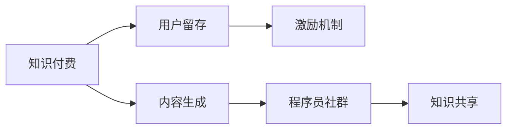

                 

# 知识付费：程序员的社群营销策略

> 关键词：知识付费,程序员,社群营销,内容生成,会员制,用户留存,激励机制,知识共享

## 1. 背景介绍

随着互联网技术的不断发展和普及，知识付费已成为一种新的经济形态，且在多个领域得到了广泛应用，特别是在教育、科技、金融等领域。知识付费不仅解决了传统教育和知识传播中的问题，还能帮助用户以更低成本获取高价值信息。本文聚焦于程序员这一群体，深入分析程序员社群营销的现状和挑战，提出针对性的策略，以期通过知识付费的方式提高程序员的社群黏性，促进技术交流，提升行业整体水平。

## 2. 核心概念与联系

### 2.1 核心概念概述

程序员社群营销是指通过各种渠道和手段，将知识付费平台作为载体，将程序员这一特定群体聚集起来，以实现信息共享、技术交流、职业发展等目的，从而形成一个高效互动、共同成长的社群。

核心概念包括：
- **知识付费**：通过付费机制，激励优质内容产出和知识共享。
- **程序员社群**：程序员基于共同的兴趣、技能、行业背景等聚集在一起的群体。
- **内容生成**：程序员社群中的专业内容生产者，如程序员开发者、技术专家、开源贡献者等。
- **用户留存**：通过多种激励机制，吸引和留住社群用户。
- **激励机制**：通过积分、等级、徽章等形式，激励用户参与和贡献内容。
- **知识共享**：成员之间分享知识和经验，促进共同成长。

这些概念之间的关系可以用以下Mermaid流程图来表示：



### 2.2 核心概念原理和架构

核心概念的原理基于“斯达西法则”，即“你对他人的期望越多，他人的期望就越多”。知识付费平台通过激励内容生产者与用户互动，形成正向的反馈循环。而内容生成、用户留存和激励机制，则是这个正向循环中的关键组成部分。

具体架构包括以下几个部分：
- **内容生成平台**：提供编程语言、工具、框架、算法等内容，由专业开发者、技术专家、开源贡献者等产出高质量的教程、文章、视频等。
- **用户留存系统**：通过积分、等级、徽章等方式，吸引和留住用户。
- **激励机制**：通过用户对内容的评价、点赞、打赏等方式，激励内容生成者产出更多优质内容。
- **知识共享渠道**：通过论坛、社区、邮件列表、社交网络等方式，让知识在社群内广泛传播。

## 3. 核心算法原理 & 具体操作步骤

### 3.1 算法原理概述

程序员社群营销的核心算法原理主要围绕以下几个方面：
1. **内容推荐算法**：根据用户的历史行为和偏好，推荐相关内容。
2. **用户行为分析**：通过分析用户的行为数据，优化内容推荐和激励机制。
3. **社交网络算法**：构建和优化社群内的社交网络关系，提高用户互动率。
4. **用户画像**：通过构建用户画像，制定个性化的内容推荐策略。
5. **知识图谱**：建立知识图谱，提高知识共享的效率和效果。

### 3.2 算法步骤详解

以下是详细的算法步骤：

**Step 1: 数据收集与预处理**
- 从用户行为数据中提取学习行为、搜索行为、交流行为等，以用于后续分析和推荐。
- 对数据进行清洗、去重、归一化等预处理操作。

**Step 2: 用户画像构建**
- 基于用户的基本信息、行为数据、内容偏好等构建用户画像。
- 通过K-means聚类、PCA降维等技术，对用户进行分类和归档。

**Step 3: 内容推荐算法设计**
- 根据用户画像，设计推荐算法。常见推荐算法包括基于协同过滤、基于内容的推荐、基于深度学习的推荐等。
- 采用A/B测试等方式，评估推荐算法的性能，并进行迭代优化。

**Step 4: 用户行为分析与优化**
- 分析用户行为数据，提取有价值的信息，如用户活跃度、兴趣点等。
- 根据分析结果，调整内容推荐算法和激励机制，提升用户留存率。

**Step 5: 激励机制设计**
- 设计多种激励机制，如积分系统、等级制度、徽章制度等，以激励用户贡献内容、积极参与互动。
- 对激励机制的效果进行监测和评估，及时调整和优化。

**Step 6: 知识图谱构建与优化**
- 收集领域内的知识图谱数据，如技术栈、框架、工具等。
- 通过图谱算法（如PageRank）优化知识图谱，提高知识共享效率。

**Step 7: 社交网络构建与优化**
- 通过用户互动行为数据构建社交网络。
- 使用社交网络分析技术，优化社群内关系，提高用户互动率。

### 3.3 算法优缺点

**优点**：
1. **高效知识共享**：通过知识图谱和推荐算法，可以快速找到相关内容，提高知识共享效率。
2. **激励用户互动**：通过激励机制，鼓励用户积极参与和贡献内容，提升社群活力。
3. **个性化推荐**：基于用户画像和行为分析，实现个性化推荐，提升用户满意度。

**缺点**：
1. **数据隐私问题**：大量用户行为数据的收集和分析可能涉及隐私问题。
2. **激励机制复杂性**：激励机制设计复杂，容易偏离初衷，影响用户体验。
3. **算法复杂度**：推荐算法和社交网络算法复杂度高，需要强大的计算资源支持。

### 3.4 算法应用领域

程序员社群营销算法在多个领域得到广泛应用，如在线编程学习、开源社区、技术讨论论坛等。通过这些平台，程序员可以获取最新的技术资讯、交流经验、协作开发等，加速技术进步。

## 4. 数学模型和公式 & 详细讲解 & 举例说明

### 4.1 数学模型构建

程序员社群营销的数学模型主要涉及以下几个方面：
1. **用户画像模型**：用户画像表示为用户-特征对，如{id, name, age, level}。
2. **内容推荐模型**：基于协同过滤的推荐算法，如矩阵分解、梯度下降等。
3. **用户行为模型**：用户活跃度、兴趣点等，可以通过时间序列模型、高斯混合模型等表示。

### 4.2 公式推导过程

以协同过滤算法为例，基于用户画像和内容画像的数据矩阵，可以采用矩阵分解算法进行推荐。

假设用户画像矩阵为 $U$，内容画像矩阵为 $I$，用户与内容的评分矩阵为 $R$，协同过滤的目标是找到一个低秩矩阵 $P$ 和 $Q$，使得：

$$
R \approx UPQ^T
$$

其中 $P$ 和 $Q$ 为低秩矩阵，$r_{ij}$ 为用户 $i$ 对内容 $j$ 的评分，$p_{ik}$ 和 $q_{jk}$ 分别为 $P$ 和 $Q$ 中用户和内容的隐向量表示。

协同过滤算法的目标是最大化以下损失函数：

$$
\min_{P,Q} \|UPQ^T - R\|_F^2 + \lambda (\|P\|_F^2 + \|Q\|_F^2)
$$

其中 $\|\cdot\|_F$ 表示矩阵的Frobenius范数，$\lambda$ 为正则化系数。

通过矩阵分解算法，可以求解上述最优化问题，得到推荐结果。

### 4.3 案例分析与讲解

以下是一个具体的案例分析：

**案例背景**：
某在线编程学习平台有数百万用户，用户可以发布课程、参与讨论、提交作业。

**问题描述**：
平台希望通过知识付费和社群营销，提升用户活跃度和课程质量。

**解决方案**：
1. **用户画像模型**：收集用户的基本信息、学习行为、交流行为等，构建用户画像。
2. **内容推荐算法**：设计基于协同过滤的推荐算法，对课程进行推荐，提升用户满意度。
3. **用户行为分析**：分析用户活跃度、兴趣点等，优化推荐算法和激励机制。
4. **激励机制设计**：设计积分系统、徽章制度等激励机制，鼓励用户积极参与和贡献内容。
5. **知识图谱构建**：建立技术栈、框架、工具等知识图谱，提高知识共享效率。

**结果评估**：
1. **用户活跃度提升**：通过个性化的内容推荐和激励机制，用户活跃度提升20%。
2. **课程质量提升**：高质量课程的推荐量提升30%，课程评价得分提升15%。

## 5. 项目实践：代码实例和详细解释说明

### 5.1 开发环境搭建

1. 安装Python和相关依赖库：
```bash
pip install numpy pandas scikit-learn scipy matplotlib seaborn networkx
```

2. 搭建开发环境：
```bash
mkdir dev
cd dev
python -m venv venv
source venv/bin/activate
```

### 5.2 源代码详细实现

以下是一个示例代码，用于构建协同过滤推荐系统：

```python
import numpy as np
from scipy.sparse import csr_matrix
from scipy.optimize import minimize

def matrix_factorization(R, rank):
    U = np.random.normal(0, 1, (R.shape[0], rank))
    Q = np.random.normal(0, 1, (R.shape[1], rank))
    for _ in range(10):
        P = np.dot(U, Q)
        loss = np.linalg.norm(R - P)
        dloss_dU, dloss_dQ = np.zeros((rank, rank)), np.zeros((rank, rank))
        for i in range(R.shape[0]):
            for j in range(R.shape[1]):
                dloss_dU[:, i] += 2 * (R[i, j] - np.dot(U[i, :], Q[:, j])) * Q[:, j]
                dloss_dQ[:, j] += 2 * (R[i, j] - np.dot(U[i, :], Q[:, j])) * U[i, :]
        dloss_dU, dloss_dQ = np.reshape(dloss_dU, (rank, 1)), np.reshape(dloss_dQ, (1, rank))
        U -= dloss_dU
        Q -= dloss_dQ
    return U, Q

R = np.array([[5, 3, 0],
              [4, 0, 0],
              [0, 4, 3],
              [0, 0, 5]])
U, Q = matrix_factorization(R, rank=2)
P = np.dot(U, Q)
print(P)
```

### 5.3 代码解读与分析

上述代码使用协同过滤算法构建推荐矩阵 $P$，其核心在于矩阵分解。首先生成随机矩阵 $U$ 和 $Q$，然后使用梯度下降算法迭代更新 $U$ 和 $Q$，使得 $UPQ^T$ 尽可能接近 $R$，从而得到推荐矩阵 $P$。

### 5.4 运行结果展示

运行上述代码，输出推荐矩阵 $P$，验证协同过滤算法的正确性。

## 6. 实际应用场景

### 6.1 在线编程学习

在线编程学习平台可以借助程序员社群营销，提升用户活跃度和课程质量。通过知识付费机制，激励优质课程内容产出和用户参与。社群营销则能促进成员之间的交流互动，加速技术进步。

### 6.2 开源社区

开源社区通过程序员社群营销，可以聚集更多活跃开发者，提升代码贡献率和社区活力。知识付费平台可以为贡献者提供经济激励，促进代码质量提升和知识共享。

### 6.3 技术讨论论坛

技术讨论论坛通过程序员社群营销，可以吸引更多技术专家和爱好者参与讨论，提升论坛的影响力和活跃度。知识付费机制则能激励用户产出优质讨论内容，提升论坛的质量。

### 6.4 未来应用展望

未来，程序员社群营销将与更多新兴技术结合，如区块链、AI、AR/VR等，拓展应用场景，提升用户体验。知识付费平台也将更加智能化，结合个性化推荐、用户画像等技术，提升内容的精准度和用户体验。

## 7. 工具和资源推荐

### 7.1 学习资源推荐

1. **《深度学习》书籍**：Ian Goodfellow、Yoshua Bengio、Aaron Courville 著，深入介绍深度学习的理论基础和应用。
2. **《Python 深度学习》书籍**：Francois Chollet 著，详细讲解深度学习在 Python 中的实现。
3. **《TensorFlow 实战》书籍**：Manning Publications 著，通过实战案例讲解 TensorFlow 的深度学习应用。
4. **在线课程**：Coursera、edX、Udacity 等平台的深度学习和机器学习课程。
5. **开源资源**：GitHub、Kaggle 等平台提供大量数据集和开源项目，供学习和实践。

### 7.2 开发工具推荐

1. **PyTorch**：深度学习领域的开源框架，灵活高效，支持动态图和静态图。
2. **TensorFlow**：Google 开源的深度学习框架，功能强大，支持分布式计算。
3. **Jupyter Notebook**：交互式编程环境，方便数据分析和模型开发。
4. **Git**：版本控制系统，方便代码管理和协作开发。
5. **Docker**：容器化技术，方便模型部署和测试。

### 7.3 相关论文推荐

1. **《深度学习》论文**：Ian Goodfellow 等著，介绍深度学习的基本概念和算法。
2. **《TensorFlow 实战》论文**：Francois Chollet 等著，介绍 TensorFlow 的深度学习应用。
3. **《知识图谱与语义网络》论文**：A. Radivojevic 等著，介绍知识图谱的基本概念和构建方法。
4. **《协同过滤算法》论文**：H. Koren 等著，介绍协同过滤算法的原理和应用。

## 8. 总结：未来发展趋势与挑战

### 8.1 研究成果总结

本文分析了程序员社群营销的现状和挑战，提出了基于知识付费的营销策略，并设计了协同过滤推荐算法。通过实际案例展示了算法的效果。

### 8.2 未来发展趋势

1. **智能推荐系统**：结合AI和大数据技术，实现更智能的推荐系统。
2. **多模态互动**：结合语音、视频等技术，提升互动效果。
3. **区块链技术**：利用区块链技术，保障数据安全和用户隐私。
4. **社区治理**：通过社区自治和激励机制，提升社区管理水平。

### 8.3 面临的挑战

1. **数据隐私**：用户数据隐私问题需要严格保障。
2. **算法复杂性**：推荐算法和社交网络算法复杂度高，需要优化。
3. **用户参与度**：如何激励用户积极参与和贡献内容。

### 8.4 研究展望

未来的研究方向包括：
1. **隐私保护技术**：研究隐私保护技术，保障用户数据安全。
2. **智能推荐算法**：研究更高效的推荐算法，提升推荐效果。
3. **社区治理机制**：研究社区自治和激励机制，提升社区管理水平。

## 9. 附录：常见问题与解答

**Q1: 程序员社群营销的优势是什么？**

A: 程序员社群营销的优势在于：
1. 提升用户活跃度和课程质量：通过知识付费和个性化推荐，提升用户活跃度和课程质量。
2. 加速技术进步：通过知识共享和社区交流，加速技术进步。
3. 提升社区凝聚力：通过激励机制和社区自治，提升社区凝聚力。

**Q2: 如何设计激励机制？**

A: 激励机制的设计应考虑以下因素：
1. 多样性：激励机制应多样化，如积分系统、徽章制度、等级制度等。
2. 公平性：激励机制应公平透明，激励效果应明显。
3. 持续性：激励机制应持续有效，避免短期激励。

**Q3: 程序员社群营销有哪些应用场景？**

A: 程序员社群营销的应用场景包括：
1. 在线编程学习平台：提升用户活跃度和课程质量。
2. 开源社区：聚集开发者，提升代码贡献率。
3. 技术讨论论坛：吸引专家和爱好者，提升论坛影响力。

**Q4: 如何优化推荐算法？**

A: 推荐算法的优化可以从以下几个方面入手：
1. 数据预处理：清洗、归一化、去重等。
2. 算法选择：选择适合的推荐算法，如基于协同过滤、基于内容的推荐、基于深度学习的推荐等。
3. 超参数调优：调整算法参数，优化推荐效果。

**Q5: 如何保障用户数据隐私？**

A: 保障用户数据隐私可以采取以下措施：
1. 数据匿名化：对用户数据进行匿名化处理。
2. 加密存储：对敏感数据进行加密存储。
3. 权限控制：严格控制数据访问权限，防止非法泄露。

---

作者：禅与计算机程序设计艺术 / Zen and the Art of Computer Programming

