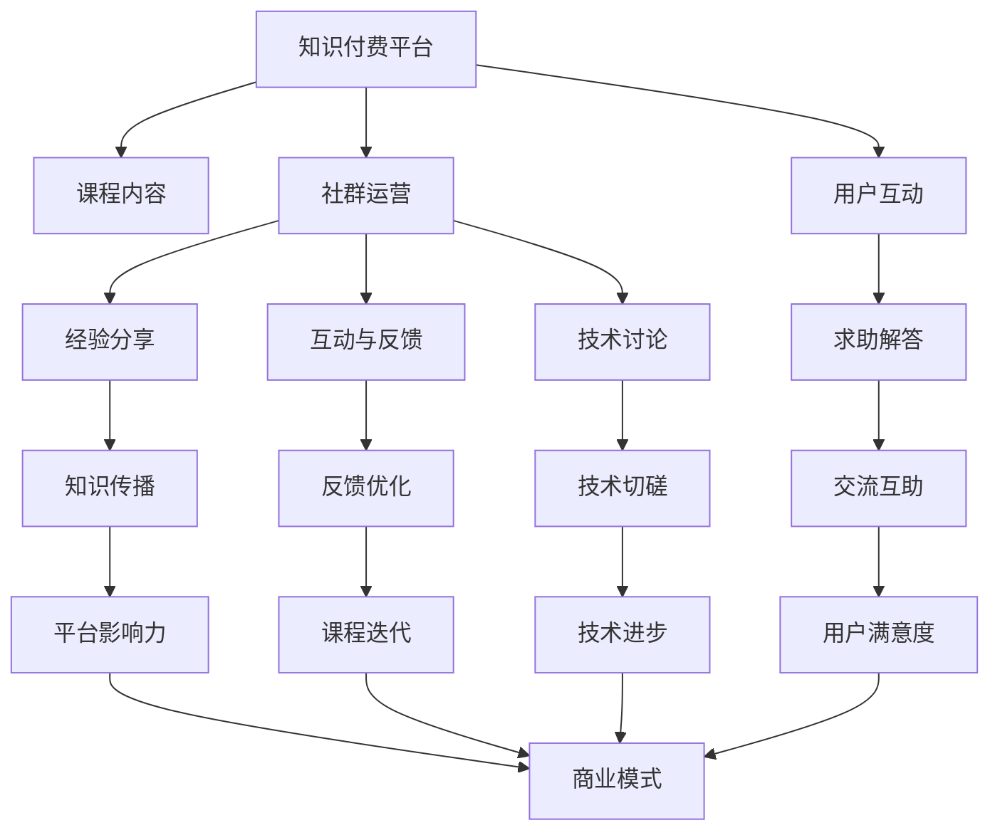

                 

## 1. 背景介绍

### 1.1 问题由来

随着互联网技术的迅猛发展，知识付费市场逐渐成为互联网行业的一大热门。程序员作为互联网生态的核心群体，面临着知识更新速度加快、技术迭代加速的巨大挑战。如何在快速变化的技术领域保持学习领先，成为每个程序员都关心的问题。而知识付费平台的兴起，为程序员提供了便捷高效的学习途径，使知识分享和获取变得更加轻松。

### 1.2 问题核心关键点

知识付费平台的核心在于建立高质量的课程内容、高效的技术社群运营，以及有效的用户互动机制。对于程序员来说，优质的课程内容是提升技术水平的根本保障，高效的社群运营能帮助知识分享与反馈形成良性循环，而有效的用户互动则能促进社区活跃度，提高平台黏性。

### 1.3 问题研究意义

研究知识付费平台的程序员社群运营方法，对于提升程序员的学习效率、扩大知识分享范围、增强社区粘性、提升平台商业模式等方面具有重要意义：

1. 提升学习效率：知识付费平台的课程内容通常由行业专家精心设计，能够帮助程序员系统化、高效化地掌握新知识和技能。
2. 扩大知识分享范围：社群运营能够有效连接课程供给与需求，实现知识的广泛传播。
3. 增强社区粘性：通过社群互动，程序员能够获得更多的学习支持和反馈，增强平台粘性。
4. 提升平台商业模式：高粘性的程序员社群能够促进用户订阅、广告、增值服务等多种商业模式的实现。

## 2. 核心概念与联系

### 2.1 核心概念概述

为更好地理解知识付费平台程序员社群运营方法，本节将介绍几个密切相关的核心概念：

- **知识付费平台**：以在线课程、讲座、文章、视频等形式，提供专业知识、技能培训、学习资源的服务平台。
- **课程内容**：由专家或权威机构设计开发的系统性学习材料，旨在传授专业知识、提升技术能力。
- **社群运营**：通过搭建技术交流、经验分享、问题解答的平台，促进知识流动与用户互动。
- **用户互动**：包括课程评论区互动、技术讨论、技术求助、问答社区等，提高用户参与度和满意度。
- **平台黏性**：指用户在平台上停留时间长、活跃度高、粘性强，有利于平台商业模式的实现。

这些概念之间的逻辑关系可以通过以下Mermaid流程图来展示：



这个流程图展示出知识付费平台的构成要素及各要素之间的关系：

1. 知识付费平台通过提供课程内容吸引用户，并通过社群运营、用户互动提高用户参与度。
2. 社群运营促进了知识传播、经验分享、技术讨论等，使用户互动更为频繁，形成良性循环。
3. 用户互动又进一步促进了课程内容的优化和社群的活跃度，形成了正反馈循环。
4. 最终，平台通过不断提升的用户满意度，推动商业模式的发展。

## 3. 核心算法原理 & 具体操作步骤
### 3.1 算法原理概述

知识付费平台的程序员社群运营，本质上是一个以课程内容为核心，通过高效社群运营和用户互动提升平台黏性的过程。其核心思想是：通过提供系统化、高质量的课程内容，吸引程序员用户注册并参与学习；通过搭建技术交流平台，促进知识流动与反馈；通过技术讨论、经验分享、问题解答等互动环节，提升用户参与度和满意度；最终实现平台商业模式的良性循环。

### 3.2 算法步骤详解

知识付费平台的程序员社群运营一般包括以下几个关键步骤：

**Step 1: 准备课程内容和社区平台**
- 设计高质量的课程内容，涵盖从基础到进阶的多个层次，满足不同技术水平用户的需求。
- 搭建易用、互动的社区平台，提供课程评论区、技术讨论区、问答区等功能，使用户能高效互动。

**Step 2: 设计互动与反馈机制**
- 设置课程评论区，鼓励用户发表学习心得、提出问题。
- 提供技术讨论区，让用户分享技术思路、解决技术难题。
- 开设问答区，由专家解答用户问题，增加知识权威性。

**Step 3: 运行与优化**
- 持续更新课程内容，保证课程的最新性和实用性。
- 定期组织技术分享会、技术讲座，增加社群活跃度。
- 使用数据挖掘、推荐算法等技术，提升用户推荐和课程推荐精准度。

**Step 4: 评估与迭代**
- 定期评估用户互动数据，分析用户活跃度、满意度、课程反馈等关键指标。
- 根据评估结果，优化课程内容、互动机制、平台功能等，提升用户体验。

### 3.3 算法优缺点

知识付费平台的程序员社群运营方法具有以下优点：

1. **高效性**：通过系统化课程内容和互动机制设计，使知识获取和分享更加高效。
2. **互动性强**：社区平台能够促进用户之间的交流与反馈，增加学习动力和参与度。
3. **可扩展性强**：课程内容和社区平台可根据需求不断更新和扩展，满足不同用户需求。
4. **生态繁荣**：通过不断优化平台运营，能够形成良性循环，推动平台生态繁荣发展。

同时，该方法也存在一定的局限性：

1. **资源投入大**：高质量课程设计和互动平台的开发、维护需要投入大量资源。
2. **课程质量要求高**：课程内容需要具备高度的系统性和实用性，设计难度大。
3. **用户粘性易流失**：用户活跃度受多种因素影响，长时间维持高黏性需要不断优化。
4. **平台商业化风险**：过度商业化可能影响用户体验，甚至导致用户流失。

尽管存在这些局限性，但知识付费平台程序员社群运营方法仍是当前主流的学习平台运营模式。未来相关研究的重点在于如何优化课程设计、互动机制、平台功能，同时兼顾商业化与用户体验，实现商业模式的可持续发展。

### 3.4 算法应用领域

知识付费平台的程序员社群运营方法在以下几个领域得到了广泛应用：

- **在线教育平台**：如Udemy、Coursera、网易云课堂等，通过课程内容与社区互动相结合，提升用户学习体验和平台黏性。
- **技术社区平台**：如Stack Overflow、GitHub、知乎等，通过社区讨论、技术分享等方式，提升用户互动和社区活跃度。
- **编程学习工具**：如Codecademy、LeetCode、HackerRank等，通过课程内容和在线练习相结合，提供综合性的学习体验。

此外，知识付费平台的程序员社群运营方法也被创新性地应用于智能客服、智能翻译、智能健康等场景，为各行业提供了知识传播和用户互动的新方式。

## 4. 数学模型和公式 & 详细讲解 & 举例说明

### 4.1 数学模型构建

本节将使用数学语言对知识付费平台程序员社群运营过程进行更加严格的刻画。

假设知识付费平台有 $N$ 名用户，其中 $M$ 名用户参与了互动和反馈。设课程内容集为 $C$，互动内容集为 $I$。用户对课程内容和互动内容的评分分别为 $s_c$ 和 $s_i$。

定义平台总体满意度为 $S$，定义为课程内容评分和互动内容评分的加权平均值：

$$
S = \frac{1}{N} \sum_{n=1}^N w_c s_{c,n} + \frac{1}{M} \sum_{m=1}^M w_i s_{i,m}
$$

其中 $w_c$ 和 $w_i$ 分别为课程内容和互动内容的权重。

### 4.2 公式推导过程

平台总体满意度的优化目标是最大化 $S$：

$$
\mathop{\arg\max}_{s_c,s_i} S
$$

在实际运营中，由于用户评分数据的高维性和多变性，直接求解上述优化问题较为复杂。因此，需要引入用户行为分析模型，利用机器学习算法进行优化。

以预测用户满意度的回归模型为例，假设训练集为 $D=\{(x_i, y_i)\}_{i=1}^N$，其中 $x_i$ 为用户的课程内容互动评分，$y_i$ 为用户满意度。模型 $M_{\theta}$ 的参数为 $\theta$。回归模型为线性回归，则模型可表示为：

$$
y_i = M_{\theta}(x_i) = \theta_0 + \sum_{j=1}^d \theta_j x_{ij}
$$

其中 $x_{ij}$ 为 $x_i$ 的第 $j$ 个特征。通过最小化均方误差损失函数 $\mathcal{L}(\theta)$ 来训练模型：

$$
\mathcal{L}(\theta) = \frac{1}{N} \sum_{i=1}^N (y_i - M_{\theta}(x_i))^2
$$

模型参数 $\theta$ 的更新公式为：

$$
\theta \leftarrow \theta - \eta \nabla_{\theta}\mathcal{L}(\theta)
$$

其中 $\eta$ 为学习率，$\nabla_{\theta}\mathcal{L}(\theta)$ 为损失函数对模型参数的梯度，可通过反向传播算法高效计算。

### 4.3 案例分析与讲解

以编程学习工具LeetCode为例，通过其社区互动和课程内容优化模型进行分析。

LeetCode平台的课程内容包含算法、数据结构、面试题等，用户可以通过完成练习题进行学习。平台通过用户练习题的完成情况、题解评分、互动评分等数据，构建了用户满意度模型。该模型不仅考虑了课程内容的用户评分，还结合了互动内容的评分，综合优化用户满意度。

LeetCode通过不断优化课程内容和互动机制，提升了用户的学习效果和平台黏性。用户可以在LeetCode上查找课程内容，进行练习题的练习，并在评论区发布自己编写的代码和解题思路，互相交流讨论。同时，平台还会根据用户的学习进度和互动情况，推荐课程和题解，增强学习体验。

## 5. 项目实践：代码实例和详细解释说明
### 5.1 开发环境搭建

在进行程序员社群运营实践前，我们需要准备好开发环境。以下是使用Python进行Flask开发的环境配置流程：

1. 安装Anaconda：从官网下载并安装Anaconda，用于创建独立的Python环境。

2. 创建并激活虚拟环境：
```bash
conda create -n flask-env python=3.8 
conda activate flask-env
```

3. 安装Flask：
```bash
pip install flask
```

4. 安装相关库：
```bash
pip install pandas numpy scikit-learn matplotlib
```

5. 安装数据库：
```bash
pip install sqlalchemy
```

完成上述步骤后，即可在`flask-env`环境中开始程序员社群运营的实践。

### 5.2 源代码详细实现

这里我们以一个简单的在线教育平台为例，使用Flask搭建课程内容和社区互动的功能模块。

首先，定义Flask应用：

```python
from flask import Flask, request, jsonify

app = Flask(__name__)

@app.route('/')
def index():
    return 'Welcome to the Knowledge Pay-Per-Use platform!'

@app.route('/api/courses')
def get_courses():
    courses = get_courses_from_db()
    return jsonify(courses)

@app.route('/api/interaction')
def get_interactions():
    interactions = get_interactions_from_db()
    return jsonify(interactions)
```

然后，定义数据库操作函数：

```python
from sqlalchemy import create_engine, Column, Integer, String, Float
from sqlalchemy.orm import sessionmaker

engine = create_engine('sqlite:///courses.db')
Session = sessionmaker(bind=engine)

class Course:
    __tablename__ = 'courses'
    id = Column(Integer, primary_key=True)
    title = Column(String)
    description = Column(String)
    rating = Column(Float)

class Interaction:
    __tablename__ = 'interactions'
    id = Column(Integer, primary_key=True)
    user_id = Column(Integer)
    course_id = Column(Integer)
    rating = Column(Float)
    comment = Column(String)

session = Session()
```

接着，定义API接口：

```python
@app.route('/api/courses', methods=['GET'])
def get_courses():
    courses = session.query(Course).all()
    return jsonify([{'id': course.id, 'title': course.title, 'description': course.description, 'rating': course.rating} for course in courses])

@app.route('/api/interaction', methods=['GET'])
def get_interactions():
    interactions = session.query(Interaction).all()
    return jsonify([{'id': interaction.id, 'user_id': interaction.user_id, 'course_id': interaction.course_id, 'rating': interaction.rating, 'comment': interaction.comment} for interaction in interactions])
```

最后，启动Flask应用：

```python
if __name__ == '__main__':
    app.run(debug=True)
```

以上就是使用Flask搭建知识付费平台程序员社群运营的基本代码实现。可以看到，Flask使得开发者能够以极少的代码实现完整的API接口，方便实现课程内容和社区互动的功能。

### 5.3 代码解读与分析

让我们再详细解读一下关键代码的实现细节：

**Flask应用**：
- `index`函数：提供欢迎页面。
- `get_courses`函数：提供课程内容API接口，返回课程信息。
- `get_interactions`函数：提供社区互动API接口，返回互动信息。

**数据库操作函数**：
- `Course`类：定义课程数据模型，包括课程ID、标题、描述、评分等属性。
- `Interaction`类：定义互动数据模型，包括互动ID、用户ID、课程ID、评分、评论等属性。
- `session`对象：用于与数据库进行交互。

**API接口**：
- `get_courses`接口：从数据库查询所有课程信息，并返回JSON格式的数据。
- `get_interactions`接口：从数据库查询所有互动信息，并返回JSON格式的数据。

可以看到，Flask的简洁高效使得开发者能够快速实现在线教育平台程序员社群运营的核心功能，聚焦于业务逻辑的设计，而不必过多关注底层实现细节。

当然，工业级的系统实现还需考虑更多因素，如用户注册、登录、权限控制、课程推荐等，但核心的社群运营功能基本与此类似。

## 6. 实际应用场景
### 6.1 在线教育平台

知识付费平台的程序员社群运营方法在在线教育平台的应用尤为广泛。这些平台通过高质量的课程内容吸引用户，通过互动机制增强用户黏性，最终实现商业模式。

以Udemy平台为例，该平台汇聚了大量来自全球的课程内容，涵盖了编程、数据分析、人工智能等多个方向。平台通过课程评分、互动评分、用户评论等数据，构建了用户满意度模型，不断优化课程内容，提升用户体验。Udemy还通过社区讨论、技术分享等互动环节，增强用户之间的交流与反馈，提升平台活跃度。

### 6.2 技术社区平台

知识付费平台的程序员社群运营方法在技术社区平台也得到了广泛应用。这些平台通过技术讨论、问题解答、代码分享等方式，促进了程序员之间的知识交流与合作。

以Stack Overflow为例，该平台聚集了大量程序员，通过提供高质量的问答服务，成为程序员解决问题的重要工具。平台通过用户评分、评论、点赞等机制，构建了问题质量评价体系，帮助用户筛选高质量的解决方案。同时，平台还通过社区投票、专家认证等方式，提升了平台的权威性和可信度。

### 6.3 编程学习工具

知识付费平台的程序员社群运营方法在编程学习工具中同样具有广泛应用。这些工具通过课程内容与社区互动相结合，提供综合性的学习体验。

以LeetCode平台为例，该平台不仅提供算法和数据结构等课程内容，还通过社区互动机制，增强用户的学习效果和平台黏性。用户可以在LeetCode上查找课程内容，进行练习题的练习，并在评论区发布自己编写的代码和解题思路，互相交流讨论。平台还会根据用户的学习进度和互动情况，推荐课程和题解，增强学习体验。

### 6.4 未来应用展望

随着知识付费平台的不断发展，程序员社群运营方法将在更多领域得到应用，为传统行业带来变革性影响。

在智慧医疗领域，知识付费平台的医生社群运营方法，通过在线课程和互动讨论，提升医生的专业水平，促进知识传播。

在智能教育领域，知识付费平台的教师社群运营方法，通过课程内容与社区互动，实现个性化学习，提升教学质量。

在智慧城市治理中，知识付费平台的市民社群运营方法，通过技术分享、经验交流，提高城市管理的自动化和智能化水平，构建更安全、高效的未来城市。

此外，知识付费平台的程序员社群运营方法也将不断扩展到更多场景中，为各行业提供知识传播和用户互动的新方式。相信随着技术的日益成熟，知识付费平台的程序员社群运营方法将带来更广泛的商业和社会价值。

## 7. 工具和资源推荐
### 7.1 学习资源推荐

为了帮助开发者系统掌握知识付费平台程序员社群运营的理论基础和实践技巧，这里推荐一些优质的学习资源：

1. **《程序员社群运营的艺术》系列博文**：由知识付费平台专家撰写，深入浅出地介绍了社群运营的基本原则和实际案例。

2. **Coursera《知识付费平台运营》课程**：斯坦福大学开设的课程，从课程内容设计、社区互动机制、平台商业模式等多个维度，全面讲解知识付费平台的运营方法。

3. **《知识付费平台的运营之道》书籍**：全面介绍了知识付费平台的运营实践，涵盖课程内容、社区运营、用户互动等多个方面。

4. **Hacker News**：知识付费平台的经典案例，通过技术讨论、问题解答、代码分享等方式，积累了大批忠实用户。

5. **Flask官方文档**：Flask框架的官方文档，详细介绍了Flask的使用方法、API开发技巧、数据库操作等，是Flask开发的必备资源。

6. **Flask Mega-Tutorial**：Flask开发社区的经典教程，通过实际项目演示了Flask的全栈开发流程，适合初学者入门。

通过对这些资源的学习实践，相信你一定能够快速掌握知识付费平台程序员社群运营的精髓，并用于解决实际的社群运营问题。

### 7.2 开发工具推荐

高效的开发离不开优秀的工具支持。以下是几款用于知识付费平台程序员社群运营开发的常用工具：

1. **Flask**：Python的开源Web框架，简单易用，适合快速开发API接口。

2. **Django**：Python的开源Web框架，功能丰富，适合构建完整的应用系统。

3. **SQLAlchemy**：Python的ORM框架，支持多种数据库，方便数据库操作。

4. **Gunicorn**：Python的Wsgi HTTP服务器，支持多进程并发，适合高并发的Web应用。

5. **Nginx**：高性能HTTP服务器，适合作为Web应用的前端代理。

6. **Redis**：高性能的内存数据库，适合缓存和会话管理。

7. **ElasticSearch**：分布式搜索引擎，适合大规模数据的搜索和分析。

合理利用这些工具，可以显著提升知识付费平台程序员社群运营的开发效率，加快创新迭代的步伐。

### 7.3 相关论文推荐

知识付费平台程序员社群运营技术的发展源于学界的持续研究。以下是几篇奠基性的相关论文，推荐阅读：

1. **《知识付费平台的运营研究》**：系统总结了知识付费平台运营的各个环节，并提出了针对性的运营策略。

2. **《社群运营机制的设计与优化》**：探讨了社群运营机制的设计和优化方法，提升用户互动和社区活跃度。

3. **《知识付费平台用户行为分析》**：通过数据挖掘和机器学习技术，分析用户行为，优化课程内容和互动机制。

4. **《程序员社群运营的挑战与对策》**：深入分析了程序员社群运营的挑战，提出了多种应对策略。

这些论文代表了大语言模型微调技术的发展脉络。通过学习这些前沿成果，可以帮助研究者把握学科前进方向，激发更多的创新灵感。

## 8. 总结：未来发展趋势与挑战
### 8.1 总结

本文对知识付费平台程序员社群运营方法进行了全面系统的介绍。首先阐述了知识付费平台的研究背景和意义，明确了社群运营在提升用户学习效果、促进知识传播、增强平台黏性等方面的重要价值。其次，从原理到实践，详细讲解了社群运营的数学模型和操作步骤，给出了社群运营任务开发的完整代码实例。同时，本文还广泛探讨了社群运营方法在在线教育、技术社区、编程学习等多个领域的应用前景，展示了社群运营范式的巨大潜力。此外，本文精选了社群运营技术的各类学习资源，力求为读者提供全方位的技术指引。

通过本文的系统梳理，可以看到，知识付费平台的程序员社群运营方法正在成为在线教育平台的重要范式，极大地提升用户的互动体验和学习效率，推动平台商业模式的良性循环。随着技术的发展和应用场景的扩展，社群运营必将在更多领域得到广泛应用，为各行业提供知识分享和用户互动的新方式。

### 8.2 未来发展趋势

展望未来，知识付费平台的程序员社群运营技术将呈现以下几个发展趋势：

1. **社区互动智能化**：借助AI技术，智能推荐问题答案、优化互动机制，提升用户互动效率。

2. **用户行为数据化**：通过数据分析和机器学习，实现对用户行为的高精度预测，提升平台决策的科学性。

3. **课程内容动态化**：根据用户反馈和学习效果，动态更新课程内容和互动机制，提升课程实用性和用户满意度。

4. **平台商业化多样化**：通过课程订阅、广告投放、增值服务等多种商业模式，实现平台价值的最大化。

5. **社群运营个性化**：根据用户兴趣和行为，个性化推荐课程和互动内容，提升用户黏性和平台活跃度。

6. **平台体验优化**：通过用户界面设计、前端技术优化等方式，提升用户的使用体验和满意度。

以上趋势凸显了知识付费平台程序员社群运营技术的广阔前景。这些方向的探索发展，必将进一步提升平台的用户体验和学习效率，为知识付费平台的商业模式带来新的突破。

### 8.3 面临的挑战

尽管知识付费平台程序员社群运营技术已经取得了显著成果，但在迈向更加智能化、普适化应用的过程中，仍面临诸多挑战：

1. **用户行为多变**：不同用户的需求和行为模式各异，社群运营需要兼顾多样化的用户需求。

2. **互动效果波动**：用户互动的效果受多种因素影响，如何持续提升用户互动质量，保持平台活跃度，仍是重要难题。

3. **平台资源有限**：高质量课程内容和社区互动的开发和维护需要大量资源，如何高效利用资源，最大化平台价值，需要不断优化。

4. **用户反馈复杂**：用户反馈数据量和质量高，但处理复杂，如何高效分析和使用用户反馈，提升平台决策的准确性，仍需改进。

5. **商业化风险**：过度商业化可能影响用户体验，如何平衡商业目标和用户体验，实现商业模式的可持续发展，需要更多探索。

6. **隐私保护**：用户行为数据涉及隐私保护，如何合理使用和保护用户数据，保障用户隐私，需要严格遵守法律法规。

这些挑战使得知识付费平台的程序员社群运营技术需要不断创新和优化，才能在激烈的市场竞争中保持领先地位。

### 8.4 未来突破

面对知识付费平台程序员社群运营所面临的种种挑战，未来的研究需要在以下几个方面寻求新的突破：

1. **智能互动技术**：引入AI技术，提升互动推荐和问题解答的智能化水平，提升用户互动效率。

2. **大数据分析**：通过大数据分析和机器学习技术，提升用户行为分析的精准度，优化课程内容与互动机制。

3. **个性化推荐**：引入推荐算法，根据用户兴趣和行为，个性化推荐课程和互动内容，提升用户黏性和平台活跃度。

4. **互动效果评估**：建立互动效果评估机制，通过数据分析和实验设计，提升互动质量和用户满意度。

5. **商业化平衡**：在追求商业目标的同时，注重用户体验，实现商业目标和用户体验的平衡。

6. **隐私保护机制**：建立完善的隐私保护机制，合理使用和保护用户数据，保障用户隐私安全。

这些研究方向的探索，必将引领知识付费平台程序员社群运营技术迈向更高的台阶，为知识付费平台的商业模式带来新的突破，推动行业向更加智能化、普适化方向发展。

## 9. 附录：常见问题与解答

**Q1：知识付费平台社群运营的核心是什么？**

A: 知识付费平台社群运营的核心在于高质量的课程内容和高效的用户互动机制。课程内容需要系统化、实用性，吸引用户注册并参与学习；用户互动机制需要高效、多样化，促进知识流动与反馈，提升用户参与度和满意度。

**Q2：如何选择适合的知识付费平台？**

A: 选择知识付费平台时，应综合考虑平台的课程内容质量、互动机制、用户评价、技术支持等多方面因素。可以通过查看用户评价、试听课程、试用平台等方式，选择适合自己的平台。

**Q3：如何进行有效的社群运营？**

A: 进行有效的社群运营需要以下关键步骤：
1. 设计高质量的课程内容，满足用户需求。
2. 搭建易用、互动的社区平台，提供课程评论区、技术讨论区、问答区等功能。
3. 设置互动与反馈机制，如课程评论区、技术讨论区、问答区等。
4. 运行与优化，不断更新课程内容，优化互动机制。
5. 评估与迭代，定期评估用户互动数据，优化平台功能。

**Q4：知识付费平台如何提升用户满意度？**

A: 提升用户满意度需要以下关键措施：
1. 提供高质量的课程内容，满足用户需求。
2. 搭建易用、互动的社区平台，提供课程评论区、技术讨论区、问答区等功能。
3. 设置互动与反馈机制，如课程评论区、技术讨论区、问答区等。
4. 运行与优化，不断更新课程内容，优化互动机制。
5. 评估与迭代，定期评估用户互动数据，优化平台功能。

这些措施能够从多个维度提升用户满意度，推动知识付费平台的良性循环。

**Q5：知识付费平台如何选择适合的课程内容？**

A: 选择适合的课程内容需要以下关键步骤：
1. 调研市场需求，了解用户需求和痛点。
2. 邀请行业专家设计高质量的课程内容，涵盖从基础到进阶的多个层次。
3. 进行市场调研，验证课程内容的实用性和用户反馈。
4. 根据用户反馈，动态更新课程内容，提升课程实用性和用户满意度。

通过以上步骤，选择适合的课程内容，可以提升平台的吸引力和用户满意度。

---

作者：禅与计算机程序设计艺术 / Zen and the Art of Computer Programming

