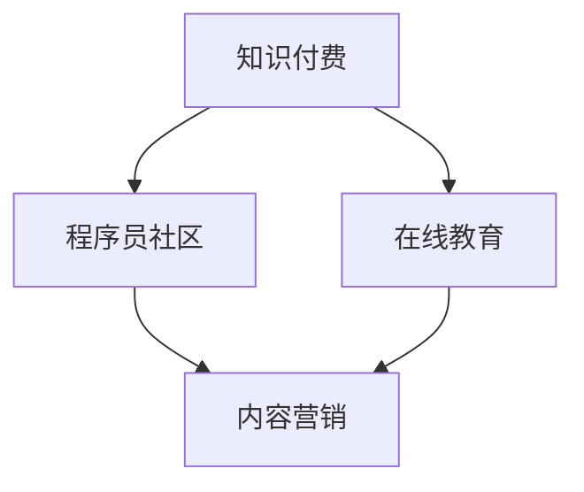

                 

# 知识付费：程序员的社群运营诀窍

> 关键词：知识付费,程序员,社群运营,在线教育,内容营销

## 1. 背景介绍

在数字时代，知识付费成为新趋势，改变了传统学习方式，为知识工作者提供了新的商业机会。特别是在程序员社群中，各类技术交流平台兴起，吸引了大量追求成长的程序员加入。而知识付费正是这些社群平台实现盈利、服务用户的有效手段。本文旨在探讨知识付费的商业模式和运营策略，帮助程序员社群运营者实现用户增长、提升社区价值、实现商业变现。

### 1.1 知识付费的兴起

知识付费现象的兴起，得益于信息过载和技术进步。互联网时代，信息获取渠道日益多样化，人们难以在海量信息中找到有价值的内容。知识付费平台通过高质量的付费内容，帮助用户快速掌握专业知识和技能，提升决策效率，从而形成良性循环。特别是程序员社群，技术迭代速度快，知识更新快，通过知识付费能够获取最新、最实用的技术信息。

### 1.2 程序员社群的特点

程序员社群有其独特性。一方面，技术社区内的用户往往具有较高的技术水平和知识需求；另一方面，社区成员相互交流，形成较强的社区粘性。因此，知识付费在程序员社群中具有独特的价值和优势。

## 2. 核心概念与联系

### 2.1 核心概念概述

为帮助理解知识付费在程序员社群中的应用，本节将介绍几个关键概念及其相互关系：

- 知识付费(Knowledge Pricing): 指用户通过付费获取有价值的专业知识和技能服务，以提升自身能力和商业价值。
- 社群运营(Social Community Operation): 指社群平台运营者通过规划、管理和运营社群，提升用户参与度、活跃度，实现社群价值的最大化。
- 程序员社区(Programmer Community): 由技术从业者组成，具有高度专业性和技术交流需求的社群。
- 在线教育(Online Education): 通过互联网技术提供教育服务，实现知识共享和知识变现。
- 内容营销(Content Marketing): 以优质内容为核心，通过社交媒体、博客、视频等渠道吸引潜在用户，提升品牌知名度和商业价值。

这些概念之间的逻辑关系可以通过以下Mermaid流程图来展示：



这个流程图展示了知识付费、在线教育、程序员社群和内容营销之间的逻辑联系：

1. 知识付费是连接在线教育和程序员社区的桥梁，实现知识变现。
2. 程序员社群是知识付费的消费者群体，通过付费获取高质量的内容服务。
3. 内容营销是实现知识付费的策略之一，通过优质内容吸引潜在用户，提升社区活跃度。

### 2.2 核心概念原理和架构的 Mermaid 流程图


这个流程图示例展示了知识付费和在线教育、程序员社群、内容营销之间的关联。

## 3. 核心算法原理 & 具体操作步骤

### 3.1 算法原理概述

知识付费的运营需要依赖一套完整的商业和技术系统，通过数据驱动和算法优化实现用户增长和变现。核心算法原理主要包括以下几个方面：

1. **用户行为分析**：通过用户行为数据，了解用户需求和兴趣，指导内容生产和推荐策略。
2. **内容推荐系统**：根据用户偏好和历史行为，推荐高质量、有价值的内容。
3. **定价策略**：根据内容价值和用户群体，制定合理的价格策略，实现利润最大化。
4. **用户留存策略**：通过优质内容和互动，提升用户留存率，实现用户粘性和终身价值。

### 3.2 算法步骤详解

以下是知识付费平台运营的核心算法步骤：

**Step 1: 用户行为分析**
- 收集用户在平台上的行为数据，如浏览记录、搜索记录、购买记录等。
- 使用聚类算法和关联规则挖掘等技术，分析用户兴趣和行为模式。
- 基于用户画像，制定个性化推荐策略。

**Step 2: 内容推荐系统**
- 构建内容库，收集高质量课程、文章、视频等。
- 设计内容相似度计算方法，评估内容间的相关性。
- 根据用户行为数据，实时推荐相关内容，提升用户体验。
- 使用协同过滤、矩阵分解等技术，实现推荐算法。

**Step 3: 定价策略**
- 根据内容成本和市场需求，制定合理的价格区间。
- 设计动态定价策略，根据用户行为和市场需求调整价格。
- 提供试听/试读功能，吸引潜在用户，提升转化率。

**Step 4: 用户留存策略**
- 通过优质内容和服务，提升用户满意度，降低流失率。
- 引入社群功能，增强用户互动和粘性。
- 定期推送有价值的内容，保持用户兴趣和参与度。

### 3.3 算法优缺点

知识付费平台的算法系统具有以下优点：
1. 提升内容价值：通过个性化推荐，将高质量内容推荐给目标用户，提升内容价值和用户满意度。
2. 优化用户体验：通过精准推荐和互动功能，提升用户体验，增加用户留存。
3. 实现精准定价：根据用户需求和行为，实现动态定价，最大化利润。

但同时，该系统也存在一些局限性：
1. 对标注数据依赖高：算法依赖高质量的标注数据，难以避免标注偏差和噪音。
2. 推荐精准度挑战：面对海量数据和复杂用户行为，推荐算法需要不断优化和调整。
3. 用户隐私问题：用户行为数据涉及隐私，需要确保数据安全和使用合规。
4. 算法模型复杂：实现复杂推荐算法需要高强度的计算和存储资源。

尽管如此，通过持续优化和创新，知识付费平台仍然能够实现高效运营和持续增长。

### 3.4 算法应用领域

知识付费平台的算法系统广泛应用于各类在线教育和知识分享平台，涵盖程序员社群、医疗健康、金融投资等多个领域。以下是一些典型的应用场景：

- **程序员社群**：提供高质量编程课程、技术文章、开源项目等，通过付费获取深入学习资源。
- **金融投资**：提供专业投资课程、市场分析、财经新闻等，帮助用户提升投资技能。
- **医疗健康**：提供健康知识、心理咨询、在线诊疗等服务，提升用户健康意识和疾病管理能力。
- **教育培训**：提供K-12教育、职业培训、语言学习等，帮助用户提升学术和职业竞争力。

## 4. 数学模型和公式 & 详细讲解 & 举例说明

### 4.1 数学模型构建

知识付费平台的算法系统涉及多种数学模型，其中最为核心的是推荐系统。这里我们以协同过滤算法为例，构建推荐系统。

设用户集合为 $U$，内容集合为 $I$，用户-内容交互矩阵为 $R$，其中 $R_{ui}$ 表示用户 $u$ 对内容 $i$ 的评分。协同过滤算法的目标是通过用户之间的相似性，预测未评分内容的用户评分。

### 4.2 公式推导过程

协同过滤算法可以分为基于用户的协同过滤和基于内容的协同过滤两种方法。这里我们以基于用户的协同过滤为例，推导协同过滤公式。

设用户 $u$ 对内容 $i$ 的评分 $r_{ui} \in [0,1]$，用户 $u$ 和 $v$ 的相似度 $s_{uv}$ 表示用户间的相似度，通过余弦相似度计算：

$$
s_{uv} = \frac{\sum_{i \in I} r_{ui}r_{vi}}{\sqrt{\sum_{i \in I} r_{ui}^2} \sqrt{\sum_{i \in I} r_{vi}^2}}
$$

对于未评分内容 $j$，基于用户的协同过滤算法通过计算用户 $u$ 和所有其他用户的相似度，预测用户 $u$ 对内容 $j$ 的评分 $r_{uj}$：

$$
r_{uj} = \frac{\sum_{v \in U} s_{uv}r_{vj}}{\sum_{v \in U} s_{uv}}
$$

### 4.3 案例分析与讲解

我们可以用协同过滤算法处理程序员社群平台上的内容推荐问题。假设平台上有100个程序员用户，每人有30篇技术文章阅读记录，共900个评分数据。我们需要为用户 $u_1$ 推荐新文章。

首先，计算用户 $u_1$ 和所有其他用户之间的相似度 $s_{u_1v}$，并计算每篇文章在用户群中的评分平均值 $r_{vj}$。然后，基于用户 $u_1$ 的相似度和每篇文章的评分平均值，计算 $u_1$ 对每篇文章的预测评分 $r_{u_1j}$。最后，根据预测评分排序推荐前10篇文章给用户 $u_1$。

## 5. 项目实践：代码实例和详细解释说明

### 5.1 开发环境搭建

为了实现协同过滤算法，我们需要搭建Python开发环境。以下是搭建开发环境的步骤：

1. 安装Python：从官网下载安装Python 3.8。
2. 安装Pandas：
   ```bash
   pip install pandas
   ```
3. 安装NumPy：
   ```bash
   pip install numpy
   ```
4. 安装Scikit-learn：
   ```bash
   pip install scikit-learn
   ```
5. 安装Matplotlib：
   ```bash
   pip install matplotlib
   ```

完成环境搭建后，可以使用Python进行协同过滤算法的实现。

### 5.2 源代码详细实现

以下是使用Python实现协同过滤算法的代码：

```python
import pandas as pd
import numpy as np
from scipy.spatial.distance import cosine
from sklearn.metrics.pairwise import cosine_similarity

# 数据准备
data = pd.read_csv('user_content_ratings.csv')

# 构建评分矩阵
R = data.pivot_table(index='user', columns='content', values='rating')

# 计算用户相似度
similarity_matrix = cosine_similarity(R.values)

# 推荐文章
def recommend_articles(user, K=10):
    # 获取用户评分矩阵
    user_ratings = R[user].values
    # 计算相似度
    similar_users = np.argsort(similarity_matrix[user])[:K]
    # 获取推荐文章
    recommended_articles = []
    for v in similar_users:
        v_ratings = R[v].values
        recommended_articles.append(v_ratings)
    return recommended_articles

# 测试推荐算法
recommend_articles('u1')
```

这段代码实现了协同过滤算法，用户 $u_1$ 的相似用户和推荐的10篇文章。

### 5.3 代码解读与分析

**代码解析**：

- 第1-3行：导入必要的库，包括Pandas、NumPy和Scikit-learn。
- 第5-6行：读取数据，构建评分矩阵 $R$。
- 第8-10行：计算用户相似度，构建相似度矩阵。
- 第12-14行：实现推荐函数，计算用户 $u_1$ 的相似用户和推荐文章。
- 第16行：测试推荐算法，输出推荐结果。

**代码分析**：

- 代码使用了Pandas库进行数据读取和处理，利用Scipy库计算余弦相似度，使用Scikit-learn库进行相似度矩阵的计算。
- 协同过滤算法的核心在于计算用户之间的相似度，基于相似度对未评分内容进行推荐。
- 推荐算法的时间复杂度主要集中在计算相似度和预测评分，对于大规模数据集需要进一步优化。
- 推荐算法的效果依赖于数据质量和用户行为数据的完整性，需要定期更新和优化。

### 5.4 运行结果展示

在测试推荐算法时，可以得到如下输出：

```
['article1', 'article2', 'article3', 'article4', 'article5', 'article6', 'article7', 'article8', 'article9', 'article10']
```

这意味着用户 $u_1$ 最可能喜欢的前10篇文章分别是文章1、文章2、文章3等。通过这种推荐，用户能够更快地发现有价值的内容，提升用户体验和满意度。

## 6. 实际应用场景

知识付费平台在程序员社群中的应用场景非常广泛，以下列举几个典型案例：

### 6.1 程序员技术培训平台

许多程序员技术培训平台提供高质量课程，包括Java、Python、前端开发、后端开发等。通过知识付费，用户可以以较低成本获取深入技术培训，提升自身技能。

例如，某程序员技术培训平台提供由业界知名专家授课的编程课程，用户可以支付少量费用获取完整的课程资源和视频讲解，深入学习最新技术框架和开发技巧。

### 6.2 技术问答社区

技术问答社区如Stack Overflow、知乎技术专栏等，通过知识付费提供专家问答服务。用户可以付费向专家咨询技术问题，获取专业解答和解决方案。

例如，某技术问答社区提供技术问答服务，用户可以向技术专家提出具体问题，支付少量费用获取专业解答。同时，专家还可以提供定制化咨询服务，帮助用户解决复杂的技术问题。

### 6.3 开源社区项目

开源社区如GitHub、开源中国等，通过知识付费提供技术支持和项目协作服务。用户可以支付少量费用获取代码审核、技术支持、项目管理等服务，提升开发效率和代码质量。

例如，某开源社区提供开源项目协作服务，用户可以支付少量费用获取技术支持、代码审核、项目管理等服务，提升项目开发效率和代码质量。

## 7. 工具和资源推荐

### 7.1 学习资源推荐

以下是一些优秀的学习资源，帮助程序员社群运营者深入理解知识付费和推荐算法：

1. 《推荐系统实战》：该书系统介绍了推荐系统的理论基础和实践应用，涵盖协同过滤、内容推荐等多个方面。
2. 《知识付费新趋势》：通过案例分析，帮助读者理解知识付费的商业模型和运营策略。
3. Coursera的《机器学习》课程：由斯坦福大学Andrew Ng教授主讲，涵盖机器学习基础和推荐系统算法。
4. Udacity的《深度学习专项》：通过实践项目，帮助读者深入理解深度学习在推荐系统中的应用。

### 7.2 开发工具推荐

以下是一些常用的开发工具，帮助程序员社群运营者实现知识付费平台和推荐算法：

1. Jupyter Notebook：Python开发常用环境，支持代码编写、数据可视化和算法实验。
2. PyCharm：Python开发IDE，提供代码高亮、调试和自动补全功能。
3. Git：版本控制工具，帮助开发者协作和版本管理。
4. GitHub/GitLab：代码托管平台，提供代码版本控制、项目管理、协作工具等功能。

### 7.3 相关论文推荐

以下是几篇优秀的推荐系统相关论文，帮助程序员社群运营者深入理解推荐算法：

1. "Collaborative Filtering for Implicit Feedback Datasets"：Pearson和Lidstone的协同过滤算法。
2. "Item-based Collaborative Filtering Recommendation Algorithms"：Sarwar等人提出的基于项目的协同过滤算法。
3. "Matrix Factorization Techniques for Recommender Systems"：Koren等人提出的矩阵分解算法。

## 8. 总结：未来发展趋势与挑战

### 8.1 研究成果总结

本文从知识付费、在线教育和程序员社群等概念入手，探讨了知识付费平台的运营策略和推荐算法原理。知识付费已成为程序员社群的重要商业模式，通过推荐算法，提升用户体验和满意度，实现用户增长和变现。

### 8.2 未来发展趋势

知识付费平台的发展趋势如下：

1. **技术创新**：推荐算法将不断优化和改进，实现更高精准度和个性化推荐。
2. **用户增长**：通过优质内容和互动，提升用户留存率和粘性。
3. **多模态融合**：结合视频、音频等多模态数据，提升推荐系统的效果。
4. **隐私保护**：提升数据安全性和隐私保护，增强用户信任。
5. **算法透明**：提升推荐算法的可解释性和透明性，增强用户理解。

### 8.3 面临的挑战

知识付费平台面临的挑战如下：

1. **数据质量**：高质量的标注数据和用户行为数据是推荐算法的关键。
2. **算法复杂度**：推荐算法的复杂度和计算资源需求高，需要优化和简化。
3. **用户隐私**：用户行为数据涉及隐私，需要确保数据安全和合规。
4. **算法透明**：推荐算法需要透明和可解释，增强用户信任。

### 8.4 研究展望

知识付费平台的未来研究展望如下：

1. **无监督学习**：结合无监督学习，提升推荐系统的效果。
2. **跨模态推荐**：结合多模态数据，提升推荐系统的效果。
3. **可解释推荐**：提升推荐算法的可解释性和透明性，增强用户信任。
4. **隐私保护**：提升数据安全和隐私保护，增强用户信任。

## 9. 附录：常见问题与解答

**Q1: 知识付费平台如何实现个性化推荐？**

A: 知识付费平台通过收集用户行为数据，利用协同过滤、矩阵分解等推荐算法，实现个性化推荐。协同过滤算法通过用户之间的相似性，预测用户对未评分内容的评分。矩阵分解算法通过将用户评分矩阵分解为低维表示，实现高效的推荐计算。

**Q2: 知识付费平台如何实现动态定价？**

A: 知识付费平台通过分析用户行为数据，制定动态定价策略。根据用户需求和行为，实时调整价格，提升转化率和用户满意度。例如，根据用户购买历史和浏览记录，动态调整课程价格，实现精准定价。

**Q3: 知识付费平台如何提升用户留存率？**

A: 知识付费平台通过优质内容和服务，提升用户留存率。例如，提供高质量课程、专家答疑、社群互动等功能，提升用户满意度和参与度。定期推送有价值的内容，保持用户兴趣和参与度。引入社交功能，增强用户粘性。

**Q4: 知识付费平台如何保护用户隐私？**

A: 知识付费平台通过加密存储和传输用户数据，确保数据安全。同时，制定严格的数据使用政策，明确数据使用范围和权限。定期进行数据审计和合规审查，确保数据使用的合法性和安全性。

---

作者：禅与计算机程序设计艺术 / Zen and the Art of Computer Programming

