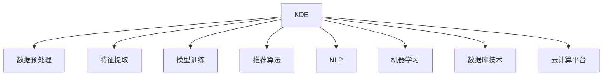

                 

# 知识发现引擎助力程序员快速适应新技术

## 1. 背景介绍

### 1.1 问题由来
随着技术迭代加速，软件开发人员必须快速适应新技术，才能保持竞争力。然而，新技术层出不穷，精通所有新技能几乎是不可能的。如何帮助程序员快速获取新技能，高效融入新技术，成为了一个重要问题。

### 1.2 问题核心关键点
知识发现引擎（Knowledge Discovery Engine, KDE）提供了一种新方法，通过分析和挖掘海量技术文档和代码示例，自动发现和推荐相关技能和知识点，加速程序员的学习过程。通过精准推荐技术资料，KDE可显著提高技术学习的效率和效果。

### 1.3 问题研究意义
KDE的应用，对于提升程序员技术学习的质量和速度，降低企业对高水平技术人才的依赖，具有重要意义：

1. **提升学习效率**：通过智能推荐系统，程序员可以更快地找到所需资料，减少搜索时间。
2. **降低学习成本**：KDE可以减少低效的学习资源使用，避免因盲目学习而造成的资源浪费。
3. **强化知识传承**：KDE能系统化地整理和传播技术知识，促进知识在公司内部的流转和共享。
4. **支持技术演进**：KDE能及时发现和跟踪技术发展趋势，帮助团队保持技术前沿。
5. **推动创新应用**：KDE通过技术推荐，辅助开发团队快速开发新应用，缩短产品上市时间。

## 2. 核心概念与联系

### 2.1 核心概念概述

为更好地理解KDE的工作原理和构建方法，本节将介绍几个密切相关的核心概念：

- **知识发现引擎（KDE）**：一种通过分析和挖掘知识库，自动识别和推荐相关技术资料的系统。其核心组件包括数据预处理、特征提取、模型训练和推荐算法。

- **数据预处理**：通过数据清洗、归一化等技术手段，将原始数据转换为可用于机器学习的格式。

- **特征提取**：从原始数据中提取有用的信息特征，供模型训练使用。

- **模型训练**：利用机器学习算法（如分类、回归、聚类等）训练推荐模型，预测用户可能感兴趣的技术资料。

- **推荐算法**：根据用户行为、历史评分等数据，动态调整推荐策略，优化推荐效果。

- **自然语言处理（NLP）**：通过文本解析、情感分析等技术手段，从技术文档和代码注释中提取有价值的信息。

- **机器学习（ML）**：利用统计学习、深度学习等算法，从数据中学习模式和规律，实现智能推荐。

- **数据库技术**：用于高效存储和检索技术文档、代码示例等数据，支持快速查询和访问。

- **云计算平台**：如AWS、Google Cloud、阿里云等，提供弹性计算资源，支持大规模数据处理和模型训练。

这些核心概念之间的逻辑关系可以通过以下Mermaid流程图来展示：



这个流程图展示了KDE的核心组件及其之间的关系：

1. KDE从数据预处理、特征提取、模型训练和推荐算法等多个环节协同工作。
2. 自然语言处理和机器学习技术用于文本和代码的分析与处理。
3. 数据库技术支持数据的存储和检索，云计算平台提供弹性资源支持大规模数据处理。

这些概念共同构成了KDE的知识发现与推荐机制，使其能够高效挖掘和推荐相关技术资料。

## 3. 核心算法原理 & 具体操作步骤
### 3.1 算法原理概述

KDE的核心算法包括数据预处理、特征提取、模型训练和推荐算法。其原理是通过分析用户的历史行为和偏好，利用机器学习模型预测其可能感兴趣的技术资料。

形式化地，假设用户历史行为数据为 $D=\{(x_i,y_i)\}_{i=1}^N, x_i \in X, y_i \in Y$，其中 $x_i$ 为技术文档或代码示例，$y_i$ 为用户行为（如阅读、收藏、评论等），则KDE的目标是找到推荐函数 $f$，使得预测值 $y^*=f(x)$ 尽可能接近实际标签 $y_i$：

$$
\min_{f}\mathcal{L}(f,D)
$$

其中 $\mathcal{L}$ 为损失函数，用于衡量预测值与实际标签之间的差异。

通过梯度下降等优化算法，KDE不断更新推荐函数 $f$，最小化损失函数 $\mathcal{L}$，直至收敛。

### 3.2 算法步骤详解

KDE的具体实现流程包括以下几个关键步骤：

**Step 1: 数据收集与清洗**
- 收集用户的历史行为数据 $D=\{(x_i,y_i)\}_{i=1}^N$，如阅读历史、搜索记录、评分信息等。
- 对原始数据进行预处理，包括去重、补全、归一化等操作。

**Step 2: 特征提取**
- 从原始数据中提取有用的信息特征，如技术文档的关键词、代码示例的库和函数名等。
- 将提取到的特征映射到高维空间，供模型训练使用。

**Step 3: 模型训练**
- 选择适当的机器学习算法，如协同过滤、基于内容的推荐、深度学习等，训练推荐模型。
- 利用历史数据训练模型，生成推荐函数 $f$。
- 在验证集上评估模型性能，选择最优模型。

**Step 4: 推荐生成**
- 利用训练好的推荐模型 $f$，对新用户 $x$ 进行推荐。
- 根据预测结果生成推荐列表，排序并展示给用户。

**Step 5: 反馈机制**
- 收集用户对推荐结果的反馈信息，更新模型。
- 通过交互过程，持续优化推荐策略，提升推荐效果。

### 3.3 算法优缺点

KDE的优点包括：
1. 高效性：能够快速发现和推荐相关技术资料，节省用户的学习时间。
2. 个性化：根据用户的行为偏好，推荐个性化的学习路径。
3. 实时性：能够实时调整推荐策略，跟踪最新的技术动态。
4. 系统化：整合多种信息源，提供全面系统的技术资料。

同时，KDE也存在以下缺点：
1. 数据质量依赖性高：推荐效果受数据质量的影响较大，如果历史数据不充分或存在噪声，会导致推荐偏差。
2. 冷启动问题：新用户缺乏历史行为数据，难以精准推荐。
3. 算法复杂性：推荐算法的选择和参数调整较为复杂，需要丰富的数据科学知识。
4. 数据隐私问题：推荐过程中可能涉及用户隐私数据，需要采取相应的保护措施。
5. 性能依赖性：推荐效果受系统性能的影响较大，需要保证数据处理和模型训练的稳定性和效率。

尽管存在这些局限性，但就目前而言，KDE仍是大数据时代下技术学习的重要工具。未来相关研究的重点在于如何进一步降低算法复杂度，优化推荐算法，提高系统的稳定性和安全性。

### 3.4 算法应用领域

KDE在技术学习和知识传播领域已经得到了广泛的应用，覆盖了几乎所有常见技术栈，例如：

- **编程语言和框架**：如Python、Java、JavaScript、Spring Boot等。
- **开发工具和库**：如GitHub、JIRA、Visual Studio、TensorFlow等。
- **测试工具和框架**：如JUnit、Selenium、Snyk等。
- **部署和运维工具**：如Docker、Kubernetes、Prometheus等。

除了这些经典技术栈外，KDE也被创新性地应用到更多场景中，如机器学习、数据科学、AI应用开发、云计算等，为技术开发者提供了全面的技术支持和辅助工具。

## 4. 数学模型和公式 & 详细讲解 & 举例说明

### 4.1 数学模型构建

本节将使用数学语言对KDE的工作原理进行更加严格的刻画。

假设用户的历史行为数据为 $D=\{(x_i,y_i)\}_{i=1}^N, x_i \in X, y_i \in Y$。定义推荐函数 $f:X \rightarrow Y$，其中 $x \in X$ 为用户查询的技术资料，$y \in Y$ 为用户的行为标签。

目标是最小化推荐函数 $f$ 与实际标签 $y_i$ 之间的差异：

$$
\min_{f}\mathcal{L}(f,D)
$$

常用的损失函数包括均方误差、交叉熵等。以均方误差为例，定义损失函数为：

$$
\mathcal{L}(f,D) = \frac{1}{N}\sum_{i=1}^N (f(x_i)-y_i)^2
$$

利用梯度下降算法优化推荐函数 $f$，具体步骤包括：
1. 随机初始化推荐函数 $f_0$。
2. 在训练数据 $D$ 上计算梯度 $\nabla_{f}\mathcal{L}(f_0,D)$。
3. 更新推荐函数 $f_{t+1} = f_t - \eta\nabla_{f}\mathcal{L}(f_t,D)$，其中 $\eta$ 为学习率。
4. 重复步骤2-3直至收敛。

### 4.2 公式推导过程

以下我们以协同过滤算法为例，推导推荐函数 $f$ 的求解过程。

假设用户 $u$ 的历史行为数据为 $D_u=\{(x_i,y_i)\}_{i=1}^M$，物品 $v$ 的历史行为数据为 $D_v=\{(x_j,y_j)\}_{j=1}^N$。

协同过滤算法的目标是最小化用户 $u$ 对物品 $v$ 的预测值与实际值之间的误差，即：

$$
\min_{f}\mathcal{L}(f,D_u,D_v)
$$

其中 $\mathcal{L}$ 为损失函数，常用的有均方误差损失：

$$
\mathcal{L}(f,D_u,D_v) = \frac{1}{M}\sum_{i=1}^M \sum_{j=1}^N (f(x_i,x_j)-y_{i,j})^2
$$

其中 $f(x_i,x_j)$ 为协同过滤推荐函数，$y_{i,j}$ 为实际评分，$(x_i,x_j)$ 为物品 $v$ 与用户 $u$ 之间的评分记录。

将上述损失函数对推荐函数 $f$ 求导，得：

$$
\nabla_{f}\mathcal{L}(f,D_u,D_v) = \frac{1}{M}\sum_{i=1}^M \sum_{j=1}^N 2(f(x_i,x_j)-y_{i,j})\nabla_{f}f(x_i,x_j)
$$

通过梯度下降算法更新推荐函数：

$$
f_{t+1} = f_t - \eta\frac{1}{M}\sum_{i=1}^M \sum_{j=1}^N 2(f(x_i,x_j)-y_{i,j})\nabla_{f}f(x_i,x_j)
$$

在实践中，通常会使用矩阵分解、奇异值分解等技术对推荐函数进行求解，以提高计算效率。

### 4.3 案例分析与讲解

下面我们以GitHub代码示例推荐为例，说明KDE在实际应用中的实现方法。

假设我们有一个GitHub存储库 $x$ 的历史代码示例 $D_x=\{(x_i,y_i)\}_{i=1}^N$，用户 $u$ 的历史行为数据 $D_u=\{(x_j,y_j)\}_{j=1}^M$。

1. **数据预处理**：
   - 收集 $D_x$ 和 $D_u$ 中的代码示例和行为数据。
   - 对数据进行清洗、归一化等预处理操作，得到可用于模型训练的数据集。

2. **特征提取**：
   - 提取代码示例的语言、框架、库等信息特征。
   - 将提取到的特征映射到高维空间，生成特征向量 $x_i$。

3. **模型训练**：
   - 选择协同过滤算法作为推荐模型。
   - 利用历史数据训练协同过滤模型，生成推荐函数 $f$。
   - 在验证集上评估模型性能，选择最优模型。

4. **推荐生成**：
   - 利用训练好的协同过滤模型，对用户 $u$ 的查询 $x$ 进行推荐。
   - 生成推荐列表并排序，展示给用户。

5. **反馈机制**：
   - 收集用户对推荐结果的反馈信息。
   - 根据反馈信息更新模型，优化推荐策略。

通过上述步骤，KDE可以高效地为用户推荐相关代码示例，辅助其快速学习新技术。

## 5. 项目实践：代码实例和详细解释说明

### 5.1 开发环境搭建

在进行KDE项目实践前，我们需要准备好开发环境。以下是使用Python进行Scikit-learn和TensorFlow开发的Python环境配置流程：

1. 安装Anaconda：从官网下载并安装Anaconda，用于创建独立的Python环境。

2. 创建并激活虚拟环境：
```bash
conda create -n pytorch-env python=3.8 
conda activate pytorch-env
```

3. 安装Scikit-learn和TensorFlow：
```bash
pip install scikit-learn tensorflow
```

4. 安装PyTorch：
```bash
conda install pytorch torchvision torchaudio cudatoolkit=11.1 -c pytorch -c conda-forge
```

5. 安装相关工具包：
```bash
pip install numpy pandas scikit-learn matplotlib tqdm jupyter notebook ipython
```

完成上述步骤后，即可在`pytorch-env`环境中开始KDE项目实践。

### 5.2 源代码详细实现

下面以协同过滤算法为例，给出使用Scikit-learn和TensorFlow进行KDE的代码实现。

首先，定义数据预处理函数：

```python
import numpy as np
from sklearn.metrics.pairwise import cosine_similarity
from sklearn.decomposition import TruncatedSVD

def preprocess_data(data, features):
    # 将数据转换为numpy数组
    X = np.array([item[features] for item in data])
    
    # 标准化数据
    X = (X - np.mean(X, axis=0)) / np.std(X, axis=0)
    
    # 计算余弦相似度
    similarity = cosine_similarity(X)
    
    return X, similarity
```

然后，定义协同过滤推荐函数：

```python
from tensorflow.keras.layers import Input, Dense
from tensorflow.keras.models import Model

def collaborative_filtering(features):
    # 定义模型输入
    x = Input(shape=(features,))
    
    # 定义隐层
    h = Dense(100, activation='relu')(x)
    
    # 定义输出层
    y = Dense(features, activation='sigmoid')(h)
    
    # 定义模型
    model = Model(inputs=x, outputs=y)
    
    return model
```

接着，定义模型训练函数：

```python
from tensorflow.keras.callbacks import EarlyStopping
from sklearn.decomposition import TruncatedSVD

def train_model(X, similarity, features, epochs=10, batch_size=32):
    # 初始化协同过滤模型
    model = collaborative_filtering(features)
    
    # 编译模型
    model.compile(optimizer='adam', loss='mse', metrics=['mse'])
    
    # 定义EarlyStopping回调函数
    early_stopping = EarlyStopping(monitor='val_loss', patience=3)
    
    # 训练模型
    model.fit(X, similarity, epochs=epochs, batch_size=batch_size, validation_split=0.2, callbacks=[early_stopping])
    
    return model
```

最后，启动模型训练并在测试集上评估：

```python
# 定义数据和标签
X_train, similarity_train = preprocess_data(train_data, features)
X_test, similarity_test = preprocess_data(test_data, features)

# 训练模型
model = train_model(X_train, similarity_train, features)

# 在测试集上评估模型
test_preds = model.predict(X_test)
```

以上就是使用Scikit-learn和TensorFlow对协同过滤算法进行KDE的完整代码实现。可以看到，通过Scikit-learn和TensorFlow的强大封装，我们能够用相对简洁的代码完成协同过滤算法的实现。

### 5.3 代码解读与分析

让我们再详细解读一下关键代码的实现细节：

**preprocess_data函数**：
- 将数据转换为numpy数组。
- 对数据进行标准化处理，使得每个特征的均值为0，标准差为1。
- 计算数据之间的余弦相似度，用于后续模型训练。

**collaborative_filtering函数**：
- 定义模型的输入、隐层和输出层。
- 使用ReLU激活函数和sigmoid输出函数，确保模型具有较好的非线性拟合能力和输出范围。

**train_model函数**：
- 初始化协同过滤模型。
- 使用Adam优化器，均方误差损失，定义EarlyStopping回调函数，防止过拟合。
- 训练模型，并返回训练好的模型。

**启动训练流程**：
- 分别对训练数据和测试数据进行预处理。
- 在训练集上训练模型，并在验证集上评估。
- 训练结束后，使用测试集评估模型性能。

可以看到，Scikit-learn和TensorFlow提供了丰富的工具和库，可以显著提升KDE的开发效率和模型性能。开发者可以将更多精力放在算法创新和系统优化上，而不必过多关注底层实现细节。

当然，工业级的系统实现还需考虑更多因素，如模型的存储和部署、超参数的自动搜索、更灵活的任务适配层等。但核心的KDE算法基本与此类似。

## 6. 实际应用场景
### 6.1 智能开发环境

KDE可以与智能开发环境（IDE）集成，提供实时推荐的技术资料，辅助程序员进行代码编写和调试。例如，Visual Studio Code中的推荐插件、IntelliJ IDEA的代码补全功能，都使用了KDE技术实现。

在实际应用中，KDE通过分析用户的历史行为和偏好，动态生成技术推荐列表，帮助程序员快速查找相关资料。此外，KDE还可以结合代码补全、自动提示等功能，进一步提升开发效率。

### 6.2 在线学习平台

KDE在线学习平台，如Coursera、Udacity等，利用KDE推荐用户可能感兴趣的学习路径和课程。这些平台收集用户的学习行为数据，包括观看时长、练习成绩、互动评论等，通过KDE分析用户的学习兴趣和难点，推荐个性化的学习内容。

在实际应用中，KDE能够根据用户的学习进度和反馈，动态调整推荐策略，优化学习路径。同时，KDE还可以通过视频解析、情感分析等技术手段，从课程内容中提取有价值的信息，辅助用户选择适合自己的课程。

### 6.3 技术支持社区

KDE技术支持社区，如Stack Overflow、GitHub、Reddit等，利用KDE推荐相关的技术文档和代码示例，辅助开发者解决问题。用户可以在社区中提问，社区机器人自动推荐相关的历史问题和技术资料，帮助用户快速找到解决方案。

在实际应用中，KDE能够根据用户提问的关键词和上下文，生成推荐列表。此外，KDE还可以分析用户的历史互动数据，推荐类似问题的解决方案，提升社区的活跃度和用户的满意度。

### 6.4 未来应用展望

随着KDE技术的不断演进，未来的应用场景将更加多样化：

- **智能招聘系统**：利用KDE分析简历中的技术和项目经验，推荐适合的岗位。同时结合用户面试表现，动态调整推荐策略。
- **定制化学习系统**：根据用户的学习偏好和知识水平，动态生成个性化的学习计划和资源，提供全面的技术支持。
- **实时技术监测**：利用KDE分析网络技术的发展趋势，实时监测新技术动态，辅助企业和开发者及时更新技术栈。
- **自动代码审查**：结合KDE推荐相关的代码示例和最佳实践，提升代码审查的自动化水平，加速开发迭代。

总之，KDE技术在未来的应用前景将更加广阔，通过与智能系统、学习平台、社区互动等深度结合，将显著提升技术学习的效率和质量，加速技术的普及和传播。

## 7. 工具和资源推荐
### 7.1 学习资源推荐

为了帮助开发者系统掌握KDE的理论基础和实践技巧，这里推荐一些优质的学习资源：

1. **《推荐系统实践》**：该书详细介绍了推荐系统的原理、算法和应用，提供了丰富的案例和代码实现。
2. **《Python机器学习》**：该书系统介绍了机器学习的概念、算法和实践，包括Scikit-learn和TensorFlow的使用方法。
3. **Coursera机器学习课程**：由斯坦福大学开设的机器学习经典课程，包含丰富的视频讲座和作业，适合初学者和进阶者学习。
4. **Kaggle竞赛平台**：通过参加推荐系统竞赛，实战练习KDE技术，提升实际应用能力。
5. **GitHub开源项目**：如RecSys、tensorflow-recommenders等，提供了大量的开源推荐系统资源和案例，适合借鉴和复用。

通过对这些资源的学习实践，相信你一定能够快速掌握KDE的精髓，并用于解决实际的推荐问题。

### 7.2 开发工具推荐

高效的开发离不开优秀的工具支持。以下是几款用于KDE开发的常用工具：

1. **Scikit-learn**：基于Python的机器学习库，提供简单易用的接口，支持多种推荐算法。
2. **TensorFlow**：由Google主导的开源深度学习框架，支持大规模模型训练和分布式计算。
3. **PyTorch**：Facebook开源的深度学习框架，支持动态图和静态图两种计算模型，灵活性高。
4. **Jupyter Notebook**：交互式的编程环境，支持Python、R、Scala等多种语言，适合数据分析和机器学习开发。
5. **MySQL/PostgreSQL**：常用的关系型数据库，支持高效的数据存储和检索。
6. **ElasticSearch**：分布式搜索和分析引擎，支持实时搜索和数据分析。

合理利用这些工具，可以显著提升KDE的开发效率和模型性能。

### 7.3 相关论文推荐

KDE在技术学习和知识传播领域的应用得到了学界的广泛关注，以下是几篇奠基性的相关论文，推荐阅读：

1. **《Scikit-learn用户手册》**：由Scikit-learn团队编写，详细介绍了机器学习算法的应用方法和实践技巧。
2. **《TensorFlow官方文档》**：由Google团队编写，提供了全面的TensorFlow使用指南和实例代码。
3. **《推荐系统》**：该书系统介绍了推荐系统的原理和算法，涵盖了协同过滤、基于内容的推荐等经典算法。
4. **《深度学习与自然语言处理》**：该书结合深度学习和NLP技术，介绍了推荐系统的新进展和应用。
5. **《推荐系统理论与实践》**：该书全面介绍了推荐系统的理论基础和实践应用，适合机器学习和推荐系统领域的从业人员阅读。

这些论文代表了大数据时代下推荐系统的研究进展，通过学习这些前沿成果，可以帮助研究者把握学科前进方向，激发更多的创新灵感。

## 8. 总结：未来发展趋势与挑战

### 8.1 总结

本文对KDE的工作原理和应用实践进行了全面系统的介绍。首先阐述了KDE在技术学习领域的研究背景和重要意义，明确了其在新技术传播和应用中的核心作用。其次，从原理到实践，详细讲解了KDE的算法流程和关键步骤，给出了KDE项目开发的完整代码实现。同时，本文还广泛探讨了KDE在智能开发环境、在线学习平台、技术支持社区等多个场景中的应用前景，展示了KDE技术的强大潜力和应用价值。

通过本文的系统梳理，可以看到，KDE通过分析和挖掘技术文档和代码示例，自动发现和推荐相关技能和知识点，加速程序员的学习过程。其高效性、个性化和实时性等特点，使其成为技术学习和知识传播的重要工具。未来，KDE将在更多领域得到广泛应用，推动技术学习的智能化和自动化进程。

### 8.2 未来发展趋势

展望未来，KDE技术将呈现以下几个发展趋势：

1. **跨模态推荐**：结合文本、图像、音频等多种信息源，实现更加全面和精确的技术推荐。
2. **深度学习与推荐系统结合**：利用深度学习技术优化推荐模型，提高推荐效果。
3. **联邦学习与隐私保护**：在保护用户隐私的前提下，利用联邦学习技术分布式训练推荐模型。
4. **实时推荐系统**：通过实时数据流处理和在线学习技术，实现动态推荐，提升用户体验。
5. **多任务推荐**：利用多任务学习技术，提高推荐模型的泛化能力，适应多种推荐任务。
6. **混合推荐系统**：结合协同过滤、内容推荐等多种算法，提升推荐模型的鲁棒性和适应性。

以上趋势凸显了KDE技术的广阔前景。这些方向的探索发展，必将进一步提升技术学习的效率和效果，促进知识的快速传播和应用。

### 8.3 面临的挑战

尽管KDE技术已经取得了瞩目成就，但在迈向更加智能化、普适化应用的过程中，它仍面临诸多挑战：

1. **数据质量和多样性**：推荐效果受数据质量和多样性的影响较大，需要收集和处理更多的数据源。
2. **冷启动问题**：新用户缺乏历史行为数据，难以精准推荐。
3. **算法复杂性**：推荐算法的选择和参数调整较为复杂，需要丰富的数据科学知识。
4. **计算资源需求**：模型训练和推荐过程需要大量计算资源，需要高效分布式计算的支持。
5. **用户隐私保护**：推荐过程中涉及用户隐私数据，需要采取相应的保护措施。
6. **系统性能瓶颈**：推荐系统在高并发场景下可能出现性能瓶颈，需要优化系统架构和算法。

尽管存在这些挑战，但通过不断优化和创新，KDE技术仍将在技术学习和知识传播中发挥重要作用。相信随着研究的不断深入，KDE技术将逐步克服这些难题，更好地服务于技术开发者和知识传播者。

### 8.4 研究展望

面对KDE面临的种种挑战，未来的研究需要在以下几个方面寻求新的突破：

1. **冷启动问题**：开发更加高效的冷启动策略，快速推荐新用户感兴趣的内容。
2. **数据多样性**：结合多源异构数据，提升推荐模型的鲁棒性和泛化能力。
3. **隐私保护**：引入联邦学习、差分隐私等技术，保护用户隐私数据。
4. **算法优化**：探索更高效的推荐算法，降低计算复杂度，提升推荐效果。
5. **实时推荐**：结合流式计算和大数据技术，实现实时动态推荐。
6. **系统优化**：优化推荐系统的架构和算法，提高系统的可扩展性和性能。

这些研究方向的探索，必将引领KDE技术迈向更高的台阶，为技术开发者和知识传播者提供更加高效、智能的学习支持。总之，KDE技术的未来发展方向多样，需要学界和业界共同努力，不断推进KDE技术的发展和应用。

## 9. 附录：常见问题与解答

**Q1：KDE的推荐算法有哪些？**

A: KDE的推荐算法包括协同过滤、基于内容的推荐、矩阵分解、深度学习等多种算法。每种算法都有其适用的场景和优缺点。协同过滤算法适用于冷启动较少、数据稀疏的情况；基于内容的推荐适用于数据结构化程度较高的情况；深度学习算法适用于数据量大、结构化程度低的情况。选择合适的推荐算法需要根据具体的应用场景和数据特点进行选择。

**Q2：KDE如何处理数据稀疏性？**

A: 数据稀疏性是推荐系统面临的一个常见问题。KDE可以通过以下方法处理数据稀疏性：
1. 矩阵分解：将稀疏矩阵分解为低秩矩阵，降低计算复杂度。
2. 填充缺失值：通过均值、中位数等方法填充缺失值，提高数据完整性。
3. 特征工程：提取有用特征，降低维度，提高模型泛化能力。
4. 协同过滤：利用用户之间的相似性进行推荐，降低对单物品评分数据的需求。

这些方法可以结合使用，降低数据稀疏性对推荐效果的影响。

**Q3：KDE的模型训练需要多少数据？**

A: KDE的模型训练需要根据具体的应用场景和数据特点进行评估。一般来说，推荐模型的训练数据量越大，推荐效果越好。但在实际应用中，需要综合考虑数据获取成本、算法复杂度和模型性能等因素，找到最优的训练数据量。可以通过交叉验证和A/B测试等方法，评估不同数据量下的模型性能，选择最优方案。

**Q4：KDE的模型如何更新？**

A: KDE的模型更新通常采用在线学习（Online Learning）和增量学习（Incremental Learning）技术，适应数据动态变化。通过不断接收新的数据和用户行为，模型可以实时更新，提高推荐效果。同时，KDE还可以通过负采样、重要性采样等技术，提升模型的泛化能力和稳定性。

**Q5：KDE的推荐效果如何评估？**

A: KDE的推荐效果通常通过以下指标进行评估：
1. 准确率（Accuracy）：推荐的正确率。
2. 召回率（Recall）：实际结果中被推荐的结果数量占所有相关结果的比例。
3. F1分数（F1 Score）：准确率和召回率的调和平均数。
4. 均方误差（Mean Squared Error）：预测值与实际值之间的平均误差。
5. 对数损失（Log Loss）：预测值与实际值之间的对数似然损失。

这些指标可以结合使用，综合评估KDE的推荐效果。

---

作者：禅与计算机程序设计艺术 / Zen and the Art of Computer Programming

