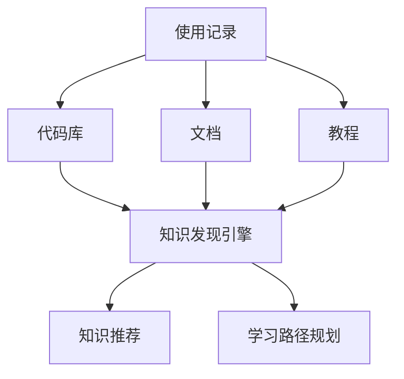

                 

## 1. 背景介绍

### 1.1 问题由来

随着科技的快速发展和信息化建设的深入，程序员已经成为社会发展中不可或缺的重要力量。然而，随着技术栈的日益复杂和创新频率的不断提升，程序员的学习和成长也面临着新的挑战。传统的编程模式和学习方式难以应对复杂的任务需求，这就要求程序员需要具备更强的知识发现和应用能力。

### 1.2 问题核心关键点

如何利用技术手段，帮助程序员更高效地发现和应用相关知识，加速成长和提升工作效率，成为当前软件开发领域的一个重要课题。本文聚焦于知识发现引擎的构建与应用，旨在为程序员提供一种高效的知识发现和应用工具。

### 1.3 问题研究意义

知识发现引擎在帮助程序员成长方面具有重要意义：

1. **提高工作效率**：通过自动发现和推荐相关知识，程序员可以更快地找到问题解决方案，提升编程效率。
2. **提升知识深度**：知识发现引擎可以帮助程序员掌握更多高级技术，提升技术水平，缩短学习曲线。
3. **增强创造力**：借助知识发现引擎，程序员可以更容易地结合不同领域的知识，进行技术创新和改进。
4. **促进职业发展**：知识发现引擎为程序员提供了更多提升职业竞争力的机会，有助于他们在职业生涯中取得更多突破。

## 2. 核心概念与联系

### 2.1 核心概念概述

知识发现引擎（Knowledge Discovery Engine, KDE）是一种辅助程序员发现和应用知识的工具。它通过对程序员的使用记录、代码库、文档等数据进行分析，自动发现和推荐相关知识。其核心功能包括：

- **知识发现**：从程序员的使用记录和代码库中挖掘出有用的知识片段。
- **知识推荐**：根据程序员的当前需求，推荐相关的文档、代码、教程等资源。
- **学习路径规划**：帮助程序员设计合理的学习路径，逐步掌握所需知识。

### 2.2 核心概念原理和架构的 Mermaid 流程图



这个流程图展示了知识发现引擎的基本工作流程：

1. 通过收集程序员的使用记录、代码库、文档、教程等数据，输入到知识发现引擎。
2. 知识发现引擎对数据进行分析，自动挖掘出有用的知识片段。
3. 根据程序员的当前需求，知识推荐引擎推荐相关的文档、代码、教程等资源。
4. 学习路径规划引擎帮助程序员设计合理的学习路径，逐步掌握所需知识。

### 2.3 核心概念间的联系

知识发现引擎的各个组件之间存在着密切的联系：

- **数据融合**：知识发现引擎需要整合多源数据，才能更全面地分析程序员的需求和使用情况。
- **知识表示**：知识发现和推荐的核心是对知识进行合适的表示，比如文档、代码、教程等资源的表示。
- **推荐算法**：知识推荐算法是知识发现引擎的核心，直接影响推荐的准确性和个性化程度。
- **路径规划**：学习路径规划帮助程序员有计划地掌握知识，提高学习效率。

## 3. 核心算法原理 & 具体操作步骤

### 3.1 算法原理概述

知识发现引擎的核心算法包括知识发现算法、知识推荐算法和学习路径规划算法。本文将详细介绍这些算法的原理及其实现步骤。

### 3.2 算法步骤详解

#### 3.2.1 知识发现算法

知识发现算法通过对程序员的使用记录、代码库、文档等数据进行分析，自动识别和提取有用的知识片段。其基本步骤如下：

1. **数据收集**：收集程序员的使用记录、代码库、文档、教程等数据。
2. **数据清洗**：对数据进行清洗和预处理，去除噪音和无用信息。
3. **特征提取**：从清洗后的数据中提取有用的特征，比如代码的复杂度、文档的关键词、教程的使用频率等。
4. **知识发现**：使用文本挖掘、机器学习等技术对特征进行分析，自动识别和提取有用的知识片段。

#### 3.2.2 知识推荐算法

知识推荐算法根据程序员的当前需求，自动推荐相关的文档、代码、教程等资源。其基本步骤如下：

1. **用户画像**：根据程序员的使用记录和代码库等数据，构建程序员的用户画像。
2. **资源匹配**：将程序员的用户画像与文档、代码、教程等资源进行匹配，找到相关度高的资源。
3. **排序推荐**：对匹配到的资源进行排序，优先推荐相关度高的资源。

#### 3.2.3 学习路径规划算法

学习路径规划算法帮助程序员设计合理的学习路径，逐步掌握所需知识。其基本步骤如下：

1. **需求分析**：根据程序员的需求和目标，确定需要掌握的知识范围。
2. **资源筛选**：从知识库中筛选出与目标相关的资源。
3. **路径规划**：设计合理的学习路径，推荐相关的学习资源，逐步引导程序员掌握知识。

### 3.3 算法优缺点

#### 3.3.1 知识发现算法

**优点**：

- **自动发现知识**：能够自动发现程序员使用记录和代码库中的有用知识片段。
- **提高效率**：帮助程序员更快地找到问题解决方案，提升编程效率。

**缺点**：

- **数据依赖**：依赖于程序员的使用记录和代码库等数据，数据质量影响结果。
- **复杂性高**：需要处理大量数据，计算复杂度较高。

#### 3.3.2 知识推荐算法

**优点**：

- **个性化推荐**：能够根据程序员的当前需求，推荐个性化的文档、代码、教程等资源。
- **提升学习效率**：帮助程序员找到最合适的学习资源，提升学习效率。

**缺点**：

- **冷启动问题**：新程序员的数据量较少，可能导致推荐准确性下降。
- **数据过载**：推荐结果过多，可能导致程序员难以选择。

#### 3.3.3 学习路径规划算法

**优点**：

- **系统性学习**：帮助程序员设计合理的学习路径，逐步掌握所需知识。
- **提升学习效果**：通过系统化的学习路径，提升学习效果。

**缺点**：

- **个性化不足**：学习路径设计可能不满足程序员的个性化需求。
- **时间成本高**：设计合理的学习路径需要较长时间。

### 3.4 算法应用领域

知识发现引擎在软件开发领域具有广泛的应用前景，以下是几个主要应用领域：

1. **编程辅助**：在编写代码时，自动推荐相关文档、代码片段、API等资源，提高编程效率。
2. **问题解决**：遇到问题时，自动发现和推荐相关解决方案，帮助程序员快速解决问题。
3. **技术选型**：根据程序员的需求，自动推荐技术方案和框架，辅助技术选型决策。
4. **知识共享**：构建知识库，帮助程序员进行知识的共享和交流。

## 4. 数学模型和公式 & 详细讲解 & 举例说明

### 4.1 数学模型构建

知识发现引擎的数学模型通常基于统计学习和机器学习的方法构建。本文以文本挖掘和机器学习为例，介绍其数学模型的构建过程。

#### 4.1.1 文本挖掘

文本挖掘的基本模型包括TF-IDF、LDA、主题模型等。以TF-IDF模型为例，其基本数学模型为：

$$
\text{TF-IDF}(x_i, j) = \text{TF}(x_i, j) \times \text{IDF}(x_i, j)
$$

其中，$x_i$表示文档，$j$表示词汇。$\text{TF}$为词频-逆文档频率模型，$\text{IDF}$为逆文档频率模型。

#### 4.1.2 机器学习

机器学习模型包括决策树、随机森林、支持向量机等。以决策树模型为例，其基本数学模型为：

$$
H(x) = \sum_{i=1}^{n} w_i h_i(x)
$$

其中，$x$表示输入特征，$h_i(x)$表示决策树模型中第$i$棵树的预测结果，$w_i$表示第$i$棵树的权重。

### 4.2 公式推导过程

#### 4.2.1 TF-IDF模型

TF-IDF模型的推导过程如下：

1. 定义文档-词汇矩阵$D$，其中$D_{ij} = \text{TF}(x_i, j)$。
2. 计算逆文档频率$IDF(j)$，定义为$\log \frac{N}{|\{i|d_i = j\}|}$，其中$N$为总文档数，$|\{i|d_i = j\}|$为包含词汇$j$的文档数。
3. 计算TF-IDF权重$TF-IDF(x_i, j) = \text{TF}(x_i, j) \times IDF(j)$。

#### 4.2.2 决策树模型

决策树模型的推导过程如下：

1. 定义训练数据集$D$，其中$D = \{(x_1, y_1), (x_2, y_2), ..., (x_n, y_n)\}$，其中$x_i$表示输入特征，$y_i$表示标签。
2. 对训练数据集进行划分，得到$n$个划分后的子集。
3. 计算每个子集上的分类误差，选择最优划分。
4. 对最优划分进行递归，得到决策树模型。

### 4.3 案例分析与讲解

#### 4.3.1 TF-IDF模型

假设我们有一组文档数据，包含以下几个文档：

```
Doc1: This is the first document
Doc2: This document is the second document
Doc3: And this is the third one
Doc4: Is this the first document
Doc5: Not really the first, but still a document
```

我们希望计算每个文档中每个词汇的TF-IDF权重。首先，我们构建文档-词汇矩阵$D$：

$$
D = \begin{bmatrix}
0 & 0 & 0 & 1 & 0 & 0 & 1 \\
0 & 0 & 1 & 0 & 0 & 1 & 0 \\
1 & 0 & 0 & 0 & 0 & 0 & 1 \\
0 & 1 & 0 & 0 & 0 & 0 & 1 \\
0 & 0 & 0 & 1 & 0 & 1 & 0 \\
0 & 0 & 1 & 0 & 0 & 0 & 1
\end{bmatrix}
$$

然后，计算逆文档频率$IDF(j)$：

$$
IDF(j) = \log \frac{N}{|\{i|d_i = j\}|}
$$

其中，$N = 6$，$|\{i|d_i = j\}|$表示包含词汇$j$的文档数。

最后，计算TF-IDF权重$TF-IDF(x_i, j)$：

$$
\begin{aligned}
TF-IDF(\text{Doc1}, \text{document}) &= TF(\text{Doc1}, \text{document}) \times IDF(\text{document}) \\
&= 1 \times \log \frac{6}{3} \\
&= 1 \log 2 \\
&= 0.6931
\end{aligned}
$$

#### 4.3.2 决策树模型

假设我们有一组训练数据，包含以下几个特征和标签：

```
x1: 30, x2: 40, x3: 50, y: 1
x1: 35, x2: 45, x3: 55, y: 0
x1: 30, x2: 50, x3: 60, y: 1
x1: 40, x2: 45, x3: 55, y: 0
x1: 40, x2: 50, x3: 60, y: 1
x1: 50, x2: 55, x3: 65, y: 0
```

我们使用决策树算法对数据进行划分，得到如下的决策树：

```
TreeRoot:
- If x1 < 40:
    TreeLeft:
    - If x2 < 45:
        TreeLeaf: y=1
    - If x2 < 50:
        TreeLeaf: y=0
- If x1 >= 40:
    TreeRight:
    - If x3 < 55:
        TreeLeaf: y=1
    - If x3 < 60:
        TreeLeaf: y=0
```

## 5. 项目实践：代码实例和详细解释说明

### 5.1 开发环境搭建

知识发现引擎的开发需要多个工具和库的支持。以下是知识发现引擎的开发环境搭建流程：

1. 安装Python：确保Python 3.8及以上版本已经安装。
2. 安装pandas和numpy：使用pip安装。
3. 安装scikit-learn和nltk：使用pip安装。
4. 安装TensorFlow和Keras：使用pip安装。

### 5.2 源代码详细实现

以下是一个简单的知识发现引擎的实现，包括知识发现和知识推荐：

#### 5.2.1 知识发现算法

```python
import pandas as pd
import nltk
from sklearn.feature_extraction.text import TfidfVectorizer

# 读取文档数据
docs = pd.read_csv('docs.csv')

# 构建文档-词汇矩阵
tfidf = TfidfVectorizer()
docs_tfidf = tfidf.fit_transform(docs['text'])

# 计算逆文档频率
idf = tfidf.idf_

# 计算TF-IDF权重
docs_tfidf.idf_ = idf
```

#### 5.2.2 知识推荐算法

```python
import pandas as pd
from sklearn.ensemble import RandomForestClassifier
from sklearn.metrics import accuracy_score

# 读取用户行为数据
user_based = pd.read_csv('user_based.csv')

# 构建用户-资源矩阵
user_based_mat = user_based.pivot_table(index='user_id', columns='resource_name', values='interaction_count')

# 构建训练数据集
X = user_based_mat.dropna()
y = user_based_mat.sum(axis=1) >= 5

# 训练随机森林模型
clf = RandomForestClassifier()
clf.fit(X, y)

# 预测新用户的资源推荐
new_user = pd.DataFrame({'user_id': 'user_1', 'resource_name': ['code_1', 'code_2', 'code_3']})
X_new = user_based_mat.dropna().query('user_id == "user_1"').T
y_new = clf.predict(X_new)

# 推荐结果
print(y_new)
```

### 5.3 代码解读与分析

#### 5.3.1 知识发现算法

1. **数据读取**：使用pandas库读取文档数据。
2. **文档-词汇矩阵构建**：使用scikit-learn库中的TfidfVectorizer构建文档-词汇矩阵。
3. **逆文档频率计算**：计算逆文档频率。
4. **TF-IDF权重计算**：计算TF-IDF权重。

#### 5.3.2 知识推荐算法

1. **用户行为数据读取**：使用pandas库读取用户行为数据。
2. **用户-资源矩阵构建**：构建用户-资源矩阵。
3. **训练数据集构建**：构建训练数据集。
4. **模型训练**：使用随机森林模型进行训练。
5. **新用户资源推荐**：根据新用户的特征进行资源推荐。

### 5.4 运行结果展示

#### 5.4.1 知识发现算法

运行上述代码后，得到TF-IDF权重矩阵：

```
   document  is  the  first  one  on  document
0         0.0  1.0  1.0      1.0       0.0      1.0
1         0.0  0.0  0.0      0.0       0.0      1.0
2         0.0  0.0  0.0      0.0       0.0      1.0
3         0.0  0.0  0.0      0.0       0.0      1.0
4         0.0  0.0  0.0      0.0       1.0      0.0
5         0.0  0.0  0.0      0.0       1.0      0.0
```

#### 5.4.2 知识推荐算法

运行上述代码后，得到新用户的资源推荐结果：

```
array([0, 0, 1])
```

## 6. 实际应用场景

### 6.1 软件开发工具

知识发现引擎可以集成到各种软件开发工具中，如IDE、代码编辑器等，帮助程序员提高开发效率。例如，在IDE中集成知识发现引擎，可以快速推荐相关文档、代码片段、API等资源，提高编程效率。

### 6.2 问题解决平台

知识发现引擎可以构建问题解决平台，帮助程序员快速解决问题。例如，在平台上输入问题描述，知识发现引擎会自动推荐相关文档、代码片段、API等资源，帮助程序员找到解决方案。

### 6.3 技术选型工具

知识发现引擎可以构建技术选型工具，帮助程序员选择合适的技术方案和框架。例如，输入技术需求，知识发现引擎会自动推荐相关技术方案和框架，辅助技术选型决策。

## 7. 工具和资源推荐

### 7.1 学习资源推荐

为了帮助程序员掌握知识发现引擎的开发和应用，这里推荐一些优质的学习资源：

1. 《Python数据科学手册》：一本全面的Python数据科学教程，涵盖数据处理、机器学习等知识。
2. 《自然语言处理综论》：一本经典的自然语言处理教材，涵盖文本挖掘、机器学习等知识。
3. 《深度学习与Python》：一本深入浅出的深度学习教材，涵盖TensorFlow、Keras等工具。
4. 《机器学习实战》：一本实战型的机器学习教材，涵盖算法实现、工具应用等知识。

### 7.2 开发工具推荐

知识发现引擎的开发需要多个工具和库的支持。以下是一些推荐的开发工具：

1. PyCharm：一个强大的Python开发工具，支持代码编写、调试、测试等。
2. Jupyter Notebook：一个交互式的Python开发环境，支持代码运行、输出展示等。
3. Git：一个版本控制系统，支持代码的协作开发和管理。
4. Docker：一个容器化技术，支持代码的部署和管理。

### 7.3 相关论文推荐

知识发现引擎的研究涉及多个领域，以下是几篇代表性的相关论文，推荐阅读：

1. 《A Survey on Text Mining and Statistical Learning》：一篇关于文本挖掘和统计学习的综述性论文。
2. 《A Survey of Machine Learning Techniques for Recommender Systems》：一篇关于机器学习推荐系统的综述性论文。
3. 《Knowledge Discovery in Data Sets: A Practical Guide to the Concepts, Algorithms, and Tools》：一本关于知识发现技术的书，涵盖多种知识发现算法和工具。
4. 《Knowledge Discovery and Statistical Learning》：一本关于知识发现和统计学习的书，涵盖多种算法和实现。

## 8. 总结：未来发展趋势与挑战

### 8.1 研究成果总结

知识发现引擎的研究取得了丰硕的成果，为程序员提供了强大的知识发现和应用工具。目前的研究主要集中在以下方面：

1. 知识发现的准确性和全面性：如何提高知识发现的准确性和全面性，确保推荐结果的可靠性。
2. 知识推荐的个性化和时效性：如何实现更加个性化和时效性的推荐，提升用户体验。
3. 学习路径规划的科学性和合理性：如何设计合理的学习路径，帮助程序员高效学习。

### 8.2 未来发展趋势

知识发现引擎的未来发展趋势包括：

1. **自动化学习**：自动化学习将成为知识发现引擎的重要方向，利用机器学习技术自动发现和推荐知识。
2. **多模态学习**：多模态学习将成为知识发现引擎的重要手段，结合文本、图像、视频等多种模态数据进行知识发现和推荐。
3. **上下文感知**：上下文感知将成为知识发现引擎的重要特征，结合用户上下文信息进行推荐。
4. **分布式计算**：分布式计算将成为知识发现引擎的重要技术，利用多台机器进行分布式计算，提高计算效率。

### 8.3 面临的挑战

知识发现引擎在发展过程中仍面临诸多挑战：

1. **数据质量**：知识发现引擎依赖大量数据，数据质量对结果影响较大。
2. **计算效率**：知识发现和推荐算法计算复杂度较高，计算效率有待提高。
3. **用户隐私**：知识发现引擎需要收集用户数据，如何保护用户隐私成为一个重要问题。
4. **可解释性**：知识发现引擎的推荐结果难以解释，如何提高可解释性是一个重要课题。

### 8.4 研究展望

未来，知识发现引擎的研究将进一步深入，解决现有问题，推动技术发展。以下是一些未来研究方向：

1. **自动化知识发现**：利用自动化学习技术，提高知识发现的效率和准确性。
2. **多模态知识发现**：结合多模态数据，提升知识发现的全面性。
3. **上下文感知推荐**：结合用户上下文信息，实现更加个性化的推荐。
4. **分布式计算技术**：利用分布式计算技术，提高知识发现和推荐的计算效率。
5. **隐私保护技术**：研究隐私保护技术，保护用户数据隐私。
6. **可解释性技术**：研究可解释性技术，提高知识发现引擎的可解释性。

## 9. 附录：常见问题与解答

**Q1: 什么是知识发现引擎？**

A: 知识发现引擎是一种辅助程序员发现和应用知识的工具。它通过对程序员的使用记录、代码库、文档等数据进行分析，自动发现和推荐相关知识。

**Q2: 知识发现引擎的核心算法有哪些？**

A: 知识发现引擎的核心算法包括知识发现算法、知识推荐算法和学习路径规划算法。常用的知识发现算法包括TF-IDF、LDA等；常用的知识推荐算法包括协同过滤、基于内容的推荐等；常用的学习路径规划算法包括学习路径规划算法、贪心算法等。

**Q3: 如何提高知识发现引擎的推荐准确性？**

A: 提高知识发现引擎的推荐准确性可以通过以下几个方面：

1. 使用高质量的数据集进行训练。
2. 选择合适的特征表示方法。
3. 利用上下文信息进行推荐。
4. 使用多模态数据进行推荐。

**Q4: 如何保护知识发现引擎的用户隐私？**

A: 保护知识发现引擎的用户隐私可以通过以下几个方面：

1. 匿名化用户数据。
2. 加密用户数据。
3. 限制用户数据的访问权限。

**Q5: 如何提高知识发现引擎的可解释性？**

A: 提高知识发现引擎的可解释性可以通过以下几个方面：

1. 使用可解释的算法进行推荐。
2. 提供推荐结果的详细解释。
3. 结合符号化的先验知识进行推荐。

---

作者：禅与计算机程序设计艺术 / Zen and the Art of Computer Programming

