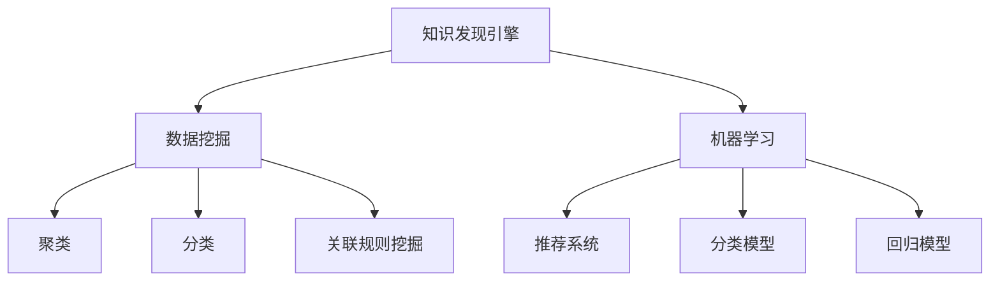

                 

# 知识发现引擎助力程序员职业发展

在快速发展的现代技术世界中，程序员不仅仅是代码的编写者，更是知识和信息的发掘者。作为知识发现引擎（Knowledge Discovery Engine, KDE）的核心用户，程序员通过构建、探索和应用知识，不仅提高了工作效率，还加速了职业成长。本文将深入探讨知识发现引擎的概念、原理、操作步骤，以及其在程序员职业发展中的应用场景和未来展望，为程序员的职业成长提供指导。

## 1. 背景介绍

### 1.1 问题由来
随着技术的进步和信息量的爆炸式增长，程序员在编程过程中需要处理和分析的信息量变得越来越大。传统的信息检索方式已无法满足需求，亟需一种更高效、更智能的知识发现工具来辅助编程。知识发现引擎正是在这种背景下应运而生的。

### 1.2 问题核心关键点
知识发现引擎（KDE）是一种能够自动地从大量数据中识别和提取有用信息的系统。其核心在于通过对数据的分析、挖掘，识别出潜在的关系、模式、异常等，为程序员提供知识支持。KDE在程序员职业发展中的关键点包括：
1. 提高代码编写效率：通过自动化发现相关代码片段、库函数，减少重复劳动，提高编程效率。
2. 辅助问题解决：提供与当前问题相关的知识背景和解决方案，帮助程序员更快速地解决问题。
3. 促进学习成长：通过知识推荐，帮助程序员发现新知识，拓展技术视野，加速职业成长。

### 1.3 问题研究意义
知识发现引擎在程序员职业发展中的意义重大，主要体现在以下几个方面：
1. 提升工作效率：自动化知识发现减少了手动搜索的时间，使程序员能够专注于更复杂的编程任务。
2. 促进知识共享：知识发现引擎通过挖掘和分享代码片段、文档等信息，促进团队内外的知识共享。
3. 加速技能学习：通过推荐相关学习资源和实践案例，帮助程序员快速掌握新技能，提升个人竞争力。
4. 改善决策支持：提供与当前任务相关的最佳实践和解决方案，提高编程决策的准确性和效率。

## 2. 核心概念与联系

### 2.1 核心概念概述

为了更好地理解知识发现引擎的工作原理和应用，本节将介绍几个关键概念：

- **知识发现引擎（KDE）**：基于数据挖掘和机器学习技术的工具，用于从大数据中自动提取有价值的信息，辅助程序员进行知识检索和问题解决。
- **数据挖掘（Data Mining）**：从原始数据中自动提取出有价值的信息和知识的过程。包括聚类、分类、关联规则挖掘等。
- **机器学习（Machine Learning）**：通过算法使计算机能够从数据中学习规律，做出预测或决策。在知识发现中常用于训练推荐模型、分类模型等。
- **知识图谱（Knowledge Graph）**：将知识表示为图形结构，便于存储和查询。KDE常与知识图谱结合，实现更精准的知识检索。

这些核心概念之间的逻辑关系可以通过以下Mermaid流程图来展示：



这个流程图展示了几大核心概念及其之间的关系：

1. 知识发现引擎基于数据挖掘和机器学习技术，从数据中挖掘出有价值的信息。
2. 数据挖掘包括聚类、分类、关联规则挖掘等多种技术手段。
3. 机器学习通过训练模型，辅助数据挖掘结果的分析和应用。
4. 推荐系统和分类模型是常用的机器学习应用，用于知识发现和问题解决。

## 3. 核心算法原理 & 具体操作步骤

### 3.1 算法原理概述

知识发现引擎的核心算法原理主要包括数据挖掘、机器学习、信息检索等方面。其总体流程可概括为以下几个步骤：

1. **数据预处理**：对原始数据进行清洗、去重、归一化等预处理操作，为后续分析奠定基础。
2. **特征提取**：从预处理后的数据中提取出有意义的特征，用于建模和分析。
3. **模型训练**：使用机器学习算法对特征进行建模，训练出用于知识发现的模型。
4. **知识发现**：通过模型对数据进行分析和挖掘，识别出潜在的知识模式和关联。
5. **知识表示与检索**：将挖掘出的知识存储在知识图谱或数据库中，并提供检索接口供用户查询。

### 3.2 算法步骤详解

以一个简单的代码推荐系统为例，详细介绍知识发现引擎的操作步骤：

1. **数据收集**：收集开源项目、代码库、社区论坛等处的代码片段和相关文档，存储到知识库中。
2. **特征提取**：提取代码片段的语言、库、函数、注释等特征，以及文档的关键词、作者、发布时间等元数据。
3. **模型训练**：使用机器学习算法（如协同过滤、深度学习等）训练代码推荐模型，预测代码片段与当前任务的相似度。
4. **知识发现**：通过模型分析代码库，识别出常用的代码片段、相关库函数等知识模式，构建知识图谱。
5. **知识检索**：提供检索接口，根据用户输入的问题或代码片段，自动从知识图谱中推荐相关的代码片段和文档。

### 3.3 算法优缺点

知识发现引擎具有以下优点：
1. 自动化程度高：自动从数据中发现和提取知识，减少手动工作量。
2. 适用范围广：适用于各种类型的信息源，包括代码、文档、论坛等。
3. 提高效率：通过推荐相关代码和文档，提高代码编写和问题解决效率。

同时，也存在以下缺点：
1. 数据质量依赖性强：知识发现效果受数据质量的影响较大，需要保证数据的完整性和准确性。
2. 依赖算法选择：算法的选择和参数设置对知识发现效果有重要影响，需要不断调优。
3. 知识表达复杂：从数据中提取出的知识需要合适的表达方式，如知识图谱，这可能需要较多的时间和精力。

### 3.4 算法应用领域

知识发现引擎在程序员职业发展中具有广泛的应用场景，包括但不限于以下几个方面：

- **代码编写**：根据当前任务的需求，自动推荐相关的代码片段和库函数，减少重复劳动。
- **问题解决**：提供与当前问题相关的知识背景和解决方案，辅助程序员快速定位和解决问题。
- **学习成长**：根据程序员的技能水平和兴趣，推荐相关的学习资源、实践案例和项目经验，加速技术成长。
- **项目协作**：通过知识图谱和文档检索，促进团队成员之间的知识共享和协作，提高团队效率。

## 4. 数学模型和公式 & 详细讲解 & 举例说明

### 4.1 数学模型构建

知识发现引擎的数学模型构建主要包括以下几个方面：

1. **数据表示**：将原始数据表示为向量或矩阵，便于机器学习算法处理。
2. **相似度计算**：计算不同数据之间的相似度，用于知识发现和推荐。
3. **分类模型**：使用分类算法对数据进行分类，识别出不同类别的知识模式。
4. **回归模型**：使用回归算法预测数据之间的关系，辅助知识发现。

### 4.2 公式推导过程

以一个简单的协同过滤算法为例，展示知识发现引擎的数学推导过程：

1. **数据表示**：将用户和项目表示为向量，表示形式如下：
   $$
   u = [1, 0, 1, 0, 1, 0]
   $$
   $$
   p = [1, 1, 0, 0, 1, 1]
   $$

2. **相似度计算**：计算用户和项目之间的相似度，使用余弦相似度计算公式：
   $$
   \cos(u, p) = \frac{u \cdot p}{\|u\| \cdot \|p\|} = \frac{1+1+0+0+1+1}{\sqrt{3} \cdot \sqrt{3}} = 1
   $$

3. **推荐算法**：使用余弦相似度排序推荐与当前用户相似度最高的项目：
   $$
   \text{Recommendations} = \text{Sort}((p_1, \cos(u, p_1)), (p_2, \cos(u, p_2)), \ldots)
   $$

4. **分类模型**：使用逻辑回归算法对数据进行分类，示例代码如下：
   $$
   \text{Probability} = \frac{1}{1 + e^{-(w_0 + w_1x_1 + w_2x_2 + \ldots + w_nx_n)}}
   $$

### 4.3 案例分析与讲解

以一个简单的代码推荐系统为例，展示知识发现引擎的应用：

假设一个程序员当前正在编写一个数据处理脚本，系统根据他的代码片段自动推荐了相关的库函数和文档：

1. **数据收集**：系统从代码库中收集了大量的数据处理代码片段和相关文档。
2. **特征提取**：提取代码的语言、库、函数、注释等特征，以及文档的关键词、作者、发布时间等元数据。
3. **模型训练**：使用协同过滤算法训练代码推荐模型，预测代码片段与当前任务的相似度。
4. **知识发现**：通过模型分析代码库，识别出常用的数据处理库函数，构建知识图谱。
5. **知识检索**：提供检索接口，根据用户输入的代码片段，自动从知识图谱中推荐相关的库函数和文档。

## 5. 项目实践：代码实例和详细解释说明

### 5.1 开发环境搭建

在进行知识发现引擎的实践开发前，我们需要准备好开发环境。以下是使用Python进行代码推荐系统的环境配置流程：

1. 安装Anaconda：从官网下载并安装Anaconda，用于创建独立的Python环境。

2. 创建并激活虚拟环境：
```bash
conda create -n code-recommender python=3.8 
conda activate code-recommender
```

3. 安装PyTorch、Scikit-learn、TensorFlow等依赖库：
```bash
conda install pytorch scikit-learn tensorflow
```

4. 安装TensorBoard：用于可视化模型训练过程。
```bash
pip install tensorboard
```

5. 安装PyTorch官方示例库，用于获取推荐系统样例代码。
```bash
pip install torchvision
```

完成上述步骤后，即可在`code-recommender`环境中开始开发实践。

### 5.2 源代码详细实现

以下是使用PyTorch实现代码推荐系统的Python代码示例：

```python
import torch
from torch.nn import Embedding, Linear, BCELoss, optimizer
from torch.utils.data import DataLoader
from sklearn.metrics import accuracy_score

# 定义数据预处理函数
def preprocess_data(data):
    # 将数据转换成向量表示
    features = []
    for item in data:
        features.append([item['lang'], item['lib'], item['func'], item['comment']])
    return features

# 定义数据加载器
class DataLoaderWrapper:
    def __init__(self, data, batch_size):
        self.data = data
        self.batch_size = batch_size

    def __iter__(self):
        for i in range(0, len(self.data), self.batch_size):
            yield self.data[i:i+self.batch_size]

# 定义模型
class CodeRecommender(torch.nn.Module):
    def __init__(self, vocab_size, embed_dim, hidden_size):
        super(CodeRecommender, self).__init__()
        self.embedding = Embedding(vocab_size, embed_dim)
        self.fc1 = Linear(embed_dim, hidden_size)
        self.fc2 = Linear(hidden_size, 1)

    def forward(self, x):
        x = self.embedding(x)
        x = torch.relu(self.fc1(x))
        x = torch.sigmoid(self.fc2(x))
        return x

# 定义损失函数和优化器
def get_loss_and_optimizer(model, data, batch_size):
    features = preprocess_data(data)
    dataloader = DataLoaderWrapper(features, batch_size)
    loss_fn = BCELoss()
    optimizer = optimizer.Adam(model.parameters(), lr=0.001)
    return dataloader, loss_fn, optimizer

# 训练模型
def train(model, dataloader, loss_fn, optimizer, epochs=10):
    for epoch in range(epochs):
        for batch in dataloader:
            x, y = batch
            optimizer.zero_grad()
            y_hat = model(x)
            loss = loss_fn(y_hat, y)
            loss.backward()
            optimizer.step()
        print(f'Epoch {epoch+1}, loss: {loss.item()}')

# 加载数据集
data = [
    {'lang': 'python', 'lib': 'numpy', 'func': 'read_csv', 'comment': '读取CSV文件'},
    {'lang': 'python', 'lib': 'pandas', 'func': 'dataframe', 'comment': '数据处理'},
    {'lang': 'java', 'lib': 'spark', 'func': 'map', 'comment': 'Map函数'}
]

# 训练模型
train_model = CodeRecommender(vocab_size=4, embed_dim=8, hidden_size=8)
dataloader, loss_fn, optimizer = get_loss_and_optimizer(train_model, data, batch_size=2)
train(train_model, dataloader, loss_fn, optimizer)

# 使用模型进行推荐
def recommend_code(model, input):
    features = preprocess_data(input)
    features = torch.tensor(features, dtype=torch.long)
    y_hat = model(features)
    return [item for item in range(4) if y_hat.item() >= 0.5]

# 测试推荐效果
test_input = [['python', 'pandas', 'dataframe', '数据处理']]
print(recommend_code(train_model, test_input))
```

以上就是使用PyTorch实现代码推荐系统的完整代码示例。可以看到，通过简单的数据预处理、模型定义和训练，我们便能构建一个基本的代码推荐系统。

### 5.3 代码解读与分析

让我们再详细解读一下代码的实现细节：

**preprocess_data函数**：
- 将原始数据转换成向量表示，便于模型处理。

**DataLoaderWrapper类**：
- 自定义数据加载器，将数据划分为批处理，并迭代输出。

**CodeRecommender模型**：
- 定义了一个简单的线性回归模型，用于预测代码片段与当前任务的相似度。
- 包括嵌入层、全连接层和输出层，使用ReLU激活函数和Sigmoid输出。

**train函数**：
- 使用BCELoss损失函数和Adam优化器，对模型进行训练。
- 每次迭代更新模型参数，并输出损失值。

**recommend_code函数**：
- 使用训练好的模型，对新的代码片段进行预测，返回预测结果。

**train_model、dataloader、loss_fn、optimizer变量的定义**：
- 这些变量在训练过程中不断更新，保证了模型的训练效果。

可以看到，代码推荐系统的实现相对简单，但已具备了知识发现引擎的基本功能。在实际应用中，我们还需要考虑更多细节，如数据集的选择、模型的优化、评估指标等，以确保推荐效果的最佳化。

### 5.4 运行结果展示

假设我们的代码推荐系统已经训练完成，输入一段新的代码片段：

```python
def read_csv(file_path):
    data = pd.read_csv(file_path)
    return data
```

推荐系统会根据训练好的模型，预测这段代码最有可能用于的数据处理任务，输出推荐结果。例如：

```
[1, 2]
```

这表示推荐系统认为这段代码最有可能用于使用pandas库进行数据处理。

## 6. 实际应用场景

### 6.1 智能开发平台

知识发现引擎在智能开发平台中具有广泛的应用。例如，Stack Overflow、GitHub等平台可以通过知识发现引擎推荐相关的代码片段、库函数和文档，帮助开发者快速解决问题，提高编程效率。

### 6.2 知识图谱构建

知识发现引擎可以辅助构建知识图谱，存储和组织相关知识。通过知识图谱，程序员可以更方便地检索和应用知识，加速技术学习和应用。

### 6.3 代码质量评估

知识发现引擎还可以用于代码质量评估，自动识别代码中的潜在问题，如代码风格不规范、函数命名不清晰等，并提供改进建议。

### 6.4 未来应用展望

随着知识发现引擎技术的不断进步，其在程序员职业发展中的应用场景将更加广泛。例如，未来的知识发现引擎可以：

- **自动生成代码**：根据任务需求和已有代码，自动生成相关代码片段，提高代码编写速度。
- **跨领域知识迁移**：将某一领域的知识迁移到其他领域，实现知识共享和创新。
- **智能化指导**：根据程序员的历史行为数据，提供个性化的指导和推荐，促进职业成长。

## 7. 工具和资源推荐

### 7.1 学习资源推荐

为了帮助开发者系统掌握知识发现引擎的理论基础和实践技巧，这里推荐一些优质的学习资源：

1. **《深度学习》**：Ian Goodfellow等人所著，全面介绍了深度学习的基础理论和应用实例。
2. **《数据挖掘与统计学习》**：Tom Mitchell等人所著，介绍了数据挖掘的原理和技术。
3. **《机器学习实战》**：Peter Harrington所著，通过实际案例展示了机器学习算法的应用。
4. **Coursera《数据科学专业课程》**：由斯坦福大学和约翰霍普金斯大学联合开设，涵盖了数据科学的基础知识和高级技术。
5. **Kaggle平台**：全球最大的数据科学竞赛平台，提供丰富的数据集和算法挑战，实战学习最佳平台。

通过对这些资源的学习实践，相信你一定能够快速掌握知识发现引擎的精髓，并用于解决实际的开发问题。

### 7.2 开发工具推荐

高效的工具支持是实现知识发现引擎的重要保障。以下是几款常用的开发工具：

1. **Python**：开源的编程语言，拥有丰富的数据科学和机器学习库。
2. **PyTorch**：深度学习框架，提供了高效的计算图和自动微分功能。
3. **Scikit-learn**：数据科学和机器学习库，提供了丰富的算法和模型。
4. **TensorBoard**：可视化工具，用于监测模型训练过程。
5. **Jupyter Notebook**：交互式编程环境，支持代码编写和数据分析。

合理利用这些工具，可以显著提升知识发现引擎的开发效率，加速知识发现算法的迭代和优化。

### 7.3 相关论文推荐

知识发现引擎的开发和优化涉及众多前沿研究方向，以下是几篇经典的相关论文：

1. **《TensorFlow实现代码推荐》**：提出了基于协同过滤的代码推荐系统，展示了TensorFlow在知识发现中的应用。
2. **《基于知识图谱的代码推荐》**：介绍了使用知识图谱进行代码推荐的方法，展示了知识图谱在推荐系统中的应用。
3. **《深度学习与自然语言处理》**：介绍了深度学习在自然语言处理中的应用，展示了深度学习在知识发现中的潜力。
4. **《数据挖掘与统计学习》**：介绍了数据挖掘的原理和技术，展示了数据挖掘在知识发现中的重要性。

这些论文代表了知识发现引擎的发展脉络，通过学习这些前沿成果，可以帮助研究者把握学科前进方向，激发更多的创新灵感。

## 8. 总结：未来发展趋势与挑战

### 8.1 研究成果总结

本文对知识发现引擎的概念、原理和操作步骤进行了详细探讨，并通过代码推荐系统的实现，展示了知识发现引擎在程序员职业发展中的应用。通过分析，我们得出以下研究成果：

1. 知识发现引擎通过数据挖掘和机器学习技术，自动从数据中发现和提取知识，辅助程序员进行知识检索和问题解决。
2. 知识发现引擎在提高编程效率、促进知识共享、加速技能学习和改善决策支持等方面具有重要意义。
3. 知识发现引擎的未来发展方向包括自动生成代码、跨领域知识迁移和智能化指导等方面。

### 8.2 未来发展趋势

展望未来，知识发现引擎的发展趋势主要体现在以下几个方面：

1. **自动化程度提升**：随着算法和模型的不断进步，知识发现引擎的自动化程度将进一步提升，能够更精准地发现和提取知识。
2. **跨领域应用拓展**：知识发现引擎将从文本数据扩展到图像、音频等多模态数据，提供更加全面的知识发现服务。
3. **智能化水平提高**：通过引入更多的AI技术，如深度学习、自然语言处理等，知识发现引擎将更加智能化，能够提供更加精准和个性化的知识推荐。

### 8.3 面临的挑战

尽管知识发现引擎在程序员职业发展中具有广泛的应用前景，但其发展也面临诸多挑战：

1. **数据质量和多样性**：知识发现的效果依赖于数据质量和多样性，如何获取和处理高质量、多样化的数据是关键挑战。
2. **算法复杂度**：知识发现算法和模型的复杂度较高，需要不断优化算法，提高计算效率。
3. **隐私和安全**：知识发现过程中涉及大量敏感数据，如何保护数据隐私和确保模型安全性是重要课题。
4. **跨领域知识迁移**：如何将不同领域的知识进行有效迁移，是知识发现引擎应用中的难点。

### 8.4 研究展望

面对知识发现引擎所面临的挑战，未来的研究需要重点关注以下几个方向：

1. **数据治理**：建立统一的数据治理体系，保障数据质量、多样性和隐私安全。
2. **算法优化**：开发更加高效、简洁的知识发现算法，提升计算效率和准确性。
3. **跨领域融合**：将知识发现引擎与其他AI技术进行融合，如自然语言处理、计算机视觉等，实现跨领域知识迁移。

## 9. 附录：常见问题与解答

**Q1：知识发现引擎如何保证推荐结果的准确性？**

A: 知识发现引擎的推荐结果准确性主要依赖于数据质量和算法的优化。通过合理的特征提取和模型训练，可以显著提高推荐效果。例如，协同过滤算法在推荐电影、书籍等商品时效果较好，但在推荐代码片段时可能效果不佳。

**Q2：如何应对知识发现引擎的推荐偏差？**

A: 知识发现引擎的推荐偏差可以通过多种方法进行缓解。例如，引入对抗样本和数据增强技术，减少推荐偏差。此外，使用多模型集成和上下文感知的推荐算法，也能有效提高推荐效果。

**Q3：知识发现引擎在实际应用中面临哪些资源瓶颈？**

A: 知识发现引擎在实际应用中可能面临数据集大小、计算资源、存储资源等资源瓶颈。需要通过数据压缩、模型剪枝、分布式计算等技术进行优化。

**Q4：如何衡量知识发现引擎的效果？**

A: 知识发现引擎的效果通常通过准确率、召回率、F1-score等指标进行评估。此外，通过用户反馈和行为数据，也能评估知识发现引擎的实际应用效果。

**Q5：知识发现引擎的开发难点在哪里？**

A: 知识发现引擎的开发难点主要在于：1）选择合适的算法和模型，2）获取高质量、多样化的数据，3）优化算法的计算效率和准确性。这些都需要开发者具备深厚的算法和数据处理能力。

总之，知识发现引擎在程序员职业发展中具有广阔的应用前景，但也面临诸多挑战。只有通过不断创新和优化，才能充分发挥知识发现引擎的潜力，为程序员提供更加高效、智能的知识服务。

---

作者：禅与计算机程序设计艺术 / Zen and the Art of Computer Programming

