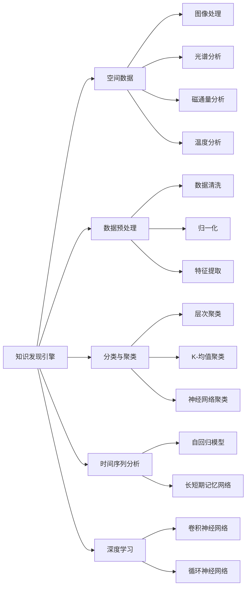

                 

# 知识发现引擎在太空探索中的应用

> 关键词：知识发现引擎, 太空探索, 数据挖掘, 机器学习, 天文观测, 数据预处理

## 1. 背景介绍

### 1.1 问题由来
随着科技的进步和人类探索宇宙的热情高涨，太空探索已经成为全球范围内的重要科学研究领域。然而，浩瀚宇宙中的数据量巨大，传统的空间探测器采集的数据格式和规模也日趋多样化，从天文图像、光谱数据到行星表面勘测信息等，数据类型和维度的复杂性给数据处理和知识提取带来了巨大的挑战。

为了应对这些挑战，研究人员开发了各种数据处理和分析工具。知识发现引擎（Knowledge Discovery Engine, KDE）作为机器学习和数据挖掘领域的重要工具，在太空探索中展现出独特的应用潜力。通过先进的数据分析和机器学习算法，KDE可以自动从复杂的数据中提取有价值的信息，辅助科学家们进行决策，推进太空探索项目的顺利进行。

## 2. 核心概念与联系

### 2.1 核心概念概述

在太空探索中，知识发现引擎主要用于处理来自各类空间探测器的数据，从中挖掘出具有实际应用价值的知识。涉及到的核心概念包括：

- **知识发现引擎**：基于机器学习和数据挖掘技术，自动从大量数据中提取有用信息的智能系统。
- **空间数据**：包括各类探测器采集的图像、光谱、磁通量、温度等数据。
- **数据预处理**：包括数据清洗、归一化、特征提取等预处理步骤，提高后续分析的准确性和效率。
- **分类与聚类**：通过将数据划分为不同的类别或簇，揭示数据的内在结构，辅助科学决策。
- **时间序列分析**：对于时间依赖性数据，利用时间序列分析技术，预测未来趋势，优化任务规划。
- **深度学习**：采用深度神经网络模型，提高数据处理的精度和效率。

这些概念之间紧密联系，共同构成了知识发现引擎在太空探索中的应用基础。

### 2.2 核心概念原理和架构的 Mermaid 流程图



该流程图展示了知识发现引擎的基本架构和流程，从数据收集、预处理到分析输出，详尽反映了其核心功能。

## 3. 核心算法原理 & 具体操作步骤

### 3.1 算法原理概述

知识发现引擎在太空探索中的核心算法原理主要围绕数据挖掘和机器学习展开。其核心目标是从大量的空间数据中，通过数据预处理、特征提取和模型训练等步骤，自动发现并提取有价值的知识信息。

知识发现引擎利用数据挖掘技术，对空间数据进行预处理和分析，利用机器学习算法（如分类、聚类、回归、深度学习等）对数据进行建模，从而实现知识的自动发现和挖掘。

### 3.2 算法步骤详解

以下是知识发现引擎在太空探索中应用的主要算法步骤：

**Step 1: 数据收集与预处理**

1. 数据收集：从各类空间探测器获取原始数据。
2. 数据清洗：去除噪音、填补缺失值、去除异常值。
3. 数据归一化：将不同量级的特征值转换到同一范围，便于后续分析。
4. 特征提取：从原始数据中提取有意义的特征，用于模型训练。

**Step 2: 数据挖掘与建模**

1. 特征选择：选择对分类或预测任务有帮助的特征。
2. 分类与聚类：对特征向量进行分类或聚类，揭示数据的内在结构。
3. 模型训练：利用机器学习算法训练分类器或回归器，得到模型参数。
4. 模型评估：通过交叉验证等方法评估模型性能。

**Step 3: 结果解释与应用**

1. 结果解释：利用可解释性技术，将模型输出转换为可理解的解释，辅助科学家进行决策。
2. 知识应用：将提取的知识应用于任务规划、异常检测、故障诊断等实际应用场景。

### 3.3 算法优缺点

**优点：**
- 自动化处理大规模复杂数据，提高效率。
- 利用先进的数据挖掘和机器学习技术，提取高质量的知识信息。
- 支持多种分析模型，适用于不同类型的太空数据。
- 通过模型评估和调参，优化分析结果的可靠性。

**缺点：**
- 数据预处理和模型训练过程复杂，需要大量的计算资源和时间。
- 对数据质量和特征选择敏感，可能会影响分析结果的准确性。
- 部分算法需要专业知识和经验，普通用户难以直接使用。

### 3.4 算法应用领域

知识发现引擎在太空探索中的应用领域广泛，主要包括以下几个方面：

1. **天文图像分析**：通过图像处理和深度学习算法，自动识别星系、星云等天体，提取关键特征。
2. **光谱数据分析**：从光谱数据中提取化学成分信息，分析星体大气组成。
3. **磁通量与磁场分析**：利用时间序列分析技术，预测太阳风活动。
4. **行星表面勘测数据挖掘**：从行星表面勘测图像中提取地形特征，辅助地质研究。
5. **异常事件检测**：利用分类与聚类算法，检测到异常数据，如陨石撞击、星系碰撞等。

## 4. 数学模型和公式 & 详细讲解 & 举例说明

### 4.1 数学模型构建

在知识发现引擎中，常用的数学模型包括分类器、聚类器、回归模型等。以下以分类模型为例，构建一个简单的决策树模型。

假设我们有N个样本，每个样本有D个特征。用向量表示为 $X=[x_1,x_2,...,x_D]$，分类标签表示为 $y$。我们希望找到一个模型，将样本分成两类（例如两类行星），并满足：

- $y = f(X)$
- $f(x) = \begin{cases} 
      1 & \text{如果} x \in C_1 \\
      0 & \text{如果} x \in C_2 
   \end{cases}$

其中，$C_1$ 和 $C_2$ 分别表示两个分类。

### 4.2 公式推导过程

以决策树模型为例，其核心推导过程如下：

1. **信息熵**：定义信息熵 $H(y)$，衡量分类标签的纯度：
$$H(y) = -\sum_{i=1}^{K}p_i\log_2p_i$$

其中，$K$ 为类别数目，$p_i$ 为第 $i$ 类样本的概率。

2. **熵减**：选择最优特征，计算信息增益 $I(X,y)$：
$$I(X,y) = H(y) - H(y|X)$$

3. **决策树构建**：根据信息增益选择最优分裂点，构建决策树：
$$\max I(X,y)$$

其中，$H(y|X)$ 表示在特征 $X$ 取值条件下，分类标签 $y$ 的条件熵。

### 4.3 案例分析与讲解

以天体的分类为例，假设我们已经收集了多颗行星的特征数据，包括质量、直径、环绕星体类型等。我们使用决策树模型对这些数据进行分类：

1. **数据预处理**：
   - 收集行星数据，进行清洗、归一化、特征提取。
   - 选择决策树算法作为分类模型。

2. **模型训练**：
   - 将数据集划分为训练集和测试集。
   - 使用训练集进行决策树模型的构建，得到决策树模型。
   - 利用交叉验证评估模型性能。

3. **结果应用**：
   - 对于新的行星数据，输入到训练好的决策树模型中，输出分类标签。
   - 利用模型结果辅助科学家进行行星类型判断。

## 5. 项目实践：代码实例和详细解释说明

### 5.1 开发环境搭建

在项目实践前，需要准备好开发环境：

1. **Python 环境**：安装 Python 3.6 或以上版本，推荐使用 Anaconda。
2. **数据集准备**：获取相关空间数据集，如STARCATALOGUE，并进行预处理。
3. **库安装**：安装 Scikit-learn、Numpy、Pandas 等库，方便数据处理和模型构建。

### 5.2 源代码详细实现

以下是一个简单的决策树分类模型实现，用于对空间数据集进行分类：

```python
from sklearn import tree
from sklearn.model_selection import train_test_split
import pandas as pd
import numpy as np

# 加载数据
data = pd.read_csv('planets.csv')

# 特征选择
features = ['mass', 'diameter', 'semi_major_axis']
labels = 'classification_label'

# 数据划分
X_train, X_test, y_train, y_test = train_test_split(data[features], data[labels], test_size=0.2, random_state=42)

# 创建决策树分类器
clf = tree.DecisionTreeClassifier()

# 训练模型
clf.fit(X_train, y_train)

# 预测并评估模型
y_pred = clf.predict(X_test)
print('Accuracy:', np.mean(y_pred == y_test))
```

### 5.3 代码解读与分析

上述代码主要包括以下几个步骤：

1. **数据加载与预处理**：使用 Pandas 库加载数据集，并进行特征选择，确定分类目标。
2. **数据划分**：使用 Scikit-learn 的 train_test_split 函数，将数据集划分为训练集和测试集。
3. **模型训练**：创建决策树分类器，并使用训练集进行模型训练。
4. **模型评估**：通过预测结果与测试集真实标签的比较，评估模型性能。

## 6. 实际应用场景

### 6.1 天文图像分析

在天文学领域，知识发现引擎可以用于自动分析和识别天文图像。通过训练深度学习模型，识别各类天体和特殊事件，辅助科学家处理海量数据。

例如，利用卷积神经网络（CNN），自动从哈勃空间望远镜的图像数据中识别出星系、星云、超新星等天体，极大提升了天文学家的工作效率。

### 6.2 光谱数据分析

在光谱分析中，知识发现引擎可以识别星系的光谱特征，分析恒星和星系的化学成分。通过训练回归模型，预测恒星温度、质量和年龄等物理参数。

例如，利用支持向量机（SVM），分析星系的光谱数据，提取出氢、氧、碳等元素的比例，从而辅助对星系的演化研究。

### 6.3 磁通量与磁场分析

在太阳物理研究中，知识发现引擎可以分析太阳黑子、太阳风等磁通量数据，预测太阳活动趋势。通过时间序列分析，构建预测模型，提前预测太阳风暴，优化卫星防护措施。

例如，利用长短期记忆网络（LSTM），分析太阳磁通量数据，预测太阳风爆发的概率，保障太空任务的安全。

### 6.4 行星表面勘测数据挖掘

在行星勘测任务中，知识发现引擎可以分析行星表面勘测图像，提取地形特征，辅助地质研究和资源勘探。通过分类与聚类算法，自动识别岩石类型、地形地貌，优化勘探策略。

例如，利用 K-均值聚类算法，分析火星表面图像，识别岩石纹理，为火星探测任务提供地质分析支持。

## 7. 工具和资源推荐

### 7.1 学习资源推荐

1. **《机器学习实战》**：经典的机器学习入门书籍，详细介绍了常用的分类、聚类、回归模型。
2. **Coursera《机器学习》**：斯坦福大学Andrew Ng教授主讲的在线课程，涵盖机器学习基础和算法。
3. **Kaggle**：数据科学竞赛平台，提供丰富的数据集和实战项目，帮助学习者锻炼数据挖掘和机器学习技能。
4. **GitHub**：代码托管平台，提供大量的开源机器学习项目，供学习者参考和复现。

### 7.2 开发工具推荐

1. **PyTorch**：深度学习框架，支持多种深度学习模型，如卷积神经网络、循环神经网络等。
2. **Scikit-learn**：机器学习库，提供多种经典机器学习算法和数据预处理工具。
3. **TensorFlow**：深度学习框架，支持分布式计算和模型优化。
4. **Jupyter Notebook**：交互式编程环境，支持数据可视化、代码调试和文档注释。

### 7.3 相关论文推荐

1. **《Intelligent Sky Surveys with Deep Learning: Detecting Extragalactic Galaxy Clusters》**：介绍深度学习在天体分类和识别中的应用。
2. **《Spectroscopic Feature Extraction for Stellar Parameter Estimation》**：探讨机器学习在恒星光谱特征提取中的应用。
3. **《Machine Learning for Solar Flare Prediction》**：分析机器学习在太阳物理中预测太阳风暴中的应用。
4. **《Automatic Landform Recognition in Planetary Geology》**：介绍机器学习在行星勘测数据挖掘中的应用。

## 8. 总结：未来发展趋势与挑战

### 8.1 总结

知识发现引擎在太空探索中的应用展示了数据驱动科学的重要潜力。通过对海量空间数据的自动化分析和挖掘，可以发现和提取有价值的信息，为科学家们提供决策依据，加速太空探索项目的推进。

## 8.2 未来发展趋势

未来，知识发现引擎在太空探索中的应用将呈现以下趋势：

1. **自动化程度提升**：随着自动化和智能化技术的发展，知识发现引擎将进一步自动化处理复杂数据，降低人工干预需求。
2. **跨领域知识融合**：将符号化的先验知识，如知识图谱、逻辑规则等，与神经网络模型进行融合，提高数据处理的精度和效率。
3. **多模态数据处理**：结合天文图像、光谱数据、时间序列等多种数据类型，进行综合分析，提高数据挖掘的全面性和准确性。
4. **实时性增强**：利用分布式计算和边缘计算技术，实现数据处理和分析的实时化，及时响应探测器传回的数据。
5. **模型优化与压缩**：通过模型优化和压缩技术，提高模型运行效率，降低计算资源消耗。

## 8.3 面临的挑战

知识发现引擎在太空探索中的应用还面临以下挑战：

1. **数据量与质量**：需要大规模高质量的空间数据集，才能进行有效的知识挖掘。
2. **模型复杂性**：处理复杂多维数据，需要先进的机器学习模型和算法。
3. **计算资源需求**：数据预处理和模型训练需要高性能计算资源。
4. **模型可解释性**：需要开发可解释性强的算法，增强模型的透明度和可信度。

## 8.4 研究展望

未来，知识发现引擎在太空探索中的应用将在以下几个方面进行探索：

1. **增强学习与强化学习**：结合强化学习，优化任务规划和异常事件检测，提高任务的自动化水平。
2. **边缘计算与分布式计算**：利用边缘计算技术，实现数据处理和分析的实时性，降低数据传输延迟。
3. **自适应学习与迁移学习**：通过自适应学习算法，使模型适应新的数据分布，提升泛化能力。
4. **跨学科知识融合**：结合物理、化学、地质等多学科知识，构建更加全面的知识发现引擎。
5. **多模态数据融合**：将不同类型的数据源进行融合，提高知识发现引擎的准确性和鲁棒性。

---

作者：禅与计算机程序设计艺术 / Zen and the Art of Computer Programming

