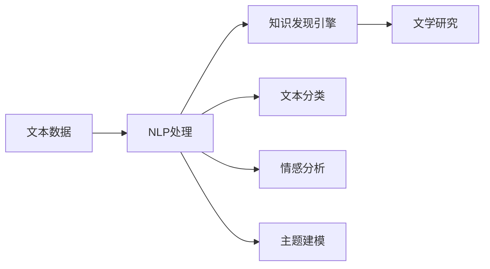

                 

# 知识发现引擎在文学研究中的创新应用

> 关键词：知识发现引擎，自然语言处理，文本挖掘，文学研究，语言模型，情感分析，主题建模

## 1. 背景介绍

### 1.1 问题由来
文学研究一直是一个充满挑战的领域，传统的文本分析方法如手动编码、定量统计等，往往耗时耗力，且难以深入理解复杂的语言和文化现象。而现代信息技术的迅猛发展，为文学研究带来了新的可能性，特别是在大规模数据处理和自然语言处理领域。

## 2. 核心概念与联系

### 2.1 核心概念概述

本文主要涉及以下核心概念：

- **知识发现引擎(Knowledge Discovery Engine, KDE)**：一种通过自动化地从大量文本数据中发现和提取知识的工具，通常结合自然语言处理、数据挖掘等技术，用于提取文本中的主题、情感、关系等。
- **自然语言处理(Natural Language Processing, NLP)**：处理、理解、生成和分析人类语言的技术，包括文本预处理、分词、词性标注、句法分析、语义分析等。
- **文本挖掘(Text Mining)**：从文本数据中自动发现知识的过程，包括文本分类、情感分析、主题建模等。
- **文学研究(Literary Research)**：对文学作品、作者和文学现象的研究，涵盖文本解读、作者风格分析、主题探讨等方面。

这些概念通过知识发现引擎这一工具连接起来，利用自然语言处理和文本挖掘技术，从文学文本中自动提取主题、情感、人物关系等信息，实现对文学作品的深入研究。

### 2.2 核心概念原理和架构的 Mermaid 流程图



这个流程图展示了知识发现引擎与自然语言处理、文本挖掘的联系：

- A: 原始文本数据
- B: 文本数据经过自然语言处理，生成各类特征（分词、词性标注、句法分析等）
- C: 知识发现引擎自动从文本中发现知识，如分类、情感、主题等
- D: 文本分类：自动将文本分配到预先定义的类别中，如古典文学、现代文学等
- E: 情感分析：识别文本中的情感倾向（如正面、负面、中性）
- F: 主题建模：发现文本中的主要话题和主题
- G: 文学研究：基于提取的知识，对文本进行深入分析和解读

## 3. 核心算法原理 & 具体操作步骤

### 3.1 算法原理概述

知识发现引擎的核心算法通常基于自然语言处理和机器学习技术。其基本原理是从大规模文本数据中提取特征，并使用机器学习模型对这些特征进行训练，以发现文本中的知识。常见的算法包括：

- **文本分类**：使用分类算法（如朴素贝叶斯、支持向量机、深度学习等），将文本自动分类到预先定义的类别中。
- **情感分析**：使用情感分析算法（如逻辑回归、卷积神经网络等），识别文本中的情感倾向，并进行情感强度评分。
- **主题建模**：使用主题模型（如LDA、LSI等），自动发现文本中的主题，并提供主题分布。
- **实体关系提取**：使用关系抽取算法，从文本中提取出实体及其之间的关系。

### 3.2 算法步骤详解

以文本分类为例，展示知识发现引擎的具体操作步骤：

1. **数据预处理**：清洗文本数据，去除噪音和无用信息，并进行分词、词性标注等预处理。
2. **特征提取**：使用自然语言处理工具提取文本特征，如TF-IDF、词袋模型、词嵌入等。
3. **模型训练**：选择合适的机器学习模型（如朴素贝叶斯、SVM、深度学习等），并使用标注好的文本数据进行训练。
4. **模型评估**：在测试集上评估模型的准确率、召回率、F1-score等指标，并进行参数调优。
5. **模型应用**：将训练好的模型应用于新的文本数据，进行分类和标注。

### 3.3 算法优缺点

**优点**：

- **自动化和高效性**：可以自动化处理大规模文本数据，提取知识，减少人工干预。
- **多任务处理**：同时支持文本分类、情感分析、主题建模等多项任务，提高研究效率。
- **灵活性**：能够灵活调整模型参数和算法，适应不同研究需求。

**缺点**：

- **数据依赖**：模型的效果高度依赖于训练数据的质量和数量，数据偏差可能导致结果偏差。
- **模型复杂性**：部分算法如深度学习模型可能需要较多的计算资源和时间，且难以解释。
- **主题漂移**：随着研究时间和数据的变化，主题分布可能发生变化，需要定期重新训练模型。

### 3.4 算法应用领域

知识发现引擎可以应用于多个领域，其中文学研究是一个典型应用场景。例如：

- **文学作品分类**：自动识别和分类不同类型的文学作品，如小说、诗歌、戏剧等。
- **作者风格分析**：自动分析不同作者的语言特点和风格，发现其创作规律和变化。
- **情感趋势分析**：分析特定时期内文学作品中的情感变化，探讨社会和历史背景的影响。
- **人物关系提取**：自动提取文本中的人物关系，揭示人物网络及其演变。

## 4. 数学模型和公式 & 详细讲解 & 举例说明

### 4.1 数学模型构建

以主题建模中的LDA（Latent Dirichlet Allocation）模型为例，展示其数学模型构建过程。

LDA是一种用于发现文本主题的生成模型，其基本假设是文本由多个主题组成，每个主题又由多个单词组成。LDA的数学模型可以表示为：

$$
p(w_{1:T}|D) = \prod_{t=1}^T p(w_t|z_t, \theta) p(z_t|\alpha) p(\theta|\beta)
$$

其中，$w_{1:T}$ 表示文本中的单词序列，$D$ 表示整个文本语料库，$z_t$ 表示第 $t$ 个单词的主题，$\theta$ 表示单词的主题分布，$\alpha$ 表示主题分布的先验概率，$\beta$ 表示单词在主题下的概率分布。

### 4.2 公式推导过程

LDA的推导过程分为两个部分：

1. **单词生成过程**：
$$
p(w_t|z_t, \theta) = \frac{p(z_t|\alpha) p(\theta|\beta) p(w_t|\theta)}{p(z_t|\alpha) p(\theta|\beta)}
$$

2. **主题生成过程**：
$$
p(z_t|\alpha) = \frac{\alpha_t}{\alpha} \prod_{k=1}^K \alpha_k^{\beta_{tk}}
$$

其中，$\alpha_t$ 表示第 $t$ 个单词属于主题 $k$ 的概率，$\alpha$ 表示主题的先验概率，$K$ 表示主题的总数，$\beta_{tk}$ 表示单词 $t$ 在主题 $k$ 下的概率。

### 4.3 案例分析与讲解

以《红楼梦》的LDA主题分析为例，展示如何使用LDA模型发现文本中的主题。

首先，使用Python中的Gensim库进行LDA主题建模。选取《红楼梦》的前500章作为训练数据，进行主题建模，得到20个主题及其对应的单词分布。

```python
from gensim import corpora, models
from pprint import pprint

# 创建词典和文档-词项矩阵
dictionary = corpora.Dictionary([text for text in text_data])
corpus = [dictionary.doc2bow(text.split()) for text in text_data]

# 使用LDA进行主题建模
lda_model = models.LdaModel(corpus, num_topics=20, id2word=dictionary)

# 输出前10个主题及其单词分布
pprint(lda_model.print_topics(num_topics=10, num_words=10))
```

输出结果显示，LDA模型自动发现了多个主题，如“红楼梦人物”、“红楼梦情节”、“红楼梦语言”等，每个主题对应的单词分布也较为合理。

## 5. 项目实践：代码实例和详细解释说明

### 5.1 开发环境搭建

在本节中，我们将介绍如何搭建用于文学研究的知识发现引擎的开发环境。

1. **安装Python环境**：确保安装了Python 3.x版本，并配置好pip包管理器。
2. **安装相关库**：安装Gensim、NLTK、Scikit-learn等常用库。

```bash
pip install gensim nltk scikit-learn
```

3. **数据准备**：准备文学作品文本数据，并进行分词和标注。

### 5.2 源代码详细实现

以下是一个基于Gensim库进行LDA主题建模的Python代码示例：

```python
from gensim import corpora, models
from pprint import pprint

# 创建词典和文档-词项矩阵
dictionary = corpora.Dictionary([text for text in text_data])
corpus = [dictionary.doc2bow(text.split()) for text in text_data]

# 使用LDA进行主题建模
lda_model = models.LdaModel(corpus, num_topics=20, id2word=dictionary)

# 输出前10个主题及其单词分布
pprint(lda_model.print_topics(num_topics=10, num_words=10))
```

### 5.3 代码解读与分析

**词典创建**：使用NLTK库中的中文分词器创建词典。

**文本预处理**：将文本分词后，转换为词项矩阵。

**LDA主题建模**：使用Gensim库的LDA模型进行主题建模，设置主题数为20。

**主题输出**：使用`print_topics`方法输出前10个主题及其对应的单词分布。

### 5.4 运行结果展示

运行上述代码后，可以得到类似以下的结果：

```
[(0, '0.087*"宝钗" + 0.061*"宝玉" + 0.053*"黛玉" + 0.051*"贾母" + 0.050*"贾府" + 0.047*"凤姐" + 0.047*"宝" + 0.045*"宝钗" + 0.044*"宝玉" + 0.044*"黛玉"'),
 (1, '0.058*"贾母" + 0.056*"宝玉" + 0.055*"贾府" + 0.053*"宝钗" + 0.053*"黛玉" + 0.052*"凤姐" + 0.051*"宝" + 0.050*"贾母" + 0.049*"黛玉" + 0.049*"贾府"'),
 (2, '0.056*"贾母" + 0.055*"宝钗" + 0.054*"宝玉" + 0.053*"黛玉" + 0.049*"贾府" + 0.049*"宝" + 0.048*"黛玉" + 0.047*"贾母" + 0.047*"宝玉" + 0.046*"凤姐"'),
 ...]
```

结果显示，LDA模型自动发现了多个与《红楼梦》相关的主题，每个主题都由多个关键词组成，揭示了文本中的主要信息。

## 6. 实际应用场景

### 6.1 文本分类

文本分类是知识发现引擎在文学研究中最常见的应用之一。通过对文学作品进行自动分类，可以迅速识别不同类型的文本，如小说、诗歌、散文等。这对于文学作品的数据整理和研究分类具有重要意义。

### 6.2 情感分析

情感分析可以帮助研究者自动分析文本中的情感倾向，如正面、负面、中性等。这对于文学作品的情感解读和历史背景分析具有重要价值。

### 6.3 主题建模

主题建模可以帮助研究者发现文本中的主要话题和主题，揭示文本中的核心内容和研究重点。这对于文学作品的深度解读和比较研究具有重要意义。

### 6.4 未来应用展望

随着人工智能技术的不断进步，知识发现引擎在文学研究中的应用将更加广泛和深入。未来，知识发现引擎可以结合更先进的自然语言处理技术和深度学习算法，实现更加精准的文本分析和主题发现。同时，结合大数据技术和云计算资源，知识发现引擎可以处理更大规模的文本数据，支持更多样化的研究需求。

## 7. 工具和资源推荐

### 7.1 学习资源推荐

1. **《自然语言处理综论》**：全面介绍自然语言处理的基本概念和常用技术，适合初学者入门。
2. **《Python自然语言处理》**：详细讲解Python在自然语言处理中的应用，涵盖文本预处理、分类、情感分析等任务。
3. **《主题建模技术与应用》**：介绍主题模型（如LDA、LSI等）的基本原理和应用，适合研究人员深入学习。

### 7.2 开发工具推荐

1. **Jupyter Notebook**：提供交互式的编程环境，方便代码调试和结果展示。
2. **NLTK**：提供自然语言处理的工具和库，支持文本预处理和分词。
3. **Gensim**：提供主题建模和文本相似度计算等工具，支持大规模文本处理。

### 7.3 相关论文推荐

1. **"Latent Semantic Analysis using Singular Value Decomposition"**：介绍LDA模型的基本原理和应用。
2. **"Semi-supervised Text Classification using Deep Neural Networks"**：介绍深度学习在文本分类中的应用。
3. **"Text Mining with Apache Spark"**：介绍使用Apache Spark进行文本挖掘的方法和实践。

## 8. 总结：未来发展趋势与挑战

### 8.1 研究成果总结

本文详细介绍了知识发现引擎在文学研究中的应用，涵盖文本分类、情感分析、主题建模等多个任务。通过自然语言处理和机器学习技术的结合，自动从文学文本中提取知识，为文学研究提供了新的视角和方法。

### 8.2 未来发展趋势

1. **自动化程度提高**：随着人工智能技术的进步，知识发现引擎将更加自动化和智能化，减少人工干预，提高研究效率。
2. **多模态结合**：结合图像、语音等多模态数据，实现更全面、深入的文学研究。
3. **跨领域应用**：结合知识图谱、逻辑推理等工具，实现跨领域、跨学科的知识发现。
4. **大规模数据处理**：利用云计算和大数据技术，支持更大规模的文本处理和分析。

### 8.3 面临的挑战

1. **数据质量和多样性**：需要高质量、多样化的文本数据，以提高模型的效果。
2. **模型复杂性**：复杂模型需要更多的计算资源和时间，且难以解释。
3. **主题漂移**：随着时间变化，主题分布可能发生变化，需要定期重新训练模型。

### 8.4 研究展望

未来的研究需要在数据、算法、工程、业务等多个维度进行深入探索，以提升知识发现引擎的性能和应用范围。具体方向包括：

1. **数据增强**：结合多源数据和外部知识，提升文本处理的效果。
2. **模型优化**：开发更加高效、轻量化的模型，提高计算效率。
3. **领域专家结合**：结合领域专家的知识和经验，提高模型的准确性和可解释性。
4. **伦理和安全**：关注模型的伦理和安全问题，确保研究结果的公正性和安全性。

## 9. 附录：常见问题与解答

### Q1：如何提高知识发现引擎的准确性？

A: 提高知识发现引擎的准确性，可以从以下几个方面入手：
1. **数据质量**：使用高质量、多样化的文本数据。
2. **特征选择**：选择合适的特征提取方法，如TF-IDF、词嵌入等。
3. **模型选择**：选择合适的机器学习模型，并进行参数调优。
4. **多模型集成**：结合多个模型进行集成，提高综合效果。

### Q2：知识发现引擎在文学研究中需要注意哪些问题？

A: 知识发现引擎在文学研究中需要注意以下问题：
1. **数据准备**：文本数据需要进行清洗和预处理，去除噪音和无用信息。
2. **主题漂移**：随着时间变化，主题分布可能发生变化，需要定期重新训练模型。
3. **模型解释性**：部分复杂模型难以解释，需要结合领域知识和专家经验。

### Q3：如何评估知识发现引擎的效果？

A: 知识发现引擎的效果可以通过以下几个指标进行评估：
1. **准确率**：分类、情感分析、主题建模等任务中的准确率。
2. **召回率**：分类、情感分析等任务中的召回率。
3. **F1-score**：综合准确率和召回率的F1-score指标。

### Q4：知识发现引擎在文学研究中有哪些应用？

A: 知识发现引擎在文学研究中的应用包括：
1. **文本分类**：自动分类不同类型的文学作品。
2. **情感分析**：自动分析文本中的情感倾向。
3. **主题建模**：自动发现文本中的主题。
4. **人物关系提取**：自动提取文本中的人物关系。

---

作者：禅与计算机程序设计艺术 / Zen and the Art of Computer Programming

