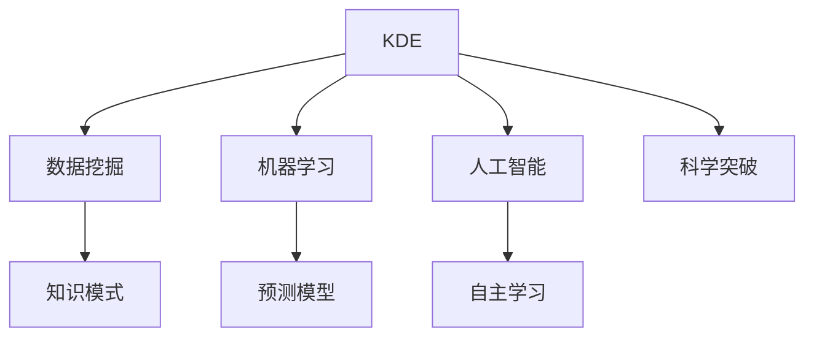

                 

# 知识发现引擎如何加速科学突破

> 关键词：知识发现引擎, 数据挖掘, 数据科学, 大数据, 人工智能, 科学突破

## 1. 背景介绍

### 1.1 问题由来

在当前信息爆炸的时代，科学研究的深度和广度都在不断扩展，知识的数量和结构变得异常复杂。如何在海量的数据中发现隐藏的知识，提取有价值的信息，成为科学界的一大难题。传统的基于经验和直觉的科学研究方法已难以应对数据驱动的现代科学研究需求。

知识发现引擎（Knowledge Discovery Engine, KDE）作为一种智能化的数据分析工具，通过自动化地从海量数据中提取模式和规律，为科研人员提供了新的科研思路和发现方向。通过运用知识发现引擎，可以加速科学突破，引领学科前沿，从而推动科学技术的进步。

### 1.2 问题核心关键点

知识发现引擎的核心思想是利用先进的数据挖掘和机器学习技术，从数据中自动发现和挖掘潜在的知识模式和规律。其基本流程包括以下几个关键点：

1. **数据采集与预处理**：收集和整理各类科研数据，进行清洗和处理，确保数据质量和完整性。
2. **特征工程**：选择合适的特征，进行数据转换和降维，以便后续分析。
3. **模型构建与训练**：应用数据挖掘和机器学习模型，如聚类、分类、关联规则等，对数据进行分析。
4. **知识发现与解释**：基于模型输出，识别和解释潜在知识模式，提取有价值的信息。
5. **验证与反馈**：通过实验验证知识发现结果的有效性，进行模型优化和调整。

通过这些关键步骤，知识发现引擎能够高效地从大规模数据集中挖掘出潜在的知识，加速科学研究的进程。

### 1.3 问题研究意义

研究知识发现引擎如何加速科学突破，对于提升科研效率、推动科学技术进步具有重要意义：

1. **加速科学发现**：通过自动化数据挖掘和分析，知识发现引擎能够快速揭示科学问题，为科研人员提供新的研究方向。
2. **提升研究质量**：利用先进的数据挖掘技术，可以发现更精细、更深入的科学规律，提升研究质量和深度。
3. **促进交叉学科融合**：知识发现引擎能够跨领域融合不同学科的数据，促进学科之间的交流与合作。
4. **提高科研决策水平**：基于数据的科学决策，能够减少科研方向的盲目性和不确定性，提升科研决策的准确性和效率。
5. **加速科研成果产业化**：知识发现引擎能够揭示新的应用方向，推动科研成果的快速转化。

## 2. 核心概念与联系

### 2.1 核心概念概述

为更好地理解知识发现引擎的工作原理，本节将介绍几个密切相关的核心概念：

- **知识发现引擎（KDE）**：一种利用数据挖掘和机器学习技术，从大规模数据中自动发现和提取知识模式的智能化工具。
- **数据挖掘（Data Mining）**：从大规模数据中自动或半自动地发现潜在的知识模式和规律的过程。
- **机器学习（Machine Learning）**：一种基于数据训练模型，并利用模型对新数据进行预测和分析的技术。
- **人工智能（Artificial Intelligence）**：通过让计算机模拟人类智能行为，实现自主学习和决策的技术。
- **科学突破**：基于已有知识基础，通过创新性研究方法，在科学领域取得的重大发现或理论进展。

这些概念之间的逻辑关系可以通过以下Mermaid流程图来展示：



这个流程图展示了几者之间的紧密联系：

1. KDE通过数据挖掘和机器学习技术，从大规模数据中自动发现知识模式。
2. 数据挖掘和机器学习模型构建的预测模型，可以为KDE提供更精确的知识发现。
3. 人工智能中的自主学习机制，使得KDE能够不断优化自身算法，提升知识发现效果。
4. 通过KDE挖掘出的知识模式，可以直接应用于科学突破，推动科学进步。

这些概念共同构成了知识发现引擎的运行框架，使其能够在各种场景下发挥强大的知识挖掘能力。

## 3. 核心算法原理 & 具体操作步骤
### 3.1 算法原理概述

知识发现引擎的算法原理主要基于数据挖掘和机器学习的最新研究成果，通过构建和训练不同的数据挖掘模型，自动从数据中发现潜在的知识模式和规律。常用的数据挖掘模型包括聚类、分类、关联规则等。

以聚类为例，聚类算法的基本思想是将数据集划分为若干个相似的子集，使得同一子集中的数据点相似度较高，而不同子集之间的数据点差异较大。常用的聚类算法包括K-Means、层次聚类、DBSCAN等。

知识发现引擎的工作流程如下：

1. **数据预处理**：对原始数据进行清洗、处理和转换，确保数据质量和完整性。
2. **特征提取**：选择合适的特征，进行数据转换和降维，以便后续分析。
3. **模型构建与训练**：应用聚类、分类、关联规则等模型，对数据进行分析。
4. **知识发现与解释**：基于模型输出，识别和解释潜在知识模式，提取有价值的信息。
5. **验证与反馈**：通过实验验证知识发现结果的有效性，进行模型优化和调整。

### 3.2 算法步骤详解

以下是知识发现引擎的详细操作步骤：

**Step 1: 数据预处理**
- 收集和整理各类科研数据，进行清洗和处理，确保数据质量和完整性。
- 进行数据归一化和缺失值处理，避免噪声和异常值影响分析结果。
- 进行数据降维，如主成分分析（PCA）、线性判别分析（LDA）等，减小数据维度，提升分析效率。

**Step 2: 特征工程**
- 选择合适的特征，进行数据转换和降维，以便后续分析。
- 进行特征选择，选择与目标变量相关性较高的特征，避免维度灾难。
- 进行特征提取，如文本中的TF-IDF、图像中的SIFT、音频中的MFCC等，将原始数据转换为可用于模型分析的格式。

**Step 3: 模型构建与训练**
- 应用聚类、分类、关联规则等模型，对数据进行分析。
- 聚类模型：如K-Means、层次聚类、DBSCAN等，用于发现数据集中的群集结构。
- 分类模型：如决策树、支持向量机（SVM）、神经网络等，用于对数据进行分类和预测。
- 关联规则模型：如Apriori、FP-Growth等，用于发现数据集中的关联规则。

**Step 4: 知识发现与解释**
- 基于模型输出，识别和解释潜在知识模式，提取有价值的信息。
- 聚类模型：通过分析聚类结果，识别数据集中的群集结构，提取群集中的关键特征。
- 分类模型：通过分析分类结果，识别数据集中的不同类别，提取分类特征。
- 关联规则模型：通过分析关联规则，发现数据集中的相关关系，提取关联特征。

**Step 5: 验证与反馈**
- 通过实验验证知识发现结果的有效性，进行模型优化和调整。
- 交叉验证：将数据集分为训练集和验证集，通过交叉验证评估模型性能。
- 模型优化：根据验证结果，调整模型参数和超参数，优化模型性能。
- 反馈循环：通过不断迭代优化，提升知识发现引擎的精度和可靠性。

### 3.3 算法优缺点

知识发现引擎具有以下优点：

1. **自动化程度高**：能够自动从大规模数据中发现潜在知识，减少人工干预和错误。
2. **高效性**：通过并行计算和分布式处理，能够快速处理大规模数据，缩短分析时间。
3. **灵活性**：支持多种数据类型和分析模型，能够灵活应对不同科研需求。
4. **可解释性**：通过模型输出，可以解释知识发现的机制和过程，提升研究的可信度。

同时，知识发现引擎也存在一些局限性：

1. **数据质量要求高**：需要高质量的数据，避免噪声和异常值影响分析结果。
2. **模型复杂度较高**：需要选择合适的模型，并进行参数调优，增加分析和实现的复杂度。
3. **结果解释性不足**：模型输出可能过于复杂，难以进行直观解释。
4. **适用领域有限**：对于一些特定领域的数据，可能需要定制化的算法和模型。

尽管存在这些局限性，但知识发现引擎在科学数据挖掘和分析中仍具有广泛的应用前景，为科研人员提供了强大的分析工具。

### 3.4 算法应用领域

知识发现引擎在科学研究的各个领域都有广泛的应用，例如：

- **生物信息学**：通过基因组数据挖掘，发现基因表达模式、疾病关联等信息，推动生物医学研究。
- **天文学**：通过观测数据挖掘，发现天体运动规律、星系分布等信息，推动天体物理研究。
- **气象学**：通过气候数据挖掘，发现气候变化趋势、极端天气预测等信息，推动气象科学研究。
- **经济学**：通过经济数据挖掘，发现经济规律、市场趋势等信息，推动经济学研究。
- **金融学**：通过金融数据挖掘，发现金融市场规律、风险评估等信息，推动金融学研究。
- **环境科学**：通过环境数据挖掘，发现污染源、生态系统动态等信息，推动环境科学研究。

除了上述这些经典领域外，知识发现引擎还被创新性地应用到更多场景中，如社会网络分析、智能推荐、智能制造等，为科学研究带来了新的突破。

## 4. 数学模型和公式 & 详细讲解  
### 4.1 数学模型构建

本节将使用数学语言对知识发现引擎的工作原理进行更加严格的刻画。

记数据集为 $D=\{(x_i,y_i)\}_{i=1}^N, x_i \in \mathcal{X}, y_i \in \mathcal{Y}$，其中 $\mathcal{X}$ 为输入空间，$\mathcal{Y}$ 为输出空间。假设知识发现引擎的模型为 $M:\mathcal{X} \rightarrow \mathcal{Y}$，其中 $M$ 为从数据集中自动发现和提取知识的模式。

定义模型 $M$ 在数据样本 $(x,y)$ 上的损失函数为 $\ell(M(x),y)$，则在数据集 $D$ 上的经验风险为：

$$
\mathcal{L}(M) = \frac{1}{N}\sum_{i=1}^N \ell(M(x_i),y_i)
$$

知识发现引擎的目标是最小化经验风险，即找到最优模型 $M^*$：

$$
M^* = \mathop{\arg\min}_{M} \mathcal{L}(M)
$$

在实践中，我们通常使用基于梯度的优化算法（如SGD、Adam等）来近似求解上述最优化问题。设 $\eta$ 为学习率，$\lambda$ 为正则化系数，则模型参数的更新公式为：

$$
\theta \leftarrow \theta - \eta \nabla_{\theta}\mathcal{L}(\theta) - \eta\lambda\theta
$$

其中 $\nabla_{\theta}\mathcal{L}(\theta)$ 为损失函数对模型参数 $\theta$ 的梯度，可通过反向传播算法高效计算。

### 4.2 公式推导过程

以K-Means聚类算法为例，推导聚类模型的工作原理。

设数据集 $D=\{(x_i)\}_{i=1}^N$，其中 $x_i \in \mathcal{X}$。假设聚类数为 $K$，初始化 $K$ 个聚类中心 $\mu_1,\mu_2,...,\mu_K$。

定义聚类目标函数为：

$$
J(\mu) = \sum_{i=1}^N \min_{k=1,...,K} \|x_i - \mu_k\|^2
$$

目标函数表示每个数据点 $x_i$ 到最近聚类中心 $\mu_k$ 的距离的平方和。聚类目标函数的优化过程如下：

1. 计算每个数据点 $x_i$ 到所有聚类中心 $\mu_k$ 的距离 $d(x_i,\mu_k)$。
2. 将每个数据点 $x_i$ 分配到距离最近的聚类中心 $\mu_k$，更新每个聚类中心 $\mu_k$ 为新的均值 $\bar{x}_k = \frac{1}{N_k} \sum_{i:y_i=k} x_i$，其中 $N_k$ 为属于聚类 $k$ 的数据点数量。
3. 重复步骤1和步骤2，直至聚类中心收敛或达到预设的迭代次数。

通过反复迭代，K-Means算法能够发现数据集中的群集结构，自动从数据中提取有价值的信息。

## 5. 项目实践：代码实例和详细解释说明
### 5.1 开发环境搭建

在进行知识发现引擎的实践前，我们需要准备好开发环境。以下是使用Python进行Scikit-learn开发的环境配置流程：

1. 安装Anaconda：从官网下载并安装Anaconda，用于创建独立的Python环境。

2. 创建并激活虚拟环境：
```bash
conda create -n sklearn-env python=3.8 
conda activate sklearn-env
```

3. 安装Scikit-learn：
```bash
pip install scikit-learn
```

4. 安装各类工具包：
```bash
pip install numpy pandas scikit-learn matplotlib tqdm jupyter notebook ipython
```

完成上述步骤后，即可在`sklearn-env`环境中开始实践。

### 5.2 源代码详细实现

下面我们以K-Means聚类算法为例，给出使用Scikit-learn进行聚类任务的Python代码实现。

首先，定义聚类任务的数据处理函数：

```python
from sklearn import datasets
from sklearn.preprocessing import StandardScaler
from sklearn.cluster import KMeans

# 加载数据集
iris = datasets.load_iris()
X = iris.data
y = iris.target

# 标准化数据
scaler = StandardScaler()
X_scaled = scaler.fit_transform(X)

# 定义聚类模型
kmeans = KMeans(n_clusters=3, random_state=0)
```

然后，执行聚类分析：

```python
# 执行聚类
kmeans.fit(X_scaled)

# 预测聚类标签
y_pred = kmeans.predict(X_scaled)

# 计算聚类中心
centers = kmeans.cluster_centers_
```

最后，评估聚类结果：

```python
# 计算聚类误差
from sklearn.metrics import silhouette_score
score = silhouette_score(X_scaled, y_pred)
print(f'Silhouette score: {score:.3f}')
```

以上就是使用Scikit-learn进行聚类任务的完整代码实现。可以看到，Scikit-learn提供了丰富的聚类算法，并进行了高度的封装，使得聚类任务的实现变得简单高效。

### 5.3 代码解读与分析

让我们再详细解读一下关键代码的实现细节：

**聚类任务定义**：
- 使用`datasets.load_iris()`加载鸢尾花数据集，获取特征数据 $X$ 和标签 $y$。
- 使用`StandardScaler()`对特征数据进行标准化处理，避免不同特征尺度影响聚类效果。
- 定义K-Means聚类模型，设置聚类数为3。

**聚类分析执行**：
- 使用`kmeans.fit(X_scaled)`执行聚类，将标准化后的数据 $X_{\text{scaled}}$ 作为输入。
- 使用`kmeans.predict(X_scaled)`预测聚类标签，返回每个数据点的聚类结果。
- 使用`kmeans.cluster_centers_`获取聚类中心，返回所有聚类中心的位置。

**聚类结果评估**：
- 使用`silhouette_score()`计算聚类的轮廓系数，评估聚类效果。轮廓系数越大，表示聚类效果越好。

可以看出，Scikit-learn提供的K-Means聚类算法非常简单易用，并附带了多种评估指标，方便用户评估聚类效果。

## 6. 实际应用场景
### 6.1 生物医学研究

在生物医学领域，知识发现引擎可以用于基因组数据分析、蛋白质结构预测、疾病关联研究等任务。通过分析大规模基因表达数据，知识发现引擎能够自动发现基因表达模式和基因间关联关系，加速疾病的诊断和治疗。

例如，在癌症研究中，知识发现引擎可以分析肿瘤基因组数据，发现潜在的基因突变和表达模式，为癌症治疗提供新的靶点和药物。在蛋白质结构预测中，知识发现引擎可以分析蛋白质序列和功能，发现关键氨基酸序列和结构特征，推动蛋白质工程研究。

### 6.2 天文学研究

天文学领域的数据量庞大且复杂，知识发现引擎可以用于分析天文观测数据，发现天体运动规律、星系分布等重要信息。

例如，知识发现引擎可以分析大量天文观测数据，发现恒星和星系的运动轨迹和速度，揭示星系的演化过程和结构特征。通过分析星系分布和运动规律，知识发现引擎还可以预测新的恒星和星系的存在，推动天体物理研究。

### 6.3 社会科学研究

社会科学领域的研究依赖于大规模数据，知识发现引擎可以用于分析社会网络、市场行为、公共政策等数据，发现社会规律和趋势。

例如，在社会网络分析中，知识发现引擎可以分析社会关系和网络结构，发现关键节点和社群关系，推动社会学研究。在市场行为分析中，知识发现引擎可以分析消费数据和市场趋势，发现消费行为模式和市场变化规律，推动经济学研究。

### 6.4 未来应用展望

随着知识发现引擎技术的不断进步，其在科学研究中的应用前景将更加广阔。

未来，知识发现引擎有望实现更加精细和自动化的数据分析，提供更加深入和准确的科学发现。例如，在化学研究中，知识发现引擎可以分析化学分子结构数据，发现新的化学反应路径和药物分子，推动新药研发。在环境科学中，知识发现引擎可以分析环境数据，发现污染源和生态系统动态，推动环境保护和可持续发展。

## 7. 工具和资源推荐
### 7.1 学习资源推荐

为了帮助开发者系统掌握知识发现引擎的理论基础和实践技巧，这里推荐一些优质的学习资源：

1. 《Python数据科学手册》系列博文：由数据科学家撰写，深入浅出地介绍了数据挖掘和机器学习的基础知识和常用算法。

2. Coursera《数据挖掘与统计学习》课程：由斯坦福大学教授开设的在线课程，系统讲解数据挖掘和统计学习的原理和应用。

3. 《Pattern Recognition and Machine Learning》书籍：由机器学习权威Christopher Bishop所著，全面介绍了机器学习的基本理论和经典算法。

4. Scikit-learn官方文档：Scikit-learn库的官方文档，提供了丰富的算法实现和示例代码，是学习知识发现引擎的重要资源。

5. Kaggle数据科学竞赛：Kaggle提供了大量的公开数据集和竞赛任务，帮助开发者实战练习数据挖掘和机器学习技能。

通过对这些资源的学习实践，相信你一定能够快速掌握知识发现引擎的精髓，并用于解决实际的科研问题。

### 7.2 开发工具推荐

高效的开发离不开优秀的工具支持。以下是几款用于知识发现引擎开发的常用工具：

1. Python：基于动态语言的Python是数据科学和机器学习领域的标准工具，拥有丰富的科学计算和数据分析库。
2. Scikit-learn：由Python社区维护的机器学习库，提供了丰富的算法和工具，方便开发者快速实现知识发现引擎。
3. R语言：统计分析和数据挖掘领域的领先语言，拥有大量的数据分析和可视化库。
4. RapidMiner：一款数据挖掘和机器学习平台，提供可视化的数据分析工具和丰富的算法库。
5. Weka：开源数据挖掘软件，支持多种数据挖掘算法和工具，方便开发者快速构建知识发现引擎。

合理利用这些工具，可以显著提升知识发现引擎的开发效率，加快创新迭代的步伐。

### 7.3 相关论文推荐

知识发现引擎的发展源于学界的持续研究。以下是几篇奠基性的相关论文，推荐阅读：

1. K-Means算法：由MacQueen提出，是聚类分析的经典算法，广泛应用于数据挖掘和模式识别领域。
2. DBSCAN算法：由Ester等提出，用于发现任意形状的群集，适用于复杂数据集。
3. 信息检索技术：由Salton等提出，通过文本分析和相似度计算，实现信息检索和推荐。
4. 关联规则挖掘：由Agrawal等提出，用于发现大型交易数据库中的关联规则，应用于市场篮分析。

这些论文代表了大数据挖掘和机器学习的经典研究，为知识发现引擎的发展提供了理论基础。

## 8. 总结：未来发展趋势与挑战

### 8.1 总结

本文对知识发现引擎的工作原理和实际应用进行了全面系统的介绍。首先阐述了知识发现引擎的基本概念和核心思想，明确了其在科学数据挖掘和分析中的重要作用。其次，从原理到实践，详细讲解了知识发现引擎的算法原理和操作步骤，给出了代码实例和详细解释。同时，本文还广泛探讨了知识发现引擎在各个科学领域的应用前景，展示了其强大的数据挖掘能力。

通过本文的系统梳理，可以看到，知识发现引擎已经在大规模数据挖掘和分析中发挥了重要作用，为科研人员提供了新的研究方向和工具。未来，伴随知识发现引擎技术的不断进步，其在科学研究中的应用将更加广泛和深入，推动科学技术的进一步发展。

### 8.2 未来发展趋势

展望未来，知识发现引擎将呈现以下几个发展趋势：

1. **自动化和智能化**：知识发现引擎将变得更加自动化和智能化，能够自动发现更加复杂和深入的知识模式，提升科学研究的效率和质量。
2. **多模态融合**：知识发现引擎将支持多种数据类型和分析模型，实现跨领域的数据融合和分析，推动交叉学科的发展。
3. **大规模分布式计算**：知识发现引擎将支持大规模分布式计算，能够高效处理海量数据，加速科学数据的挖掘和分析。
4. **实时化和交互式**：知识发现引擎将支持实时分析和交互式操作，能够及时响应科研需求，提供实时数据分析服务。
5. **可解释性和透明性**：知识发现引擎将具备更强的可解释性和透明性，能够提供更加直观和可靠的分析结果，增强科研的可信度。
6. **开源化和社区化**：知识发现引擎将更加开源化和社区化，促进科学数据的共享和协作，推动科学研究的发展。

这些趋势将进一步拓展知识发现引擎的应用范围，提升其科学研究和决策辅助的能力，为科学研究带来新的突破。

### 8.3 面临的挑战

尽管知识发现引擎在科学研究中取得了显著成果，但在迈向更加智能化和自动化应用的过程中，仍面临诸多挑战：

1. **数据质量和完整性**：需要高质量和完整的数据，避免噪声和缺失值影响分析结果。
2. **算法复杂度**：需要选择合适的算法和模型，并进行参数调优，增加分析和实现的复杂度。
3. **计算资源需求**：需要高性能计算资源，如GPU、TPU等，处理大规模数据。
4. **结果可解释性**：模型输出可能过于复杂，难以进行直观解释。
5. **适用领域限制**：对于一些特定领域的数据，可能需要定制化的算法和模型。

尽管存在这些挑战，但知识发现引擎在科学研究中的应用前景仍然广阔。未来，随着数据科学和机器学习技术的不断发展，知识发现引擎将进一步提升其自动化和智能化水平，为科学研究提供更加强大的工具。

### 8.4 研究展望

面向未来，知识发现引擎的研究方向包括：

1. **模型融合与协同**：结合不同算法的优势，构建更加复杂和强大的知识发现引擎，提高分析效果和效率。
2. **多模态数据融合**：支持多种数据类型和分析模型，实现跨领域的数据融合和分析，推动交叉学科的发展。
3. **自适应与动态调整**：开发自适应知识发现引擎，能够根据数据变化动态调整算法和模型，提高分析的灵活性和可靠性。
4. **可解释性和透明性**：提高知识发现引擎的透明性和可解释性，提供更加直观和可靠的分析结果，增强科研的可信度。
5. **分布式计算与存储**：支持大规模分布式计算和存储，能够高效处理海量数据，加速科学数据的挖掘和分析。
6. **开源化和社区化**：推动知识发现引擎的开源化和社区化，促进科学数据的共享和协作，推动科学研究的发展。

这些研究方向将进一步拓展知识发现引擎的应用范围，提升其科学研究和决策辅助的能力，为科学研究带来新的突破。

## 9. 附录：常见问题与解答

**Q1：知识发现引擎是否适用于所有科学数据？**

A: 知识发现引擎适用于多种科学数据类型，如文本、图像、音频、视频等。但其适用性和效果受数据类型和分析需求的影响。对于一些特定领域的数据，可能需要定制化的算法和模型。

**Q2：如何选择合适的水分算法和模型？**

A: 选择合适的水浸算法和模型需要考虑数据类型、分析目标和数据规模等因素。例如，对于文本数据，K-Means和层次聚类算法效果较好；对于图像数据，SIFT和K-Means算法效果较好。对于大规模数据，需要采用分布式计算和并行处理，提高分析效率。

**Q3：如何进行模型评估和优化？**

A: 模型评估和优化可以通过交叉验证、轮廓系数、F1分数等指标进行。交叉验证可以评估模型在不同数据集上的表现，轮廓系数可以评估聚类效果的内部一致性和分离度，F1分数可以评估分类模型的准确率和召回率。优化模型需要调整超参数，如聚类数、迭代次数、正则化系数等，以达到最优的模型性能。

**Q4：如何提高知识发现引擎的可解释性？**

A: 提高知识发现引擎的可解释性需要结合领域知识和统计分析，提供更加直观和可靠的分析结果。例如，在聚类分析中，可以通过可视化聚类结果和关键特征，解释聚类的含义和作用。在分类分析中，可以通过展示分类边界和特征权重，解释分类的依据和机制。

**Q5：知识发现引擎在实际应用中需要注意哪些问题？**

A: 在实际应用中，知识发现引擎需要注意以下几个问题：
1. 数据质量和完整性：确保数据质量和完整性，避免噪声和缺失值影响分析结果。
2. 算法复杂度：选择合适的算法和模型，并进行参数调优，优化算法性能。
3. 计算资源需求：选择高性能计算资源，处理大规模数据，提高分析效率。
4. 结果可解释性：提高知识发现引擎的透明性和可解释性，提供直观和可靠的分析结果。
5. 适用领域限制：对于一些特定领域的数据，可能需要定制化的算法和模型。

这些问题需要根据具体应用场景进行灵活处理，以确保知识发现引擎能够充分发挥其数据分析能力。

---

作者：禅与计算机程序设计艺术 / Zen and the Art of Computer Programming

