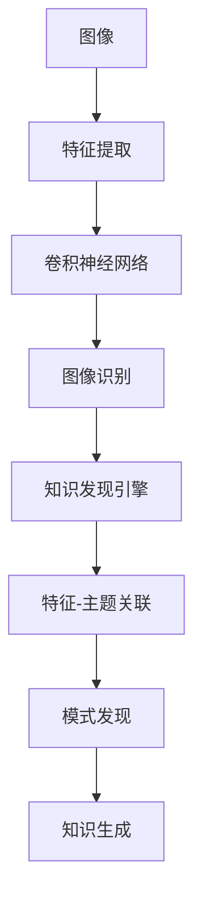

                 

# 知识发现引擎的图像识别技术应用

## 1. 背景介绍

随着人工智能技术的发展，图像识别已经成为一个越来越重要的应用领域。从自动驾驶、智能监控到医学影像分析，图像识别技术正在逐渐改变我们生活的方方面面。知识发现引擎（Knowledge Discovery Engine, KDE）则是一种专门用于挖掘数据中潜在知识的技术，能够帮助我们在海量的图像数据中发现隐藏的模式和规律。本文将探讨如何将图像识别技术应用于知识发现引擎，从而更好地挖掘图像数据的价值。

## 2. 核心概念与联系

### 2.1 核心概念概述

在进行图像识别技术在知识发现引擎中的应用时，需要了解以下几个核心概念：

- **图像识别**：通过机器学习算法，自动识别和理解图像中的内容，包括对象、场景、文本等。
- **知识发现引擎**：一种自动化的数据分析工具，通过数据挖掘、统计分析、机器学习等技术，从海量数据中挖掘出有价值的信息和知识。
- **特征提取**：从图像中提取出对分类有用的特征，通常是将图像转换成数值表示，以供机器学习算法使用。
- **深度学习**：一种基于神经网络的机器学习方法，能够自动学习特征，并适应复杂的非线性关系。
- **迁移学习**：将在大规模数据集上预训练的模型，迁移到新的小规模数据集上进行微调，以提升模型在新数据集上的性能。
- **卷积神经网络**：一种专门用于处理图像数据的人工神经网络，能够有效地提取图像中的特征。

### 2.2 核心概念原理和架构的 Mermaid 流程图



这个流程图展示了图像识别技术在知识发现引擎中的应用流程。首先，图像被转换成数值表示，然后通过卷积神经网络进行特征提取和识别。最后，知识发现引擎通过分析识别结果和特征，挖掘出数据中的模式和规律，生成新的知识。

## 3. 核心算法原理 & 具体操作步骤

### 3.1 算法原理概述

知识发现引擎的图像识别技术应用主要基于深度学习算法，尤其是卷积神经网络（Convolutional Neural Network, CNN）。CNN是一种特殊的神经网络，通过卷积层、池化层等操作，能够有效地提取图像特征，从而实现图像识别。

### 3.2 算法步骤详解

1. **数据预处理**：将原始图像转换成适合CNN处理的数值形式，通常包括图像缩放、归一化等预处理步骤。

2. **特征提取**：通过卷积神经网络对图像进行特征提取。卷积层通过滤波器在图像上滑动，提取不同的特征。池化层则通过对特征进行降维，减少计算量。

3. **图像识别**：通过全连接层将卷积层和池化层提取的特征映射到具体的类别上。常用的分类算法包括Softmax回归、交叉熵损失等。

4. **知识发现**：知识发现引擎通过对识别结果和特征进行分析和关联，挖掘出数据中的模式和规律。常用的方法包括聚类、关联规则挖掘、时间序列分析等。

### 3.3 算法优缺点

#### 优点

- **高效**：CNN能够自动提取图像特征，避免了手动特征工程的繁琐过程。
- **泛化能力强**：通过在大规模数据集上预训练，CNN能够适应复杂的非线性关系，具有较强的泛化能力。
- **灵活性高**：通过迁移学习，CNN可以适应不同的图像识别任务。

#### 缺点

- **计算资源消耗大**：CNN需要大量的计算资源进行训练和推理。
- **参数数量庞大**：CNN的参数数量庞大，增加了存储和计算的难度。
- **依赖数据质量**：CNN的效果依赖于数据的质量和数量，数据不足会导致过拟合。

### 3.4 算法应用领域

图像识别技术在知识发现引擎中的应用广泛，包括但不限于以下几个领域：

- **医学影像分析**：通过图像识别技术，可以自动识别和分类医学影像，帮助医生进行诊断和治疗决策。
- **自动驾驶**：通过对路面、交通标志等图像进行识别，自动驾驶系统可以自动规划路线，提高行车安全。
- **智能监控**：通过对视频图像进行实时识别和分析，智能监控系统可以实时发现异常行为，提供安全保障。
- **工业检测**：通过对生产过程中的图像进行识别，工业检测系统可以实时发现质量问题，提高生产效率。

## 4. 数学模型和公式 & 详细讲解 & 举例说明

### 4.1 数学模型构建

知识发现引擎的图像识别技术应用中，常用的数学模型包括：

- **卷积神经网络**：由卷积层、池化层和全连接层构成，能够自动提取图像特征。
- **Softmax回归**：一种多分类算法，将卷积神经网络提取的特征映射到不同的类别上。
- **交叉熵损失**：用于衡量分类结果与真实标签之间的差距。

### 4.2 公式推导过程

#### 卷积神经网络公式

卷积层公式：

$$
h_i^j = \sigma(\sum_k w_{i,k} * x_{i,k} + b_i)
$$

其中，$h_i^j$ 为卷积层输出，$w_{i,k}$ 为卷积核，$x_{i,k}$ 为输入图像，$\sigma$ 为激活函数，$b_i$ 为偏置项。

池化层公式：

$$
h_i^j = max(p_j^k * x_{i,k})
$$

其中，$h_i^j$ 为池化层输出，$p_j^k$ 为池化核，$x_{i,k}$ 为输入图像。

#### Softmax回归公式

$$
p(y|x) = \frac{e^{\hat{y}^T x}}{\sum_k e^{\hat{y}^T x_k}}
$$

其中，$x$ 为输入图像特征，$\hat{y}$ 为卷积神经网络提取的特征，$y$ 为类别标签。

#### 交叉熵损失公式

$$
L(y,\hat{y}) = -\sum_k y_k \log \hat{y}_k
$$

其中，$y$ 为真实标签，$\hat{y}$ 为模型预测的类别概率分布。

### 4.3 案例分析与讲解

以医学影像分类为例，假设我们有一个包含1000张肺部CT影像的数据集，其中500张为正常影像，500张为肺癌影像。我们的目标是训练一个CNN模型，能够自动区分正常影像和肺癌影像。

1. **数据预处理**：将CT影像转换成数值表示，进行缩放和归一化。

2. **特征提取**：通过卷积神经网络对影像进行特征提取。假设我们设计了一个包含两个卷积层和两个池化层的CNN模型。

3. **图像识别**：通过全连接层将提取的特征映射到正常和肺癌两个类别上。使用Softmax回归作为分类算法，交叉熵损失作为优化目标。

4. **知识发现**：对CNN提取的特征进行分析和关联，挖掘出影像中可能的病变特征，如肿瘤大小、形态等，生成新的知识。

## 5. 项目实践：代码实例和详细解释说明

### 5.1 开发环境搭建

在进行图像识别技术在知识发现引擎中的应用实践时，需要搭建以下开发环境：

1. **安装Python**：Python是一种广泛用于机器学习开发的语言，可以从官网下载安装包进行安装。

2. **安装TensorFlow**：TensorFlow是一个常用的深度学习框架，可以用于构建和训练卷积神经网络。

3. **安装Keras**：Keras是一个高级深度学习API，基于TensorFlow、Theano等框架，可以方便地进行模型构建和训练。

4. **安装PIL**：PIL是一个Python图像处理库，可以用于图像的预处理和可视化。

### 5.2 源代码详细实现

以下是一个简单的卷积神经网络在医学影像分类中的应用示例，使用TensorFlow和Keras实现：

```python
import tensorflow as tf
from tensorflow.keras import layers, models

# 定义卷积神经网络
model = models.Sequential()
model.add(layers.Conv2D(32, (3, 3), activation='relu', input_shape=(128, 128, 3)))
model.add(layers.MaxPooling2D((2, 2)))
model.add(layers.Conv2D(64, (3, 3), activation='relu'))
model.add(layers.MaxPooling2D((2, 2)))
model.add(layers.Flatten())
model.add(layers.Dense(64, activation='relu'))
model.add(layers.Dense(2, activation='softmax'))

# 编译模型
model.compile(optimizer='adam', loss='categorical_crossentropy', metrics=['accuracy'])

# 加载数据集
train_data = ...
train_labels = ...
test_data = ...
test_labels = ...

# 训练模型
model.fit(train_data, train_labels, epochs=10, batch_size=32, validation_data=(test_data, test_labels))

# 评估模型
test_loss, test_acc = model.evaluate(test_data, test_labels)
print(f'Test accuracy: {test_acc}')
```

### 5.3 代码解读与分析

在上述代码中，我们定义了一个包含两个卷积层和两个池化层的卷积神经网络，用于医学影像分类。首先，我们使用`Conv2D`层进行卷积操作，使用`MaxPooling2D`层进行池化操作，最后通过`Flatten`层将特征展平，再使用`Dense`层进行全连接操作。在最后一层使用`softmax`激活函数进行多分类预测，并使用`categorical_crossentropy`作为损失函数。

我们使用`model.compile`方法编译模型，并指定优化器、损失函数和评估指标。然后，我们使用`model.fit`方法对模型进行训练，指定训练数据、标签、训练轮数和批次大小。最后，我们使用`model.evaluate`方法评估模型性能，输出测试集上的准确率。

## 6. 实际应用场景

### 6.1 医学影像分析

在医学影像分析中，图像识别技术可以用于自动识别和分类医学影像，帮助医生进行诊断和治疗决策。例如，可以通过图像识别技术自动识别肺部CT影像中的肿瘤位置和大小，辅助医生进行肿瘤切除手术。

### 6.2 自动驾驶

在自动驾驶中，图像识别技术可以用于识别道路标志、交通信号灯等，帮助自动驾驶系统自动规划路线，提高行车安全。例如，通过图像识别技术，可以自动识别前方车辆、行人、障碍物等，实时调整行车策略。

### 6.3 智能监控

在智能监控中，图像识别技术可以用于实时发现异常行为，提供安全保障。例如，通过图像识别技术，可以自动识别监控视频中的可疑行为，如非法入侵、火灾等，及时通知安保人员进行处理。

### 6.4 工业检测

在工业检测中，图像识别技术可以用于实时发现生产过程中的质量问题，提高生产效率。例如，通过图像识别技术，可以自动识别生产线上的不合格产品，及时进行调整，减少生产成本。

## 7. 工具和资源推荐

### 7.1 学习资源推荐

- **《深度学习》**：Ian Goodfellow等著，全面介绍了深度学习的基本概念和算法。
- **《Python机器学习》**：Sebastian Raschka等著，介绍了使用Python进行机器学习的实战案例。
- **TensorFlow官方文档**：TensorFlow官方文档，提供了详细的API和示例代码，方便学习和使用。

### 7.2 开发工具推荐

- **Jupyter Notebook**：一种交互式的Python开发环境，方便进行代码调试和可视化。
- **Google Colab**：Google提供的免费云端Jupyter Notebook环境，支持GPU和TPU计算资源。
- **Keras**：一个高级深度学习API，基于TensorFlow、Theano等框架，方便构建和训练深度学习模型。

### 7.3 相关论文推荐

- **"ImageNet Classification with Deep Convolutional Neural Networks"**：Alex Krizhevsky等，介绍了CNN在ImageNet图像分类任务上的应用。
- **"Fine-tuning Pretrained Convolutional Neural Networks for Visual Recognition in medical Imaging"**：Khanh Pham等，介绍了CNN在医学影像分类任务上的应用。
- **"Deep Learning for Industrial Fault Diagnosis"**：Jingbo Liu等，介绍了CNN在工业检测中的应用。

## 8. 总结：未来发展趋势与挑战

### 8.1 研究成果总结

本文探讨了图像识别技术在知识发现引擎中的应用，通过卷积神经网络实现图像特征提取和分类。通过医学影像分类等实际应用案例，展示了图像识别技术在知识发现引擎中的潜力。

### 8.2 未来发展趋势

未来，图像识别技术在知识发现引擎中的应用将进一步深入和扩展。以下是一些可能的发展趋势：

- **更高精度**：随着深度学习模型的不断优化，图像识别技术的精度将不断提高，能够更好地挖掘数据中的知识。
- **更广泛应用**：随着技术的发展，图像识别技术将广泛应用于更多的领域，如医学、自动驾驶、智能监控等。
- **模型压缩**：随着计算资源的增加，如何压缩模型以提高效率，是一个重要的研究方向。

### 8.3 面临的挑战

尽管图像识别技术在知识发现引擎中的应用前景广阔，但仍面临一些挑战：

- **计算资源消耗大**：高精度模型需要大量的计算资源进行训练和推理，如何提高计算效率是一个重要问题。
- **数据质量依赖**：图像识别技术的效果依赖于数据的质量和数量，如何获取高质量的数据是一个重要问题。
- **模型可解释性不足**：深度学习模型通常被认为是"黑盒"系统，如何提高模型的可解释性是一个重要问题。

### 8.4 研究展望

未来的研究需要解决以下几个问题：

- **模型压缩和优化**：研究如何通过模型压缩和优化，提高图像识别技术的计算效率和可解释性。
- **数据增强和清洗**：研究如何通过数据增强和清洗，提高数据质量和多样性，提升模型的泛化能力。
- **跨领域迁移学习**：研究如何通过跨领域迁移学习，提高模型在不同领域和任务中的适应能力。

## 9. 附录：常见问题与解答

**Q1: 图像识别技术在知识发现引擎中应用有哪些优势？**

A: 图像识别技术在知识发现引擎中的应用优势主要体现在以下几个方面：

1. **自动化挖掘**：能够自动从大量数据中挖掘出有价值的信息和知识，避免了手动挖掘的繁琐过程。
2. **高精度**：通过深度学习模型，能够实现高精度的图像识别和分类。
3. **跨领域应用**：适用于多种领域和任务，如医学、自动驾驶、智能监控等。

**Q2: 如何提高图像识别技术的计算效率？**

A: 提高图像识别技术的计算效率可以从以下几个方面入手：

1. **模型压缩**：研究如何通过模型压缩，减少计算量，提高效率。
2. **硬件加速**：利用GPU、TPU等硬件加速设备，提高计算速度。
3. **分布式训练**：通过分布式训练，利用多台计算机并行计算，提高训练速度。

**Q3: 如何提高图像识别技术的可解释性？**

A: 提高图像识别技术的可解释性可以从以下几个方面入手：

1. **可视化技术**：通过可视化技术，直观展示模型的推理过程和结果。
2. **特征解释**：研究如何解释模型提取的特征，增强模型的可解释性。
3. **模型简化**：研究如何简化模型结构，降低计算复杂度，提高可解释性。

**Q4: 在知识发现引擎中，如何处理图像数据的标注数据不足问题？**

A: 在知识发现引擎中，处理图像数据的标注数据不足问题可以从以下几个方面入手：

1. **数据增强**：通过对图像进行旋转、裁剪、添加噪声等操作，生成更多的训练数据。
2. **迁移学习**：利用在大规模数据集上预训练的模型，迁移到新的小规模数据集上进行微调，提高模型在新数据集上的性能。
3. **半监督学习**：利用少量的标注数据和大量的未标注数据，训练半监督学习模型，提高模型泛化能力。

**Q5: 在图像识别技术的应用中，如何处理多模态数据？**

A: 在图像识别技术的应用中，处理多模态数据可以从以下几个方面入手：

1. **数据融合**：将图像、语音、文本等多种模态数据进行融合，提高模型对数据的理解能力。
2. **多任务学习**：研究如何在同一个模型中进行多任务学习，提高模型对不同模态数据的适应能力。
3. **联合训练**：将多个模态数据的模型进行联合训练，提高模型性能。

作者：禅与计算机程序设计艺术 / Zen and the Art of Computer Programming

