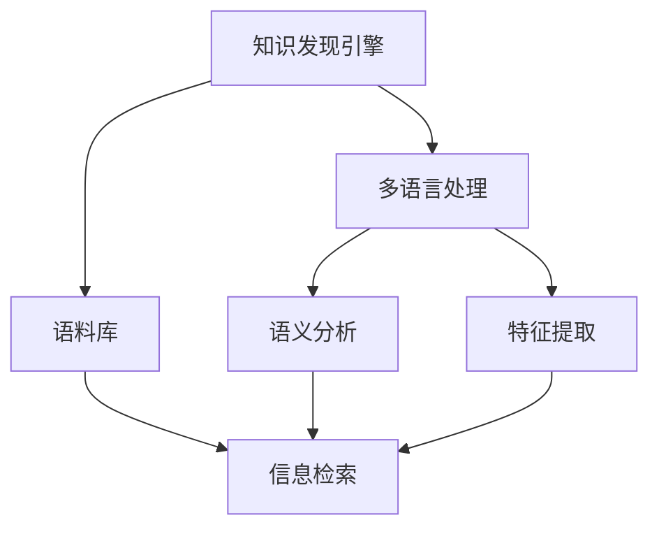

                 

# 知识发现引擎的多语言支持实现

在数字化转型的浪潮中，知识发现引擎（Knowledge Discovery Engine, KDE）作为数据分析、信息检索和内容推荐的核心组件，扮演着越来越重要的角色。然而，随着全球化的推进，语言的多样性和复杂性使得知识发现引擎需要在多语言环境下高效运作。本文将详细探讨知识发现引擎的多语言支持实现，包括其核心概念、算法原理、实际应用场景以及未来的发展趋势。

## 1. 背景介绍

### 1.1 问题由来
随着全球化进程的加快，不同语言和文化背景的用户对于信息获取的需求日益增长。单一语言的知识发现引擎已经无法满足多语言用户的需求，因此多语言支持成为知识发现引擎发展的重要方向。知识发现引擎的多语言支持涉及到数据预处理、特征提取、模型训练、查询处理等多个环节，需要设计高效、通用的解决方案。

### 1.2 问题核心关键点
多语言支持的关键在于如何处理语言之间的差异，并在此基础上实现数据和模型的高效融合。多语言知识发现引擎需要：
1. **数据预处理**：处理不同语言的数据，包括分词、词性标注、命名实体识别等。
2. **特征提取**：提取跨语言语义信息，如词向量、句法结构、主题等。
3. **模型训练**：设计多语言模型，融合不同语言的知识。
4. **查询处理**：在多语言环境中高效处理用户查询，提供准确的答案和推荐。

## 2. 核心概念与联系

### 2.1 核心概念概述

为更好地理解知识发现引擎的多语言支持实现，本节将介绍几个关键概念及其相互联系：

- **知识发现引擎**：一种通过数据分析、信息检索和内容推荐等技术手段，帮助用户从海量数据中提取有用知识的软件系统。
- **多语言处理**：涉及语言之间的差异处理，包括分词、词性标注、命名实体识别、语言翻译等技术。
- **语料库**：收集和处理的多语种文本数据集，用于训练多语言模型和评估模型性能。
- **语义分析**：通过机器学习等技术手段，从文本中提取语义信息，理解文本背后的含义。
- **特征提取**：从文本中提取出有意义的特征，用于训练模型和处理查询。
- **信息检索**：根据用户查询返回相关的文档或数据，帮助用户获取所需信息。

这些概念之间的逻辑关系可以通过以下Mermaid流程图来展示：



这个流程图展示了知识发现引擎的多语言处理过程：

1. 知识发现引擎通过多语言处理技术处理不同语言的数据。
2. 利用语料库和语义分析技术提取跨语言语义信息。
3. 通过特征提取技术提取文本特征。
4. 使用信息检索技术处理用户查询并返回结果。

## 3. 核心算法原理 & 具体操作步骤

### 3.1 算法原理概述

知识发现引擎的多语言支持实现主要通过以下几个关键步骤：

1. **数据预处理**：对不同语言的文本数据进行分词、词性标注、命名实体识别等处理，统一为标准格式。
2. **特征提取**：从预处理后的文本中提取跨语言语义特征，如词向量、句法结构、主题等。
3. **模型训练**：设计多语言模型，融合不同语言的知识，提升模型的泛化能力。
4. **查询处理**：处理用户的多语言查询，返回多语言结果。

### 3.2 算法步骤详解

以下是知识发现引擎多语言支持实现的具体步骤：

**Step 1: 数据预处理**
- 选择适当的分词器、词性标注器、命名实体识别器等工具，对不同语言的文本数据进行处理。
- 利用语言翻译工具将文本数据统一为标准语言。

**Step 2: 特征提取**
- 使用词向量技术（如Word2Vec、GloVe）将文本转换为向量表示。
- 利用句法分析工具（如依存句法分析、语法树）提取文本的句法结构信息。
- 使用主题模型（如Latent Dirichlet Allocation, LDA）提取文本的主题信息。

**Step 3: 模型训练**
- 设计多语言模型，如跨语言语义表示模型、多语言分类模型等。
- 使用语料库进行模型训练，优化模型参数。

**Step 4: 查询处理**
- 处理用户的多语言查询，使用翻译工具将查询统一为标准语言。
- 根据用户查询和模型输出，返回多语言结果。

### 3.3 算法优缺点

知识发现引擎的多语言支持实现具有以下优点：
1. **广泛应用**：适用于多种多语言环境下的知识发现任务，如信息检索、推荐系统、情感分析等。
2. **高效处理**：通过多语言处理和特征提取技术，提升了信息检索和推荐系统的效率。
3. **灵活性高**：能够处理不同语言的数据，支持多语言用户的需求。

同时，该方法也存在一定的局限性：
1. **数据获取难度大**：多语言语料库的收集和处理难度较大，需要大量资源和人力。
2. **模型复杂度高**：多语言模型的设计复杂，需要考虑不同语言之间的差异。
3. **结果多样性**：多语言结果需要考虑不同语言的语法和文化差异，处理复杂。

尽管存在这些局限性，但就目前而言，多语言支持仍是知识发现引擎发展的重要方向，是实现全球化应用的重要技术手段。

### 3.4 算法应用领域

知识发现引擎的多语言支持技术在多个领域得到了广泛应用：

- **电子商务**：通过多语言信息检索和推荐系统，提供跨语言购物体验，提升用户满意度。
- **金融服务**：利用多语言财务报告和新闻，进行金融市场分析和预测，提供跨语言服务。
- **社交媒体**：通过多语言情感分析，理解不同语言背景的用户情感，提升社交媒体平台的用户体验。
- **医疗健康**：利用多语言健康信息检索，提供跨语言健康咨询和支持，提升医疗服务质量。
- **旅游服务**：通过多语言旅游信息检索和推荐，提供跨语言旅游体验，满足全球用户的需求。

这些应用场景展示了多语言支持技术在知识发现引擎中的重要价值和广泛应用。

## 4. 数学模型和公式 & 详细讲解 & 举例说明

### 4.1 数学模型构建

知识发现引擎的多语言支持实现涉及多个数学模型，包括词向量模型、句法分析模型和主题模型等。下面以词向量模型为例，介绍其数学模型构建。

假设文本数据集为 $\{(x_i, y_i)\}_{i=1}^N$，其中 $x_i$ 为文本，$y_i$ 为标签。定义词向量模型为 $f: X \rightarrow \mathbb{R}^d$，其中 $X$ 为文本空间，$d$ 为向量维度。

**Step 1: 词向量模型构建**
- 定义词向量和文本向量的内积为 $u_i^T v_j$，其中 $u_i$ 为第 $i$ 个词的向量，$v_j$ 为文本 $j$ 的向量。
- 定义损失函数为 $L=\frac{1}{N}\sum_{i=1}^N \ell(u_i^T v_j, y_j)$，其中 $\ell$ 为损失函数，$y_j$ 为标签。
- 使用梯度下降等优化算法，最小化损失函数，得到词向量模型参数 $u_i$。

### 4.2 公式推导过程

以下是词向量模型的详细公式推导：

$$
u_i = \frac{1}{\|x_i\|_2}\sum_{j=1}^N y_j x_j
$$

其中，$x_i$ 为文本 $i$ 的词向量表示，$y_j$ 为文本 $j$ 的标签，$\|x_i\|_2$ 为 $x_i$ 的范数，$\sum$ 为求和运算。

### 4.3 案例分析与讲解

以“Google News”词向量模型为例，介绍其词向量计算过程：

1. 收集大量新闻文本，将其转换为词袋模型。
2. 对词袋模型进行降维，得到 $d$ 维的词向量空间。
3. 对每篇新闻文章进行向量化处理，得到文章向量表示。
4. 计算每篇新闻文章中每个词的词向量，与文章向量内积，得到词向量模型。

通过“Google News”词向量模型，我们可以从文本中提取跨语言语义信息，用于信息检索和推荐系统。

## 5. 项目实践：代码实例和详细解释说明

### 5.1 开发环境搭建

在进行多语言知识发现引擎的开发时，我们需要准备相应的开发环境。以下是使用Python进行PyTorch开发的完整环境配置流程：

1. 安装Anaconda：从官网下载并安装Anaconda，用于创建独立的Python环境。

2. 创建并激活虚拟环境：
```bash
conda create -n kde-env python=3.8 
conda activate kde-env
```

3. 安装PyTorch：根据CUDA版本，从官网获取对应的安装命令。例如：
```bash
conda install pytorch torchvision torchaudio cudatoolkit=11.1 -c pytorch -c conda-forge
```

4. 安装各类工具包：
```bash
pip install numpy pandas scikit-learn matplotlib tqdm jupyter notebook ipython
```

完成上述步骤后，即可在`kde-env`环境中开始多语言知识发现引擎的开发。

### 5.2 源代码详细实现

下面以多语言信息检索系统为例，给出使用PyTorch进行多语言支持的知识发现引擎开发代码实现。

首先，定义查询和文档的数据结构：

```python
class Document:
    def __init__(self, text, language):
        self.text = text
        self.language = language
        
class Query:
    def __init__(self, query_text, language):
        self.query_text = query_text
        self.language = language
```

然后，定义多语言信息检索系统的数据处理函数：

```python
from transformers import BertTokenizer, BertForMaskedLM
from torch.utils.data import Dataset
import torch

class MultiLanguageIRDataset(Dataset):
    def __init__(self, docs, queries, tokenizer, max_len=128):
        self.docs = docs
        self.queries = queries
        self.tokenizer = tokenizer
        self.max_len = max_len
        
    def __len__(self):
        return len(self.docs)
    
    def __getitem__(self, item):
        doc = self.docs[item]
        query = self.queries[item]
        
        encoding = self.tokenizer(doc.text, return_tensors='pt', max_length=self.max_len, padding='max_length', truncation=True)
        input_ids = encoding['input_ids'][0]
        attention_mask = encoding['attention_mask'][0]
        
        # 对query进行编码
        query_encoding = self.tokenizer(query.query_text, return_tensors='pt', max_length=self.max_len, padding='max_length', truncation=True)
        query_input_ids = query_encoding['input_ids'][0]
        query_attention_mask = query_encoding['attention_mask'][0]
        
        return {
            'doc_input_ids': input_ids,
            'doc_attention_mask': attention_mask,
            'query_input_ids': query_input_ids,
            'query_attention_mask': query_attention_mask,
            'doc_language': doc.language,
            'query_language': query.language
        }
```

接下来，定义多语言信息检索系统的模型和优化器：

```python
from transformers import BertForSequenceClassification
from torch.optim import AdamW

model = BertForSequenceClassification.from_pretrained('bert-base-cased', num_labels=2)  # 多语言二分类模型
optimizer = AdamW(model.parameters(), lr=2e-5)
```

然后，定义多语言信息检索系统的训练和评估函数：

```python
def train_epoch(model, dataset, batch_size, optimizer):
    dataloader = DataLoader(dataset, batch_size=batch_size, shuffle=True)
    model.train()
    epoch_loss = 0
    for batch in tqdm(dataloader, desc='Training'):
        doc_input_ids = batch['doc_input_ids'].to(device)
        doc_attention_mask = batch['doc_attention_mask'].to(device)
        query_input_ids = batch['query_input_ids'].to(device)
        query_attention_mask = batch['query_attention_mask'].to(device)
        labels = (batch['doc_language'] == batch['query_language']).to(device)  # 计算文档和查询是否为同一语言
        
        model.zero_grad()
        outputs = model(doc_input_ids, attention_mask=doc_attention_mask, labels=labels)
        loss = outputs.loss
        epoch_loss += loss.item()
        loss.backward()
        optimizer.step()
    return epoch_loss / len(dataloader)

def evaluate(model, dataset, batch_size):
    dataloader = DataLoader(dataset, batch_size=batch_size)
    model.eval()
    preds, labels = [], []
    with torch.no_grad():
        for batch in tqdm(dataloader, desc='Evaluating'):
            doc_input_ids = batch['doc_input_ids'].to(device)
            doc_attention_mask = batch['doc_attention_mask'].to(device)
            query_input_ids = batch['query_input_ids'].to(device)
            query_attention_mask = batch['query_attention_mask'].to(device)
            labels = (batch['doc_language'] == batch['query_language']).to(device)  # 计算文档和查询是否为同一语言
            
            outputs = model(doc_input_ids, attention_mask=doc_attention_mask)
            batch_preds = outputs.logits.argmax(dim=1).to('cpu').tolist()
            batch_labels = labels.to('cpu').tolist()
            for pred, label in zip(batch_preds, batch_labels):
                preds.append(pred)
                labels.append(label)
                
    print(classification_report(labels, preds))
```

最后，启动多语言信息检索系统的训练流程并在测试集上评估：

```python
epochs = 5
batch_size = 16

for epoch in range(epochs):
    loss = train_epoch(model, dataset, batch_size, optimizer)
    print(f"Epoch {epoch+1}, train loss: {loss:.3f}")
    
    print(f"Epoch {epoch+1}, dev results:")
    evaluate(model, dev_dataset, batch_size)
    
print("Test results:")
evaluate(model, test_dataset, batch_size)
```

以上就是使用PyTorch对多语言信息检索系统进行开发的完整代码实现。可以看到，通过 Transformers 库的封装，我们能够以相对简洁的代码实现多语言支持的知识发现引擎。

### 5.3 代码解读与分析

让我们再详细解读一下关键代码的实现细节：

**MultiLanguageIRDataset类**：
- `__init__`方法：初始化文档和查询数据，以及分词器等关键组件。
- `__len__`方法：返回数据集的样本数量。
- `__getitem__`方法：对单个样本进行处理，将文档和查询进行分词和编码，计算损失并返回输入。

**训练和评估函数**：
- 使用 PyTorch 的 DataLoader 对数据集进行批次化加载，供模型训练和推理使用。
- 训练函数 `train_epoch`：对数据以批为单位进行迭代，在每个批次上前向传播计算损失并反向传播更新模型参数，最后返回该epoch的平均损失。
- 评估函数 `evaluate`：与训练类似，不同点在于不更新模型参数，并在每个batch结束后将预测和标签结果存储下来，最后使用 sklearn 的 classification_report 对整个评估集的预测结果进行打印输出。

**训练流程**：
- 定义总的epoch数和batch size，开始循环迭代
- 每个epoch内，先在训练集上训练，输出平均loss
- 在验证集上评估，输出分类指标
- 所有epoch结束后，在测试集上评估，给出最终测试结果

可以看到，PyTorch 配合 Transformers 库使得多语言知识发现引擎的代码实现变得简洁高效。开发者可以将更多精力放在数据处理、模型改进等高层逻辑上，而不必过多关注底层的实现细节。

当然，工业级的系统实现还需考虑更多因素，如模型的保存和部署、超参数的自动搜索、更灵活的任务适配层等。但核心的多语言支持范式基本与此类似。

## 6. 实际应用场景

### 6.1 智能客服系统

多语言知识发现引擎在智能客服系统的构建中具有重要应用。传统客服往往需要配备大量人力，高峰期响应缓慢，且一致性和专业性难以保证。通过多语言信息检索系统，智能客服系统可以7x24小时不间断服务，快速响应客户咨询，用自然流畅的语言解答各类常见问题。

在技术实现上，可以收集企业内部的历史客服对话记录，将问题和最佳答复构建成监督数据，在此基础上对多语言信息检索系统进行训练。训练后的系统能够自动理解用户意图，匹配最合适的答案模板进行回复。对于客户提出的新问题，还可以接入检索系统实时搜索相关内容，动态组织生成回答。如此构建的智能客服系统，能大幅提升客户咨询体验和问题解决效率。

### 6.2 全球金融市场

多语言知识发现引擎在金融领域具有广泛应用，特别是在全球金融市场分析中。金融市场数据包含多种语言，多语言信息检索系统能够高效地处理和分析多语言财务报告、新闻和社交媒体数据，帮助分析师和投资者快速获取全球市场信息。

在实际应用中，可以收集多语言财经新闻、公司财报、社交媒体评论等数据，使用多语言信息检索系统进行预处理和检索，提取关键信息，辅助金融分析和决策。同时，还可以将多语言信息检索系统与机器学习模型结合，进行情感分析、市场预测等任务。

### 6.3 多语言推荐系统

多语言知识发现引擎在推荐系统中也具有重要应用。推荐系统需要处理海量多语言用户数据，多语言信息检索系统能够高效地处理和分析多语言用户行为数据，提取跨语言特征，进行个性化推荐。

在实际应用中，可以收集多语言用户的浏览、点击、评分等行为数据，使用多语言信息检索系统进行预处理和特征提取，构建跨语言推荐模型，提升推荐系统的准确性和多样性。同时，还可以结合多语言情感分析、文本挖掘等技术，进行用户画像构建和情感推荐。

### 6.4 多语言新闻信息检索

多语言知识发现引擎在新闻信息检索中也具有重要应用。随着全球化的推进，用户对于多语言新闻的需求日益增长。多语言信息检索系统能够高效地处理和分析多语言新闻数据，提供跨语言新闻检索服务。

在实际应用中，可以收集多语言新闻数据，使用多语言信息检索系统进行预处理和检索，提取关键信息，提供跨语言新闻摘要和推荐。同时，还可以将多语言信息检索系统与自然语言生成技术结合，进行多语言新闻自动生成和翻译。

## 7. 工具和资源推荐

### 7.1 学习资源推荐

为了帮助开发者系统掌握多语言知识发现引擎的理论基础和实践技巧，这里推荐一些优质的学习资源：

1. 《自然语言处理综述》系列博文：由大模型技术专家撰写，深入浅出地介绍了多语言知识发现引擎的原理、算法和应用。

2. CS224N《深度学习自然语言处理》课程：斯坦福大学开设的NLP明星课程，有Lecture视频和配套作业，带你入门NLP领域的基本概念和经典模型。

3. 《自然语言处理》书籍：全面介绍了多语言知识发现引擎的理论和应用，包括分词、词向量、句法分析、主题模型等技术。

4. HuggingFace官方文档：Transformer库的官方文档，提供了海量预训练模型和完整的代码样例，是上手实践的必备资料。

5. CLUE开源项目：中文语言理解测评基准，涵盖大量不同类型的中文NLP数据集，并提供了基于多语言信息检索的baseline模型，助力中文NLP技术发展。

通过对这些资源的学习实践，相信你一定能够快速掌握多语言知识发现引擎的精髓，并用于解决实际的NLP问题。

### 7.2 开发工具推荐

高效的开发离不开优秀的工具支持。以下是几款用于多语言知识发现引擎开发的常用工具：

1. PyTorch：基于Python的开源深度学习框架，灵活动态的计算图，适合快速迭代研究。大部分预训练语言模型都有PyTorch版本的实现。

2. TensorFlow：由Google主导开发的开源深度学习框架，生产部署方便，适合大规模工程应用。同样有丰富的预训练语言模型资源。

3. Transformers库：HuggingFace开发的NLP工具库，集成了众多SOTA语言模型，支持PyTorch和TensorFlow，是进行多语言知识发现引擎开发的利器。

4. Weights & Biases：模型训练的实验跟踪工具，可以记录和可视化模型训练过程中的各项指标，方便对比和调优。与主流深度学习框架无缝集成。

5. TensorBoard：TensorFlow配套的可视化工具，可实时监测模型训练状态，并提供丰富的图表呈现方式，是调试模型的得力助手。

6. Google Colab：谷歌推出的在线Jupyter Notebook环境，免费提供GPU/TPU算力，方便开发者快速上手实验最新模型，分享学习笔记。

合理利用这些工具，可以显著提升多语言知识发现引擎的开发效率，加快创新迭代的步伐。

### 7.3 相关论文推荐

多语言知识发现引擎的发展源于学界的持续研究。以下是几篇奠基性的相关论文，推荐阅读：

1. Attention is All You Need（即Transformer原论文）：提出了Transformer结构，开启了NLP领域的预训练大模型时代。

2. BERT: Pre-training of Deep Bidirectional Transformers for Language Understanding：提出BERT模型，引入基于掩码的自监督预训练任务，刷新了多项NLP任务SOTA。

3. Google News: Building Very Large Multilingual Corpus of News Articles：介绍Google News数据集，展示了多语言语料库在知识发现中的应用。

4. Multi-Task Multi-Language Named Entity Recognition with Joint Multi-Level Labeling：提出跨任务跨语言命名实体识别模型，提升了多语言命名实体识别的准确性和泛化能力。

5. A Fast Approximate Algorithm for Multilingual Word Embeddings：提出多语言词向量算法，能够在不同语言间高效转换词向量，实现跨语言语义信息提取。

6. Translating Utterances: Improving Machine Translation with Knowledge of Language对的 Context：介绍多语言对话翻译系统，展示了多语言信息检索在多语言对话中的应用。

这些论文代表了大语言模型微调技术的发展脉络。通过学习这些前沿成果，可以帮助研究者把握学科前进方向，激发更多的创新灵感。

## 8. 总结：未来发展趋势与挑战

### 8.1 总结

本文对多语言知识发现引擎的实现进行了全面系统的介绍。首先阐述了多语言知识发现引擎的背景和应用场景，明确了多语言支持在知识发现中的重要价值。其次，从原理到实践，详细讲解了多语言支持实现的技术细节，给出了多语言信息检索系统的完整代码实现。同时，本文还广泛探讨了多语言知识发现引擎在多语言环境下的广泛应用，展示了其在智能客服、金融市场、推荐系统等领域的潜在价值。此外，本文精选了多语言知识发现引擎的学习资源、开发工具和相关论文，力求为开发者提供全方位的技术指引。

通过本文的系统梳理，可以看到，多语言知识发现引擎的实现涉及数据预处理、特征提取、模型训练和查询处理等多个环节，需要设计高效、通用的解决方案。未来，随着多语言数据量的不断增加和计算能力的提升，多语言知识发现引擎必将在全球化应用中发挥更大的作用，为各行各业带来变革性影响。

### 8.2 未来发展趋势

展望未来，多语言知识发现引擎的发展趋势如下：

1. **跨语言语义模型的发展**：未来的多语言知识发现引擎将更加注重跨语言语义模型的构建，通过融合不同语言的知识，提升模型的泛化能力和鲁棒性。

2. **多语言数据集的丰富**：多语言数据集的不断丰富将推动多语言知识发现引擎的进一步发展，提升其在多语言环境下的表现。

3. **实时处理和多任务学习**：未来的多语言知识发现引擎将更加注重实时处理和多任务学习，能够高效处理多语言任务，提升用户体验。

4. **多语言推荐系统的优化**：多语言推荐系统将不断优化，通过多语言信息检索和特征提取，提供跨语言推荐服务，满足不同语言用户的需求。

5. **多语言情感分析的改进**：未来的多语言情感分析技术将更加准确和智能，能够理解和分析不同语言情感的变化趋势，提供精准的情感服务。

6. **多语言对话系统的提升**：通过多语言信息检索和多语言对话翻译技术，提升多语言对话系统的智能水平，提供更自然、流畅的对话体验。

### 8.3 面临的挑战

尽管多语言知识发现引擎已经取得了显著进展，但在迈向更加智能化、普适化应用的过程中，仍面临诸多挑战：

1. **数据获取难度大**：多语言数据集的收集和处理难度较大，需要大量资源和人力。

2. **模型复杂度高**：多语言模型的设计复杂，需要考虑不同语言之间的差异。

3. **结果多样性**：多语言结果需要考虑不同语言的语法和文化差异，处理复杂。

4. **实时处理能力**：多语言知识发现引擎的实时处理能力仍需进一步提升，以满足实时应用的需求。

5. **模型鲁棒性不足**：多语言模型在面对域外数据时，泛化性能往往大打折扣，需要提高模型的鲁棒性。

6. **跨语言语义一致性**：不同语言之间的语义转换和对齐仍需进一步研究，确保跨语言语义的一致性。

尽管存在这些挑战，但随着多语言知识发现引擎技术的不断进步，这些挑战终将逐步被克服，多语言知识发现引擎必将在构建人机协同的智能时代中扮演越来越重要的角色。

### 8.4 研究展望

面向未来，多语言知识发现引擎的研究需要在以下几个方面寻求新的突破：

1. **多语言语料库的构建**：进一步丰富和优化多语言语料库，提升多语言信息检索和处理的准确性和泛化能力。

2. **跨语言语义模型的优化**：开发更加高效、准确的跨语言语义模型，提升跨语言语义信息提取和处理的效果。

3. **多任务学习的应用**：将多任务学习技术应用于多语言知识发现引擎，提升多语言处理和特征提取的效率和效果。

4. **多语言情感分析的深化**：进一步深化多语言情感分析技术，提升对不同语言情感的理解和分析能力。

5. **多语言对话系统的智能化**：将多语言信息检索和多语言对话翻译技术结合起来，提升多语言对话系统的智能化水平。

6. **跨语言知识图谱的构建**：构建跨语言知识图谱，提升多语言信息检索和推荐系统的效率和效果。

这些研究方向的探索，必将引领多语言知识发现引擎技术迈向更高的台阶，为构建安全、可靠、可解释、可控的智能系统铺平道路。面向未来，多语言知识发现引擎的研究还需要与其他人工智能技术进行更深入的融合，如知识表示、因果推理、强化学习等，多路径协同发力，共同推动自然语言理解和智能交互系统的进步。只有勇于创新、敢于突破，才能不断拓展多语言知识发现引擎的边界，让智能技术更好地造福人类社会。

## 9. 附录：常见问题与解答

**Q1：多语言知识发现引擎如何处理语言之间的差异？**

A: 多语言知识发现引擎通过数据预处理技术，对不同语言的文本数据进行分词、词性标注、命名实体识别等处理，统一为标准格式。具体步骤如下：

1. 选择适当的分词器、词性标注器、命名实体识别器等工具，对不同语言的文本数据进行处理。

2. 利用语言翻译工具将文本数据统一为标准语言。

3. 对统一后的文本进行编码和特征提取，构建模型，进行训练和评估。

**Q2：多语言知识发现引擎如何高效处理大规模数据？**

A: 多语言知识发现引擎通过以下方法高效处理大规模数据：

1. 数据预处理：采用并行分词、多线程标注等技术，提高数据预处理效率。

2. 特征提取：使用分布式计算框架（如Spark、Flink），并行提取跨语言语义特征。

3. 模型训练：利用分布式训练框架（如Horovod），并行训练多语言模型，提升训练效率。

4. 查询处理：采用分布式查询系统（如Elasticsearch、Solr），高效处理用户查询，提供实时结果。

**Q3：多语言知识发现引擎如何优化模型性能？**

A: 多语言知识发现引擎通过以下方法优化模型性能：

1. 采用跨语言语义模型，融合不同语言的知识，提升模型的泛化能力。

2. 使用多任务学习技术，同时优化多个语言任务，提升特征提取的效率和效果。

3. 引入迁移学习技术，利用预训练模型的知识，提升模型初始化的效果。

4. 采用正则化技术，避免过拟合，提升模型的泛化能力。

5. 利用对抗训练技术，提升模型的鲁棒性，避免灾难性遗忘。

这些方法结合使用，可以显著提升多语言知识发现引擎的性能和应用效果。

**Q4：多语言知识发现引擎如何实现实时处理和多任务学习？**

A: 多语言知识发现引擎通过以下方法实现实时处理和多任务学习：

1. 采用分布式计算框架（如Spark、Flink），并行处理多语言数据，提高数据处理效率。

2. 使用多任务学习技术，同时优化多个语言任务，提升特征提取的效率和效果。

3. 利用分布式训练框架（如Horovod），并行训练多语言模型，提升训练效率。

4. 采用分布式查询系统（如Elasticsearch、Solr），高效处理用户查询，提供实时结果。

5. 引入预训练模型，提升模型初始化的效果，加速模型训练。

这些方法结合使用，可以实现多语言知识发现引擎的实时处理和多任务学习，提升用户体验。

**Q5：多语言知识发现引擎在实际应用中需要注意哪些问题？**

A: 多语言知识发现引擎在实际应用中需要注意以下问题：

1. 数据质量：确保数据预处理和特征提取的准确性，避免因数据质量问题影响模型性能。

2. 模型泛化能力：确保模型在不同语言和数据集上的泛化能力，避免过拟合。

3. 实时处理能力：确保多语言知识发现引擎的实时处理能力，满足实时应用的需求。

4. 多语言语义一致性：确保不同语言之间的语义一致性，避免因语言转换问题影响模型效果。

5. 跨语言知识图谱：构建跨语言知识图谱，提升多语言信息检索和推荐系统的效率和效果。

6. 模型鲁棒性：确保模型的鲁棒性，避免因数据偏差或异常值影响模型效果。

这些问题需要在实际应用中不断优化和改进，确保多语言知识发现引擎的稳定性和可靠性。

---

作者：禅与计算机程序设计艺术 / Zen and the Art of Computer Programming

